# Client Lifecycle State Machine

## Purpose

The client lifecycle state machine governs onboarding, funding, and activation of a client before they can participate
in live trading. It ensures a client's KYC, deposit, and subscription state are formally verified before capital is
allocated to archetypes.

**Cutover MVP scope (May-23):** a single demo client is walked through all states manually as a dry-run gate
(`wallet_treasury_client_flow_2026_05_10.md` Phase 7.A). The state machine is implemented in UTL
`ClientOnboardingStateMachine` and persists to GCS; no production KYC provider is wired for May-23.

**Deferred:** multi-client concurrent onboarding, production KYC provider integration (Onfido / Jumio), automated
state-progression webhooks. These items are post-cutover and tracked in
`wallet_treasury_post_cutover_custody_signing_2026_06_01.md`.

> **[DELTA 2026-05-22]** **Current state:** MVP ships with manual single-client DRAFT→LIVE walkthrough; no production
> KYC provider wired; SUSPENDED is terminal (no automated re-activation). **Planned delta:** Post-cutover items tracked
> in `wallet_treasury_post_cutover_custody_signing_2026_06_01.md`: production Onfido/Jumio KYC wiring, multi-client
> concurrent onboarding, automated state-progression webhooks, SUSPENDED recovery path. **Target architecture:**
> `ClientOnboardingStateMachine` accepts KYC provider webhooks, auto-advances on approval, and supports
> operator-initiated SUSPENDED → re-onboarding flow.

---

## State Diagram

```mermaid
stateDiagram-v2
    [*] --> DRAFT : client record created
    DRAFT --> KYC_SUBMITTED : operator submits KYC stub
    KYC_SUBMITTED --> KYC_APPROVED : approval recorded (approved_at + approval_notes)
    KYC_APPROVED --> DEPOSITED : deposit txid confirmed
    DEPOSITED --> SUBSCRIBED : ≥1 ClientShareClassSubscription added
    SUBSCRIBED --> LIVE : operator advances (no evidence)
    LIVE --> SUSPENDED : suspension_reason provided
    KYC_SUBMITTED --> SUSPENDED : suspension_reason provided
    KYC_APPROVED --> SUSPENDED : suspension_reason provided
    DEPOSITED --> SUSPENDED : suspension_reason provided
    SUBSCRIBED --> SUSPENDED : suspension_reason provided
    SUSPENDED --> [*] : terminal (no automatic recovery; requires operator action)
```



> **SUSPENDED is a terminal state** in the MVP. Recovery requires an operator to create a new client record.
> Re-activation path is deferred post-cutover.

---

## Per-Transition Evidence Requirements

| Transition                     | Required evidence fields                                       | Notes                                                     |
| ------------------------------ | -------------------------------------------------------------- | --------------------------------------------------------- |
| `[*] → DRAFT`                  | `client_id`, `client_name`, `created_at`                       | Record initialised by operator or seed script             |
| `DRAFT → KYC_SUBMITTED`        | none beyond state change                                       | KYC stub payload (`ClientKYCStub`) attached separately    |
| `KYC_SUBMITTED → KYC_APPROVED` | `approved_at: datetime`, `approval_notes: str`                 | Both fields mandatory; blank `approval_notes` rejected    |
| `KYC_APPROVED → DEPOSITED`     | `deposit_txid: str`                                            | On-chain txid or custodian reference; verified externally |
| `DEPOSITED → SUBSCRIBED`       | at least one `ClientShareClassSubscription` present for client | Machine validates presence before advancing               |
| `SUBSCRIBED → LIVE`            | none beyond state change                                       | Final operator gate confirming readiness                  |
| `Any → SUSPENDED`              | `suspension_reason: str`                                       | Non-blank; included in audit log entry                    |

The `ClientOnboardingStateMachine.advance(client_id, target_state, evidence)` method validates the evidence dict against
these requirements before writing. Missing required fields raise `MissingTransitionEvidenceError` (fail-loud; no silent
defaults).

---

## Idempotency Contract

Advancing a client to its **current state** is a **no-op**: the method returns the existing state record unchanged and
does **not** append a duplicate audit log entry. This allows retry-safe callers.

Advancing to a state **already in the past** (regression) raises `IllegalStateRegressionError`. There is no rollback
path — state only moves forward (or to SUSPENDED).

---

## Storage Layout

State is persisted to GCS at:

```
gs://{pid}-client-state/{client_id}/onboarding.json
```

`{pid}` resolves via `resolve_bucket_name(cloud="gcp", kind="client_state", env=DEPLOYMENT_ENV)` — never an inline
f-string (QG STEP 5.69 ratchet). The `onboarding.json` schema:

```json
{
  "client_id": "...",
  "state": "LIVE",
  "history": [
    {
      "from_state": "SUBSCRIBED",
      "to_state": "LIVE",
      "transitioned_at": "2026-05-13T10:00:00Z",
      "evidence": {}
    }
  ]
}
```

`history` is append-only; earlier entries are never modified. The write uses GCS CAS (precondition on object generation)
to guard concurrent writers — see manifest concurrency principle in CLAUDE.md.

---

## Cross-References

### UAC types

- `ClientOnboardingState` — 7-value enum (`DRAFT` / `KYC_SUBMITTED` / `KYC_APPROVED` / `DEPOSITED` / `SUBSCRIBED` /
  `LIVE` / `SUSPENDED`); canonical in `unified_api_contracts.canonical.domain.client`
- `ClientKYCStub` — KYC payload attached at `KYC_SUBMITTED`; fields: `full_name`, `jurisdiction`, `submitted_at`,
  `kyc_provider` (currently `STUB` for MVP)
- `ClientApiKeyMaterial` — API key credentials issued to the client post-`LIVE`; stored separately in Secret Manager
- `ClientRiskPreferences` — per-client risk limits (max drawdown, max allocation per archetype); attached at `DEPOSITED`
  or later
- `ClientShareClassSubscription` — required pre-`SUBSCRIBED`; fields: `client_id`, `share_class_id`, `archetype`,
  `allocation_pct`, `status` (`ACTIVE` / `SUSPENDED_DRAWDOWN` / `TERMINATED`)

### UTL

- `ClientOnboardingStateMachine` — shipped at UTL@b87daf02 + UTL@a93f78be; implements advance + idempotency + evidence
  validation + GCS read/write; `assert_kyc_evidence` / `assert_deposit_evidence` sub-validators

### Plans

- `wallet_treasury_client_flow_2026_05_10.md` Phase 1 — UAC types + GCS layout
- `wallet_treasury_client_flow_2026_05_10.md` Phase 2.A — `ClientOnboardingStateMachine` UTL implementation
- `wallet_treasury_client_flow_2026_05_10.md` Phase 7.A — demo client seed walkthrough (DRAFT → LIVE)

---

## Anti-Patterns

- **Never skip states.** `DRAFT → DEPOSITED` in a single call is rejected by `IllegalStateSkipError`. All intermediate
  states must be explicitly advanced through.
- **Never inline KYC PII in the audit log.** `history[].evidence` must contain references (e.g. `kyc_document_ref`) not
  raw PII fields (passport numbers, SSN). Full KYC payload stored separately in a KYC-scoped bucket with tighter IAM.
- **Never persist state in service memory.** The GCS file is the authoritative store. Services re-read on each
  `advance()` call; no in-process cache of `ClientOnboardingState`.
- **Never advance from SUSPENDED.** SUSPENDED is terminal in the MVP — attempts raise `IllegalStateRegressionError`.
