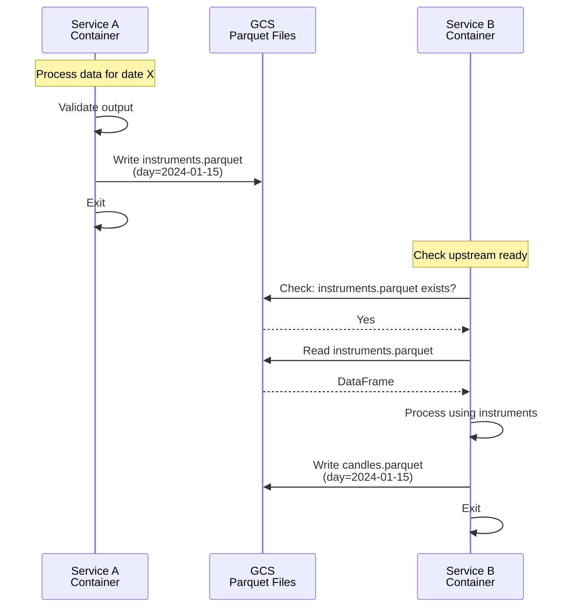
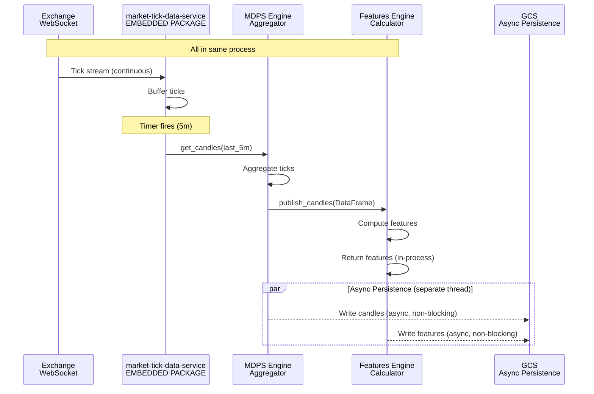
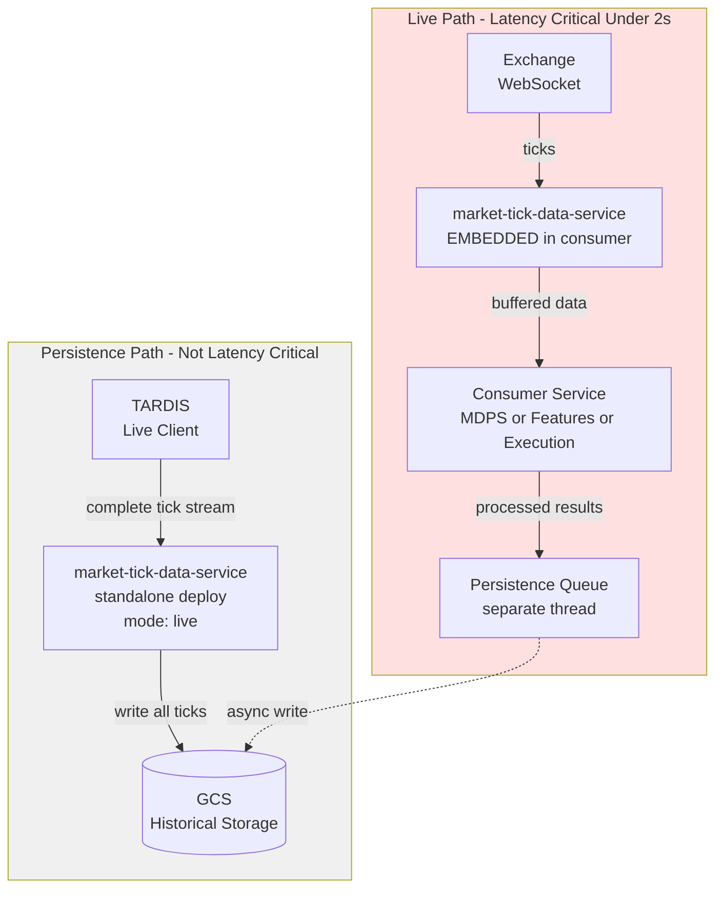
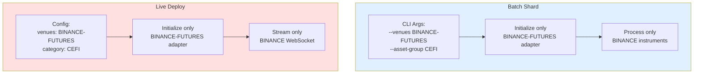

# Runtime + Deployment Topology — Per-Service Behavior, Pipeline Layers, Cluster Shapes, Diagrams

> **⚠️ Migration note (2026-05-20)**: The 3 monitoring services referenced throughout this document have been
> consolidated into `strategy-service` sub-packages: `risk-and-exposure-service` → `strategy_service/risk/`,
> `position-balance-monitor-service` → `strategy_service/position/`, `pnl-attribution-service` →
> `strategy_service/pnl/`. Launch scripts collapsed to `launch-strategy-vm.sh --operation <op>`. Current architecture:
> [`strategy-service-architecture.md`](strategy-service-architecture.md).

> **Created 2026-05-08** (Phase E.1 of `plans/active/codex_refactor_2026_05_08.md`) by merging four prior docs into one
> SSOT for the runtime + deployment topology surface:
>
> - `RUNTIME_TOPOLOGY_DECISIONS.md` (architectural decisions §1-9 — naming, UI→API→service chain, messaging rules,
>   co-location, per-service batch/live behavior; plus §10-23 — kill switches, sharding, recovery, replay, deployment
>   targets, multi-tenant isolation).
> - `deployment-topology-diagrams.md` (visual reference — batch container topology, live Redis Stream cascade, message
>   flow sequence diagrams, sports pipeline shape).
> - `api-services-cluster.md` (L10 API services cluster: ERA / strategy-api / CRA + shared FastAPI patterns).
> - `pipeline-service-layers.md` (canonical 7-layer execution order: reference → raw → processing → features → ML →
>   strategy/execution → post-trade).
>
> The four docs always read as one — what the runtime shape is, why each transport choice was made, where each service
> deploys, what each container talks to. Tier + import architecture is in
> [`tier-and-import-architecture.md`](tier-and-import-architecture.md); commercial / UX shapes are in
> [`commercial-service-families.md`](commercial-service-families.md).

**Last updated:** 2026-05-08

**Legacy node names:** Split UIs and APIs such as `live-health-monitor-ui`, `logs-dashboard-ui`, `batch-audit-ui`,
`onboarding-ui`, `batch-audit-api`, and `odum-research-website` are archived or superseded by
**`unified-trading-system-ui`**, **`deployment-ui`**, **`unified-trading-api`**, and **`auth-api`**. Canonical wiring:
**`unified-trading-pm/configs/runtime-topology.yaml`** (SSOT).

### UI surface split — deployment-ui (devops + deploy pane) vs unified-trading-system-ui (trading/research/client) (codified 2026-06-12)

Two front-ends, one shared backend, **dual-cut on launching**. Do NOT rebuild trading/DART/research surfaces inside
deployment-ui (the confusion the `deployment_ui_scope_cleanup_2026_06_12.md` plan corrected):

- **deployment-ui** = the **devops + deploy pane**: VM deployments / lifecycle, CI (Repos CI tab), epics (Epics tab),
  fleet git, alerts, data-status, safety-ops (kill-switch), chaos — PLUS the **deploy/launch consoles** (ML experiment /
  strategy backtest / execution backtest). "Launch = deploy = watch a deployment" — the deploy button targets any
  service via a CLI pointed at configs. These launch consoles POST to **deployment-api**
  (`/api/{ml/experiment,strategy/backtest,execution/backtest}/launch`, real tested routes in
  `deployment-api/deployment_api/routes/*_launch.py`).
- **unified-trading-system-ui** = the **trading + research + client surface** (DART terminal, research/ml + strategy +
  execution, manage/clients+users+subscriptions, investor relations). It can **ALSO deploy through the same
  deployment-api backend** via a research **Deploy console** (`app/(platform)/services/research/deploy`, internal/admin
  gated) — wrapping launch with config + results/experiment viewing. It reaches deployment-api through collision-free
  Next.js rewrites (`/api/deploy/*` and `/api/subscriptions` → deployment-api; NOTE `/api/ml/*` and `/api/execution/*`
  already route to unified-trading-api, hence the dedicated `/api/deploy/*` prefix). Base URL: `apiUrls.deployment` in
  `lib/config/api.ts`.
- **DART lives ONLY in unified-trading-system-ui** (`services/dart/terminal`). Client SLA-tier subscriptions UI lives in
  unified-trading-system-ui `services/manage/subscriptions`; the deployment-api `/subscriptions` backend is unchanged.
- The **deployment-api backend is the single deploy/launch + subscriptions SSOT** — shared by both UIs, never
  duplicated.

**SSOT:** `unified-trading-pm/configs/runtime-topology.yaml` (moved from `unified-trading-deployment-v3/configs/` — now
owned by PM). **Companion:** `RUNTIME_DEPLOYMENT_TOPOLOGY_DAG.svg` (deployment-service/configs/) ·
`runtime-topology.yaml` (`unified-trading-pm/configs/`, machine-readable). **Readers:**
`unified-trading-pm/codex/04-architecture/` holds symlinks to these files for easy access.

This document captures the WHY behind every topology decision. When agents or humans modify the architecture, they must
check this document first. If a change conflicts with a principle here, the principle wins — update the code, not the
principle (unless explicitly overridden by the user).

---

# Part 1 — Pipeline Service Layers (Canonical 7-Layer Execution Order)

The 7-layer service execution order for the unified trading system. Edit the Mermaid source below to regenerate the
diagram (`mmdc -i runtime-deployment-topology.md -o pipeline-service-layers.svg`).

```mermaid
flowchart TD
    subgraph L1["Layer 1 — Reference Data"]
        instr[instruments-service]
        cal[features-service (calendar family)]
    end

    subgraph L2["Layer 2 — Raw Market Data"]
        ticks[market-tick-data-service]
        corp[features-service (calendar family) (corporate-actions, earnings, FRED macro)]
    end

    subgraph L3["Layer 3 — Market Data Processing"]
        mdp["market-data-processing-service\nticks → OHLCV candles"]
    end

    subgraph L4["Layer 4 — Feature Engineering"]
        d1[features-service (delta-one family)\ntechnical indicators]
        vol[features-service (volatility family)\nvolatility surfaces]
        oc[features-service (onchain family)\non-chain signals]
    end

    subgraph L5["Layer 5 — Machine Learning"]
        train[ml-training-service]
        infer[ml-inference-service]
    end

    subgraph L6["Layer 6 — Strategy & Execution"]
        strat[strategy-service]
        exec[execution-service]
    end

    subgraph L7["Layer 7 — Post-Trade"]
        pbm[position-balance-monitor-service]
        risk[risk-and-exposure-service]
        pnl[pnl-attribution-service]
    end

    L1 --> L2
    L2 --> L3
    L3 --> L4
    L4 --> L5
    L5 --> L6
    L6 --> L7
```

## Layer Summary

| Layer                    | Services                                                                                                     | Input                          | Output                                        |
| ------------------------ | ------------------------------------------------------------------------------------------------------------ | ------------------------------ | --------------------------------------------- |
| 1 — Reference Data       | instruments-service, features-service (calendar family)                                                      | External APIs, exchange feeds  | Instrument universe, trading calendars        |
| 2 — Raw Market Data      | market-tick-data-service, features-service (calendar family) (corporate actions, earnings, macro)            | Exchange websockets, REST APIs | Raw ticks, corporate action events            |
| 3 — Processing           | market-data-processing-service                                                                               | Raw ticks                      | OHLCV candles (15s, 1m, 5m, 15m, 1h, 4h, 24h) |
| 4 — Features             | features-service (delta-one family), features-service (volatility family), features-service (onchain family) | OHLCV candles                  | Feature vectors                               |
| 5 — ML                   | ml-training-service, ml-inference-service                                                                    | Feature vectors                | Trained models, predictions                   |
| 6 — Strategy & Execution | strategy-service, execution-service                                                                          | Predictions                    | Orders, fills                                 |
| 7 — Post-Trade           | position-balance-monitor-service, risk-and-exposure-service, pnl-attribution-service                         | Fills                          | P&L, risk metrics, position state             |

**Testing implications:** Run tests layer by layer; lower layers depend on upstream artifacts. Do not run Layer 4 tests
without Layer 3 output. See `unified-trading-pm/codex/06-coding-standards/integration-testing-layers.md` for the
integration test strategy.

---

# Part 2 — Architectural Decisions

## 1. Naming Conventions

Every repo falls into exactly one category. The name MUST reflect the category:

| Category           | Naming Pattern                                    | Deploys?             | Owns Domain Data?                              | Examples                                                                                       |
| ------------------ | ------------------------------------------------- | -------------------- | ---------------------------------------------- | ---------------------------------------------------------------------------------------------- |
| **library**        | `*-interface`, `*-library`, `unified-*-interface` | No                   | No — provides protocols, schemas, utilities    | `market-tick-data-service/market_tick_data_service/market_interface`, `execution-algo-library` |
| **service**        | `*-service`                                       | Yes (Cloud Run / VM) | Yes — produces and persists domain data to GCS | `instruments-service`, `ml-training-service`                                                   |
| **ui**             | `*-ui`                                            | Yes (static hosting) | No — never reads GCS or PubSub directly        | `trading-analytics-ui`, `deployment-ui`                                                        |
| **infrastructure** | named by function                                 | Depends              | No                                             | `ibkr-gateway-infra`, `deployment-engine`                                                      |

**Rule:** If something doesn't fit a pattern, the architecture is wrong — restructure it, don't rename to hide the
mismatch.

---

## 2. UI → API → Service Chain (UI Never Owns Data)

Every UI MUST have a backing API service as its data engine. UIs never:

- Read from GCS, PubSub, BigQuery, or Redis directly
- Own domain data or business logic
- Import Python packages

The chain is always: **UI → API (HTTP/SSE) → Service (engine) → Storage/Messaging**

| UI Group                                                    | API Gateway(s)              | Engine (data source) |
| ----------------------------------------------------------- | --------------------------- | -------------------- |
| trading-analytics-ui, execution-analytics-ui, settlement-ui | execution-results-api :8002 | execution-service    |

> **Consolidation note:** `trading-analytics-ui` is functionally overlapped by the batch research UIs:
> `execution-analytics-ui` (provides live fill viewing via `execution-results-api` SSE) and `client-reporting-ui` (P&L).
> Candidate for consolidation into `execution-analytics-ui` in a future phase. See `consolidated_remaining_work.plan.md`
> todo `arch-trading-analytics-ui-consolidate`. | strategy-ui | strategy-api :8004 ⟪planned⟫ | strategy-service | |
> deployment-ui, unified-trading-system-ui (health, audit, logs, onboarding) | deployment-api :8001,
> unified-trading-api, auth-api | deployment-engine | | client-reporting-ui | client-reporting-api :8005 |
> pnl-attribution-service, risk-and-exposure-service, position-balance-monitor-service |

---

## 2a. Three Batch Research Tiers and UI Naming

Each tier of batch research work has its own dedicated UI. These are separate repos from their backing services.

| Tier                  | Purpose                                                | API Gateway            | Service engine   | UI repo         |
| --------------------- | ------------------------------------------------------ | ---------------------- | ---------------- | --------------- |
| **Strategy backtest** | Signal backtest; parameter tuning; strategy deployment | strategy-api ⟪planned⟫ | strategy-service | **strategy-ui** |

**Repo naming status:**

- `ml-training-ui` — COMPLETE. GitHub repo and local directory renamed from `ml-training-ui`.
- `execution-analytics-ui` — COMPLETE. GitHub repo and local directory renamed from `execution-analytics-ui`. Content
  migration (extraction of `execution-service/visualizer-ui/` into this repo) tracked separately as
  `arch-exec-services-visualizer-extract`.
- `features-service (multi-timeframe family)` — COMPLETE. GitHub repo created, initial implementation pushed.
- `strategy-api` — new planned repo. Thin FastAPI gateway over strategy-service batch outputs (signals_backtest_results
  GCS). Port 8004.

**Execution Visualizer (still inside execution-service):** `execution-service/visualizer-ui/` (React, port 5174) and
`execution-service/visualizer-api/` (FastAPI, port 8001) have NOT yet been extracted. These are an active architecture
violation (UI inside a Python service repo). Extraction: `visualizer-ui` → `execution-analytics-ui` repo;
`visualizer-api` → merge into `execution-results-api`. Until extraction, the execution backtest UI is only accessible
via local execution-service dev setup.

## 3. Messaging Rules: Live vs Batch

> **POST-2026-05-08 SSOT** — the rule below applies to **CROSS-SERVICE signalling** (e.g. instruments-service →
> downstream consumers; strategy → execution; alerting fan-out). The **inner-loop live cascade** between MTDS → MDPS →
> features-service uses **Redis Stream** (consumer groups + `XREADGROUP`), NOT PubSub. See
> [`05-infrastructure/live-pipeline-architecture.md`](../05-infrastructure/live-pipeline-architecture.md) § "Trigger
> cascade" + [`03-observability/coordination-events.md`](../03-observability/coordination-events.md) for the full
> CANDLE_BOUNDARY_CROSSED / CANDLE_COMPUTED / FEATURES_COMPUTED cascade contract. PubSub remains the right transport for
> async fan-out to multiple unrelated consumers; Redis Stream is the right transport for the per-shard ordered cascade
> with replay semantics.

### The Core Rule

> **If the producer is live AND the consumer is live → use messaging (Redis Stream for the inner-loop cascade; PubSub
> for cross-service fan-out; in_memory if co-located).** **If the producer is batch/infrequent AND the consumer needs
> data → consumer reads from persistence (GCS).** **Nothing should ever read from persistence "live" when the data
> source is also live.**

### Why This Matters

Reading from GCS in a live loop means polling + latency + eventual consistency. If the producer is updating in
real-time, the consumer should receive real-time updates via messaging. Persistence (GCS) is the durable archive, not
the transport channel in live mode.

### Transport Decision Matrix

| Producer Mode    | Consumer Mode | Transport                                                                                              | Example                                                                  |
| ---------------- | ------------- | ------------------------------------------------------------------------------------------------------ | ------------------------------------------------------------------------ |
| Live             | Live          | **Redis Stream** for inner-loop cascade; **PubSub** for cross-service fan-out; in_memory if co-located | MTDS → MDPS → features-service candle cascade (Redis Stream — see below) |
| Batch            | Batch         | GCS (read/write)                                                                                       | MTDS → MDPS historical tick replay                                       |
| Batch/infrequent | Live          | GCS read (persistence)                                                                                 | ML training models → ML inference                                        |
| Live             | Batch         | N/A (consumer waits for next batch run)                                                                | —                                                                        |

**Redis Stream vs PubSub — when to pick which.** The inner-loop live cascade (MTDS → MDPS → features-service) uses
**Redis Stream** because it requires (a) ordered per-shard delivery, (b) consumer-group semantics for parallel
consumers, (c) replay from a checkpoint when a consumer restarts. PubSub is fire-and-forget and would lose the ordering

- replay guarantees the cascade depends on. Cross-service fan-out (instruments-service catalogue refresh signals,
  strategy → execution signals, alerting fan-out to multiple subscribers) uses **PubSub** because the workload is async
  broadcast to N unrelated consumers — Redis Stream's consumer-group model would over-engineer that case. Full cascade
  contract: [`05-infrastructure/live-pipeline-architecture.md`](../05-infrastructure/live-pipeline-architecture.md).

### Exceptions

- **Instruments service:** Updates are infrequent (~every 15 minutes) BUT sends PubSub events for instrument
  additions/removals/status changes so that live services can react immediately without polling. The GCS write is the
  persistence; the PubSub event is the notification.

### Persistence Is Always Required

Regardless of transport mode, every service that produces data MUST persist to GCS:

- In **batch**: the GCS write IS the transport (same operation)
- In **live**: the PubSub publish is transport, and a SEPARATE GCS write is persistence
- This ensures: (a) durability, (b) batch replay capability, (c) audit trail

---

## 4. Co-Location Policy

Some services benefit from running on the same VM to avoid network/PubSub latency on the hot path.

| Co-Located Group                    | Reason                                                                                                                                                                                                                       | Live Transport |
| ----------------------------------- | ---------------------------------------------------------------------------------------------------------------------------------------------------------------------------------------------------------------------------- | -------------- |
| **MTDH + MDPS + execution-service** | All three share the same VM. MDPS processes raw ticks from MTDH (hot path); execution-service needs the same live market feed. In_memory avoids PubSub latency for both. Single co-location group — not two separate groups. | in_memory      |

**Co-location constraints (apply to ALL groups):**

- Co-location does NOT create Python import dependencies between services
- Each service remains independently deployable and testable
- In distributed profile, the same flow uses PubSub instead of in_memory
- The deployment profile is a config choice, not a code dependency
- Co-location is a deployment optimization — the services don't "know" they're co-located; they receive data via an
  adapter that happens to use in_memory instead of PubSub

---

## 5. Per-Service Batch vs Live Behavior

This section documents what each service actually DOES differently in each mode — what a user or operator would
see/experience differently.

### Layer 1 — Data Ingestion

**instruments-service**

- **Batch:** Fetches full instrument universe from venue APIs, writes to GCS. One-shot per run.
- **Live:** Polls venue APIs periodically (~15 min). Publishes PubSub events when instruments are added, removed, or
  change status (e.g., halted, delisted). Other services listen and react.
- **Data produced:** `instruments_universe` (GCS parquet), instrument change events (PubSub)

**market-tick-data-service (MTDH)**

- **Batch:** Reads historical tick data from external APIs (Tardis, Databento), writes raw ticks to GCS.
- **Live:** Maintains WebSocket connections to venues. Streams raw ticks. Publishes to PubSub (or in_memory if
  co-located with MDPS/execution-service). Also persists to GCS.
- **Data produced:** `raw_tick_data` (GCS), live tick stream (PubSub/in_memory)
- **Data consumed:** instruments universe (GCS read, PubSub listen)

### Layer 2 — Market Data Processing

**market-data-processing-service (MDPS)**

- **Batch:** Reads raw ticks from GCS, computes candles/OHLCV, writes processed data to GCS.
- **Live:** Receives live ticks from MTDH (PubSub or in_memory). Computes candles in real-time. Publishes processed data
  to PubSub. Persists to GCS.
- **Data produced:** `processed_candles_ohlcv` (GCS), live candle stream (PubSub)
- **Data consumed:** raw ticks from MTDH, instruments from instruments-service

- **Batch:** Serves historical order book snapshots and candles via HTTP REST from GCS.
- **Live:** Streams live order book via SSE (from MTDH PubSub), streams live candles via SSE (from MDPS PubSub).
- **Not a pipeline participant** — it's a read-only HTTP/SSE gateway.
- **Data consumed:** order book stream (MTDH PubSub), candle stream (MDPS PubSub), historical data (GCS)
- **Target:** Should serve both orderbook AND candles (current implementation: orderbook only)

### Layer 3 — Features

**features-service (calendar family)**

- **Batch only.** Computes calendar-based features (holidays, trading hours, economic events). No live mode — calendar
  data changes infrequently.
- **Data produced:** `calendar_features` (GCS)

**features-service (delta-one family)**

- **Batch:** Reads processed candles from GCS, computes delta-one features, writes to GCS.
- **Live:** Receives live candle stream from MDPS (PubSub), computes features in real-time, publishes to PubSub.
  Persists to GCS.
- **Data produced:** `delta_one_features` (GCS), live features (PubSub)

**features-service (volatility family)**

- **Batch:** Same pattern as delta-one — reads candles, computes vol features, writes GCS.
- **Live:** Receives live candles, computes realized/implied vol, publishes to PubSub. Persists to GCS.
- **Data produced:** `volatility_features` (GCS), live features (PubSub)

**features-service (cross-instrument family)**

- **Batch:** Reads processed candles from GCS for all instruments of an underlying, computes cross-instrument features
  (basis, correlation, spread, funding rate, liquidity dispersion), writes to GCS.
- **Live:** Subscribes to live candle streams from MDPS (PubSub) for all instruments of an underlying. Maintains
  in-memory state. Computes cross-instrument features on each candle update. Publishes to PubSub (one topic per
  underlying). Persists to GCS.
- **Representative underlying pattern:** Uses one canonical instrument per asset (e.g., Binance BTC-PERP for all BTC
  instruments) as the reference for cross-instrument calculations.
- **Data produced:** `cross_instrument_features` (GCS), live features (PubSub per underlying)
- **Data consumed:** candles from MDPS (all instruments of an underlying)
- **Key design:** Many-to-one aggregation — subscribes to multiple upstream topics (one per instrument), publishes to
  one downstream topic (one per underlying).
- **See:** `02-data/cross-instrument-features-architecture.md` for full design.

**features-service (onchain family)**

- **Batch only.** Reads on-chain data (Aave, Uniswap, Curve), computes DeFi features. No live mode — on-chain data is
  fetched periodically.
- **Data produced:** `onchain_features` (GCS)

### Layer 4 — ML Pipeline

**ml-training-service**

- **Batch only.** Runs periodically (e.g., quarterly, or on new significant data). Reads feature vectors from GCS,
  trains models, writes model artifacts + registry to GCS. No live mode — training is computationally expensive and
  infrequent.
- **Data produced:** `model_artifacts_registry` (GCS)
- **Data consumed:** feature vectors from all feature services (GCS), instruments (GCS)

**ml-inference-service**

- **Batch:** Reads models from GCS, reads features from GCS, generates predictions, writes to GCS.
- **Live:** Loads models from GCS (infrequent reload — models change rarely). Receives LIVE features from feature
  services via PubSub (not from GCS — because features are live, use messaging per Rule 3). Generates predictions in
  real-time. Publishes predictions to PubSub. Persists to GCS.
- **Why features come via PubSub in live:** Features services are live producers. ML inference is a live consumer. Per
  the messaging rule: live→live = PubSub, not GCS polling.
- **Why models come from GCS:** ML training is batch/infrequent. Per the messaging rule: batch→live = GCS read. No
  PubSub needed for model updates.
- **Current implementation gap:** Currently reads features from BigQuery (polling). Target: PubSub subscription.
- **Data produced:** `predictions` (GCS), live predictions (PubSub)
- **Data consumed:** models (GCS from ml-training), features (PubSub from feature services)

### Layer 5 — Strategy & Execution

**strategy-service**

- **Batch:** Reads predictions, features, market data from GCS. Generates signals. Writes backtest results to GCS.
  Simulates execution.
- **Live:** Receives live predictions from ML inference (PubSub), live market data from MDPS (PubSub), live features
  from feature services (PubSub). Generates trade signals. Sends orders to execution-service (PubSub). Receives order
  handshakes from execution-service.
- **Position:** Gets current position from position-balance-monitor-service (PubSub subscription). At startup, PBM
  publishes initial position state (from exchange query). Strategy uses this to decide trades. Strategy does NOT query
  execution-service for position.
- **Current implementation gap:** Uses internal PositionMonitor. Target: subscribes to PBM.
- **Data produced:** `signals_backtest_results` (GCS), live trade signals (PubSub)
- **Data consumed:** predictions (PubSub), market data (PubSub), features (PubSub), positions (PubSub from PBM)

**execution-service**

- **Batch:** Replays historical orders from GCS, simulates execution, writes results to GCS.
- **Live:** Receives trade signals from strategy-service (PubSub). Executes on exchanges. Publishes full order lifecycle
  events to PubSub:
  - `ORDER_CREATED` — order submitted to venue
  - `ORDER_UPDATED` — order modified (price/quantity change)
  - `ORDER_CANCELLED` — order cancelled
  - `ORDER_FILLED` — fill received (partial or complete)
  - `ORDER_REJECTED` — venue rejected order Sends order handshakes back to strategy-service (PubSub). Publishes fill
    events to PBM for position reconciliation. Writes execution results to GCS. Maintains hot order state in Redis.
- **Current implementation gap:** Only publishes fills externally. Target: full order lifecycle.
- **Co-located with MTDH** for live market feed (one stream, many allocation clients).
- **Data produced:** `execution_results` (GCS), order lifecycle events (PubSub), hot state (Redis)
- **Data consumed:** trade signals (PubSub from strategy), market feed (in_memory from MTDH)

### Layer 6 — Risk, PnL, Monitoring

**position-balance-monitor-service (PBM)**

- **Batch:** Reads execution results from GCS, computes position snapshots, writes to GCS.
- **Live:** Subscribes to fill events from execution-service (PubSub). Also maintains its own position feed from
  exchanges (independent verification). Reconciles exchange positions vs filled orders. Publishes position updates to
  PubSub (consumed by strategy, risk, PnL, client-reporting). Publishes balance alerts to alerting-service.
- **Key role:** PBM is the authoritative source of position truth. Strategy reads from PBM, not from execution. PBM
  reconciles what execution sent to the exchange vs what the exchange reports.
- **Data produced:** `position_snapshots` (GCS), position updates (PubSub), balance alerts (PubSub)
- **Data consumed:** fills (PubSub from execution), exchange position feed (direct API)

**risk-and-exposure-service**

- **Batch:** Reads position snapshots + market data from GCS, computes VaR/Greeks/DeFi LTV, writes to GCS.
- **Live:** Subscribes to position updates from PBM (PubSub), market data from MDPS (PubSub). Computes risk in
  real-time. Publishes risk metrics to PubSub (consumed by PnL, client-reporting). Publishes risk alerts to
  alerting-service (circuit breaker triggers).
- **Data produced:** `risk_metrics` (GCS), risk updates (PubSub), risk alerts (PubSub)
- **Data consumed:** positions (PubSub from PBM), market data (PubSub from MDPS)

**pnl-attribution-service**

- **Batch:** Reads execution results, risk metrics, market data from GCS. Computes P&L attribution (delta, basis,
  funding, Greeks dimensions). Writes reports to GCS.
- **Live:** Subscribes to execution events (PubSub from execution), risk metrics (PubSub from risk), position updates
  (PubSub from PBM). Computes live P&L. Publishes to PubSub (consumed by client-reporting, alerting).
- **Data produced:** `pnl_reports` (GCS), live P&L (PubSub)
- **Data consumed:** execution results (PubSub from execution), risk metrics (PubSub from risk), positions (PubSub from
  PBM)

**client-reporting-api**

- **Batch:** Generates historical P&L reports, portfolio summaries, investor decks, invoicing. Reads from GCS (PnL
  reports, risk metrics, position snapshots). Serves via HTTP REST.
- **Live:** Streams live P&L updates via SSE (receives from pnl-attribution PubSub). Dashboard for clients to see
  real-time portfolio performance.
- **Current implementation gap:** Batch only. Target: batch + live SSE streaming.
- **Data produced:** Reports, decks, invoices (GCS or direct HTTP response)
- **Data consumed:** PnL (PubSub/GCS from pnl-attribution), risk (PubSub/GCS from risk), positions (PubSub/GCS from PBM)

### Alerting System (Cross-Cutting)

**alerting-service**

- **Both batch and live.** Cross-cutting concern that sits above the pipeline.
- **Consumes:** ALL lifecycle and coordination events from ALL services via PubSub subscription to the unified events
  topic. Also receives specific alert events from risk (circuit breaker triggers), PBM (balance discrepancy alerts), and
  execution (order rejection spikes).
- **Publishes:**
  - **Circuit breaker commands** to services (PubSub): e.g., "halt all execution" if risk breach
  - **External notifications:** Slack webhooks, PagerDuty alerts, email
  - **Deployment commands:** Can trigger deployment-api to stop/restart services
- **Architecture:** Uses unified-trading-library EventSink for consuming events. The event infrastructure (UEI) provides
  the standardized event schema; alerting-service provides the rules engine and dispatch logic.
- **Disaster recovery:** Alerting-system is the trigger for DR workflows. It publishes circuit breaker events that
  services subscribe to and must honor (graceful shutdown, position flatten).
- **Current implementation gap:** Stub. Slack webhook implemented, PagerDuty config only, no circuit breakers. Target:
  full rules engine + multi-channel dispatch + circuit breakers.

### Deployment Layer

**deployment-engine**

- **Batch:** Orchestrates batch deployments — builds shards, configures Cloud Run jobs, manages Terraform state.
  Triggers quality gates and integration tests.
- **Live:** Orchestrates live deployments — starts Cloud Run services, configures PubSub topics, manages VM co-location
  groups. Monitors service health.
- **Key difference:** In batch, deployment creates Cloud Run _jobs_ (run once, exit). In live, deployment creates Cloud
  Run _services_ (long-running) with autoscaling.

**deployment-api**

- **Same endpoints in both modes.** The "mode" is a parameter on deployment requests, not a different set of endpoints.
  API handles: deployments, services, config, data-status, service-status, cloud-builds, checklists.
- **Live-specific:** SSE endpoint for health monitoring events (consumed by unified-trading-system-ui).

#### deployment-api + deployment-ui — GCP auto-deploy on `main` (codified 2026-06-15)

The shared **`uts-shared-deployment-api`** Cloud Run service (deployment-api + the bundled deployment-ui SPA)
auto-builds and auto-deploys on every push to `main`, via two Cloud Build triggers (region `asia-northeast1`, project
`central-element-323112`, connection `iggyikenna-github`):

- **`deployment-api-main-deploy`** — fires on `deployment-api` push `^main$`; builds `cloudbuild.yaml` with
  substitutions `_DEPLOY=true _BRANCH=main _RUN_INIMAGE_QG=false`. The cloudbuild gained a **gated `deploy` step** (runs
  only when `_DEPLOY=true`): `gcloud run deploy uts-shared-deployment-api --image …:$SHORT_SHA` + syncs/executes the
  `uts-prod-data-status-rollup` Cloud Run Job to the same image (mirrors
  `deployment-service/scripts/cloud-run/deploy-shared.sh`). The deploy step `waitFor: ["scan-check"]` so a CRITICAL-CVE
  image can never roll.
- **`deployment-ui-main-deploy`** — fires on `deployment-ui` push `^main$`; an inline config that re-runs
  `deployment-api-main-deploy` (the UI is bundled INTO the api image via the `fetch-ui` clone of `deployment-ui@main`,
  so a UI-only change rebuilds+redeploys the api image — single deploy path, no config duplication). deployment-ui is
  registered as a 2nd-gen repository under the `iggyikenna-github` connection for this.

**Trigger-vs-local build context (why the cloudbuild has extra steps):** a git-source TRIGGER build has no sibling
repos, whereas `deploy-shared.sh` rsyncs them locally. So `cloudbuild.yaml` carries a **`vendor-deps`** step that clones
`unified-api-contracts` / `deployment-service` / `strategy-service` at `live-defi-rollout` into the `_*`-prefixed dirs
the Dockerfile COPYs, and stubs `codex-data`/`pm-plans`/`pm-configs` as empty dirs (mirrors `buildspec.aws.yaml`; the
image needs no PM content baked in). The in-image `quality-gates` step is gated behind **`_RUN_INIMAGE_QG`** (default
`true`; the deploy trigger sets `false`) because that QG can't run without the PM harness/git in the image and is
already enforced at quickmerge + by `quality-gates-v2` at the LDR→staging→main promotion — same reason the legacy
`cloudbuild-tier3.yaml` omits it.

**`deployment-api/cloudbuild.yaml` is HAND-MAINTAINED, not template-regenerated** — the PM propagation template
(`scripts/propagation/templates/cloudbuild.yaml`) has a different shape
(`build-and-push`/`verify-image`/`update-manifest`), so routine propagation will NOT clobber the
deploy/vendor-deps/QG-gate customizations. (The redundant build-only `deployment-api-build` `^main$` trigger was
disabled — `deployment-api-main-deploy` is the sole main-push trigger.)

SSOT for the deploy build context details: `deployment-api/cloudbuild.yaml` step comments. The Cloud Build SA
(`<project-number>@cloudbuild.gserviceaccount.com`) has `roles/run.admin` + `serviceAccountUser` on the runtime SA.

---

## 6. The Strategy-Execution-Position Loop

This is the core live trading loop. Understanding this flow is critical:

```
                    ┌─── position state ────┐
                    │                       │
                    ▼                       │
    ┌──────────────────┐            ┌──────────────────────────┐
    │  strategy-service │            │ position-balance-monitor-service │
    │                  │            │        -service          │
    │  Decides: trade  │            │                          │
    │  or no trade     │            │  Reconciles:             │
    │  based on:       │            │  - fills from execution  │
    │  - position (PBM)│            │  - exchange position feed│
    │  - signals (ML)  │◄───────────│                          │
    │  - market data   │  positions │  Authoritative position  │
    └────────┬─────────┘   (PubSub) │  source of truth         │
             │                      └──────────┬───────────────┘
             │ orders                           │
             │ (PubSub)                         │ fill events
             ▼                                  │ (PubSub)
    ┌──────────────────┐                        │
    │ execution-service│                       │
    │                  │────────────────────────┘
    │  Executes on     │
    │  exchange.       │───► exchange venue APIs
    │  Sends handshake │
    │  back to strategy│
    │  (PubSub)        │
    └──────────────────┘
```

**Startup sequence:**

1. PBM starts → queries exchange for current positions → publishes initial state to PubSub
2. Strategy starts → subscribes to PBM positions → knows current position (even if zero)
3. Strategy computes signals → sends orders to execution via PubSub
4. Execution executes → sends fill events to PBM + handshake to strategy
5. PBM reconciles → publishes updated position → strategy sees new state

**Why strategy reads from PBM, not execution:**

- Execution knows what it SENT, but PBM knows what the EXCHANGE actually holds
- PBM reconciles discrepancies (partial fills, venue rejections, connection drops)
- If strategy restarts, it gets authoritative position from PBM immediately

---

## 7. Data Lineage — Where Does Each Dataset Originate?

Every dataset has exactly ONE authoritative producer. Consumers read from GCS (batch) or subscribe to PubSub (live).

| Dataset                   | Authoritative Producer                     | GCS Path Pattern             | PubSub Topic (live)                      |
| ------------------------- | ------------------------------------------ | ---------------------------- | ---------------------------------------- |
| instruments_universe      | instruments-service                        | `instruments/by_date/`       | `instrument-events`                      |
| raw_tick_data             | market-tick-data-service                   | `ticks/raw/by_venue/`        | `raw-ticks-{venue}`                      |
| processed_candles_ohlcv   | market-data-processing-service             | `candles/by_venue/`          | `processed-candles-{venue}`              |
| calendar_features         | features-service (calendar family)         | `features/calendar/`         | — (batch only)                           |
| delta_one_features        | features-service (delta-one family)        | `features/delta_one/`        | `features-delta-one`                     |
| volatility_features       | features-service (volatility family)       | `features/volatility/`       | `features-volatility`                    |
| cross_instrument_features | features-service (cross-instrument family) | `features/cross_instrument/` | `features-cross-instrument-{underlying}` |
| onchain_features          | features-service (onchain family)          | `features/onchain/`          | — (batch only)                           |
| model_artifacts_registry  | ml-training-service                        | `ml/models/`                 | — (batch only)                           |
| predictions               | ml-inference-service                       | `predictions/by_date/`       | `predictions-live`                       |
| signals_backtest_results  | strategy-service                           | `signals/by_date/`           | `trade-signals`                          |
| execution_results         | execution-service                          | `execution/by_date/`         | `order-events-{venue}`                   |
| hot_order_state           | execution-service                          | — (Redis, transient)         | —                                        |
| position_snapshots        | position-balance-monitor-service           | `positions/by_date/`         | `position-updates`                       |
| risk_metrics              | risk-and-exposure-service                  | `risk/by_date/`              | `risk-metrics`                           |
| pnl_reports               | pnl-attribution-service                    | `pnl/by_date/`               | `pnl-updates`                            |

**API Contract Schemas (SSOT: `unified_api_contracts.internal` + `unified-api-contracts`):** Full field-level types,
Correlation ID, and Client Order ID are defined in:

- `unified_api_contracts.internal/schemas/` — internal service-to-service contracts
- `unified-api-contracts/` — external API schemas and VCR mocks

Key cross-cutting fields:

- **`correlation_id`**: Required on all events; propagated end-to-end (strategy → execution → PBM → risk → PnL →
  client-reporting)
- **`client_order_id`**: Required on all execution events; client-assigned, idempotency key
- **`exchange_timestamp`**: Required on all market data events
- Audit retention: `unified_api_contracts.internal/schemas/audit.py` — 7yr execution audit, 3yr strategy audit
- Error recovery: `unified_api_contracts.internal/schemas/errors.py` — `ErrorCategory`, `ErrorRecoveryStrategy`

---

## 8. Optionality — Everything Is Configurable

Not every path in the pipeline is required. The topology shows the FULL system, but individual deployments may enable
subsets:

- **Minimal:** instruments → MTDH → MDPS → execution (no ML, no features)
- **With ML:** adds features → ML training → ML inference → strategy
- **With risk:** adds PBM → risk → PnL → client-reporting
- **DeFi:** adds features-service (onchain family) + unified-defi-execution-interface
- **Sports:** adds features-service (sports family) + unified-sports-execution-interface (future)

Each service checks config for which upstream data is available. Missing optional upstream data = service runs without
that input (gracefully). Required upstream data = service fails fast with clear error.

---

## 9. Current Implementation vs Target (Gaps)

| Area                         | Current State                   | Target State                                                     | Gap Severity                                           |
| ---------------------------- | ------------------------------- | ---------------------------------------------------------------- | ------------------------------------------------------ |
| ML inference features        | Reads from BigQuery (polling)   | PubSub subscription for live features                            | P1 — violates live messaging rule                      |
| Strategy position            | Internal PositionMonitor        | PubSub subscription to PBM                                       | P1 — no position reconciliation                        |
| Execution events             | Fills only published            | Full order lifecycle (created/updated/cancelled/filled/rejected) | P1 — trading analytics UI needs granularity            |
| Execution + MTDH co-location | Path dependency, WebSocket stub | Co-located VM with in_memory adapter                             | P2 — works via PubSub, co-location is optimization     |
| Client reporting live        | Batch only                      | Batch + live SSE (streaming P&L)                                 | P2 — live P&L is UX enhancement                        |
| Market data API candles      | Order book only                 | Order book + candles SSE                                         | P2 — candles available in MDPS, just need SSE endpoint |
| Alerting circuit breakers    | Stub (Slack only)               | Full rules engine + multi-channel + circuit breaker commands     | P1 — DR workflow depends on this                       |
| Strategy → PBM data source   | Not connected                   | PBM publishes, strategy subscribes                               | P1 — required for live trading                         |
| PBM exchange reconciliation  | Consumes fills from execution   | Also needs direct exchange position feed                         | P1 — reconciliation needs both sides                   |

---

## 10. References

- **Visual diagram:** `unified-trading-pm/codex/04-architecture/RUNTIME_DEPLOYMENT_TOPOLOGY_DAG.svg`
- **Machine-readable SSOT:** `unified-trading-pm/configs/runtime-topology.yaml`
- **Code DAG (tiers + versions):** `unified-trading-pm/workspace-manifest.json`
- **Tier rules:** [`tier-and-import-architecture.md`](tier-and-import-architecture.md)
- **Library deps:** `unified-trading-pm/codex/05-infrastructure/unified-libraries/INTERNAL_DEPENDENCY_GRAPH.md`
- **Integration testing:** `unified-trading-pm/codex/06-coding-standards/integration-testing-layers.md`
- **Event logging:** `unified-trading-pm/codex/03-observability/lifecycle-events.md`

---

## 11. Sharding Dimensions

Every service has a finest-granularity shard that defines one complete unit of work, one scaling unit, and one PubSub
topic.

### Two-Plane Model

The pipeline splits into two planes with different dimension sets:

**Shared data plane (L1-L4):** Dimensions are `category x venue x instrument_type x ...`. No client concept. All clients
see the same market data, features, and models. Scales by venue count x instrument type count.

**Client-specific plane (L5-L6):** Adds `client x subaccount x strategy_id`. The "client" dimension enters at
strategy-service and propagates downstream. Scales by client count x subaccount count.

### Per-Service Dimensions

| Service                          | Batch Dims                                            | Live Dims                           | Topic Template                              |
| -------------------------------- | ----------------------------------------------------- | ----------------------------------- | ------------------------------------------- |
| instruments-service              | category x venue x date                               | venue                               | `instrument-events-{venue}`                 |
| market-tick-data-service         | category x venue x instrument_type x data_type x date | venue x instrument_type x data_type | `raw-ticks-{venue}-{inst_type}-{data_type}` |
| market-data-processing-service   | category x venue x instrument_type x date x timeframe | venue x instrument_type             | `candles-{venue}-{inst_type}-{timeframe}`   |
| features-delta-one / volatility  | category x venue x feature_category x date            | venue x feature_category            | `features-{cat}-{venue}`                    |
| features-cross-instrument        | underlying x date                                     | underlying                          | `features-cross-instrument-{underlying}`    |
| features-calendar / onchain      | category x date / protocol x chain x date             | N/A (batch only)                    | N/A                                         |
| ml-training-service              | model x instrument x timeframe x target_type x config | N/A (batch only)                    | N/A                                         |
| ml-inference-service             | model x venue x instrument x date                     | model x venue x instrument          | `predictions-{model}-{venue}-{inst}`        |
| strategy-service                 | strategy_id x client x date                           | strategy_id x client                | `signals-{strategy}-{client}`               |
| execution-service                | client x subaccount x date                            | client x subaccount                 | `orders-{client}-{sub}-{venue}`             |
| position-balance-monitor-service | client x venue x date                                 | client x venue                      | `positions-{client}-{venue}`                |
| risk-and-exposure-service        | client x date                                         | client                              | `risk-{client}`                             |
| pnl-attribution-service          | client x date                                         | client                              | `pnl-{client}`                              |
| alerting-service                 | N/A                                                   | singleton                           | N/A                                         |

### Key Decisions

- **Strategy is NOT sharded by venue** — arb strategies span multiple venues. Shard by `strategy_id x client`.
- **instrument_type** added to MTDH and MDPS — memory/SSD gets heavy per venue; splitting by instrument type helps and
  allows different processing requirements.
- **feature_category** added to features — allows swapping features in/out for optionality.
- **Cross-instrument features shard by underlying** — one shard per underlying (BTC, ETH, etc.). Each shard aggregates
  data from all instruments of that underlying across all venues. Independent scaling as underlying count grows.
- **Execution uses subaccount even in batch** — default subaccount for backtest keeps uniform implementation.
- **Position is raw at finest granularity** — PBM outputs `client x subaccount x venue x instrument`. Risk, PnL, and
  reporting aggregate to higher dimensions.
- **Batch trigger is not a dimension** — batch is run affirmatively; the processing interval (day/week/month) comes from
  the sharding config.

### Underlying and Pool Concepts

- **Underlying:** Aggregation key for cross-instrument exposure. Used by strategy (arb exposure), execution (spread
  trades), risk (Greeks aggregation), PnL (attribution by underlying). Examples: BTC (aggregates BTC-PERP, BTC-FUT-MAR,
  BTC options), ETH, SPY.
- **Pool:** Group of correlated underlyings for portfolio-level risk. Examples: "crypto-majors" (BTC, ETH),
  "defi-bluechip" (AAVE, UNI, CRV). Risk can aggregate at pool level for concentration monitoring.

---

## 12. Event Trigger Taxonomy

| Trigger Type          | Cadence          | Services                                          | What Triggers It             |
| --------------------- | ---------------- | ------------------------------------------------- | ---------------------------- |
| continuous-stream     | ~0ms             | MTDH                                              | WebSocket message arrival    |
| time-throttled-short  | ~15s             | MDPS                                              | Timer (aggregate buffer)     |
| event-driven-chain    | after MDPS       | features-delta-one, features-vol                  | MDPS completion PubSub event |
| event-driven          | on upstream data | ML inference, strategy, execution, PBM, risk, PnL | Upstream PubSub event        |
| time-throttled-medium | ~15 min          | instruments-service                               | Timer (poll venues)          |
| scheduled-long        | ~quarterly       | ML training                                       | Cloud Scheduler / manual     |

**Multi-timeframe update rule (MDPS):** The smallest timeframe (~15s) drives the trigger. Larger timeframes update only
on their natural boundaries: 1min every 4 triggers, 5min every 20, 15min every 60, 1h every 240.

**Features are event-chained, not time-triggered:** Features services subscribe to MDPS completion events. This ensures
features never run before MDPS finishes its aggregation cycle.

---

## 13. Recovery and Replay Patterns

### Recovery Priority Chains by Asset Class

**CeFi crypto:**

1. UMI WebSocket reconnect (exponential backoff 1s-32s, max 10 attempts)
2. Venue REST API backfill (gaps < 3 months for most exchanges)
3. Tardis.dev replay (~7yr lookback, WS-style replay identical to live format)
4. GCS historical data (our own persistence, last resort)

**TradFi:**

1. Venue reconnect
2. Databento replay (7yr lookback, live-identical format, CME/Nasdaq/NYSE)
3. IBKR TWS API backfill (6mo tick, rate-limited)
4. GCS historical data

**DeFi:**

1. Chain RPC reconnect (The Graph / Alchemy / direct node)
2. Replay from block number (blockchain is immutable, full history always available)
3. No third-party dependency needed — the chain is the canonical source

**Reference data:** Trivial — latest live state only, can drop a packet. Re-fetch from venues on restart.

**Internal services (MDPS, features, ML inference, strategy, risk, PnL):** Concurrent replay + live with flip pattern.
Subscribe to live PubSub, replay from GCS on separate thread, drain queue at merge point, deduplicate by timestamp.

### Venue Replay Capabilities (SSOT: unified-api-contracts)

| Provider        | Lookback                | Replay Method                    | Asset Classes          |
| --------------- | ----------------------- | -------------------------------- | ---------------------- |
| Tardis.dev      | ~7 years                | WS-style replay (Tardis Machine) | Crypto (40+ exchanges) |
| Databento       | 7 years                 | REST + live-identical replay     | TradFi (60+ venues)    |
| Binance futures | 3 months                | REST pagination                  | Crypto                 |
| OKX             | 3 months                | REST pagination                  | Crypto                 |
| Deribit         | shallow                 | REST only                        | Crypto options/futures |
| Bybit           | 2 years (7-day windows) | REST pagination                  | Crypto                 |
| IBKR            | 6 months tick           | TWS API, rate-limited            | Multi-asset            |
| DeFi            | unlimited               | Block replay via RPC             | On-chain               |

### Persistence-to-Live Switchover

1. Service starts, subscribes to live PubSub topic (messages queue)
2. Replays from GCS up to last persisted timestamp (separate thread)
3. Drains queued PubSub messages
4. At merge point: live processing takes over, replay stops
5. Overlap deduplicated by timestamp

Since we publish + persist in PARALLEL (not sequentially), there may be a small overlap window. Consumer deduplicates by
timestamp.

### MDPS Rolling Window Warmup

MDPS maintains a ~1 year rolling window of historical candles in Redis/memcached (survives restarts). On startup, loads
from GCS. Downstream features services do not need their own warmup — MDPS provides candles with sufficient history
context.

---

## 14. Publish + Persist Policy

**Rule: publish and persist in parallel, not sequentially.**

Persistence (GCS write) is too slow to block live publishing (PubSub). The service publishes to PubSub immediately and
persists to GCS in parallel. This means:

- Live latency is NOT blocked by persistence
- Switchover may have a small overlap window — consumers deduplicate by timestamp
- If GCS persistence fails, the PubSub message was still delivered (data not lost for live consumers)
- If PubSub publish fails, GCS persistence still completes (data not lost for batch consumers)

---

## 15. Timestamp Ordering

**Rule: publisher publishes as-is. Consumer decides ordering strategy.**

Each message carries:

- `exchange_timestamp` — canonical ordering key (when the exchange says it happened)
- `local_timestamp` — when our system received it (for latency monitoring)
- `sequence_number` — per-stream sequence for gap detection

Consumer options:

- **Process in arrival order:** lowest latency, acceptable for most use cases
- **Reorder by exchange_timestamp:** correctness-critical consumers (PBM reconciliation)
- **Skip late messages:** MDPS candle aggregation ignores ticks after candle close

Gap detection: MTDH tracks sequence numbers per stream. Gaps trigger recovery from venue REST or Tardis/Databento
replay.

Why not enforce at publisher: enforcing ordering adds latency. Different consumers have different requirements. Let the
publisher be fast, let consumers be correct.

---

## 16. Kill Switches and Circuit Breakers

### Manual Kill Switch (human-initiated)

- deployment-api exposes `/kill-switch/{service}/activate` (OAuth-gated)
- Propagates via PubSub topic `kill-switch-commands`
- Target services: execution-service, strategy-service
- State persisted in Secret Manager (few ms latency, survives restarts)
- unified-trading-system-ui shows kill switch status per service (via deployment-api)

### Automated Circuit Breaker (alerting-initiated)

- alerting-service publishes `CIRCUIT_OPEN` (UAC `LifecycleEvent`) to `circuit-breaker-commands` PubSub topic
- Triggers: risk breach, order rejection spike, balance discrepancy, connectivity loss
- Target services: execution-service (halt orders), strategy-service (halt signals)
- Escalation: PubSub command -> Slack -> PagerDuty (if not acknowledged in N minutes)

### Circuit Breaker Reset Policy (error-type-dependent)

| Error Type           | Reset Strategy                                                       |
| -------------------- | -------------------------------------------------------------------- |
| Position mismatch    | Reconciliation on restart, then auto-reset                           |
| Network connectivity | Restart execution stack, strategy waits, auto-reset when reconnected |
| Risk breach          | Manual reset only (human decision)                                   |
| Rate limit           | Auto-reset after cooldown (per venue rate limit window)              |

---

## 17. Error Retry Policy (SSOT: `unified_api_contracts.internal`)

Error categories and recovery strategies are defined in `unified_api_contracts.internal/schemas/errors.py`
(`ErrorCategory` and `ErrorRecoveryStrategy` enums). The topology layer references, not duplicates, those definitions.

| Error Category | Strategy           | Max Retries | Backoff             | After Exhaustion        |
| -------------- | ------------------ | ----------- | ------------------- | ----------------------- |
| RATE_LIMIT     | RETRY_WITH_BACKOFF | 5           | exp 1s-60s + jitter | ALERT + SKIP            |
| TIMEOUT        | RETRY              | 3           | linear 2s           | ALERT + FAIL            |
| NETWORK        | RETRY_WITH_BACKOFF | 10          | exp 1s-120s         | CIRCUIT_BREAKER + ALERT |
| SERVER_ERROR   | RETRY              | 3           | linear 5s           | ALERT + FAIL            |
| VALIDATION     | FAIL_FAST          | 0           | none                | ALERT + LOG             |
| AUTH_FAILURE   | FAIL_FAST          | 0           | none                | CIRCUIT_BREAKER + ALERT |

Key principles: NETWORK gets most retries (transient). VALIDATION and AUTH never retry. RATE_LIMIT skips and resumes.

---

## 18. T+1 Backtest vs Live Reconciliation

Two separate T+1 reconciliations, aggregated:

**Strategy T+1** (`batch-live-reconciliation-service`):

- Validates: signals, strategy instructions, positions at snapshot points
- Compares: live signals vs batch-replayed signals given same inputs
- Output: strategy PnL = PnL assuming fills at benchmark price
- ML signals should be identical (deterministic). Strategy instructions should be close (time-triggered).

**Execution T+1** (`execution-service` or `batch-live-reconciliation-service`):

- Validates: order execution timing, fill quality, slippage
- Compares: live fills vs benchmark (TWAP/VWAP/arrival price)
- Output: execution alpha PnL = actual fill price vs benchmark

**Aggregated:** Overall PnL = strategy PnL + execution alpha PnL. Answers: wrong strategy or expensive execution? Full
report, no threshold initially — eventually AI-interpreted.

---

## 19. Order State Reconciliation

On connectivity loss:

1. WebSocket reconnect (UMI exponential backoff)
2. Query exchange REST API for all open orders and recent fills
3. Compare exchange state vs internal OMS state
4. Missing fills -> apply to OMS
5. Unknown orders -> cancel or adopt
6. Stale orders -> cancel
7. PBM independently reconciles from exchange feed vs accumulated fills
8. Reconciliation events published to alerting-service

---

## 20. Initial State Bootstrap

| Service             | Source                       | Method                                     |
| ------------------- | ---------------------------- | ------------------------------------------ |
| instruments-service | Venue REST APIs              | Full fetch on start                        |
| MTDH                | Venue WebSocket + Tardis     | Subscribe + backfill gaps                  |
| MDPS                | GCS + Redis/memcached        | Load rolling window (~1yr)                 |
| features-\*         | GCS historical features      | Load from GCS, recalculate if stale        |
| ML inference        | GCS models + PubSub features | Load model, subscribe features             |
| strategy            | PBM + ML + MDPS PubSub       | Subscribe PBM (initial snapshot), ML, MDPS |
| execution           | Exchange REST + Redis        | Query exchange open orders, restore Redis  |
| PBM                 | Exchange REST (positions)    | Query exchange, publish initial snapshot   |
| risk                | PBM + MDPS PubSub            | Subscribe to both                          |
| PnL                 | GCS + live PubSub            | Load GCS, subscribe execution + risk       |
| alerting            | PubSub replay                | Cloud Run auto-restart, PubSub retention   |

---

## 21. Deployment Targets

**UI deployment:** All UIs are Cloud Run Services serving the React/TypeScript static build. UI and API are deployed as
**separate** Cloud Run Services — separate repos, separate auto-scaling, separate rollouts.

**API auth:** All API services (:8001-:8005) use **OAuth** authentication (Google Identity / OIDC).

### Per-Service Deployment Targets

| Service                                        | Deploy Type       | Scaling Mode                             | Reason                                                                                        |
| ---------------------------------------------- | ----------------- | ---------------------------------------- | --------------------------------------------------------------------------------------------- |
| **market-tick-data-service**                   | VM (co-located)   | always-on                                | Continuous WebSocket connections; co-located with MDPS + execution for in_memory transport    |
| **market-data-processing-service**             | VM (co-located)   | always-on                                | Co-located with MTDH for in_memory hot path; maintains ~1yr Redis candle window               |
| **execution-service**                          | VM (co-located)   | always-on                                | Co-located with MTDH for live market feed; maintains Redis order state                        |
| **ml-training-service**                        | VM (standalone)   | manual/scheduled                         | Heavy compute (~2hr training runs); Cloud Run max timeout too short                           |
| **strategy-service**                           | Cloud Run Service | always-on                                | Live PubSub subscriber; stateless enough for Cloud Run; auto-restarts on crash                |
| **position-balance-monitor-service**           | Cloud Run Service | always-on                                | Continuous exchange feed + PubSub subscription; stateless between restarts                    |
| **risk-and-exposure-service**                  | Cloud Run Service | always-on                                | Live PubSub subscriber; computes risk on every position update                                |
| **alerting-service**                           | Cloud Run Service | always-on                                | Must be available 24/7; auto-restart + PubSub retention for recovery                          |
| **ml-inference-service**                       | Cloud Run Service | always-on (live) / scale-to-zero (batch) | Mode-dependent: live needs persistent PubSub subscription                                     |
| **features-service (delta-one family)**        | Cloud Run Service | always-on (live) / scale-to-zero (batch) | Mode-dependent: live needs MDPS event subscription                                            |
| **features-service (volatility family)**       | Cloud Run Service | always-on (live) / scale-to-zero (batch) | Mode-dependent                                                                                |
| **features-service (cross-instrument family)** | Cloud Run Service | always-on (live) / scale-to-zero (batch) | Mode-dependent; subscribes to multiple MDPS topics per underlying                             |
| **instruments-service**                        | Cloud Run Job     | scale-to-zero                            | Infrequent (~15min polls); one-shot batch runs; no persistent state needed                    |
| **features-service (calendar family)**         | Cloud Run Job     | scale-to-zero                            | Batch only; calendar data changes rarely                                                      |
| **features-service (onchain family)**          | Cloud Run Job     | scale-to-zero                            | Batch only; periodic on-chain data fetch                                                      |
| **pnl-attribution-service**                    | Cloud Run Service | always-on                                | Continuous subscriber to execution + risk PubSub events; runs P&L attribution on every update |
| **features-service (multi-timeframe family)**  | Cloud Run Service | always-on (live) / scale-to-zero (batch) | Mode-dependent: live subscribes to FDS completion events                                      |
| **execution-results-api**                      | Cloud Run Service | auto-scale                               | Scales with HTTP/SSE connection count; min-instances configurable                             |
| **deployment-api**                             | Cloud Run Service | auto-scale                               | Request-driven; SSE for health monitoring stream                                              |
| **client-reporting-api**                       | Cloud Run Job     | scale-to-zero                            | Batch report generation; occasional live SSE (target state)                                   |
| **All UIs**                                    | Cloud Run Service | auto-scale                               | Serve React static build; scale with concurrent users                                         |

---

## 22. Async Startup Dependency Chain

Each service waits for upstream data availability via PubSub event (not a wall-clock timer). This ensures the whole
stack starts correctly regardless of launch order or startup time.

**Startup chain (event-driven dependencies):**

1. **position-balance-monitor-service** starts → queries exchange → publishes initial position state snapshot
2. **instruments-service** starts → polls venue REST APIs → publishes instrument snapshot
3. **market-tick-data-service** starts → subscribes to venue WebSocket → starts emitting raw ticks (PubSub + in_memory)
4. **market-data-processing-service** waits for first MTDH tick event → starts candle timer → clock-aligns to even time
   boundary since midnight before first candle publish
5. **Feature services** (FDS, FVS, FOS, FCIS, FMTS) wait for first MDPS candle completion event before first feature
   publish
6. **ml-inference-service** waits for first feature publish + model artifact present in GCS
7. **strategy-service** waits for PBM initial position snapshot + first ML prediction event
8. **execution-service** waits for strategy first signal event

**Clock-alignment rule (MDPS):** MDPS only starts processing at even time boundaries since midnight (e.g., 00:00, 00:15,
00:30 for 15m candles). This ensures all downstream consumers receive complete candle blocks, not partial ones.

**Implication:** The system is safe to start in any order. Downstream services wait indefinitely via PubSub subscription
until upstream data arrives. No hardcoded sleep or startup timeout required.

---

## 23. Multi-Tenant Isolation, SLA Tiers, and Runtime Profiles (v7)

runtime-topology.yaml v7 introduces four new top-level sections that control how clients share (or don't share)
services, how SLAs map to costs, how deployments declare their runtime shape with one axis, and where chaos can be
injected.

**Per-service isolation policy** — each service declares `{default, allowed, reason}`. Clients on higher SLA tiers can
override within `allowed`. Execution-service is `isolated` only (per-client venue keys). Position/risk/pnl/alerting
default `shared` but allow `isolated` for premium. L1-L4 always shared.

**SLA tiers** — basic (1.0×, shared only), standard (2.5×, mandates isolated execution), premium (6.0×, mandates
isolated execution + strategy + PBM + risk). `min_isolated_services` forces isolation regardless of the service's
default.

**Runtime profiles** — one axis collapses 5 legacy env vars (`CLOUD_MOCK_MODE`, `MOCK_STATE_MODE`, `DISABLE_AUTH`,
`VITE_MOCK_API`, `VITE_SKIP_AUTH`). Profiles: `backtest`, `paper`, `mock-live`, `staging`, `prod`. Only `prod` forbids
chaos; every other profile permits it. Each profile has its own storage namespace so backtest writes never collide with
live.

**Chaos hooks** — 8 named injection points (venue_latency, rpc_timeout, recon_mismatch, price_shock, instrument_delist,
config_flip, kill_switch_fire, component_failure) with explicit `hook_location` pointers to the implementing code. UTL
`ChaosController` reads active injections and applies them at these boundaries (no-op in prod).

**SSOT:** [client-isolation-sla-and-runtime-profiles.md](./client-isolation-sla-and-runtime-profiles.md). UAC schemas:
`unified_api_contracts.internal.domain.deployment_service.isolation`. UTL readers:
`unified_trading_library.topology.topology_reader.{get_isolation_policy, resolve_deployment, get_sla_tier_spec, get_runtime_profile_spec, list_chaos_hooks}`.

---

# Part 3 — Deployment Topology Diagrams

Visual reference for batch vs live deployment models, service aggregation patterns, and messaging structure.

## Batch Deployment: Independent Containers via GCS

In batch mode, every service is a separate container. Communication is exclusively through GCS Parquet files.

```mermaid
graph TD
    subgraph Layer1[Layer 1: Data Ingestion]
        Instruments[instruments-service<br/>Container]
        Calendar[features-service (calendar family)<br/>Container]
    end

    subgraph Layer2[Layer 2: Raw Market Data]
        CorporateActions[features-service (calendar family) (corporate-actions, earnings, FRED macro)<br/>Container]
        TickHandler[market-tick-data-service<br/>Container]
    end

    subgraph Layer3[Layer 3: Processed Data]
        MDPS[market-data-processing-service<br/>Container]
    end

    subgraph Layer4[Layer 4: Features]
        FeatDelta[features-service (delta-one family)<br/>Container]
        FeatVol[features-service (volatility family)<br/>Container]
        FeatOnchain[features-service (onchain family)<br/>Container]
    end

    subgraph Layer5[Layer 5: ML]
        MLTrain[ml-training-service<br/>Container]
        MLInfer[ml-inference-service<br/>Container]
    end

    subgraph Layer6[Layer 6: Execution]
        Strategy[strategy-service<br/>Container]
        Execution[execution-service<br/>Container]
    end

    GCS[(GCS Parquet<br/>Message Bus)]

    Instruments -->|write| GCS
    GCS -->|read| CorporateActions
    GCS -->|read| TickHandler

    TickHandler -->|write| GCS
    GCS -->|read| MDPS

    MDPS -->|write| GCS
    Calendar -->|write| GCS

    GCS -->|read| FeatDelta
    GCS -->|read| FeatVol
    GCS -->|read| FeatOnchain

    FeatDelta -->|write| GCS
    FeatVol -->|write| GCS
    FeatOnchain -->|write| GCS

    GCS -->|read| MLTrain
    MLTrain -->|write models| GCS
    GCS -->|read| MLInfer
    MLInfer -->|write predictions| GCS

    GCS -->|read| Strategy
    Strategy -->|write signals| GCS

    GCS -->|read| Execution
    Execution -->|write results| GCS
```

**Key characteristics:**

- Each box is an independent container (VM or Cloud Run job)
- Containers start, read input, process, write output, and exit
- GCS is the only communication mechanism
- Any service can be restarted without affecting others
- Sharding: category x venue x date -- each shard is a separate container

---

## Live Deployment: Redis Stream Cascade + Consolidated features-service

> **POST-2026-05-08 SSOT** — the live-pipeline activation (per
> [`05-infrastructure/live-pipeline-architecture.md`](../05-infrastructure/live-pipeline-architecture.md)) replaces the
> earlier "embedded package per feature service" topology with a **Redis Stream cascade** between MTDS → MDPS →
> features-service. The 7-8 standalone-process diagram below is **historical** — keep it for context but read it as the
> pre-2026-05-08 shape. The current shape is: one **MTDS** cluster (sharded by v5 shard atom), one **MDPS +
> features-service-asset-scoped** colocated cluster per asset_group, plus one **features-service-cross-cutting** cluster
> that subscribes to multiple asset_group streams. Same code path as batch (per
> [`batch-live-architecture.md`](batch-live-architecture.md)); only the trigger source swaps from Cloud Scheduler to
> Redis Stream events.

### Pre-2026-05-08 historical: package-embedding shape

In the earlier model, services embedded upstream packages to avoid network hops on the hot path. This created a 7-8
deployment topology.

```mermaid
graph TB
    subgraph TARDIS[Deploy 1: TARDIS Persistence]
        TardisPersist[market-tick-data-service<br/>mode: live<br/>source: TARDIS stream<br/>sink: GCS historical]
    end

    subgraph InstrumentsDeploy[Deploy 2: Instruments]
        InstLive[instruments-service<br/>mode: live<br/>venue APIs]
    end

    subgraph FeaturesCalendar[Deploy 3: Calendar Features]
        FeatCalLive[features-service (calendar family)<br/>mode: live<br/>timer: daily]
    end

    subgraph FeaturesDeltaDeploy[Deploy 4: Delta-One Features]
        FeatDeltaLive[features-service (delta-one family)<br/>mode: live]
        MDPSPackage1[market-data-processing<br/>EMBEDDED PACKAGE]
        TickPackage1[market-tick-data-service<br/>EMBEDDED in MDPS]

        FeatDeltaLive -.imports.-> MDPSPackage1
        MDPSPackage1 -.imports.-> TickPackage1
    end

    subgraph FeaturesVolDeploy[Deploy 5: Volatility Features]
        FeatVolLive[features-service (volatility family)<br/>mode: live]
        MDPSPackage2[market-data-processing<br/>EMBEDDED PACKAGE]
        TickPackage2[market-tick-data-service<br/>EMBEDDED in MDPS]

        FeatVolLive -.imports.-> MDPSPackage2
        MDPSPackage2 -.imports.-> TickPackage2
    end

    subgraph FeaturesOnchainDeploy[Deploy 6: Onchain Features]
        FeatOnchainLive[features-service (onchain family)<br/>mode: live]
        MDPSPackage3[market-data-processing<br/>EMBEDDED PACKAGE]
        TickPackage3[market-tick-data-service<br/>EMBEDDED in MDPS]

        FeatOnchainLive -.imports.-> MDPSPackage3
        MDPSPackage3 -.imports.-> TickPackage3
    end

    subgraph StrategyDeploy[Deploy 7: Strategy]
        StrategyLive[strategy-service<br/>mode: live]
        FeatDeltaPkg[features-delta-one<br/>EMBEDDED PACKAGE]
        MLInferPkg[ml-inference<br/>EMBEDDED PACKAGE]

        StrategyLive -.imports.-> FeatDeltaPkg
        StrategyLive -.imports.-> MLInferPkg
    end

    subgraph ExecutionDeploy[Deploy 8: Execution Per Client]
        ExecLive[execution-service<br/>mode: live<br/>per-client]
        TickPackage4[market-tick-data-service<br/>EMBEDDED PACKAGE<br/>exchange WebSocket]

        ExecLive -.imports.-> TickPackage4
    end

    GCSLive[(GCS<br/>Persistence Only)]
    Exchange[Exchange<br/>WebSocket APIs]
    TardisLive[TARDIS<br/>Live Client]

    TardisLive -->|stream| TardisPersist
    TardisPersist -->|write| GCSLive

    Exchange -->|ticks| TickPackage1
    Exchange -->|ticks| TickPackage2
    Exchange -->|ticks| TickPackage3
    Exchange -->|ticks| TickPackage4

    FeatCalLive -->|features<br/>in-process| FeatDeltaLive

    FeatDeltaLive -->|features<br/>in-process| StrategyLive

    StrategyLive -->|signals<br/>in-process| ExecLive

    InstLive -.persist.-> GCSLive
    FeatCalLive -.persist.-> GCSLive
    FeatDeltaLive -.persist.-> GCSLive
    FeatVolLive -.persist.-> GCSLive
    FeatOnchainLive -.persist.-> GCSLive
    StrategyLive -.persist.-> GCSLive
    ExecLive -.persist.-> GCSLive
```

**Key characteristics (historical, pre-2026-05-08):**

- Solid boxes = separate deployments (containers/VMs)
- Dotted "imports" arrows = package embedding (in-process, no network)
- Solid data arrows = data flow (in-process function calls or async persistence)
- Each feature service embeds market-data-processing, which embeds market-tick-data-service
- Each deployment only connects to the venues it needs (selective venue initialization)
- TARDIS persistence is separate from the latency path
- GCS is for persistence only, not for inter-service communication

> **Post-2026-05-08 update.** The package-embedding shape is replaced by the Redis Stream cascade. Inter-service
> communication on the hot path is now `XADD streaming.{asset_group}.candle_boundary_crossed` → `XREADGROUP` →
> `XADD streaming.{asset_group}.candle_computed` → `XADD streaming.{asset_group}.features_computed`. features-service is
> **one consolidated repo** deployed in two flavors (asset-scoped colocated with MDPS + cross-cutting standalone), per
> [`features-service-architecture.md`](features-service-architecture.md). GCS remains persistence-only; the inner-loop
> cascade is Redis Stream. The full design lives in
> [`05-infrastructure/live-pipeline-architecture.md`](../05-infrastructure/live-pipeline-architecture.md).

---

## Messaging Structure: Batch vs Live

### Batch Messaging (GCS Pull Model)



**Pull-based**: Service B pulls data from GCS when it is ready to process. Service A has already exited. No coordination
needed.

### Live Messaging (Package Embedding Push Model)



**Push-based**: Upstream components publish data via in-process function calls. Downstream components receive results
synchronously. Persistence happens asynchronously on a separate thread and never blocks the hot path.

---

## Service Aggregation: Batch vs Live

### Batch: No Aggregation (12 Separate Containers)

```mermaid
graph LR
    subgraph Batch[Batch Pipeline - 12 Independent Deployments]
        direction TB
        B1[instruments-service]
        B2[features-service (calendar family) (corporate-actions, earnings, FRED macro)]
        B3[market-tick-data-service]
        B4[market-data-processing]
        B5[features-calendar]
        B6[features-delta-one]
        B7[features-volatility]
        B8[features-onchain]
        B9[ml-training]
        B10[ml-inference]
        B11[strategy-service]
        B12[execution-service]
    end

    GCSBatch[(GCS<br/>All Communication)]

    B1 --> GCSBatch
    GCSBatch --> B2
    GCSBatch --> B3
    GCSBatch --> B4
    GCSBatch --> B5
    GCSBatch --> B6
    GCSBatch --> B7
    GCSBatch --> B8
    GCSBatch --> B9
    GCSBatch --> B10
    GCSBatch --> B11
    GCSBatch --> B12
```

**12 separate deployments**, each reading from and writing to GCS. No shared memory, no process coupling.

### Live: Package Aggregation (7 Deployments via Embedding)

```mermaid
graph TB
    subgraph Live[Live Pipeline - 7 Deployments with Package Embedding]
        direction TB

        subgraph D1[Deploy 1: TARDIS Persistence]
            L1[market-tick-data-service<br/>standalone<br/>TARDIS stream]
        end

        subgraph D2[Deploy 2: Instruments]
            L2[instruments-service<br/>standalone<br/>venue APIs]
        end

        subgraph D3[Deploy 3: Calendar Features]
            L3[features-service (calendar family)<br/>standalone<br/>deterministic]
        end

        subgraph D4[Deploy 4: Delta-One Features]
            L4[features-service (delta-one family)<br/>+ market-data-processing pkg<br/>+ market-tick-data-service pkg]
        end

        subgraph D5[Deploy 5: Volatility Features]
            L5[features-service (volatility family)<br/>+ market-data-processing pkg<br/>+ market-tick-data-service pkg]
        end

        subgraph D6[Deploy 6: Onchain Features]
            L6[features-service (onchain family)<br/>+ market-data-processing pkg<br/>+ market-tick-data-service pkg]
        end

        subgraph D7[Deploy 7: Strategy]
            L7[strategy-service<br/>+ features-delta-one pkg<br/>+ ml-inference pkg]
        end

        subgraph D8[Deploy 8: Execution Per Client]
            L8[execution-service<br/>+ market-tick-data-service pkg<br/>per-client instance]
        end
    end

    Exchange[Exchange APIs]
    GCSLive[(GCS<br/>Persistence)]

    Exchange -->|WebSocket| L4
    Exchange -->|WebSocket| L5
    Exchange -->|WebSocket| L6
    Exchange -->|WebSocket| L8

    L1 -.persist.-> GCSLive
    L2 -.persist.-> GCSLive
    L3 -.persist.-> GCSLive
    L4 -.persist.-> GCSLive
    L5 -.persist.-> GCSLive
    L6 -.persist.-> GCSLive
    L7 -.persist.-> GCSLive
    L8 -.persist.-> GCSLive

    L4 -->|in-process| L7
    L7 -->|in-process| L8
```

**8 deployments** (7 core + 1 per-client execution). Market-tick-data-handler runs as an embedded package in 4 places.
Market-data-processing runs as an embedded package in 3 feature services. Each deployment only initializes venues it
needs.

---

## Persistence vs Live Path



**Two independent paths:**

- **Persistence path** (TARDIS): complete historical-grade data, stored for replay and compliance. Runs continuously but
  not latency-sensitive.
- **Live path** (Exchange WebSocket): real-time data for trading, embedded as packages, latency-critical (<2s
  end-to-end). Async persistence on separate thread.

We store data once (TARDIS persistence) but consume it in two places (embedded packages for speed). GCP doesn't charge
for data ingestion, so duplicate WebSocket connections are cost-acceptable.

---

## Package Embedding Pattern

```mermaid
graph LR
    subgraph FeatureService[features-service (delta-one family) Deploy]
        direction TB
        FeatMain[Main Process]

        subgraph MDPSPkg[market-data-processing-service<br/>PACKAGE]
            MDPSCode[MDPS Engine<br/>aggregation logic]

            subgraph TickPkg[market-tick-data-service<br/>PACKAGE]
                TickCode[Tick Handler<br/>venue adapters]
            end

            MDPSCode -.imports.-> TickCode
        end

        FeatMain -.imports.-> MDPSPkg
    end

    Exchange[Exchange WebSocket]

    Exchange -->|ticks| TickCode
    TickCode -->|buffered ticks| MDPSCode
    MDPSCode -->|candles| FeatMain
    FeatMain -->|features| StrategyService

    StrategyService[strategy-service<br/>separate deploy]
```

**Nested package embedding:**

- `features-service (delta-one family)` imports `market-data-processing-service` as a package
- `market-data-processing-service` imports `market-tick-data-service` as a package
- All three run in the same process
- Exchange ticks flow: WebSocket -> tick handler package -> MDPS package -> features main process
- Zero network hops, all in-memory function calls

---

## Selective Venue Initialization

Both batch and live use the same sharding/filtering principle: **only initialize venues you need**.



**Same principle, different input:**

- Batch: CLI args specify venues (shard dimension)
- Live: config specifies venues (deployment parameter)
- Result: both modes only initialize the venue adapters they need, minimizing resource usage and connection overhead

Already implemented in instruments-service. Being applied to market-tick-data-service. Should be universal across all
services with venue-specific logic.

---

## Sports Pipeline — Batch Deployment (Consolidated, 2026-03-01)

Sports data flows through the **existing** batch pipeline services, not separate sports-specific services. The 4
sports-specific pipeline services (`sports-reference-data-service`, `sports-odds-processing-service`,
`sports-strategy-service`, `sports-execution-service`) are **DEPRECATED/ARCHIVED** as of 2026-03-01. Only
`features-service (sports family)` and `execution-service` (USEI) remain as standalone.

```mermaid
graph TD
    subgraph BatchA [Batch A: Reference Data]
        Instruments[instruments-service<br/>asset_group=SPORTS<br/>sports parser + fixture matching]
    end

    subgraph BatchB [Batch B: Odds + Processing]
        MDP[market-data-processing-service<br/>asset_group=SPORTS<br/>Odds API + Betfair + API-Football]
    end

    subgraph BatchC [Batch C: Features]
        FeatSports[features-service (sports family)<br/>NEW standalone<br/>19 categories + horizons]
    end

    subgraph BatchD [Batch D: Strategy]
        Strategy[strategy-service<br/>asset_group=SPORTS<br/>arbitrage + value betting + Kelly]
    end

    subgraph BatchE [Batch E: Execution]
        Execution[execution-service<br/>asset_group=SPORTS<br/>Betfair + Smarkets + Polymarket via USEI]
    end

    GCS[(GCS + PubSub)]

    Instruments -->|canonical fixtures/teams/leagues| GCS
    GCS -->|fixture list| MDP
    MDP -->|snapshots + ProcessedOddsOutput + arb| GCS
    GCS -->|reference + processed odds| FeatSports
    FeatSports -->|SportsFeatureVector| GCS
    GCS -->|features + opportunities| Strategy
    Strategy -->|BetOrder| GCS
    GCS -->|orders| Execution
    Execution -->|BetExecution| GCS
```

**Ordering:** Batch A D5 -> Batch B D5 -> Batch C D5 -> Batch D D5 -> Batch E D5. See
`04-architecture/sports-integration-plan.md` Phase 3 (consolidated).

**Key difference from original plan:** No separate sports service containers. Sports is a category/asset_group within
each existing service, following the same sharding model (category x venue x date).

---

# Part 4 — API Services Cluster (L10 FastAPI Boundary)

**Topological level:** L10 **SSOT:** `unified-trading-pm/workspace-manifest.json` (cluster=api-services)

The API Services Cluster contains 3 FastAPI repos that sit at topological level L10 — between the Python service tier
(L7/L9) and the React UI tier (L11). They are the HTTP boundary: they proxy service engines, enforce auth, and expose
typed REST/SSE endpoints to UIs.

| Repo                    | Abbrev | Port (dev) | Proxies                        | Serves UIs                                                                                       | Auth                          |
| ----------------------- | ------ | ---------- | ------------------------------ | ------------------------------------------------------------------------------------------------ | ----------------------------- |
| `execution-results-api` | ERA    | 8002       | execution-service              | trading-analytics-ui, live-health-monitor-ui, strategy-ui, execution-analytics-ui, settlement-ui | None (internal)               |
| `client-reporting-api`  | CRA    | 8003       | pnl-attribution-service output | client-reporting-ui                                                                              | Per-client JWT (Google OAuth) |

> **Note:** `deployment-api` is **not** in this cluster — it sits at L8 (deployment infrastructure). The L10 API
> Services cluster is exclusively the 3 repos above.

## Per-Service Reference

### execution-results-api (ERA)

- **GitHub:** https://github.com/IggyIkenna/execution-results-api
- **Status:** active (in-progress)
- **Dev port:** 8002
- **Key routes:**
  - `GET /executions` — execution records
  - `GET /backtests` — backtest run results
  - `GET /analytics` — analytics aggregates
  - `GET /reports` — report exports
- **SSE:** SSE endpoints required (outstanding: `p0-ui-sse`)
- **P0 outstanding:** Replace all `dict[str, Any]` at API boundaries with `TypedDict`/Pydantic models (task:
  `p0-exec-results-api-types`)

- **Status:** active (in-progress)
- **Dev port:** 8004
- **Key routes:**
  - `GET /stream/orderbook` — SSE orderbook stream
  - `GET /stream/candles` — SSE candle stream
- **Auth:** None (internal network only)
- **Pattern note:** Primary SSE-first API; all primary endpoints are streaming.

### client-reporting-api (CRA)

- **GitHub:** https://github.com/IggyIkenna/client-reporting-api
- **Status:** active (in-progress)
- **Dev port:** 8003
- **Key routes:**
  - `GET /reports` — client report listing and download
  - `GET /clients` — client metadata
  - `GET /portfolio` — portfolio summary
- **Auth:** Per-client JWT via Google OAuth (`GoogleOAuthMiddleware`)
- **Pattern note:** Only API service with external-facing auth; all write endpoints require OAuth.

## Shared Pattern

All API services in this cluster conform to the following pattern. Deviations are bugs, not features.

### Architecture

- **Pure FastAPI** — no Python service engine code lives in these repos.
- API services import from unified libraries (`unified_trading_library`, `unified_config_interface`, etc.) but **never**
  import from service repos (e.g., `execution-service`, `market-data-processing-service`). Services are proxied over
  HTTP/internal network.
- Each repo is independently deployable to Cloud Run with its own `cloudbuild.yaml`.

### Type Safety

- All response models are typed `Pydantic` models or `TypedDict`.
- `dict[str, Any]` is **forbidden** at API boundaries — this is a blocking quality gate violation.
- Request bodies: Pydantic models with field validation.

### Auth

- Internal endpoints: no auth (network-level isolation via Cloud Run ingress).
- External/client-facing endpoints: `GoogleOAuthMiddleware` from `unified_trading_library`.

### SSE Streaming

- Real-time streaming endpoints use `sse-starlette`.
- SSE endpoints follow the pattern: `GET /stream/<resource>` returning `EventSourceResponse`.

### Quality Gates and CI/CD

- `scripts/quality-gates.sh` present in every repo.
- `cloudbuild.yaml` follows test-in-image architecture: build Docker image → run quality gates inside image → push only
  on pass. See `06-coding-standards/quality-gates.md`.
- No standalone `basedpyright .` — always `timeout 120 basedpyright <source_dir>/`.

## SSOT Cross-References

| Topic                                | Location                                                                              |
| ------------------------------------ | ------------------------------------------------------------------------------------- |
| Repo registry (cluster=api-services) | `unified-trading-pm/workspace-manifest.json`                                          |
| UI → API wiring                      | `unified-trading-pm/codex/05-infrastructure/UI-DEPENDENCY-MATRIX.md`                  |
| Runtime topology diagram             | `unified-trading-pm/codex/04-architecture/RUNTIME_DEPLOYMENT_TOPOLOGY_DAG.svg`        |
| Build order (L6 node)                | `unified-trading-pm/codex/04-architecture/WORKSPACE_MANIFEST_DAG.svg`                 |
| Quality gates                        | `unified-trading-pm/codex/06-coding-standards/quality-gates.md`                       |
| Test-in-image CI                     | `unified-trading-pm/codex/06-coding-standards/quality-gates.md` (Cloud Build section) |
| Auth middleware                      | `unified_trading_library.GoogleOAuthMiddleware`                                       |
