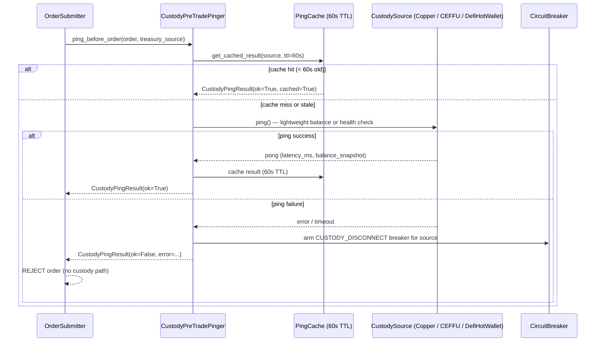
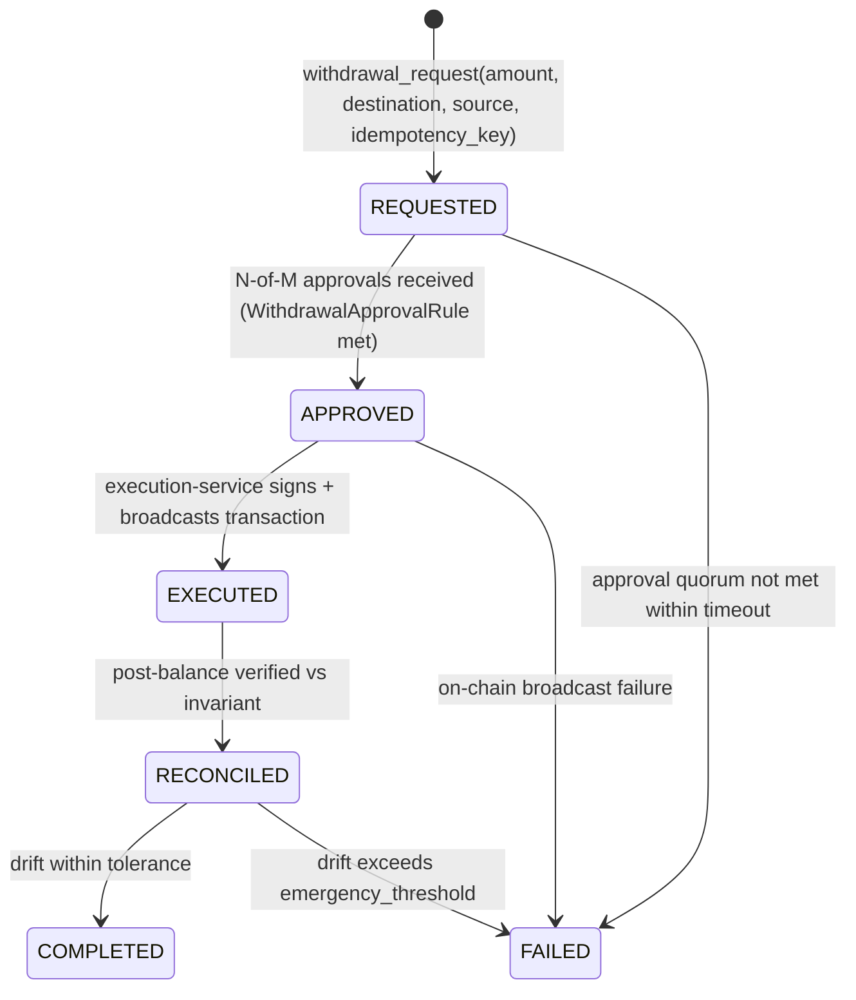

# Treasury Custody Flow

## Purpose

This document is the canonical SSOT for treasury custody in the unified trading system. It covers:

- The **TreasurySource taxonomy** — the closed set of custody sources and which venue routes to which source
- **Endpoint configs** — the fields each source type requires
- The **pre-trade custody ping flow** — how the system confirms a source is reachable before an order
- The **withdrawal lifecycle** — the REQUESTED → COMPLETED state machine with N-of-M quorum
- The **reconciliation invariant** — post-withdrawal balance verification and breaker arming

---

## TreasurySource Taxonomy

| `TreasurySource`          | Custody type                  | Assigned venues / chains                                                  | Endpoint config type                          |
| ------------------------- | ----------------------------- | ------------------------------------------------------------------------- | --------------------------------------------- |
| `COPPER`                  | Institutional MPC (Copper)    | Non-Binance CeFi venues (Bybit, OKX, Deribit, Kraken, Hyperliquid, Aster) | `CopperEndpoint`                              |
| `CEFFU`                   | Institutional custody (CEFFU) | Binance (spot + perp + options)                                           | `CEFFUEndpoint`                               |
| `DEFI_HOT_WALLET`         | On-chain self-custody         | All DeFi chains (Ethereum, Solana, Arbitrum, Optimism, Base, Avalanche)   | `DefiWalletKeyMaterial`                       |
| `SUB_ACCOUNT_HYPERLIQUID` | Hyperliquid sub-account       | Hyperliquid perp venue                                                    | sub-account id within `DefiWalletKeyMaterial` |
| `SUB_ACCOUNT_DRIFT`       | Drift Protocol sub-account    | Drift perp venue (Solana)                                                 | sub-account id within `DefiWalletKeyMaterial` |
| `SUB_ACCOUNT_DYDX`        | dYdX sub-account              | dYdX perp venue (Cosmos/EVM)                                              | sub-account id within `DefiWalletKeyMaterial` |

**Assignment rules:**

- Copper covers all non-Binance CeFi venues; each venue maps to a Copper `portfolio_id`.
- CEFFU covers Binance exclusively; the `ceffu_uid` identifies the institutional sub-account.
- DeFi hot wallet covers all on-chain legs; `wallet_address` + `chain` identify the on-chain identity.
- Sub-account sources (`HYPERLIQUID`, `DRIFT`, `DYDX`) inherit the DeFi hot wallet's private key but route funds through
  the venue's sub-account layer; the `sub_account_id` field on `DefiWalletKeyMaterial` identifies the slot.
- May-23 cutover: `DEFI_HOT_WALLET` + `SUB_ACCOUNT_HYPERLIQUID` are the active sources. Copper + CEFFU are June-1
  institutional flip targets (config-only; `signing_surface` field in `WalletProvisioningConfig`).

---

## Endpoint Configs

### CopperEndpoint

| Field             | Type                | Notes                                               |
| ----------------- | ------------------- | --------------------------------------------------- |
| `portfolio_id`    | `str`               | Copper portfolio identifier; scoped per venue       |
| `api_key_id`      | `str`               | References Secret Manager id — never inline API key |
| `organization_id` | `str`               | Copper org id for MPC signing authority             |
| `environment`     | `CopperEnvironment` | `SANDBOX` / `PRODUCTION`                            |

`api_key_id` follows the credential-registry-id reference pattern (see
[`interface-credential-convention.md`](interface-credential-convention.md) § Custody endpoint credentials). The
execution-service resolves the actual API key from Secret Manager at runtime using UCI `get_secret_client()`.

### CEFFUEndpoint

| Field         | Type               | Notes                                               |
| ------------- | ------------------ | --------------------------------------------------- |
| `ceffu_uid`   | `str`              | CEFFU institutional account UID                     |
| `api_key_id`  | `str`              | References Secret Manager id — never inline API key |
| `environment` | `CEFFUEnvironment` | `SANDBOX` / `PRODUCTION`                            |

### DefiWalletKeyMaterial

| Field                   | Type          | Notes                                                             |
| ----------------------- | ------------- | ----------------------------------------------------------------- |
| `wallet_address`        | `str`         | On-chain address (hex for EVM; base58 for Solana)                 |
| `chain`                 | `ChainId`     | e.g. `ethereum_mainnet`, `solana_mainnet`                         |
| `private_key_secret_id` | `str`         | Secret Manager id; envelope-encrypted via Cloud HSM CMK           |
| `sub_account_id`        | `str \| None` | Non-null for sub-account sources (`HYPERLIQUID`, `DRIFT`, `DYDX`) |

`private_key_secret_id` NEVER contains a raw private key — it is a reference to a Cloud HSM CMK-encrypted envelope in
Secret Manager. The execution-service decrypts via the KMS path in `custody-providers.md`.

---

## Pre-Trade Custody Ping Flow

Before any order submission, execution-service verifies the custody source is reachable. The flow:



**Key invariants:**

- A cached ping result is valid for exactly 60 seconds. After TTL expiry the next caller re-pings.
- On failure, the `KILL_PER_TREASURY_{source}` circuit breaker is armed via `CustodyPreTradePinger`. The breaker blocks
  all subsequent orders for that source until manually reset or auto-cleared on next successful ping.
- Ping bypass is never permitted in production mode (`CLOUD_MOCK_MODE=false`). Test mode uses a mock pinger.

---

## Withdrawal Lifecycle



Each withdrawal carries an `idempotency_key` (UUID generated at request time). Duplicate submissions with the same key
return the existing withdrawal record without re-executing.

The audit log (`WithdrawalAuditLog`) records every state transition with timestamp, actor (approver identity), and
on-chain txid. PII is never inlined — approver identity is a registry reference.

---

## N-of-M Quorum Config

`WithdrawalApprovalRule` configures per-source thresholds:

| Field                  | Type             | Notes                                              |
| ---------------------- | ---------------- | -------------------------------------------------- |
| `treasury_source`      | `TreasurySource` | The source this rule applies to                    |
| `amount_threshold_usd` | `Decimal`        | Below threshold: single approver sufficient        |
| `quorum_required`      | `int`            | Number of approvals required at or above threshold |
| `total_approvers`      | `int`            | Total approver pool size (M in N-of-M)             |
| `timeout_seconds`      | `int`            | Seconds before pending approval request expires    |

**Single approver below threshold:** when `withdrawal_amount_usd < amount_threshold_usd`, one approved signature from
any registered approver is sufficient to advance to `APPROVED`.

**Quorum at or above threshold:** `quorum_required` distinct approvers must sign. The `ApprovalBus` collects signatures
and advances state when the quorum is met, or expires the request after `timeout_seconds`.

The approval collection is handled by UTL `ApprovalBus`; execution-service `WithdrawalExecutor` consumes the `APPROVED`
event to broadcast.

---

## Reconciliation Invariant

After every withdrawal execution, UTL `WithdrawalReconciler` verifies:

```
pre_balance - post_balance ≈ withdrawal_amount + gas_fee
```

within `RECONCILIATION_TOLERANCE` (default: 0.01% of withdrawal amount). If the observed drift exceeds the tolerance,
reconciliation status is `PARTIAL_DRIFT`. If drift exceeds `EMERGENCY_THRESHOLD` (default: 0.1% of withdrawal amount),
reconciliation status is `CRITICAL_DRIFT` and the `KILL_PER_TREASURY_{source}` circuit breaker is auto-armed.

| Outcome          | Drift                                     | Action                                                               |
| ---------------- | ----------------------------------------- | -------------------------------------------------------------------- |
| `COMPLETED`      | `≤ tolerance`                             | No action; audit log marked reconciled                               |
| `PARTIAL_DRIFT`  | `tolerance < drift ≤ emergency_threshold` | Warning emitted; operator notified via alert                         |
| `CRITICAL_DRIFT` | `> emergency_threshold`                   | `KILL_PER_TREASURY_{source}` breaker armed; all source orders halted |

Reconciler reads pre-balance from the `EXECUTED` audit log entry (snapshot taken just before broadcast) and post-balance
from a fresh source query after on-chain confirmation.

---

## Cross-References

### UAC types

- `TreasurySource` — 6-value enum; `unified_api_contracts.canonical.domain.treasury`
- `CopperEndpoint` — endpoint config; credential fields are registry references
- `CEFFUEndpoint` — endpoint config; credential fields are registry references
- `DefiWalletKeyMaterial` — on-chain key material; `private_key_secret_id` is a Secret Manager reference
- `CustodyPingResult` — result of pre-trade ping; fields: `ok`, `source`, `latency_ms`, `balance_snapshot`, `cached`,
  `error`
- `WithdrawalApprovalRule` — per-source N-of-M quorum config
- `KillSwitchId.KILL_PER_TREASURY_COPPER`, `KillSwitchId.KILL_PER_TREASURY_CEFFU`,
  `KillSwitchId.KILL_PER_TREASURY_DEFI_HOT_WALLET`, `KillSwitchId.KILL_PER_TREASURY_SUB_ACCOUNT_*`

### UTL

- `CustodyPinger` — low-level ping implementation per source type
- `WithdrawalExecutor` — drives REQUESTED → APPROVED → EXECUTED; consumes `ApprovalBus` events
- `ApprovalBus` — collects N-of-M approvals; emits `WithdrawalApprovedEvent` on quorum
- `WithdrawalReconciler` — post-execution balance verification; arms breaker on drift
- `WithdrawalAuditLog` — append-only audit log; GCS at
  `gs://{pid}-treasury-audit/{client_id}/withdrawals/{withdrawal_id}.json`

### execution-service

- `CustodyPreTradePinger` — wraps `CustodyPinger` + ping cache; called by order submission path before any execution

### Plans

- `wallet_treasury_client_flow_2026_05_10.md` Phase 2.B — `TreasurySource` UAC types + endpoint configs
- `wallet_treasury_client_flow_2026_05_10.md` Phase 3.B — `CustodyPreTradePinger` in execution-service
- `wallet_treasury_client_flow_2026_05_10.md` Phase 5.B-F — withdrawal lifecycle UTL + reconciliation + HWM ledger

---

## Anti-Patterns

- **Never bypass the ping cache.** Calling the custody source on every order would saturate Copper / CEFFU rate limits.
  The 60-second TTL is the designed floor.
- **Never inline credentials.** `CopperEndpoint.api_key_id` and `CEFFUEndpoint.api_key_id` are registry references.
  `DefiWalletKeyMaterial.private_key_secret_id` is a Secret Manager reference. Raw keys or secrets never appear in
  config files or plan docs.
- **Never skip reconciliation.** Every `EXECUTED` withdrawal must reach `RECONCILED` before the withdrawal record is
  considered closed. Skipping reconciliation on "obviously clean" transactions is how balance drift goes undetected.
- **Never allow single-approver withdrawals above the quorum threshold.** The `WithdrawalApprovalRule` threshold is
  hard-coded per source; bypassing it requires an explicit operator override with a separate `force_single_approve` flag
  that itself is audit-logged.
