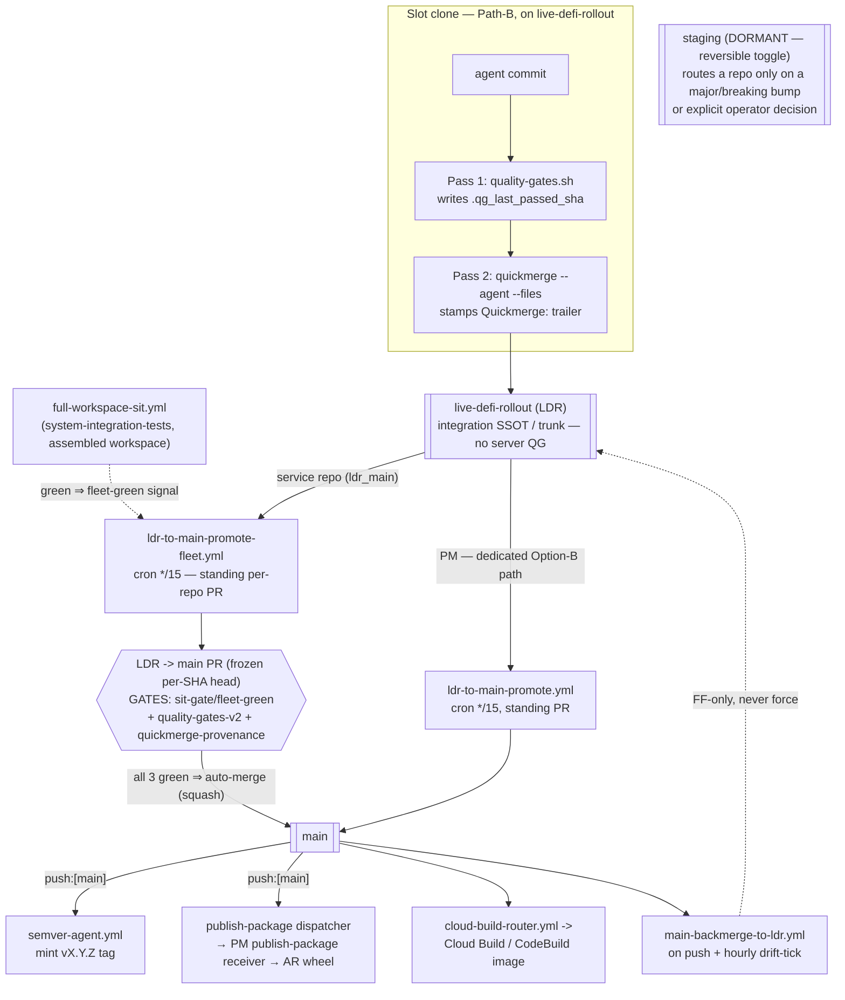

# CI/CD Flow

> **The pipeline is the MVP (operator decision Harsh + Ikenna, 2026-06-30).** A commit is green locally
> (`quality-gates.sh`) and reaches `live-defi-rollout` (LDR) via `quickmerge`. SIT validates the LDR content. The
> LDR→main fleet promoter merges **LDR→main directly** — there is NO staging hop. `staging` is KEPT but **DORMANT**
> behind a reversible per-repo toggle. **The LDR→main promote gate set is exactly THREE things:**
>
> - `sit-gate/fleet-green`
> - `quality-gates-v2` (on the promote PR)
> - quickmerge-provenance
>
> The former "complex pipeline" gates — **label-check, the SIT cross-repo COMBINATION workspace-digest, the dep-order
> gate, version-out-of-source (D13)** — are RETIRED / advisory-only and are NOT part of the contract.
>
> **Historical record (refactor COMPLETE, archived 2026-07-31):
> `/plans/archive/2026_07/cicd_mvp_ldr_to_main_pipeline_2026_06_30.md`** — all 29 todos done; it superseded the WS-L
> complex pipeline plan family and its Progress Log + `issues/` docs hold the full forensic history. **This codex doc is
> the durable SSOT for the resulting model** — read it, not the archived plan, for the live contract.
>
> Top-down pipeline picture: the **mermaid diagram** in "Branch model" below. Per-workflow drill-down (all workflows, by
> stage/trigger/concurrency/fires-next): `docs/repo-management/CICD-WORKFLOW-CATALOG.md` — auto-generated by
> `scripts/generate-workflow-catalog.py` (regenerate after any workflow change; it can't rot).
>
> Cross-references: `CLAUDE.md` § "Git discipline + shipping pipeline"; `/codex/08-workflows/dependency-cascade.md`;
> `/codex/08-workflows/version-graduation.md`.

---

## The MVP gate set — the ONLY gates on LDR→main

Exactly three things gate a repo's LDR→main promotion (the `ldr-to-main-promote-fleet.yml` promoter arms auto-merge only
when all three hold; PM uses its own dedicated `ldr-to-main-promote.yml`, same three-gate spirit):

1. **`sit-gate/fleet-green`** — the cross-repo SIT suite validated the assembled workspace. The fleet promoter computes
   a **FLEET-SHARED** signal each tick (was the last COMPLETED `full-workspace-sit.yml` run on
   `system-integration-tests` green?) and POSTS it as a commit status (context `sit-gate/fleet-green`) on every
   promote-PR head, **unconditionally** — regardless of the per-repo breaking/non-breaking classification (fail-CLOSED
   on any read gap/error). It is an **ENFORCED required status check** on every `ldr_main` repo's main ruleset (via
   `pin_branch_protection_rulesets.py`, which requires it ONLY for `promotion_model=ldr_main` repos — never
   `unified-trading-pm` / `system-integration-tests`, whose main-bound path is a different workflow that never posts
   this status; requiring it there would deadlock them). Fleet-shared (not a per-repo SIT-tree fingerprint) so it cannot
   discriminate against `e2e-testing` / `ibkr-gateway-infra`, which are structurally never SIT-tree-stamped by design.
   (Wired as a required check 2026-07-12, MVP plan finding 78.)
2. **`quality-gates-v2`** — the required check on the promote PR (head=LDR, base=main); per-repo correctness. See §
   "Canonical required check name".
3. **quickmerge-provenance** — only quickmerge'd content reaches main (the `check_strict_quickmerge.py` provenance gate;
   see § "Strict quickmerge").

Plus the trivial **mechanics** that are NOT "gates": content-differs (0-file diff → no-op), don't-promote-a-RED-repo
(Tier-A `ci_status != FAILING`), the runaway-breaker, and the frozen per-SHA promote-PR head.

### Retired / advisory-only — do NOT treat these as blocking

These were the WS-L "complex pipeline" and are the exact gates that were BLOCKING promotion. They are removed or
downgraded to advisory in the MVP:

- **label-check gate** (semver-bump-match in the promoter) → **ADVISORY** (posted for visibility, never blocks). It
  false-blocked UAC/mtds via the range-asymmetry bug; version-machinery concerns don't gate the promote.
- **SIT cross-repo COMBINATION workspace-digest** (`sit_validated_workspace_digest`) → **REMOVED as a blocker**. It
  thrashed under fleet churn. Only the fleet-shared `sit-gate/fleet-green` signal remains.
- **dep-order gate** → **ADVISORY** (removed as a blocker). It turned one flaky tier-0 into a fleet-wide freeze; SIT
  already validates the assembled workspace, so it is redundant for the MVP.
- **version-out-of-source / D13** (the tag→Firestore-registry versioning re-architecture) → **SHELVED** (reversible; the
  superseded plans in archive are the spec if revived). NB: the D13 semver-retarget sub-piece — semver-agent firing on
  `main` and minting git tags — WAS un-shelved + shipped fleet-wide 2026-07-25 (see § "Version Bump Flow"); the rest of
  D13 stays shelved.

---

## Branch model — LDR trunk → main direct (staging dormant, reversible)

> **The unit of work lands on `live-defi-rollout` (LDR) and stops.** A slot ships via `quickmerge --agent --files`,
> which commits to LDR. The **LDR→main fleet promoter** (`ldr-to-main-promote-fleet.yml`, cron `*/15`) opens a standing
> per-repo promote PR (head=LDR) and auto-merges it when the three MVP gates are green — **directly to `main`, no
> staging hop**. `staging` is KEPT as a branch but is DORMANT: its drain crons are stopped and
> `staging_dormant_mode: true` in `workspace-manifest.json`. The `tab/<op>/N` tab-branch model is retired (Path-B
> per-slot reference-clones are the isolation now). Top-down picture below; per-workflow drill-down in
> `docs/repo-management/CICD-WORKFLOW-CATALOG.md`.



| Branch                    | Role                                                                                                                                    | Server CI                                        | How content lands                                              |
| ------------------------- | --------------------------------------------------------------------------------------------------------------------------------------- | ------------------------------------------------ | -------------------------------------------------------------- |
| `live-defi-rollout` (LDR) | **The integration trunk + unit-of-work branch** — agents land here                                                                      | None (local `quality-gates.sh`)                  | slot `quickmerge --agent --files`                              |
| `main`                    | Reconciled output — tag mint + wheel publish + image-build trigger                                                                      | `quality-gates-v2` on the PR                     | `ldr-to-main-promote-fleet.yml` / PM `ldr-to-main-promote.yml` |
| `staging`                 | **DORMANT** — drain crons stopped; only reached if a repo's toggle is flipped off `ldr_main` (major/breaking bump or operator decision) | `quality-gates-v2` on the drain PR (when active) | `ldr-to-staging-promote.yml` (dormant)                         |
| slot clone (Path-B)       | Per-slot `git clone --reference` checked out on LDR (the real isolation)                                                                | None (local QG only)                             | edits → `quickmerge` to LDR                                    |
| `feat/*`                  | Legacy optional isolation branch — **not** the workspace unit of work                                                                   | None                                             | rare; Path-B clones supersede it                               |

**The `promotion_model` toggle (reversible, per-repo).** Each repo carries `promotion_model` in
`workspace-manifest.json` — today **24 repos are `ldr_main`** (LDR→main direct) and **`unified-trading-pm` runs its own
dedicated main-direct Option-B path**, so **0 repos route through staging**. The toggle is REVERSIBLE: flipping a repo
off `ldr_main` (a major/breaking version bump, or an explicit operator decision) routes THAT repo LDR→staging→main
again. The gates are UNCHANGED on both paths — SIT (re-homed onto a frozen LDR snapshot for direct repos) +
`quality-gates-v2` + quickmerge-provenance; a staging-routed repo just adds the staging hop. Do not describe staging as
the default path; it is the dormant exception.

#### Staging re-entry procedure (when a repo is routed back through staging)

The 2026-07-23 shutdown (`plans/archive/issues/staging_workflow_shutdown_2026_07_23.md`) disabled six workflows'
staging-facing triggers rather than deleting them, specifically so re-entry is possible — but **re-entry is MANUAL by
construction**: nothing writes `promotion_model` programmatically, and nothing auto-uncomments a disabled trigger. Both
steps below are required when flipping a repo off `ldr_main`:

1. **Flip the manifest.** Set that repo's `promotion_model` off `ldr_main` (and clear `staging_dormant_mode` if this is
   a fleet-wide re-entry, not a single repo) in `workspace-manifest.json`.
2. **Uncomment the disabled triggers.** Every one carries a dated inline comment naming exactly what to restore and
   citing the shutdown SSOT. Two are fleet TEMPLATES rendered into every repo's `.github/workflows/` — edit the
   TEMPLATE + re-run `rollout-workflow-templates.sh` (never hand-edit a per-repo rendered copy), then ship each affected
   repo via its own `quickmerge.sh --agent --files`. The other four are PM-only drivers, edited directly:

   **CORRECTED 2026-08-10** (plan_reconciler infra shard, agt-716973): the first two rows' PM template paths were
   deleted 2026-08-06/08 — both reusable workflows now live in `unified-trading-ci` (live-verified: neither path exists
   in PM anymore).

   | File                                                                | Owner                     | Uncomment                                                                                  |
   | ------------------------------------------------------------------- | ------------------------- | ------------------------------------------------------------------------------------------ |
   | `unified-trading-ci/.github/workflows/staging-backmerge-to-ldr.yml` | fleet template (24 repos) | `schedule: - cron: "10 * * * *"` (hourly convergence safety-net)                           |
   | `unified-trading-ci/.github/workflows/staging-lock-check.yml`       | fleet template (24 repos) | `repository_dispatch: types: [staging-locked, staging-unlocked]`                           |
   | `.github/workflows/staging-to-main.yml`                             | PM                        | `schedule: - cron: "0 * * * *"` (hourly drain)                                             |
   | `.github/workflows/staging-conflict-ldr-main-fallback.yml`          | PM                        | `schedule: - cron: "47 * * * *"`                                                           |
   | `.github/workflows/reconcile-staging-versions.yml`                  | PM                        | `schedule: - cron: "35 * * * *"`                                                           |
   | `.github/workflows/ldr-to-staging-promote.yml`                      | PM                        | `schedule: - cron: "2,17,32,47 * * * *"` AND `repository_dispatch: types: [tier-ab-green]` |

**Default-branch gotcha**: a `schedule:` trigger fires only from the DEFAULT branch (`main`) — landing the uncomment on
LDR alone does NOT restart a cron; it takes effect only once promoted to `main`.

**Verify re-entry by measurement, not by reading the diff.** The 2026-07-23 shutdown was itself confirmed stopped only
by measuring fleet-wide run counts before/after the promote landed on `main` (a green diff on LDR was not sufficient —
the same check run before the promote correctly still showed the crons firing). Re-entry gets the same treatment: after
promoting, confirm scheduled runs actually resume for the re-entered repo
(`gh run list --workflow <wf>.yml -R IggyIkenna/<repo>`). Regenerate `docs/repo-management/CICD-WORKFLOW-CATALOG.md`
(`scripts/generate-workflow-catalog.py`) so the catalog reflects the restored triggers.

**Never** push CODE directly to `main`/`staging`/LDR — always via `quickmerge` (the only sanctioned path: it runs the
two-pass QG, stamps the `Quickmerge:` provenance trailer, and the promote bots gate on it). The closed carve-out for
direct LDR pushes is narrow: `docs(plans):` flips, any repo's `scripts/**` + any `.github/**` (all-repos, not PM-only —
D16, operator-ruled 2026-08-08; see § "Strict quickmerge" below), dirty-deps, and the FF-pull-in.

**Dirty-deps direct push — stamp the trailer, don't just narrate it (ruled 2026-07-29,
`check_strict_quickmerge_blind_to_dirty_deps_carveout_2026_07_23.md`)**: `check_strict_quickmerge.py`'s provenance check
is `"Quickmerge:" in msg` — value-agnostic, it only checks the trailer's PRESENCE. A dirty-deps direct push that only
narrates the carve-out in prose (no trailer at all) touches real source and is correctly-per-the-checker's-own-rule
flagged as a bypass, producing false-positive provenance-gate walls. The fix is not a code change to the checker — it is
that every dirty-deps direct-push commit MUST carry a THIRD accepted trailer value,
`Quickmerge: direct-carveout-dirty-deps` (alongside today's `Quickmerge: agent`/`Quickmerge: human`), e.g.:

```
fix(infra): <what shipped>

Direct-push dirty-deps carve-out: quickmerge pre-flight blocked on foreign uncommitted WIP in <repo>
(concurrent agent). <repo> QG green (<n> passed, cov <pct>%).

Quickmerge: direct-carveout-dirty-deps
```

Reuses the checker's already-trusted trailer-presence mechanism (no new spoofable free-text heuristic); the prose
"Direct-push dirty-deps carve-out: ..." line stays as human-readable context, the trailer is what the gate reads.

### PM repo — main-direct, NO staging (Option B, operator decision 2026-06-03)

`unified-trading-pm` is **not a deployed package**, and PM is the **SIT debouncer** (it is not itself SIT-covered), so a
staging hop adds no SIT value. (`unified-trading-codex` is an ARCHIVED repo — codex is folded into PM at `codex/`; it is
a PM subdirectory, NOT a separate promotion target.) **quickmerge routes PM PRs to `main` directly** (both docs AND
scripts/workflows — not just the doc-fast-path); the main PR's `quality-gates-v2` (plan-hygiene /
manifest+dependency-alignment / codex-ref / ruff) is the full per-repo gate. PM has **no `staging` branch** —
`pin_branch_protection_rulesets.py` + `verify_branch_protection_check_names.py` already tolerate this (no staging
ruleset → skip/pass). For PM, **`main` is the reconciliation point** — it does for plans exactly what the LDR→main
promote does for service repos.

#### PM Option-B standing LDR→main PR (codified 2026-06-09)

> **🟡 CORRECTED 2026-08-02** (`quality_gates_v2_concurrency_and_bookkeeping_job_cost_2026_08_02.md`) — the "standing
> sweep, head=`live-defi-rollout` branch ref" description below was accurate as of 2026-06-09 but is now STALE.
> `ldr-to-main-promote.yml`'s own header comment + `git log -S` both confirm a **frozen-head migration shipped
> 2026-07-18** (`unified-trading-pm@40386f0274`, "PM LDR-to-main bot — frozen per-SHA head + PAT-authored PR (ports the
> fleet design)") — PM's promote PR head is now the SAME **immutable per-SHA ref**
> (`promote/unified-trading-pm/<sha12>`) the fleet bot (`ldr-to-main-promote-fleet.yml`) has used since 2026-06-30, not
> the live branch tip. The corrected model is described just below; the paragraph after that is kept only for historical
> context (what the foot-gun was BEFORE this migration).

PM's ONLY path LDR→`main` is the PR `ldr-to-main-promote.yml` opens (`quickmerge` itself stopped opening a competing PR
the same day, 2026-07-27, `unified-trading-pm@48800b7adb` — see quickmerge's own `PM_OPTION_B` branch for why). Each
`*/15` tick resolves LDR's current tip to an **immutable per-SHA ref** `promote/unified-trading-pm/<sha12>` (created
once, never force-updated) and opens/reuses a PAT-authored PR from that frozen ref — a NEW ref (and PR) every time LDR's
tip advances, not one long-lived branch-headed PR. This closes the OLD foot-gun described below: a squash of a
branch-headed PR used to leave a gap with no open PR until the next quickmerge; the frozen-head bot now self-opens a
fresh ref/PR on every tick there is real content drift, so there is no gap to leave. It also won't preempt its own
in-flight validation: if the currently-open promote PR's `quality-gates-v2` run hasn't reached a terminal state yet, the
tick skips superseding it (fix shipped 2026-07-27, `unified-trading-pm@48800b7adb` — the SAME commit quickmerge's log
message credits, but for THIS in-flight-wait behavior, not the frozen-head switch itself, which predates it by 9 days).

**Historical note (pre-2026-07-18 model, kept for context only)**: before the frozen-head migration, PM's promote PR's
head was the **branch ref** `live-defi-rollout` (not a fixed SHA), making it a **standing sweep** — every commit on LDR
rode it to `main` while it stayed open, and the moment it squash-merged, a LATER direct push to LDR had no open PR and
piled up on LDR with no path to `main` until the next quickmerge opened a new one. Two additional live defects proved
this was more than a foot-gun and forced the port to the fleet's frozen-head design: (1) TOCTOU — the head advanced
under every push while `quality-gates-v2` ran, so auto-merge could fire on an un-validated tree, and a `--delete-branch`
arm on a branch-headed PR deleted `live-defi-rollout` itself on merge (hit deployment-ui 2026-06-29); (2) an
App-authored branch-headed PR landed `quality-gates-v2` in a permanent `action_required` hold (WS-L 2026-06-27
A/B-proof). The migration also switched PR authorship from the GitHub App to a PAT to avoid defect (2).

- **Automated drain: `ldr-to-main-promote.yml`** (PM-only). Every 15 min (+ `workflow_dispatch`) it opens (or reuses) a
  frozen-per-SHA-ref promote PR with v2-gated auto-merge **whenever PM's LDR has real content ahead of main** — gated on
  the CHANGED-FILE count of `compare/main...live-defi-rollout` (0 files → no-op, immune to squash-accounting noise) plus
  a tree-equality short-circuit, reusing any open PR for the CURRENT ref (never duplicates), closing/replacing a
  superseded-ref PR when LDR's tip has moved on, and self-recovering the v2-never-reported deadlock (close+reopen). So
  direct pushes (docs(plans) flips, scripts/`.github` carve-out) drain within a ~15-30min SLA.
- **Manual immediate drain:** trigger `gh workflow run ldr-to-main-promote.yml` (the frozen-head ref/PR creation is
  bot-owned logic, not a one-line `gh pr create` recipe anymore — a manually-opened `--head live-defi-rollout` PR would
  actually be auto-CLOSED by the bot's own "bug#7" stale-head guard on its next tick).
- **Verify a push actually reached `main`**: unlike the fleet's squash-promote (see the ancestor-check validity map
  below), PM's own promote arms `gh pr merge --auto --merge` (a real merge commit, not squash — corrected 2026-08-02,
  was previously mis-documented as squash here) — so `git merge-base --is-ancestor <ldr-sha> origin/main` IS a valid
  check for PM specifically, since the frozen LDR sha becomes a genuine ancestor of the merge commit. Still prefer a
  content check when in doubt (`git cat-file -e main:<path>` / inspect the merged PR) — `ahead_by`/`behind_by` from
  `compare/main...live-defi-rollout` can still read noisy immediately after a merge lands, before the local clone's own
  view catches up.

### Which repos squash vs. rebase on promote — the ancestor-check validity map (codified 2026-07-25)

> **The trap**: `git merge-base --is-ancestor <ldr-sha> origin/main` is the intuitive recipe for "is commit X live", but
> it silently returns `false` FOREVER after a squash-merge — the squash produces a NEW synthetic commit on `main` that
> is never a descendant of the individual original commit in git's graph sense, even the instant the content lands. 3
> review dispatches were burned on this false negative in one session
> (`plans/archive/issues/deployment_promote_squash_ancestry_false_negative_2026_07_25.md`) before it was traced back to
> the promote mode. Checked every promote workflow's merge-arm step to answer "which repos are actually at risk":

| Path                                                                                                                | Merge strategy actually armed                                                                                                                                                                     | Is the ancestor check ever valid?                                                                                                                                                       |
| ------------------------------------------------------------------------------------------------------------------- | ------------------------------------------------------------------------------------------------------------------------------------------------------------------------------------------------- | --------------------------------------------------------------------------------------------------------------------------------------------------------------------------------------- |
| **`ldr_main` direct** (`ldr-to-main-promote-fleet.yml`) — every current fleet repo                                  | Unconditionally `gh pr merge --auto --squash --delete-branch` — no rebase attempt, ever ("LDR carries merge commits from the backmerge-sink design; not rebaseable")                              | **Never.** Guaranteed false-negative-prone 100% of the time.                                                                                                                            |
| **PM's own `main`-direct** (`ldr-to-main-promote.yml`, Option-B, PM has no `staging`)                               | **`--merge`, NOT `--squash`** (corrected 2026-08-02 — every `gh pr merge` call in the workflow's own source uses `--auto --merge --delete-branch`; this row previously, wrongly, said `--squash`) | **Always** — a real merge commit keeps the frozen LDR sha (and its ancestry) as a genuine ancestor of `main`; this is the ONE `ldr_main`-family path where the ancestor check is valid. |
| **staging-routed** (only if a repo's toggle is flipped OFF `ldr_main` — none are today): LDR→staging / staging→main | `--rebase` attempted FIRST (preserves original commit SHAs), `--squash` (and `--merge`) fallback only when rebase can't arm (real conflicts / a merge-laden range)                                | **Sometimes** — valid whenever the rebase path actually armed; not guaranteed.                                                                                                          |

**Bottom line**: because every fleet repo is `promotion_model: ldr_main` today (verified via `workspace-manifest.json` —
24 `ldr_main` repos), the ancestor check is invalid for **100% of the fleet's own squash-promote path**. PM's own
dedicated Option-B path is the one documented exception (corrected 2026-08-02 — see the row above): it merges rather
than squashes, so the ancestor check IS valid there. The staging-routed split only becomes operationally relevant
if/when the reversible per-repo toggle routes a specific FLEET repo through `staging` — even then it is merely
"sometimes valid", not "always valid". For every squash path (the entire fleet), **always prefer the content-diff
recipe** (`git show <branch>:<path> | grep <marker>`, compared byte-for-byte against LDR's copy, cross-referenced
against the promote PR's `mergedAt` vs. the deployed artifact's build timestamp) over the ancestor check for "is commit
X live" — full recipe tracked as a `unified-trading-pm/agents/review.md` doc fix in
`plans/archive/issues/deployment_promote_squash_ancestry_false_negative_2026_07_25.md`.

### Convergence + conflict-resolution model (the LDR ↔ reconciliation loop)

- **LDR = the fast live integration axis** — agents commit here, allowed to be _temporarily inconsistent_; no remote
  gate, FF-pull keeps every slot ≤5 min current.
- **The gated promote-PR boundary = the reconciliation point** — the LDR→main promote PR (per repo, or PM's Option-B
  main PR). Content only reaches `main` after the gate + conflict-resolution, so `main` is the _reconciled output_,
  never raw.
- **`main-backmerge-to-ldr.yml` feeds the reconciled result back to LDR** on every main push (additive merge, never
  force, never drop) → FF-pull → **every host (other VMs + operator laptops) converges**.
- **Three conflict layers — composable, no race:** (1) **TEXTUAL merge** → `conflict-resolution-agent` (reads all active
  plans, preserves both sides); MUST run on the Max-plan setup-token worker via `escalate-to-orchestrator`, not API
  credits. (2) **SEMANTIC** (two individually-valid plans whose _work_ conflicts, no textual overlap) → per-VM
  `review.md` + the scripted cross-plan **target-surface** overlap detector → owning orchestrator reconciles or
  operator-blocks. (3) **HYGIENE** → `plan_health-agent` (scripted + Haiku, report-only).
- **Every alerting event ALSO pings the orchestrator** (not Slack-only): the operator does not continuously watch
  `#ci-failures`, so each alert (CI-fail, stuck PR, backmerge conflict) escalates to the orchestrator, which delegates
  to the owning slot / review-agent.

### Named invariant: a revert landing near a promote-cycle boundary must survive the backmerge (fixed 2026-07-29)

A squash-promote (`ldr-to-main-promote-fleet.yml`) freezes an immutable per-SHA ref (`promote/<repo>/<sha>`) at the
moment it fires, opens the promote PR from that frozen content, and does not re-read LDR again before merging. If a
commit lands on LDR, gets reverted, and the revert lands **within roughly one promote-cycle's width** of the fix, the
promote can pin content from BEFORE the revert while the revert is already on LDR. The squash commit's own parent is the
pre-fix `main` tip (squash discards real ancestry), so when `main-backmerge-to-ldr.yml` next merges `main` back into
LDR, git's 3-way merge computes its base as that stale pre-fix point — from that base, the squash's re-added content
looks like ordinary NEW content, not "something LDR deliberately removed downstream." The merge is **content-clean** (no
conflict marker, nothing to notice) and silently re-lands the reverted block on LDR. `git log` still shows the revert
commit as reachable; only the live file content is wrong — a check that only reads `git log` ancestry will not catch
this, only a content diff will. Full incident + root-cause trace:
`/plans/archive/issues/ldr_main_backmerge_silently_resurrects_reverted_commit_2026_07_29.md`.

**Closed 2026-07-29** (`unified-trading-pm@d3a47773a`, rolled out fleet-wide): the squash-promote now stamps a
`Promoted-From-LDR: <ldr_sha>` trailer on the squash commit body at all 3 squash-merge sites in
`ldr-to-main-promote-fleet.yml`; `main-backmerge-to-ldr.yml` (both the fleet template and PM's own copy), when the
incoming `main` commit carries that trailer, forces the 3-way merge onto that explicit SHA as the merge-base via
`git merge-tree --write-tree --merge-base=<sha>` instead of git's stale computed one — so the merge-base is always the
actual LDR state the promote was taken from, and a downstream revert is never invisible to it. A narrowly-scoped
`check_no_silent_revert_loss()` defense-in-depth guard also flags (independent of the trailer) a backmerge result that
fully discards LDR's own last commit's effect. Regression test:
`scripts/quality-gates-base/tests/test-backmerge-silent-revert-loss-guard.sh` (reproduces the confirmed
instruments-service graph shape with real git operations). **Scope note**: `ldr-to-main-promote.yml` (PM's own promote,
`--merge` not `--squash`) keeps real ancestry and was never vulnerable to this bug class — not touched by the fix.

**Practical implication that outlives this specific fix**: after reverting something on LDR close to a promote cycle,
re-verify the actual file CONTENT on `live-defi-rollout` post-backmerge, not just that the revert commit is `git log`-
reachable — ancestry-reachable and content-correct are two different facts, and this incident is the concrete case where
they diverged.

---

## Two-Pass Workflow Model (the unit of work)

> **Order is non-negotiable: quality gates BEFORE COMMIT** — the commit is the per-repo **quality boundary** (tightened
> 2026-06-03). A **code** commit toward the integration branch must come from a `quality-gates.sh`-green tree, NOT on
> the strength of the light prek hook alone (ruff/format/gitleaks/conventional-commit). So Pass 1 (the full gate) runs
> on HEAD's content BEFORE you `git commit` code — not merely before quickmerge. Pass 1 writes the `.qg_last_passed_sha`
> sentinel; Pass 2 (`quickmerge --agent`) refuses to proceed without a matching sentinel and skips test re-runs on the
> strength of it. Realize it cheaply via **QG-sweep batching** (gate ONCE over a batch → make per-shippable-unit commits
> from that green tree) — the gate is per-batch, not per-commit. **Scope**: binds commits that touch source the gate
> checks; pure doc / plan-flip / markdown commits (e.g. `docs(plans):` flips) take the prek hook only — full QG is a
> source gate.

### LDR-trunk decoupling — quickmerge lands on LDR; the fleet promoter promotes; hotfix is the only break-glass

`live-defi-rollout` is the **gateless integration trunk in practice**. What is **live**:

- **`quickmerge --agent --files` lands on LDR and stops** — for a service repo it does not open a per-unit promote PR.
  The local `quality-gates.sh` sentinel is the LDR-landing gate. (PM→main is the exception — see Option B above.)
- **Promotion is the LDR→main fleet promoter** (`ldr-to-main-promote-fleet.yml`, cron `*/15`). Its LDR→main PR
  (head=LDR, base=main) carries the `quality-gates-v2` required check — that PR's head IS `live-defi-rollout`, so it
  _is_ "CI on LDR content". **LDR never runs server QG itself** (by design — it is the fast, cheap-to-push integration
  axis).
- **The staging-coupled quickmerge stages are scoped to `--hotfix`** — quickmerge STAGE 1.5 (staging-lock) and STAGE 1.7
  (dep-tier) fire only on a `--hotfix`; a normal LDR landing skips them. STAGE 1.6 (dep-version) is a WARN for a normal
  landing, a BLOCK on `--hotfix`. Under staging-dormant these staging-coupled paths are effectively vestigial for
  `ldr_main` repos; they light up only if a repo is toggled back through staging.
- **The promote bot promotes only quickmerge-provenanced content (live)** — `ldr-to-main-promote-fleet.yml` runs
  `check_strict_quickmerge.py` over the promote range before arming auto-merge; a non-carve-out CODE commit lacking the
  `Quickmerge:` trailer leaves the PR open (auto-merge not armed). Fail-open on a checker error.
  - **The provenance range MUST be the SINCE-LAST-PROMOTE range, NOT raw `main..LDR` (HARD; bug found 2026-06-17, fixed
    PM@b54da7855).** Promotes are SQUASH merges, so a promoted LDR commit's SHA never lands on `main` and its individual
    patch-id ≠ the squash's combined patch-id — so `git rev-list`/`git cherry`/`merge-base` over `main..LDR` can NOT
    tell that an already-drained commit was promoted. A hardcoded `origin/main..origin/live-defi-rollout` **re-flags a
    one-time trailer-less commit on EVERY subsequent drain, forever**. The contract: the bot tracks the
    **last-successfully-promoted LDR SHA per repo** (a moved tag `last-promoted-to-main`, or a state field) and the
    provenance check runs `<last-promoted>..origin/live-defi-rollout` — only commits since the last drain. This is
    **fail-safe** (a stale/missing marker widens the range → over-flags, never under-flags). **Do NOT "simplify" the
    range back to `main..LDR`.** (The pre-push hook range `origin/live-defi-rollout..HEAD` is already a since-base range
    and is unaffected.)
  - **The marker must be a true ANCESTOR of LDR, not merely an existing object (HARD; bug found 2026-08-06, fixed
    PM@7b5390649).** A security-driven git history rewrite can leave the stored marker SHA still fetchable from GitHub
    (so a bare existence check passes) while it sits on the OLD, pre-rewrite history line — `git log <marker>..LDR` then
    balloons to nearly the repo's entire history instead of a small since-last-promote delta, still technically
    "over-flags, never under-flags" but at a scale (thousands of commits, largely predating the `Quickmerge:` trailer
    convention itself) that is impractical to clear. `promote_provenance_range.py`'s `marker_usability()` composes an
    object-existence check with `marker_is_ancestor()` (`git merge-base --is-ancestor <marker> <ldr_ref>`); a marker
    that is reachable but NOT an ancestor is treated the same as an unreachable one and falls through to the safe
    `origin/main..origin/live-defi-rollout` fallback range. Full incident + the fleet-wide scope audit confirming
    exactly 3 repos were affected:
    `/plans/active/issues/provenance_marker_broken_by_history_rewrite_blocks_promotion_2026_08_06.md`.

Every shippable unit goes through exactly two passes:

```
Pass 1 — Quality Gates (MANDATORY — FULL run, no skip flags)
  bash scripts/quality-gates.sh
  • ruff format + check (lint + format)
  • pytest (tests, coverage)
  • basedpyright (type check)
  • STEP 5.x codex compliance (60+ rules)
  • pip-audit (CVE scan)
  On clean exit with NO skip flags → writes .qg_last_passed_sha:
    line 1 = git rev-parse HEAD; lines 2-3 = ENVIRONMENT=/DEPLOYMENT_ENV= (the resolved
    config Pass 1 ran under — appended 2026-07-30, qg_sentinel_environment_blind_2026_07_23.md,
    so a sentinel verified under one configuration can't satisfy a run under another)
  Partial runs (--skip-tests / --skip-lint / --skip-codex / --quick) do NOT write sentinel

Pass 2 — Quickmerge (--agent fast-path)
  bash scripts/quickmerge.sh "feat: description" --agent --files 'a.md b.md c.md'
  • --files is SPACE-separated (the staging loop is `for f in $FILES_ARG`, unquoted —
    word-splits on whitespace only). A comma-joined list ('a.md,b.md,c.md') collapses
    into ONE bogus filename and fails every time with "Path not found (and not
    tracked)" / "No valid paths from --files" (measured 2026-07-25, ~10 wasted retries
    before catching it — not a quickmerge bug, just an easy invocation mistake).
  • Reads .qg_last_passed_sha — verifies SHA matches current HEAD AND that the sentinel's
    recorded ENVIRONMENT/DEPLOYMENT_ENV match what THIS run resolved (via the shared
    qg_resolve_environment(), scripts/quality-gates-base/qg-environment.sh — the same
    branch-conditional default a standalone quality-gates.sh run now uses too, so the two
    invocation paths can't silently diverge)
    SHA mismatch / config mismatch / sentinel missing → EXIT 1 (or an automatic re-gate
    retry on a lost race — see _qm_check_agent_sentinel): "Run quality-gates.sh on
    current HEAD first"
    SHA match + config match → skips all Pass 2 QG re-runs (sentinel IS the guarantee)
  • stages ONLY --files; if a pre-commit hook reformats files and the first commit
    fails, the RETRY re-stages ONLY --files again (never `git add -A`) — a hook can't
    bundle foreign modified files into a scoped commit
  • --files staging is DELETION-AWARE (fix 2026-06-10, PM@3e472a19d): a tracked-but-
    absent path stages as a deletion (`[ -e "$f" ]` OR `git ls-files --error-unmatch`,
    then `git add -A -- "$f"`) in BOTH staging loops
  • commits + pushes to live-defi-rollout, then STOPS: a service repo lands on LDR;
    the LDR→main fleet promoter (ldr-to-main-promote-fleet.yml, ~15 min) opens the
    LDR→main PR whose quality-gates-v2 IS the authoritative server gate — quickmerge
    does NOT open a per-unit PR
  • EXCEPTIONS that open a PR directly: PM (Option-B → main) and --hotfix (→ staging;
    dormant-path break-glass). --to-staging is a no-op for ldr_main repos.
```

> **FIXED 2026-07-26 (was tracked, MVP plan Phase 2 P0): `quickmerge` no longer silently no-ops on a new-file-only
> ship.** Previously, `quickmerge --agent --files '<newfile>'` where every `--files` path was untracked printed "No
> differences from main — nothing to merge" and exited 0 without staging/committing, because the no-diff guard
> (`git diff origin/main`, worktree-vs-commit) did not see untracked files. Fix landed at `unified-trading-pm@04c0eef0e`
> — the guard now ALSO checks `git status --porcelain -- $FILES_ARG` (scoped to the supplied `--files`), consistent with
> the existing clean-tree guard. Regression test:
> `scripts/quality-gates-base/tests/test-quickmerge-untracked-new-file-guard.sh`. Full repro + fix history:
> `/plans/archive/issues/quickmerge_untracked_new_files_silent_noop_2026_06_23.md`.

> **`--files` scope is re-asserted on the prek commit-retry, and the pre-stage prettier is `--files`-scoped (foot-gun
> fix 2026-06-03).** Two places leaked foreign files into a scoped `--files` ship: (1) the commit-retry did `git add -A`
> after a hook reformatted staged files, sweeping ANY modified worktree file into the commit; (2) the pre-stage
> auto-format ran `prettier --write "**/*"` tree-wide. Both now scope to `--files`. The workspace answer to "does
> scoping orphan a foreign edit prek reformatted?" is to **never create or touch foreign dirt** — the on-commit
> `prettier-autostage` hook only re-stages the _subset already staged_ ∩ modified AND no-ops when the branch is behind
> origin (so an about-to-be-blocked commit leaves zero reflow residue). Foreign dirt is its owner's to commit, not
> quickmerge's. A HAND `git commit` is NOT covered — re-stage by name after any hook reformat, never `-A`. Fleet
> propagation: per-repo `scripts/quickmerge.sh` are **symlinks to the PM SSOT copy** — edit ONLY the PM script.

### STAGE 0.4 Not-Behind Gate — behind-remote reconcile (multi-agent safety)

Before committing, quickmerge runs the **Not-Behind Gate** ([`quickmerge.sh`](../../scripts/quickmerge.sh) STAGE 0.4).
It must never ship from a STALE base, but local commits / uncommitted work that DEVIATE from origin are fine — that's
the work being merged. So if `HEAD` is BEHIND `origin/<current-branch>` it pulls latest FIRST, in this order:

1. `git pull --ff-only` — clean catch-up when you have no local commits.
2. else `git pull --rebase --autostash` — replays YOUR commits on top of the incoming, stashing uncommitted work first.
3. else `git rebase --abort` (your work restored intact — **never overwritten, never blind-merged**) and **BLOCK with
   exit 1**. Emergency override only: `QUICKMERGE_ALLOW_BEHIND=1`.

So quickmerging while behind by N with same-file local commits does NOT clobber the peer's work — it auto-reconciles if
it can, else stops and hands the conflict back. **PM-as-a-repo is covered by the same gate** (it keys off the current
branch's upstream); no PM special-case.

**Recovery on the exit-1 block** (same recipe as the "Autostash conflict on rebase" rule in `CLAUDE.md`): evaluate sync
(`git rev-list --count HEAD..origin/<b>` / `..HEAD`) → preserve the peer's commits (NEVER `git checkout HEAD -- <f>` /
`reset --hard` on dirty unowned work) → stash YOUR files by name → `git pull --rebase origin <b>` → reconcile the
**essence** of both sides (3-way, keep both intents) → re-run `quality-gates.sh` → re-run quickmerge. A
machine-parseable `QUICKMERGE_BLOCKED code=… + RECOVERY:` contract is tracked in
`plans/active/qg_commit_quality_boundary_and_slot_ff_push_2026_06_03.md`.

**Pass 1 fix-mode — choose by WHAT you will commit (HARD RULE; AUTO-FIX rewrites the WHOLE worktree, not just your
files).** The sentinel is written on any COMPLETE green run — fix-mode OR `--no-fix` (the write is gated on
`RUN_TESTS && RUN_LINT && !QUICK && !ACT && !SKIP_CODEX`, NOT on fix-mode), so both modes satisfy Pass 1:

1. **Committing only your OWN named files** (the normal `quickmerge --agent --files '<paths>'` ship):
   `ruff format <your-paths>` first, then run **`bash scripts/quality-gates.sh --no-fix`**. Full gate, writes the
   sentinel, **does NOT reformat the tree**. Running ship mode here makes AUTO-FIX rewrite unrelated / foreign files →
   re-dirties the slot (breaks FF-sync) and risks vacuuming foreign formatting into your commit. (Incident 2026-05-15: a
   ship-mode run for a _diagnostic_ reformatted 350 unrelated files.)
2. **You knowingly intend a tree-wide reformat and will own everything AUTO-FIX touches**: plain
   **`bash scripts/quality-gates.sh`** (autofix ON) is correct — that is its purpose.

Either way the run must be FULL (no `--skip-*`/`--quick`) or no sentinel is written and quickmerge refuses.

**Why the sentinel?** Eliminates the staleness gap where an agent calls quickmerge after incremental edits without
re-running Pass 1. The SHA check is the enforcement mechanism — no partial run can fake a full pass. **Pass 1 is the
SOLE upstream quality checkpoint (codified 2026-06-02):** with human approvals removed fleet-wide
(`required_approving_review_count=0`), **nobody reviews an agent's PR before it auto-merges on a green gate.** So the
FULL local `quality-gates.sh` (Pass 1) + the quickmerge `--agent` sentinel check are the load-bearing quality bar. The
remote `quality-gates-v2` re-run on the promote PR is the backstop (fresh-deps Linux), but the local Pass 1 keeps red
code off LDR in the first place.

---

## Quickmerge Variants

```bash
# Default agent ship (the workspace unit of work): lands on live-defi-rollout and STOPS.
# The LDR→main fleet promoter (ldr-to-main-promote-fleet.yml, every 15m) promotes LDR→main directly.
bash scripts/quickmerge.sh "feat: description" --agent --files 'path/a.py path/b.py'

# --to-staging is a NO-OP for ldr_main service repos (LDR-landing is unconditional; the fleet promoter promotes).
bash scripts/quickmerge.sh "feat: work" --to-staging   # == the default LDR landing

# Break-glass staging-direct (auditable; requires a [hotfix] marker; still hits the staging lock). Opens an
# immediate LDR→staging PR — a DORMANT-path break-glass, only meaningful for a repo toggled back through staging.
bash scripts/quickmerge.sh "fix: [hotfix] urgent staging patch" --agent --hotfix --files '...'

# Cross-repo feature isolation (deps on non-main branch) — HUMAN ONLY.
bash scripts/quickmerge.sh "feat: work" --dep-branch "feat/X"

# Human shortcut (skip act, keep tests)
bash scripts/quickmerge.sh "feat: work" --quick
```

**`--agent` is the default agent path** — it skips the GitHub Actions simulation (act) and test re-run (valid only if
Pass 1 already completed and exited 0), commits + pushes to `live-defi-rollout`, and STOPS. It does NOT open a per-unit
promote PR; the fleet promoter does. (PM is the exception — its `--agent` ship targets `main`, Option B.)

**`--to-staging` is a no-op** for `ldr_main` service repos — LDR-landing is unconditional; the LDR→main fleet promoter
is what reaches `main`. **`--hotfix`** is the auditable staging-direct break-glass (requires a `[hotfix]` marker; a
dormant-path escape for a repo toggled through staging). **`--dep-branch`** is human-only — agents always land on LDR
where deps are on the dep repo's LDR HEAD.

---

## Dep-Branch Flow (Cross-Repo Feature Isolation)

When a feature spans multiple repos (e.g. `unified-trading-library` → `execution-service`), agents do NOT use a shared
`feat/*` branch + `--dep-branch` (that path is human-only). Under LDR-trunk decoupling each repo's change lands on
`live-defi-rollout` independently; the LDR→main fleet promoter promotes them (dep-order is advisory now):

```
Step 1: Land the UTL change on live-defi-rollout
  cd unified-trading-library
  bash scripts/quality-gates.sh --no-fix            # Pass 1 — writes the sentinel
  bash scripts/quickmerge.sh "feat: new UTL API" --agent --files 'src/...'

Step 2: Land the execution-service wiring on live-defi-rollout
  cd execution-service
  # deps already resolve against the dep repo's LDR HEAD (editable path source) — no --dep-branch
  bash scripts/quality-gates.sh --no-fix
  bash scripts/quickmerge.sh "feat: wire new UTL API" --agent --files 'src/...'

Step 3: The LDR→main fleet promoter promotes (no manual step)
  # ldr-to-main-promote-fleet.yml (every 15m) opens each LDR→main PR; its quality-gates-v2
  # (head=LDR, base=main) is the server gate + sit-gate/fleet-green + provenance.
```

**Rule**: Never use `--dep-branch` (or a shared `feat/*` branch) in agent sessions. Agents land each repo on LDR;
internal deps resolve against the dep repo's LDR HEAD via the editable path source.

---

## Breaking = public-surface change, NOT version phase (SIT scope; codified 2026-06-08)

**SIT and the cross-repo breaking gate fire on a real breaking change** — an actual change to the public API / schema /
contract surface that affects how a consumer imports or calls a symbol. They do **NOT** fire on a 0.x MINOR bump, a
docstring edit, an internal refactor, reformatting, or an added-optional kwarg. **`quality-gates-v2` still runs on EVERY
promote PR** (the breaking-gate narrows SIT dispatch, never QG).

- **Differ (SSOT)**: `scripts/cicd/detect_breaking_change.py` — a stdlib-only AST diff of the public surface
  (export-name set anchored on the package `__init__.py`, bare-name keyed so a symbol MOVED between internal modules is
  not a false "removed", changed-files-only for speed). **Breaking** = removed/renamed public export, removed public
  class/method, incompatible signature change (added-required / removed / reordered param, dropped `**kwargs`),
  removed/renamed/retyped Pydantic/dataclass field (the UAC schema case), **removed/renamed Enum member or changed Enum
  member VALUE** (StrEnum/IntEnum contracts — the serialized value IS the contract; a NEW Enum member is
  additive/non-breaking), removed HTTP route, or **a removed key/collection-member/inner-key on a
  `# @contract-surface`-tagged module-level registry dict** (fixed 2026-07-31, see below). **Not breaking** = additive,
  docstring, comment, reformat, reorder, move-across-modules, an ADDED key/member/inner-key on a tagged registry
  constant. Regression-guarded by `tests/unit/test_detect_breaking_change.py`.
- **Registry data-dict contract surface** (closes `breaking_change_differ_blind_to_registry_data_dicts_2026_07_09.md`,
  fixed 2026-07-31): a plain module-level dict/list/set constant (e.g. UAC's
  `INSTRUMENT_TYPES_BY_VENUE: dict[str, set[str]]`) keeps the SAME exported name and the SAME annotation even when its
  literal CONTENTS silently lose a member — invisible to every check above (the 2026-07-07 `23fa3a99` incident: bare
  `"OKX"` losing `"SPOT_PAIR"` from `INSTRUMENT_TYPES_BY_VENUE` broke instruments-service's `build_expected('cefi')`,
  75→71 tuples, `is_breaking: false`, export count unchanged 1153→1153). Fix: tag the constant with a
  `# @contract-surface` comment directly above its declaration; the differ then resolves its literal value (bare-`Name`
  dict keys/members are resolved against earlier same-file `NAME = "value"` string constants — the registry convention —
  via a small AST literal-evaluator, `_resolve_literal`/`_resolve_registry_dict`; a per-key value that isn't statically
  resolvable, e.g. a computed list comprehension, is silently DROPPED from the snapshot rather than aborting the whole
  constant) and diffs it structurally: a removed top-level key, a removed set/list member, or a removed inner dict-key
  (the `VENUE_DATA_TYPE_CAPABILITIES: dict[str, dict[str, str]]` case) is breaking; any ADDITION is not. Currently
  tagged: `INSTRUMENT_TYPES_BY_VENUE`, `VENUES_BY_ASSET_GROUP`, `VENUE_DATA_TYPE_CAPABILITIES` (all in
  `unified-api-contracts/unified_api_contracts/registry/`). Precedent: manifest `schema_version` is an explicit,
  deliberate signal that a DATA contract changed (see the scope-boundary bullet below); `# @contract-surface` is the
  same idea for a plain Python data registry — tag it explicitly rather than have the differ guess by name/path. Adding
  a NEW registry constant to this tracked set is a one-line tag, not a differ code change.
- **Scope boundary — the differ is a CODE public-surface tool; non-code contract surfaces are OUT of scope BY DESIGN**
  and governed by their OWN SSOTs: (1) **manifest `schema_version`** (a DATA-schema contract, SSOT
  `/codex/02-data/availability-manifest-and-data-status.md`); (2) **GCS path / partition keys** (`pipeline_mode=` /
  `asset_group=` / `feature_group=` / `feature_group_version=`, governed by
  `/codex/02-data/pipeline-mode-partition.md` + `/codex/02-data/feature-formula-versioning.md`). Changing one is a real
  contract change but does NOT trip the breaking differ — coordinate through its data-track SSOT + single-walk
  migration; never expect SIT to catch it.
- **Wiring**: each repo's `semver-agent.yml` (rolled out from `scripts/workflow-templates/semver-agent.yml.tmpl`) calls
  the differ — non-PM repos fetch it at runtime from `unified-trading-pm`. The differ verdict sets `is_breaking`.
  `feat!:` stays an explicit human-declared breaking override.

### The cross-repo breaking gate lives on the LDR→main promoter (`sit-gate/fleet-green`)

Under staging-dormant, breaking changes never reach `staging`, so the old staging-based `breaking_pending`/SIT cascade
is DEAD for `ldr_main` repos. The cross-repo breaking gate is on the **LDR→main fleet promoter** as the fleet-shared
`sit-gate/fleet-green` required check (see § "The MVP gate set"). The mechanism:

- **Producer** (`system-integration-tests/.github/workflows/full-workspace-sit.yml`): clones every repo at
  `live-defi-rollout` and runs the cross-repo invariants over the assembled workspace. A GREEN completed run is what the
  promoter reads.
- **Consumer / the gate** (`ldr-to-main-promote-fleet.yml`): each tick computes the FLEET-SHARED "was the last completed
  `full-workspace-sit` run green?" signal and posts it **unconditionally** as `sit-gate/fleet-green` on every promote-PR
  head (fail-CLOSED on a read gap). `pin_branch_protection_rulesets.py` makes it a required status check on the main
  ruleset of every `ldr_main` repo. On a red/absent signal the PR stays BLOCKED until a later tick reads a green SIT.
- **Frozen-head (immutable per-SHA ref)**: the promote PR head is a bot-controlled `promote/<repo>/<shortsha>` ref —
  **immutable** (created once via `POST`, never force-updated). The PR is **PAT-authored** (an App-authored promote PR
  lands `quality-gates-v2` in `action_required` and deadlocks). On merge, `--delete-branch` removes the ref; superseded
  refs from an older tick are closed + deleted before the new PR is opened. So async auto-merge can only ever merge
  gate-validated content, and the head SHA is immutable creation→merge (closes the live-branch-drift TOCTOU).

> **Retired (MVP): the per-repo `sit_validated_tree` fingerprint gate and the cross-repo COMBINATION
> `sit_validated_workspace_digest`.** The first cut of the LDR→main breaking gate required a per-repo SIT-tree
> fingerprint match; the digest added a combination check. Both were removed as blockers because they thrashed under
> fleet churn and could not stamp the structurally-uncovered repos (`e2e-testing`, `ibkr-gateway-infra`). The fleet-wide
> "was the last SIT green" signal replaced both (finding 78, 2026-07-12). Historic detail:
> `plans/active/issues/sit_rehome_safety_gate_gaps_2026_06_27.md`. **The Layer-2 coverage gap is CLOSED (fixed
> 2026-07-31):** on the 2026-07-07/08 incident `full-workspace-sit` itself ran green due to a SIT test-coverage gap (no
> test re-derived IS's expected-universe from the live UAC registry) — closed by
> `unified-api-contracts/tests/test_cefi_registry_expected_universe_invariant.py`, which loads instruments-service's
> `scripts/expected_universe.py` by file path (it is a dev script, not part of the installable package) and (a) runs the
> real `build_expected('cefi')` against the live registry, (b) asserts every non-DeFi `VENUE_DATA_TYPE_CAPABILITIES`
> entry names a venue declared in `VENUES_BY_ASSET_GROUP`, (c) asserts every `CEFI_VENUE_FOLD` target venue produces at
> least one expected tuple. Wired into `system-integration-tests/scripts/run_cross_repo_invariants.sh`; skips in
> per-repo CI (instruments-service sibling absent), runs for real in full-workspace SIT. Full fix (Layer 1 differ +
> Layer 2 SIT + the `test_venue_to_tardis_matches_inverted_venue_mapping` xfail resolution) tracked in
> `plans/active/issues/breaking_change_differ_blind_to_registry_data_dicts_2026_07_09.md`.

- **`ci_status` lifecycle (the state the promote bots read)**: a repo's CI state advances
  `NOT_CONFIGURED → LOCAL_PASS → FEATURE_GREEN → … → SIT_VALIDATED → MAIN_GREEN` (any state → `FAILING` on a red gate).
  `PASSING_STATUSES` must include the two highest states (`SIT_VALIDATED` + `MAIN_GREEN`) or an already-promoted
  dependent polls as "pending" forever. **Firestore is the LIVE SSOT side-store** for `ci_status`;
  `workspace-manifest.json` is the offline fallback cache — read Firestore for current state, fall back to the manifest
  only when Firestore is unavailable. **WS-A Phase-3 (2026-06-25, PM@84978082d) retired the git dual-write:**
  `ci-status-update.yml` writes ONLY Firestore (`ci_status_store.set_status` — per-repo-document CAS + the
  `is_stale_write` ordering guard + `resolve_status` no-downgrade), with NO manifest commit and NO concurrency group.
  The hourly `ci-status-consolidator.yml` projects the Firestore aggregate → manifest cache in ONE `[skip ci]`
  commit/interval; the git `ci-status-reconciler.yml` is RETIRED. The backmerge **keeps** Guard-2's ci_status
  field-merge so the consolidator's main-side ci_status stays a main-authoritative field.

> **Historic (staging-era cascade mechanics — retired for `ldr_main` repos, kept for provenance).** The staging
> `breaking_pending` set, `update-repo-version.yml` staging-lock, `sit-debounce-trigger`/`sit-gate`/`sit-unlock`
> lock-loop, `cascade-qg-ordering.yml`, and the `poll_level` baseline-aware/`PASSING_STATUSES` traps all governed the
> LDR→staging→main path and only fire for a repo toggled back through staging. Full detail:
> `plans/archive/2026_06/sit_breaking_detection_content_based_2026_06_08.md` +
> `/codex/08-workflows/dependency-cascade.md`.

### Dependency promotion — range pins absorb minor/patch; only MAJOR forces a consumer rebuild (codified 2026-06-09)

Internal-dep version churn must NOT cascade rebuilds fleet-wide. The model (operator 2026-06-09):

- **Declared pins are RANGES** (`unified-api-contracts>=0.1.0,<1.0.0`) with **editable path sources**
  (`[tool.uv.sources] path = "../unified-api-contracts"`). A **minor/patch** internal bump stays inside `<1.0.0` → the
  range absorbs it → **no consumer rebuild, no CI noise**. A consumer picks up the newer dep only when IT next runs its
  own promote workflow (pull, not push).
- **`uv.lock` is already correct — do NOT "fix" it.** Internal deps are recorded as `source = { editable = "../…" }`
  (the install resolves from the source PATH, not the recorded version), external deps lock exact. There is **no
  exact-pin bug** and no "range-aware lock gate" to build.
- **CI installs the COMMITTED lock via `uv sync --frozen`** — as-is, NO re-resolution. `--frozen` NOT `--locked`:
  `--locked` would HARD-FAIL on the semver-agent's CI-side `version =` bump (a poison-pill); `--frozen` tolerates it
  (the root pkg is editable-installed from source). **Rule:** editing a dependency FLOOR in `pyproject.toml` requires
  regenerating + committing `uv.lock` in the SAME commit (`uv lock`) — otherwise `--frozen` silently installs the stale
  lock. A bare `version =` bump needs no lock regen.
- **Dep resolution in CI is CONTENT-FIRST (LDR-HEAD clone) + the range check is NON-BLOCKING (2026-06-11).**
  `python-quality-gates-v2.yml::clone_repo` clones each internal dep at its **`live-defi-rollout` HEAD** (the SSOT
  content local editable siblings resolve against) — the version-aware tag chain is now only a FALLBACK when the LDR
  clone fails. `assert_dep_in_range` verifies the cloned version vs the pinned range but **WARNs, never `exit 1`**: a
  clone outside the pinned range uses the cloned HEAD content; the range is enforced content-based downstream
  (`check_dep_content_sync.py`). **A "CI count over ceiling but local fine" symptom is a RE-RUN, not a ceiling-bump.**
- **A MAJOR bump (crosses `<1.0.0`) FORCES the consumer to re-pin** → it triggers a cascade of quality gates in
  dependency order across dependents. A GREEN cascade promotes the major automatically; **vm-planning is escalated ONLY
  IF that cascade FAILS**. Mechanical jams (the `[skip ci]`-version-bump-head deadlock) are cleared in-band by
  `ci-health --auto-recover`, not a human.

### Manifest version-surface semantics — three distinct fields, do NOT "fix" apparent inconsistency (diagnosed 2026-06-10)

`workspace-manifest.json` exposes **three separate version surfaces** with different semantics:

| Field                                                          | Role                                                                                                       | When stale is OK                                       |
| -------------------------------------------------------------- | ---------------------------------------------------------------------------------------------------------- | ------------------------------------------------------ |
| `versions{<repo>}`                                             | Semver-agent's live build target (the `main`-side baseline under `ldr_main`)                               | Never (split = promotion lag → gate-flagged)           |
| `staging_versions{<repo>}`                                     | **FROZEN historical record** while staging is dormant — a live key only for a repo toggled through staging | Always, while dormant                                  |
| `repositories{<repo>}.version`                                 | **VESTIGIAL display fallback** — shown in the dashboard                                                    | Always (never drives a build or dep-resolve)           |
| dep-edge floor `>=0.x,<1.0.0` in a consumer's `pyproject.toml` | **Intentional RANGE-PIN floor** — the pull-not-push model                                                  | By design (syncing floors to latest defeats the model) |

**Only `versions{}` ↔ source-derived version must agree.** Seeing `repositories{}.version` stale, an in-range dep-floor,
or a frozen `staging_versions` is NOT a bug — do NOT "sync" them. `assert_version_coherence.py` checks these and runs
`--warn-only` in PM QG post-gates (`VERSION_SPLIT` = real alert; `VESTIGIAL_SCALAR_DRIFT` / in-range floors =
warn-only). `scripts/quickmerge.sh`'s STAGE 1.6 dep-gate is dormancy-aware (`unified-trading-pm@b3abf1bd5`, 2026-07-30):
it ignores `staging_versions` entirely whenever `staging_dormant_mode: true`, so a frozen `staging_versions` can no
longer produce a spurious dep-behind/auto-heal false-positive — resolved, archived at
`/plans/archive/issues/stale_staging_versions_manifest_2026_07_23.md`.

**Semver-agent bump-rate circuit breaker (codified 2026-06-10):** the agent refuses + raises a CRITICAL page when it
detects a runaway re-bump signature on main (adjacent re-bump pairs ≥2, or ≥3 consecutive at tip, or rate ≥6/hr). For
git-tag repos the signature is counted from `v*` tag mints in the last hour; for legacy repos from the commit-pair
signature. Companion: PM `version-bump dispatch` is retried + alerted on failure.

---

## LDR is the SSOT — clean-start force-sync + drift-tick (codified 2026-06-08)

`live-defi-rollout` is the integration source of truth and the live accumulator (slots push there). `main` is a
**downstream projection** of LDR. When they diverge by promotion artifacts (merge nodes, re-applied `[skip ci]` writes,
superseded workflow copies), the divergent commits are **noise to collapse, not work to merge** — verified by a
zero-file-content-delta `compare` (`ahead_by` > 0 but `files: []`). The **only** preserve-rule: genuinely-newer
main-only content (a real feature, or a CI-workflow fix LDR lacks) is **back-merged DOWN to LDR first**, then main
force-syncs to LDR.

- **Clean-start force-sync** (fast bulk alignment): version-align → for each repo relax protection (disable rulesets +
  classic `enforce_admins`/`allow_force_pushes`) → force `main` to the LDR tip → **restore protection + re-enable
  rulesets in the same per-repo step** (crash exposure = 1 repo). Operator-gated authority. Real main-only content is
  backmerged to LDR before the force.
- **Drift-tick**: `main-backmerge-to-ldr.yml` runs `on: push: branches:[main]` **plus a `schedule: 0 * * * *`** (hourly)
  — because `[skip ci]` commits to `main` (the hourly ci_status consolidator / manifest-version writes) suppress ALL
  Actions triggers including the push trigger, so `main` chronically drifts ahead. A scheduled run is not
  `[skip ci]`-suppressed and sweeps the accumulated drift, so "`main` never ahead of LDR" holds in steady state (modulo
  the ≤60-min window). (Edit the SSOT template + `rollout-workflow-templates.sh` fleet-wide.)

### Workflow-template rollout is a TWO-half operation — the second half (commit fleet-wide) is mandatory (HARD RULE, 2026-06-10)

`rollout-workflow-templates.sh` only does HALF the job: it **writes** the SSOT template
(`scripts/workflow-templates/<wf>.yml`) into all repos' `.github/workflows/` **working trees**. The second, mandatory
half is to **commit + push the per-repo change to each repo's `live-defi-rollout`** in the same unit (a per-repo
`ci(workflow-templates): roll out <wf>` commit). **A rollout left as uncommitted working-tree churn is the #1 cause of
stale clones**: the `*/5` `slot-cron-ff-pull` cron skips any clone with a dirty tree (`[skip:dirty]`), so a clone with
rolled-out-but-uncommitted workflow files **falls behind LDR indefinitely** — which can strand a worker VM's executor PM
clone → the orchestrator reads stale plans → the backlog starves (incident 2026-06-10). **Definition of done for any
template edit**: (1) `detect_template_drift.py --workflows` exits 0, AND (2) `git status .github/workflows/` is clean in
every repo. Verify BOTH before declaring it shipped. Can't finish in-session → it's a tracked plan todo; never leave
silent fleet drift.

SSOT: `plans/active/staging_clean_start_and_stale_pr_hygiene_2026_06_08.md`.

### Cloud Build auto-repin steps after a force-sync — the CB repo mirror can be stale (codified 2026-07-27)

A `cloudbuild.yaml` step that auto-repins a downstream Cloud Run resource (e.g. `redeploy-monitor-jobs` re-pinning the 4
`dp-*` monitor jobs to a freshly-pushed `:latest`, `deployment-api/cloudbuild.yaml`) assumes every build it fires from
is a **real, reachable commit**. A `main` force-sync breaks that assumption twice (found during the 2026-06-24 incident,
`/plans/archive/issues/monitor_jobs_auto_repin_and_alerting_cli_wiring_2026_06_24.md`, archived 2026-07-27):

1. It **orphans the in-flight CI commit** — the deploy trigger builds a now-nonexistent SHA → a BAD image gets pushed to
   `:latest`, and an auto-repin step would happily re-pin production jobs onto that bad image.
2. It leaves **Cloud Build's GitHub repo-connection mirror stale** — the mirror keeps resolving `main` → the orphaned
   SHA until a REAL (non-`[skip ci]`) `main` push re-syncs it; `gcloud builds triggers run --sha=<real-tip>` fails
   `FAILED_PRECONDITION: Couldn't read commit` in the meantime.

**Rule**: after a `main` force-sync, do NOT let an auto-repin step run against whatever `:latest` the CB mirror produces
next — pin the downstream resource(s) to a KNOWN-GOOD digest by hand until a real promotion (not a force-sync, not
`[skip ci]`) resyncs the mirror and a build off the real tip proves clean. Treat any auto-repin step's output right
after a force-sync as unverified until then.

### A shared `cloudbuild.yaml` guard only protects code that is actually BUILT with the guarded substitution (codified 2026-07-27)

A step guarded on `if [ "${_SERVICE_NAME}" != "x"]; then exit 0; fi` inside a `cloudbuild.yaml` that is nominally
"shared" across services is only reachable if some LIVE, ENABLED Cloud Build trigger actually builds that exact file
with `_SERVICE_NAME=x` set. It is not enough for the guard to be syntactically correct — verify with
`gcloud builds triggers describe <trigger> --format="value(filename,substitutions)"` (or lack of an override, which
falls back to the file's own `substitutions:` default) that a trigger exists which both (a) reads that file and (b) sets
the substitution the guard checks for. **Confirmed incident** (`monitor_jobs_auto_repin_and_alerting_cli_wiring`,
verified 2026-07-27): the `redeploy-monitor-jobs` step was added to `deployment-service/cloudbuild.yaml` guarded on
`_SERVICE_NAME == deployment-api`, but the only trigger that builds that file (`deployment-service-build`) never
overrides `_SERVICE_NAME` (so it always builds as the file's own default, `deployment-dashboard`) and the trigger that
actually builds+deploys `deployment-api` (`deployment-api-main-deploy`) reads a **completely different file** —
`deployment-api`'s own root `cloudbuild.yaml` — which never contained the step at all. The guard was correct; the step
was in the wrong repo's file and was silently unreachable for over a month (confirmed via the target Cloud Run jobs'
`run.googleapis.com/lastUpdatedTime` staying weeks-stale across dozens of real `deployment-api` main builds, and via
`gcloud builds log <recent deployment-api-main-deploy build id>` showing no `redeploy-monitor-jobs` step at all). **A
service-specific auto-repin/side-effect step belongs in THAT service's own `cloudbuild.yaml`** (or, if it must live in a
shared file, verify end-to-end which live trigger reaches it before declaring the wiring "CONFIG DONE" — "the step
exists in a file with the right guard" is not evidence it ever executes).

### Empty-tag / `$SHORT_SHA` guard — `cloudbuild.yaml` must fall back when the build source has no SHA (codified 2026-08-06)

A `cloudbuild.yaml` step that tags a Docker image `:$SHORT_SHA` dies with `invalid reference format` (exit 125) whenever
the build is triggered from a **storageSource** (a tarball/manual submit) rather than a real GitHub-connected commit —
`$SHORT_SHA` resolves EMPTY in that path, producing `image:` (a bare colon, no tag). Every image-building consumer's
`cloudbuild.yaml` (17/19 CI-tranche consumers as of 2026-08-06; `e2e-testing` and `system-integration-tests` are
legitimate N/A — test-harness repos with no Docker image / no push step) MUST guard the build-tag substitution with a
fallback: extract a `VERSION` (or similar) value and set `SAFE_SHA=${SHORT_SHA:-$VERSION}` (or equivalent), with a FATAL
diagnostic if BOTH resolve empty rather than silently building an untagged/`:latest` -shadowing image. Verified
end-to-end via a real `gcloud builds submit` storageSource dispatch with `SHORT_SHA` empty (execution-service, build
`4d265c51-5ca0-4349-b48f-80d4f7179430`, 2026-08-06) — recovered via `VERSION=0.0.0.dev0` fallback instead of dying.
Rollout tracked at `/plans/archive/issues/cloudbuild_template_behind_repos_rollout_would_regress_fleet_2026_07_20.md`;
the drift-baseline ratchet this guard interacts with is `scripts/quality_gates/check_cloudbuild_template_drift.py` /
`cloudbuild_template_drift_baseline.yaml` (shrinking-ratchet, never raised).

**Two-step rollout when a template-drift baseline exists**: do NOT roll a new/changed template step out to
already-drifted consumers in the same pass that also tries to shrink the baseline — resolve the existing per-repo drift
FIRST (bring every consumer to at-or-below its ratcheted baseline), THEN apply the new guard/step as its own separate
rollout. Combining both in one pass makes it impossible to tell whether a post-rollout drift-count increase is the new
step or pre-existing debt.

### `quality-gates-v2` CI-status dispatch must be outage-aware — a 0-job billing/startup-kill run is not a genuine FAILING status (codified 2026-08-07)

The "Record CI status" step (`if: always()`) in `quality-gates-v2` dispatches a `STATUS=FAILING` Firestore write on ANY
non-success conclusion — including a 0-job account-level billing-wall/quota kill (`jobs: []`,
`conclusion: startup_failure`), which no worker can fix and which generated `ldr_qg_failure` escalation spam fleet-wide
during the 2026-07-29 billing-wall incident. **Detect the infrastructure-kill pattern** (`CONTENT_GATE_RESULT=failure`
AND `SLICES_RESULT=failure` → treat as `BILLING_KILL=true`) and skip the FAILING dispatch, emitting only a `::notice::`
annotation instead — a genuine failing run (content-gate succeeds, slices fails) still dispatches normally. Implemented
in `unified-trading-ci`'s shared `python-quality-gates-v2.yml` (the reusable workflow was extracted there per
`shared_ci_workflow_repo_extraction_2026_08_06.md` — this is the single source now, not a per-repo `.tmpl` +
`rollout-workflow-templates.sh` rollout). Source:
`/plans/archive/issues/github_actions_billing_wall_recurrence_2026_07_29.md`.

## Strict quickmerge — direct integration-branch code pushes are BANNED (HARD RULE, 2026-06-08)

CODE reaches the integration branch ONLY via `quickmerge --agent --files`. A direct `git push` of code to
`live-defi-rollout`/`staging`/`main` dodges the dep-version/dep-tier/dep-content checks and — since quickmerge
early-exits "nothing to commit" on a clean tree — silently piles commits on LDR behind `main` with no promote PR. The
**closed carve-out set** (the only sanctioned direct pushes):

1. **Dirty-deps** — a dep repo dirty mid-edit → commit+push the dep directly to LDR (never quickmerge with dirty deps).
2. **FF-pull-in** + the **cross-repo PM plan-flip** (`docs(plans):`).
3. **Any repo's `scripts/**` + any repo's `.github/**` workflow** change that must reach `main` to unblock the pipeline
   (the chicken-and-egg — a corrected gate can't pass through the gate it's fixing); operator/admin authority.
   **All-repos, not PM-only (D16, operator-ruled 2026-08-08)**: `check_strict_quickmerge.py`'s
   `CARVE_PREFIX = (".github/", "scripts/", "plans/", "codex/", "docs/")` is a bare path-prefix match with no
   repo-awareness — it already carves `scripts/` for EVERY repo's own commit range, not just PM's. This prose used to
   read "PM `scripts/**`" as if the carve were PM-specific; corrected to match the code's actual (and now formally
   ratified) all-repos behavior. `repo_scripts_governance_audit_2026_06_18.md` Phase 3 D16 decision.

Everything else is HARD-blocked. **Enforcement — the machine guard is LIVE**: quickmerge stamps a
`Quickmerge: agent|human` lineage trailer on every commit it ships; `scripts/cicd/check_strict_quickmerge.py` flags a
CODE-source commit (`*.py`/`*.ts` outside scripts/tests/.github) reaching the integration branch without that trailer
that is not a carve-out. It runs as a `pre-push` hook (`scripts/hooks/pre-push`, installed in all Path-B clones + wired
into `setup-tab-worktrees.sh`); **BLOCKS by default** (operator policy 2026-06-26 — every code push goes via quickmerge,
no direct-push bypass), bypassable only with `git push --no-verify`; the promote-PR `quality-gates-v2` is the server
backstop (LDR has no remote CI).

## Local ↔ CI QG parity matrix (the confidence model; codified 2026-06-08)

LDR is the staging oracle: local `quality-gates.sh --no-fix` in dep order on an LDR checkout, content-sync-gated, should
predict promote-`quality-gates-v2`. Where they differ is a **bug to audit**, not a normal occurrence.

| Gate step                    | local `quality-gates.sh --no-fix` | promote `quality-gates-v2`            | assembled SIT (`full-workspace-sit`) | Parity verdict                                   |
| ---------------------------- | --------------------------------- | ------------------------------------- | ------------------------------------ | ------------------------------------------------ |
| ruff / format / basedpyright | yes (touched + repo)              | yes (`--no-fix`, identical)           | n/a                                  | **byte-identical** (same pins, same config)      |
| pytest (unit) + coverage     | yes                               | yes                                   | n/a                                  | identical (`PYTEST_UNIT_DIR` honored both sides) |
| codex compliance (STEP 5.x)  | yes                               | yes                                   | n/a                                  | identical                                        |
| editable deps                | working-tree (content-sync-gated) | cloned LDR-HEAD (tag→branch fallback) | full workspace assembled             | gated equal via `check_dep_content_sync`         |
| **workflow-template drift**  | hard gate (live branch copies)    | **CI no-op** (tag-pinned snapshot)    | n/a                                  | **intentional**: local/full-host only (tag lag)  |
| **cross-repo invariants**    | DEFERRED-TO-SIT (partial dep set) | DEFERRED-TO-SIT                       | **runs here** (full assembly)        | **intentional SIT-assembly delta**               |

The two **intentional** deltas — the workflow-drift CI no-op and the assembled-SIT cross-repo layer — are the only
sanctioned local↔CI gaps. Any OTHER local-green/CI-red event is a parity defect → auto-file
`plans/active/issues/ci_local_qg_divergence_<repo>_<date>.md` (`scripts/cicd/parity_watchdog.py`) and audit which step
diverged.

### Drive-to-parity hardening (2026-07-02, cicd_mvp Phase-2 — audited local vs `python-quality-gates-v2.yml`)

CI runs the SAME `bash scripts/quality-gates.sh --no-fix` script as local, split into 3 parallel legs
(`QG_SLICE=tests|typecheck|lint-codex`) — so parity is structural; the audited residual deltas + dispositions:

| Delta                                                                                                          | Disposition                                                                                                                                                             |
| -------------------------------------------------------------------------------------------------------------- | ----------------------------------------------------------------------------------------------------------------------------------------------------------------------- |
| CI job env (`CLOUD_PROVIDER=local`, `UNIFIED_TRADING_CLOUD_PROVIDERS_YAML=…`) not set locally                  | **CLOSED** — base-service.sh now exports the identical defaults (same when-unset condition as CI)                                                                       |
| QG_SLICE "zero lost coverage" partition was prose, not enforced (2026-06-10 typecheck false-green class)       | **CLOSED** — `check_qg_slice_completeness.py` (PM gate, blocking) asserts each phase flag is in exactly one slice AND the CI matrix matches base-service.sh             |
| `workspace-manifest.json` cosmetic churn (consolidator wrote ascii-escaped/no-newline vs everyone else)        | **CLOSED** — all writers emit `json.dumps(indent=2, ensure_ascii=False)+"\n"`; `check_workspace_manifest_canonical.py` (PM gate, blocking) rejects non-canonical writes |
| Platform: bare `python` in quickmerge; `sha256sum` sentinel dead on macOS; `date +%s.%N` malformed on BSD date | **CLOSED** — `python3` everywhere; portable `_qg_hash` (sha256sum-or-shasum); `${EPOCHREALTIME}`. Identical on Linux x86 / Ubuntu 24.04 / macOS ARM                     |
| CI-only green paths: metadata-only fast-path + content-gate Firestore markers                                  | **SANCTIONED** — skip-toward-green only for version-bump commits / trees already proven green under the same gate                                                       |
| Fix-mode (`--fix`) can green + write the sentinel while auto-fixed files sit uncommitted                       | **SANCTIONED-KNOWN** — default is `--no-fix`; quickmerge stages by `--files`, so own-file fixes ship with the commit                                                    |

---

## Version Bump Flow (Semver Agent) — triggers on `push:[main]`, mints git tags

Semver is managed entirely by the `semver-agent` GitHub Action — **never bump manually**. The version-tagging mechanism
is live fleet-wide (retargeted + rolled out 2026-07-25, MVP plan Phase 4).

**Trigger (retargeted 2026-07-25 from the dead `staging` trigger):**

```yaml
on:
  push:
    branches: [main]
```

A commit reaches `main` ONLY through the v2-required LDR→main promote PR, so the tree is already `quality-gates-v2`-
validated by the time it lands — semver need not re-gate on a post-merge `workflow_run: quality-gates-v2` (that leg was
DROPPED, and was dead anyway with staging dormant). A plain `push:[main]` fires exactly once per promote-merge; every
commit-SHA ref in the job resolves to `github.sha` (= main HEAD). **This retarget is the fix for a ~4-week fleet-wide
outage** (2026-06-28 → 2026-07-25): the LDR→main cutover stopped the staging drain per `staging_dormant_mode`, but the
old `branches: [staging]` trigger left semver firing on a branch nobody pushes to → zero tags minted fleet-wide → no
wheels published. Incident history: MVP plan Phase 4 Progress Log +
`plans/active/issues/post_cutover_silent_assumption_sweep_2026_07_23.md`.

**What it does per repo:**

| Field                                                                        | Behaviour                                                                                                                                                                                                                                                                                                                                                                                                                                                                                                                                                                                                                                                                                                                                                                                                                                                                                                                                                                                                                                                                      |
| ---------------------------------------------------------------------------- | ------------------------------------------------------------------------------------------------------------------------------------------------------------------------------------------------------------------------------------------------------------------------------------------------------------------------------------------------------------------------------------------------------------------------------------------------------------------------------------------------------------------------------------------------------------------------------------------------------------------------------------------------------------------------------------------------------------------------------------------------------------------------------------------------------------------------------------------------------------------------------------------------------------------------------------------------------------------------------------------------------------------------------------------------------------------------------ |
| **Baseline** (git-tag repos, `version_source=git-tag` — all 23 Python repos) | Derived from `git describe --tags --abbrev=0 --match 'v*'` reachable from main HEAD — NOT the stale `staging_versions` map (which was 13 versions behind for UTL and would have scanned ancient history → a spurious breaking over-bump).                                                                                                                                                                                                                                                                                                                                                                                                                                                                                                                                                                                                                                                                                                                                                                                                                                      |
| **Baseline** (legacy `pyproject.toml` repos)                                 | Read from the manifest `versions` map (the `main`-side key under `ldr_main`).                                                                                                                                                                                                                                                                                                                                                                                                                                                                                                                                                                                                                                                                                                                                                                                                                                                                                                                                                                                                  |
| **Compute**                                                                  | Content-based, NOT commit-label-driven (corrected 2026-08-09 — see fix below): message-prefix regex scan (`feat:`/`fix:`/`breaking`) runs first but structurally matches ZERO commits under squash-promote (every commit reaching `main` is `chore(promote): LDR → main ...`, carrying no original conventional-commit message) — so in practice the bump tier is decided by content: the AST content differ (`detect_breaking_change.py`) computes `is_breaking` over the cumulative `DIFF_BASE..HEAD` window → MINOR if a public export was removed/renamed (or an incompatible signature/schema change) — an added export alone does NOT trigger it, see the `feat:` row below; else, if `CHANGED_FILES` in that same window includes at least one file under the repo's own `SOURCE_DIR/`, defaults to PATCH (the content-based patch-level fallback, `semver_agent_squash_promote_blind_to_patch_fixes_2026_08_07.md`, shipped 2026-08-07 18:33-20:59Z); else (only CI/workflow/docs/lockfile files changed) stays unbumped/skip. Pre-1.0.0, never auto-crosses to 1.0.0. |
| **Apply — git-tag repos**                                                    | `git tag -a "vX.Y.Z" -m "vX.Y.Z"` + `git push origin "vX.Y.Z"` on main HEAD — **zero pyproject commits** (the tag IS the version via hatch-vcs). Idempotent: skips if `vX.Y.Z` already exists.                                                                                                                                                                                                                                                                                                                                                                                                                                                                                                                                                                                                                                                                                                                                                                                                                                                                                 |
| **Apply — legacy repos**                                                     | `sed` the `version = "X.Y.Z"` line in `pyproject.toml` + `chore(release):` commit to main (no `[skip ci]` — the metadata-only diff short-circuits `quality-gates-v2` to green in seconds).                                                                                                                                                                                                                                                                                                                                                                                                                                                                                                                                                                                                                                                                                                                                                                                                                                                                                     |
| **Dispatch**                                                                 | A `version-bump` `repository_dispatch` to `unified-trading-pm` (`update-repo-version.yml`), payload `{repo, version, branch:main, commit_sha, is_breaking}`; PM records it under `versions{}`.                                                                                                                                                                                                                                                                                                                                                                                                                                                                                                                                                                                                                                                                                                                                                                                                                                                                                 |

**CORRECTED 2026-08-09** — the table below described a pure commit-prefix scheme that predates squash-promote; kept for
the human-readable "what does a `fix:`/`feat:`-labeled LDR commit eventually produce" intuition (still broadly true in
spirit), but the actual live signal per bump tier is content-based, not label-based, per the "Compute" row above.

| Commit prefix (LDR-side intent) / content signal | Result (pre-1.0.0)                                | Live signal actually used under squash-promote                                                                                                                                                                              |
| ------------------------------------------------ | ------------------------------------------------- | --------------------------------------------------------------------------------------------------------------------------------------------------------------------------------------------------------------------------- |
| `feat!:` / `BREAKING CHANGE:` / removed export   | MINOR bump on `0.x.x` (never auto-cross to 1.0.0) | AST differ `is_breaking=true` (content-based, works under squash)                                                                                                                                                           |
| `feat:`                                          | MINOR bump (0.1.0 → 0.2.0)                        | Same AST differ signal — a non-breaking added export does not itself trigger a MINOR bump; see the "Compute" row above                                                                                                      |
| `fix:` / internal change                         | PATCH bump (0.1.0 → 0.1.1)                        | Content-based fallback: any `SOURCE_DIR/` file changed in the diff window, no breaking export delta (fixed 2026-08-07 — previously dead under squash; see `semver_agent_squash_promote_blind_to_patch_fixes_2026_08_07.md`) |
| `chore:` / `docs:`                               | no bump (skip)                                    | No `SOURCE_DIR/` file changed in the diff window (only CI/workflow/docs/lockfile)                                                                                                                                           |

**The `semver-agent/label-check` status is ADVISORY only** (posted on main HEAD for visibility; NOT a required check —
MVP Phase 1). It never blocks promotion. Retargeting its trigger cannot regress promotion safety, only versioning
liveness.

**Major / 1.0.0 graduation is UNCHANGED — human-approved, routes THROUGH staging.** A POST-1.0.0 major bump is NOT
auto-dispatched: semver-agent opens an approval issue and a human resolves it by routing through the staging path
(`quickmerge --to-staging --user-approved`), per the "breaking/major bump routes through staging" rule. Full SSOT:
`/codex/08-workflows/version-graduation.md`
(`gh workflow run request-major-bump.yml --repo IggyIkenna/<repo> -f proposed_version="1.0.0"` → comment `/approve`).

### Version feedback + the main→LDR back-merge requirement (codified 2026-06-01)

The semver bump is **computed on the repo's PROMOTION branch** — `main` under the default `ldr_main` model (`staging`
only for a repo toggled back through staging). semver-agent reads the commit labels + the manifest baseline for that
branch, then feeds the result back as a `version-bump` `repository_dispatch` to PM, whose `workspace-manifest.json`
records it under the matching key: `versions` for `main`, `staging_versions` for `staging`. The branch, the baseline
key, the breaker's scan ref, and the dispatch payload all derive from one `$SEMVER_BRANCH` value so they cannot drift
apart.

**The closure rule:** any commit that lands **directly on `main`** MUST be back-merged to `live-defi-rollout`, or the
standing LDR→main PR conflicts on the changed line. Sources of main-only commits: (1) a git-tag mint is a tag, not a
commit — but a legacy `chore(release)` version write IS a main-only commit; (2) the PM doc-fast-path (`*.md`/`*.mdc` PR
directly to `main`). Both are reconciled by `main-backmerge-to-ldr.yml` (trigger `push:[main]` + hourly). **Never leave
a main-only commit unmirrored.**

---

## Wheel publishing — `publish-package` (per-repo dispatcher → PM receiver → Artifact Registry)

A push to `main` publishes the library wheel to GCP Artifact Registry. Two workflows, a dispatcher and a receiver:

- **Per-repo dispatcher** (`<repo>/.github/workflows/publish-package.yml`, canonical source
  `scripts/propagation/templates/publish-package.yml`): triggers on `push: branches: [main]` (skips `[skip ci]`), checks
  out with `fetch-depth: 0` (hatch-vcs needs full history/tags), derives a best-effort version HINT from
  `git describe --tags`, and sends a `repository_dispatch` (`event_type: publish-package`, payload
  `{repo, version, commit_sha}`) to `unified-trading-pm`.
- **PM receiver** (`unified-trading-pm/.github/workflows/publish-package.yml`,
  `on: repository_dispatch: types: [publish-package]`): checks out the payload's `commit_sha` with `fetch-depth: 0`,
  **builds the wheel and republishes under the BUILT version** — `git describe --tags` on the checked-out commit is the
  **authoritative** version (the wheel filename is the truth; the dispatch payload version is only a hint, and a
  mismatch publishes the built version with a `::warning::`). **Fails CLOSED** if the built version is `0.0.0.dev0` (no
  reachable tag → a version-less wheel). It publishes to AR repo **`unified-libraries`** in project
  **`central-element-323112`**, region **`asia-northeast1`**
  (`asia-northeast1-python.pkg.dev/central-element-323112/unified-libraries`), then updates `workspace-manifest.json`'s
  `published_packages`. Auth: `secrets.GCP_SA_KEY` (+ `WORKLOAD_IDENTITY_PROVIDER`).

So the full release chain on a promote-merge to main is: **LDR→main promote → `push:[main]` → semver-agent mints
`vX.Y.Z` tag AND the per-repo publish-package dispatcher fires → PM receiver builds the wheel at `git describe`=`vX.Y.Z`
→ wheel published to AR.**

> **Two real bugs fixed 2026-07-25 (MVP plan Phase 4 — don't re-introduce).** (1) The dead `staging` trigger above
> (semver-agent) — retargeted to `push:[main]`. (2) The PM receiver authenticated via `secrets.GCP_SA_KEY_PROD`, a
> secret that has NEVER existed in this repo (only `GCP_SA_KEY` + `WORKLOAD_IDENTITY_PROVIDER` do) — every wheel-publish
> dispatch had failed auth since 2026-03-13; fixed to `secrets.GCP_SA_KEY`. First real publish after the fix:
> `unified-trading-library` v0.57.0 (`createTime 2026-07-25T21:06:19Z`). A third gap fixed the same day: the
> `notify-slack.yml` carrier suppressed the routine success post unless `recovery: true` — added per-repo recovery
> tracking so a successful-after-failed publish surfaces in Slack. Full history: MVP plan Phase 4 Progress Log.

---

## Full CI/CD Flow (LDR → main → Cloud Build)

Canonical flow is in `/codex/08-workflows/deployment-flow.md`. Summary (the `ldr_main` default):

```
LDR: quality-gates.sh (full) → sentinel written → quickmerge --agent (SHA check)
  → lands on live-defi-rollout and STOPS (no per-unit promote PR for service repos)
  → LDR→main fleet promoter `ldr-to-main-promote-fleet` (~15 min) opens the standing LDR→main PR
  → GATES: sit-gate/fleet-green + quality-gates-v2 (head=LDR, base=main) + quickmerge-provenance
  → all green → auto-merge (squash) to main
  → push:[main] fires: semver-agent mints vX.Y.Z tag + publish-package dispatch → AR wheel
  → main: Cloud Build (docker build + QG --quick inside image + CVE scan + push)
  → main-backmerge-to-ldr keeps LDR converged
```

**`quality-gates-v2` GHA vs local `quality-gates.sh`**: same script, different env. GHA resolves deps against the dep
repos' `live-defi-rollout` HEAD content (version-aware tag chain as fallback) on Linux; local uses workspace path deps
on macOS. The dep-resolution gap is the only meaningful divergence — caught at the promote-PR boundary.

**`quality-gates-v2` triggers**: `push: [main]` + `pull_request: [main, staging]` + `workflow_dispatch`. LDR runs no
server `quality-gates-v2` — local QG + sentinel is the only gate on LDR (by design), and the LDR→main promote PR
(head=LDR, base=main) is where v2 runs. The `require-quality-gates` ruleset targets `~DEFAULT_BRANCH` — so **every
repo's default branch MUST be `main`**; a non-main default mislocates the required check onto LDR and `GH013`-rejects
pushes to the integration axis (`verify_branch_protection_check_names.py` asserts `default_branch == main` fleet-wide).

### Branch-triggered build — hotfix image off an arbitrary branch (no main promotion, codified 2026-06-01)

For a hotfix / fast-dev cycle you can build + push an image **without** promoting through `main`:

- **Cloud Build trigger path** — `deployment-service/scripts/setup-cloud-build-triggers.sh` registers per-service
  triggers; point one at the hotfix branch, or run the build manually:
  `gcloud builds submit --config deployment-service/cloudbuild.yaml --substitutions=_SERVICE_NAME=<svc>,COMMIT_SHA=<sha>`.
  The image is tagged `…/<service>:${COMMIT_SHA}` + `:latest`; the `COMMIT_SHA` tag lets you deploy the exact branch
  build without it touching `main`.
- **Local-code path (no registry build)** — `bash deployment-service/scripts/vm/create-code-tarballs.sh` produces a
  **SHA-pinned** code tarball straight from the working tree; a VM launcher pulls that tarball instead of an image.

Both are escape hatches for iteration speed; the canonical production path stays LDR → main → Cloud Build. **Never leave
a branch-built image deployed as the steady state** — promote the fix through `main` once verified.

### Image deploy-hygiene — why a green merge does NOT mean the fix is running (gotchas, 2026-06-27)

A code fix landing on `main` does **not** propagate to a running container by itself. Four pinning/triggering traps:

1. **Service Dockerfiles PIN the UTL base image by digest** (`ARG BASE_IMAGE_DIGEST=sha256:…`,
   `FROM …/unified-trading-library@${BASE_IMAGE_DIGEST}`). A UTL fix does NOT reach a service image until that digest is
   **bumped + the service image rebuilt**. NB: this is a THIRD, separate propagation process from both the git-tag mint
   and the wheel publish — a service running from a pre-built base image with an old UTL baked in is unaffected by a new
   wheel until its `BASE_IMAGE_DIGEST` is bumped (`update-dependency-version.yml`).
2. **Cloud Run JOBS pin the image digest at deploy time** — `:latest` in the job spec is NOT enough; a pushed `:latest`
   requires a **redeploy** (`gcloud run jobs deploy`/`update`) to re-resolve the new digest.
3. **A `sourceToBuild` manual Cloud Build trigger does NOT auto-fire on push** — configure
   `repositoryEventConfig { push: { branch: "^main$" } }` to fire on a branch push.
4. **The cloud-build-router must not swallow `PERMISSION_DENIED`** — it now exits with a DISTINCT status + alerts on
   `PERMISSION_DENIED` (vs genuinely-unconfigured) so a permissions regression is loud, not a silent no-deploy.
5. **Cloud Run SERVICES (not jobs) can have live traffic PINNED BY REVISION NAME, silently defeating every future
   auto-deploy (incident: `deployment-api`, discovered 2026-08-05)** — a Cloud Run _service_'s traffic config is either
   `latestRevision: true` (tracks whatever the newest Ready revision is — the healthy default) or an explicit
   `{revisionName: <name>, percent: 100}` pin. Once ANYTHING sets an explicit by-name pin — a manual
   `gcloud run services update-traffic --to-revisions=<name>=100`, the Console "manage traffic" action, or
   `deployment-service/scripts/cloud-run/canary-deploy.sh`'s rollback path (canary-deploy.sh:279-296, which correctly
   pins `PREV_REVISION=100` on a failed health check but has **no companion step that ever restores `--to-latest`**) —
   the service is stuck in named-pin mode **indefinitely**. Every subsequent CI build+deploy
   (`deployment-api-main-deploy` et al., no `--no-traffic` flag) still runs, still reports `SUCCESS`, still creates a
   fresh healthy `Ready=True` revision — but **traffic never moves off the pinned name**, with zero alert anywhere in
   the pipeline. Measured 2026-08-05: 5 consecutive green CI deploys over ~24h, all silently trafficless, while a
   revision from _before_ a shipped fix kept serving 100% of production traffic. Diagnose via
   `gcloud run services describe <svc> --format='value(status.traffic)'` — if the 100%-entry has an explicit
   `revisionName` instead of tracking latest, or its revision predates your last merge, traffic is pinned. **A
   deliberate pin (precutover freeze, canary hold) is fine — but it MUST be scoped like a plan `locked_by:`: a stated
   reason + an explicit named owner + an explicit un-pin step, never left implicit.** Applies to any Cloud Run _service_
   with a `-main-deploy`-style auto-deploy trigger — currently `deployment-api`, `deployment-ui`, and
   `unified-trading-system-ui`'s UAT deploy (`odum-portal-staging`; PROD is manual-only by design, see
   `deploy-uat-on-merge.yml`, so a pin there doesn't defeat an _expected_ auto-deploy the same way). Does **NOT** apply
   to `agent-orchestrator` — its dashboard deploys to Firebase Hosting and its API deploys via EC2/systemd
   (`ao-self-pull.sh`), neither of which has Cloud Run revision-traffic semantics.

**Rule:** after a fix merges, confirm the deployed artefact actually changed — check the running image digest
(`gcloud run jobs describe … --format='value(spec.template.spec.template.spec.containers[0].image)'`) and the build that
produced it, not just the merge. **For Cloud Run _services_, also confirm traffic actually moved** — check
`status.traffic` resolves to the revision your fix built, not just that the build/deploy step reported SUCCESS.

---

## Agent vs Human Paths

| Operation                                     | Agent                                                                                                                                                                                                                                                         | Human                                                    |
| --------------------------------------------- | ------------------------------------------------------------------------------------------------------------------------------------------------------------------------------------------------------------------------------------------------------------- | -------------------------------------------------------- |
| Run quality gates                             | `bash scripts/quality-gates.sh` (FULL — no skip flags)                                                                                                                                                                                                        | Same                                                     |
| Quickmerge                                    | `bash scripts/quickmerge.sh "..." --agent --files '...'`                                                                                                                                                                                                      | `bash scripts/quickmerge.sh "..."`                       |
| SHA sentinel check                            | Automatic in `--agent` — blocks on mismatch                                                                                                                                                                                                                   | Not enforced (human responsibility)                      |
| Push to LDR                                   | quickmerge commits + pushes to LDR and STOPS; the LDR→main fleet promoter opens the promote PR (no per-unit PR)                                                                                                                                               | Same via quickmerge                                      |
| Promote LDR → main                            | ✅ Autonomous, green-gated: quickmerge lands on LDR → LDR→main fleet promoter auto-merges when `sit-gate/fleet-green` + `quality-gates-v2` + provenance are green. **No human merge** — the green gate is the approval (`required_approving_review_count=0`). | Same; admin-merge only a genuinely-stuck promotion       |
| Dep-branch work                               | ❌ NOT ALLOWED (`--dep-branch` human-only)                                                                                                                                                                                                                    | `bash scripts/quickmerge.sh "..." --dep-branch "feat/X"` |
| Version graduation (1.0.0 / post-1.0.0 major) | ❌ NOT ALLOWED (semver-agent opens an approval issue; routes through staging)                                                                                                                                                                                 | `gh workflow run request-major-bump.yml ...`             |
| Kill-switch arming                            | ✅ Protective arming autonomous; resume only within the auto-recovery matrix — destructive `manual_unkill` is human-only                                                                                                                                      | Manual via deployment-service API                        |
| Wallet key ops                                | ❌ NOT ALLOWED                                                                                                                                                                                                                                                | Hardware wallet / KMS console                            |

---

## CI Verification After Push

After every push to a branch with CI:

```bash
gh run list --branch <branch> --repo IggyIkenna/<repo> --limit 5   # check CI status
gh run view <run-id> --log-failed                                   # inspect failures
```

Pushes to `feat/*` / `live-defi-rollout` → **no remote CI**. Quality enforced locally via `quality-gates.sh`. Pushes to
`main` / PRs → CI runs. Always verify CI green before reporting "shipped".

### CI health monitor + branch-health — workflow inventory (post-sprawl-consolidation 2026-06-27)

| Workflow file                   | Cron   | Purpose                                                                                                                       |
| ------------------------------- | ------ | ----------------------------------------------------------------------------------------------------------------------------- |
| `ci-health.yml`                 | `*/15` | Auto-recover deadlocked PRs + escalate genuine conflicts (renamed from `ci-failure-watcher`; absorbed `ci-status-reconciler`) |
| `branch-health.yml`             | `*/30` | Drift-tick (dispatch `main-backmerge-to-ldr`) + promotion-lag alerts + AR-dep-publish lag                                     |
| `sit-debounce-trigger.yml`      | `*/5`  | SIT debounce + starvation detection/remediation                                                                               |
| `agent-runner.yml`              | —      | Reusable `workflow_call`: idempotency-check + dispatch escalate-to-orchestrator                                               |
| `conflict-resolution-agent.yml` | —      | Thin input-resolver, delegates to `agent-runner.yml`                                                                          |

**DORMANT (staging path, reversible):** `ldr-to-staging-promote.yml` + `staging-to-main.yml` + the staging-lock legs of
`sit-gate.yml` — their drain crons are stopped; they re-activate only for a repo toggled off `ldr_main`.

**What each posts to `#ci-failures` + the dedup/cooldown contract is the SSOT
[/codex/04-architecture/ci-alerting.md](/codex/04-architecture/ci-alerting.md)** — the reusable `notify-slack.yml`
carrier (read-back dedup, `dedup_key` + `cooldown_min`, `recovery` gating, fail-open). Cooldowns track a condition's
**measured** cadence, not its declared cron (GitHub throttles `schedule:` to ≈80–90% — hourly crons land 9/10, `*/30`
lands 16/20; the earlier "≈37%" estimate is superseded, 2026-07-21).

### Token-pool convention (sprawl consolidation 2026-06-27)

All PM workflows follow the **token-pool split**: **same-repo reads / same-repo pushes to unprotected branches** →
`token: ${{ secrets.GITHUB_TOKEN }}` on checkout; **cross-repo writes / protected-branch pushes / triggering downstream
workflows** → GitHub App token (`create-github-app-token@v3`) used AFTER checkout. `ldr-to-main-promote-fleet.yml` posts
cross-repo commit statuses (`sit-gate/fleet-green`, `semver-agent/label-check`) via the **PAT** (`GH_PAT_FOR_ARM`) — the
App token 403s on `statuses` POSTs ("Resource not accessible by integration").

### Central CI watcher — auto-recover vs escalate, and the RESOLVED bookend (codified 2026-06-09)

`scripts/repo-management/ci_failure_watcher.py` (cron `ci-health.yml`, `*/15`) runs `--auto-recover --escalate` and
distinguishes **two** classes of stuck promotion PR so it never hands a code-fixable problem to a human/worker:

- **v2-never-reported deadlock** (mechanical) — `BLOCKED + failed_check==false + v2_present==false`: the required
  `quality-gates-v2` check never _fired_ on the PR head (head pushed with `[skip ci]` or a suppressing token).
  `auto_recover_stuck_prs()` does `gh pr close` + `gh pr reopen`, re-firing `pull_request` → v2 runs. No worker, no
  orchestrator dependency. Idempotent. Runs BEFORE escalate.
- **genuine conflict wall** (CONFLICTING/DIRTY) — `conflict_prs_to_escalate()` repository-dispatches to
  `escalate-to-orchestrator.yml` so a worker rebases on LDR.

**RESOLVED/recovered bookend → Slack:** `detect_resolved_prs()` posts `N promotion PR(s) RESOLVED` at INFO. **Gotcha:**
`gh pr list --json merged` is INVALID (404s the whole query) — use **`mergedAt`** (non-null ⟺ merged). Companion:
`scripts/cicd/promotion_lag_monitor.py` (`branch-health.yml`, `*/30`) pages time-based LDR↔main lag (oldest
un-propagated commit > 60 min), the diff that matters under Path-B.

**Shared recovery-bookend helper for GHA standing-condition monitors (`scripts/cicd/alert_recovery.py`, added
2026-08-09).** A standing-condition PM workflow (paging via `notify-slack.yml`'s `dedup_key`+`cooldown_min`) needs a
prev-tick-vs-this-tick diff to announce a RESOLVED bookend once the condition clears — rather than each workflow
re-deriving that diff inline in bash, one tested CLI (`--state-file <path> --current true|false`, backed by an
`actions/cache`-persisted JSON state file, mirrors `branch-health.yml`'s `.lag-state.json` pattern) computes
`recovered = prev_alert and not current_alert` and prints it for `$GITHUB_OUTPUT`. Wired into 6 previously-silent
standing-condition monitors: `fix-approval-timeout.yml`, `ldr-docs-gate.yml`, `freeze-deferred-build-replay.yml`,
`promote-fleet-startup-failure-monitor.yml`, `ruleset-drift-alert.yml`, `sit-gate-stuck-detector.yml`. A missing/corrupt
state file reads as "no prior alert" (never a false recovery post). Not every schedule-active monitor needs this — a
one-shot liveness check (e.g. `overnight-dead-man-switch.yml`) isn't a re-nagging standing condition and is correctly
excluded.

**Escalation-dispatch redispatch cooldown (`agent-orchestrator/server/ci_reconcile.py`, operator-DEFAULT-RULED
2026-08-06 option (a), shipped 2026-08-08).** `CIReconcileLoop._dispatch_failures` calls `escalation.escalate()`
directly, bypassing `enqueue()`'s existing AF-1b context-snapshot cooldown — and once an escalation goes TERMINAL
(unresolved cap-hit / abandoned), a restart wiped the in-process `_last_dispatch` cooldown and a still-red wall
re-dispatched a brand-new escalation from scratch (the "9 dispatches in one day for the identical unchanged state"
pattern). Fix: a disk-persisted `RedispatchState` (`ci_reconcile_redispatch_cooldown.json`) keyed by `repo:wall_type` →
`(head_sha, dispatched_at)`, gated by the pure `should_suppress_redispatch()` — suppresses ONLY when the target-branch
HEAD is unchanged since the last dispatch AND still inside the cooldown window; a genuinely new HEAD or a fresh failure
always dispatches immediately regardless of cooldown. This is a distinct mechanism from the Slack-page-level dedup in
`agent-orchestrator-alerting.md`'s "Repeat-page hardening" section — that one suppresses the NOTIFICATION for a repeat
unresolved-page; this one suppresses the escalation DISPATCH itself.

### SIT-harness lint decoupling (sprawl consolidation 2026-06-27)

The `sit-gate.yml` `harness-lint` job runs **in parallel with** the SIT work and NEVER gates promotion. On configuration
issues (missing required workflows, 3/3 consecutive harness failures) it dispatches an `escalate-to-orchestrator`
fix-task and exits green (`continue-on-error: true`).

---

## Canonical required check name (post-Option-D, 2026-05-29)

The workspace-canonical required status check is **`quality-gates-v2`** (NOT the legacy `quality-gates`).

**Why the rename?** A 2026-05-26 bad-YAML incident in `python-quality-gates.yml` caused GitHub to cache a "BuildFailed"
ghost workflow registration that fired startup_failure on every subsequent push across 10+ repos. Option D (shipped
2026-05-29) renames the entire caller+callee chain to new file paths (`quality-gates-v2.yml` +
`python-quality-gates-v2.yml`) and a new job key (`quality-gates-v2`) so GitHub registers a fresh validation context
that bypasses the cached ghost.

**Parallel slicing preserves the required context (2026-06-10).** The reusable workflow's single gate job was fanned
into a `strategy.matrix.slice: [tests, typecheck, lint-codex]` job (`QG slice (...)` legs, NOT required) + a
`needs:`-all aggregation job that is **both keyed AND `name:`-d `quality-gates-v2`** — so the required context stays
exactly `Quality Gates (<repo>) / quality-gates-v2` (= caller job name `/` reusable job display name)
green-iff-all-legs-pass. **The aggregation job's `name:` is load-bearing**: a friendly label emits a different context →
the required context never reports → every PR permanently BLOCKED. A `content-gate` job (git-tree-hash + gate-version
fingerprint in Firestore `qg_green_markers` since 2026-07-17) short-circuits redundant byte-identical re-runs to GREEN
and SKIPS the slice runners (fail-safe: a miss runs the full gate; never false-greens). **Gotcha (2026-06-10):** the
slice early-exit `_qg_slice_done` must be PHASE-aware — the first cut exited the `typecheck` slice green BEFORE
basedpyright ran (fleet-wide false-green; fixed PM@71a2e103b). Detail: `quality-gates.md` § "CI parallel slice jobs +
`QG_SLICE`".

**The two-context canonical name:** the **required status check** is `quality-gates-v2`; the branch-protection rulesets
require the derived context `Quality Gates (<repo>) / quality-gates-v2`. The v1 callers (`quality-gates.yml`,
`workspace-qg.yml`) are RETIRED + deleted fleet-wide (2026-05-30) — the legacy names no longer exist as workflows.

| Repo type             | Caller                                   | Callee                                                                             |
| --------------------- | ---------------------------------------- | ---------------------------------------------------------------------------------- |
| Every repo (incl. PM) | `.github/workflows/quality-gates-v2.yml` | `IggyIkenna/unified-trading-ci/.github/workflows/python-quality-gates-v2.yml@main` |

**Host moved to `unified-trading-ci` (2026-08-06).** The reusable `python-quality-gates-v2.yml` +
`image-build-validate.yml` (+ the two `setup-python-tools`/`setup-agent-tools` composite actions) used to live in PM —
which meant flipping PM's own GitHub visibility (private↔public) broke every repo's CI fleet-wide the moment a public
caller couldn't resolve a reusable workflow hosted in a private repo (`main_ci_red` incident, 2026-08-06). Extracted to
a small, always-public, single-branch (`main`-only) repo dedicated to hosting these files, so PM's own visibility can
never again take down the fleet's CI. PM is now just another caller — the old chicken-and-egg self-reference special
case (PM calling its own local copy since it couldn't reference itself remotely) no longer applies. `notify-slack.yml`
did NOT move: every repo (PM included) keeps its own local copy (`uses: ./.github/workflows/notify-slack.yml`) since it
was never referenced cross-repo. Full incident + migration history:
`plans/archive/shared_ci_workflow_repo_extraction_2026_08_06.md` (once archived) or
`plans/active/self_hosted_runner_public_repo_revert_2026_08_05.md`.

**Second wave — the rest of the flat-copy fleet templates moved too (2026-08-07/08).** The same
host-in-`unified-trading-ci` pattern was extended from the 2 files above to 7 more: `version-registry-notify.yml`,
`main-backmerge-to-ldr.yml`, `major-bump-issue-handler.yml`, `request-major-bump.yml`, `staging-backmerge-to-ldr.yml`,
`update-dependency-version.yml`, `semver-agent.yml` (all now
`IggyIkenna/unified-trading-ci/.github/workflows/<file>@main` reusable workflows called via a per-repo thin caller stub,
same shape as the table above; `self_hosted_runner_labels` is the input carrying the old `__RUNS_ON__` per-repo
variance, and `semver-agent.yml` additionally takes `repo_name` / `source_dir` / `version_source` inputs since it has
real per-repo logic, not just a runner-label difference). **PM exception, same rationale as the quality-gates
precedent**: `major-bump-issue-handler.yml`, `request-major-bump.yml`, and `semver-agent.yml` were NOT converted for
`unified-trading-pm` itself — its local copies are genuinely customized (richer Slack alerting / its own `concurrency:`
block), not stale duplicates. Once every repo's local caller of `notify-slack.yml` was gone (i.e. once
`main-backmerge-to-ldr.yml`/`semver-agent.yml` became thin stubs), the local `notify-slack.yml` copy itself became dead
weight in 22 of 23 fleet repos and was deleted (kept: PM's own canonical copy, and `deployment-service`, which still has
an unrelated live local caller). The 9 now-redundant template sources (incl. `staging-lock-check.yml`, converted +
deleted 2026-08-08, see todo 11 below) were deleted from `scripts/workflow-templates/` in PM — **CORRECTED 2026-08-10
(plan_reconciler infra shard, agt-716973, mechanical codex-staleness carve-out): `rollout-workflow-templates.sh`'s role
is now limited to `image-build-gate.yml` + `quality-gates-v2.yml.tmpl`** (both thin caller stubs, rolled out so each
repo's local file matches) **and `notify-slack.yml`** (still full content, canonical, never migrated).
`staging-lock-check.yml` was ALSO converted + its template source deleted 2026-08-08 (todo 11 in
`plans/active/fleet_workflow_template_dedup_to_unified_trading_ci_2026_08_06.md` — a landmine discovered after this
paragraph was first written: its `check-staging-lock` job is a literal required-status-check context on 16 repos'
branch-protection rulesets, so the 16 rulesets' check-names were updated FIRST, then the file converted, THEN the
template source deleted — live-verified 2026-08-10: `scripts/workflow-templates/staging-lock-check.yml` no longer exists
in PM; the reusable workflow now lives at `unified-trading-ci/.github/workflows/staging-lock-check.yml`). Full migration
history + the two real bugs found while converting (a dropped `env:` block in the conversion tooling, and an SSOT-drift
gap where a same-day squash-promote fix had landed on 21 repos' rendered copies but never reached the canonical
template): `plans/active/fleet_workflow_template_dedup_to_unified_trading_ci_2026_08_06.md` (once archived,
`plans/archive/`).

**SSOT template**: `scripts/workflow-templates/quality-gates-v2.yml.tmpl`. **Roll-forward** a workflow change: (1) edit
the template; (2) `rollout-workflow-templates.sh --template <tmpl>`; (3) commit + push the rendered file to each repo's
`live-defi-rollout` in the SAME unit (the mandatory second half — a left-dirty rollout strands clones; see the two-half
rule above). `{{DEP_REPOS}}` is resolved at rollout time via BFS-transitive closure over `pyproject.toml`
`path="../<repo>"` editable deps (manifest is a fallback only).

---

## Branch-protection mechanism — RULESET + classic, both (codified 2026-06-01)

Every workspace repo carries **TWO** server-side protections on `main`, and BOTH must agree or merges silently
dead-lock:

1. **Ruleset** `require-quality-gates` (naming drift: some repos `require-quality-gates-main`; both target=branch/main)
   — the **canonical** mechanism. Required contexts, derived from the live workflow file:
   `Quality Gates (<repo>) / quality-gates-v2` AND (for `ldr_main` repos only) **`sit-gate/fleet-green`** (finding 78).
   A wrong job `name:` = a context no run emits = a permanently-unsatisfiable required check. Verify with
   `scripts/repo-management/verify_branch_protection_check_names.py`; apply with `pin_branch_protection_rulesets.py`
   (derives from `--ref`, default `live-defi-rollout`; requires `sit-gate/fleet-green` ONLY for
   `promotion_model=ldr_main` repos, never PM / system-integration-tests).
2. **Classic branch protection** `required_status_checks` — legacy, still enforced. Pin the **prefixed** context
   `Quality Gates (<repo>) / quality-gates-v2` (the bare `quality-gates-v2` matches no run).

**`enforce_admins`** (classic) makes the required check bind admins too — only enable it on a branch whose v2 is green.
Target state: true on every protected `main` **whose `main` receives code only via gated promote-PR merges** (all
service repos). **EXCEPTION — orchestration repos that DIRECT-push `[skip ci]` bookkeeping commits to their own `main`**
(`unified-trading-pm`: `ldr-to-main-promote` promotes the manifest; sit/hotfix/debounce write state) **run
`enforce_admins=FALSE`.** A `[skip ci]` commit never produces a `quality-gates-v2` run, so a required-check PR would
deadlock — these direct pushes bypass it as the admin `GH_PAT`. The ruleset + classic checks fully gate everyone else.
**Human review is NOT a gate** — `required_approving_review_count=0` fleet-wide (autonomous CI/CD); a green gate
auto-merges. **Do NOT "restore" PM `main` to `enforce_admins=true`** — it strands the SIT-chain manifest writes.

## Force-push vs let-CI/CD — the decision rule (codified 2026-06-01)

**Admin force (relax ruleset + `enforce_admins` → do it → RE-ENABLE, guaranteed) is for the initial clean-slate ONLY,
where the normal flow is structurally circular** — the branch's required check cannot run / be satisfied by a PR:

- adding a **missing / wrong-named** `quality-gates-v2.yml` to a branch whose ruleset already requires the v2 context;
- **FF-ing a default branch strictly behind** its integration branch to land workflow files
  (`merge-base --is-ancestor main LDR` true → relax → `git push origin <ldr-sha>:refs/heads/main` → re-enable);
- landing the workflow / GHA / versioning **fixes themselves** when the branch is blocked by the breakage being fixed.

**Otherwise, let CI/CD do it (normal PR → quickmerge auto-merge, NO admin).** **Invariants:** never leave a ruleset
`enforcement=disabled` or `enforce_admins` off; resolve conflicts ON `live-defi-rollout` (never a throwaway branch);
blocked-on-actionable-red is the SAFE direction (protected > unprotected).

## `[skip ci]` and required checks (codified 2026-06-07)

**Rule: never `[skip ci]` / `[ci skip]` a commit that will become the HEAD of a v2-gated promotion PR.** A `[skip ci]`
commit produces **zero check runs** on its head SHA, so the required `Quality Gates (<repo>) / quality-gates-v2` context
is **never reported** → the PR's `mergeStateStatus` is `BLOCKED` (not `DIRTY`), and **`gh pr merge --admin` REFUSES it**
(admin cannot bypass a required check that has never run). The literal marker fires from ANYWHERE in the message
including the BODY — write `skip-ci` when only describing it.

**Where `[skip ci]` IS safe:** (1) machinery commits that land **directly on `main`** without a PR
(`ci-status-consolidator.yml` hourly projection; manifest version writes); (2) `live-defi-rollout` commits **that you
re-trigger v2 on before promotion**. **Recovery if you hit the block:**

```bash
gh workflow run quality-gates-v2.yml --repo IggyIkenna/<repo> --ref <pr-head-branch>
# wait for completed/success, then the armed auto-merge fires (or `gh pr merge <n> --admin --merge`)
```

The v2-never-reported deadlock also auto-recovers in-band (`ci-health --auto-recover`, close+reopen) — do NOT escalate.

---

## Release tag reconciler — a STALL DETECTOR, not the minter (corrected 2026-07-25)

> **THE GIT TAG IS THE PACKAGE VERSION.** All 23 Python repos are `dynamic = ["version"]` +
> `[tool.hatch.version] source = "vcs"`. No tag ⇒ no version ⇒ no publish. The tag is the CAUSE, not a record of a
> pyproject `version =`.

**The live minter is `semver-agent`, per-repo, on `push:[main]`** (see § "Version Bump Flow"). It computes the next
version and `git push`es the `vX.Y.Z` tag directly. That is the ONLY thing that mints tags in the current fleet.

**`scripts/cicd/reconcile_release_tags.py` (PM-only, `*/15` + `workflow_dispatch`) is a STALL DETECTOR / backstop, NOT a
minter for these repos.** It splits its populations:

- **Tag-derived repos** (`dynamic = ["version"]` + hatch-vcs — every repo in the fleet today): the script **hard-refuses
  to mint** a tag, because "read the version, mint the matching tag" is **circular** once the tag defines the version.
  It instead asserts the invariant it exists to protect — `main` must not accumulate commits past the newest `v*` tag.
  Unreleased commits + a newest tag older than 3 days ⇒ **STALL**, reported as a `::warning::` (non-zero exit under
  `--fail-on-stall`). Its own STALL message points at semver-agent as the real minter ("The tag minter is semver-agent,
  fires on a push to the repo's promotion branch"). On an empty input set it must report **"cannot tell"**, never
  success — the `0 of 0` vs `0 of 24` distinction that let the 4-week outage stay invisible.
- **Legacy static-version repos** (a literal `version = "X.Y.Z"` in `pyproject.toml` — none in the fleet today): the
  original reconciler behaviour is unchanged — it compares `main`'s pyproject version to the `v*` tags and creates the
  matching `vX.Y.Z` tag on main HEAD when absent (idempotent, guarded: clean `X.Y.Z` only, never below the highest tag,
  `--max-creates 5` to drain a backlog slowly).

> **Correction (2026-07-25).** Earlier revisions of this section, and
> `plans/active/issues/post_cutover_silent_assumption_sweep_2026_07_23.md` § "Option B", said "minting is moving to the
> PM reconciler". **That is WRONG and was never built.** Option B was DECIDED but never implemented, and is
> architecturally incoherent for git-tag repos precisely because minting-from-a-version is circular (the reconciler's
> own hard-refuse proves it). The live minter is `semver-agent`-on-`main`; the reconciler is only the stall alarm. The
> Option-B doc's F2 minting sub-steps are superseded by this section.

**The incident this encodes (2026-06-27 → 2026-07-25, ~4 weeks, fleet-wide).** The LDR→main cutover made `staging`
dormant; `semver-agent` was still wired to `push:[staging]`, so it silently stopped firing → zero tags minted → no
wheels published. The reconciler that existed to catch exactly this had its `_VERSION_RE` broken by the same hatch-vcs
migration and reported `created 0 tag(s)` as **success** 246 times. Two independent failures on one date, each masking
the other. At discovery: 22 repos stalled 26–29 days, ~2,490 unreleased commits. Retargeting `semver-agent` to
`push:[main]` (MVP plan Phase 4, 2026-07-25) is the fix. **Rule that generalises:** a check whose input set can become
empty must report "cannot tell", never success.

**Any build of a hatch-vcs repo needs full history** (`fetch-depth: 0`). A shallow checkout has no tags → hatch-vcs
falls back to `0.0.0.dev0` (a wheel with neither a version nor a sha). Both the per-repo publish-package dispatcher and
PM's receiver check out `fetch-depth: 0`, and the receiver **fails closed** on `0.0.0.dev0` rather than publishing it.

**Shared-rate-limit caveat (2026-06-11):** the CI runners' dep-clone steps authenticate as the **same GitHub user**
(`41865197`) that `gh` calls + polling monitors use, so aggressive local polling **starves the runners' 5000/hr budget**
and makes CI runs fail spuriously at the dep-clone step. Keep release/promotion monitors low-frequency.

---

## Conditional Push Protocol (Multi-Agent Environment)

With 8+ slots running in parallel, always check for incoming commits before pushing:

```bash
git fetch origin <branch>
git log HEAD..origin/<branch> --oneline   # 0 incoming → push freely; any incoming → STOP → rebase first
git rebase origin/<branch>
git push origin HEAD:<branch>
```

**Never** `git push --force` or `--force-with-lease` to LDR. Always rebase. Rebase conflicts mean another slot edited
the same file — resolve with their changes in mind (their work should likely be preserved).

---

## Workflow-file editing — GH_TOKEN scope (HARD RULE, codified 2026-06-01)

Any edit to a `.github/workflows/*.yml` file **requires a GH_TOKEN with `Workflows: write` scope**. The default keyring
token does NOT carry it and returns `403 Resource not accessible by integration` on a workflow-file push/PR.

**Required before touching any workflow file:**

```bash
source unified-trading-pm/scripts/workspace/load-gh-token.sh
```

This fetches the Workflows-write-capable token from Secret Manager (SM secret `GH_PAT`) and exports it as `GH_TOKEN` +
`GITHUB_TOKEN` for the shell session. `verify-slot-host-symmetry.sh` checks a valid scoped token is present. Applies to
any PR/push that adds, modifies, or renames a file under `.github/workflows/` in any repo.

---

## SSOT Pointers

| Topic                              | SSOT                                                                      |
| ---------------------------------- | ------------------------------------------------------------------------- |
| Quickmerge flags + mechanics       | `/codex/08-workflows/deployment-flow.md`                                  |
| Dep-branch full flow               | `/codex/08-workflows/dependency-cascade.md`                               |
| Version graduation (1.0.0)         | `/codex/08-workflows/version-graduation.md`                               |
| Per-tab worktrees (slot isolation) | `/codex/05-infrastructure/per-tab-worktrees.md`                           |
| QG two-pass model (detailed)       | `/codex/06-coding-standards/quality-gates.md` § "Two-Pass Workflow Model" |
| CI alert dedup/cooldown contract   | `/codex/04-architecture/ci-alerting.md`                                   |
| MVP pipeline refactor (COMPLETE)   | `/plans/archive/2026_07/cicd_mvp_ldr_to_main_pipeline_2026_06_30.md`      |
