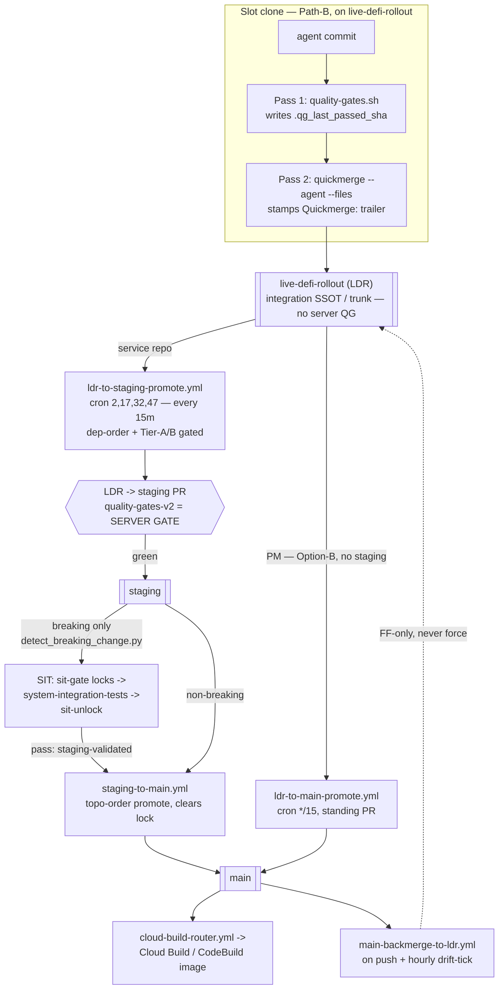

# CI/CD Flow

> SSOT for the workspace's CI/CD pipeline architecture. Covers the quickmerge two-pass model, branch policy, agent vs
> human paths, and the dep-branch flow for cross-repo feature isolation.
>
> Top-down pipeline picture: the **mermaid diagram** in "Branch model" below. Per-workflow drill-down (all 51 workflows,
> by stage/trigger/concurrency/fires-next): `docs/repo-management/CICD-WORKFLOW-CATALOG.md` — auto-generated by
> `scripts/generate-workflow-catalog.py` (regenerate after any workflow change; it can't rot).
>
> Cross-references: `CLAUDE.md` § "Git discipline"; `codex/08-workflows/dependency-cascade.md`;
> `codex/08-workflows/version-graduation.md`.

---

## Branch model — LDR trunk → staging → main (as-built; LDR-trunk decoupling 2026-06-10)

> **The unit of work lands on `live-defi-rollout` (LDR) and stops.** A slot ships via `quickmerge --agent --files`,
> which commits to LDR; the **Tier-C drain** (`ldr-to-staging-promote.yml`, every 15 min) promotes LDR→`staging`, and
> THAT drain PR's `quality-gates-v2` (head=LDR, base=staging) is the server gate — **LDR itself runs no server QG**. The
> retired `feat/* → staging → main` per-unit-PR model and the `tab/<op>/N` tab branches are gone (Path-B per-slot
> reference-clones are the isolation now). Top-down picture below; per-workflow drill-down in
> `docs/repo-management/CICD-WORKFLOW-CATALOG.md`.



| Branch                    | Role                                                                     | Server CI                          | How content lands                                    |
| ------------------------- | ------------------------------------------------------------------------ | ---------------------------------- | ---------------------------------------------------- |
| `live-defi-rollout` (LDR) | **The integration trunk + unit-of-work branch** — agents land here       | None (local `quality-gates.sh`)    | slot `quickmerge --agent --files`                    |
| `staging`                 | Drain target for service repos; only inbound is the Tier-C drain PR      | `quality-gates-v2` on the drain PR | `ldr-to-staging-promote.yml` (cron, every 15m)       |
| `main`                    | Reconciled output — semver bump + image-build trigger                    | `quality-gates-v2` + image build   | `staging-to-main.yml` / PM `ldr-to-main-promote.yml` |
| slot clone (Path-B)       | Per-slot `git clone --reference` checked out on LDR (the real isolation) | None (local QG only)               | edits → `quickmerge` to LDR                          |
| `feat/*`                  | Legacy optional isolation branch — **not** the workspace unit of work    | None                               | rare; Path-B clones supersede it                     |

**Never** push CODE directly to `main`/`staging`/LDR — always via `quickmerge` (the only sanctioned path: it runs the
two-pass QG, stamps the `Quickmerge:` provenance trailer, and the promote bots gate on it). The closed carve-out for
direct LDR pushes is narrow: `docs(plans):` flips, PM `scripts/**` + any `.github/**`, dirty-deps, and the FF-pull-in.

### PM repo — main-direct, NO staging (Option B, operator decision 2026-06-03)

`unified-trading-pm` is **not a deployed package**, and PM is the **SIT debouncer** (it is not itself SIT-covered), so a
staging hop adds no SIT value. (`unified-trading-codex` is an ARCHIVED repo — codex is folded into PM at `codex/`; it is
a PM subdirectory, NOT a separate promotion target.) **quickmerge routes PM PRs to `main` directly** (both docs AND
scripts/workflows — not just the doc-fast-path); the main PR's `quality-gates-v2` (plan-hygiene /
manifest+dependency-alignment / codex-ref / ruff) is the full per-repo gate. PM has **no `staging` branch** —
`pin_branch_protection_rulesets.py` + `verify_branch_protection_check_names.py` already tolerate this (no staging
ruleset → skip/pass). Downstream service repos building on `staging` still get PM transparently via the dep-clone
fallback (`clone -b staging` → `-b main`). For PM, **`main` is the reconciliation point** — it does for plans exactly
what `staging` does for service repos.

#### PM Option-B standing LDR→main PR (codified 2026-06-09)

PM has no `ldr-to-staging-promote` / `staging-to-main` drain (those need a `staging` branch). The ONLY path LDR→`main`
is the PR `quickmerge` opens — and because its head is the **branch ref** `live-defi-rollout` (not a fixed SHA), that PR
is a **standing sweep**: every commit on LDR (a quickmerge unit AND any sanctioned direct push — docs(plans) flips,
scripts/`.github` carve-out) rides it to `main` while it is open. Consequence (the foot-gun): the **moment that PR
squash-merges, the standing sweep is gone** — a LATER direct push to LDR has no open PR and **piles up on LDR with no
path to `main`** until the next quickmerge opens a new one.

- **Automated drain (codified 2026-06-09): `ldr-to-main-promote.yml`** — the PM-only analogue of
  `ldr-to-staging-promote`. Every 15 min (tightened from 30 min 2026-06-10) (+ `workflow_dispatch` +
  `repository_dispatch: ldr-to-main`) it opens (or reuses) the standing LDR→main PR with v2-gated auto-merge **whenever
  PM's LDR has real content ahead of main** — gated on the CHANGED-FILE count of `compare/main...live-defi-rollout` (0
  files → no-op, immune to squash-accounting noise), reusing any open PR (incl. quickmerge's) so it never duplicates,
  and self-recovering the v2-never-reported deadlock (close+reopen). So direct pushes now drain within a ~30-min SLA
  without waiting on the next quickmerge.
- **Manual immediate drain (the bot's fallback — when you don't want to wait up to 15 min):**
  `gh pr create --base main --head live-defi-rollout --title "chore(promote): LDR→main sweep …" && gh pr merge <n> --auto --squash`
  (v2-gated, auto-merges when green). This re-establishes the standing sweep and drains the accumulated direct pushes.
- **Verify a push actually reached `main` by CONTENT, not commit count:** a squash-merge lands all the changes as ONE
  new commit on `main` but does NOT preserve the LDR commit SHAs as ancestors, so
  `gh api repos/IggyIkenna/unified-trading-pm/compare/main...live-defi-rollout` reports LDR perpetually
  `ahead_by=N / behind_by=0` even when content is identical. Trust a content/path check (`git cat-file -e main:<path>` /
  inspect the merged PR), not `ahead_by`.
- **Prefer quickmerge** for anything substantive — it opens the PR for you. Reserve direct LDR pushes for the carve-out
  (docs(plans) flips, scripts/`.github`, dirty-deps), and remember to leave (or open) a standing LDR→main PR so they
  land on `main`.

### Convergence + conflict-resolution model (the LDR ↔ reconciliation loop)

- **LDR = the fast live integration axis** — agents commit here (tab→LDR), allowed to be _temporarily inconsistent_; no
  remote gate, FF-pull keeps every slot ≤5 min current.
- **The gated PR boundary = the reconciliation point** — `staging` for service repos, the `main` PR for PM (codex is a
  PM subdir, not a separate repo). Content only reaches `main` after the gate + conflict-resolution, so `main` is the
  _reconciled output_, never raw.
- **`main-backmerge-to-ldr.yml` feeds the reconciled result back to LDR** on every main push (additive merge, never
  force, never drop) → FF-pull → **every host (other VMs + operator laptops) converges**.
- **Three conflict layers — composable, no race:** (1) **TEXTUAL merge** → `conflict-resolution-agent` (reads all active
  plans, preserves both sides); MUST run on the Max-plan setup-token worker via `escalate-to-orchestrator`, not API
  credits. (2) **SEMANTIC** (two individually-valid plans whose _work_ conflicts, no textual overlap) → per-VM
  `review.md` + the scripted cross-plan **target-surface** overlap detector → owning epic-VM orchestrator reconciles or
  operator-blocks. (3) **HYGIENE** → `plan-health-agent` (scripted + Haiku, report-only).
- **Every alerting event ALSO pings the orchestrator** (not Slack-only): the operator does not continuously watch
  `#ci-failures`, so each alert (CI-fail, stuck PR, backmerge conflict) escalates to the orchestrator, which delegates
  to the owning slot / review-agent / epic-VM. (Backmerge-conflict + all-failure-class escalation tracked in
  `plans/active/qg_commit_quality_boundary_and_slot_ff_push_2026_06_03.md`.)

---

## Two-Pass Workflow Model (the unit of work)

> **Order is non-negotiable: quality gates BEFORE COMMIT** — the commit is the per-repo **quality boundary** (tightened
> 2026-06-03; supersedes "before quickmerge"). A **code** commit toward the integration branch must come from a
> `quality-gates.sh`-green tree, NOT on the strength of the light prek hook alone
> (ruff/format/gitleaks/conventional-commit). So Pass 1 (the full gate) runs on HEAD's content BEFORE you `git commit`
> code — not merely before quickmerge. Pass 1 writes the `.qg_last_passed_sha` sentinel; Pass 2 (`quickmerge --agent`)
> refuses to proceed without a matching sentinel and skips test re-runs on the strength of it. Realize it cheaply via
> **QG-sweep batching** (gate ONCE over a batch → make per-shippable-unit commits from that green tree) — the gate is
> per-batch, not per-commit. **Scope**: binds commits that touch source the gate checks; pure doc / plan-flip / markdown
> commits (e.g. `docs(plans):` flips) take the prek hook only — full QG is a source gate. Reach for quickmerge first (or
> skip flags) and either it hard-refuses or — worse — the change ships with tests never having run.

### LDR-trunk decoupling — quickmerge lands on LDR; the drain promotes; hotfix is the only break-glass (2026-06-10)

`live-defi-rollout` is the **gateless integration trunk in practice**. SSOT:
`plans/active/ldr_trunk_promotion_decoupling_2026_06_10.md`. What is **live**:

- **`quickmerge --agent --files` lands on LDR and stops** — for a service repo it no longer opens a per-unit LDR→staging
  PR (PM→main and `[skip ci]`→main paths are unchanged). The local `quality-gates.sh` sentinel is the LDR-landing gate.
- **Promotion is the Tier-C batched drain** (`ldr-to-staging-promote.yml`, **every 15 min** `2,17,32,47 * * * *`),
  tier-ordered
  - dep-order-gated. Its LDR→staging PR's `quality-gates-v2` (deps resolved against **staging-tier**,
    `base_ref=staging`) is the authoritative server gate — that PR's head IS `live-defi-rollout`, so it _is_ "CI on LDR
    content". **LDR never runs server QG itself** (a raw LDR-push QG lacks the staging base-ref → would re-break the
    dep-floor / BLR class).
- **The staging-coupled gates are scoped to `--hotfix`** — quickmerge STAGE 1.5 (staging-lock) and STAGE 1.7 (dep-tier)
  fire only on a `--hotfix`; a normal LDR landing skips them (the drain re-gates dep-order). STAGE 1.6 (dep-version) is
  a WARN for a normal landing, a BLOCK on `--hotfix`.
- **`--hotfix` is an auditable break-glass** — requires a `[hotfix]` marker in the commit message, opens an immediate
  staging PR, and **still hits the staging lock** (a queue-jumping change must reconcile with what's converging). A
  `--hotfix-to-main` (operator-gated; **not yet shipped** — needs a dedicated single-commit branch off main, since a raw
  LDR→main PR would promote the _whole_ trunk) is the exceptional main-direct path, gated only by `quality-gates-v2` on
  main.
- **`STAGING_GREEN` inherits from the promote PR (A1, live)** — `python-quality-gates-v2.yml` maps a green PR _into_
  staging (`base_ref=staging`) to `STAGING_GREEN`; the redundant `push:[staging]` QG run is slated to be dropped (A3).
- **The promote bot promotes only quickmerge-provenanced content (D1, live)** — both `ldr-to-staging-promote.yml` and
  `ldr-to-main-promote.yml` run `check_strict_quickmerge.py` over the promote range before arming auto-merge; a
  non-carve-out CODE commit lacking the `Quickmerge:` trailer leaves the PR open (auto-merge not armed). Fail-open on a
  checker error.
  - **The promote range MUST be the SINCE-LAST-PROMOTE range, NOT raw `staging..LDR` / `main..LDR` (HARD; bug found
    2026-06-17, fixed PM@b54da7855; `plans/archive/issues/provenance_gate_squash_perpetual_block_2026_06_17.md`).**
    Promotes are SQUASH merges, so a promoted LDR commit's SHA never lands on the target branch and its individual
    patch-id ≠ the squash's combined patch-id — meaning `git rev-list`/`git cherry`/`merge-base` over `staging..LDR` can
    NOT tell that an already-drained commit was promoted. So the historical, hardcoded
    `--range origin/staging..origin/live-defi-rollout` (resp. `origin/main..…`) **re-flags a one-time trailer-less
    commit on EVERY subsequent drain, forever** (the `14b11e2` / `06a83fb6` recurring "Provenance gate BLOCKED" noise;
    each drain needed a manual `gh pr merge --admin`). The contract: the bot tracks the **last successfully-promoted LDR
    SHA per repo** (a moved tag `last-promoted-to-staging` / `last-promoted-to-main`, or a state field) and the
    provenance check runs `<last-promoted>..origin/live-defi-rollout` — only commits since the last drain. This is
    **fail-safe** (a stale/missing marker widens the range → over-flags, never under-flags, so a genuine new bypass is
    still caught). **Do NOT "simplify" the range back to `staging..LDR`** — that re-introduces the perpetual-block
    regression. (The pre-push hook range `origin/live-defi-rollout..HEAD` is already a since-base range and is
    unaffected.)

Every shippable unit goes through exactly two passes:

```
Pass 1 — Quality Gates (MANDATORY — FULL run, no skip flags)
  bash scripts/quality-gates.sh
  • ruff format + check (lint + format)
  • pytest (tests, coverage)
  • basedpyright (type check)
  • STEP 5.x codex compliance (60+ rules)
  • pip-audit (CVE scan)
  On clean exit with NO skip flags → writes .qg_last_passed_sha = git rev-parse HEAD
  Partial runs (--skip-tests / --skip-lint / --skip-codex / --quick) do NOT write sentinel

Pass 2 — Quickmerge (--agent fast-path)
  bash scripts/quickmerge.sh "feat: description" --agent --files '...'
  • Reads .qg_last_passed_sha — verifies SHA matches current HEAD
    SHA mismatch / sentinel missing → EXIT 1: "Run quality-gates.sh on current HEAD first"
    SHA match → skips all Pass 2 QG re-runs (sentinel IS the guarantee)
  • stages ONLY --files; if a pre-commit hook reformats files and the first commit
    fails, the RETRY re-stages ONLY --files again (never `git add -A`) — a hook can't
    bundle foreign modified files into a scoped commit
  • --files staging is DELETION-AWARE (fix 2026-06-10, PM@3e472a19d): a tracked-but-
    absent path stages as a deletion (`[ -e "$f" ]` OR `git ls-files --error-unmatch`,
    then `git add -A -- "$f"`) in BOTH staging loops — previously the bare `[ -e ]`
    guard silently dropped deletions/rename-deletes, half-shipping removals
  • commits + pushes to live-defi-rollout, then STOPS (LDR-trunk decoupling 2026-06-10):
    a service repo lands on LDR; the Tier-C drain (ldr-to-staging-promote.yml, ~15 min)
    opens the LDR→staging PR whose quality-gates-v2 IS the authoritative server gate —
    quickmerge does NOT open a per-unit staging PR
  • EXCEPTIONS that open a PR directly: PM (Option-B → main) and --hotfix (→ staging).
    --to-staging is now a no-op (LDR-landing is unconditional for service repos)
```

> **`--files` scope is re-asserted on the prek commit-retry, and the pre-stage prettier is `--files`-scoped (foot-gun
> fix 2026-06-03).** Two places leaked foreign files into a scoped `--files` ship: (1) the commit-retry did `git add -A`
> after a hook reformatted staged files, sweeping ANY modified worktree file — a concurrent agent's WIP, an inventory
> regen — into the commit; (2) the pre-stage auto-format ran `prettier --write "**/*"` tree-wide, reflowing foreign
> files into residue. Both now scope to `--files` (the unscoped, `--files`-absent path still formats tree-wide +
> `git add -A` — there the caller owns the whole tree).
>
> **Why scoping does NOT orphan foreign edits** (the natural objection — "if prek reformats a foreign file and we don't
> stage it, isn't it stranded dirty forever, jamming FF-sync?"): the workspace answer is to **never create or touch
> foreign dirt**, not to sweep it into a stranger's commit. The on-commit `prettier-autostage` hook
> ([`scripts/hooks/prettier-autostage.sh`](../../scripts/hooks/prettier-autostage.sh)) only re-stages the _subset
> already staged_ ∩ modified (never a foreign-dirty file another slot holds open) AND **no-ops when the branch is behind
> origin** specifically so an about-to-be-blocked commit leaves zero reflow residue (the 2026-06-02 incident: a 69-file
> reflow residue stopped a slot's FF-sync). `git add -A` violated that rule — it didn't rescue foreign edits, it
> mis-attributed them into an unrelated PR. Foreign dirt from another process (e.g. the inventory regen) is its owner's
> to commit, or the FF-pull autostash's to carry — not quickmerge's. A HAND `git commit` is NOT covered — re-stage by
> name after any hook reformat, never `-A`. Fleet propagation: per-repo `scripts/quickmerge.sh` are **symlinks to the PM
> SSOT copy** (rollout completed 2026-06-10 via `scripts/propagation/rollout-quickmerge.py`; features/greeks/ml/e2e were
> the last 4) — edit ONLY the PM script; there are no per-repo copies left to drift.

### STAGE 0.4 Not-Behind Gate — behind-remote reconcile (multi-agent safety)

Before committing, quickmerge runs the **Not-Behind Gate** ([`quickmerge.sh`](../../scripts/quickmerge.sh) STAGE 0.4).
It must never ship from a STALE base, but local commits / uncommitted work that DEVIATE from origin are fine — that's
the work being merged. So if `HEAD` is BEHIND `origin/<current-branch>` it pulls latest FIRST, in this order:

1. `git pull --ff-only` — clean catch-up when you have no local commits.
2. else `git pull --rebase --autostash` — replays YOUR commits on top of the incoming, stashing uncommitted work first.
3. else `git rebase --abort` (your work restored intact — **never overwritten, never blind-merged**) and **BLOCK with
   exit 1**. Emergency override only: `QUICKMERGE_ALLOW_BEHIND=1`.

So quickmerging while behind by N with same-file local commits does NOT clobber the peer's work — it auto-reconciles if
it can, else stops and hands the conflict back. **PM-as-a-repo is covered by the same gate** (it keys off the current
branch's upstream); no PM special-case.

**Recovery on the exit-1 block** (the same recipe as the "Autostash conflict on rebase" rule in `CLAUDE.md`): evaluate
sync (`git rev-list --count HEAD..origin/<b>` / `..HEAD`) → preserve the peer's commits (NEVER
`git checkout HEAD -- <f>` / `reset --hard` on dirty unowned work) → stash YOUR files by name →
`git pull --rebase origin <b>` → reconcile the **essence** of both sides (3-way, keep both intents) → re-run
`quality-gates.sh` → re-run quickmerge.

> **Forward (tracked: `plans/active/qg_commit_quality_boundary_and_slot_ff_push_2026_06_03.md`)**: the prose block is
> being upgraded to a machine-parseable contract —
> `QUICKMERGE_BLOCKED code=BEHIND_DIVERGED_CONFLICT|AUTOSTASH_POP_CONFLICT …` + a `RECOVERY:` line — so a spawned agent
> recognises it and self-runs the recipe above without an operator paste.

**Pass 1 fix-mode — choose by WHAT you will commit (HARD RULE; AUTO-FIX rewrites the WHOLE worktree, not just your
files).** The sentinel is written on any COMPLETE green run — fix-mode OR `--no-fix` (the write is gated on
`RUN_TESTS && RUN_LINT && !QUICK && !ACT && !SKIP_CODEX`, NOT on fix-mode), so both modes satisfy Pass 1:

1. **Committing only your OWN named files** (the normal `quickmerge --agent --files '<paths>'` ship):
   `ruff format <your-paths>` first, then run **`bash scripts/quality-gates.sh --no-fix`**. Full gate, writes the
   sentinel, **does NOT reformat the tree**. Running ship mode here makes AUTO-FIX (`ruff format` + `ruff check --fix`)
   rewrite unrelated / foreign files in the worktree → re-dirties the slot (breaks the FF-sync the per-tab-worktree
   model depends on) and risks vacuuming foreign formatting into your commit. (Incident 2026-05-15: a ship-mode run for
   a _diagnostic_ reformatted 350 unrelated files; 2026-06-02: a ship-mode Pass-1 over 3 files re-dirtied 14 unrelated
   files.)
2. **You knowingly intend a tree-wide reformat and will own everything AUTO-FIX touches** (a deliberate format pass, or
   a solo worktree where re-dirtying is fine): plain **`bash scripts/quality-gates.sh`** (autofix ON) is correct — that
   is its purpose.

Either way the run must be FULL (no `--skip-*`/`--quick`) or no sentinel is written and quickmerge refuses.

**Why the sentinel?** Eliminates the staleness gap where an agent calls quickmerge after incremental edits without
re-running Pass 1. The SHA check is the enforcement mechanism — no partial run can fake a full pass. Pass 2 no longer
re-runs lint/typecheck/codex: the sentinel guarantees they passed.

**Pass 1 is now the SOLE upstream quality checkpoint (codified 2026-06-02).** With human approvals removed fleet-wide
(`required_approving_review_count=0` — autonomous CI/CD, see § "Agent vs Human Paths" + feature-branch-workflow.md §
"Zero human-approvals"), **nobody reviews an agent's PR before it auto-merges on a green gate.** So the FULL local
`quality-gates.sh` (Pass 1) + the quickmerge `--agent` sentinel check are no longer just a fast-path convenience — they
are the load-bearing quality bar. Two non-negotiables follow: (1) **always run the FULL Pass 1** (no skip flags) before
quickmerge — a partial run writes no sentinel and quickmerge will refuse; (2) **never hand-`git push`/merge to a
protected branch to "save time"** — that bypasses the sentinel + the gate entirely. The whole point of being on
`quality-gates-v2` everywhere is that **quickmerge is the agent gate in every case**, replacing manual push-and-merge.
The remote `quality-gates-v2` re-run on the staging PR is the backstop (fresh-deps Linux), but the local Pass 1 is what
keeps red code off LDR in the first place.

---

## Quickmerge Variants

```bash
# Default agent ship (the workspace unit of work): lands on live-defi-rollout and STOPS.
# The Tier-C drain (ldr-to-staging-promote.yml, every 15m) promotes LDR→staging.
bash scripts/quickmerge.sh "feat: description" --agent --files 'path/a.py path/b.py'

# --to-staging is a NO-OP for service repos (LDR-landing is unconditional; the drain promotes).
bash scripts/quickmerge.sh "feat: work" --to-staging   # == the default LDR landing

# Break-glass staging-direct (auditable; requires a [hotfix] marker in the message; still hits the
# staging lock). Opens an immediate LDR→staging PR instead of waiting for the Tier-C drain.
bash scripts/quickmerge.sh "fix: [hotfix] urgent staging patch" --agent --hotfix --files '...'

# Cross-repo feature isolation (deps on non-main branch) — HUMAN ONLY.
bash scripts/quickmerge.sh "feat: work" --dep-branch "feat/X"

# Human shortcut (skip act, keep tests)
bash scripts/quickmerge.sh "feat: work" --quick
```

**`--agent` is the default agent path** — it skips the GitHub Actions simulation (act) and test re-run (valid only if
Pass 1, the full QG, already completed and exited 0), commits + pushes to `live-defi-rollout`, and STOPS. It does NOT
open a per-unit staging PR; the Tier-C drain does. (PM is the exception — its `--agent` ship targets `main`, Option B.)

**`--to-staging` is a no-op** for service repos under LDR-trunk decoupling — LDR-landing is unconditional, so the flag
is equivalent to the default landing; the drain is what reaches `staging`.

**`--hotfix`** is the auditable staging-direct break-glass — it requires a `[hotfix]` marker in the commit message,
opens an immediate LDR→staging PR (rather than waiting for the ~15-min drain), fires the staging-coupled STAGE 1.5 / 1.7
gates, and **still hits the staging lock**.

**`--dep-branch`** is human-only — it pins the dep resolver to a non-main branch. Agents must not use it (agents always
land on LDR where deps are on main).

---

## Dep-Branch Flow (Cross-Repo Feature Isolation)

When a feature spans multiple repos (e.g. `unified-trading-library` → `execution-service`), agents do NOT use a shared
`feat/*` branch + `--dep-branch` (that path is human-only). Under LDR-trunk decoupling each repo's change lands on
`live-defi-rollout` independently; the Tier-C cron drain promotes them in dependency order — there is no per-unit
`--to-staging` ship:

```
Step 1: Land the UTL change on live-defi-rollout
  cd unified-trading-library
  bash scripts/quality-gates.sh --no-fix            # Pass 1 — writes the sentinel
  bash scripts/quickmerge.sh "feat: new UTL API" --agent --files 'src/...'

Step 2: Land the execution-service wiring on live-defi-rollout
  cd execution-service
  # deps already resolve against the dep repo's LDR HEAD (editable path source) — no --dep-branch
  bash scripts/quality-gates.sh --no-fix
  bash scripts/quickmerge.sh "feat: wire new UTL API" --agent --files 'src/...'

Step 3: The Tier-C drain promotes (no manual step)
  # ldr-to-staging-promote.yml (every 15m, dep-order) opens each LDR→staging PR; its
  # quality-gates-v2 (head=LDR, base=staging) is the server gate. A real breaking surface
  # change gates SIT; non-breaking ones drain LDR→staging→main on QG alone.
```

**Rule**: Never use `--dep-branch` (or a shared `feat/*` branch) in agent sessions. Agents land each repo on LDR;
internal deps resolve against the dep repo's LDR HEAD via the editable path source, and the drain reconciles staging.

---

## Breaking = public-surface change, NOT version phase (SIT scope; codified 2026-06-08)

**SIT and the cascade-lock fire ONLY on a real breaking change** — an actual change to the public API / schema /
contract surface that affects how a consumer imports or calls a symbol. They do **NOT** fire on a 0.x MINOR bump, a
docstring edit, an internal refactor, reformatting, or an added-optional kwarg. **`quality-gates-v2` still runs on EVERY
staging PR** (the breaking-gate narrows SIT, never QG).

- **Differ (SSOT)**: `scripts/cicd/detect_breaking_change.py` — a stdlib-only AST diff of the public surface
  (export-name set anchored on the package `__init__.py`, bare-name keyed so a symbol MOVED between internal modules is
  not a false "removed", changed-files-only for speed). **Breaking** = removed/renamed public export, removed public
  class/method, incompatible signature change (added-required / removed / reordered param, dropped `**kwargs`),
  removed/renamed/retyped Pydantic/dataclass field (the UAC schema case), **removed/renamed Enum member or changed Enum
  member VALUE** (StrEnum/IntEnum contracts — the serialized value IS the contract; added 2026-06-09 Phase 4 — consumers
  match on the member, so dropping `ORACLE_STALE` or flipping `"databento"`→`"databento_v2"` is breaking; a plain
  non-Enum class constant is NOT tracked), or removed HTTP route. **Not breaking** = additive (incl. a NEW Enum member),
  docstring, comment, reformat, reorder, move-across-modules. Regression-guarded by
  `tests/unit/test_detect_breaking_change.py` (incl. enum add/remove/value cases).
- **Scope boundary — the differ is a CODE public-surface tool; non-code contract surfaces are OUT of scope BY DESIGN**
  and governed by their OWN SSOTs, not semver / `is_breaking`: (1) **manifest `schema_version`** (a DATA-schema
  contract, versioned + migrated by the manifest canonicalisation walk, not a Python export — SSOT
  `codex/02-data/availability-manifest-and-data-status.md`); (2) **GCS path / partition keys** (`pipeline_mode=` /
  `asset_group=` / `feature_group=` / `feature_group_version=` — the on-disk hive contract, governed by
  `codex/02-data/pipeline-mode-partition.md` + `codex/02-data/feature-formula-versioning.md`). Changing one of these is
  a real contract change, but it does NOT trip the breaking differ and MUST be coordinated through its data-track SSOT +
  single-walk migration — never expect SIT/the cascade-lock to catch it. (Residual cross-link, 2026-06-12 — Phase 4 of
  `dependency_promotion_range_pins_and_major_bump_sit_2026_06_09.md`.)
- **Wiring**: each repo's `semver-agent.yml` (rolled out from `scripts/workflow-templates/semver-agent.yml.tmpl`) calls
  the differ — non-PM repos fetch it at runtime from `unified-trading-pm`. The differ verdict sets `is_breaking`
  (replacing the old `git diff __init__.py | grep '^-'` text heuristic that flagged ANY removed line). `feat!:` stays an
  explicit human-declared breaking override.
- **Lock + SIT gating**: `update-repo-version.yml` locks staging only on `bump_type == major or is_breaking`, and
  records the breaking repos in `staging_status.breaking_pending`. `sit-debounce-trigger.yml` dispatches SIT **only**
  when a pending repo is in `breaking_pending`; non-breaking promotions drain `LDR→staging→main` on QG / `MAIN_GREEN`
  alone (no SIT, no cascade lock) → the fleet drain is QG-paced, not SIT-paced. `breaking_pending` self-cleans (a
  promoted repo leaves the pending set; stale entries are pruned).
- **Why**: the dangling-lock fleet deadlock (2026-06-07/08) was a `feat`-level 0.x MINOR on `execution-service` mis-read
  as breaking → permanent "Breaking MINOR bump cascade" lock + failing SIT. Content-based detection is the root fix.
- **Cascade execution (`cascade-qg-ordering.yml`) runs in its OWN concurrency group (fixed 2026-06-10, PM@b6576fc27)**:
  it formerly shared the high-frequency `manifest-update` group, and GitHub holds only ONE pending run per group — so
  every queued cascade was EVICTED before it ran (run 27264972415: cancelled in 4s, 0 jobs; the cascade had never
  executed a level live). The H2 manifest-write-loss concern that motivated the sharing is covered IN-CODE by the
  workflow's retry-with-rebase manifest push — never re-share the group "for write safety" (redundant for safety, fatal
  for liveness). Detail: `codex/08-workflows/dependency-cascade.md` § "Concurrency + manifest-write safety".

- **Cascade poll semantics (fixed 2026-06-10, exec-svc 0.6.0 jam — PM#209 + PM@670a15aac)**: `poll_level` judges
  dispatched repos by manifest `ci_status`, which carries TWO traps now guarded in-code. (1) **Baseline-aware**: a repo
  whose ci_status was ALREADY `FAILING` pre-dispatch counts as PENDING until it flips (the dispatched run hasn't
  reported yet) — the prior code insta-failed the whole cascade at t=0s on stale redness (run 27271453887: died in 31s;
  the freshly dispatched QG passed 2 min later). (2) **`PASSING_STATUSES` includes `MAIN_GREEN` + `SIT_VALIDATED`** —
  the set was missing the two HIGHEST lifecycle states, so an already-MAIN_GREEN dependent polled as "pending" for the
  full 15-min level timeout (run 27273116468). `"VALIDATED"` was a phantom value no writer emits. Also: the workflow
  configures git identity (the downstream-invalidation commit previously died on `fatal: empty ident name` and the
  manifest write was silently lost). Post-fix proof: same cascade green in 29 s.
- **`ci_status` lifecycle (the state the cascade/promote bots read)**: a repo's CI state advances
  `NOT_CONFIGURED → LOCAL_PASS → FEATURE_GREEN → STAGING_PENDING → STAGING_GREEN → SIT_VALIDATED → MAIN_GREEN` (any
  state → `FAILING` on a red gate). `PASSING_STATUSES` must include the two highest states (`SIT_VALIDATED` +
  `MAIN_GREEN`) or an already-promoted dependent polls as "pending" forever (the run-27273116468 trap above).
  **Firestore is the LIVE SSOT side-store** for `ci_status`; `workspace-manifest.json` is the offline fallback cache —
  read Firestore for the current state, fall back to the manifest only when Firestore is unavailable.
- **The SIT loop is CLOSED end-to-end (fixed 2026-06-10 — TWO links were missing)**: the chain is `sit-debounce-trigger`
  → `sit-gate` (locks staging "SIT running" **+ dispatches `full-workspace-sit`** — previously it locked and dispatched
  NOTHING, so the SIT only ever ran on its nightly schedule and every lock dangled) → `full-workspace-sit`
  (system-integration-tests; **reports `sit-passed`/`sit-failed` back to PM on completion** — previously it reported
  nothing) → `sit-unlock` (**handles BOTH events** — previously only `sit-failed`, which nothing sent: a GREEN SIT could
  never unlock staging). `sit-passed` unlocks + clears `breaking_pending` + `pending_repos` + resets `sit_retry_count`.
  This pair was the systemic root of "staging is always locked".
- **Breaking fan-out multiplier (OPEN policy issue, filed 2026-06-10)**: one genuine breaking bump (e.g. UTL 0.5.0) fans
  out as `feat!:` re-pin commits to every consumer — each consumer's bump then classifies breaking BY INHERITANCE (the
  `feat!` override bypasses the AST differ) → N+1 `breaking_pending` entries + N+1 serialized cascade/lock windows for
  ONE surface change. Direction (tracked in `cicd_contract_hardening_2026_06_01.md` § "Cascade fan-out batching"): (a)
  batch the fan-out set into ONE cascade (union of dependents — the SIT side already batches via sit-debounce); (b) run
  the AST differ on the CONSUMER's own surface at re-pin time instead of inheriting `feat!` (a dep re-pin almost never
  changes the consumer's exports → most re-pins should be non-breaking, no lock at all).
- **Lock granularity (design note, operator direction 2026-06-10)**: the global lock's attributability argument only
  binds OVERLAPPING dependency cones — DISJOINT cones could freeze + SIT-validate in parallel (per-batch traceability is
  exactly what the Repos-CI dashboard SIT panel provides; see `codex/03-observability/monitoring-control-plane.md`).
  Tracked as a design item in `cicd_contract_hardening_2026_06_01.md`; do NOT implement ad-hoc — it interacts with
  sit-debounce batching and the manifest's single `staging_status`.

SSOT: `plans/archive/2026_06/sit_breaking_detection_content_based_2026_06_08.md`. Cross-link:
`ci_local_qg_parity_2026_06_08.md` — SIT is the assembled-invariant LAYER (cross-repo, now breaking-gated); QG-v2 is the
per-repo layer that still runs on every staging PR.

### Dependency promotion — range pins absorb minor/patch; only MAJOR forces a consumer rebuild (codified 2026-06-09)

The consequence of "breaking = major" for the **dependency graph**: internal-dep version churn must NOT cascade rebuilds
fleet-wide. The model (operator 2026-06-09):

- **Declared pins are RANGES** (`unified-api-contracts>=0.1.0,<1.0.0`) with **editable path sources**
  (`[tool.uv.sources] path = "../unified-api-contracts"`). A **minor/patch** internal bump stays inside `<1.0.0` → the
  range absorbs it → **no consumer rebuild, no CI noise**. A consumer picks up the newer dep only when IT next runs its
  own promote workflow (pull, not push) — its build may lag the latest dep; the upside is a stable prod + no thrashing.
- **`uv.lock` is already correct — do NOT "fix" it.** Internal deps are recorded as `source = { editable = "../…" }`
  (the `version =` is a snapshot; the install resolves from the source PATH, not the recorded version), external deps
  lock exact (reproducibility). There is **no exact-pin bug** and no "range-aware lock gate" to build (a 2026-06-09
  false-start — tombstoned in `dependency_promotion_range_pins_and_major_bump_sit_2026_06_09.md`).
- **CI installs the COMMITTED lock via `uv sync --frozen`; `pyproject.toml` is the edit-surface, the lock is the
  deterministic install snapshot (operator 2026-06-12, speed > security).** The reusable workflow installs with
  `uv sync --frozen` — the committed `uv.lock` as-is, NO re-resolution (no surprise transitive deps; the CI-only
  `pip==26.0.1` PYSEC-2026-196 divergence that plain `uv sync` re-resolution introduced is gone). `--frozen` NOT
  `--locked`: `--locked` / `uv lock --check` asserts pyproject↔lock consistency and would HARD-FAIL on the
  semver-agent's CI-side `version =` bump (a poison-pill — one bumped version with no lock regen reds every later PR's
  `--locked`); `--frozen` tolerates it (the root pkg is editable-installed from source, so the bumped version is what
  installs regardless of the lock). **Rule (replaces the freshness gate):** editing a dependency FLOOR in
  `pyproject.toml` requires regenerating + committing `uv.lock` in the SAME commit (`uv lock`, or
  `uv lock --upgrade-package <name>` to move an existing transitive pin) — otherwise `--frozen` silently installs the
  stale lock and the floor never takes effect in CI. A bare `version =` bump needs no lock regen. No transitive-CVE HARD
  block — pip-audit / internal-advisories on transitive pins WARN; a CVE fix = bump the floor + regen the lock. SSOT:
  `dependency_promotion_range_pins_and_major_bump_sit_2026_06_09.md` Phase 1.
- **Dep resolution in CI is CONTENT-FIRST (LDR-HEAD clone) + the range check is NON-BLOCKING (2026-06-11; SUPERSEDES the
  version-aware-clone loud-fail).** `python-quality-gates-v2.yml::clone_repo` clones each internal dep at its
  **`live-defi-rollout` HEAD** — the SSOT content local editable siblings resolve against — so CI typechecks the dep's
  actual content, not a pinned-tag snapshot (the version-aware tag chain is now only a FALLBACK when the LDR clone
  fails). `assert_dep_in_range` then verifies the cloned version vs the consumer's pinned range but **WARNs
  (`::warning::`), never `exit 1`**: a clone outside the pinned range uses the cloned HEAD content; the range is
  enforced content-based downstream (`check_dep_content_sync.py`). **Why**: during a promotion window a dep's
  `versions{}` legitimately leads its released tag — and a phantom (instruments-service's runaway `0.30.0` vs tag
  `v0.2.1` made a consumer `>=0.30.0` floor unsatisfiable-by-tag) — so the old loud-fail false-failed PM/UTL/e2e on this
  skew. **A "CI count over ceiling but local fine" symptom is therefore a RE-RUN, not a ceiling-bump.** SSOT: the
  reusable workflow's `clone_repo`/`assert_dep_in_range` steps + `check_dep_content_sync.py`; archived
  `ci_local_qg_parity_2026_06_08.md`.
- **A MAJOR bump (crosses `<1.0.0`) FORCES the consumer to re-pin** → it must **trigger a cascade of quality gates (full
  SIT in dependency order)** across dependents. **vm-planning is escalated ONLY IF that cascade FAILS** — a GREEN
  cascade promotes the major automatically with **no human/orchestrator involvement**. Mechanical jams (the
  `[skip ci]`-version- bump-head deadlock) are first cleared in-band by `ci-failure-watcher --auto-recover`
  (workflow_dispatch re-fire), not a human; only a genuine QG failure is the vm-planning case.
- **What is major vs minor** is the breaking-change matrix above (`detect_breaking_change.py` + the schema/API-contract
  rules), refined deliberately — never a version-phase guess.

Status: model + content-first LDR-HEAD clone (non-blocking range warn) are LIVE; the MAJOR→cascade→escalate-only-on-fail
wiring is the open work. SSOT: `plans/active/dependency_promotion_range_pins_and_major_bump_sit_2026_06_09.md`.

## LDR is the SSOT — clean-start force-sync + drift-tick (codified 2026-06-08)

`live-defi-rollout` is the integration source of truth and the live accumulator (slots push there). `staging` and `main`
are **downstream projections** of LDR. When they diverge by promotion artifacts (merge nodes, re-applied `[skip ci]`
writes, superseded workflow copies), the divergent commits are **noise to collapse, not work to merge** — verified by a
zero-file-content-delta `compare` (`ahead_by` > 0 but `files: []`). The **only** preserve-rule: genuinely-newer
main/staging-only content (a real feature, or a CI-workflow fix LDR lacks) is **back-merged DOWN to LDR first**, then
the branches force-sync to LDR.

- **Clean-start force-sync** (fast bulk alignment, not a 30-repo serial promotion): version-align → for each repo relax
  protection (disable rulesets + classic `enforce_admins`/`allow_force_pushes`) → force `main` + `staging` to the LDR
  tip → **restore protection + re-enable rulesets in the same per-repo step** (crash exposure = 1 repo). Operator-gated
  authority (force-push main/staging, relax→do→re-enable rulesets). Real main/staging-only content is backmerged to LDR
  before the force.
- **Drift-tick**: `main-backmerge-to-ldr.yml` runs `on: push: branches:[main]` **plus a `schedule: 0 * * * *`** (hourly
  — relaxed from `*/20` 2026-06-11 to cut Actions spend) — because `[skip ci]` commits to `main` (ci_status /
  staging_status / manifest-version writes) suppress ALL Actions triggers including the push trigger, so `main`
  chronically drifts ahead. A scheduled run is not `[skip ci]`-suppressed and sweeps the accumulated drift, so "`main`
  never ahead of LDR" holds in steady state (modulo the ≤60-min hourly window), not just eventually-converges. (Edit the
  SSOT template + `rollout-workflow-templates.sh` fleet-wide — a template-only edit drifts every per-repo copy and
  reddens the PM drift gate.)

### Workflow-template rollout is a TWO-half operation — the second half (commit fleet-wide) is mandatory (HARD RULE, 2026-06-10)

`rollout-workflow-templates.sh` only does HALF the job: it **writes** the SSOT template
(`scripts/workflow-templates/<wf>.yml`) into all 24 repos' `.github/workflows/` **working trees**. The second, mandatory
half is to **commit + push the per-repo change to each repo's `live-defi-rollout`** in the same unit (a per-repo
`ci(workflow-templates): roll out <wf>` commit — exactly like a fleet GHA version bump). **A rollout left as uncommitted
working-tree churn is the #1 cause of stale clones**: the `*/5` `slot-cron-ff-pull` cron skips any clone with a dirty
tree (`[skip:dirty]` — it preserves WIP, never overwrites), so a clone with rolled-out-but-uncommitted workflow files
**falls behind LDR indefinitely**. On a worker VM that strands the executor PM clone → the orchestrator's
`PlanRegenLoop`/plan-health read stale plans → the backlog starves. **Incident 2026-06-10**: a committed
`main-backmerge-to-ldr.yml` template change (GH_PAT conflict-PR fix) was never rolled-out-and-committed →
`detect_template_drift --workflows` flagged ~19 repos drifted, AND the rollout's working-tree output had been left dirty
fleet-wide → vm-planning + all 28 main clones stranded 13–545 commits behind → empty backlog, idle review agent.
**Definition of done for any template edit**: (1) `detect_template_drift.py --workflows` exits 0, AND (2)
`git status .github/workflows/` is clean in every repo (no rolled-out-but-uncommitted copies). Verify BOTH before
declaring it shipped. Can't finish in-session → it's a tracked plan todo; never leave silent fleet drift, because the
FF-pull cron cannot self-heal a dirty tree (only `detect_template_drift` surfaces it, and that's a local-only post-gate,
a CI no-op).

SSOTs: `plans/active/staging_clean_start_and_stale_pr_hygiene_2026_06_08.md` +
`plans/active/ci_local_qg_parity_2026_06_08.md` (local LDR-checkout QG in dep order is the staging oracle).

## Strict quickmerge — direct integration-branch code pushes are BANNED (HARD RULE, 2026-06-08)

CODE reaches the integration branch ONLY via `quickmerge --agent --files`. A direct `git push` of code to
`live-defi-rollout`/`staging`/`main` dodges the dep-version gate (1.6), dep-tier gate (1.7), and dep-content gate, and —
since quickmerge early-exits "nothing to commit" on a clean tree — silently piles commits on LDR behind `main` with no
staging PR. The **closed carve-out set** (the only sanctioned direct pushes; reconciled with
`qg_commit_quality_boundary_and_slot_ff_push_2026_06_03.md` — one set, do not fork):

1. **Dirty-deps** — a dep repo dirty mid-edit → commit+push the dep directly to LDR (never quickmerge with dirty deps).
2. **FF-pull-in** + the **cross-repo PM plan-flip** (`docs(plans):`).
3. **PM `scripts/**`+ any repo's`.github/**` workflow** change that must reach `main` to unblock the pipeline (the
   chicken-and-egg — a corrected gate can't pass through the gate it's fixing); operator/admin authority.

Everything else is HARD-blocked. **Enforcement — the machine guard is LIVE (shipped 2026-06-08; observed firing on every
LDR push 2026-06-10)**: quickmerge stamps a `Quickmerge: agent|human` lineage trailer on every commit it ships;
`scripts/cicd/check_strict_quickmerge.py` flags a CODE-source commit (`*.py`/`*.ts` outside scripts/tests/.github)
reaching the integration branch without that trailer that is not a carve-out
(docs/plans/codex/.github/scripts/config/merge/[skip ci]/bot). It runs as a `pre-push` hook
(`scripts/dev/hooks/pre-push-strict-quickmerge.sh`, installed in all Path-B clones + wired into `setup-tab-worktrees.sh`
for new clones); WARN-default, `STRICT_QUICKMERGE_BLOCK=1` to hard-block; the staging-PR `quality-gates-v2` is the
server backstop (LDR has no remote CI). Policy + guard shipped via
`plans/archive/2026_06/quickmerge_dep_content_sync_and_strict_enforcement_2026_06_08.md` (archived 2026-06-10).

## Local ↔ CI QG parity matrix (the confidence model; codified 2026-06-08)

LDR is the staging oracle: local `quality-gates.sh --no-fix` in dep order on an LDR checkout, content-sync-gated, should
predict staging-`quality-gates-v2`. Where they differ is a **bug to audit** (`ci_local_qg_parity_2026_06_08.md`), not a
normal occurrence. The divergence surface:

| Gate step                                                                         | local `quality-gates.sh --no-fix` | staging `quality-gates-v2`         | assembled SIT (`full-workspace-sit`) | Parity verdict                                   |
| --------------------------------------------------------------------------------- | --------------------------------- | ---------------------------------- | ------------------------------------ | ------------------------------------------------ |
| ruff / format / basedpyright                                                      | yes (touched + repo)              | yes (`--no-fix`, identical)        | n/a                                  | **byte-identical** (same pins, same config)      |
| pytest (unit) + coverage                                                          | yes                               | yes                                | n/a                                  | identical (`PYTEST_UNIT_DIR` honored both sides) |
| codex compliance (STEP 5.x)                                                       | yes                               | yes                                | n/a                                  | identical                                        |
| editable deps                                                                     | working-tree (content-sync-gated) | cloned-pinned (tag→branch)         | full workspace assembled             | gated equal via `check_dep_content_sync`         |
| **workflow-template drift**                                                       | hard gate (live branch copies)    | **CI no-op** (tag-pinned snapshot) | n/a                                  | **intentional**: local/full-host only (tag lag)  |
| **cross-repo invariants** (feature-DAG SSOT, cassette↔consumer, data_type canon) | DEFERRED-TO-SIT (partial dep set) | DEFERRED-TO-SIT                    | **runs here** (full assembly)        | **intentional SIT-assembly delta**               |

The two **intentional** deltas — the workflow-drift CI no-op (CI clones tag snapshots, not the deployed copy) and the
assembled-SIT cross-repo layer (per-repo QG has a partial dep set) — are the only sanctioned local↔CI gaps. A
local-green-in-dep-order ⇒ expect staging-v2-green, modulo SIT. Any OTHER local-green/staging-red event is a parity
defect → auto-file `plans/active/issues/ci_local_qg_divergence_<repo>_<date>.md` (the parity watchdog,
`scripts/cicd/parity_watchdog.py`) and audit which step diverged. SSOT: `ci_local_qg_parity_2026_06_08.md`.

## Version Bump Flow (Semver Agent)

Semver is managed entirely by the semver-agent GitHub Action — never bump manually.

| Commit prefix                         | Triggers                      | Result        |
| ------------------------------------- | ----------------------------- | ------------- |
| `feat:`                               | MINOR bump on `0.x.x`         | 0.1.0 → 0.2.0 |
| `fix:` / `chore:` / `docs:`           | PATCH bump                    | 0.1.0 → 0.1.1 |
| `feat!:` or `BREAKING CHANGE:` footer | MAJOR bump (after 1.0.0)      | 1.0.0 → 2.0.0 |
| `feat!:` on `0.x.x`                   | MINOR bump (pre-1.0.0 policy) | 0.1.0 → 0.2.0 |

**Version graduation (1.0.0)**:
`gh workflow run request-major-bump.yml --repo IggyIkenna/<repo> -f proposed_version="1.0.0"` → comment `/approve`. Full
SSOT: `codex/08-workflows/version-graduation.md`.

### Version feedback to staging/LDR + the main→LDR back-merge requirement (codified 2026-06-01)

The semver bump is **computed on `staging`** (semver-agent reads the commit labels + the `staging_versions` baseline),
then fed back to the workspace as a `version-bump` `repository_dispatch` to **unified-trading-pm**, whose
`workspace-manifest.json:staging_versions` is the central SSOT. PM's `update-dependency-version.yml` cascades the new
version into every dependent repo's pyproject, and those updates flow back through the normal
`quickmerge → staging → main` path.

**The closure rule (applies to version bumps AND the PM doc-fast-path):** any commit that lands **directly on `main`**
MUST be back-merged to `live-defi-rollout`, or the standing LDR→staging PR conflicts on the changed line (classically
the version line — the generalized form of the Phase-5 main↔LDR drift). Two sources of main-only commits:

- **semver bump on `main`** — the main-side version write (+ any `[skip ci]` manifest/deps automation).
- **PM doc-fast-path** — PM plans/docs/cursor-rules (`*.md` / `*.mdc`) PR **directly to `main`**, bypassing LDR→staging.

Both are reconciled by **`.github/workflows/main-backmerge-to-ldr.yml`** (PM, trigger `push:[main]`) — it auto-advances
a `main → live-defi-rollout` back-merge so main-only commits never strand. **Never leave a main-only commit unmirrored**
— an unmirrored main commit is the exact mechanism behind the Phase-5 PM main↔LDR ~95-file drift.

---

## Full CI/CD Flow (LDR → Cloud Build)

Canonical flow is in `codex/08-workflows/deployment-flow.md`. Summary:

```
LDR: quality-gates.sh (full) → sentinel written → quickmerge --agent (SHA check)
  → lands on live-defi-rollout and STOPS (no per-unit staging PR for service repos)
  → Tier-C drain `ldr-to-staging-promote` (~15 min) opens the LDR→staging PR
  → quality-gates-v2 GHA (head=LDR, base=staging; full, ubuntu-latest, fresh deps)
  → on failure: #ci-failures Slack alert with PR link + source/target branch
  → staging merge → semver-agent bump → staging-to-main
  → main: Cloud Build (docker build + QG --quick inside image + CVE scan + push)
```

**`quality-gates-v2` GHA vs local quality-gates.sh**: same script, different env. GHA resolves deps against the dep
repos' `live-defi-rollout` HEAD content (version-aware tag chain as fallback) on Linux; local uses workspace path deps
on macOS. The dep-resolution gap is the only meaningful divergence — caught at the staging PR boundary.

**`quality-gates-v2` triggers**: `push: [main]` + `pull_request: [main, staging]` + `workflow_dispatch`. LDR runs no
server `quality-gates-v2` — local QG + sentinel is the only gate on LDR (by design), and the Tier-C drain's LDR→staging
PR (head=LDR, base=staging) is where v2 runs. This is intentional integration-branch best practice: the **required-check
ruleset is enforced at the staging/main PR** (the promotion boundary); **local QG (`quality-gates.sh` → sentinel) is the
agent + quickmerge pre-flight** (fail-fast), not a server gate; and the integration axis stays cheap to push to. The
`require-quality-gates` ruleset targets `~DEFAULT_BRANCH` — so **every repo's default branch MUST be `main`**; a
non-main default (e.g. `live-defi-rollout`) mislocates the required check onto LDR and `GH013`-rejects pushes to the
integration axis (incident 2026-06-03: `unified-trading-api` + `greeks-service`;
`verify_branch_protection_check_names.py` now asserts `default_branch == main` fleet-wide).

### Branch-triggered build — hotfix image off an arbitrary branch (no main promotion, codified 2026-06-01)

For a hotfix / fast-dev cycle you can build + push an image **without** promoting through `main`:

- **Cloud Build trigger path** — `deployment-service/scripts/setup-cloud-build-triggers.sh` registers per-service
  triggers; point one at the hotfix branch, or run the build manually against the checked-out branch:
  `gcloud builds submit --config deployment-service/cloudbuild.yaml --substitutions=_SERVICE_NAME=<svc>,COMMIT_SHA=<sha>`.
  The image is tagged `…/<service>:${COMMIT_SHA}` (immutable provenance) + `:latest`; the `COMMIT_SHA` tag lets you
  deploy the exact branch build without it ever touching `main`.
- **Local-code path (no registry build)** — `bash deployment-service/scripts/vm/create-code-tarballs.sh` produces a
  **SHA-pinned** code tarball straight from the working tree; a VM launcher pulls that tarball instead of an image. Use
  this when you need to run uncommitted/branch code on a VM faster than a Cloud Build round-trip.

Both are escape hatches for iteration speed; the canonical production path stays LDR → staging → main → Cloud Build.
**Never leave a branch-built image deployed as the steady state** — promote the fix through `main` once verified.

---

## Agent vs Human Paths

| Operation          | Agent                                                                                                                                                                                                                                                                          | Human                                                    |
| ------------------ | ------------------------------------------------------------------------------------------------------------------------------------------------------------------------------------------------------------------------------------------------------------------------------ | -------------------------------------------------------- |
| Run quality gates  | `bash scripts/quality-gates.sh` (FULL — no skip flags)                                                                                                                                                                                                                         | Same                                                     |
| Quickmerge         | `bash scripts/quickmerge.sh "..." --agent --files '...'`                                                                                                                                                                                                                       | `bash scripts/quickmerge.sh "..."`                       |
| SHA sentinel check | Automatic in `--agent` — blocks on mismatch                                                                                                                                                                                                                                    | Not enforced (human responsibility)                      |
| Push to LDR        | quickmerge commits + pushes to LDR and STOPS; the Tier-C drain opens the LDR→staging PR (no per-unit PR)                                                                                                                                                                       | Same via quickmerge                                      |
| Promote LDR → main | ✅ Autonomous, green-gated: quickmerge lands on LDR → Tier-C drain LDR→staging (auto-merge on green `quality-gates-v2`) → automated staging→main (semver/SIT). **No human merge** — the green gate is the approval (`required_approving_review_count=0`, codified 2026-06-02). | Same; admin-merge only a genuinely-stuck promotion       |
| Dep-branch work    | ❌ NOT ALLOWED (`--dep-branch` human-only)                                                                                                                                                                                                                                     | `bash scripts/quickmerge.sh "..." --dep-branch "feat/X"` |
| Version graduation | ❌ NOT ALLOWED                                                                                                                                                                                                                                                                 | `gh workflow run request-major-bump.yml ...`             |
| Kill-switch arming | ✅ Protective arming autonomous (kill-switch / `STOP_NEW_ONLY` / firm-wide halt); resume only within the auto-recovery matrix — destructive `manual_unkill` (`KILL_ALL`/`CANCEL_OPEN`) is human-only                                                                           | Manual via deployment-service API                        |
| Wallet key ops     | ❌ NOT ALLOWED                                                                                                                                                                                                                                                                 | Hardware wallet / KMS console                            |

---

## CI Verification After Push

After every push to a branch with CI:

```bash
# Check CI status
gh run list --branch <branch> --repo IggyIkenna/<repo> --limit 5

# Inspect failures
gh run view <run-id> --log-failed
```

Pushes to `feat/*` / `live-defi-rollout` → **no remote CI**. Quality enforced locally via `quality-gates.sh`. Pushes to
`main` / PRs → CI runs. Always verify CI green before reporting "shipped".

### Central CI watcher — auto-recover vs escalate, and the RESOLVED bookend (codified 2026-06-09)

`scripts/repo-management/ci_failure_watcher.py` (cron `ci-failure-watcher.yml`, `*/15`) runs `--auto-recover --escalate`
and distinguishes **two** classes of stuck promotion PR so it never hands a code-fixable problem to a human/worker:

- **v2-never-reported deadlock** (mechanical) — signature `BLOCKED + failed_check==false + v2_present==false`: the
  required `quality-gates-v2` check never _fired_ on the PR head (e.g. the head was pushed with `[skip ci]` or by a
  token that suppresses the `pull_request` event). `auto_recover_stuck_prs()` does `gh pr close` + `gh pr reopen`,
  re-firing `pull_request` → v2 runs. **No worker, no orchestrator dependency.** Idempotent: once reopened, v2 is in the
  rollup (`v2_present==true`) so the next tick won't re-fire — no loop. Runs BEFORE escalate.
- **genuine conflict wall** (CONFLICTING/DIRTY) — `conflict_prs_to_escalate()` repository-dispatches to
  `escalate-to-orchestrator.yml` so a worker rebases on LDR. Escalation REQUIRES a healthy, headroom-having
  orchestrator; escalating a mechanical deadlock there only yields "no worker spawned". So keep escalate rare —
  auto-recover absorbs the deadlock class.

**RESOLVED/recovered bookend → Slack (so the operator doesn't have to click the PR):** `detect_resolved_prs()` posts
`:ballot_box_with_check: N promotion PR(s) RESOLVED (merged/closed)` at INFO severity (the watcher's notify still fires
on resolved/recovered alone). **Gotcha that killed this for months:** `gh pr list --json merged` is an INVALID field
(404s the whole query → the bookend silently never fired) — use **`mergedAt`** (non-null ⟺ merged). Companion:
`scripts/cicd/promotion_lag_monitor.py` (`promotion-lag-monitor.yml`, `*/30`) pages time-based LDR↔staging↔main lag
(oldest un-propagated commit > 60 min), the diff that matters under Path-B (where local-vs-upstream is ~always 0).

---

## Canonical required check name (post-Option-D, 2026-05-29)

The workspace-canonical required status check is **`quality-gates-v2`** (NOT the legacy `quality-gates`).

**Why the rename?** A 2026-05-26 bad-YAML incident in `python-quality-gates.yml` caused GitHub to cache a "BuildFailed"
ghost workflow registration that fired startup_failure on every subsequent push across 10+ workspace repos. The fix
(Option D, shipped 2026-05-29 via `ci_canonical_v2_migration_2026_05_29` plan) renames the entire caller+callee chain to
new file paths (`quality-gates-v2.yml` + `python-quality-gates-v2.yml`) and a new job key (`quality-gates-v2`) so GitHub
registers a fresh validation context that bypasses the cached ghost.

**Parallel slicing preserves the required context (2026-06-10).** The reusable workflow's single gate job was fanned
into a `strategy.matrix.slice: [tests, typecheck, lint-codex]` job (`QG slice (...)` legs, NOT required) + a
`needs:`-all aggregation job that is **both keyed AND `name:`-d `quality-gates-v2`** — so the required context stays
exactly `Quality Gates (<repo>) / quality-gates-v2` (= caller job name `/` reusable job display name)
green-iff-all-legs-pass. **The aggregation job's `name:` is load-bearing**: a friendly label (e.g. `aggregate`) emits
`… / aggregate` instead → the required context never reports → every PR permanently BLOCKED (caught live by the PM
canary). Wall-time → `max(slice)` not `sum`. A `content-gate` job (git-tree-hash GHA cache) short-circuits redundant
byte-identical re-runs to GREEN (fail-safe: a miss runs the full gate; never false-greens). Coverage + the required
check are unchanged; only the within-repo wall-time drops (cross-repo was already parallel). SSOT: `quality-gates.md` §
"CI parallel slice jobs + `QG_SLICE`" + `plans/archive/2026_06/cicd_v2_latency_reduction_2026_06_10.md`. **Gotcha
(incident, 2026-06-10):** the slice early-exit `_qg_slice_done` must be PHASE-aware — the first shipped cut exited the
`typecheck` slice green at the post-TESTS call site BEFORE basedpyright ran, making every repo's CI typecheck leg a
silent no-op (fleet-wide false-green; fixed PM@71a2e103b, main via PR #204). Detail: `quality-gates.md` § "CI parallel
slice jobs + `QG_SLICE`".

**Status across workspace** (per `codex/06-coding-standards/feature-branch-workflow.md` § "Per-repo required-check
matrix"):

- v2 deployed on canonical branches of all **17** workspace repos (includes the 10 ghost-affected + 3 priority: PM, UAC,
  UTL + remaining service repos)
- Branch protection / ruleset enforcement updated to require `quality-gates-v2` across all 17 repos
- Sentinel-write logic (commit `a8b758c58`) ensures local `quality-gates.sh` writes `.qg_last_passed_sha` on clean
  full-pass exit, enabling quickmerge `--agent` fast-path

**v1 cleanup**: the v1 caller workflows (`quality-gates.yml`, `workspace-qg.yml`) are RETIRED + deleted fleet-wide
(2026-05-30). The required check is `quality-gates-v2` everywhere; the legacy names `workspace-qg` / `quality-gates` /
"Quality Gates" no longer exist as workflows. Tracked in `ci_canonical_v2_migration_2026_05_29.md` Phase 5.

---

## Branch-protection mechanism — RULESET + classic, both (codified 2026-06-01)

Every workspace repo carries **TWO** server-side protections on `main` (and usually `staging`), and BOTH must agree or
merges silently dead-lock:

1. **Ruleset** `require-quality-gates` (and `require-staging-lock-check` on staging) — the **canonical** mechanism.
   Required context is **derived from the live workflow file** (`<job name:> / quality-gates-v2`), so a wrong job
   `name:` = a context no run ever emits = a permanently-unsatisfiable required check. Verify with
   `scripts/repo-management/verify_branch_protection_check_names.py`; apply with `pin_branch_protection_rulesets.py`
   (derives from `--ref`, default `live-defi-rollout`). **`pin --apply` re-pins main AND staging from the same ref** —
   don't run it globally unless v2 exists on staging too, or it blocks staging.
2. **Classic branch protection** `required_status_checks` — legacy, still enforced. Historically pinned to the **bare**
   context `quality-gates-v2` (or v1 `quality-gates`), which **no Actions run emits** (the real context has the
   `Quality Gates (<repo>) / ` prefix) → blocks every **non-admin** merge while `enforce_admins=false` lets admins
   bypass (masking it). Fix: `gh api -X PATCH repos/IggyIkenna/<repo>/branches/<br>/protection/required_status_checks`
   with `checks=[{context:"Quality Gates (<repo>) / quality-gates-v2"}]`. Swept workspace-wide 2026-06-01.

**`enforce_admins`** (classic) makes the required check bind admins too — so once on, you can no longer admin-bypass a
red/blocked branch. Only enable it on a branch whose v2 is **green** (enabling on red blocks all merges). Target state
(Phase 2): true on every protected `main` **whose `main` receives code only via gated staging→main PR merges** (all
service repos). **EXCEPTION — orchestration repos that DIRECT-push `[skip ci]` bookkeeping commits to their own `main`**
(`unified-trading-pm`: `staging-to-main` promotes the manifest; `sit-gate` / `sit-unlock` / `hotfix-mode` /
`sit-debounce-trigger` write staging lock/mode state) **run `enforce_admins=FALSE`.** A `[skip ci]` commit never
produces a `quality-gates-v2` run, and a required-check PR would deadlock (the check can only run _after_ the push it is
blocking), so these direct pushes cannot satisfy a v2 gate — they bypass it as the admin `GH_PAT`. The ruleset
(`require-quality-gates`, admin `bypass_mode: always`) + classic `required_status_checks` fully gate **everyone** (the
green `quality-gates-v2` check is the merge criterion). **Human review is NOT a gate** — `required_pull_request_reviews`
is `required_approving_review_count=0` fleet-wide (codified 2026-06-02, autonomous CI/CD: see § "Two-Pass" +
feature-branch-workflow.md § "Zero human-approvals"); a green gate auto-merges, so agents promote via quickmerge with no
manual merge. Only the special PM SIT-chain `[skip ci]` manifest pushes bypass via `enforce_admins=false` as described
above. Verified by the #257 chain e2e: with `enforce_admins=true` the `staging-to-main` manifest push was REJECTED
(`GH013 … "quality-gates-v2" is expected` / `Changes must be made through a pull request`); with `enforce_admins=false`
it pushes (`Bypassed rule violations for refs/heads/main`) and the promote job is green. **Do NOT "restore" PM `main` to
`enforce_admins=true`** — it strands the SIT-chain manifest writes. (The earlier claim that `[skip ci]` automation
reaches `main` via the staging→main PR flow was wrong: `staging-to-main` STEP 10 is a plain `git push`, not a PR.)

## Force-push vs let-CI/CD — the decision rule (codified 2026-06-01)

**Admin force (relax ruleset + `enforce_admins` → do it → RE-ENABLE, guaranteed) is for the initial clean-slate ONLY,
where the normal flow is structurally circular** — the branch's required check cannot run / be satisfied by a PR:

- adding a **missing / wrong-named** `quality-gates-v2.yml` to a branch whose ruleset already requires the v2 context;
- **FF-ing a default branch strictly behind** its integration branch to resolve drift + land workflow files
  (`merge-base --is-ancestor main LDR` true → relax → `git push origin <ldr-sha>:refs/heads/main` → re-enable);
- landing the workflow / GHA / versioning **fixes themselves** when the branch is blocked by the breakage being fixed.

**Otherwise, let CI/CD do it (normal PR → quickmerge auto-merge, NO admin):** any code/test/coverage/lint/codex fix that
_makes the gate pass_ goes through a PR and auto-merges green. Once a branch has a working green v2 gate, all changes
use the normal flow. **Invariants:** never leave a ruleset `enforcement=disabled` or `enforce_admins` off; resolve
conflicts ON `live-defi-rollout` (never a throwaway branch — that re-drifts); blocked-on-actionable-red is the SAFE
direction (protected > unprotected).

## Operational status — promotion automation (HISTORICAL snapshot 2026-06-01)

> **⚠️ HISTORICAL — superseded by LDR-trunk decoupling (2026-06-10) + the SIT loop-closure fixes.** This was the
> 2026-06-01 bug-by-bug repair snapshot (loud alerting + `staging_versions` baseline + the SIT chain's four stacked
> bugs), kept only as a provenance marker — the detail is no longer current and has been collapsed.
>
> **For the CURRENT promotion model, read the "LDR-trunk decoupling" + "Breaking = public-surface change" sections
> above.** Full ordered backlog provenance: `plans/active/cicd_contract_hardening_2026_06_01.md` § "Phase 6 —
> CONSOLIDATED HAND-OFF EXECUTION PLAN".

### Pipeline layering — deterministic vs judgment (what needs Claude, codified 2026-06-01)

Layer the promotion pipeline by **whether a step needs an agent** — don't put Claude where a script suffices:

- **DETERMINISTIC (no agent — repair, don't escalate):** semver bump-compute (commit-label vs API-diff is a pure
  script), `staging-to-main.yml`, `sit-gate.yml`. When these break, the fix is a workflow / script repair — never an
  agent hand-off.
- **JUDGMENT (escalate to an agent):** staging-merge-conflict resolution, commit-label↔API-diff mismatch remediation,
  SIT-failure triage. These hit a wall a script can't resolve → `repository_dispatch` to the **agent-orchestrator** API
  (`agent-orchestrator.odum-research.com`), which spawns a worker under the long-lived **setup-token** accounts (cheap +
  stable, NOT per-run API credits / no API key in GHA) that resolves + pushes the fix **onto `live-defi-rollout`**
  (resolve-on-integration-branch rule) and pings the authoring slot. Auth: GHA→orchestrator via
  `ORCHESTRATOR_INTERNAL_SECRET`; orchestrator→GitHub via the workflow-capable PAT/SSH; worker→Claude via setup-token.

---

## Conditional Push Protocol (Multi-Agent Environment)

With 8+ slots running in parallel, always check for incoming commits before pushing:

```bash
git fetch origin <branch>
# If 0 incoming → push freely
git log HEAD..origin/<branch> --oneline
# If any incoming → STOP → rebase first
git rebase origin/<branch>
# Then push
git push origin HEAD:<branch>
```

**Never** `git push --force` or `--force-with-lease` to LDR. Always rebase. Rebase conflicts mean another slot edited
the same file — resolve with their changes in mind (likely their work should be preserved).

---

## Workflow-file editing — GH_TOKEN scope (HARD RULE, codified 2026-06-01)

Any edit to a `.github/workflows/*.yml` file **requires a GH_TOKEN with `Workflows: write` scope**. The default keyring
token (standard `gh auth login` session) does NOT carry this scope and will return a
`403 Resource not accessible by integration` error when trying to push or create a PR that modifies workflow files.

**Required before touching any workflow file:**

```bash
source unified-trading-pm/scripts/workspace/load-gh-token.sh
```

This script fetches the Workflows-write-capable token from Secret Manager (SM secret `GH_PAT`) and exports it as
`GH_TOKEN` + `GITHUB_TOKEN`. All subsequent `gh` + `git push` calls in the same shell session use it.

**Verification**: `verify-slot-host-symmetry.sh` checks that a valid `GH_TOKEN` with Workflows scope is present on the
host. A missing / insufficient token shows as a failure in the symmetry check output.

**Scope**: applies to any PR or direct push that adds, modifies, or renames a file under `.github/workflows/` in any
workspace repo. PRs that touch only non-workflow files do not require the elevated token.

---

## SSOT Pointers

| Topic                              | SSOT                                                                     |
| ---------------------------------- | ------------------------------------------------------------------------ |
| Quickmerge flags + mechanics       | `codex/08-workflows/deployment-flow.md`                                  |
| Dep-branch full flow               | `codex/08-workflows/dependency-cascade.md`                               |
| Version graduation                 | `codex/08-workflows/version-graduation.md`                               |
| Per-tab worktrees (slot isolation) | `codex/05-infrastructure/per-tab-worktrees.md`                           |
| QG two-pass model (detailed)       | `codex/06-coding-standards/quality-gates.md` § "Two-Pass Workflow Model" |
| Branch policy enforcement          | `.cursorrules` § "Git"                                                   |

---

## quality-gates-v2 — canonical required-check name (codified 2026-05-29)

**Job key**: `quality-gates-v2` (was `quality-gates` in v1 callers — retired).

The v1 `quality-gates` check context was poisoned by GitHub's server-side BuildFailed ghost cache (GH Support ticket
#4422570). Option D escape (2026-05-29): rename BOTH caller workflow file AND job key, reference a new callee path
(`python-quality-gates-v2.yml`). GitHub has no prior cache entry for the new context.

**Canonical workflow files** (as of 2026-05-29):

| Repo type    | Caller                                   | Callee                                                                                          |
| ------------ | ---------------------------------------- | ----------------------------------------------------------------------------------------------- |
| PM           | `.github/workflows/quality-gates-v2.yml` | `.github/workflows/python-quality-gates-v2.yml` (local ref — PM calls itself)                   |
| Service repo | `.github/workflows/quality-gates-v2.yml` | `IggyIkenna/unified-trading-pm/.github/workflows/python-quality-gates-v2.yml@live-defi-rollout` |

**Required status check across all repos**: `quality-gates-v2` (all 17 repos on v2 as of 2026-06-01).

**v1 cleanup status**: the v1 callers `quality-gates.yml` / `workspace-qg.yml` are deleted fleet-wide (2026-05-30); the
legacy `workspace-qg` / `quality-gates` / "Quality Gates" workflow names no longer exist.

**Plan reference**: `plans/active/ci_canonical_v2_migration_2026_05_29.md`

---

## quality-gates-v2 unified trigger surface (codified 2026-05-16 — Phase B rollout complete)

**SSOT template**: `unified-trading-pm/scripts/workflow-templates/quality-gates-v2.yml.tmpl` (renamed from the retired
`workspace-qg.yml.tmpl`; the v1 callers `quality-gates.yml` / `workspace-qg.yml` are deleted fleet-wide). All **17**
Python service repos now use this canonical template (main + staging branches all on `quality-gates-v2`); the per-repo
v1 workflow files have been retired.

### Pre-cutover trigger surface (until 2026-05-23)

```yaml
on:
  push:
    branches: [main, staging, live-defi-rollout]
  pull_request:
    branches: [main, staging]
  workflow_dispatch:
```

**Rationale**: strict superset of the 5 trigger patterns that existed across repos before unification:

- `[main, staging, live-defi-rollout]` (9 repos pre-unification — fires hundreds/day on LDR)
- `[main]` only (9 repos — slow cadence; now elevated to LDR cadence)
- `[main, staging]` (2 repos)
- `[main, develop]` (1 repo — stale `develop` retired)

### Post-cutover trigger surface — LDR is the trunk but runs no server QG (corrected 2026-06-17)

**LDR was NOT retired** — the earlier "LDR retired" framing here was wrong (superseded by the LDR-is-SSOT model,
2026-06-08). `live-defi-rollout` is the integration trunk; it simply runs no server `quality-gates-v2` itself — the
Tier-C drain's LDR→staging PR (head=LDR, base=staging) is where v2 runs. The live trigger surface is:

```yaml
on:
  push:
    branches: [main]
  pull_request:
    branches: [main, staging]
  workflow_dispatch:
```

Then run `bash unified-trading-pm/scripts/workflow-templates/rollout-workflow-templates.sh` to propagate the change to
all 17 repos. Estimated time: ~5 min.

### Roll-forward future workflow changes

1. Edit the template in `unified-trading-pm/scripts/workflow-templates/quality-gates-v2.yml.tmpl`.
2. Run `rollout-workflow-templates.sh --template quality-gates-v2.yml.tmpl` (rendered to every Python repo).
3. Commit + push the auto-rendered `quality-gates-v2.yml` to each repo's `live-defi-rollout` in the SAME unit (the
   second half of a template rollout — a left-dirty rollout strands clones; see "Workflow-template rollout is a TWO-half
   operation" above).
4. Per-repo first run on the change surfaces any pre-existing QG failures (per Findings Triage HARD RULE, "pre-existing
   is NOT a triage criterion — fix now if you can").

### dep_repos auto-rendering

`{{DEP_REPOS}}` is resolved at rollout time via **BFS-transitive closure over `pyproject.toml` `path="../<repo>"`
editable dependencies** — i.e. the set of repos that appear as `path =` deps, transitively. This means the rendered
`dep_repos` list reflects what the repo _actually_ depends on at the code level. `workspace-manifest.json` is consulted
only as a **fallback** when the BFS graph is incomplete or a repo is not yet declared as an editable dep.

Hand-crafted phantom-dep references in old per-repo files (`unified-cloud-interface` / `unified-config-interface` /
`unified-internal-contracts` — duplicate `unified-trading-library`) were silently corrected by the Phase B migration;
future drift is prevented by the pyproject-BFS contract.

### Continuous verification

| Field                   | Value                                                                                                  |
| ----------------------- | ------------------------------------------------------------------------------------------------------ |
| Item                    | CI workflow consistency across 17 Python repos (main + staging, all on `quality-gates-v2`)             |
| Cutover criterion       | All 17 repos have `quality-gates-v2.yml`; required check = `quality-gates-v2`; v1 callers deleted      |
| Continuous verification | `gh run list --repo IggyIkenna/<repo> --workflow quality-gates-v2 --limit 1` shows `completed success` |
| Cadence                 | Weekly drift-check (one repo per day across the week)                                                  |
| Owner                   | vm-cross-cutting (ci_canonical_v2_migration plan)                                                      |
| Last verified           | 2026-06-01: all 17 repos on v2; semver-agent SHIPPED (24 repos, trigger `quality-gates-v2`)            |

## `[skip ci]` and required checks (codified 2026-06-07)

**Rule: never `[skip ci]` / `[ci skip]` a commit that will become the HEAD of a v2-gated promotion PR.**

A commit whose message contains `[skip ci]` produces **zero check runs** on its head SHA. The branch-protection rulesets
on `staging` and `main` (`require-quality-gates` / `require-staging-lock-check`) require the
`Quality Gates (<repo>) / quality-gates-v2` context. When a `[skip ci]` commit is the head of a PR into one of those
branches, that required context is **never reported** → the PR's `mergeStateStatus` is `BLOCKED` (not `DIRTY` — there is
no failure, the check is simply absent), and **`gh pr merge --admin` REFUSES it** with
`Repository rule violations found` (admin cannot bypass a required check that has never run — only a failing/expected
one can be overridden in some configs; a missing one cannot).

**Where `[skip ci]` IS safe:**

- Machinery commits that land **directly on `main`** without a PR (e.g. `ci-status-update.yml`, manifest version writes,
  `update-repo-version.yml` `[skip ci]` commits) — no PR, no required-check evaluation.
- `live-defi-rollout` commits (LDR carries no required-check ruleset) **that you re-trigger v2 on before they are
  promoted** — i.e. the head gets a `quality-gates-v2` run via push or `gh workflow run` before an LDR→staging/main PR
  reads it.

**Recovery if you hit the block:** dispatch the gate on the PR head so the required check reports, then the PR merges:

```bash
gh workflow run quality-gates-v2.yml --repo IggyIkenna/<repo> --ref <pr-head-branch>
# wait for completed/success, then the armed auto-merge fires (or `gh pr merge <n> --admin --merge`)
```

**Incident (2026-06-07):** a `[skip ci]` deletion of the retired v1 `greeks-service/.github/workflows/workspace-qg.yml`
on `live-defi-rollout` jammed its LDR→`main` promotion PR #9 — v2 never ran on the deletion commit, so the required
check was missing and admin-merge was refused. Fixed by dispatching `quality-gates-v2` on the head. Composes with the
AUTONOMOUS_AGENT_RULES Rule 11 (verify blast radius / all branches before declaring a fleet/branch change done).

## Release tag reconciler — the missing link in the release machinery (codified 2026-06-11)

The release flow has THREE parts but a missing fourth: `semver-agent` pushes `chore(release): bump version to X` to
`staging` + dispatches the bump to PM; `update-repo-version.yml` records the version in `workspace-manifest.json`;
`publish-package.yml` triggers **on a `v*` tag** (`push: tags: v*` / `release: created`) → publishes. **Nothing creates
the git tag.** Every release tag was hand-created (`v0.4.0` by slot-1 2026-06-09 "reconcile UTL source…to match
manifest"; `v0.6.0`/`v0.6.1` during the 2026-06-11 keystone recovery). So a staging→main promotion — the automated drain
OR a manual `gh pr create --base main --head staging` — leaves `main` at the new version with **no tag** →
`publish-package` never fires, and consumers' version-aware dep-clone keeps resolving the **stale** tag. A 2026-06-11
fleet dry-run found **20 repos** in exactly this state (main version bumped, no matching tag) — the same dep-floor class
that jammed the fleet that day (a consumer pinning `dep>=X` while the dep's latest _tag_ was `<X`).

**The fix — `reconcile-release-tags.yml` (PM-only, `*/15` + `workflow_dispatch` + `repository_dispatch`).** For every
manifest repo it compares `main`'s `pyproject.toml` version to the existing `v*` tags and creates the matching `vX.Y.Z`
tag on `main` HEAD when absent (`scripts/cicd/reconcile_release_tags.py`). It is **idempotent** (skips if the tag
exists), **path-independent** (catches the automated drain AND a manual promote — no reliance on `staging-to-main`), and
**guarded**: only plain `X.Y.Z` releases (no pre-release suffix), never a version _below_ the latest tag (no backfill of
a reverted/clean-start version), and `--max-creates 5` so a one-time backlog drains over a few ticks instead of firing N
`publish-package` runs at once (shared-rate-limit safe — see the rate-limit note below). Creating the tag is what then
fires each repo's `publish-package`. SSOT script: `scripts/cicd/reconcile_release_tags.py`.

**Shared-rate-limit caveat (2026-06-11):** the CI runners' dep-clone steps authenticate as the **same GitHub user**
(`41865197`) that `gh` calls + polling monitors use, so aggressive local polling **starves the runners' 5000/hr budget**
and makes CI runs fail spuriously at the dep-clone step (it broke two keystone runs mid-recovery). Keep
release/promotion monitors low-frequency, and the reconciler caps its per-run creations for the same reason.
