# Target-experience presentation — post-refactor view

> **This doc is a presentation, not a SSOT.** Every claim here is sourced from a numbered rule file, an experience
> playbook, a shared-core implementation map, a commercial-model doc, a demo-ops doc, or an infra-spec output. Edits to
> policy belong in the source file, not here — this deck regenerates from those sources.
>
> Doc shape: 23 slides, grouped by role:
>
> - **Slides 1–9**: doctrine (rules 01–11, commercial axes, building blocks, same-system principle). Source:
>   `_ssot-rules/`, `shared-core/`, `commercial-model/`.
> - **Slide 10**: page-triage state. Source: `page-triage/triage-matrix.md`.
> - **Slides 11–14**: walkthrough screenshots. Source: `experience/` + staging Playwright runs.
> - **Slide 15**: rule 09 one-liner expansions. Source: `_ssot-rules/09-internal-commercial-oneliners.md`.
> - **Slides 16–23**: Stage 3E roadmap + G1 amendment details. Source: `infra-spec/stage-3e-refactor-plan.md`.
>
> **Version:** v2 — 2026-04-20, post 14-item G1 amendment.
>
> 23-slide deck generated from Stage 3 infra spec (16 original slides + 7 new slides for G1.10 / G1.11 / G1.12 / G1.13 /
> G1.4 expansion / MCP Playwright discipline / dev-staging parity). Mermaid diagrams render inline; Playwright
> screenshots under [`screenshots/`](screenshots/) are referenced by relative path. New persona screenshots land via
> G1.4 Wave F.
>
> **Parent plan:**
> [`plans/ai/playbook_ssot_stage_3_infra_spec_2026_04_19.plan.md`](../../../plans/ai/playbook_ssot_stage_3_infra_spec_2026_04_19.plan.md)
> § Phase 3D.
>
> **This-refresh plan:**
> [`plans/archive/refactor_g1_14_presentation_deck_refresh_2026_04_20.plan.md`](../../../plans/archive/refactor_g1_14_presentation_deck_refresh_2026_04_20.plan.md)
>
> **Inputs:**
>
> - [`../infra-spec/stage-3a-current-infra-audit.md`](../infra-spec/stage-3a-current-infra-audit.md)
> - [`../infra-spec/stage-3b-uac-combo-rules.md`](../infra-spec/stage-3b-uac-combo-rules.md)
> - [`../infra-spec/stage-3c-derivation-engine.md`](../infra-spec/stage-3c-derivation-engine.md)
> - [`../infra-spec/stage-3e-refactor-plan.md`](../infra-spec/stage-3e-refactor-plan.md)
> - [`../_ssot-rules/`](../_ssot-rules/) — 10 canonical rules + rule 11 (service-family scope, G1.11)
> - [`../experience/`](../experience/) — 9 experience playbooks
> - [`../page-triage/`](../page-triage/) — 177-route classification
> - [`../demo-ops/upsell-overlays.md`](../demo-ops/upsell-overlays.md) — tempt-logic spec (G1.13)
>
> **Audience:** Odum leadership + engineering + sales ops. Intended as an internal alignment doc, not client-facing.
> External audiences see the rule 09 one-liner expansions (see slide 15), not this deck.
>
> **Viewing:** slides are `##`-delimited; render in any markdown viewer. Mermaid diagrams render in GitHub + most modern
> markdown renderers. Screenshots are `` references.
>
> **HTML viewing:** an auto-rendered reveal.js wrapper lives next to this file at
> [`target-experience-post-refactor.html`](target-experience-post-refactor.html) — open directly in a browser
> (`file://…`) for slide-mode navigation. The HTML embeds this markdown verbatim; regenerate after any edit here.

---

## Slide 1 — Cover + user directive

**The Odum operating system, post-refactor.**

Twenty-three slides. Four thousand words of rules. Twenty-two blocker predicates. One registry. Four derivations.
**Fourteen G1 items** (up from the original nine — the 2026-04-20 amendment added items 1.10–1.13 and 1.14; item 1.4
expanded from a screenshots-only task into a persona-matrix expansion).

User directive (2026-04-19):

> _"Compare vs audit of the current infra ... finalise with clear refactor doc and target experience doc with visuals
> via a presentation so i can see what the end product post-refactor looks like for the building blocks. On the low
> level details we need UAC registry info for all possible combinations and blockers so that we can formulaically derive
> the costing and the demo universe and the restrictions / access controls across the user journey possibilities."_

2026-04-20 amendment directive:

> _"Add items for the questionnaire flow, service-family scope rules, public-site IA polish, demo upsell tempt-logic,
> and a persona-matrix expansion driven by the questionnaire axes. Wire MCP Playwright for dev + a durable spec for CI.
> Make dev and staging behave identically outside the auth source."_

This deck answers: what the end product looks like after Stage 3E G1 (14 items) + G2 ships.

---

## Slide 2 — The layered architecture

From SSOT rules at the top to UI surfaces at the bottom. Each layer is a set of files; each arrow is a derivation.

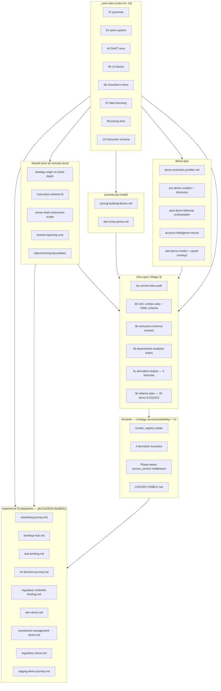

Three axes to read this diagram:

- **Top–down:** rules (what is true) → docs (how we say it) → spec (what to build) → runtime (what runs).
- **Left–right:** experience playbooks are leaf nodes consumed by humans; shared-core / commercial / demo-ops are
  concept docs referenced by playbooks; infra-spec feeds the runtime.
- **Cycle-free:** no layer above reads from a layer below. Changes flow downstream only.

---

## Slide 3 — The 4-catalogue parity model

Today: Strategy Catalogue canonical (Phase 10 shipped). Data / ML / Execution Algo catalogues fragmented. Post-refactor
(Stage 3E 2.3 + 2.4 + 2.5): all four follow the same master-matrix → detail → admin pattern.

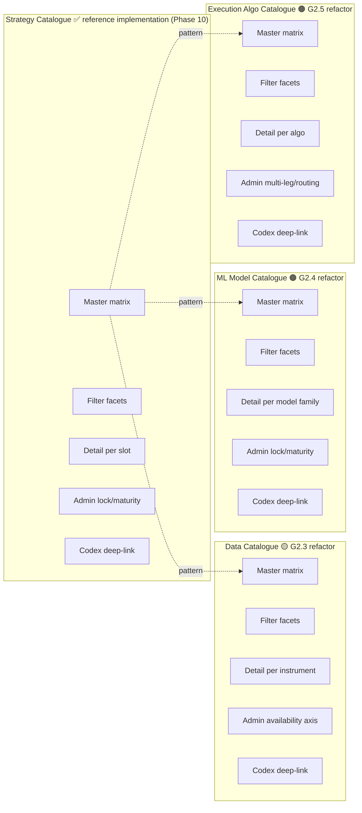

Same visual language across all four: status chips, lock-state chip, maturity chip, category chip, venue chip. Same
admin surface pattern. Same audit event list. Same GitHub deep-link to the codex SSOT.

---

## Slide 4 — DART 2-axis commercial model

Rule 04 resolves every DART engagement into one of three practical cells.

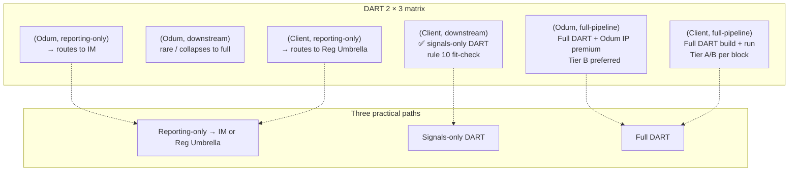

The matrix does real work: `(Odum, reporting-only)` re-routes out of DART automatically, preventing pricing leakage.
`(Odum, downstream)` is flagged as rare and escalated. `(Client, downstream)` picks up rule 10's instruction-schema
fit-check automatically.

---

## Slide 5 — Building-block dimensions (13 blocks)

Rule 05. Eleven standalone blocks plus two Tier-B-only premiums. Every engagement composes from this list; adding a
block is a deliberate act, not an organic drift.

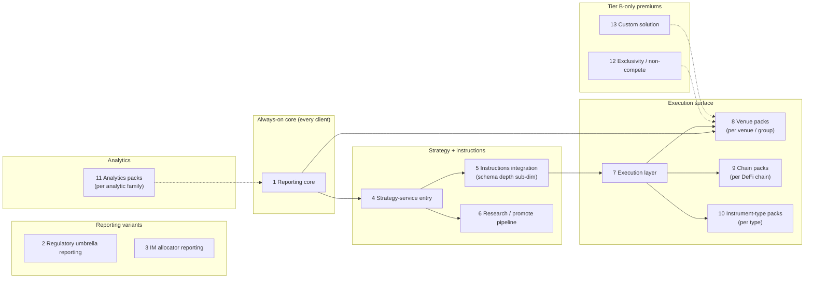

Sub-scoping lives inside blocks (venue pack × Binance + venue pack × Uniswap_v3 are two instances of block 8, not two
blocks). The demo restriction profiles and the entitlement registry both compose from this 13-element identifier list —
"one list, four derivations" (slide 6).

---

## Slide 6 — The 1-registry-4-derivations engine

Stage 3C core. All four consumer artefacts read the same registry. No drift.

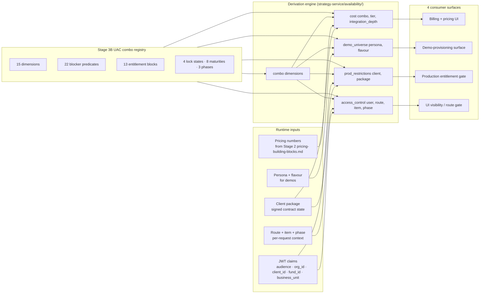

Every function is `registry × input_context → result`. Pure. Cachable. Idempotent. `access_control(...)` is phase-aware
— a `LIVE_ALLOCATED` slot is visible in `research` phase if and only if the user's entitlement set includes block 6
(research/promote pipeline), same component tree regardless (rule 03).

---

## Slide 7 — Cost composition worked example

A hybrid (Client, downstream) quote. Tier A marginal + Tier B core + rule-10 `richer_execution_constraints` depth.

```mermaid
graph TD
    subgraph Quote["Hybrid DeFi signals-only quote"]
        direction TB
        T1[Block 1 reporting core · Tier B · fixed monthly]
        T2[Block 4 strategy-service entry · Tier B · fixed monthly]
        T3["Block 5 instructions integration
        · Tier B · fixed monthly
        · depth=richer 1.4 × base"]
        T4["Block 7 execution layer
        · Tier B · fixed monthly
        · depth=richer 1.4 × base"]
        T5[Block 8 venue pack uniswap_v3 · Tier B]
        T6[Block 8 venue pack aave_v3 · Tier A usage-variable]
        T7[Block 8 venue pack hyperliquid_dex · Tier A usage-variable]
        T8[Block 9 chain pack ethereum · Tier B]
        T9[Block 9 chain pack arbitrum · Tier A]
        T10[Block 10 instrument pack perp · Tier B]
        T11[Block 10 instrument pack spot · Tier B]
        T12[Block 11 analytics pack exec-quality · Tier A]
    end

    subgraph Totals["Totals"]
        U1[Upfront  Tier B blocks only]
        U2[Monthly fixed  Tier B sum]
        U3[Monthly variable baseline  Tier A usage]
    end

    T1 & T2 & T3 & T4 & T5 & T8 & T10 & T11 --> U1
    T1 & T2 & T3 & T4 & T5 & T8 & T10 & T11 --> U2
    T6 & T7 & T9 & T12 --> U3
```

Rule 08's "per-block mixability" shows up clean: core blocks on Tier B for institutional-grade predictability; marginal
venues on Tier A so the client isn't committed upfront. Internal cost column lives in a separate derivation path, gated
by `pricing.read_internal` capability; it never appears on the client-facing quote.

Numbers populate in Stage 2 `commercial-model/pricing-building-blocks.md` once Odum finance ships them. Formulas
unchanged; the quote rebuilds automatically.

---

## Slide 8 — Demo restriction profile per persona

Stage 3C `demo_universe(persona, flavour)`. Four personas, four visibility slices.

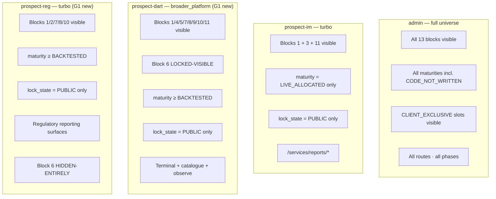

Rule 06's LOCKED-VISIBLE vs HIDDEN-ENTIRELY plays out precisely: DART prospect sees research/promote locked (obvious
next step, upgrade path visible); Reg Umbrella prospect does not see research at all (not a plausible next step for
them).

---

## Slide 9 — Same-system partitioning (rule 03)

One underlying system. Three commercial paths. Research / paper / live all bind to it.

```mermaid
graph TD
    subgraph System["One operating system"]
        direction LR
        Sys[strategy-service · execution-service · reports-service · data-services]
    end

    subgraph Paths["Three commercial audiences"]
        PD[DART clients]
        PI[IM allocators]
        PR[Reg Umbrella firms]
    end

    subgraph Phases["Three lifecycle phases  (orthogonal to commercial path)"]
        PhR[research · historical binding]
        PhP[paper · live data + simulated fills]
        PhL[live · live fills]
    end

    subgraph Surfaces["One set of UI surfaces"]
        SR[/services/strategy-catalogue]
        ST[/services/trading/terminal]
        SRep[/services/reports]
    end

    System --> PD & PI & PR
    System --> PhR & PhP & PhL
    System --> SR & ST & SRep
    PD -.entitlement-sliced.-> SR & ST & SRep
    PI -.entitlement-sliced.-> SRep
    PR -.entitlement-sliced.-> SRep & SR
    PhR -.data-binding.-> SR & ST & SRep
    PhP -.data-binding.-> SR & ST & SRep
    PhL -.data-binding.-> SR & ST & SRep
```

What this means for Stage 3E:

- **No forked UI.** No `/research/backtests/*` parallel to `/services/trading/terminal`. Same component tree; `phase`
  prop rebinds the data source (G1 item 1.1).
- **No forked catalogue.** Strategy Catalogue renders the same row for DART / IM / Reg Umbrella viewers; their filters
  differ.
- **No forked reporting.** `/services/reports/overview` is one route; what IM allocator vs DART subscriber vs Reg
  Umbrella client sees is filtered by entitlement.

---

## Slide 10 — Before / after page-triage counts

Page triage shipped 177 routes across unified-trading-system-ui (158) + user-management-ui (19). Post-Stage-3E, the
distribution changes.

```mermaid
---
config:
  xyChart:
    width: 900
    height: 500
---
xychart-beta
    title "Routes before / after Stage 3E"
    x-axis [Promote, Refactor, MergeInto, Defer, Archive, New]
    y-axis "Route count" 0 --> 140
    bar "Before (2026-04-19)" [120, 12, 25, 14, 5, 0]
    bar "After Stage 3E G1+G2" [132, 0, 0, 0, 5, 38]
```

Net: ~38 new canonical routes added (3 catalogue refactors × ~12 routes, plus LOCKED-VISIBLE admin routes, plus
`/services/data-catalogue/*`, `/services/ml-model-catalogue/*`, `/services/execution-algo-catalogue/*`, plus the G1.10
questionnaire surface at `/questionnaire` and its admin-playback twin); 12 old routes refactored into the new catalogues
(disappear from "refactor" bucket); 25 merge-into moves completed.

G3 `visibility-slicing` e2e expansion asserts all 132 canonical routes + LOCKED-VISIBLE padlock states across the
**expanded 15-20 persona matrix** (G1.4) × 3 flavours. Pre-2026-04-20 the matrix was 7 personas × 3 flavours; G1.4
widens the persona axis to cover the full questionnaire-dimension combinatoric.

---

## Slide 11 — Screenshot: pb1 homepage (anonymous)

Current state as of 2026-04-20. Anonymous landing page for the marketing journey.

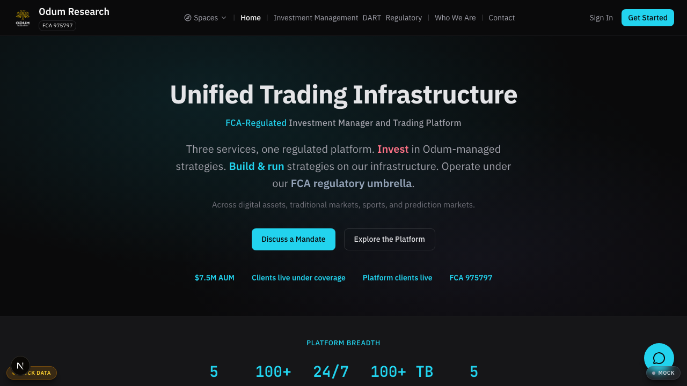

Post-Stage-3E note: the homepage surface itself is not a G1/G2 refactor item; current implementation is canonical. The
screenshot captures the status quo that Stage 3E preserves. Stage 3E items 1.4 (new personas) + 1.3 (LOCKED-VISIBLE)
affect authenticated surfaces, not this anonymous landing.

---

## Slide 12 — Screenshot: pb2 briefings hub (post-light-auth)

Prospect-IM persona, briefings surface.

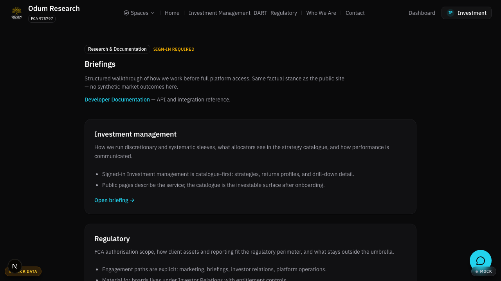

Corresponds to `experience/briefings-hub.md`. Post-Stage-3E G3.3 (briefings CMS migration), the content in this view
lives in a headless CMS; the route + layout stays stable.

---

## Slide 13 — Screenshot: pb3 per-persona dashboards

Three personas, three scopes. Same route (`/dashboard`), three very different views.

**Admin (Odum internal) — full universe:**

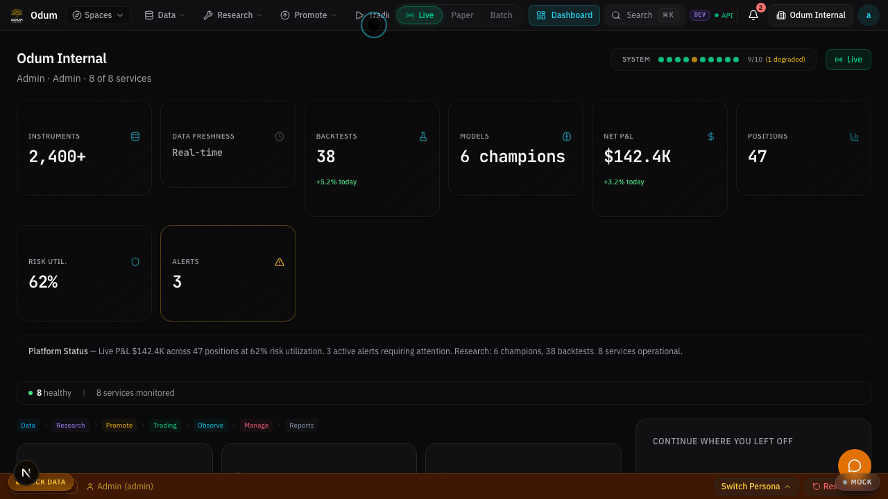

**Client-full (Alpha Capital) — full DART subscription:**

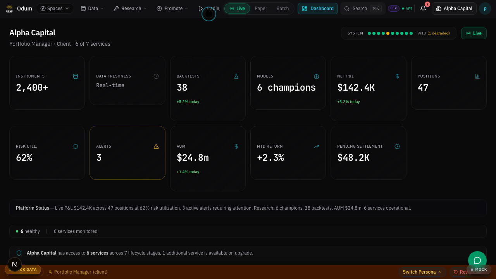

**Prospect-IM (demo) — IM-scoped reporting surface:**


Rule 03 + rule 06 made mechanical: same underlying system, same route, three entitlement-sliced views. No forked pages.
Once Stage 3E G1 ships LOCKED-VISIBLE, prospect-im will show the DART surfaces with a padlock chip rather than omitting
them; today they're hidden via the cascade.

---

## Slide 14 — Screenshot: strategy catalogue + reports overview

Two of the four catalogue surfaces in their current canonical form.

**Admin view of Strategy Catalogue master matrix:**


**Prospect-IM reports overview:**

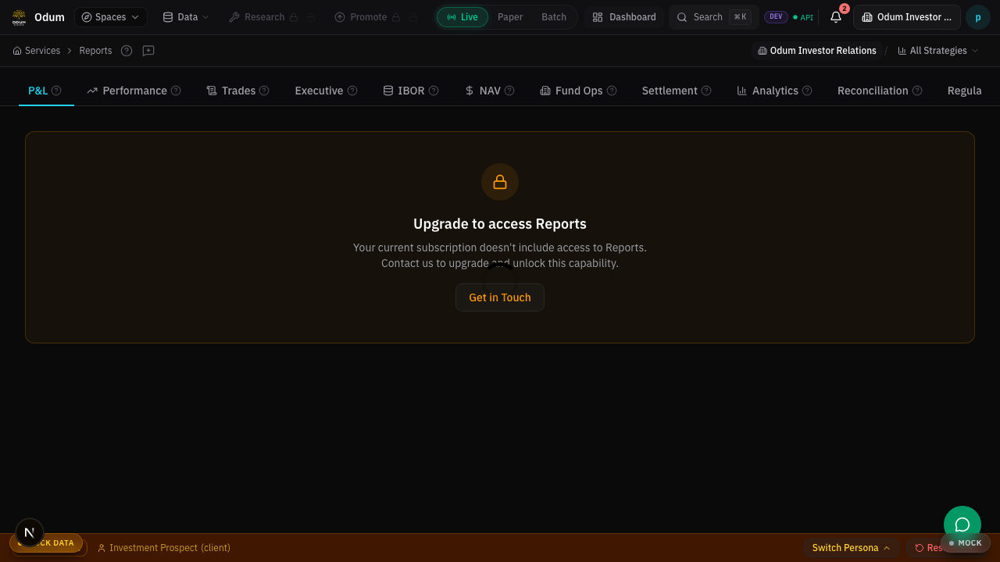

Strategy Catalogue is the reference pattern Stage 3E 2.3 / 2.4 / 2.5 replicate across Data / ML / Execution Algo.
Reports overview already embodies rule 03 sub-claim (a) "partitioned views not separate products" — allocators and DART
subscribers share this route; entitlement slicing differentiates what each sees.

---

## Slide 15 — The 3 internal one-liners + expansions

Rule 09. Internal use verbatim; external docs expand using the three-sentence pattern (positioning / mechanism / proof).

**DART** (internal one-liner):

> An accelerator for strategy, research, execution, and control — the same system Odum uses internally.

**DART** (external expansion):

> DART is the set of services Odum uses to build, research, promote, execute, and monitor its own systematic strategies,
> packaged for client use. Clients who operate their own strategies can plug their signals into Odum's execution and
> reporting stack, or they can use the full research and promotion pipeline. The underlying components are the same as
> Odum's internal operation — one system, partitioned views.

**IM** (internal one-liner):

> Allocate capital to Odum-managed strategies; reporting is built in because it is the same reporting system Odum uses
> itself.

**IM** (external expansion):

> Investment Management allocates client capital to Odum-run systematic strategies operating under Odum's FCA
> permissions. Reporting — positions, exposures, P&L, reconciliation — comes from the same surface Odum uses to run its
> own operation, with allocator-side views filtered by entitlement. The minimum engagement is twelve months; the
> onboarding path sets up the fund structure (Pooled or SMA), capital allocation, and reporting at the same time.

**Reg Umbrella** (internal one-liner):

> Operate your regulated activity under Odum's FCA permissions; onboarding, compliance, MLRO, supervision, and reporting
> included.

**Reg Umbrella** (external expansion):

> Firms running regulated activity that want operational coverage without seeking direct FCA authorisation can operate
> under Odum's permissions. Onboarding handles regulatory scope, compliance setup, MLRO coverage, and supervisory
> reporting. Reporting surfaces use the same component tree as IM and DART reporting, filtered to the firm's
> regulated-activity view.

Rule 02 voice throughout: present tense, specific over evocative, no adverbs, no forward-tense marketing hedges.

---

## Slide 16 — Stage 3E unlock dependencies per playbook

Every experience playbook depends on a subset of Stage 3E refactor items. Shipping the G1 **fourteen** unlocks
operational truth for every pb1 / pb2 / pb3 playbook.

| Playbook                                                                            | Depends on Stage 3E items                                                                                                                                                 |
| ----------------------------------------------------------------------------------- | ------------------------------------------------------------------------------------------------------------------------------------------------------------------------- |
| pb1 [`marketing-journey.md`](../experience/marketing-journey.md)                    | 1.9 (codex scope tagging), 1.12 (public-site IA polish), 3.4 (DART marketing rebrand)                                                                                     |
| pb2 [`briefings-hub.md`](../experience/briefings-hub.md)                            | 1.9, 1.12 (briefings polish), 3.3 (briefings CMS — G3)                                                                                                                    |
| pb2a `regulatory-umbrella-briefing.md`                                              | 1.9, 1.11 (service-family scope rules), 2.8 (fund + business_unit registry)                                                                                               |
| pb2b [`dart-briefing.md`](../experience/dart-briefing.md)                           | 1.2 (instruction-schema validation), 1.9, 1.11, 3.2 (pricing numbers)                                                                                                     |
| pb2c [`im-decision-journey.md`](../experience/im-decision-journey.md)               | 1.9, 1.11, 2.8 (fund registry), 2.10 (allocator split)                                                                                                                    |
| pb3a [`regulatory-demo.md`](../experience/regulatory-demo.md)                       | 1.4 (prospect-reg persona + expanded matrix), 1.7 (restriction-profile engine), 1.10 (questionnaire), 1.13 (tempt-logic), 2.6 (staging Firebase), 2.7 (demo provisioning) |
| pb3b [`investment-management-demo.md`](../experience/investment-management-demo.md) | 1.1 (phase-unification), 1.4, 1.7, 1.10, 1.11, 1.13, 2.6, 2.7, 2.10                                                                                                       |
| pb3c [`dart-demo.md`](../experience/dart-demo.md)                                   | 1.1, 1.2, 1.3 (LOCKED-VISIBLE), 1.4, 1.5 (broken-href cleanup), 1.7, 1.10, 1.11, 1.13, 2.2 (per-client API keys), 2.6, 2.7                                                |
| pb3d [`staging-demo-journey.md`](../experience/staging-demo-journey.md)             | 1.4, 1.10, 2.6, 2.7                                                                                                                                                       |

**Recommended next step.** Spawn the fourteen G1 follow-up plans simultaneously (each with its own agent prompt per
Stage 3E §1 "Proposed follow-up plan" field plus the 2026-04-20 amendment items 1.10 / 1.11 / 1.12 / 1.13 / 1.14); run
in parallel where dependencies allow (see Stage 3E §5 dependency graph; the waves are now A/B/C/D/E/F). Target: all G1
items shipped within 4–6 weeks, making every pb1–pb3 playbook operationally true.

Wave grouping (2026-04-20, supersedes the original A/B/C split):

| Wave | Items                                                                                                          | Can start                                            |
| ---- | -------------------------------------------------------------------------------------------------------------- | ---------------------------------------------------- |
| A    | 1.1 phase-unification · 1.3 LOCKED-VISIBLE · 1.5 broken-hrefs · 1.9 codex scope · 1.12 public-site · 1.14 deck | Immediately — no intra-G1 deps                       |
| B    | 1.8 UAC ArchetypeCapabilityV2                                                                                  | After Wave A merges                                  |
| C    | 1.2 instruction-schema · 1.6 derivation-engine                                                                 | After Wave B (both consume the UAC capability)       |
| D    | 1.7 restriction-profile engine · 1.11 service-family scope rules                                               | After Wave C (both layer on the derivation engine)   |
| E    | 1.10 questionnaire-to-configuration flow                                                                       | After Wave D (feeds G1.7)                            |
| F    | 1.4 persona-matrix expansion · 1.13 demo upsell tempt-logic · 1.14 HTML stretch                                | After Wave E (consume questionnaire axes + personas) |

---

## Slide 17 — G1.10 Questionnaire-to-configuration flow

Plan:
[`refactor_g1_10_questionnaire_to_configuration_flow_2026_04_20.plan.md`](../../../plans/archive/refactor_g1_10_questionnaire_to_configuration_flow_2026_04_20.plan.md)

The prospect questionnaire is the **ingestion edge** of the derivation engine. Unauthenticated prospects fill out a
multi-axis form at `/questionnaire`; sales operators replay the answers in `user-management-ui` before a demo. The
response object feeds G1.7's `resolve_profile(..., questionnaire=QuestionnaireResponse)` arg so the downstream UI is
pre-configured to what's relevant.

```mermaid
flowchart LR
    subgraph Public["Prospect surface (public)"]
        Q1[/questionnaire landing]
        Q2["QuestionnaireForm component
        multi-step, validated"]
        Q3[Anonymous submit — lead record]
    end

    subgraph Axes["Questionnaire axes (= persona-matrix axes, G1.4)"]
        A1[category — CeFi / DeFi / TradFi / Sports / Prediction]
        A2[instrument_types — spot / perp / options / etc.]
        A3[venue scope — single / group / all-in-family]
        A4[strategy-style preferences]
        A5[service-family picker — IM / DART / Reg / combo]
        A6[fund structure — SMA / Pooled — IM+Reg only]
    end

    subgraph Admin["user-management-ui playback"]
        P1[/questionnaires/ index]
        P2[Per-response playback view]
        P3[Demo-prep checklist binding]
    end

    subgraph Engine["Derivation engine consumer (G1.7)"]
        R1["resolve_profile(user, route, item, phase,
        questionnaire=response)"]
        R2["apply_tempt_logic(response, env) —
        demo widens vague axes (G1.13)"]
        R3[RestrictionProfile overlay]
    end

    Q1 --> Q2 --> Q3
    Q2 --> A1 & A2 & A3 & A4 & A5 & A6
    Q3 --> P1 --> P2 --> P3
    Q3 --> R1
    R1 --> R2 --> R3
```

Dev-staging parity is load-bearing: **identical UI behaviour** in both environments; only the submission sink differs.
Dev writes to `localStorage` for mock-auth persona seeding; staging POSTs to `user-management-api` which provisions a
real Firebase staging user (five-space-IA ticket #12). The questionnaire is the **shared front door** for the entire
G1.4 / G1.7 / G1.13 / five-space-IA pipeline.

---

## Slide 18 — G1.11 Service-family scope rules

Plan:
[`refactor_g1_11_service_family_scope_rules_2026_04_20.plan.md`](../../../plans/archive/refactor_g1_11_service_family_scope_rules_2026_04_20.plan.md)

Today the rules about "who can see observe / reporting / research / promote surfaces" are scattered across route gating,
demo-ops docs, and implicit audience assumptions. G1.11 lifts them into an explicit rule file
(`_ssot-rules/11-service-family-scope-rules.md` + `.yaml`) and enforces them inside `access_control()` as a pre-check
before the generic entitlement gate.

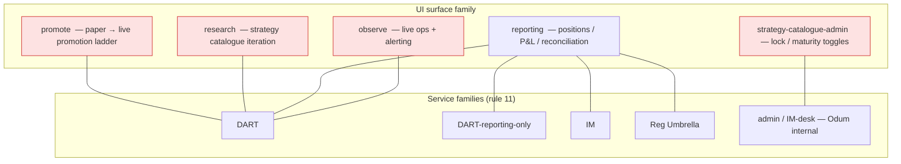

Hard constraints enforced by `check_service_family_scope(user, route)`:

- `observe ∈ {DART}` — IM + Reg don't own observability; Odum or the client manages it outside Odum's infra.
- `reporting ∈ {IM, DART-reporting-only, Reg Umbrella, DART}` — the four families with a reporting surface entitlement.
- `research, promote ∈ {full-DART}` — IM runs predetermined strategies; Reg Umbrella is a compliance overlay.
- `strategy-catalogue-admin ∈ {admin, IM-desk}` — locking demo visibility is Odum-internal.
- `SMA vs Pooled` applies to **IM + Reg only** (DART clients bring their own capital infra).

Violations surface as an explicit `ACCESS_DENIED: service-family-scope-violation` error in the route gate — not a silent
hide. This is the rule 06 "show-don't-show" discipline codified: a surface is either entitled, LOCKED-VISIBLE, or
hard-gated by family; never implicit.

---

## Slide 19 — G1.12 Public-site IA polish (before / after)

Plan:
[`refactor_g1_12_public_site_ia_and_briefings_polish_2026_04_20.plan.md`](../../../plans/archive/refactor_g1_12_public_site_ia_and_briefings_polish_2026_04_20.plan.md)

Pure UI refactor. No routes added/removed, no auth changes, no backend. Consolidates the public-site navigation under a
single `<SiteHeader>` component across 9 pages and enforces cut-through-noise formatting on `/briefings/*`.

```mermaid
graph TB
    subgraph Before["Before 2026-04-20 — mixed"]
        B1[/  — <SiteHeader>]
        B2[/investment-management  — <SpacesNavSections>]
        B3[/platform  — <SiteHeader> + ad-hoc dropdown]
        B4[/regulatory  — <SpacesNavSections>]
        B5[/firm  — <SiteHeader>]
        B6[/briefings/*  — exhaustive lists, no TL;DR]
        B7[/contact · /demo · /signup · /login  — drift]
    end

    subgraph After["After G1.12 — consolidated"]
        A1[All 9 public pages use one <SiteHeader>]
        A2[Consistent dropdown + CTA + breadcrumb]
        A3[/briefings/* starts with 1-sentence TL;DR + 1 CTA above the fold]
        A4[Voice follows rule 02 — present tense, no adverbs]
        A5[DART label from nav-copy.ts — already live 2026-04-19]
    end

    Before -.refactor.-> After
```

Sibling Wave A with G1.1 / G1.3 / G1.5 / G1.9 / G1.14 — all parallelisable because they touch different surface areas.
The public site does **not** itself need LOCKED-VISIBLE (public is public), but the tile components reused elsewhere
(`/platform` service tiles) do — those are G1.3's domain.

---

## Slide 20 — G1.13 Demo upsell-overlay tempt-logic

Plan:
[`refactor_g1_13_demo_upsell_overlay_tempt_logic_2026_04_20.plan.md`](../../../plans/archive/refactor_g1_13_demo_upsell_overlay_tempt_logic_2026_04_20.plan.md)

When a prospect's questionnaire response is **vague** on a given axis (e.g. "all" venues, no strategy style), the demo
restriction profile **widens by one step** on that axis — surfacing adjacent capability as LOCKED-VISIBLE chips. When
the prospect picks tightly (e.g. "Uniswap v3 only, pairs stat-arb, SMA"), profiles **tighten** back to the explicit
picks. Demo only; prod never widens.

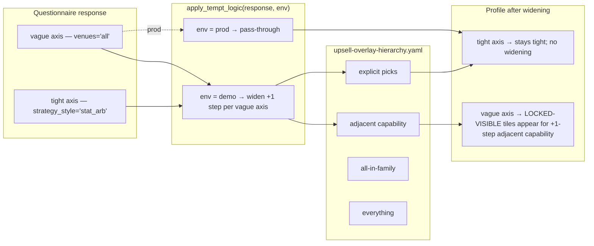

The tempt-logic is **never** a silent enrichment in prod. The widening only fires in demo environments, driven by a
boolean env flag. Config lives at `codex/14-customer-journeys/demo-ops/upsell-overlay-hierarchy.yaml` as a declarative
per-axis hierarchy. Engine code: `strategy-service/strategy_service/availability/tempt_logic.py`, chained into G1.7's
`resolve_profile` between `QuestionnaireResponse` ingestion and `RestrictionProfile` emission.

Narrative: this is the **operational surface of rule 06**. Show-don't-show becomes mechanical when the questionnaire
axis is vague: we show adjacent capability with a padlock, inviting the prospect to tighten. When the axis is tight, we
trust them and show only what they asked for.

---

## Slide 21 — G1.4 Persona combinatorial expansion (11 → 15-20)

Plan:
[`refactor_g1_4_persona_combinatorial_expansion_2026_04_20.plan.md`](../../../plans/archive/refactor_g1_4_persona_combinatorial_expansion_2026_04_20.plan.md)

Today `unified-trading-system-ui/lib/auth/personas.ts` defines 11 personas. G1.4 expands to **15-20**, each
parameterised across the G1.10 questionnaire dimensions, with deterministic `resolve_profile` output via G1.7 + G1.11.

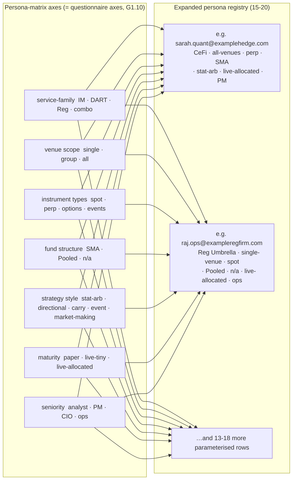

Every persona row includes: realistic email, entitlement set, `questionnaire: QuestionnaireResponse`, `service_family`,
`lock_state`. The same 15-20 personas exist in dev (localStorage-seeded via `tests/e2e/playbooks/seed-persona.ts`) and
staging (provisioned as real Firebase users by user-management-ui, five-space-IA ticket #12). **Dev-staging parity
applies to this list**: any persona added must land in both environments in the same PR.

Screenshot regeneration for the new personas is owned by G1.4 (Wave F); the refreshed screenshots feed this deck's HTML
stretch (Phase 14D).

---

## Slide 22 — MCP Playwright test discipline

Plan:
[`refactor_g1_14_presentation_deck_refresh_2026_04_20.plan.md`](../../../plans/archive/refactor_g1_14_presentation_deck_refresh_2026_04_20.plan.md)
(this plan) — plus pattern propagated across every sibling `refactor_g1_*_2026_04_20.plan.md`.

Every G1 refactor plan ships **both** an MCP Playwright loop for dev and a durable spec for CI.

```mermaid
flowchart LR
    subgraph Dev["Dev loop — MCP Playwright"]
        D1[Agent session drives
        mcp__playwright__browser_navigate]
        D2[browser_snapshot / click / type
        iterative refinement]
        D3[No commit — disposable]
    end

    subgraph CI["CI — durable spec"]
        C1["tests/e2e/playbooks/refactor/refactor-g1-N-*.spec.ts"]
        C2[Seed persona via tests/e2e/playbooks/seed-persona.ts]
        C3[Assert behavioural invariants + visibility-slicing]
        C4[Include orphan-reachability check]
    end

    subgraph Gate["Quality-gates integration"]
        G1[Wired into scripts/quality-gates.sh]
        G2[Runs on every PR]
        G3[Blocks merge on fail]
    end

    Dev -.committed spec mirrors what dev validated.-> CI
    CI --> Gate
```

Rules:

- **MCP Playwright** is never the durable artefact. Agent-driven browser control is disposable; whatever it validates
  must be mirrored in a committed spec.
- **Durable specs** sit under `unified-trading-system-ui/tests/e2e/playbooks/refactor/` and are named after the G1 plan.
- **Persona seeding** goes through `tests/e2e/playbooks/seed-persona.ts` — never inline localStorage poking in specs.
- **Orphan-reachability** assertions verify every cross-referenced plan file exists under `plans/active/` — the deck
  spec enforces this for its own 14 plan cross-links.
- Specs are wired into `scripts/quality-gates.sh` so the Pass 1 gate blocks merges on spec failure.

---

## Slide 23 — Dev / staging parity

Plan: cross-cutting rule applied by G1.4 / G1.7 / G1.10 / G1.13 (and reinforced by
[`refactor_g1_14_presentation_deck_refresh_2026_04_20.plan.md`](../../../plans/archive/refactor_g1_14_presentation_deck_refresh_2026_04_20.plan.md)).

The rule: **dev and staging must behave identically outside the auth source**. Anything that differs becomes an
operational liability when sales operators rehearse in dev and then run the demo from staging.

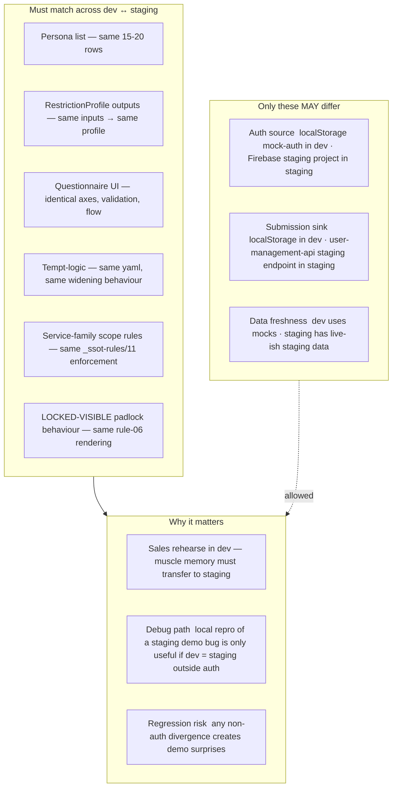

Enforcement mechanics:

- **One persona list** (`lib/auth/personas.ts`) consumed by both environments.
- **One questionnaire component tree** — same React components render both the dev localStorage flow and the staging
  Firebase-write flow; the sink is the only seam.
- **One rule 11 YAML** (`_ssot-rules/11-service-family-scope-rules.yaml`) enforced by `check_service_family_scope` —
  identical in both envs.
- **One tempt-logic YAML** (`demo-ops/upsell-overlay-hierarchy.yaml`) — identical widening in both envs.
- **Playwright test suite** asserts parity where plausible — the durable specs under `tests/e2e/playbooks/refactor/` run
  in dev by default and are portable to a staging run via a single env flag.

The prod environment is orthogonal to this parity: prod **disables** tempt-logic entirely (`env = prod` pass-through),
uses real Firebase prod personas, and submits to production sinks. Dev ↔ staging parity does **not** extend to prod.

---

## Cross-references

### Infra spec + rules

- [`../infra-spec/stage-3a-current-infra-audit.md`](../infra-spec/stage-3a-current-infra-audit.md)
- [`../infra-spec/stage-3b-uac-combo-rules.md`](../infra-spec/stage-3b-uac-combo-rules.md)
- [`../infra-spec/stage-3c-derivation-engine.md`](../infra-spec/stage-3c-derivation-engine.md)
- [`../infra-spec/stage-3e-refactor-plan.md`](../infra-spec/stage-3e-refactor-plan.md)
- [`../_ssot-rules/`](../_ssot-rules/) — 10 canonical rules + rule 11 (service-family scope, G1.11)
- [`../experience/`](../experience/) — 9 experience playbooks
- [`../demo-ops/upsell-overlays.md`](../demo-ops/upsell-overlays.md) — G1.13 tempt-logic spec
- [`../cross-cutting/bloomberg-style-aesthetic.md`](../cross-cutting/bloomberg-style-aesthetic.md) — visual language
- [`../roadmap/next-waves.md`](../roadmap/next-waves.md) — superseded; content preserved

### G1 plan cross-references (per slide)

| Slide(s)           | G1 item                                   | Plan file                                                                                                                                                                                                     |
| ------------------ | ----------------------------------------- | ------------------------------------------------------------------------------------------------------------------------------------------------------------------------------------------------------------- |
| 9 (phase-binding)  | G1.1 Phase unification                    | [`refactor_g1_1_phase_unification_2026_04_20.plan.md`](../../../plans/archive/refactor_g1_1_phase_unification_2026_04_20.plan.md)                                                                             |
| 6 (access_control) | G1.2 Instruction-schema validation        | [`refactor_g1_2_instruction_schema_validation_service_2026_04_20.plan.md`](../../../plans/archive/refactor_g1_2_instruction_schema_validation_service_2026_04_20.plan.md)                                     |
| 8 (LOCKED-VISIBLE) | G1.3 LOCKED-VISIBLE UI service-tile mode  | [`refactor_g1_3_locked_visible_ui_service_tile_mode_2026_04_20.plan.md`](../../../plans/archive/refactor_g1_3_locked_visible_ui_service_tile_mode_2026_04_20.plan.md)                                         |
| 8, 13, 21          | G1.4 Persona combinatorial expansion      | [`refactor_g1_4_persona_combinatorial_expansion_2026_04_20.plan.md`](../../../plans/archive/refactor_g1_4_persona_combinatorial_expansion_2026_04_20.plan.md)                                                 |
| 10                 | G1.5 ML Catalogue broken-hrefs cleanup    | [`refactor_g1_5_ml_catalogue_broken_hrefs_cleanup_2026_04_20.plan.md`](../../../plans/archive/refactor_g1_5_ml_catalogue_broken_hrefs_cleanup_2026_04_20.plan.md)                                             |
| 6                  | G1.6 Derivation engine → strategy-service | [`refactor_g1_6_derivation_engine_ship_to_strategy_service_availability_2026_04_20.plan.md`](../../../plans/archive/refactor_g1_6_derivation_engine_ship_to_strategy_service_availability_2026_04_20.plan.md) |
| 8                  | G1.7 Restriction-profile engine           | [`refactor_g1_7_restriction_profile_engine_2026_04_20.plan.md`](../../../plans/archive/refactor_g1_7_restriction_profile_engine_2026_04_20.plan.md)                                                           |
| 3, 5               | G1.8 UAC ArchetypeCapabilityV2 (gap #1)   | [`refactor_g1_8_uac_archetype_capability_v2_2026_04_20.plan.md`](../../../plans/archive/refactor_g1_8_uac_archetype_capability_v2_2026_04_20.plan.md)                                                         |
| 16                 | G1.9 Codex scope registry                 | [`refactor_g1_9_codex_scope_registry_2026_04_20.plan.md`](../../../plans/archive/refactor_g1_9_codex_scope_registry_2026_04_20.plan.md)                                                                       |
| 17                 | G1.10 Questionnaire-to-configuration flow | [`refactor_g1_10_questionnaire_to_configuration_flow_2026_04_20.plan.md`](../../../plans/archive/refactor_g1_10_questionnaire_to_configuration_flow_2026_04_20.plan.md)                                       |
| 18                 | G1.11 Service-family scope rules          | [`refactor_g1_11_service_family_scope_rules_2026_04_20.plan.md`](../../../plans/archive/refactor_g1_11_service_family_scope_rules_2026_04_20.plan.md)                                                         |
| 19                 | G1.12 Public-site IA + briefings polish   | [`refactor_g1_12_public_site_ia_and_briefings_polish_2026_04_20.plan.md`](../../../plans/archive/refactor_g1_12_public_site_ia_and_briefings_polish_2026_04_20.plan.md)                                       |
| 20                 | G1.13 Demo upsell-overlay tempt-logic     | [`refactor_g1_13_demo_upsell_overlay_tempt_logic_2026_04_20.plan.md`](../../../plans/archive/refactor_g1_13_demo_upsell_overlay_tempt_logic_2026_04_20.plan.md)                                               |
| 22, 23             | G1.14 Presentation deck refresh (this)    | [`refactor_g1_14_presentation_deck_refresh_2026_04_20.plan.md`](../../../plans/archive/refactor_g1_14_presentation_deck_refresh_2026_04_20.plan.md)                                                           |
