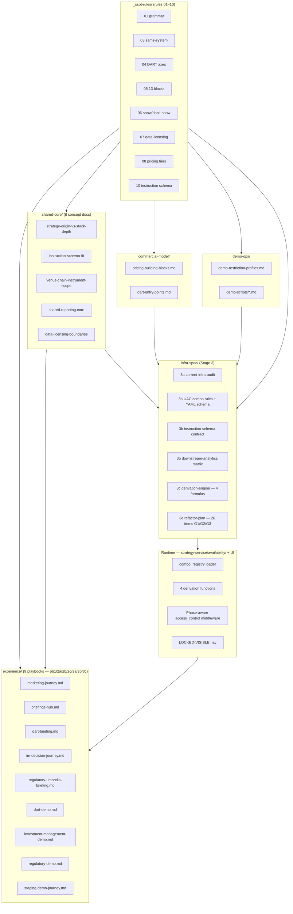
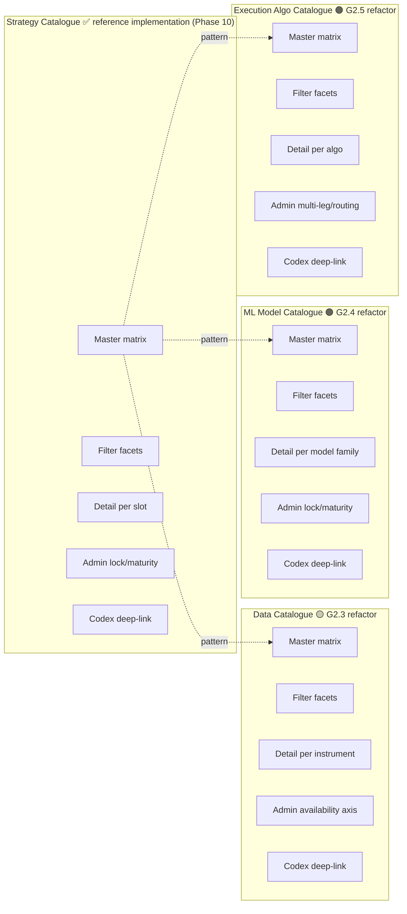
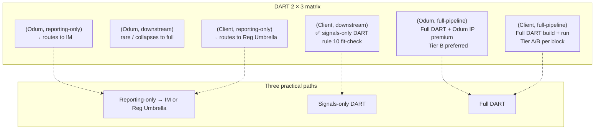
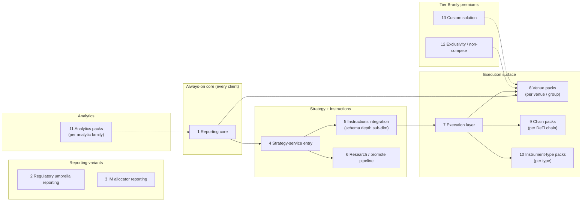
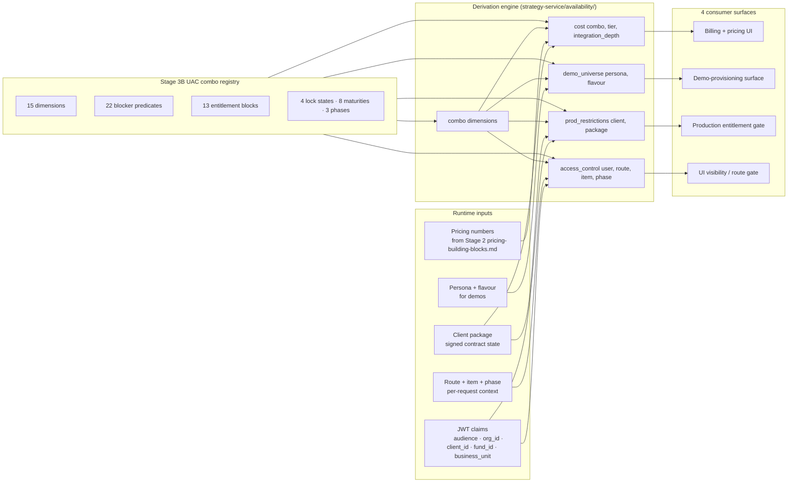
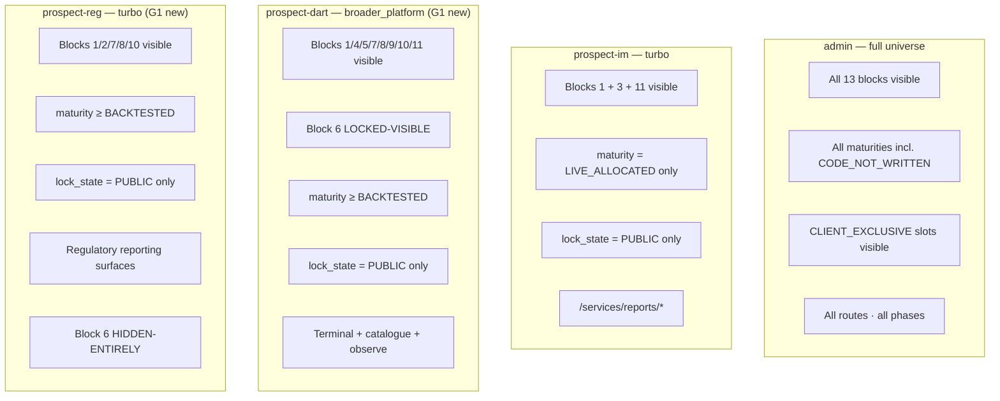
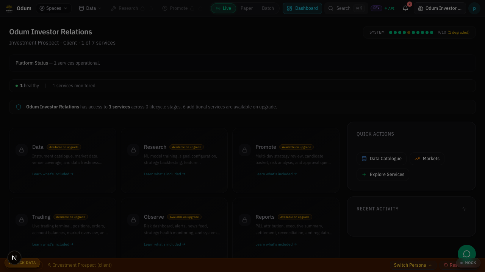
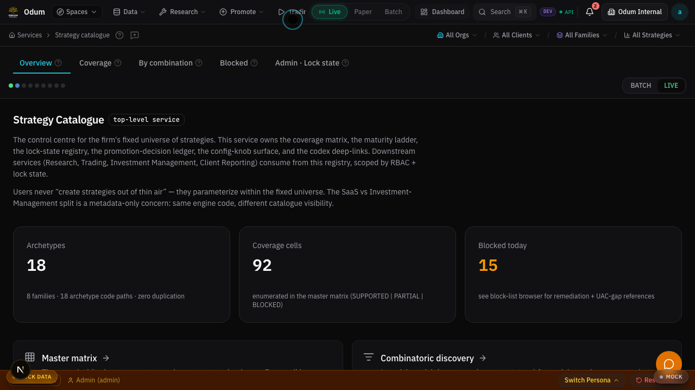

# Target-experience presentation — post-refactor view

> 16-slide deck generated from Stage 3 infra spec. Mermaid diagrams render inline; Playwright screenshots under
> [`screenshots/`](screenshots/) are referenced by relative path.
>
> **Parent plan:**
> [`plans/active/playbook_ssot_stage_3_infra_spec_2026_04_19.plan.md`](../../../plans/active/playbook_ssot_stage_3_infra_spec_2026_04_19.plan.md)
> § Phase 3D.
>
> **Inputs:**
>
> - [`../infra-spec/stage-3a-current-infra-audit.md`](../infra-spec/stage-3a-current-infra-audit.md)
> - [`../infra-spec/stage-3b-uac-combo-rules.md`](../infra-spec/stage-3b-uac-combo-rules.md)
> - [`../infra-spec/stage-3c-derivation-engine.md`](../infra-spec/stage-3c-derivation-engine.md)
> - [`../infra-spec/stage-3e-refactor-plan.md`](../infra-spec/stage-3e-refactor-plan.md)
> - [`../_ssot-rules/`](../_ssot-rules/) — 10 canonical rules
> - [`../experience/`](../experience/) — 9 experience playbooks
> - [`../page-triage/`](../page-triage/) — 177-route classification
>
> **Audience:** Odum leadership + engineering + sales ops. Intended as an internal alignment doc, not client-facing.
> External audiences see the rule 09 one-liner expansions (see slide 15), not this deck.
>
> **Viewing:** slides are `##`-delimited; render in any markdown viewer. Mermaid diagrams render in GitHub + most modern
> markdown renderers. Screenshots are `` references.
>
> **Pending cross-references (as of 2026-04-20):** slide 2 layered-architecture diagram names three files not yet
> shipped by Stage 2: `experience/staging-demo-journey.md` (Phase 2.1 pb3d — TO-BE-SHIPPED),
> `demo-ops/demo-restriction-profiles.md` + `demo-ops/demo-scripts/*.md` (Phase 2.4 partial — 5 of 9 demo-ops docs
> shipped). Slide 16 references `staging-demo-journey.md` similarly. Diagrams kept as-is because the structure is
> correct; the underlying files land in Phase 2.4 completion.

---

## Slide 1 — Cover + user directive

**The Odum operating system, post-refactor.**

Sixteen slides. Four thousand words of rules. Twenty-two blocker predicates. One registry. Four derivations.

User directive (2026-04-19):

> _"Compare vs audit of the current infra ... finalise with clear refactor doc and target experience doc with visuals
> via a presentation so i can see what the end product post-refactor looks like for the building blocks. On the low
> level details we need UAC registry info for all possible combinations and blockers so that we can formulaically derive
> the costing and the demo universe and the restrictions / access controls across the user journey possibilities."_

This deck answers: what the end product looks like after Stage 3E G1 + G2 ships.

---

## Slide 2 — The layered architecture

From SSOT rules at the top to UI surfaces at the bottom. Each layer is a set of files; each arrow is a derivation.



Three axes to read this diagram:

- **Top–down:** rules (what is true) → docs (how we say it) → spec (what to build) → runtime (what runs).
- **Left–right:** experience playbooks are leaf nodes consumed by humans; shared-core / commercial / demo-ops are
  concept docs referenced by playbooks; infra-spec feeds the runtime.
- **Cycle-free:** no layer above reads from a layer below. Changes flow downstream only.

---

## Slide 3 — The 4-catalogue parity model

Today: Strategy Catalogue canonical (Phase 10 shipped). Data / ML / Execution Algo catalogues fragmented. Post-refactor
(Stage 3E 2.3 + 2.4 + 2.5): all four follow the same master-matrix → detail → admin pattern.



Same visual language across all four: status chips, lock-state chip, maturity chip, category chip, venue chip. Same
admin surface pattern. Same audit event list. Same GitHub deep-link to the codex SSOT.

---

## Slide 4 — DART 2-axis commercial model

Rule 04 resolves every DART engagement into one of three practical cells.



The matrix does real work: `(Odum, reporting-only)` re-routes out of DART automatically, preventing pricing leakage.
`(Odum, downstream)` is flagged as rare and escalated. `(Client, downstream)` picks up rule 10's instruction-schema
fit-check automatically.

---

## Slide 5 — Building-block dimensions (13 blocks)

Rule 05. Eleven standalone blocks plus two Tier-B-only premiums. Every engagement composes from this list; adding a
block is a deliberate act, not an organic drift.



Sub-scoping lives inside blocks (venue pack × Binance + venue pack × Uniswap_v3 are two instances of block 8, not two
blocks). The demo restriction profiles and the entitlement registry both compose from this 13-element identifier list —
"one list, four derivations" (slide 6).

---

## Slide 6 — The 1-registry-4-derivations engine

Stage 3C core. All four consumer artefacts read the same registry. No drift.



Every function is `registry × input_context → result`. Pure. Cachable. Idempotent. `access_control(...)` is phase-aware
— a `LIVE_ALLOCATED` slot is visible in `research` phase if and only if the user's entitlement set includes block 6
(research/promote pipeline), same component tree regardless (rule 03).

---

## Slide 7 — Cost composition worked example

A hybrid (Client, downstream) quote. Tier A marginal + Tier B core + rule-10 `richer_execution_constraints` depth.

```mermaid
graph TD
    subgraph Quote["Hybrid DeFi signals-only quote"]
        direction TB
        T1[Block 1 reporting core · Tier B · fixed monthly]
        T2[Block 4 strategy-service entry · Tier B · fixed monthly]
        T3["Block 5 instructions integration
        · Tier B · fixed monthly
        · depth=richer 1.4 × base"]
        T4["Block 7 execution layer
        · Tier B · fixed monthly
        · depth=richer 1.4 × base"]
        T5[Block 8 venue pack uniswap_v3 · Tier B]
        T6[Block 8 venue pack aave_v3 · Tier A usage-variable]
        T7[Block 8 venue pack hyperliquid_dex · Tier A usage-variable]
        T8[Block 9 chain pack ethereum · Tier B]
        T9[Block 9 chain pack arbitrum · Tier A]
        T10[Block 10 instrument pack perp · Tier B]
        T11[Block 10 instrument pack spot · Tier B]
        T12[Block 11 analytics pack exec-quality · Tier A]
    end

    subgraph Totals["Totals"]
        U1[Upfront  Tier B blocks only]
        U2[Monthly fixed  Tier B sum]
        U3[Monthly variable baseline  Tier A usage]
    end

    T1 & T2 & T3 & T4 & T5 & T8 & T10 & T11 --> U1
    T1 & T2 & T3 & T4 & T5 & T8 & T10 & T11 --> U2
    T6 & T7 & T9 & T12 --> U3
```



Rule 08's "per-block mixability" shows up clean: core blocks on Tier B for institutional-grade predictability; marginal
venues on Tier A so the client isn't committed upfront. Internal cost column lives in a separate derivation path, gated
by `pricing.read_internal` capability; it never appears on the client-facing quote.

Numbers populate in Stage 2 `commercial-model/pricing-building-blocks.md` once Odum finance ships them. Formulas
unchanged; the quote rebuilds automatically.

---

## Slide 8 — Demo restriction profile per persona

Stage 3C `demo_universe(persona, flavour)`. Four personas, four visibility slices.



Rule 06's LOCKED-VISIBLE vs HIDDEN-ENTIRELY plays out precisely: DART prospect sees research/promote locked (obvious
next step, upgrade path visible); Reg Umbrella prospect does not see research at all (not a plausible next step for
them).

---

## Slide 9 — Same-system partitioning (rule 03)

One underlying system. Three commercial paths. Research / paper / live all bind to it.

```mermaid
graph TD
    subgraph System["One operating system"]
        direction LR
        Sys[strategy-service · execution-service · reports-service · data-services]
    end

    subgraph Paths["Three commercial audiences"]
        PD[DART clients]
        PI[IM allocators]
        PR[Reg Umbrella firms]
    end

    subgraph Phases["Three lifecycle phases  (orthogonal to commercial path)"]
        PhR[research · historical binding]
        PhP[paper · live data + simulated fills]
        PhL[live · live fills]
    end

    subgraph Surfaces["One set of UI surfaces"]
        SR[/services/strategy-catalogue]
        ST[/services/trading/terminal]
        SRep[/services/reports]
    end

    System --> PD & PI & PR
    System --> PhR & PhP & PhL
    System --> SR & ST & SRep
    PD -.entitlement-sliced.-> SR & ST & SRep
    PI -.entitlement-sliced.-> SRep
    PR -.entitlement-sliced.-> SRep & SR
    PhR -.data-binding.-> SR & ST & SRep
    PhP -.data-binding.-> SR & ST & SRep
    PhL -.data-binding.-> SR & ST & SRep
```

What this means for Stage 3E:

- **No forked UI.** No `/research/backtests/*` parallel to `/services/trading/terminal`. Same component tree; `phase`
  prop rebinds the data source (G1 item 1.1).
- **No forked catalogue.** Strategy Catalogue renders the same row for DART / IM / Reg Umbrella viewers; their filters
  differ.
- **No forked reporting.** `/services/reports/overview` is one route; what IM allocator vs DART subscriber vs Reg
  Umbrella client sees is filtered by entitlement.

---

## Slide 10 — Before / after page-triage counts

Page triage shipped 177 routes across unified-trading-system-ui (158) + user-management-ui (19). Post-Stage-3E, the
distribution changes.

```mermaid
---
config:
  xyChart:
    width: 900
    height: 500
---
xychart-beta
    title "Routes before / after Stage 3E"
    x-axis [Promote, Refactor, MergeInto, Defer, Archive, New]
    y-axis "Route count" 0 --> 140
    bar "Before (2026-04-19)" [120, 12, 25, 14, 5, 0]
    bar "After Stage 3E G1+G2" [132, 0, 0, 0, 5, 38]
```



Net: ~38 new canonical routes added (3 catalogue refactors × ~12 routes, plus LOCKED-VISIBLE admin routes, plus
`/services/data-catalogue/*`, `/services/ml-model-catalogue/*`, `/services/execution-algo-catalogue/*`); 12 old routes
refactored into the new catalogues (disappear from "refactor" bucket); 25 merge-into moves completed.

G3 `visibility-slicing` e2e expansion asserts all 132 canonical routes + LOCKED-VISIBLE padlock states across 7 personas
× 3 flavours.

---

## Slide 11 — Screenshot: pb1 homepage (anonymous)

Current state as of 2026-04-20. Anonymous landing page for the marketing journey.


Post-Stage-3E note: the homepage surface itself is not a G1/G2 refactor item; current implementation is canonical. The
screenshot captures the status quo that Stage 3E preserves. Stage 3E items 1.4 (new personas) + 1.3 (LOCKED-VISIBLE)
affect authenticated surfaces, not this anonymous landing.

---

## Slide 12 — Screenshot: pb2 briefings hub (post-light-auth)

Prospect-IM persona, briefings surface.


Corresponds to `experience/briefings-hub.md`. Post-Stage-3E G3.3 (briefings CMS migration), the content in this view
lives in a headless CMS; the route + layout stays stable.

---

## Slide 13 — Screenshot: pb3 per-persona dashboards

Three personas, three scopes. Same route (`/dashboard`), three very different views.

**Admin (Odum internal) — full universe:**


**Client-full (Alpha Capital) — full DART subscription:**


**Prospect-IM (demo) — IM-scoped reporting surface:**



Rule 03 + rule 06 made mechanical: same underlying system, same route, three entitlement-sliced views. No forked pages.
Once Stage 3E G1 ships LOCKED-VISIBLE, prospect-im will show the DART surfaces with a padlock chip rather than omitting
them; today they're hidden via the cascade.

---

## Slide 14 — Screenshot: strategy catalogue + reports overview

Two of the four catalogue surfaces in their current canonical form.

**Admin view of Strategy Catalogue master matrix:**



**Prospect-IM reports overview:**


Strategy Catalogue is the reference pattern Stage 3E 2.3 / 2.4 / 2.5 replicate across Data / ML / Execution Algo.
Reports overview already embodies rule 03 sub-claim (a) "partitioned views not separate products" — allocators and DART
subscribers share this route; entitlement slicing differentiates what each sees.

---

## Slide 15 — The 3 internal one-liners + expansions

Rule 09. Internal use verbatim; external docs expand using the three-sentence pattern (positioning / mechanism / proof).

**DART** (internal one-liner):

> An accelerator for strategy, research, execution, and control — the same system Odum uses internally.

**DART** (external expansion):

> DART is the set of services Odum uses to build, research, promote, execute, and monitor its own systematic strategies,
> packaged for client use. Clients who operate their own strategies can plug their signals into Odum's execution and
> reporting stack, or they can use the full research and promotion pipeline. The underlying components are the same as
> Odum's internal operation — one system, partitioned views.

**IM** (internal one-liner):

> Allocate capital to Odum-managed strategies; reporting is built in because it is the same reporting system Odum uses
> itself.

**IM** (external expansion):

> Investment Management allocates client capital to Odum-run systematic strategies operating under Odum's FCA
> permissions. Reporting — positions, exposures, P&L, reconciliation — comes from the same surface Odum uses to run its
> own operation, with allocator-side views filtered by entitlement. The minimum engagement is twelve months; the
> onboarding path sets up the fund structure (Pooled or SMA), capital allocation, and reporting at the same time.

**Reg Umbrella** (internal one-liner):

> Operate your regulated activity under Odum's FCA permissions; onboarding, compliance, MLRO, supervision, and reporting
> included.

**Reg Umbrella** (external expansion):

> Firms running regulated activity that want operational coverage without seeking direct FCA authorisation can operate
> under Odum's permissions. Onboarding handles regulatory scope, compliance setup, MLRO coverage, and supervisory
> reporting. Reporting surfaces use the same component tree as IM and DART reporting, filtered to the firm's
> regulated-activity view.

Rule 02 voice throughout: present tense, specific over evocative, no adverbs, no forward-tense marketing hedges.

---

## Slide 16 — Next steps: which Stage 3E item unlocks which playbook

Every experience playbook depends on a subset of Stage 3E refactor items. Shipping the G1 nine unlocks operational truth
for every pb1 / pb2 / pb3 playbook.

| Playbook                                                                            | Depends on Stage 3E items                                                                                                        |
| ----------------------------------------------------------------------------------- | -------------------------------------------------------------------------------------------------------------------------------- |
| pb1 [`marketing-journey.md`](../experience/marketing-journey.md)                    | 1.9 (codex scope tagging), 3.4 (DART marketing rebrand)                                                                          |
| pb2 [`briefings-hub.md`](../experience/briefings-hub.md)                            | 1.9, 3.3 (briefings CMS — G3)                                                                                                    |
| pb2a `regulatory-umbrella-briefing.md`                                              | 1.9, 2.8 (fund + business_unit registry)                                                                                         |
| pb2b [`dart-briefing.md`](../experience/dart-briefing.md)                           | 1.2 (instruction-schema validation), 1.9, 3.2 (pricing numbers)                                                                  |
| pb2c [`im-decision-journey.md`](../experience/im-decision-journey.md)               | 1.9, 2.8 (fund registry), 2.10 (allocator split)                                                                                 |
| pb3a [`regulatory-demo.md`](../experience/regulatory-demo.md)                       | 1.4 (prospect-reg persona), 1.7 (restriction-profile engine), 2.6 (staging Firebase), 2.7 (demo provisioning automation)         |
| pb3b [`investment-management-demo.md`](../experience/investment-management-demo.md) | 1.1 (phase-unification), 1.7, 2.6, 2.7, 2.10                                                                                     |
| pb3c [`dart-demo.md`](../experience/dart-demo.md)                                   | 1.1, 1.2, 1.3 (LOCKED-VISIBLE), 1.4 (prospect-dart persona), 1.5 (broken-href cleanup), 1.7, 2.2 (per-client API keys), 2.6, 2.7 |
| pb3d [`staging-demo-journey.md`](../experience/staging-demo-journey.md)             | 2.6, 2.7                                                                                                                         |

**Recommended next step.** Spawn the nine G1 follow-up plans simultaneously (each with its own agent prompt per Stage 3E
§1 "Proposed follow-up plan" field); run in parallel where dependencies allow (see Stage 3E §5 dependency graph).
Target: all G1 items shipped within 4–6 weeks, making every pb1–pb3 playbook operationally true.

---

## Cross-references

- [`../infra-spec/stage-3a-current-infra-audit.md`](../infra-spec/stage-3a-current-infra-audit.md)
- [`../infra-spec/stage-3b-uac-combo-rules.md`](../infra-spec/stage-3b-uac-combo-rules.md)
- [`../infra-spec/stage-3c-derivation-engine.md`](../infra-spec/stage-3c-derivation-engine.md)
- [`../infra-spec/stage-3e-refactor-plan.md`](../infra-spec/stage-3e-refactor-plan.md)
- [`../_ssot-rules/`](../_ssot-rules/) — 10 canonical rules
- [`../experience/`](../experience/) — 9 experience playbooks
- [`../roadmap/next-waves.md`](../roadmap/next-waves.md) — superseded; content preserved
