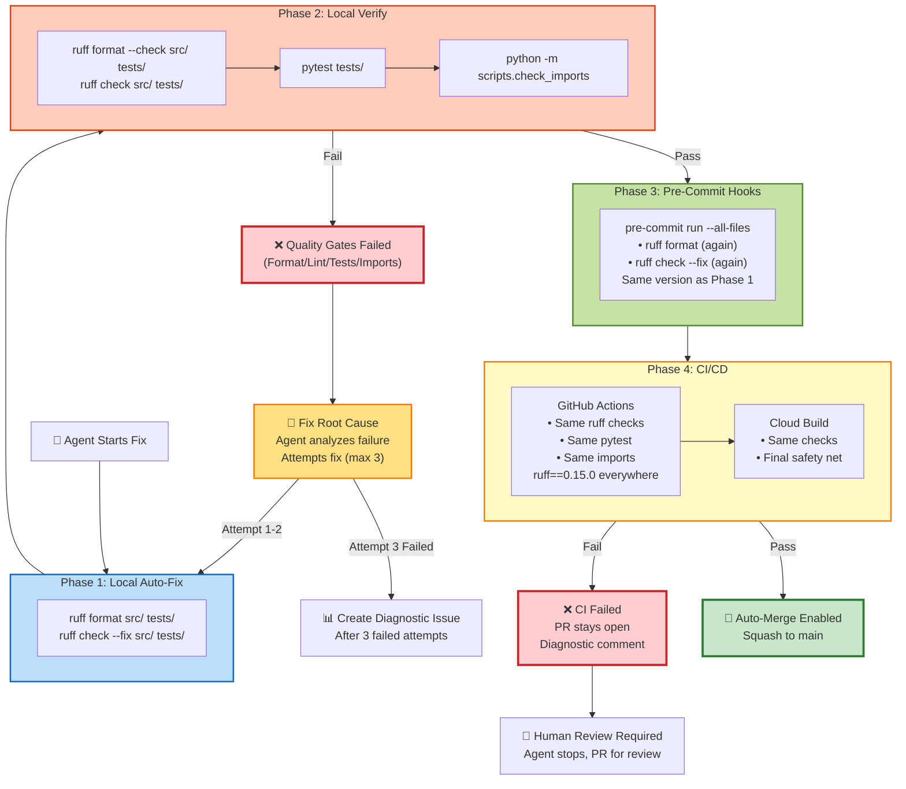
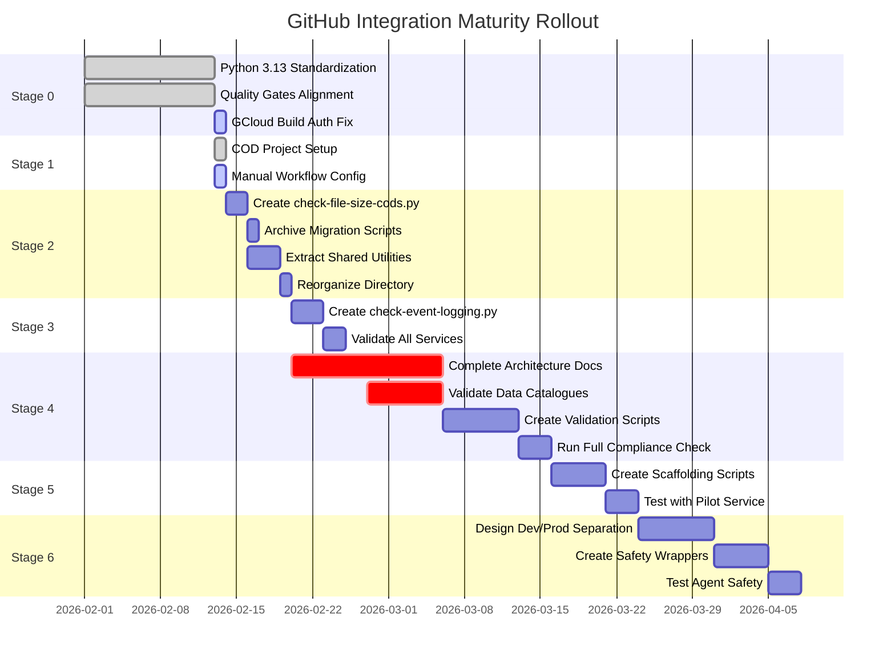

# GitHub Integration Workflow - Complete Mermaid Diagram

## Full 7-Stage Maturity Model with Agents

```mermaid
flowchart TB
    subgraph Stage0["🏗️ STAGE 0: BASELINE (Foundation)"]
        direction TB
        S0_Input["Dependencies, Quality Gates, Builds, Auth<br/>Python 3.13, Ruff 0.15.0, Tests Pass"]

        subgraph S0_Agents["Baseline Compliance Agents"]
            DiffChecker["run-diff-checker.py<br/>📋 Code Pattern Compliance<br/>Checks: imports, config, error handling"]
            ServiceCompliance["check-service-compliance.py<br/>📁 Structural Compliance<br/>Checks: files exist, directory structure"]
        end

        S0_Output["✅ Baseline Complete<br/>All services pass quality gates"]

        S0_Input --> DiffChecker
        S0_Input --> ServiceCompliance
        DiffChecker --> S0_Output
        ServiceCompliance --> S0_Output
    end

    subgraph Stage1["🏷️ STAGE 1: COD STANDARDS (Organization)"]
        direction TB
        S1_Input["650+ COD issues mixed with work items<br/>Main projects cluttered"]

        subgraph S1_Agents["COD Organization Agents"]
            SetupCOD["setup-cod-project.py<br/>🔧 One-Time Setup<br/>• Create 'cod' label (30 repos)<br/>• Find COD issues (org-wide search)<br/>• Label 651 CODs<br/>• Create COD project<br/>• Add CODs to project"]
            ManageCOD["manage-cods.sh<br/>🛠️ Daily Operations<br/>• List CODs<br/>• Count by repo<br/>• Search CODs<br/>• Bulk operations"]
        end

        S1_Output["✅ CODs Organized<br/>Main projects: 113 work items<br/>COD project: 648 CODs<br/>85% noise reduction"]

        S1_Input --> SetupCOD
        SetupCOD --> ManageCOD
        ManageCOD --> S1_Output
    end

    subgraph Stage2["📏 STAGE 2: COD LINE COUNT (Quality)"]
        direction TB
        S2_Input["Files >1500 lines violate SRP"]

        subgraph S2_Agents["File Size Enforcement Agents"]
            CheckSize["check-file-size-cods.py<br/>📊 File Size Monitor (TO CREATE)<br/>• Scan for files >1500 lines<br/>• Create COD-SIZE issues<br/>• Update existing issues<br/>• Close when <1500 lines<br/>• CI/CD integration"]
            SplitFile["split-large-file.py<br/>✂️ Split Helper (OPTIONAL)<br/>• Suggest split points<br/>• Generate split plan<br/>• Create sub-issues"]
        end

        S2_Output["✅ SRP Enforced<br/>All files <1500 lines<br/>Automated CI/CD monitoring"]

        S2_Input --> CheckSize
        CheckSize --> SplitFile
        SplitFile --> S2_Output
    end

    subgraph Stage3["👁️ STAGE 3: EVENT LOGGING (Observability)"]
        direction TB
        S3_Input["Services need 11-event lifecycle logging"]

        subgraph S3_Agents["Event Logging Validation Agents"]
            CheckEvents["check-event-logging.py<br/>📝 Event Coverage Check (TO CREATE)<br/>• Scan for log_event() calls<br/>• Verify 11 lifecycle events<br/>• Check test_event_logging.py exists<br/>• Validate 3-tier structure<br/>• Create issues for gaps"]
        end

        S3_Output["✅ Full Observability<br/>All services: 11 events<br/>3-tier logging<br/>test_event_logging.py present"]

        S3_Input --> CheckEvents
        CheckEvents --> S3_Output
    end

    subgraph Stage4["🎯 STAGE 4: MISSING FEATURES (Completeness)"]
        direction TB
        S4_Input["Services incomplete across 12 dimensions"]

        subgraph S4_Agents["Feature Completeness Validation Agents"]
            CheckComplete["check-feature-completeness.py<br/>🔍 Multi-Dimensional Validator (TO CREATE)<br/>12 Dimensions:<br/>1. Code completeness<br/>2. Test completeness (unit, e2e, integration)<br/>3. Data catalogue<br/>4. Sharding decisions<br/>5. GCS bucket decisions<br/>6. Schema hardening<br/>7. Live deployment infra<br/>8. Batch deployment infra<br/>9. Setup scripts<br/>10. Upstream/downstream validation<br/>11. Observability foundation<br/>12. Checklist compliance"]
            ValidateData["validate-service-data-flows.py<br/>🔗 Data Lineage Validator (TO CREATE)<br/>• Input availability<br/>• Output compatibility<br/>• Partition alignment<br/>• Schema evolution<br/>• Data freshness"]
            ValidateInfra["validate-service-infrastructure.py<br/>☁️ Infrastructure Validator (TO CREATE)<br/>• Dockerfiles<br/>• Cloud Build configs<br/>• Deployment scripts<br/>• Resource limits<br/>• IAM permissions"]
        end

        subgraph S4_Validation["Validation Against"]
            Checklists["15 Service Checklists<br/>904+ items from template"]
            AuditTemplates["13 Audit Templates<br/>Baseline + 7 pipelines + 3 UIs"]
            DataCatalogues["8 Data Catalogues<br/>+ 4 infrastructure configs"]
        end

        S4_Output["✅ Production-Ready Services<br/>100% checklist compliance<br/>All 12 dimensions validated"]

        S4_Input --> CheckComplete
        CheckComplete --> ValidateData
        ValidateData --> ValidateInfra
        CheckComplete -.-> Checklists
        CheckComplete -.-> AuditTemplates
        CheckComplete -.-> DataCatalogues
        ValidateInfra --> S4_Output
    end

    subgraph Stage5["🚀 STAGE 5: NEW SERVICES (Scaling)"]
        direction TB
        S5_Input["Need to create new services<br/>100% compliant from day 1"]

        subgraph S5_Agents["Service Scaffolding Agents"]
            Scaffold["scaffold-new-service.py<br/>🏗️ Service Generator (TO CREATE)<br/>• Directory structure<br/>• pyproject.toml, Dockerfile<br/>• config.py, paths.py, schemas.py<br/>• Quality gates, quickmerge<br/>• Tests + test_event_logging.py<br/>• .cursorrules from template"]
            ValidateNew["validate-new-service.py<br/>✅ Pre-Commit Validator (TO CREATE)<br/>• Full checklist validation<br/>• All required files exist<br/>• Architectural compliance<br/>• Test completeness<br/>• Block commit if fails"]
        end

        S5_Output["✅ New Services Compliant<br/>100% checklist from day 1<br/>No technical debt"]

        S5_Input --> Scaffold
        Scaffold --> ValidateNew
        ValidateNew --> S5_Output
    end

    subgraph Stage6["🔒 STAGE 6: HARDENING (Safety)"]
        direction TB
        S6_Input["Need safe automation<br/>No prod data risk"]

        subgraph S6_Agents["Environment Safety Agents"]
            VerifyIsolation["verify-env-isolation.py<br/>🛡️ Environment Validator (TO CREATE)<br/>• Dev/prod separation<br/>• Data isolation<br/>• IAM policies<br/>• Rate limits"]
            SafetyWrapper["agent-safety-wrapper.sh<br/>🚨 Safety Wrapper (TO CREATE)<br/>• Wrap Cursor Agent calls<br/>• Auto-rollback on failures<br/>• Audit logging<br/>• Resource limits"]
        end

        S6_Output["✅ Safe Automation<br/>Agents run freely<br/>No prod risk"]

        S6_Input --> VerifyIsolation
        VerifyIsolation --> SafetyWrapper
        SafetyWrapper --> S6_Output
    end

    subgraph AgentAutomation["🤖 CURSOR CLI AGENT AUTOMATION (Spans All Stages)"]
        direction TB

        subgraph AgentTools["Agent Fix Pipeline"]
            AutoFix["auto-fix-issue.sh<br/>🎯 Single Issue Fixer<br/>1. Fetch issue from GitHub<br/>2. Invoke Cursor Agent CLI<br/>3. Run 4-phase quality gates<br/>4. Create PR via quickmerge<br/>5. Monitor auto-merge"]
            BatchFix["batch-fix.sh<br/>⚡ Parallel Multi-Issue Fixer<br/>• 10-50 issues concurrently<br/>• 5 parallel agents<br/>• Isolated branches<br/>• Same quality enforcement"]
            CloseFixed["close-fixed-issue.sh<br/>✅ Manual Fix Cleanup<br/>• Close issue<br/>• Link commit<br/>• Update project<br/>• Add labels"]
        end

        subgraph QualityGates["4-Phase Quality Gate Pipeline"]
            Phase1["Phase 1: Local Auto-Fix<br/>ruff format, ruff check --fix"]
            Phase2["Phase 2: Local Verify<br/>--no-fix, tests, imports<br/>❌ EXIT on failure"]
            Phase3["Phase 3: Pre-Commit Hooks<br/>Same ruff checks again<br/>Auto-fix formatting"]
            Phase4["Phase 4: CI/CD<br/>GitHub Actions/Cloud Build<br/>🚫 Block auto-merge if fail"]

            Phase1 --> Phase2
            Phase2 -->|Pass| Phase3
            Phase2 -->|Fail| Fix["Fix Root Cause<br/>(3 attempts max)"]
            Fix --> Phase1
            Phase3 --> Phase4
            Phase4 -->|Pass| AutoMerge["🎉 Auto-Merge to Main"]
            Phase4 -->|Fail| HumanReview["👤 Human Review Required"]
        end

        AutoFix --> Phase1
        BatchFix --> Phase1
    end

    subgraph ProjectManagement["📊 PROJECT MANAGEMENT"]
        direction TB

        subgraph ProjectOps["Project Operations"]
            SyncLabels["sync-labels.py<br/>🏷️ Master Label Sync<br/>From label-schema.yaml"]
            CreateEpics["create-service-epics.py<br/>📑 Epic Hierarchy<br/>Epic→Task→Subtask"]
            SyncItems["sync-project-items.py<br/>🔄 Sync to Projects<br/>From artifact plans"]
            RelinkSubs["relink-sub-issues.py<br/>🔗 Recovery Utility<br/>Fix broken links"]
        end

        subgraph ProjectMaintenance["Project Maintenance"]
            DeleteRecreate["delete-and-recreate-project.sh<br/>🔄 Full Reset"]
            WipeRegen["wipe-and-regenerate-project.sh<br/>🧹 Clear Items"]
            WipeBG["wipe-project-background.sh<br/>⏳ Background Wipe"]
            ClearProject["clear-github-project.sh<br/>🗑️ Soft Reset"]
        end
    end

    %% Main Flow Connections
    S0_Output --> S1_Input
    S1_Output --> S2_Input
    S2_Output --> S3_Input
    S3_Output --> S4_Input
    S4_Output --> S5_Input
    S5_Output --> S6_Input

    %% Agent Automation connects to all stages
    AgentAutomation -.->|"Fixes issues from"| Stage0
    AgentAutomation -.->|"Fixes issues from"| Stage1
    AgentAutomation -.->|"Fixes issues from"| Stage2
    AgentAutomation -.->|"Fixes issues from"| Stage3
    AgentAutomation -.->|"Fixes issues from"| Stage4

    %% Project Management supports all stages
    ProjectManagement -.->|"Organizes issues for"| Stage1
    ProjectManagement -.->|"Organizes issues for"| Stage2
    ProjectManagement -.->|"Organizes issues for"| Stage3
    ProjectManagement -.->|"Organizes issues for"| Stage4

    %% Styling
    classDef stage0 fill:#e3f2fd,stroke:#1976d2,stroke-width:3px
    classDef stage1 fill:#f3e5f5,stroke:#7b1fa2,stroke-width:3px
    classDef stage2 fill:#fff3e0,stroke:#f57c00,stroke-width:3px
    classDef stage3 fill:#e8f5e9,stroke:#388e3c,stroke-width:3px
    classDef stage4 fill:#fce4ec,stroke:#c2185b,stroke-width:3px
    classDef stage5 fill:#e0f2f1,stroke:#00796b,stroke-width:3px
    classDef stage6 fill:#fff9c4,stroke:#f57f17,stroke-width:3px
    classDef agent fill:#bbdefb,stroke:#1565c0,stroke-width:2px
    classDef quality fill:#ffccbc,stroke:#d84315,stroke-width:2px
    classDef project fill:#c5e1a5,stroke:#558b2f,stroke-width:2px

    class Stage0 stage0
    class Stage1 stage1
    class Stage2 stage2
    class Stage3 stage3
    class Stage4 stage4
    class Stage5 stage5
    class Stage6 stage6
    class DiffChecker,ServiceCompliance,SetupCOD,ManageCOD,CheckSize,SplitFile,CheckEvents,CheckComplete,ValidateData,ValidateInfra,Scaffold,ValidateNew,VerifyIsolation,SafetyWrapper agent
    class AutoFix,BatchFix,CloseFixed,Phase1,Phase2,Phase3,Phase4 quality
    class SyncLabels,CreateEpics,SyncItems,RelinkSubs,DeleteRecreate,WipeRegen,WipeBG,ClearProject project
```

---

## Simplified Entry Point to Closure Workflow

```mermaid
flowchart LR
    subgraph Entry["1️⃣ ENTRY POINTS"]
        Manual["👤 Manual Entry<br/>• User bug report<br/>• Feature request<br/>• Q&A/Feature card"]
        Automated["🤖 Automated Detection<br/>• run-diff-checker.py<br/>• check-service-compliance.py<br/>• check-file-size-cods.py<br/>• check-event-logging.py<br/>• check-feature-completeness.py"]
    end

    subgraph Triage["2️⃣ TRIAGE & PRIORITIZATION"]
        P0["🔴 P0: Blocking Bugs<br/>Prod broken, immediate fix"]
        P1["🟠 P1: Critical Bugs<br/>User-facing issues"]
        P2["🟡 P2: Code Standards<br/>Import violations, config"]
        P3["🟢 P3: Functionality Gaps<br/>Missing features, tests"]
        COD["🟣 COD: Architectural Pivots<br/>Tracked separately"]
    end

    subgraph GitHub["3️⃣ GITHUB ISSUES"]
        Issues["📝 GitHub Issue<br/>✅ Clear description<br/>✅ Success criteria<br/>✅ Codex references<br/>✅ Time estimate<br/>✅ Test requirements<br/>✅ Linked to project"]
    end

    subgraph Implementation["4️⃣ IMPLEMENTATION"]
        AgentPick["🎯 Agent Picks Task<br/>Reads: Issue + Codex + Rules"]
        AgentCode["👨‍💻 Agent Implements<br/>• Write code<br/>• Write tests<br/>• Add logging<br/>• Update docs"]

        subgraph QG["4-Phase Quality Gates"]
            QG1["Phase 1: Auto-fix<br/>ruff format + check --fix"]
            QG2["Phase 2: Verify<br/>--no-fix, tests, imports"]
            QG3["Phase 3: Pre-commit<br/>Hooks run automatically"]
            QG4["Phase 4: CI/CD<br/>GitHub Actions/Cloud Build"]
        end

        PR["📬 PR Created<br/>• Commit: Fixes #XXX<br/>• Only changed files<br/>• Auto-merge enabled"]
    end

    subgraph Closure["5️⃣ AUTO-CLOSURE"]
        Merge["🔀 PR Merges<br/>Squash to main"]
        AutoClose["✅ Issue Auto-Closes<br/>Via 'Fixes #XXX'"]
        UpdateChecklist["📋 Checklist Updated<br/>status: pending → done"]
    end

    subgraph Loop["6️⃣ CONTINUOUS LOOP"]
        ReRun["🔁 Re-Run Compliance Checks<br/>Find next gaps"]
    end

    Manual --> P0 & P1
    Automated --> P2 & P3 & COD
    P0 & P1 & P2 & P3 --> Issues
    COD --> Issues
    Issues --> AgentPick
    AgentPick --> AgentCode
    AgentCode --> QG1
    QG1 --> QG2
    QG2 -->|Pass| QG3
    QG2 -->|Fail| AgentCode
    QG3 --> QG4
    QG4 -->|Pass| PR
    QG4 -->|Fail| AgentCode
    PR --> Merge
    Merge --> AutoClose
    AutoClose --> UpdateChecklist
    UpdateChecklist --> ReRun
    ReRun --> Automated

    style Entry fill:#e1f5ff,stroke:#333,stroke-width:2px
    style Manual fill:#ffcccc,stroke:#333,stroke-width:2px
    style Automated fill:#ccffcc,stroke:#333,stroke-width:2px
    style P0 fill:#ff0000,stroke:#333,stroke-width:3px,color:#fff
    style P1 fill:#ff6600,stroke:#333,stroke-width:2px
    style P2 fill:#ffcc00,stroke:#333,stroke-width:2px
    style P3 fill:#66cc66,stroke:#333,stroke-width:2px
    style COD fill:#9966ff,stroke:#333,stroke-width:2px
    style Issues fill:#fff4cc,stroke:#333,stroke-width:3px
    style QG fill:#ffeaa7,stroke:#333,stroke-width:3px
    style AutoClose fill:#d4edda,stroke:#333,stroke-width:2px
    style ReRun fill:#cfe2ff,stroke:#333,stroke-width:2px
```

---

## Quality Gate Enforcement Detail

---

## Agent Decision Matrix

| Stage          | Agent Script                         | Trigger          | Frequency       | Status        |
| -------------- | ------------------------------------ | ---------------- | --------------- | ------------- |
| **Stage 0**    | `run-diff-checker.py`                | Manual / Weekly  | Weekly          | ✅ Production |
| **Stage 0**    | `check-service-compliance.py`        | Manual / Weekly  | Weekly          | ✅ Production |
| **Stage 1**    | `setup-cod-project.py`               | Manual once      | One-time        | ✅ Production |
| **Stage 1**    | `manage-cods.sh`                     | Manual           | Daily/Weekly    | ✅ Production |
| **Stage 2**    | `check-file-size-cods.py`            | CI/CD on PR      | Per commit      | ❌ To Create  |
| **Stage 3**    | `check-event-logging.py`             | Manual / Weekly  | Weekly          | ❌ To Create  |
| **Stage 4**    | `check-feature-completeness.py`      | Manual / Monthly | Monthly         | ❌ To Create  |
| **Stage 4**    | `validate-service-data-flows.py`     | Manual / Monthly | Monthly         | ❌ To Create  |
| **Stage 4**    | `validate-service-infrastructure.py` | Manual / Monthly | Monthly         | ❌ To Create  |
| **Stage 5**    | `scaffold-new-service.py`            | Manual           | Per new service | ❌ To Create  |
| **Stage 5**    | `validate-new-service.py`            | Pre-commit       | Per commit      | ❌ To Create  |
| **Stage 6**    | `verify-env-isolation.py`            | Before agent run | Per agent run   | ❌ To Create  |
| **Stage 6**    | `agent-safety-wrapper.sh`            | Wrap agent calls | Per agent run   | ❌ To Create  |
| **All Stages** | `auto-fix-issue.sh`                  | Manual           | Per issue       | ✅ Production |
| **All Stages** | `batch-fix.sh`                       | Manual           | Bulk fixes      | ✅ Production |
| **All Stages** | `close-fixed-issue.sh`               | Manual           | Per fix         | ✅ Production |

---

## Progressive Rollout Timeline

