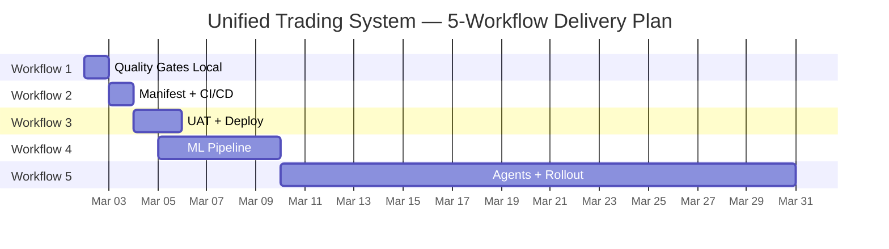
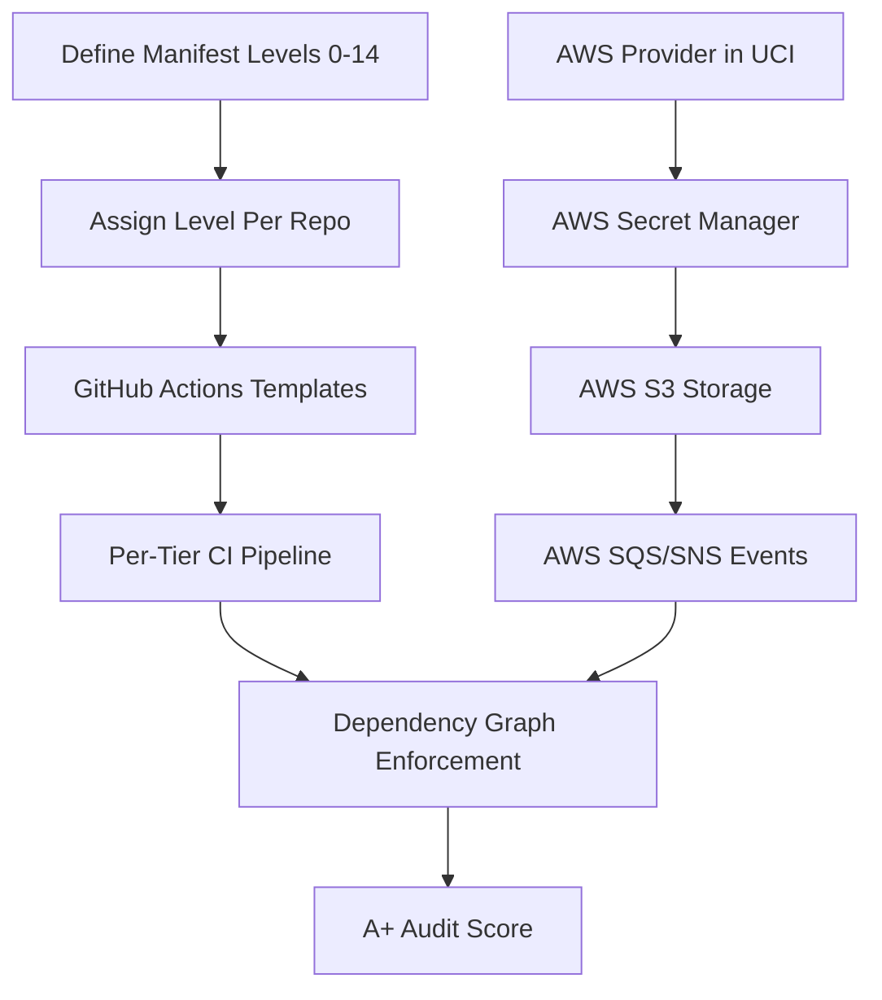
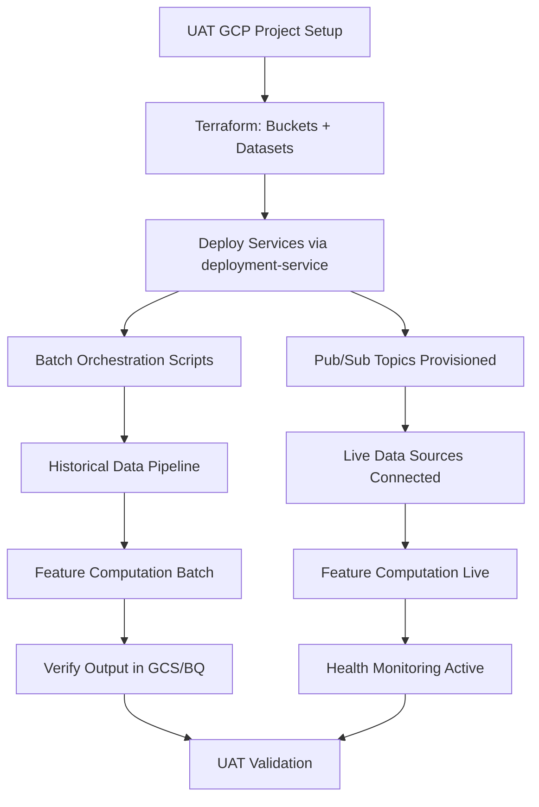
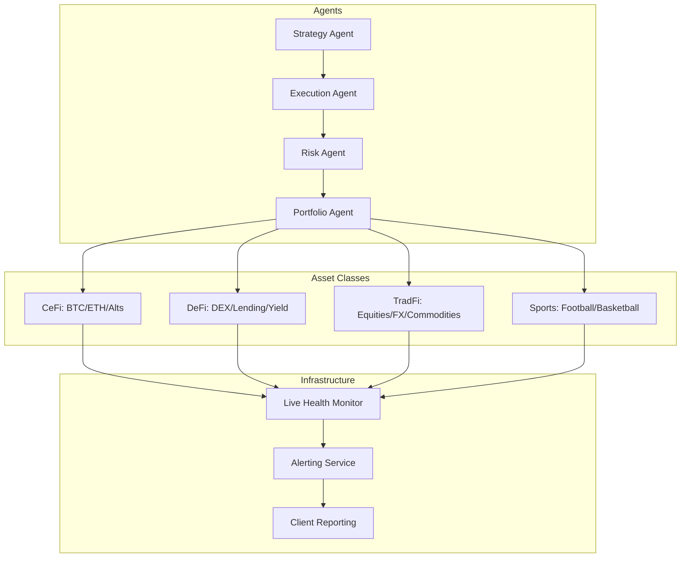

# Five-Workflow Delivery Plan

> Date: 2026-03-02
> Status: Workflow 1 IN PROGRESS (Day 1 of 30)
> Residual Items: See WORKFLOW_RESIDUAL_ITEMS.md

---

## Timeline Overview

---

## Workflow 1: Quality Gates Passing Locally (March 2)

**Goal:** Every repo passes `scripts/quality-gates.sh` locally. CI/CD pipelines scripted.

### Progress: ~90% Complete (March 3 update)

```mermaid
flowchart LR
    subgraph DONE["Completed (March 2-3)"]
        A1[UCS->UTS Rename Gaps Fixed]
        A2[UCI File Split 1010->376L]
        A3[Canonical quality-gates.sh Deployed]
        A4[Ruff Lint: 200+ errors fixed]
        A5[Test Fixes: 600+ tests across 10 repos]
        A6[Codex: 6 T4 repos fixed]
        A7[Dep fixes: 10+ repos]
        A8[T0 Library Tests: UFCL 54/54, UMI 23/23, UMLI 7/7]
        A9[deployment-service: 402/402 pass]
        A10[deployment-api: 115/115 pass]
        A11[deployment-ui: 29/29 pass]
        A12[Agent syntax damage cleaned: 7+ repos 70+ files]
        A13[UTS shim fixed: sys.modules aliasing]
    end

    subgraph REMAIN["Remaining (~98 test failures)"]
        B1[basedpyright errors: UTS 272, UMI 2442]
        B2[Test coverage: UTS 40%, UFCL 49%]
        B3[14 repos unscanned]
        B4[UFCL naming mismatch blocks 2 feature services]
        B5[DependencyChecker missing in 2 services]
        B6[execution-service: 57 fail - VWAP/sports/mocks]
    end

    DONE --> REMAIN
```

### Quality Gate Status by Tier

| Tier         | Total | All Pass | Lint Pass | Tests Pass                              | Codex Pass | Remaining                       |
| ------------ | ----- | -------- | --------- | --------------------------------------- | ---------- | ------------------------------- |
| T0 Libraries | 8     | 7        | 8         | 7 full, 1 partial (UDC)                 | 8          | 1 test fix (UDC)                |
| T1 UTS       | 1     | 0        | 1         | 1 (coverage fail)                       | 1          | Type + coverage                 |
| T4 Services  | 16    | 6        | 10+       | deployment-\*: 3/3 pass, 5 more running | 10+        | See TEST_FAILURE_ACTION_PLAN.md |
| T5 APIs      | 3     | 1        | 3         | varies                                  | 3          | Type errors                     |
| T6 UIs       | 4     | 2        | 4         | 2                                       | 4          | Non-Python projects             |

### March 3 Achievements

- **deployment-service**: 85 failures → 0 (402 pass, 27 skip)
- **deployment-api**: 3 failures → 0 (115 pass, 1 skip)
- **deployment-ui**: Created 3 test files, 29/29 pass
- **Agent damage cleanup**: Restored 70+ files across 7 repos from git
- **UTS backward-compat shim**: Rewrote with sys.modules aliasing
- **UMI syntax**: Fixed 7 remaining f-string damaged files

### Detailed Status: See WORKFLOW_RESIDUAL_ITEMS.md and TEST_FAILURE_ACTION_PLAN.md

---

## Workflow 2: Manifest + Full CI/CD + Cloud Agnostic (March 3)

**Goal:** Manifest levels 0-14, GitHub Actions for all repos, AWS provider support, A+ audit.

### Status: NOT STARTED

### Tasks

| Task                      | Description                                                                     | Effort | Dependency        |
| ------------------------- | ------------------------------------------------------------------------------- | ------ | ----------------- |
| Manifest levels 0-14      | Define what each level means (0=exists, 14=production-hardened)                 | 2h     | None              |
| GitHub Actions templates  | T0/T1/T2 library template, T4 service template, T5 API template, T6 UI template | 4h     | Manifest defined  |
| AWS provider stubs in UCI | Implement S3Client, SecretsManagerClient, SQSClient matching GCP interface      | 6h     | UCI tests passing |
| Dependency graph CI       | Enforce tier ordering (T0 cannot depend on T4, etc.)                            | 2h     | Templates done    |
| Naming finalized          | UTS -> UCL rename before encoding in CI                                         | 2h     | Decision made     |

### Pre-requisites from Workflow 1

- [x] Quality gates scripted for all repos
- [ ] All repo names finalized (see naming plan in WORKFLOW_RESIDUAL_ITEMS.md)
- [ ] 14 unscanned repos baselined

---

## Workflow 3: UAT + Deploy + Batch/Live Modes (March 4-5)

**Goal:** UAT environment running, batch mode processing historical data, live mode streaming.

### Status: NOT STARTED

### Tasks

| Task                                          | Effort | Dependency                   |
| --------------------------------------------- | ------ | ---------------------------- |
| UAT GCP project config                        | 1h     | GCP access                   |
| Terraform apply (buckets, datasets, Pub/Sub)  | 2h     | UAT config                   |
| deployment-service deploy all services        | 2h     | Codex pass (DONE)            |
| Batch: instruments -> features -> ML pipeline | 4h     | All feature services QG pass |
| Live: Pub/Sub -> features -> streaming        | 4h     | UEI events working           |
| Health monitoring + alerting                  | 2h     | Services deployed            |

---

## Workflow 4: ML Training -> Predictions -> Strategy -> P&L (March 5-10)

**Goal:** End-to-end ML pipeline: training -> inference -> strategy validation -> P&L attribution.

### Status: NOT STARTED

### Pipeline

```mermaid
flowchart LR
    subgraph Training
        T1[Feature Computation] --> T2[Feature Validation]
        T2 --> T3[Hyperparameter Tuning]
        T3 --> T4[Model Training]
        T4 --> T5[Model Registry]
    end

    subgraph Inference
        I1[Load Model] --> I2[Feature Subscription]
        I2 --> I3[Prediction Generation]
        I3 --> I4[Signal Publishing]
    end

    subgraph Strategy
        S1[Signal Consumption] --> S2[Strategy Validation]
        S2 --> S3[Order Generation]
        S3 --> S4[Execution]
    end

    subgraph PnL
        P1[Trade Capture] --> P2[Position Tracking]
        P2 --> P3[P&L Attribution]
        P3 --> P4[Risk Reporting]
    end

    T5 --> I1
    I4 --> S1
    S4 --> P1
```

| Task                      | Repo(s)                     | Effort | Dependency            |
| ------------------------- | --------------------------- | ------ | --------------------- |
| Feature pipeline E2E      | features-\* services, UFCL  | 4h     | Batch mode working    |
| ML training run           | ml-training-service         | 4h     | Features available    |
| Model registry store/load | UTS, ml-training-service    | 2h     | GCS access            |
| Inference pipeline        | ml-inference-service        | 4h     | Trained model         |
| Strategy validation       | strategy-validation-service | 4h     | Predictions available |
| P&L attribution           | pnl-attribution-service     | 4h     | Executed trades       |

### Pre-requisites from Earlier Workflows

- [ ] UFCL auto-diff test fixed (Workflow 1 R-01)
- [ ] UMLI error recovery test fixed (Workflow 1 R-04)
- [ ] All feature services deployed (Workflow 3)
- [ ] Batch data available (Workflow 3)

---

## Workflow 5: Autonomous Agents + Full Asset Class Rollout (March 10-31)

**Goal:** Autonomous trading across CeFi, DeFi, TradFi, and Sports.

### Status: NOT STARTED

### Architecture

| Phase                | Timeline    | Focus                                                             |
| -------------------- | ----------- | ----------------------------------------------------------------- |
| 5a: Agent Framework  | March 10-14 | Core agent orchestration, paper trading                           |
| 5b: CeFi Rollout     | March 14-17 | BTC/ETH live trading with risk limits                             |
| 5c: DeFi Integration | March 17-21 | DEX execution, yield farming                                      |
| 5d: Sports Live      | March 21-25 | Live odds, arb detection (see SPORTS_MIGRATION_GAP_FIX.md Part B) |
| 5e: Full Rollout     | March 25-31 | All asset classes, production monitoring, client reporting        |

### Pre-requisites

- [ ] All upstream workflows complete
- [ ] Sports live mode (SPORTS_MIGRATION_GAP_FIX.md Part B — 7 streams)
- [ ] Cross-instrument features (FCIS passing)
- [ ] Risk management framework
- [ ] Production deployment infrastructure (Terraform, Cloud Run, monitoring)

---

## Risk Matrix

| Risk                                           | Impact | Mitigation                                                               |
| ---------------------------------------------- | ------ | ------------------------------------------------------------------------ |
| basedpyright debt blocks CI/CD                 | Medium | Accept as known debt, add `--warn-only` to CI for type checks            |
| Test coverage below 70%                        | Medium | Exclude test utilities from coverage, write tests for high-value modules |
| UTS rename disrupts 37 repos                   | High   | Use backward compat shim pattern (proven with UCS->UTS)                  |
| Sports live mode complexity                    | High   | Paper trading first, gradual rollout per bookmaker                       |
| GCP credentials required for integration tests | Low    | Skip integration tests in CI, run separately with credentials            |

---

## Success Criteria

| Workflow | Criterion                        | Measurable                               |
| -------- | -------------------------------- | ---------------------------------------- |
| 1        | All repos have quality-gates.sh  | 57/57 repos                              |
| 1        | Core repos pass locally          | 30+ repos all gates green                |
| 2        | CI/CD runs on every push         | GitHub Actions for all repos             |
| 2        | AWS provider support             | UCI has S3/SQS/SecretsManager            |
| 3        | Batch pipeline produces features | Feature Parquet files in GCS             |
| 3        | Live pipeline streams data       | Pub/Sub messages flowing                 |
| 4        | ML model trained and serving     | Model in registry, predictions generated |
| 4        | P&L report generated             | Attribution report for test trades       |
| 5        | Autonomous agent running         | Paper trading across 2+ asset classes    |
| 5        | Production monitoring            | Dashboards + alerts active               |
