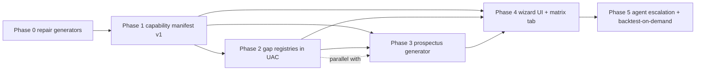

---
title:
  "Capability wizard + manifest — strategy/venue/instrument/execution/risk capability SSOT, strategy prospectus
  generator, walkthrough wizard UI"
parent_epic: strategy_master
assigned_vm: vm-trading-core
priority: P1
status: active
execution_scope: local-only # design sign-off pending — flip to orchestrator-agent per-phase once operator approves scope
estimate_class: brand-new
estimate_baseline_ai_days: 24.0
estimate_calibrated_ai_days: 24.0
created: 2026-06-11
source:
  - operator direction 2026-06-11 (capability-wizard discussion — ikenna + harsh; session covered availability Q&A,
    walkthrough chaining, collateral/fees/sim-assumption gaps, prospectus generation, two-sided codex audit)
related_plans:
  - plans/epics/strategy_master.md
  - plans/epics/deployment_and_user_management_master.md
  - plans/active/issues/capability_wizard_gap_discovery_2026_06_11.md
  - plans/active/issues/capability_wizard_analysis_findings_2026_06_11.md
locked_by: live-defi-rollout
locked_since: 2026-06-11
---

# Capability wizard + manifest

## Scope

A **capability manifest** (machine-generated SSOT of everything the system can do, edge-by-edge) + a **strategy
prospectus generator** (script that renders a per-configured-strategy document: mechanics, decision logic, exposures,
fund-flow mermaid, risk scenarios, circuit breakers, backtest Sharpe/drawdown) + a **walkthrough wizard UI**
(progressive configuration where every dropdown IS the availability answer). Codex SSOT for the concept:
[`codex/09-strategy/architecture-v2/capability-wizard.md`](../../codex/09-strategy/architecture-v2/capability-wizard.md).

**Four use cases (operator-stated 2026-06-11):**

1. **Visibility** — internal lens into strategy capabilities from instruments/venues/actual data availability through
   risk/margining/execution to fund flows and configurable decision-making per archetype.
2. **End-to-end parameterization** — drive the whole system from a stated execution preference; expose whether we are
   flexible enough, and surface questions the wizard cannot answer (each one = system expansion candidate).
3. **Two-sided audit** — verify what the wizard _thinks_ is possible is _actually_ possible in code; classify dead ends
   as **logical** (options-on-sports — fine) vs **unbuilt** (missing adapter/registry — gap). Orphan + dead-end-path
   detection across all registries.
4. **Client-lite wizard** — eventual client-facing configurator (successor of the public strategy questionnaire in
   `unified-trading-system-ui/app/(public)/questionnaire/`), ending in a config + credentials checklist + on-demand
   backtest ("here is what I need from you: these API keys; want a 5-year backtest of your configured preference?").

**Architecture decisions (operator-confirmed this session):**

- The manifest exporter is a **new generator in the existing PM openapi family**
  (`unified-trading-pm/scripts/openapi/`), reusing its deterministic-output/CI-drift/UI-delivery pipeline. The suite
  must be **repaired first** (Phase 0) — it has CRITICAL drift (phantom pre-consolidation services, architecture_v2
  never extracted; see pre-audit below).
- **Static capability vs runtime data availability stay separate**: the manifest answers "does the code support it";
  runtime "is the data actually there" questions delegate to deployment-api `/api/data-status/*` (drilldown, schema,
  shard-info). The wizard composes both (e.g. min-history-to-run check). Do NOT rebuild the data-status drilldown.
- **Escalation order: script → test → agent.** Every unanswerable question is logged as a typed gap (`missing_registry`
  | `missing_extraction` | `needs_code_scan`); only `needs_code_scan` goes to agent-orchestrator, and agent answers are
  written back into the manifest as annotations (credits spent once). Gaps tracked in
  [`issues/capability_wizard_gap_discovery_2026_06_11.md`](issues/capability_wizard_gap_discovery_2026_06_11.md).
- **UI placement**: wizard = new route group in `unified-trading-system-ui` (DNS/auth/deploy/Firestore already solved;
  self-contained route group keeps iteration context small). Capability matrix = tab in `deployment-ui` next to the
  existing Data Status tab (same ops audience).
- **Prospectus gives away full alpha for now** (debugging mode); curtailment is a later config flag.

## Pre-audit manifest (audited 2026-06-11, this session)

Generator-suite drift (blast radius for Phase 0 — all in `unified-trading-pm/scripts/openapi/`):

| Component                                                                     | Finding                                                                                                                                                                                                                                                                                                   | Severity |
| ----------------------------------------------------------------------------- | --------------------------------------------------------------------------------------------------------------------------------------------------------------------------------------------------------------------------------------------------------------------------------------------------------- | -------- |
| `generate_unified_spec.py:48-78` SERVICE_REGISTRY                             | 10+ phantom services (8× `features-*-service`, `ml-inference/-training`, `pnl-attribution`, `position-balance-monitor`, `risk-and-exposure`) consolidated away; missing `features-service`, `ml-service`, `fund-administration-service`, `greeks-service`                                                 | CRITICAL |
| `generate_ui_reference_data.py`                                               | architecture_v2 NEVER extracted: `StrategyArchetype` (53), `StrategyFamily` (9), `ARCHETYPE_CAPABILITY_REGISTRY`, `AtomicExecutionMode`, `VenueCategoryV2`, `MarginMode`, `KillSwitchReason`, `VenueFeature`, `RiskGateLayer/Decision`, etc. — extraction only walks package-root exports, not submodules | HIGH     |
| `generate_config_registry.py:38-123`                                          | same phantom/missing service configs                                                                                                                                                                                                                                                                      | HIGH     |
| Outputs (`unified-api-contracts/openapi/*.json`)                              | stale May 22–Jun 1; `_validate_service_coverage()` warns but does not FAIL                                                                                                                                                                                                                                | MEDIUM   |
| Source-mode capability matrix (`source-mode-capability-matrix_2026-06-07.md`) | documented manually, not generator-extracted                                                                                                                                                                                                                                                              | HIGH     |

Key code anchors: `unified_api_contracts/internal/architecture_v2/{enums,archetype_capability}.py` ·
`unified_api_contracts/internal/domain/strategy_service/registry.py` (STRATEGY_REGISTRY) ·
`execution_service/algorithms/registry.py` + `utils/instruction_type.py` + `trade_execution/order_types.py` ·
`features_service/delta_one/app/features/registry.py` (~1,382 specs / 34 groups, `features-status` CLI) ·
`ml_service/training/ml/model_registry.py` · `fund_administration_service/allocation/capital_router.py` ·
`unified_trading_library/performance_metrics.py` · `strategy_service/engine/backtest/runner.py` ·
`codex/09-strategy/architecture-v2/archetypes/` (59 files) ·
`codex/04-architecture/wallet-hierarchy-and-capital-flow.md`.

## Dependency DAG

Phase 2 and Phase 3 run PARALLEL after Phase 1 (prospectus consumes gap-registry stubs as `not_registered` until
backfilled). Phase 4 UI work is PARALLEL across the two repos.

## Phase 0 — repair the generator truth layer (`unified-trading-pm/scripts/openapi/`)

- [x] ✅ [IMPLEMENT] P0. SERVICE_REGISTRY: remove phantom pre-consolidation services; add `features-service`,
      `ml-service`, `fund-administration-service`, `greeks-service`; same sweep for CONFIG_REGISTRY in
      `generate_config_registry.py`. DONE 2026-06-11 — unified-trading-pm@50bdbcd36 (PR #268). Removed 13 phantom
      services; added fund-administration-service + greeks-service with verified config class names; instruments-service
      path fixed to `config.service_config`; market-tick-data-service path fixed to `market_interface.config`.
      features-service + ml-service: no root config.py exists (per-family only) — documented in registry comment.
- [x] ✅ [IMPLEMENT] P0. Auto-discover services from `workspace-manifest.json` instead of hardcoded lists;
      `_validate_service_coverage()` FAILS the run on disk-vs-registry mismatch (today it only warns). DONE 2026-06-11 —
      unified-trading-pm@50bdbcd36. Added `_load_service_registry(workspace_root)` + `_OVERRIDE_MODULE_PATHS` +
      `_NO_API_REPOS`; `_validate_service_coverage()` now calls `sys.exit(1)` on mismatch.
- [x] ✅ [IMPLEMENT] P0. Extend `extract_uic_enums()` to recursively walk `unified_api_contracts.internal` submodules
      (`architecture_v2.*`) so all 53-archetype/9-family enums + ARCHETYPE_CAPABILITY_REGISTRY land in
      `ui-reference-data.json`. DONE 2026-06-11 — unified-trading-pm@50bdbcd36. Added architecture_v2 submodule walk +
      `extract_architecture_v2_capability_registry()`. Verified output: StrategyArchetype 57 values (count grew from
      audited 53 — 4 new archetypes landed), StrategyFamily 9 values, ARCHETYPE_CAPABILITY_REGISTRY 22 archetypes / 98
      cells, total UIC enums 227 (up from single-digits).
- [ ] [SCRIPT] P1. Fresh full run of `generate-unified-openapi.sh`; commit regenerated outputs; verify
      `check_openapi_drift.py` quality gate is green and actually fires on synthetic drift.
- [x] ✅ [VERIFY] P0. Drift CI gate: `_validate_service_coverage()` now exits nonzero on mismatch (fail-on-drift
      implemented in-run). DONE 2026-06-11 — unified-trading-pm@50bdbcd36. Scheduled workflow is a Phase 1 item
      (deferred — fail-on-run counts as the enforcement gate for now).

## Phase 1 — capability manifest exporter v1 (`generate_capability_manifest.py`)

- [x] ✅ [SPEC] P0. `CapabilityManifest` pydantic schema in unified-api-contracts: nodes (archetype, family, venue,
      chain, instrument_type, algo, feature_group, model, data_source, fund_structure, wallet, broker) + typed edges
      with status `available | partial | not_available | not_registered` + gap type
      `missing_registry | missing_extraction | needs_code_scan | logical_dead_end` + `agent_annotation` field for
      written-back agent answers. DONE 2026-06-11 — unified-api-contracts@6f31f59 (capability_manifest.py: 14 node
      kinds, deterministic to_canonical_dict(), 40 unit tests green, QG exit 0).
- [ ] [IMPLEMENT] P0. Extract: STRATEGY_REGISTRY + ARCHETYPE_CAPABILITY_REGISTRY (archetype × venue_category ×
      instrument_type), venue/instrument universe (instruments-service `InstrumentRecord` + ENDPOINT_REGISTRY incl.
      per-venue access_mode/auth requirements), execution algos + instruction types + order-type/TIF enums
      (FOK/IOC/post-only, make/take), feature registry (34 groups incl. per-group lookback), ML model registry (training
      windows), KillSwitchReason + RiskGateLayer/Decision, MarginMode, deployments/cloud topology (lifecycle_class,
      AWS/GCP), sports leagues + prediction question groups from the instruments snapshot.
- [ ] [IMPLEMENT] P1. Source-mode matrix extraction: batch/live/replay × source × transport (WS vs REST) — codify the
      manual `source-mode-capability-matrix_2026-06-07.md` audit into registry + extraction so batch/live symmetry is
      queryable per data source.
- [ ] [IMPLEMENT] P1. Derived edges: **min-data-to-run** per (archetype, venue, timeframe) = max feature-group lookback
      × ML training window; emitted as a manifest edge the wizard checks against live shard counts via deployment-api.
- [ ] [IMPLEMENT] P1. Orphan + dead-end report: registry entries nothing references; wizard paths that dead-end;
      classify `logical_dead_end` vs unbuilt (use case 3). Extend the existing orphan-report pattern.
- [ ] [VERIFY] P1. Determinism + drift gate for the manifest (same CI pattern as ui-reference-data.json); manifest ships
      to `unified-trading-system-ui/lib/registry/` via the existing uic-openapi-sync workflow.

## Phase 2 — gap registries in unified-api-contracts (schema first = forcing function; PARALLEL items)

- [x] ✅ [SPEC] P0. **Collateral registry** schema. DONE 2026-06-11 — unified-api-contracts@6f31f59
      (collateral_registry.py: CollateralPolicy/AssetHaircut/BrokerEntry/TreasurySplitPolicy; TREASURY_SPLIT_POLICIES
      seeded — DeFi 20/80, CeFi 0/100, Sports no-split, sourced from wallet-hierarchy codex; COLLATERAL_REGISTRY +
      BROKER_REGISTRY honest-empty — per-venue haircuts/LTVs are a backfill, numbers never invented).
- [x] ✅ [SPEC] P1. **Fees registry** schema. DONE 2026-06-11 — unified-api-contracts@6f31f59 (fees_registry.py:
      FeeComponent/FeeUnit/FeeSchedule; FEES_REGISTRY honest-empty — backfill).
- [x] ✅ [SPEC] P1. **Simulation-assumptions registry** schema. DONE 2026-06-11 — unified-api-contracts@6f31f59
      (simulation_assumptions.py: MatchingModel mapped to existing BenchmarkFillMode; SIM_ASSUMPTIONS_REGISTRY
      honest-empty — needs_code_scan of backtest runner, see finding F11).
- [x] ✅ [SPEC] P1. **Fund-structure manifest** schema. DONE 2026-06-11 — unified-api-contracts@6f31f59
      (fund_structures.py: FundStructureKind/CadenceKind/FundStructureOffering, reuses existing ShareClass enum;
      OFFERED_FUND_STRUCTURES honest-empty).
- [x] ✅ [SPEC] P1. **Order-semantics-per-venue-adapter declarations** schema. DONE 2026-06-11 —
      unified-api-contracts@6f31f59 (order_semantics.py: canonical TimeInForce (none pre-existed in UAC — F10),
      RefPricingMode fixed|delta_adjusted_to_underlying, MultiLegDeltaOwner, VenueOrderSemantics with auth_wired;
      VENUE_ORDER_SEMANTICS honest-empty — per-adapter honor matrix is a code-scan backfill).
- [x] ✅ [SPEC] P2. **Trading-agent/LLM capability declarations** schema. DONE 2026-06-11 —
      unified-api-contracts@6f31f59 (trading_agent_capability.py; TRADING_AGENT_CAPABILITIES honest-empty).
- [ ] [IMPLEMENT] P2. **Registry backfills** (split from the schema todos above, which shipped honest-empty): per-venue
      collateral/haircut/LTV/maintenance-margin entries, fee tiers, per-adapter order-semantics honor matrices, sim
      assumptions from backtest-runner scan, offerable fund structures — each backfill PR cites its source of truth;
      `needs_code_scan` items route through Phase 5 agent escalation.
- [ ] [IMPLEMENT] P1. Manifest exporter consumes each new registry as it lands; until then emits honest `not_registered`
      edges (never silently omits the dimension).

## Phase 3 — strategy prospectus generator (script first, UI later; PARALLEL with Phase 2)

- [ ] [IMPLEMENT] P0. `generate_strategy_prospectus.py`: input = strategy config + capability manifest → markdown: what
      the strategy does, decision logic (FULL alpha disclosure — debugging mode; curtailment flag later),
      position-by-scenario table ("in this scenario the strategy will be positioned…"), expected
      returns/Sharpe/max-drawdown (from `performance_metrics.py` over backtest output), written as if presenting to the
      internal allocation team / a potential investor.
- [ ] [IMPLEMENT] P1. Exposure section: per-leg exposures and normalization — staked-ETH vs ETH equivalence,
      base-currency-neutral views; pull from greeks-service / ledger exposure models where available, else emit
      `not_registered` gap.
- [ ] [IMPLEMENT] P1. **Fund-flow mermaid**: venues/wallets as boxes (treasury vs trading/hot per
      `wallet-hierarchy-and-capital-flow.md` + `capital_router.py` AllocationTargets), deposit→conversion→venue paths
      (e.g. deposit ETH → receive stETH → post to CeFi venue → short perp), cross-balance movement arrows.
- [ ] [IMPLEMENT] P1. Risk section: applicable KillSwitchReason set + RiskGateLayer placement for the configured
      archetype/venues, configurable circuit-breaker parameters, liquidation monitoring surface.
- [ ] [AUDIT] P1. **Two-sided audit**: diff generated prospectus vs the hand-written codex archetype doc
      (`codex/09-strategy/architecture-v2/archetypes/<archetype>.md`) for all 53 archetypes; discrepancy report feeds
      the gap tracker (wizard-thinks vs codex-says vs code-does).
- [ ] [VERIFY] P2. Pin a regression test per fixed discrepancy (operator rule: as issues are found, build tests around
      them).

## Phase 3.5 — interactive scenario stepper (operator direction 2026-06-11, second session message)

After the wizard produces a config, the user can **step through the strategy like a paper run without real data**: the
stepper drives the REAL strategy engine loop (batch=live HARD RULE — never a parallel engine) with a
**SyntheticMarketState** the user steers — key numbers fed by hand (funding rate, prices, quotes, feature values) or
seeded-random fillers — and mock fills via the existing BenchmarkFillMode. Each step reports: instructions emitted,
fills, positions, PnL delta, **which triggers/predicates evaluated and how they resolved** (entry, exit, stop loss,
rebalance, each KillSwitchReason), and **distance-to-trigger** for every armed threshold ("DAILY_LOSS_BREACH arms at
−5%, you are at −1.2%"). This is decision-tree auditing: walking the archetype's code-path branches by steering inputs,
viable TODAY (pre-backfill/pre-migration), upgrading to the Phase 5 real-data backtest when data lands. Per-archetype,
post-config (combinatorial explosion is avoided because the wizard fixed the config first).

- [ ] [SPEC] P1. Stepper contract in UAC architecture_v2: `StepInput` (user-supplied key numbers keyed by
      instrument/venue/feature + RNG seed for fillers) + `StepReport` (instructions, fills, position/PnL deltas, trigger
      evaluations value-vs-threshold, risk-gate decisions per RiskGateLayer) — deterministic given (config, inputs,
      seed).
- [ ] [IMPLEMENT] P1. `e2e-testing/scripts/strategy/scenario_stepper.py` (peripheral-script rule: wired into
      strategy-service QG): JSON-in/JSON-out per step + interactive REPL mode; drives the real archetype engine with
      SyntheticMarketState + benchmark fills. NOTE: strategy-service engine is under LOGIC FREEZE (surface-only) — v1
      derives the trigger map from emitted events + risk-gate decisions WITHOUT engine edits; engine-side predicate
      tracing is a post-unfreeze enhancement todo.
- [ ] [IMPLEMENT] P1. Trigger map + distance-to-trigger: enumerate armed thresholds for the configured archetype/venues
      (kill switches, stop loss, entry/exit conditions from config) and report current-value vs threshold each step.
- [ ] [AGENT][UI] P2. Wizard "Step through it" stage after config: feed key numbers, render StepReports as a timeline
      (trades/positions/PnL/triggers). pw:L2 gate.
- [ ] [VERIFY] P1. Stepper smoke per MVP archetype (carry_staked_basis + arbitrage_price_dispersion first): N scripted
      steps produce coherent position/PnL arithmetic and at least one forced kill-switch trip.

## Phase 4 — wizard UI + capability matrix tab (PARALLEL across repos)

- [ ] [AGENT][UI] P1. `unified-trading-system-ui`: new self-contained route group `app/(wizard)/` + `lib/wizard/`.
      Manifest-driven progressive configuration: each step's options filtered to what remains possible given prior
      answers; unavailable options visible-but-greyed with reason + gap type; every config field shows side-by-side help
      text sourced from pydantic `Field(description=…)` (extend config-registry extraction to carry descriptions). Seeds
      vocabulary from `lib/questionnaire/` axes. pw:L2 gate.
- [ ] [AGENT][UI] P1. Wizard output: strategy configuration artifact + onboarding checklist — required API
      keys/credentials per selected venue (from ENDPOINT_REGISTRY auth requirements), deposit currency/cadence,
      collateral placement — the "what I need from you to get started" surface.
- [ ] [AGENT][UI] P1. `deployment-ui`: **Capability tab** next to Data Status — full matrix view (archetype × venue ×
      instrument × mode × algo), orphan/dead-end report, batch-live symmetry view; leaf data-availability questions call
      existing `/api/data-status/*` (drilldown/schema/shard-info) — no rebuild. pw:L2 gate.
- [ ] [IMPLEMENT] P2. Wizard "isolation mode": flat queries (what strategies/venues/algos/instructions exist) alongside
      the chained walkthrough — same manifest, two query styles.

## Phase 5 — agent escalation + backtest-on-demand

- [ ] [IMPLEMENT] P1. `needs_code_scan` gap → agent-orchestrator task (existing planning-VM workflow); agent answer
      written back as manifest `agent_annotation` so the question is never paid for twice. Strict gating: agents only
      when script/registry cannot answer (operator rule).
- [ ] [IMPLEMENT] P2. Backtest-on-demand: wizard config → `strategy_service/engine/backtest/runner.py` over last N years
      → metrics into the prospectus ("want to see a 5-year backtest of your configured preference?"). Depends on
      data-availability precheck via deployment-api.
- [ ] [DEFERRED] P3. Client-lite wizard mode (use case 4) — named successor plan once internal wizard is hardened.

## Wave 2 — proposed enhancements (Claude 2026-06-11; PENDING OPERATOR SIGN-OFF, do not dispatch)

Question bank SSOT (every wizard question pinned to its code anchor):
[`codex/09-strategy/architecture-v2/capability-wizard-question-bank.md`](../../codex/09-strategy/architecture-v2/capability-wizard-question-bank.md).

- [ ] [DESIGN] P2. **Counterfactual "minimal unlock set" engine** — every unavailable edge computes the smallest set of
      missing pieces that would make it available ("Hyperliquid perps: adapter ✓, auth ✗ — 1 edge away"); wizard counts
      demand per blocked edge; weekly demand-weighted gap report auto-emits canonical todos into the gap tracker (same
      ingestion path as `regen_backlog_from_plan.py`). The wizard becomes a roadmap generator.
- [ ] [DESIGN] P2. **Readiness badges per edge** — stamp every capability edge with operational maturity derived from
      the deployments registry + shadow ledger + archived plans:
      `backtest-only | shadow-observed | staging-proven |     live-proven`, mapped to the C/D/B gate model in
      PLAN_FORMAT.md. "Available" without "ever ran" is a different answer.
- [ ] [DESIGN] P2. **Config-space fuzzer → generated smoke tests** — mechanically enumerate reachable wizard configs,
      sample, compile each to a system-integration-tests batch mock-fill scenario. Use-case-3 audit by _execution_, not
      inspection: every reachable config must at least smoke-run; failures are mechanical dead-end findings.
- [ ] [DESIGN] P2. **Manifest as MCP server + conversational wizard agent** — tools: `query_manifest`, `data_status`
      (deployment-api), `run_backtest`, `render_prospectus`; agent-orchestrator hosts it. Powers the "what I need from
      you is these API keys — want a 5-year backtest?" dialogue with answers grounded in registry paths, not model
      memory.
- [ ] [DESIGN] P2. **Versioned manifest + capability changelog + regression CI** — manifest generated per commit; diffs
      = "what the system learned to do this month" (investor-update material); CI FAILS when an edge regresses
      `available → not_available` without a plan reference.
- [ ] [DESIGN] P2. **Inverse wizard / screener** — start from holdings ("I have BTC today, USDT tomorrow") or targets
      (Sharpe ≥ 1.5, max DD ≤ 10%, carry ≥ 8%) and search the manifest + backtest metrics for qualifying archetypes,
      ranked.
- [ ] [DESIGN] P2. **Portfolio mode** — compose multiple configured strategies: aggregate/netted exposures
      (internalization detection when one leg longs what another shorts), correlation from backtests, capital routing
      across pools/SMA via portfolio_allocator + capital_router. Directly models the two-pooled-investors-now /
      SMA-next-year scenario.
- [ ] [DESIGN] P2. **Cost & capacity model** — full fee stack (exchange/gas/broker/clearing + funding + slippage via
      execution cost prediction) + infra cost per lifecycle_class → **breakeven AUM** per configured strategy; capacity
      ceiling vs venue liquidity/min-ticket constraints.
- [ ] [DESIGN] P3. **Wizard sessions as reproducible artifacts** — session JSON (answers + manifest version + config +
      prospectus hash); nightly replay of saved sessions against the fresh manifest (batch-live-reconciliation pattern)
      alerts when an old answer silently changes; doubles as the client-onboarding compliance record.
- [ ] [DESIGN] P3. **Dual-register copy** — every question/config field carries engineer copy (config path, code anchor)
      AND allocator/investor copy (plain English), reusing the existing glossary Term components; prospectus renders in
      either register.
- [ ] [DESIGN] P3. **Named stress-scenario library** — curated historical windows (May-2021 crash, FTX week, Shapella, a
      funding-flip regime) replayed through the backtest runner per configured strategy; positions/PnL/triggered
      kill-switches become the prospectus risk slides.
- [ ] [DESIGN] P3. **Jurisdiction overlay** — investor entity/jurisdiction filters venues/instruments at Stage A
      (client_isolation_and_governance restrictions), so a config can never include a venue the investor cannot legally
      touch.

## Success criteria

- Phase 0: fresh generator run green; zero phantom/missing services; architecture_v2 enums + capability registry present
  in `ui-reference-data.json`; drift gate FAILS on synthetic mismatch.
- Phase 1: manifest covers all 53 archetypes × all registered venues/instruments/algos/sources; every dimension either
  populated or carries a typed gap — **no silent omissions**; orphan/dead-end report distinguishes logical vs unbuilt.
- Phase 2: each gap registry has UAC schema + at least MVP-universe backfill; manifest consumes them.
- Phase 3: prospectus renders for all 53 archetypes; two-sided audit report produced; discrepancies filed as gaps.
- Phase 4: wizard walkthrough reaches a complete strategy config for ≥3 real archetypes (e.g. carry spot-vs-perp BTC,
  LST-stake-and-short-perp, an options vol archetype) with only-valid-options filtering; capability tab live in
  deployment-ui; pw:L2 green both repos.
- Phase 5: one real `needs_code_scan` gap round-tripped through the orchestrator into a manifest annotation; one
  backtest-on-demand round trip from wizard config to prospectus metrics.

## Full-execution criterion

`bash scripts/openapi/generate-unified-openapi.sh && python scripts/openapi/generate_capability_manifest.py && python scripts/openapi/generate_strategy_prospectus.py --archetype carry_basis_perp`
on the laptop (full workspace) completes end-to-end: regenerated registries, manifest with 0 untyped unknowns, rendered
prospectus whose two-sided audit section diffs against
`codex/09-strategy/architecture-v2/archetypes/carry-basis-perp.md`. Wizard verified via Playwright L2 on both UI repos
against the committed manifest.

## Codex SSOT updates

- NEW
  [`codex/09-strategy/architecture-v2/capability-wizard.md`](../../codex/09-strategy/architecture-v2/capability-wizard.md)
  — concept SSOT (shipped with this plan).
- `codex/14-customer-journeys/` — strategy-onboarding journey update when Phase 4 lands.
- `plans/audit/instructions/strategy_master_audit_instructions.md` — add recurring two-sided-audit criterion (wizard vs
  codex vs code) once Phase 3 ships.

## Findings discipline (operator direction 2026-06-11)

Autonomous build dispatched 2026-06-11 under `cursor-configs/AUTONOMOUS_AGENT_RULES.md`. Two side-docs, both mandatory
for every agent on this plan:

- **Capability gaps** (missing registries/extractions) →
  [`issues/capability_wizard_gap_discovery_2026_06_11.md`](issues/capability_wizard_gap_discovery_2026_06_11.md)
- **Bugs / conflicting truths / dual implementations / understanding gaps** →
  [`issues/capability_wizard_analysis_findings_2026_06_11.md`](issues/capability_wizard_analysis_findings_2026_06_11.md)

## Progress Log (append-only — survives context compression)

- 2026-06-11 — Plan + codex SSOT (`capability-wizard.md`) + question bank + gap tracker + findings doc authored;
  strategy_master related_plans updated (+ duplicate section fix = F6). Autonomous execution started: Wave 1 = Phase 0
  generator repair (PM, sub-agent) ∥ UAC capability/gap schemas (sub-agent). Wave 2 = exporter → prospectus → UI.
- 2026-06-11 — **Wave 1 DONE.** Phase 0 shipped (unified-trading-pm@50bdbcd36, PR #268: manifest-driven service
  auto-discovery + sys.exit(1) on drift; architecture_v2 extraction — 57 archetypes/227 UIC enums/22-archetype
  capability registry now in ui-reference-data.json; findings F4-confirmed/F8/F9 appended @706e1196a). UAC schemas
  shipped (unified-api-contracts@6f31f59: capability_manifest + 6 gap-registry modules, TREASURY_SPLIT_POLICIES seeded,
  rest honest-empty, 40 tests, QG 216s green). Open from Phase 0: full-suite regeneration commit (host lacks full
  .venv-workspace — exporter wave handles what it can, else documented). **Operator added Phase 3.5 (scenario stepper)
  mid-flight — baked into plan.** Wave 2 dispatching: capability manifest exporter (PM) + UAC output commit.
- 2026-06-11 — **Phase 0 COMPLETE** (unified-trading-pm@50bdbcd36, PR #268). Three generator files repaired:
  `generate_unified_spec.py` — SERVICE_REGISTRY auto-derived from workspace-manifest.json, 13 phantom services removed,
  fail-on-drift enforcement; `generate_config_registry.py` — phantom services removed, 4 real services added with
  verified import paths, 2 consolidated-monorepo services documented (no root config); `generate_ui_reference_data.py` —
  architecture_v2 submodule walk added, ARCHETYPE_CAPABILITY_REGISTRY serialised deterministically, StrategyArchetype
  (57), StrategyFamily (9), total UIC enums 227. Quality gates passed. Generator run verified with UAC venv. Finding F4
  confirmed (archetype_capability_manifest.json hand-maintained alongside Python registry, no drift check). One Phase 0
  item deferred: scheduled workflow for drift CI gate (fail-on-run is the current gate).

## Out of scope / named successors

- Client-facing lite wizard + alpha-curtailment tiers (use case 4) — successor plan.
- Replacing the public strategy questionnaire — it stays as demand capture; wizard supersedes it only for onboarding.
- Rebuilding any part of the data-status drilldown — delegation only.
- Live integration beyond deployment-api data-status + backtest runner calls (wizard is registry/code-driven by design).
