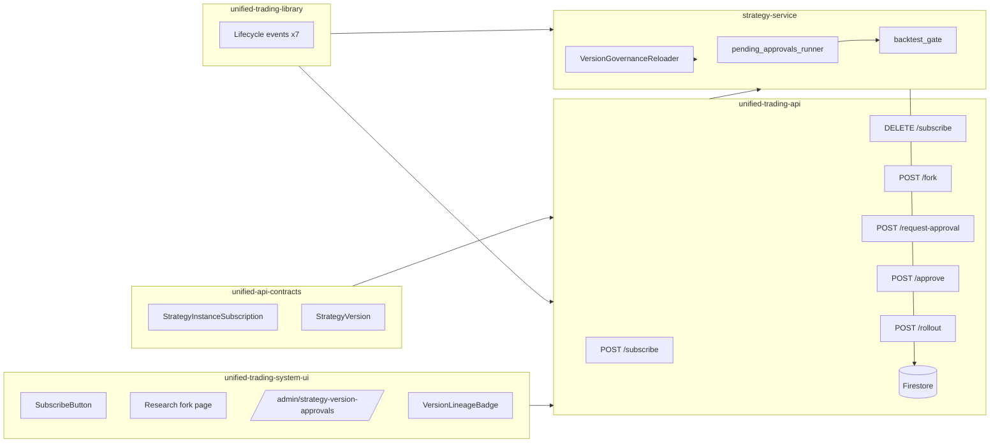

## Architecture diagram (Mermaid)

## Related plans

- [Plan A — strategy-lifecycle-maturity-model](./strategy_lifecycle_maturity_model_2026_04_21.plan.md)
- [Plan B — strategy-catalogue-3tier-surface](./strategy_catalogue_3tier_surface_2026_04_21.plan.md)
- [Plan C — performance-overlay-continuous-timeline](./performance_overlay_continuous_timeline_2026_04_21.plan.md)
- [Plan E — orphan-audit-policy](./orphan_audit_policy_2026_04_21.plan.md)
