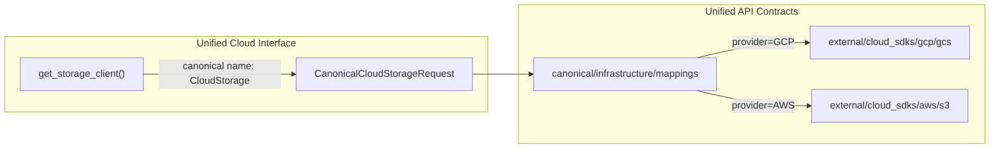

# Infrastructure Canonical Layer

## Concept

**Raw** (external/cloud_sdks): GCS, BigQuery, S3, Redshift — provider-specific schemas. These stay as-is.

**Normalized** (canonical/infrastructure): Cloud-agnostic names. UCI is called with canonical names; UAC maps canonical
→ provider SDK and provides raw schemas for the call.

---

## Canonical Infrastructure Types

| Canonical name                         | GCP raw           | AWS raw         | Purpose                           |
| -------------------------------------- | ----------------- | --------------- | --------------------------------- |
| **CloudStorage**                       | GCS               | S3              | Object/blob storage               |
| **OLAPTable** (or AnalyticalWarehouse) | BigQuery          | Redshift        | Analytical query / data warehouse |
| **SecretStore**                        | Secret Manager    | Secrets Manager | Secrets                           |
| **MessageQueue**                       | Pub/Sub           | SQS / SNS       | Async messaging                   |
| **ContainerRegistry**                  | Artifact Registry | ECR             | Container images                  |

(Extend as needed: Compute, Lambda/Cloud Functions, etc.)

---

## Flow



1. **UCI** receives a request with canonical name (e.g. "CloudStorage", "OLAPTable").
2. **UAC** `canonical/infrastructure/mappings` (or similar) maps: canonical + provider → raw SDK module + schema.
3. **UAC** provides raw request/response schemas (GCS, S3, BigQuery, etc.) for UCI to construct the call.

---

## Structure

```
canonical/
  infrastructure/
    storage.py       # CanonicalCloudStorage, CanonicalStorageBucket (generic)
    olap.py          # CanonicalOLAPTable, CanonicalQueryResult (BigQuery, Redshift)
    secrets.py       # CanonicalSecretStore
    mappings.py      # CANONICAL_INFRA_TO_PROVIDER: CloudStorage → {gcp: gcs, aws: s3}

external/
  cloud_sdks/        # raw — unchanged
    gcp/
      gcs.py
      bigquery.py
    aws/
      s3.py
      # Redshift (if not present, add)
```

---

## Plan Updates

Add to
[uac_residual_refactors_provider_manifest_2026_03_14.plan.md](unified-trading-pm/plans/active/uac_residual_refactors_provider_manifest_2026_03_14.plan.md):

1. **Section: Infrastructure canonical layer**

- Raw = external/cloud_sdks (GCP, AWS specific)
- Normalized = canonical/infrastructure/ (CloudStorage, OLAPTable, etc.)
- Mapping: canonical name + provider → raw SDK

2. **Todo: ref-infrastructure-canonical**

- Create canonical/infrastructure/ with CloudStorage, OLAPTable, SecretStore; add CANONICAL_INFRA_TO_PROVIDER mapping

3. **Todo: ref-infrastructure-normalizers**

- Add normalize/ layer for infrastructure (optional): raw GCS/S3 response → CanonicalStorageBucket if needed

4. **UCI alignment note**

- UCI `get_storage_client()` already uses StorageClient protocol. UAC canonical layer provides the schema and mapping so
  UCI can resolve "CloudStorage" + provider to the correct SDK type and call pattern.
