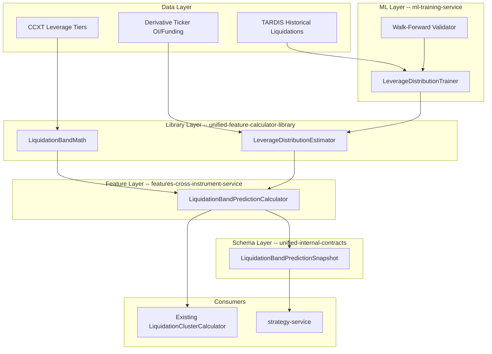

# Liquidation Band Prediction System

## Context

From the brain dump: the model estimates **P(leverage=k)** for tiers {5x, 10x, 25x, 50x, 100x} from observable market
features (OI, funding rate, aggressive trade side volume, price momentum). Combined with current price, these
probabilities yield **liquidation price bands** with estimated sizes. Offline training calibrates against years of real
TARDIS liquidation data. Live/batch use aggregated features. No lookahead bias.

## Existing Infrastructure (already built)

- `**CanonicalLiquidationCluster`\*\* (UAC) -- `source` field already says "internal (own liquidation prediction model)"
  -- designed for this
- `**CanonicalLiquidation`\*\* + 9-venue normalizers (TARDIS, Binance, Bybit, etc.) -- training targets
- `**CanonicalDerivativeTicker`\*\* with `open_interest` -- input feature
- **CCXT `leverage_tiers`** in instruments-service -- real maintenance margin rates per venue/tier
- `**Liquidations` calculator\*\* (delta-one) -- reactive liq features (volume, imbalance, cascades)
- `**FundingOI` calculator\*\* (delta-one) -- funding rate + OI features
- `**LiquidationClusterCalculator`\*\* (cross-instrument) -- consumes external clusters (CoinGlass/Hyblock)
- `**LiquidationLevels` calculator\*\* (delta-one) -- built but NOT registered, uses proxy data
- **TARDIS historical pipeline** (market-tick-data-service) -- years of liquidation + derivative_ticker data
- `**CefiLiquidationsAdapter`\*\* (market-data-processing) -- tick-to-candle for liquidation events

## Architecture



## Repos Touched (4 repos, tier-respecting order)

### 1. unified-feature-calculator-library (Tier 2 library)

New file: `src/unified_feature_calculator_library/liquidation_bands.py`

`**LiquidationBandMath**` -- pure math, zero ML dependencies:

- `compute_long_liquidation_price(entry_price, leverage, maintenance_margin_rate)` -- exact per-exchange formula
- `compute_short_liquidation_price(entry_price, leverage, maintenance_margin_rate)` -- exact per-exchange formula
- `compute_bands_for_tiers(current_price, leverage_tiers, maintenance_margins)` -- vectorized across all tiers
- Default tiers: `[5, 10, 25, 50, 100]` with per-venue maintenance margin overrides from instruments-service data

`**LeverageDistributionEstimator**` -- statistical model kernel:

- `estimate_distribution(features: dict) -> LeverageDistribution` -- Dirichlet-based softmax over tiers
- `calibrate(historical_features, historical_liquidations)` -- offline calibration against real data
- `save_parameters(path)` / `load_parameters(path)` -- serialization for model persistence
- Features consumed: normalized_oi, funding_rate, funding_acceleration, taker_buy_sell_ratio, price_momentum,
  oi_velocity, realized_volatility
- Output: probabilities per tier + estimated USD size per band
- Implementation: softmax regression over hand-engineered features (not deep learning -- interpretable, fast, fits the
  "distribution is a guess" philosophy from the brain dump)

`**LookaheadBiasGuard**` -- utility:

- `validate_no_lookahead(features_df, target_df, feature_timestamp_col, target_timestamp_col)` -- asserts all feature
  timestamps strictly precede target timestamps
- Used in both training and feature calculation to enforce invariant

Export from `__init__.py`: `LiquidationBandMath`, `LeverageDistributionEstimator`, `LookaheadBiasGuard`

### 2. unified-internal-contracts (Tier 0)

New schema in
[unified_internal_contracts/features.py](unified-internal-contracts/unified_internal_contracts/features.py):

```python
class LiquidationBandPredictionSnapshot(BaseModel):
    instrument_key: str
    venue: str
    timestamp: AwareDatetime
    current_price: Decimal
    bands: list[LiquidationBandEntry]
    model_version: str
    calibration_date: str
    total_oi_usd: Decimal | None = None

class LiquidationBandEntry(BaseModel):
    leverage_tier: int          # 5, 10, 25, 50, 100
    long_liq_price: Decimal     # predicted long liquidation price
    short_liq_price: Decimal    # predicted short liquidation price
    probability: float          # P(leverage=tier) from model
    estimated_long_usd: Decimal # probability * OI allocation (long side)
    estimated_short_usd: Decimal # probability * OI allocation (short side)
    maintenance_margin_rate: float  # from venue tier data
```

Re-export from `__init__.py`. This schema feeds into strategy-service and can also be converted to
`CanonicalLiquidationCluster` (with `source="internal_prediction"`) for the existing `LiquidationClusterCalculator` to
consume.

### 3. features-cross-instrument-service (Service tier)

New file: `features_cross_instrument_service/app/calculators/liquidation_band_prediction.py`

`**LiquidationBandPredictionCalculator**` extends `BaseFeatureCalculator`:

- **feature_group**: `"liquidation_band_prediction"`
- **required_columns**: `close`, `open_interest`, `funding_rate`, `volume`, `taker_buy_volume` (or fallback to
  volume-based proxy)
- **max_lookback_periods**: 96 (24h at 15-min)
- `**_calculate_features(df, symbol)`\*\*:
  1. Compute input features: normalized_oi, funding_acceleration, taker_ratio, price_momentum, oi_velocity, realized_vol
  2. Run `LeverageDistributionEstimator.estimate_distribution(features)`
  3. Run `LiquidationBandMath.compute_bands_for_tiers(current_price, tiers, margins)`
  4. Combine: probability \* OI = estimated size per band
  5. Output flat features: `liq_band_{tier}x_long_price`, `liq_band_{tier}x_short_price`, `liq_band_{tier}x_prob`,
     `liq_band_{tier}x_long_usd`, `liq_band_{tier}x_short_usd` for each tier
  6. Aggregate features: `nearest_predicted_liq_long_bps`, `nearest_predicted_liq_short_bps`, `predicted_liq_asymmetry`,
     `concentrated_leverage_tier`

Register in `CALCULATOR_REGISTRY`:

```python
"liquidation_band_prediction": LiquidationBandPredictionCalculator
```

**Batch vs Live**: Same calculator, different data freshness. Batch uses 15-min aggregated parquet from GCS. Live uses
streaming derivative_ticker + OHLCV.

### 4. ml-training-service (Service tier)

New file: `ml_training_service/app/training/leverage_distribution_trainer.py`

`**LeverageDistributionTrainer`\*\*:

- **Data pipeline**:
  1. Load TARDIS historical liquidations (CanonicalLiquidation) -- the ground truth
  2. Load derivative_ticker history (OI, funding) -- input features
  3. Load OHLCV candles -- price/volume features
  4. Match liquidation events to leverage tiers (fuzzy match accounting for 1-2% exchange markup, as discussed in brain
     dump)
- `**match_liquidation_to_leverage(liq_price, mark_price, maintenance_margins)`\*\* -- determines which leverage tier
  caused the liquidation, with tolerance for exchange markup
- **Walk-forward training**:
  1. Split timeline into train/validation windows (e.g., 3-month train, 1-month validate, rolling)
  2. For each window: compute features from train period, calibrate `LeverageDistributionEstimator`
  3. Predict on validation period, compare predicted bands to actual liquidation events
  4. Score: how many real liquidations fell within predicted bands, calibration error per tier
- **No-lookahead enforcement**:
  - `LookaheadBiasGuard.validate_no_lookahead()` called at every split boundary
  - Features computed only from data strictly before prediction timestamp
  - Walk-forward only (no random splits)
- **Model persistence**: Saves calibrated parameters via `ModelRegistry` (existing pattern from ml-training-service)
- **Metrics**: calibration_error_per_tier, band_hit_rate, leverage_distribution_kl_divergence

New model type in [unified-ml-interface](unified-ml-interface/unified_ml_interface/models.py): Add
`"LEVERAGE_DISTRIBUTION"` to `VALID_MODEL_TYPES`.

## Exchange Liquidation Price Nuance

From the brain dump: exchanges fill liquidations 1-2% worse than the actual price. The training pipeline accounts for
this:

- `match_liquidation_to_leverage()` uses a fuzzy tolerance window (configurable, default 2%)
- The trainer tracks the empirical markup distribution per venue
- Calibration uses the adjusted (market) price, not the reported liquidation price

## Tests (all repos, static/mock data)

### unified-feature-calculator-library tests

File: `tests/unit/test_liquidation_bands.py`

- **test_long_liquidation_price_exact** -- 10x leverage at $50,000 with 0.5% maintenance = $45,250 (exact math)
- **test_short_liquidation_price_exact** -- same but short side
- **test_all_tiers_computed** -- 5 tiers, verify all prices computed, prices monotonically closer to current price as
  leverage increases
- **test_distribution_sums_to_one** -- Dirichlet output probabilities sum to 1.0
- **test_distribution_responds_to_oi_spike** -- high OI + high funding should shift distribution toward higher leverage
- **test_calibrate_on_synthetic_data** -- generate synthetic dataset with known leverage distribution, calibrate, verify
  convergence
- **test_lookahead_guard_catches_violation** -- future timestamps in features raises error
- **test_lookahead_guard_passes_clean_data** -- valid temporal ordering passes
- **test_serialization_roundtrip** -- save/load parameters produces identical estimates
- **test_zero_oi_handling** -- graceful degradation when OI is zero (uniform prior)

### features-cross-instrument-service tests

File: `tests/unit/test_liquidation_band_prediction.py`

- **test_calculator_registration** -- `"liquidation_band_prediction"` in `CALCULATOR_REGISTRY`
- **test_required_columns** -- verifies required columns list
- **test_calculate_features_shape** -- output DataFrame has expected columns for all 5 tiers
- **test_features_with_mock_data** -- synthetic 24h DataFrame, verify all output features are non-NaN
- **test_nearest_predicted_liq_bands** -- verify `nearest_predicted_liq_long_bps` is positive and reasonable
- **test_no_lookahead_in_rolling** -- features at time T use only data <= T
- **test_missing_optional_columns** -- graceful handling when taker_buy_volume missing (falls back to volume proxy)
- **test_batch_vs_live_consistency** -- same input data produces same output regardless of mode

### ml-training-service tests

File: `tests/unit/test_leverage_distribution_trainer.py`

- **test_match_liquidation_to_leverage** -- known liquidation at $45k with mark at $50k = ~10x leverage
- **test_fuzzy_match_with_exchange_markup** -- liquidation 1.5% worse than expected still matches correct tier
- **test_walk_forward_no_lookahead** -- verify train/validation split is strictly temporal
- **test_walk_forward_on_synthetic_data** -- generate 6 months of synthetic data, run walk-forward, verify calibration
  improves
- **test_calibration_metrics_computed** -- all expected metrics present in output
- **test_model_registry_integration** -- mock ModelRegistry, verify trainer stores/loads correctly

### unified-internal-contracts tests

File: `tests/unit/test_liquidation_band_schema.py`

- **test_snapshot_serialization** -- create `LiquidationBandPredictionSnapshot`, serialize/deserialize
- **test_band_entry_validation** -- probability in [0,1], prices positive, leverage_tier in valid set
- **test_to_canonical_cluster_conversion** -- snapshot bands convert to `CanonicalLiquidationCluster` with
  `source="internal_prediction"`

## Synthetic Test Data Strategy

A `conftest.py` fixture in each repo generates:

- **Synthetic OHLCV**: 30 days of 15-min candles with realistic BTC-like price action (random walk + mean reversion)
- **Synthetic OI**: correlated with price, with regime changes
- **Synthetic funding**: oscillates with occasional extremes
- **Synthetic liquidations**: generated from a KNOWN leverage distribution (e.g., 40% at 10x, 25% at 25x, 20% at 50x,
  10% at 100x, 5% at 5x) -- model should recover this distribution
- **Synthetic leverage tiers**: Binance-like maintenance margins per tier

This gives us verifiable ground truth without requiring TARDIS API access.
