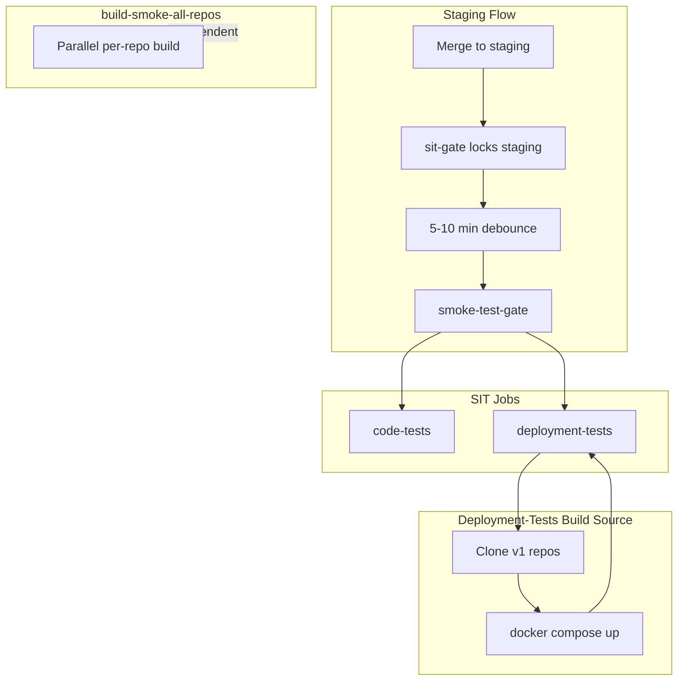

# SIT Build Source, CI Rollout, and Exception Fixes

## 1. Fix SIT Deployment-Tests Build Source

**Problem:** `docker-compose.mock.yml` uses `build.context: ../../<repo>` for market-data-service, execution-service,
trading-analytics-api. SIT checks out PM to `../unified-trading-pm` but does not clone these service repos. Compose
build fails because `../../market-data-service` etc. do not exist.

**Recommended: Option A — Clone v1 repos before docker compose up**

- Add a step in [smoke-test-gate.yml](system-integration-tests/.github/workflows/smoke-test-gate.yml) `deployment-tests`
  job, before `docker compose up`:
  - Parse `V1_REPOS` (from `needs.setup.outputs.v1_repos_json`)
  - For each repo that has a build context in
    [docker-compose.mock.yml](unified-trading-pm/docker/docker-compose.mock.yml) (market-data-service,
    execution-service, trading-analytics-api), clone it as a sibling of PM
  - Clone to `../<repo>` relative to SIT (so `../market-data-service`, `../execution-service`,
    `../trading-analytics-api`)
  - Use `actions/checkout` with `path` and `ref: staging`, or a custom step that clones via `git clone -b staging` into
    the parent directory
- Compose file path: `../unified-trading-pm/docker/docker-compose.mock.yml`; build context `../../market-data-service`
  resolves to `$GITHUB_WORKSPACE/../market-data-service` — ensure GHA workspace layout allows this. Standard approach:
  run compose from a directory where `../unified-trading-pm` and `../market-data-service` exist. SIT is at
  `$GITHUB_WORKSPACE` (default `system-integration-tests`). PM is checked out to `../unified-trading-pm`. So parent dir
  = `$GITHUB_WORKSPACE/..`. Clone services into `$GITHUB_WORKSPACE/../market-data-service` etc.
- Alternative: Checkout all repos into a shared parent. Use `actions/checkout` with
  `repository: owner/market-data-service`, `path: ../market-data-service` (path relative to workspace root may need
  `working-directory` or a different layout). GHA default workspace is the repo root; `path` in checkout is relative to
  workspace. So `path: ../market-data-service` would put it outside workspace. Prefer: create a `repos/` dir, checkout
  PM to `repos/unified-trading-pm`, services to `repos/market-data-service`, etc., then run compose from
  `repos/unified-trading-pm/docker` with context `../../market-data-service` = `repos/market-data-service`. Requires
  changing the checkout layout. Simpler: clone into parent of workspace. `working-directory: ..` and
  `run: git clone ... market-data-service`. Then from SIT,
  `docker compose -f unified-trading-pm/docker/docker-compose.mock.yml` with working-directory `..` so compose sees
  `./market-data-service`, `./execution-service`, etc. But compose file uses `../../market-data-service` — that is
  relative to the compose file's directory (`docker/`). So from `docker/`, `../../` = parent of PM = parent of
  workspace. So we need `$GITHUB_WORKSPACE/../market-data-service`. Checkout with `path: ../market-data-service` puts it
  in `$GITHUB_WORKSPACE/../market-data-service`. That should work if the workspace parent is writable. In GHA, workspace
  is typically `~/work/repo/repo`. Parent is `~/work/repo`. So `../market-data-service` =
  `~/work/repo/market-data-service`. Good.
- Implementation: Add a step "Clone v1 service repos for compose build" that loops over the 3 repos (or derives from
  compose file / V1_REPOS intersection) and runs `git clone --depth 1 -b staging https://.../$repo ../$repo` for each.

**Race-condition protection:** The debounce (5–10 min quiet) plus concurrency group `sit-staging` with
`cancel-in-progress: true` prevents testing a mixed state. A new push to staging cancels the current SIT run; only one
run proceeds. When SIT runs, it tests a stable snapshot of staging. The queue blocks new repos merging to staging during
the lock window, so cloning `staging` after debounce yields the correct staged stack.

**Option B (alternative):** Switch compose to pre-built images from Artifact Registry. Requires GCP auth in GHA, image
naming convention, and Cloud Build to have already built staging images. More moving parts; Option A is simpler for now.

---

## 2. ibkr-gateway-infra: Add Wheel and Terraform Image

**Current state:** In SKIP_REPOS. Has custom [cloudbuild.yaml](ibkr-gateway-infra/cloudbuild.yaml): lint, tests,
terraform-validate, push (no image), scan. No wheel publish, no Docker image.

**Required:**

| Artifact            | Action                                                                                                                                                                                                                        |
| ------------------- | ----------------------------------------------------------------------------------------------------------------------------------------------------------------------------------------------------------------------------- |
| **Wheel**           | Add steps to build and publish `ibkr_gateway_client` to Python Artifact Registry (`unified-libraries`), mirroring [cloudbuild-library-template.yaml](unified-trading-pm/configs/cloudbuild-library-template.yaml) wheel steps |
| **Terraform image** | Add a Dockerfile and Cloud Build steps to build and push a Terraform runner image (e.g. `FROM hashicorp/terraform:1.6`, COPY ibkr-gateway/, ENTRYPOINT terraform) to Artifact Registry                                        |

**Implementation:**

- Create `ibkr-gateway-infra/Dockerfile.terraform` (or `ibkr-gateway/Dockerfile`): base image `hashicorp/terraform:1.6`,
  copy `ibkr-gateway/` into `/workspace`, set WORKDIR. Used for `terraform plan/apply` in CI or deployment.
- Extend `ibkr-gateway-infra/cloudbuild.yaml`:
  - After auth-precheck: add wheel build step (`python -m build --wheel`) and `twine upload` to `unified-libraries`
  - Add Docker build step for Terraform image, push to
    `asia-northeast1-docker.pkg.dev/$PROJECT/unified-trading-system/ibkr-gateway-terraform:latest` (or similar)
- Remove `ibkr-gateway-infra` from SKIP_REPOS only after adding `cloudbuild-infra-template.yaml` and wiring it (see §4).
  Until then, keep custom cloudbuild but add wheel + image steps.

---

## 3. Documentation Updates

**SSOT ([docs/ci-cd-ssot.md](unified-trading-pm/docs/ci-cd-ssot.md)):**

- **§7** — Ensure it documents:
  - Where SIT gets images: build-from-source (Option A) vs AR (Option B)
  - SIT clones the `staging` branch of each service repo (not main) — we validate the staged stack
  - Race-condition protection: debounce + concurrency group `sit-staging` blocks new merges during SIT; only one run
    proceeds; cloning after debounce yields a stable snapshot
  - Difference: build-smoke-all-repos = per-repo build verification; SIT deployment-tests = integration tests against
    staged stack
  - Staging flow: merge to staging → sit-gate → debounce → smoke-test-gate → code-tests + deployment-tests →
    staging-validated → staging-to-main
  - Cloud Build: when images are built (on merge to main or qg-passed on staging)

**E2E plan
([plans/active/cicd_e2e_testing_master_2026_03_13.plan.md](unified-trading-pm/plans/active/cicd_e2e_testing_master_2026_03_13.plan.md)):**

- Add or expand section on SIT:
  - Build source: clone v1 repos (staging branch) before compose (Option A)
  - build-smoke vs SIT deployment-tests
  - Staging, debounce, Cloud Build interaction
  - Race-condition protection: debounce + sit-staging concurrency group ensures stable snapshot

---

## 4. Cloud Build and CodeBuild Template Rollout

**New templates to create:**

| Template                          | Purpose                                                            | Repos                      |
| --------------------------------- | ------------------------------------------------------------------ | -------------------------- |
| `cloudbuild-infra-template.yaml`  | Wheel + Terraform image (or generic infra: wheel + optional image) | ibkr-gateway-infra         |
| `cloudbuild-sit-template.yaml`    | Lint + smoke tests, no image push                                  | system-integration-tests   |
| `buildspec-infra-template.yaml`   | AWS parity for infra                                               | ibkr-gateway-infra         |
| `buildspec-library-template.yaml` | Wheel-only for libraries                                           | libraries (if not already) |

**Rollout script updates:**

- [rollout-cloudbuild.py](unified-trading-pm/scripts/propagation/rollout-cloudbuild.py):
  - Add `infrastructure` → `cloudbuild-infra-template.yaml` to `TYPE_TO_TEMPLATE`
  - Add `test-harness` (or SIT-specific type) → `cloudbuild-sit-template.yaml` if SIT has a distinct type; else keep SIT
    in SKIP_REPOS with custom cloudbuild
  - Remove `ibkr-gateway-infra` from SKIP_REPOS when infra template exists
  - Keep `unified-trading-pm`, `unified-trading-codex`, `unified-trading-library`, `system-integration-tests` in
    SKIP_REPOS (with rationale in §7)
- [rollout-buildspec.py](unified-trading-pm/scripts/propagation/rollout-buildspec.py):
  - Add `infrastructure` → `buildspec-infra-template.yaml`
  - Add `--include-library` to support `buildspec-library-template.yaml` for libraries (wheel-only, no Docker)
  - Remove `ibkr-gateway-infra` from SKIP_REPOS when infra template exists

**Repos that stay as exceptions:**

| Repo                     | Reason                               | Template                                 |
| ------------------------ | ------------------------------------ | ---------------------------------------- |
| unified-trading-pm       | No deployable artifact               | —                                        |
| unified-trading-codex    | Docs only                            | —                                        |
| unified-trading-library  | Wheel + base Docker (different flow) | —                                        |
| system-integration-tests | Lint + smoke, no image               | cloudbuild-sit-template (or keep custom) |

**LIBRARY_CUSTOM_CLOUDBUILD** (UAC, URDI, EAL): Keep until library template is extended with clone-pm-scripts,
quality-gates, cloud-sdk-isolation, store-metadata, notify-deployment. Document consolidation path in §7.

---

## 5. Run Rollout and Validation Scripts

After templates and script changes:

```bash
# Cloud Build (services, APIs, UIs)
python3 unified-trading-pm/scripts/propagation/rollout-cloudbuild.py [--dry-run]

# Cloud Build + wheel-only libraries
python3 unified-trading-pm/scripts/propagation/rollout-cloudbuild.py --include-library [--dry-run]

# CodeBuild (AWS)
python3 unified-trading-pm/scripts/propagation/rollout-buildspec.py [--dry-run]

# Pre-build auth check
python3 unified-trading-pm/scripts/validation/validate-build-auth.py [--gcp-only] [--check-secrets]
```

Run with `--dry-run` first, then without to apply.

---

## 6. Architecture Diagram



---

## 7. File Change Summary

| File                                                                         | Change                                                                                                    |
| ---------------------------------------------------------------------------- | --------------------------------------------------------------------------------------------------------- |
| `system-integration-tests/.github/workflows/smoke-test-gate.yml`             | Add clone step for market-data-service, execution-service, trading-analytics-api before docker compose up |
| `ibkr-gateway-infra/cloudbuild.yaml`                                         | Add wheel build/publish; add Terraform Docker image build/push                                            |
| `ibkr-gateway-infra/Dockerfile.terraform` (new)                              | Terraform runner image                                                                                    |
| `unified-trading-pm/configs/cloudbuild-infra-template.yaml` (new)            | Infra template: wheel + Terraform image                                                                   |
| `unified-trading-pm/configs/cloudbuild-sit-template.yaml` (new)              | SIT template: lint + smoke                                                                                |
| `unified-trading-pm/configs/buildspec-infra-template.yaml` (new)             | AWS infra parity                                                                                          |
| `unified-trading-pm/scripts/propagation/rollout-cloudbuild.py`               | Add infra/SIT type mapping; remove ibkr from SKIP when template ready                                     |
| `unified-trading-pm/scripts/propagation/rollout-buildspec.py`                | Add infra type; optional --include-library                                                                |
| `unified-trading-pm/docs/ci-cd-ssot.md`                                      | §7: SIT build source, build-smoke vs SIT, staging flow                                                    |
| `unified-trading-pm/plans/active/cicd_e2e_testing_master_2026_03_13.plan.md` | SIT build source, build-smoke vs SIT, staging/debounce/Cloud Build                                        |

---

## 8. Execution Order

1. Create `cloudbuild-infra-template.yaml` and `cloudbuild-sit-template.yaml`
2. Create `buildspec-infra-template.yaml`
3. Update `rollout-cloudbuild.py` and `rollout-buildspec.py`
4. Fix SIT deployment-tests (clone step)
5. Fix ibkr-gateway-infra (wheel + Terraform image)
6. Update SSOT and E2E plan
7. Run rollout scripts (dry-run, then apply)
8. Run `validate-build-auth.py`
