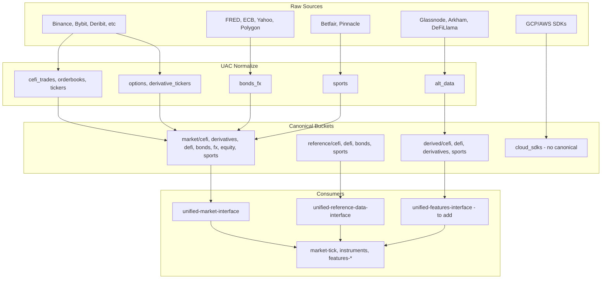

# UAC Residual Refactors — Expanded Plan

## Research Summary

Parallel agents explored: SDK/cloud schemas, options/futures/perpetuals, events/config interfaces,
market/reference/features services, UFCL vs UTL, and features interface gaps.

---

## 1. Where SDK, Options, Futures, Perpetuals Fit

### SDK (GCP/AWS normalized cloud info)

**Location:**
[unified-api-contracts/external/cloud_sdks/](unified-api-contracts/unified_api_contracts/external/cloud_sdks/) — GCP
(artifact_registry, cloud_build, gcs, pubsub, etc.) and AWS (s3, ec2, ecs, glue, lambda, etc.)

**Nature:** Infrastructure/cloud API typing, not market/reference/derived data. Used by UCI and build/deploy tooling.

**Placement:** Add a fourth bucket `canonical/infrastructure/` or keep `external/cloud_sdks/` as-is (no normalizers; raw
SDK request/response schemas). Recommendation: **do not nest under market/reference/derived** — document as separate
"infrastructure" bucket in the mapping.

### Options, futures, perpetuals

| Type           | Location                                                                                                                                                                                               | Venues                                          | Fit                                                                 |
| -------------- | ------------------------------------------------------------------------------------------------------------------------------------------------------------------------------------------------------ | ----------------------------------------------- | ------------------------------------------------------------------- |
| **Options**    | [canonical/normalize/options.py](unified-api-contracts/unified_api_contracts/canonical/normalize/options.py), [canonical/options.py](unified-api-contracts/unified_api_contracts/canonical/options.py) | Databento, Deribit, IBKR, Tardis, Yahoo         | `canonical/market/derivatives/` or `canonical/market/cefi/options/` |
| **Futures**    | [canonical/normalize/derivative_tickers.py](unified-api-contracts/unified_api_contracts/canonical/normalize/derivative_tickers.py)                                                                     | Binance, Bybit, OKX, Deribit, Aster, Tardis     | `canonical/market/cefi/derivatives/`                                |
| **Perpetuals** | Same (derivative_tickers)                                                                                                                                                                              | Binance, Bybit, OKX, Deribit, Hyperliquid, CCXT | Same                                                                |

**Recommendation:** Add `canonical/market/derivatives/` (or `cefi/derivatives/`) for options, futures, perpetuals.
`CanonicalDerivativeTicker`, `CanonicalOptionsChainEntry`, `CanonicalFundingRate`, `CanonicalLiquidation` belong here.
[schemas/derivatives.py](unified-api-contracts/unified_api_contracts/schemas/derivatives.py) (VolSurface, etc.) is
derived/analytics — `canonical/derived/derivatives/`.

---

## 2. Interfaces and Services — Refactor Scope

### Events and config (no UAC refactor)

- **unified-events-interface:** No UAC dependency. Own schemas (`LifecycleEvent`, `CoordinationEvent`).
- **unified-config-interface:** No UAC dependency. Uses UCI (storage) and UEI (log_event). Own config schemas.
- **unified-cloud-interface:** No UAC dependency. Uses UIC only.

**Conclusion:** Events and config do not need UAC refactor. They are already decoupled.

### Services that use UAC (will need import updates)

| Service                              | UAC usage                                          | Impact of canonical path changes                          |
| ------------------------------------ | -------------------------------------------------- | --------------------------------------------------------- |
| **market-tick-data-service**         | Latency/rate-limit schemas, sports odds            | Update imports when sports/derivatives paths change       |
| **market-data-processing-service**   | AlternativeDataSignal, OptionsFlowRecord, etc.     | Update if derived/cefi paths change                       |
| **instruments-service**              | Venue instrument schemas, rate limits, TeamMapping | Update when reference/cefi, reference/sports paths change |
| **unified-reference-data-interface** | Venue-specific external schemas                    | Update when external→canonical moves                      |
| **features-sports-service**          | CanonicalBookmakerMarket, CanonicalFixture, etc.   | Update when market/sports, reference/sports paths change  |
| **features-commodity-service**       | Integration test refs                              | Minimal                                                   |
| **features-onchain-service**         | Dep only; no direct imports                        | Low                                                       |

---

## 3. Unified Features Interface for External Derived Data

### Current gaps

- No single interface for feature/derived data (UMI is venue-centric).
- UMI has DefiLlamaAdapter, GlassnodeAdapter, ArkhamAdapter — but features-onchain-service calls DeFiLlama directly,
  bypassing UMI.
- `DATA_SOURCE_TO_SECRET` (UAC) has no glassnode, arkham, defillama.
- Scattered: `features-onchain-service/DATA_SOURCES_REFERENCE.py`, `features-commodity-service/DATA_SOURCE_REGISTRY`,
  UAC mappings.

### Recommendation

1. **Create `unified-features-interface`** (or extend UMI with a feature-centric facade):

- Wraps UMI alt-data adapters (DefiLlama, Glassnode, Arkham) behind a feature-centric API.
- Single entry point for external derived data.
- Uses UAC schemas and normalizers
  ([canonical/normalize/alt_data.py](unified-api-contracts/unified_api_contracts/canonical/normalize/alt_data.py)).

2. **Extend DATA_SOURCE_TO_SECRET** in UAC: add `glassnode`, `arkham`, `defillama` (None for public).
3. **Route features-onchain through UMI** (or the new interface): replace direct DeFiLlama HTTP calls with adapter.
4. **Consolidate source definitions** into provider manifest or a single SSOT.

---

## 4. UFCL vs UTL — Calculator Split and Naming

### Current overlap

- **unified-trading-library/feature_service_base:** `BaseFeatureService`, `BaseFeatureCalculator`,
  `FeatureCalculatorRegistry`, health, metrics.
- **unified-feature-calculator-library:** `FeatureCalculator`, `OnChainFeatureCalculator`, same
  `BaseFeatureCalculator`/`FeatureCalculatorRegistry`, transforms, validations.

**Overlap:** Both define `BaseFeatureCalculator` and `FeatureCalculatorRegistry`. UTL = service shell; UFCL = pure
calculator logic.

### Recommendation

1. **Single source for calculator base:** UFCL owns `BaseFeatureCalculator`, `FeatureCalculatorRegistry`. UTL
   `feature_service_base` imports from UFCL (or vice versa) — eliminate duplication.
2. **Naming:**

- **UFCL:** "Feature Calculator Library" — pure calculators, transforms, validations, TF utils.
- **UTL feature_service_base:** "Feature Service Base" — service lifecycle, health, metrics, orchestration. Uses UFCL
  for calculator registration.

3. **Orchestrator split:** Document clearly: UTL = service orchestration; UFCL = calculator implementations. Services
   extend UTL's BaseFeatureService and register UFCL calculators.

---

## 5. Plan Updates to Apply

Update
[uac_residual_refactors_provider_manifest_2026_03_14.plan.md](unified-trading-pm/plans/active/uac_residual_refactors_provider_manifest_2026_03_14.plan.md):

### 5.1 Add to Raw → Normalized Mapping

**Infrastructure (new bucket):**

| Data type      | Path                                | Raw sources                                                                 |
| -------------- | ----------------------------------- | --------------------------------------------------------------------------- |
| infrastructure | external/cloud_sdks/ (no canonical) | GCP (artifact_registry, cloud_build, gcs, pubsub), AWS (s3, ec2, ecs, etc.) |

**Derivatives (options, futures, perpetuals):**

| Type    | Path                           | Raw sources                                                                                                                     |
| ------- | ------------------------------ | ------------------------------------------------------------------------------------------------------------------------------- |
| market  | canonical/market/derivatives/  | Options: Databento, Deribit, IBKR, Tardis, Yahoo. Futures/perps: Binance, Bybit, OKX, Deribit, Hyperliquid, Aster, Tardis, CCXT |
| derived | canonical/derived/derivatives/ | VolSurface, VolSmilePoint, VolTermStructure (schemas/derivatives.py)                                                            |

### 5.2 New todos

- `nesting-derivatives-market` — Create canonical/market/derivatives/; move options, derivative_tickers, funding,
  liquidations
- `nesting-derivatives-derived` — Move VolSurface, vol analytics to canonical/derived/derivatives/
- `doc-cloud-sdks-bucket` — Document cloud_sdks as infrastructure bucket (no canonical nesting)
- `unified-features-interface` — Create or extend UMI for feature-centric external derived data; consolidate DATA_SOURCE
- `ufcl-utl-consolidation` — Single source for BaseFeatureCalculator/Registry; UTL imports from UFCL; document
  orchestrator vs calculator split

### 5.3 New section: Interfaces and Services Refactor

- **Events/config:** No UAC refactor (already decoupled).
- **Services:** Update imports when canonical paths change (market-tick-data, instruments, URDI, features-sports,
  market-data-processing).
- **Features interface:** New interface or UMI extension for external derived data.

### 5.4 Proposed canonical layout (updated)

```
canonical/
  market/
    cefi/
    derivatives/    # options, futures, perpetuals, funding, liquidations
    defi/
    bonds/
    fx/
    commodities/
    equity/
    etf/
    equity_index/
    sports/
  reference/
    cefi/
    defi/
    bonds/
    commodities/
    equity/
    sports/
  derived/
    cefi/
    defi/
    derivatives/    # vol surface, analytics
    sports/

external/
  cloud_sdks/       # infrastructure bucket — no canonical; GCP/AWS SDK schemas
```

---

## 6. Mermaid: Data Flow



---

## 7. Execution Order

1. Update plan file with new sections and todos.
2. Phase 1: Nesting (sports, defi, tradfi, derivatives) — can run in parallel.
3. Phase 2: Document cloud_sdks; add derivatives to mapping.
4. Phase 3: unified-features-interface design and DATA_SOURCE consolidation.
5. Phase 4: UFCL/UTL consolidation.
6. Phase 5: Downstream import updates (market-tick-data, instruments, URDI, features-sports).
