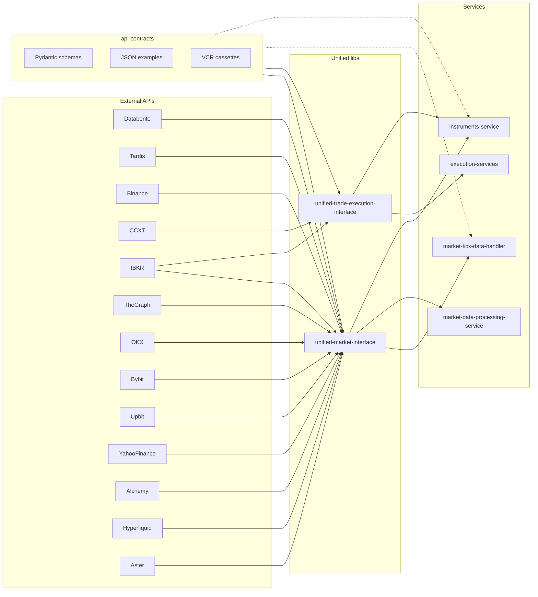

# API/SDK Contract Mocking Implementation Plan

## Detailed to-dos (tracking)

| ID                         | Todo                                                                                             | Status  |
| -------------------------- | ------------------------------------------------------------------------------------------------ | ------- |
| phase0-create-repo         | Phase 0: Create GitHub repo, permissions, clone                                                  | Pending |
| phase1-layout              | Phase 1: Directory layout, pyproject.toml, README/CONTRIBUTING                                   | Pending |
| phase2-schemas-cefi-tradfi | Phase 2a: Schemas CeFi+TradFi (Databento, Tardis, CCXT, Binance, OKX, Bybit, Upbit, Yahoo, IBKR) | Pending |
| phase2-schemas-defi        | Phase 2b: Schemas DeFi (The Graph, Alchemy, Hyperliquid, Aster; aggregators if in scope)         | Pending |
| phase3-capture-vcr         | Phase 3: Capture script, examples, VCR cassettes                                                 | Pending |
| phase4-umi-adoption        | Phase 4: UMI adoption + VCR in tests                                                             | Pending |
| phase5-uoi-adoption        | Phase 5: UOI adoption + VCR in tests                                                             | Pending |
| phase6-consumers           | Phase 6: Consumer services adoption                                                              | Pending |
| contract-vs-reality        | Contract-vs-reality verification + CI                                                            | Pending |
| docs-codex-cursor          | Codex, cursor rule api-contracts-usage.mdc, api-contracts docs                                   | Pending |

---

## Scope clarification

The plan in [04-api-sdk-mocking.md](.cursor/plans/code_optimizations_and_ci_cd_alignment/04-api-sdk-mocking.md) targets **external** API contracts. In scope: **Databento, Tardis, Binance, CCXT, The Graph, OKX, Bybit, Upbit, Yahoo Finance, Alchemy, Hyperliquid** (HTTP API + stats/S3 bucket response shapes), **Aster**, and **Interactive Brokers (IBKR)** for TradFi. Contract coverage is **comprehensive per venue**: public market data, private order feed, position feed, error/status types, WebSockets, FIX endpoints, schemas, corner cases, and nuances—for all **CeFi, DeFi, and TradFi** venues (see Contract coverage scope below). **Unified-market-interface (UMI)** uses contracts for **market feed** (and, where applicable, position-related data); **unified-trade-execution-interface (UOI)** uses contracts for **order execution and position/balance**; **position-balance-monitor-service** gets data **straight from APIs** via UOI (and UMI where needed) as part of reconciliation—api-contracts must cover the **full range of calls** it could make: **add all endpoints and schemas now** (positions, balances, margin, order history, trade history, PnL, funding payments, etc.)—more than we need today—so when evaluating options later we already have the full understanding of what's possible. Same for market and order sides: contract the complete documented surface upfront. UMI and UOI are the **primary adoption points**; position monitor and other consumers rely on typed responses and testability via contracts.

**Repos involved:**

| Repo                               | Role                                                                                                                                                                                   |
| ---------------------------------- | -------------------------------------------------------------------------------------------------------------------------------------------------------------------------------------- |
| **api-contracts** (new)            | Defines Pydantic schemas, example JSON, and VCR cassette dirs for each external API.                                                                                                   |
| **unified-market-interface**       | Uses Databento, Tardis, The Graph, Alchemy, Hyperliquid, OKX, Bybit, Upbit, Yahoo Finance, Aster (and Binance REST via adapters). Adopt schemas in clients/adapters; use VCR in tests. |
| **unified-trade-execution-interface**        | Uses CCXT (Binance, Coinbase). Adopt CCXT response schemas in adapters; use VCR in tests.                                                                                              |
| **market-tick-data-handler**       | Consumes UMI Databento client and has its own `databento_client` calling `timeseries.get_range`. Adopt Databento schemas at response parsing; add VCR for integration/unit tests.      |
| **market-data-processing-service** | Consumes UMI. Optional: use api-contracts schemas in tests if they hit raw API shapes.                                                                                                 |
| **instruments-service**            | Uses UMI (market adapters), CCXT (e.g. `utils/ccxt_service.py`), and DeFi/The Graph via UMI. Adopt schemas where it touches raw API/CCXT/Graph responses.                              |
| **execution-services**             | Uses UOI and UMI. Adopt in tests (VCR) or thin wrappers if they parse raw responses.                                                                                                   |
| **strategy-service**               | No UMI/UOI in `pyproject.toml` today; include only if/when it adds exchange/market data dependencies.                                                                                  |

---

## Architecture

- **api-contracts**: Single workspace-wide artifact; **create as actual GitHub repo** (see Phase 0). Contains per-API: `schemas/` (Pydantic), `examples/` (captured JSON), `mocks/` (VCR cassettes). Coverage is comprehensive per venue (market data, order/position feeds, errors, WebSockets, FIX, corner cases).
- **UMI / UOI**: Validate or parse raw responses through api-contracts schemas; return existing canonical types (e.g. UMI’s `CanonicalTrade`, UOI’s `CanonicalOrder`) so callers stay unchanged.
- **Services**: Prefer using UMI/UOI only; add direct use of api-contracts only where they handle raw API/CCXT/Graph payloads (e.g. market-tick-data-handler Databento path, instruments-service CCXT/DeFi).

---

## Contract coverage scope (per venue)

**Principle: add everything now.** For each venue, add **more endpoints and schemas than we currently use**—the full documented surface—so we have a complete picture of what's possible and don't add contracts in phases later.

For **every** CeFi, DeFi, and TradFi venue, api-contracts must document and schema **everything the exchange offers** in relation to:

- **Public market data**: tickers, order book, trades, OHLCV, funding rates, open interest (where applicable), symbology/metadata.
- **Private order feed**: order submission responses, order status, order types (market, limit, stop, trailing, etc.), cancel/replace, batch orders if supported.
- **Position feed**: positions, margin/balance, PnL, liquidation state (where applicable).
- **Error and status types**: HTTP/API error codes, order status enums (new, partial, filled, cancelled, rejected, expired, etc.), exchange-specific error messages and payloads.
- **WebSocket connections**: connection lifecycle, subscription payloads, message schemas for public (trades, book, ticker) and private (orders, positions, fills) streams.
- **FIX endpoints**: where the venue supports FIX, document FIX session parameters, message types, and response/callback schemas.
- **Schemas**: request/response Pydantic models for all of the above; optional OpenAPI/GraphQL snippets where the provider publishes them.
- **Corner cases and nuances**: rate limits, pagination, symbol formats, timezone/epoch conventions, optional vs required fields, deprecations, venue-specific quirks (e.g. Binance futures vs spot differences).

**Add everything now:** Define **more endpoints and schemas than we currently use**—the full documented surface per venue—so we have a complete picture of what's possible and LLMs/features can code against a single source of truth without adding contracts later.

---

## TradFi: Interactive Brokers (IBKR)

**TradFi execution and market data** use **Interactive Brokers** as the primary broker (per codex: [order-interface.md](unified-trading-codex/05-infrastructure/unified-libraries/order-interface.md), [market-interface.md](unified-trading-codex/05-infrastructure/unified-libraries/market-interface.md)). IBKR must be **in api-contracts** for both **market feed** (UMI) and **order/position feed** (UOI).

- **API**: TWS API (IB Gateway); Python wrapper: `ib_insync`. Single connection per account; IP whitelisting required.
- **api-contracts/ibkr/**: Schemas for the **full** TWS API (or ib_insync) surface: market data (bars, ticker, order book), order submission/status/cancel, **order history**, positions, account summary, balances, margin, **PnL**, **corporate actions**, error and status types, WebSocket/callback payloads. Add all of these **now** (not in phases)—so position monitor and execution have contracted shapes for every call they might ever need.
- **UMI**: IBKRAdapter (market data) uses api-contracts for raw TWS/ib_insync responses.
- **UOI**: IBKROrderAdapter (order execution, positions, balances) uses api-contracts for raw responses.
- **Position monitor**: When venue=IBKR, reconciliation calls UOI (and possibly UMI). Contract **all** response shapes **now**: `get_positions`, `get_balances`, `get_margin_info`, order history, trade history, PnL, and any other reconciliation-relevant endpoints the venue exposes.

---

## DeFi: Order execution and options

**DeFi order execution** is not the same as CeFi: there is no single "exchange API"; execution may be **per-venue** (direct contract or subgraph) or via **aggregator APIs**. api-contracts should support **both** market and order (and position) per DeFi venue, and execution **options** should be explicit.

**Options for DeFi order execution (research: Context7 + web):**

1. **Direct per-venue (Uniswap, Hyperliquid, Aster, etc.)**
  - **Market**: Already in scope (The Graph, Alchemy, venue HTTP).
  - **Order/swap**: Quote (e.g. price/route) then submit transaction (sign + broadcast). Contracts: quote response, submit request/response, tx status. Differs by venue (Uniswap V2/V3 swap vs Hyperliquid order vs Aster).
  - **Position**: Wallet balances, LP positions, lending positions (Aave, etc.) for reconciliation (see [position-reconciliation.md](unified-trading-codex/08-workflows/position-reconciliation.md) DeFi section).
2. **DEX aggregator APIs (use when we want best execution across venues)**
  - **1inch**: Aggregation Protocol; quote + swap; multi-chain; [1inch aggregation](https://landing-1inch-staging.1inch.io/aggregation-protocol/).
  - **0x API**: Swap API; high volume.
  - **ParaSwap**: Quote to approval to execution; route splitting.
  - **CoW Protocol**: Meta-aggregator; batch auctions; [CoW Protocol](https://docs.cow.fi/cow-protocol).
  - **LI.FI**: Cross-chain aggregation.
  - api-contracts: If we use aggregators, add **api-contracts/1inch/**, **api-contracts/0x/**, **api-contracts/paraswap/**, **api-contracts/cow/** (or similar) for quote/order/response and error shapes. Execution path may differ by chain and asset (route to one or more aggregators or direct).
3. **Smart order routing**
  - Route orders to best venue/aggregator; may combine direct + aggregator. Contracts then cover each destination's market + order (and position where applicable).

**Plan stance:** Define api-contracts for **per-DeFi-venue** market + order + position (Uniswap, Hyperliquid, Aster, Aave, etc.) so UMI/UOI can type responses. **Add aggregator API contracts** (1inch, 0x, ParaSwap, CoW) now in we introduce or evaluate those execution paths. Document "DeFi order execution options" in the api-contracts repo (e.g. README or `docs/DEFI_EXECUTION_OPTIONS.md`) and in codex so implementers know which contracts apply to which execution path.

---

## Position monitor and API contract range (add everything now)

The **position-balance-monitor-service** performs **reconciliation** (see codex [08-workflows/position-reconciliation.md](unified-trading-codex/08-workflows/position-reconciliation.md)): it compares internal position state with **exchange-reported** state. It gets exchange data **via unified-trade-execution-interface** (and optionally unified-market-interface) — see [account_query_client.py](position-balance-monitor-service/position_balance_monitor_service/core/account_query_client.py): `get_exchange_positions(venue, instrument)`, `get_exchange_balances(venue)`, `get_margin_info(venue)`. Those call UOI's `get_account_client(venue).get_positions()`, `get_balances()`, `get_margin_info()`.

- **Connectivity**: Position monitor **depends on API connectivity** to each venue (through UOI/UMI). api-contracts must cover **every call** the position monitor or reconciliation could ever use: positions, balances, margin, **order history**, **trade history**, **PnL**, **funding payments**, and any other endpoint the venue exposes for reconciliation. Add all of these **in the initial contract set**—more than we need today—so we already have the full understanding of what's possible. Same for **market feed** (UMI) and **order feed** (UOI): contract the **complete** documented surface upfront.
- **Use in plan**: When defining api-contracts for any venue (CeFi, DeFi, TradFi), **include every endpoint and schema we can document** (market, order, position, balance, margin, order history, balance history, PnL, funding, etc.). Prefer more than we need now so that when we look at options later, the contracts already describe what's possible.

---

## Parallel agent execution (split across at least 4 agents)

This work is **large**; split implementation across **at least four agents** so that independent streams run in parallel (per [.cursor/rules/parallel-agent-execution.mdc](.cursor/rules/parallel-agent-execution.mdc)). Suggested split:

| Agent       | Scope                                                               | Deliverables                                                                                                                                                                                                                                                                                                                                       |
| ----------- | ------------------------------------------------------------------- | -------------------------------------------------------------------------------------------------------------------------------------------------------------------------------------------------------------------------------------------------------------------------------------------------------------------------------------------------- |
| **Agent 1** | api-contracts repo (Phase 0 + Phase 1), **CeFi + TradFi contracts** | Create GitHub repo, permissions, layout. Schemas + examples + mocks for **CCXT**, **Binance**, **OKX**, **Bybit**, **Upbit**, **IBKR** (TWS/ib_insync), **Databento**, **Tardis**, **Yahoo Finance**. Focus: market data, order, position, balance, margin, errors, WebSocket where applicable.                                                    |
| **Agent 2** | **DeFi + aggregator contracts**                                     | Schemas + examples + mocks for **The Graph**, **Alchemy**, **Hyperliquid**, **Aster**, and (when in scope) **1inch**, **0x**, **ParaSwap**, **CoW**. Per-venue market + order/swap + position. Document DeFi execution options in api-contracts repo.                                                                                              |
| **Agent 3** | **UMI + UOI adoption**, **position-balance-monitor**                | Adopt api-contracts in unified-market-interface (clients + adapters for all venues in scope) and unified-trade-execution-interface (CCXT adapters, IBKR adapter). Ensure position-balance-monitor's use of UOI (get_positions, get_balances, get_margin_info, and all other contracted endpoints) is covered; add VCR in UMI/UOI and position-monitor tests. |
| **Agent 4** | **Consumer services**, **contract-vs-reality**, **docs/codex**      | market-tick-data-handler, market-data-processing-service, instruments-service, execution-services: adopt schemas/VCR where they touch raw APIs. Contract-vs-reality verification (tests/script + CI). Update codex (API contracts section), cursor rules (api-contracts-usage.mdc), api-contracts README/CONTRIBUTING/per-venue index.             |

Agents 1 and 2 can run in parallel (different contract sets). Agent 3 can start once Phase 1 layout and at least one venue's contracts exist; Agent 4 can run in parallel with Agent 3 for services that do not depend on Agent 3's UMI/UOI changes. Use task docs in `.cursor/plans/tasks/` and the Task tool with `subagent_type: generalPurpose` (or `explore` for discovery); save agent IDs for resume.

---

## Context7 usage (all the way)

**Requirement:** Use **Context7** for every step of this implementation. Per [.cursorrules](.cursorrules), when working with external libraries or APIs, append **"use context7"** to prompts and use the Context7 plugin (documentation lookup) for up-to-date API references, schemas, and best practices.

**Where to use Context7:**

- **External API documentation**: Before defining schemas or writing capture scripts for any venue, look up official docs via Context7: Databento, Tardis, Binance, CCXT, The Graph, OKX, Bybit, Upbit, Yahoo Finance, Alchemy, Hyperliquid, Aster. Use Context7 for REST endpoints, response JSON shapes, error codes, WebSocket message formats, and FIX specs where published.
- **Libraries and SDKs**: Pydantic (v2) for schema design and validation; VCR.py for cassette format and match options; aiohttp/httpx for capture scripts; any exchange-specific SDK (e.g. python-binance, ccxt) for method signatures and return types. Example prompts: "Define Pydantic models for API response validation use context7", "Record HTTP requests for replay in tests use context7 vcrpy".
- **Schema design**: When adding a new venue or endpoint type (market data, order feed, position feed, WebSocket, FIX), pull the provider’s current request/response docs via Context7 and align field names, types, and enums (order status, error codes) with the official spec.
- **Capture scripts**: When implementing `capture_api_responses.py` or per-API capture logic, use Context7 for the correct API client usage, pagination, and rate limits so examples match real behavior.
- **Contract-vs-reality tests**: When writing or updating `verify_contracts_vs_reality.py`, use Context7 for the live API client (e.g. Databento Historical, CCXT fetch_*) so the minimal live request is valid and responses validate against the current schema.
- **Adoption in UMI/UOI**: When adopting api-contracts in unified-market-interface or unified-trade-execution-interface, use Context7 for the underlying library (e.g. CCXT, databento, exchange WebSocket clients) so parsing and validation match the latest API behavior.

**Consistent prompt pattern:** For any task touching an external API, SDK, or library, include **"use context7"** (and the library or API name when helpful). Examples: "Add Upbit order status enums to api-contracts use context7 Upbit API", "Record Binance WebSocket message schema use context7 Binance".

**API info discovery fallback (when Context7 is insufficient):**

If API or schema information cannot be found via Context7, use this order:

1. **Context7 first** — Use the Context7 plugin (documentation lookup) for the provider’s API/SDK. Query by provider name and topic (e.g. "Databento Historical API response schema", "Tardis HTTP API reference", "The Graph GraphQL querying").
2. **Web browse** — If Context7 does not return enough detail, browse the provider’s official documentation site. **Browse the rest of the site**, not only quick-start or landing pages. Example entry points (then follow links to API reference, schemas, error codes, WebSocket docs, etc.):
  - **The Graph**: [https://thegraph.com/docs/en/subgraphs/quick-start/](https://thegraph.com/docs/en/subgraphs/quick-start/) — then browse Subgraphs, Querying, GraphQL schema, and network-specific docs.
  - **Tardis**: [https://docs.tardis.dev/](https://docs.tardis.dev/) — then API (Getting Started, Python/Node clients, HTTP API Reference), Downloadable CSV, Historical Data Details.
  - **Databento**: [https://databento.com/docs](https://databento.com/docs) — then full docs (Historical API, schemas, symbology, batch jobs, etc.).
  - For other venues (Binance, CCXT, OKX, Bybit, Upbit, Yahoo Finance, Alchemy, Hyperliquid, Aster), use the same pattern: find the official docs root and browse API reference, response shapes, errors, and WebSocket/FIX sections.
3. **Real API call trials** — If documentation still does not provide enough (e.g. response shape, optional fields, error payloads), run **trials with real API calls**: minimal authenticated or public requests, capture the raw response (JSON/CSV), and infer or refine Pydantic schemas from the actual response. Use these runs to (a) add or update `api-contracts/<api>/examples/` and (b) drive contract-vs-reality tests. Document in the api-contracts repo which fields were discovered via trials (e.g. in a per-venue README or schema docstring) so future maintainers know the source.

Result: schemas stay accurate even when docs are incomplete or outdated; discovery is repeatable (Context7 → web → trials).

---

## Cursor rules and standards to apply

During implementation, follow these workspace rules (and update them or codex if the api-contracts repo introduces new patterns):

- **[.cursorrules](.cursorrules)** (workspace root): Configuration (UnifiedCloudConfig, no `os.getenv`), UV only, event logging (unified-events-interface), no empty fallbacks, quality gates, quickmerge, parallel agents where applicable.
- **[.cursor/rules/no-type-any-use-specific.mdc](.cursor/rules/no-type-any-use-specific.mdc)** / **strict-type-checking.mdc**: All api-contracts schemas and consumer code must use specific types (Pydantic, TypedDict); no `Any` for API response shapes.
- **[.cursor/rules/path-dependency-ci.mdc](.cursor/rules/path-dependency-ci.mdc)**: If api-contracts is a path dependency, use `../api-contracts` and clone to `../api-contracts` in CI; document in quality-gates.yml.
- **[.cursor/rules/uv-package-manager.mdc](.cursor/rules/uv-package-manager.mdc)** / **uv-lock-file.mdc**: Use `uv pip install` and commit `uv.lock` when deps change.
- **[.cursor/rules/git-workflow.mdc](.cursor/rules/git-workflow.mdc)**: Use quickmerge for api-contracts repo; never `git push origin main`; run quality gates before merge.
- **[.cursor/rules/event-logging.mdc](.cursor/rules/event-logging.mdc)**: If api-contracts ships any runnable service or script that logs lifecycle events, use `setup_events` / `log_event` from unified-events-interface.
- **[.cursor/rules/no-empty-fallbacks.mdc](.cursor/rules/no-empty-fallbacks.mdc)**: No `.get("key", "")` or empty dict/list fallbacks for required config in scripts or configs.
- **[.cursor/rules/codex-maintenance.mdc](.cursor/rules/codex-maintenance.mdc)**: When establishing api-contracts as a new pattern, update codex and cursor rules to reference it.
- **[.cursor/rules/test-quality-standards.mdc](.cursor/rules/test-quality-standards.mdc)**: No duplicate test files; expand existing tests; use conftest fixtures; mock external APIs in unit tests; use VCR for realistic responses.
- **[.cursor/rules/runtime-verification-required.mdc](.cursor/rules/runtime-verification-required.mdc)**: After changes, run the code (e.g. schema validation, contract-vs-reality script) and verify output; do not claim “done” without runtime check.
- **Quality gates**: api-contracts repo should have `scripts/quality-gates.sh`, ruff 0.15.0, basedpyright, pytest; same three-stage consistency (local, GitHub Actions, Cloud Build) if it is built in CI.

---

## Documentation, codex, and cursor rules updates

- **Codex (unified-trading-codex)**: Add a section (e.g. under `02-data/` or `06-coding-standards/`) describing the api-contracts repo: purpose, layout, how services consume it, contract-vs-reality verification, and that contracts cover full venue surface (market data, order/position feeds, errors, WebSockets, FIX, corner cases). Reference from dependency-management or a new “API contracts” doc.
- **Cursor rules**: Add a new rule (e.g. `.cursor/rules/api-contracts-usage.mdc`) that: (1) external API response parsing should use api-contracts Pydantic schemas where available; (2) tests should use VCR cassettes from api-contracts when testing code that calls those APIs; (3) new venues or new endpoint types (WebSocket, FIX) should get contracts in api-contracts before or with adapter implementation; (4) **use Context7** when defining or updating api-contracts schemas, capture scripts, or adoption code—append "use context7" to prompts and use the Context7 plugin for provider API/SDK docs. Optionally reference from strict-type-checking (avoid `Any` for API responses by using contracts).
- **API contracts repo documentation**: In the api-contracts GitHub repo, provide: README (purpose, structure, how to add a venue, how to run contract-vs-reality), CONTRIBUTING (how to capture examples, add schemas, record VCR), and per-venue README or INDEX that lists what is covered (market data, order feed, position feed, errors, WebSocket, FIX, corner cases). Document permissions (CosmicTrader, datadodo) in README or a COLLABORATORS/PERMISSIONS file if desired.

---

## GitHub repo creation and permissions

- **Create the repo**: Create a **new GitHub repository** for api-contracts (e.g. `IggyIkenna/api-contracts` or org-level `unified-trading-api-contracts`). Prefer the same org/owner as the rest of the unified-trading repos. Initialize with README, .gitignore (Python, .env, credentials), and optionally a minimal pyproject.toml and directory layout from Phase 1.
- **Permissions**: Grant appropriate access to GitHub usernames **CosmicTrader** and **datadodo** (e.g. Write/Maintain or Admin, depending on org policy). Document in the api-contracts README or in a PERMISSIONS/COLLABORATORS section that these users have access for maintaining contracts and running contract-vs-reality checks.
- **CI**: Add quality-gates workflow (and optionally contract-vs-reality on schedule) once the repo exists; path-dependency consumers (UMI, UOI, etc.) will clone this repo via `../api-contracts` in CI per path-dependency-ci.mdc.

---

## Implementation phases

### Phase 0: Create GitHub repo and set permissions

- **Create repo**: Create GitHub repository for api-contracts (same org/owner as other unified-trading repos). Initialize with README, .gitignore (Python, .env, credentials), and optionally minimal structure. For README/CONTRIBUTING structure and best practices, **use context7** (e.g. open-source repo docs, Python packaging).
- **Permissions**: Grant **CosmicTrader** and **datadodo** Write/Maintain (or Admin per org policy). Document in api-contracts README or PERMISSIONS/COLLABORATORS.
- **Clone locally**: Clone into workspace so it lives alongside unified-market-interface, unified-trade-execution-interface, etc. (e.g. `../api-contracts` from a service repo).

### Phase 1: Create api-contracts artifact

- **Location**: **Actual GitHub repo** (created in Phase 0), cloned at workspace root or as sibling to other repos. Structure lives in that repo; consumers use path dependency `../api-contracts` per path-dependency-ci.mdc.
- **Layout** (per plan):
  - `api-contracts/databento/` — `schemas.py`, `examples/`, `mocks/`
  - `api-contracts/tardis/` — same
  - `api-contracts/binance/` — same (REST if used; CCXT is under ccxt/)
  - `api-contracts/ccxt/` — schemas for `fetch_markets`, `fetch_ticker`, `fetch_order_book`, `fetch_order`, `fetch_my_trades`, `fetch_balance`, `fetch_positions`
  - `api-contracts/thegraph/` — GraphQL response shapes for subgraphs used by UMI (Uniswap V2/V3, Aave, etc.)
  - `api-contracts/okx/` — OKX adapter response shapes (UMI)
  - `api-contracts/bybit/` — Bybit adapter response shapes (UMI)
  - `api-contracts/yahoo_finance/` — Yahoo Finance adapter response shapes (UMI)
  - `api-contracts/alchemy/` — Alchemy RPC/API response shapes (UMI Uniswap/Defi fallback)
  - `api-contracts/hyperliquid/` — Hyperliquid HTTP API + stats/S3 bucket response shapes (UMI; S3 used in market-tick-data-handler)
  - `api-contracts/aster/` — Aster on-chain perps adapter response shapes (UMI)
  - `api-contracts/upbit/` — Upbit exchange (CeFi) response shapes; same comprehensive coverage as other venues
  - `api-contracts/ibkr/` — TWS/ib_insync (TradFi): market data, order, position, balance, margin, errors; UMI + UOI + position monitor
- **Package or not**: If directory-only, consumers import via `sys.path` or a shared workspace path. If installable, add `pyproject.toml` and depend on it from UMI/UOI (and list in path-dependency CI where needed). Plan doc uses `from api_contracts.databento.schemas import ...` — so either make `api-contracts` a package with that name or use a flat layout and `from api_contracts.databento import schemas` with schemas inside.
- **Dependencies**: Only Pydantic (and optionally `vcrpy` in dev). No databento/tardis/ccxt at install time so contracts stay lightweight. When choosing versions or patterns, **use context7** (Pydantic v2, vcrpy).

Deliverables: README (and CONTRIBUTING, per-venue index), directory structure, one schema file per API (can start with Databento + CCXT as highest value). Include contract-vs-reality verification (tests/script + CI option). Document repo in codex and add cursor rule `api-contracts-usage.mdc` (or equivalent); update codex with API contracts section. **Use context7** for any doc or tooling decisions (e.g. CONTRIBUTING workflow).

---

### Phase 2: Define schemas (by API)

For **each** venue, add the **full surface** in this phase (see Contract coverage scope): public market data, private order feed, position feed, order history, trade history, PnL, funding, error/status types, WebSocket message schemas, FIX if supported, and corner cases. Do not defer endpoints to a later phase—add everything we can document now. **Use context7 all the way**: before defining or changing any schema, look up the official API/SDK docs (Databento, Tardis, Binance, CCXT, The Graph, OKX, Bybit, Upbit, Yahoo, Alchemy, Hyperliquid, Aster) for current request/response shapes, error enums, and WebSocket/FIX message formats. If Context7 does not have the info, use **web browse** (e.g. [The Graph docs](https://thegraph.com/docs/en/subgraphs/quick-start/), [Tardis docs](https://docs.tardis.dev/), [Databento docs](https://databento.com/docs)—browse the rest of each site for API reference and schemas). If still missing, **run trials with real API calls** and infer/refine schemas from captured responses. Below is the per-API starting set; expand to cover all of the above.

- **Databento** (plan already has examples): `DatabentoSymbol`, `DatabentoTrade`, `DatabentoHistoricalResponse` (or equivalent for `timeseries.get_range`). Add metadata/symbology. (TradFi.)
- **Tardis**: Response models for endpoints used by [tardis_base_client.py](unified-market-interface/unified_market_interface/clients/tardis_base_client.py) and [tardis_adapter.py](unified-market-interface/unified_market_interface/adapters/tradfi/tardis_adapter.py) (exchanges list, instrument list, trades/order book CSV or JSON). Expand to errors, WebSocket if documented. (CeFi/TradFi.)
- **CCXT**: TypedDict or Pydantic for `fetch_order`, `fetch_my_trades`, `fetch_balance`, `fetch_positions`, `fetch_markets`, and CCXT error/status shapes. Shared `ccxt/schemas.py` for all CCXT-based exchanges (Binance, Coinbase, OKX, Bybit, Upbit, etc.). Include order types and exchange-specific response variants where they differ. (CeFi.)
- **Binance REST**: If UMI/UOI call Binance HTTP directly; otherwise covered by CCXT. Include market data, order/position endpoints, error codes, WebSocket payloads. (CeFi.)
- **The Graph**: Pydantic models for subgraph query responses (pools, swaps, reserves, etc.) used by Uniswap V2/V3, Aave adapters. Include error and edge-case shapes. (DeFi.)
- **OKX / Bybit / Upbit**: Response models for UMI adapters (markets, tickers, order book, trades). Expand to order feed, position feed, error/status types, WebSocket schemas, FIX if offered. (CeFi.)
- **Yahoo Finance**: Response models for [yahoo_finance_adapter.py](unified-market-interface/unified_market_interface/adapters/tradfi/yahoo_finance_adapter.py). Add error and edge-case shapes. (TradFi.)
- **Alchemy**: RPC/API response shapes for [alchemy_base_client.py](unified-market-interface/unified_market_interface/clients/alchemy_base_client.py). (DeFi/RPC.)
- **Hyperliquid**: HTTP API + stats/S3 response shapes; order/position/error/WebSocket if documented. (CeFi/on-chain perps.)
- **Aster**: Response shapes for [aster_adapter.py](unified-market-interface/unified_market_interface/adapters/onchain_perps/aster_adapter.py). Full surface: market data, order/position, errors, WebSocket. (DeFi/on-chain perps.)
- **IBKR (TWS/ib_insync)**: Full surface: market data (bars, ticker, order book), order submit/status/cancel, order history, positions, account summary, balances, margin, PnL, corporate actions, errors, WebSocket/callback payloads. All in initial schema set. (TradFi.)

Use **Context7** for Pydantic v2 (validation, model_config, Field), VCR.py (cassette format, match_on, filter_headers), and each provider’s API docs when defining schemas and test patterns. For every new venue or endpoint type, run a Context7 lookup first (e.g. "Binance REST API order response schema use context7", "CCXT fetch_balance response structure use context7").

---

### Phase 3: Capture example responses and VCR

- **Script**: Add `api-contracts/scripts/capture_api_responses.py` (or per-API scripts) to call live APIs with small queries and write JSON to `api-contracts/<api>/examples/`. Cover all APIs: Databento, Tardis, Binance/CCXT, The Graph, OKX, Bybit, **Upbit**, Yahoo Finance, Alchemy, Hyperliquid (HTTP and, if applicable, S3/bucket sample), Aster, **IBKR** (TWS/ib_insync; market + order + position examples). Capture examples for market data, order/position responses, and error payloads where feasible. **Use context7** for each API’s client/SDK; if docs are insufficient, **web browse** the provider’s full docs site, then if needed **run trials with real API calls** and save responses as examples (see API info discovery fallback above).
- **VCR**: Install `vcrpy` in repos that will use cassettes (UMI, UOI, market-tick-data-handler). **Use context7** for VCR.py (record_mode, match_on, filter_headers, cassette_library_dir). Record once (e.g. `record_mode='once'`), store cassettes under `api-contracts/<api>/mocks/` for each API (including Upbit). Filter headers (e.g. `authorization`, `x-api-key`) so no secrets are stored. Point `cassette_library_dir` to the shared api-contracts mocks path.

---

### Phase 4: Adopt schemas in unified-market-interface

- **Clients**: In [databento_base_client.py](unified-market-interface/unified_market_interface/clients/databento_base_client.py), [tardis_base_client.py](unified-market-interface/unified_market_interface/clients/tardis_base_client.py), [thegraph_base_client.py](unified-market-interface/unified_market_interface/clients/thegraph_base_client.py), [alchemy_base_client.py](unified-market-interface/unified_market_interface/clients/alchemy_base_client.py), [hyperliquid_base_client.py](unified-market-interface/unified_market_interface/clients/hyperliquid_base_client.py): where raw responses are returned or parsed, validate/parse with api-contracts schemas and return typed structures (or keep returning internal types but construct them from validated schemas). **Use context7** for each client’s underlying library (databento, tardis, thegraph, alchemy, hyperliquid) when mapping responses to contract types.
- **Adapters**: In [databento_adapter.py](unified-market-interface/unified_market_interface/adapters/tradfi/databento_adapter.py), [tardis_adapter.py](unified-market-interface/unified_market_interface/adapters/tradfi/tardis_adapter.py), [yahoo_finance_adapter.py](unified-market-interface/unified_market_interface/adapters/tradfi/yahoo_finance_adapter.py), [okx.py](unified-market-interface/unified_market_interface/adapters/okx.py), [bybit.py](unified-market-interface/unified_market_interface/adapters/bybit.py), any Upbit adapter, [aster_adapter.py](unified-market-interface/unified_market_interface/adapters/onchain_perps/aster_adapter.py), [hyperliquid_adapter.py](unified-market-interface/unified_market_interface/adapters/onchain_perps/hyperliquid_adapter.py), and Defi adapters that use The Graph/Alchemy: use contract schemas for raw response parsing, then map to existing canonical/output types. No change to public adapter API (still return list of instruments, etc.). **Use context7** for exchange/API specifics when adding or changing parsing logic.
- **Tests**: Add or refactor tests to use VCR cassettes from `api-contracts/*/mocks/` so unit/integration tests do not call live APIs. Keep existing mocks where they are sufficient; introduce VCR where tests currently depend on live or heavy mocking. **Use context7** for pytest and vcrpy usage (fixtures, cassette paths, match options).

---

### Phase 5: Adopt schemas in unified-trade-execution-interface

- **Adapters**: In [binance_ccxt.py](unified-trade-execution-interface/unified_trade_execution_interface/adapters/binance_ccxt.py) and [coinbase_ccxt.py](unified-trade-execution-interface/unified_trade_execution_interface/adapters/coinbase_ccxt.py): type CCXT responses using api-contracts CCXT schemas (e.g. validate or cast `fetch_order`, `fetch_my_trades`, `fetch_balance`, `fetch_positions` results) before mapping to `CanonicalOrder`, `CanonicalFill`, `AccountState`, etc. Aligns with `.cursor/rules/no-type-any-use-specific.mdc` and reduces `CcxtDict`/Any usage. **Use context7** for CCXT API (method signatures, response shapes, error handling) when implementing or updating this mapping.
- **Tests**: Use VCR cassettes for any test that currently hits CCXT or mocks; store cassettes in `api-contracts/ccxt/mocks/`. **Use context7** for vcrpy and pytest when wiring cassettes.

---

### Phase 6: Adopt in consumer services

- **market-tick-data-handler**: In [databento_client.py](market-tick-data-handler/market_data_tick_handler/engine/venues/databento/databento_client.py), after `timeseries.get_range` (or equivalent), parse/validate with api-contracts Databento schemas where the response is first handled. Tests: add VCR for Databento (and Tardis if applicable) in unit/integration tests that currently patch the client. **Use context7** for Databento SDK and VCR when implementing.
- **instruments-service**: Where it uses CCXT ([ccxt_service.py](instruments-service/instruments_service/utils/ccxt_service.py)) or composes UMI DeFi adapters, use api-contracts schemas for any raw response handling; add VCR in tests that hit CCXT or The Graph. **Use context7** for CCXT and The Graph when touching response parsing.
- **market-data-processing-service** / **execution-services**: Prefer using only UMI/UOI; add schema usage or VCR only if they have code paths that parse raw Databento/Tardis/CCXT/Graph responses. When adding, **use context7** for the relevant API/client.

---

## Dependency and CI

- **Path dependency**: If api-contracts becomes an installable package and is added to UMI/UOI (or others) as a path dependency, follow [path-dependency-ci.mdc](.cursor/rules/path-dependency-ci.mdc): use `../api-contracts` in `pyproject.toml` and in CI checkout so `uv pip install -e ".[dev]"` sees the same layout.
- **Ruff/pyright**: api-contracts should follow workspace Python 3.13, ruff 0.15.0, and type-checking rules so it fits quality gates if it becomes a repo.

---

## Verification (from plan)

- Schema validation test: load `api-contracts/*/examples/*.json` and validate with the corresponding Pydantic models.
- VCR replay test: run tests that use cassettes with network disabled (or mocked) and assert responses are used.
- IDE type safety: in a file that uses `from api_contracts.databento.schemas import DatabentoTrade`, confirm autocomplete and type checking for `.price`, `.side`, `.timestamp`, etc.

---

## Contract-vs-reality verification

**Requirement:** Test API contracts against real API responses so schemas stay correct as providers change.

- **What:** For each external API (Databento, Tardis, Binance, CCXT, The Graph, OKX, Bybit, Upbit, Yahoo Finance, Alchemy, Hyperliquid, Aster), periodically (or in CI) perform a small live request, parse the response with the api-contracts Pydantic model, and assert validation succeeds. Any validation error indicates the schema is out of date or the API changed.
- **Where:** Add a test suite (e.g. `api-contracts/tests/test_contracts_vs_reality.py`) or a script (e.g. `api-contracts/scripts/verify_contracts_vs_reality.py`) that:
  - Uses real credentials (from env or Secret Manager) when run in a dedicated “contract check” job; or
  - Uses the same captured example JSON used for VCR, plus a separate optional path that hits live APIs when `LIVE_API_VERIFICATION=1` (or similar) is set.
- **Context7:** When implementing the live-request path for each API, **use context7** for that provider’s client/SDK (e.g. Databento Historical, CCXT, Tardis client) so the minimal request is valid and the response shape matches what the schema expects. Use Context7 again when fixing failures (updated API docs, new fields, changed enums).
- **CI integration:** Run “validate examples only” (no live calls) in normal CI. Optionally run live verification on a schedule (e.g. nightly or weekly) or as a manual gate before releases, so contracts are tested against reality without blocking every PR.
- **Outcome:** Schemas that pass validation against real responses are trusted for typing and mocks; failures require updating the Pydantic models and re-capturing examples/cassettes.

---

## Summary of repos

| Repo                                 | Action                                                                                                                                                                                                                                                                                                                                                                                                                                                                                                        |
| ------------------------------------ | ------------------------------------------------------------------------------------------------------------------------------------------------------------------------------------------------------------------------------------------------------------------------------------------------------------------------------------------------------------------------------------------------------------------------------------------------------------------------------------------------------------- |
| **api-contracts** (new, GitHub repo) | Create **GitHub repo**; grant CosmicTrader and datadodo permissions. Add structure, Pydantic schemas (full surface: market data, order/position feeds, errors, WebSocket, FIX, corner cases), examples, VCR mocks for Databento, Tardis, CCXT, The Graph, OKX, Bybit, **Upbit**, Yahoo Finance, Alchemy, Hyperliquid (HTTP + S3/bucket), Aster (and Binance REST if needed). Add contract-vs-reality verification. Document in codex and cursor rules; document repo (README, CONTRIBUTING, per-venue index). |
| **unified-market-interface**         | Use api-contracts in clients and adapters for all above APIs; add VCR in tests.                                                                                                                                                                                                                                                                                                                                                                                                                               |
| **unified-trade-execution-interface**          | Use api-contracts CCXT schemas in Binance/Coinbase CCXT adapters; add VCR in tests.                                                                                                                                                                                                                                                                                                                                                                                                                           |
| **market-tick-data-handler**         | Use Databento schemas at response handling; add VCR for Databento (and Tardis) in tests.                                                                                                                                                                                                                                                                                                                                                                                                                      |
| **market-data-processing-service**   | Optional: adopt in tests or where raw API shapes are parsed.                                                                                                                                                                                                                                                                                                                                                                                                                                                  |
| **instruments-service**              | Adopt schemas where CCXT or The Graph responses are parsed; add VCR in tests.                                                                                                                                                                                                                                                                                                                                                                                                                                 |
| **execution-services**               | Adopt in tests or thin wrappers if they touch raw responses.                                                                                                                                                                                                                                                                                                                                                                                                                                                  |
| **strategy-service**                 | Skip unless it gains UMI/UOI or direct exchange/market data usage.                                                                                                                                                                                                                                                                                                                                                                                                                                            |

Implementing in the order above keeps a single source of truth (api-contracts): **create the GitHub repo first (Phase 0)** and grant **CosmicTrader** and **datadodo** permissions; update **codex**, **cursor rules**, and **api-contracts repo documentation** (README, CONTRIBUTING, per-venue index); then push type safety and testability into UMI, UOI, and services. Contract coverage is **full venue surface** (market data, order/position feeds, errors, WebSocket, FIX, corner cases) across **CeFi, DeFi, and TradFi**. **Use Context7 all the way**: for every external API, SDK, or library (Databento, Tardis, CCXT, Pydantic, VCR.py, exchange docs, etc.), use the Context7 plugin and append "use context7" to prompts so schemas, capture scripts, and adoption stay aligned with current provider behavior and docs.
