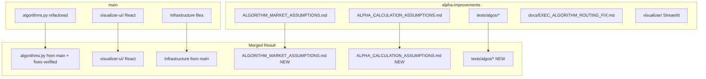

# Merge Alpha-Improvements into Main: Best of Both

## Branch Comparison Summary

| Aspect         | alpha-improvements                                                             | main                        |
| -------------- | ------------------------------------------------------------------------------ | --------------------------- |
| Algorithm docs | ALGORITHM_MARKET_ASSUMPTIONS.md (1062 lines), ALPHA_CALCULATION_ASSUMPTIONS.md | None                        |
| Test scripts   | `tests/algos/` with 16 test scripts per algo                                   | None                        |
| Visualizer     | Streamlit (5339 lines)                                                         | React/TypeScript UI         |
| algorithms.py  | With debug logging, explicit error handling                                    | Cleaner, refactored version |

## Items to Merge from Alpha-Improvements

### 1. Algorithm Documentation (HIGH VALUE)

These files document critical assumptions for backtesting simulation:

**Files to copy to main:**

- [execution_services/algorithms/ALGORITHM_MARKET_ASSUMPTIONS.md](execution_services/algorithms/ALGORITHM_MARKET_ASSUMPTIONS.md) - 1062 lines documenting:
  - Market execution assumptions per algorithm
  - L1_MBP vs L2_MBP behavior differences
  - Benchmark price sourcing
  - Fill guarantees and slippage modeling
  - Algorithm-specific assumptions (TWAP, VWAP, ICEBERG, etc.)
- [execution_services/algorithms/ALPHA_CALCULATION_ASSUMPTIONS.md](execution_services/algorithms/ALPHA_CALCULATION_ASSUMPTIONS.md) - Documents:
  - Alpha calculation formula (BUY vs SELL)
  - Volume-weighted calculation
  - Net alpha = gross alpha - fees - gas
  - Expected alpha ranges per algorithm
- [docs/specs/ALGORITHM_PARAMS.md](docs/specs/ALGORITHM_PARAMS.md) - Parameter grid documentation

### 2. Algorithm Test Scripts AND Documentation (HIGH VALUE)

**Directory to copy:** `tests/algos/`

This directory contains BOTH test scripts AND comprehensive documentation on how algorithms work:

**Documentation files (explain how algos work):**

- `README.md` - Test suite overview, algorithm list with key parameters
- `PRODUCTION_GRADE_CHECKLIST.md` - 25-point checklist for production-grade algorithms:
  - No fallbacks (config is source of truth)
  - Input validation, state management, error recovery
  - Idempotency, observability, performance
  - Domain awareness (L1 vs L2 handling)
  - Quantity/price precision handling
  - Regulatory compliance requirements
- `CONFIG_STRATEGY_SIGNALS.md` - How configs, strategies, and signals work together:
  - Complete config structure with JSON examples
  - Signal data format and all fields explained
  - All 8 algorithm parameters fully documented
  - Execution flow from config to alpha calculation
- `QUICK_START.md` - Quick start guide
- `TEST_LIST.md` - Complete test list with status

**Test scripts (16 total):**

- `01_test_TWAP_cefi.sh` through `08_test_PASSIVE_AGGRESSIVE_HYBRID_cefi.sh` (CeFi L2)
- `09_test_TWAP_tradfi.sh` through `16_test_PASSIVE_AGGRESSIVE_HYBRID_tradfi.sh` (TradFi L1)

**Python utilities:**

- `run_all_tests.py` / `run_all_tests.sh` - Master test runner
- `compare_all_algos.py` - Algorithm comparison tool
- `run_01_twap_cefi.py` - Individual Python test runners

**Note:** Main's `tests/` folder has `backtest/`, `e2e/`, `integration/`, etc. but NO `algos/` directory with this documentation.

### 3. Exec Algorithm Routing Fix Documentation

**File to copy:** [docs/EXEC_ALGORITHM_ROUTING_FIX.md](docs/EXEC_ALGORITHM_ROUTING_FIX.md)

Documents the fix for algorithms not receiving `on_order()` callbacks:

- VWAP was waiting for ACCEPTED status
- AdaptiveTWAP, AlmgrenChriss, HybridOptimal missing `on_order_accepted()` safety nets
- Pattern: Schedule immediately in `on_order()`, add idempotent `on_order_accepted()` safety net

**Note:** Check if these fixes are already in main's algorithms.py. If not, apply the pattern.

### 4. Streamlit Visualizer (OPTIONAL)

**Directory:** `visualizer/`

Alpha-improvements has a Streamlit visualizer (5339 lines) with:

- Multi-algorithm comparison
- Results viewing
- Backtest execution from UI

**Decision needed:** Main already has React UI. Options:

1. Keep both (Streamlit for quick analysis, React for production)
2. Port Streamlit features to React UI
3. Skip (React UI is sufficient)

## Items to Keep from Main (Do NOT Overwrite)

### 1. React UI (`visualizer-ui/`)

Main has a full React/TypeScript UI with:

- Config Generator (just built)
- GCS browser
- Results viewer
- Market tick data viewer

### 2. Infrastructure Files

- Dockerfile, cloudbuild.yaml, buildspec.aws.yaml
- .github/workflows/quality-gates.yml
- pyproject.toml dependencies

### 3. Refactored algorithms.py

Main's version is cleaner and uses unified-cloud-services patterns. Keep main's version but ensure all fixes from alpha are present.

## Merge Strategy

## Implementation Steps

1. **Copy documentation files** from alpha-improvements to main
2. **Copy test scripts** (`tests/algos/`) from alpha-improvements
3. **Verify algorithm fixes** are present in main's algorithms.py
4. **Decide on Streamlit visualizer** - keep or skip
5. **Test** the merged result

## Files Summary

| Action          | Files                                                            |
| --------------- | ---------------------------------------------------------------- |
| COPY from alpha | `execution_services/algorithms/ALGORITHM_MARKET_ASSUMPTIONS.md`  |
| COPY from alpha | `execution_services/algorithms/ALPHA_CALCULATION_ASSUMPTIONS.md` |
| COPY from alpha | `docs/specs/ALGORITHM_PARAMS.md`                                 |
| COPY from alpha | `docs/EXEC_ALGORITHM_ROUTING_FIX.md`                             |
| COPY from alpha | `tests/algos/*` (entire directory)                               |
| KEEP from main  | `execution_services/algorithms/algorithms.py`                    |
| KEEP from main  | `visualizer-ui/*`                                                |
| KEEP from main  | All infrastructure files                                         |
| OPTIONAL        | `visualizer/` Streamlit app                                      |

