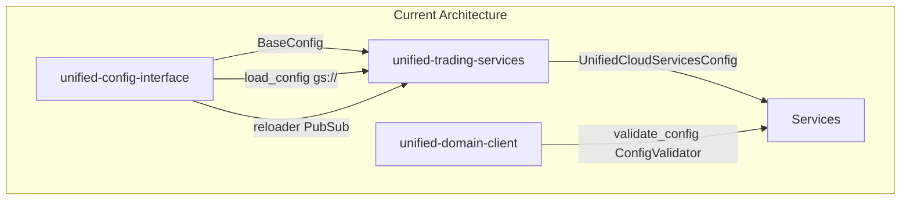
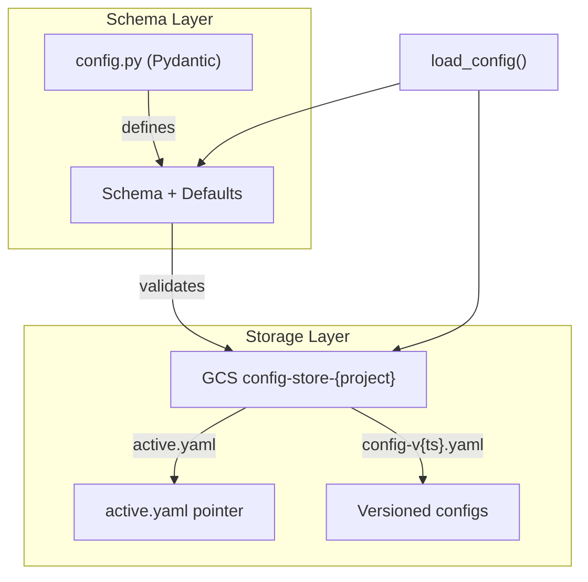

# Unified Config Interface: Consolidated Overhaul Plan

## Current State




| Aspect                 | Current                                                                 | Gap                                                                      |
| ---------------------- | ----------------------------------------------------------------------- | ------------------------------------------------------------------------ |
| **Config access**      | Mixed: `get_config()` singletons, `load_config()`, UCS `unified_config` | No single governed interface                                             |
| **Config storage**     | Repo `config/*.yaml`, GCS `gs://bucket/config/{service}/prod.yaml`      | No ConfigStore, no versioning                                            |
| **Validation**         | In UDS; callers import from UCI (broken)                                | Validation belongs in UCI                                                |
| **Schema vs defaults** | config.py = Pydantic + defaults; YAML overlays                          | No schema version; validation in UDS                                     |
| **Hot reload**         | ConfigReloader (PubSub) for live only                                   | Batch replay has no config-by-timestamp                                  |
| **Versioning**         | None                                                                    | Need schema version (add/remove fields) vs value version (param changes) |
| **Cloud**              | gs:// and GCP PubSub only                                               | No S3/SNS equivalents                                                    |
| **Coupling**           | Secrets, reloader, venue_config use `unified_config`                    | Should not depend on UCS singleton                                       |


---

## 1. Config Access Governance

**Goal:** All services and repos access config exclusively through unified-config-interface.

**Interface contract:**

```python
from unified_config_interface import load_config, ConfigStore, ConfigReloader

class MyServiceConfig(BaseConfig):
    __config_schema_version__ = "1.0"
    service_name: str = "my-service"
    max_workers: int = 16

# Governed access
config = load_config(MyServiceConfig, config_file=..., env_prefix="MY_SERVICE_")
# For batch replay:
config = config_store.replay_at(timestamp=..., schema_version="1.0")
```

**Changes:**

- Deprecate direct `unified_config` and service-specific `get_config()` that bypass UCI
- Add ConfigAccessPolicy to UCI README: "All config MUST be loaded via `load_config()` or `ConfigStore`"
- Audit all 14 services for `os.getenv()`, raw UCS usage; migrate to UCI

---

## 2. Config Storage Model: Hybrid

- **config.py** = schema + defaults (source of truth for structure)
- **GCS** = runtime values, versioned, with `active.yaml` pointer
- **config/*.yaml** in repo = dev/local overrides (optional)




**Rationale:** config.py enables validation and type safety; GCS enables hot reload, versioning, and batch replay.

**Storage implementation:** ConfigStore and TimeSeriesConfigStore use `get_storage_client()` from unified-trading-services (UCS). Never use direct `google.cloud.storage` or `boto3` imports. This keeps config storage cloud-agnostic (GCS or S3).

---

## 3. Schema Version vs Value Version


| Change type             | Schema version | Value version  |
| ----------------------- | -------------- | -------------- |
| max_workers 16→32       | No change      | New GCS object |
| Add/remove/rename field | Bump to v2     | New GCS object |


**Schema version:** Stored in config class (`__config_schema_version`__). Used for replay compatibility.
**Value version:** Stored in GCS (`config-v{timestamp}.yaml`). Used for audit and rollback.

**Replay rule:** Use config with same schema version as original run, effective at timestamp T.

---

## 4. Config Store Timestamp Format

**Value version timestamp** (for `config-v{timestamp}.yaml` filenames):

- **Format:** Compact ISO UTC with **second** granularity: `%Y%m%dT%H%M%SZ` (e.g. `config-v20260220T143000Z.yaml`)
- **Rationale:** Config changes are manual and infrequent; second granularity is sufficient. No colons/dashes in filename for filesystem compatibility.
- **Collision handling:** If two saves in same second, append sequence suffix: `config-v20260220T143000Z-1.yaml`
- **Storage:** Uses `get_storage_client()` from UCS (cloud-agnostic).

---

## 5. Config Store Bucket Setup (setup-buckets.py)

Add config-store bucket to [unified-trading-deployment-v3/scripts/setup-buckets.py](unified-trading-deployment-v3/scripts/setup-buckets.py) in `get_infrastructure_buckets()`:

```python
# GCP
{
    "name": f"config-store-{project_id}",
    "service": "unified-config-interface",
    "type": "infrastructure",
    "category": "ALL",
},
# AWS
{
    "name": f"unified-trading-config-store-{account_id}",
    "service": "unified-config-interface",
    "type": "infrastructure",
    "category": "ALL",
},
```

- Add AWS conversion in `convert_to_aws_bucket_name()` for `config-store` pattern.
- No test bucket for config-store (config is shared across dev/prod; use env-specific paths within bucket).

---

## 6. Config Existence Validation

**Approach:** Central validation in UCI (when config is loaded from config-store paths). If all services use UCI for config access, no per-service validation needed.

**Implementation:**

1. **load_config()** — Already raises `FileNotFoundError` when gs:///s3:// path does not exist. No change needed for file existence.
2. **ConfigStore.ensure_ready()** — New method: validates config-store bucket exists and is accessible. Returns `True` or raises `ConfigStoreError` with clear message: "Config store bucket does not exist. Run: python setup-buckets.py --cloud gcp"
3. **Optional: load_config(..., validate_store=True)** — When loading from `gs://config-store-`* or `s3://...config-store`*, call `ensure_ready()` before load. Default `validate_store=False` for backward compatibility.
4. **Service startup** — Services using ConfigStore call `store.ensure_ready()` once at startup. Services using `load_config(config_file="gs://config-store-...")` can pass `validate_store=True` for fail-fast.

**Per-service:** Not required if all config access goes through UCI. If a service bypasses UCI, it would need its own validation.

---

## 7. Hot Reload Semantics by Mode


| Mode             | Config load                                  | Hot reload                          | Replay config  |
| ---------------- | -------------------------------------------- | ----------------------------------- | -------------- |
| **Live**         | GCS at startup                               | PubSub → reload from GCS → callback | N/A            |
| **Batch**        | GCS (or file) at startup                     | No (read once)                      | N/A            |
| **Batch replay** | TimeSeriesConfigStore.replay_at(ts) per date | No                                  | Yes, versioned |


---

## 8. Batch Dynamic Config Replay

When config has **dynamic params** (e.g. instrument subscriptions, take_profit, stop_loss) that change over time, batch replay must simulate the config that would have been active at each point in time.

### 8.1 Grid config dimension (execution, strategy, ML)

For **execution-services**, **strategy-service**, and **ml-training-service**:

- **Config as shard dimension** — Provide grid of configs linked to each job. User defines path type via CLI: cloud (`gs://`) or local (`file://` or path). Each config = one shard (or config × date = shard).
- **UTD sharding** — Already in place: `sharding.execution-services.yaml` has `config` dimension (gcs_dynamic), `sharding.strategy-service.yaml` has `config` (gcs_dynamic), `sharding.ml-training-service.yaml` has `config` (gcs_dynamic). UTD lists configs from GCS and assigns one per shard.
- **Link to UCI** — Ensure GridConfigGenerator (execution), strategy grid, ML grid generators use UCI for validation and path conventions. They write to domain buckets; UTD picks up. May need shuffling to align with config-interface patterns.
- **Each service houses its own grid config generator** — execution-services has GridConfigGenerator; strategy-service and ml-training-service have or need equivalent. Output to GCS; UTD reads via sharding config.

### 8.2 Per-day config override (all services)

**Separate dimension:** Config per day in batch. Default: same config each day.

- **Override scripts** — Generate scripts to override configs on certain days for **every** service. E.g. `config_overrides/day=2024-01-06.yaml` (Saturday) with different params (e.g. weekend behavior).
- **Purpose** — Test config reloading dynamics in batch; act differently on weekends, holidays, etc.
- **Mechanism** — Service loads base config, then applies per-day override if present. TimeSeriesConfigStore or similar can return `config_for_date(date)` merging base + override.

### 8.3 Historical config generation (long-lived)

1. **Historical config generation** — Script produces versioned config snapshots → ConfigStore. E.g. `replay_config_generator.py` reads operational logs, client overrides, strategy param history.
2. **Batch run** — Service queries config at interval: once per date (default) or every X minutes.
3. **Service behavior** — `config_store.replay_at(timestamp, schema_version)` before each date/window.

---

## 9. Hot-Reloadable vs Requires-Restart Config

Config changes fall into two categories:


| Type                 | Metadata                                                       | Behavior                                              | Examples                                                                                             |
| -------------------- | -------------------------------------------------------------- | ----------------------------------------------------- | ---------------------------------------------------------------------------------------------------- |
| **Hot-reloadable**   | `metadata={"hot_reloadable": True, "requires_restart": False}` | Applied at runtime without restart                    | `max_workers`, `log_level`, `take_profit`, `stop_loss`, `batch_size`                                 |
| **Requires restart** | `metadata={"hot_reloadable": False, "requires_restart": True}` | Service (or affected component) must restart to apply | `buckets`, `api_keys`, `instrument_subscriptions` (if they change connection setup), `websocket_url` |


**Implementation:**

- Tag Pydantic fields in service configs with `Field(..., json_schema_extra={"hot_reloadable": bool, "requires_restart": bool})`
- `ConfigStore.save_config()` publishes PubSub event with `requires_restart` and `changed_fields` (including per-field flags)
- Live: ConfigReloader applies hot-reloadable changes via callback; if `requires_restart`, log warning and set `restart_required` flag (or trigger graceful restart)
- Batch: No runtime restart; config is loaded per date/window via `replay_at()`, so "restart" does not apply. All params are effectively applied at each query.

**Document:** Per-service restart policies in `configs/restart-policies.yaml` (e.g. max_workers hot-reload in market-data-processing, restart in instruments).

---

## 10. Two Config Types: Mass/Iteration vs Long-Lived

**Distinction:** Execution-services already has GCS config. We need two separate config systems:


| Type                       | Services                                                                                | Purpose                                                                                                          | Storage                                                                                                        | Example                                                                  |
| -------------------------- | --------------------------------------------------------------------------------------- | ---------------------------------------------------------------------------------------------------------------- | -------------------------------------------------------------------------------------------------------------- | ------------------------------------------------------------------------ |
| **Mass/iteration configs** | strategy-service, execution-services, ml-training-service                               | Grid search, param optimization — many configs per run, variation-based                                          | `gs://execution-store-{cat}-{proj}/configs/V1/...`, `gs://strategy-store-.../configs/`, `gs://ml-configs-.../` | GridConfigGenerator (execution), strategy param grid, ML hyperparam grid |
| **Long-lived configs**     | instruments-service, market-tick-data-handler, market-data-processing, features-*, etc. | Service runtime config — changeable by user, evolves over time (new instruments, venues) but NOT variation-based | `gs://config-store-{proj}/{service}/`                                                                          | max_workers, log_level, venue list, instrument subscriptions             |


**Key difference:** Mass configs are used to optimize params by grid search (one config per backtest run). Long-lived configs are the runtime config for a service that may change over time but is not iterated for optimization.

**ConfigStore (UCI)** applies to **long-lived configs** only. Mass/iteration configs stay in their domain-specific buckets (execution-store, strategy-store, ml-configs) and are generated by scripts (GridConfigGenerator, strategy grid, ML grid) or UI that overlays those scripts.

**ConfigStore location:** Use a **config-management-service** for separation of concerns (UI-heavy). It interacts with UCI (ConfigStore, load_config) — does not duplicate logic. UCI remains the library; config-management-service is the backend API + optional UI host.

---

## 11. Config Publishing to GCS: UI vs Script

**Long-lived configs** (config-store):

- **Config UI** (codex: `07-services/per-service/config-ui.md`; data-io epic: UTD v2 `ui/pages/config/`) — User edits in UI → backend calls `ConfigStore.save_config()` → writes to GCS with timestamp. Config UI is part of unified-trading-deployment-v3 (shared for batch and live). Planned in data-io epic Subtask 4.7.
- **Script** — `ConfigStore.save_config()` can be called from CLI/script for automation or bootstrap. UI overlays the same ConfigStore API.
- **Flow:** Config UI (frontend) → backend API → `ConfigStore.save_config()` → GCS `config-v{timestamp}.yaml` + PubSub event

**Mass/iteration configs** (execution-store, strategy-store, ml-configs):

- **Scripts:** GridConfigGenerator (execution-services), strategy grid scripts, ML grid scripts — generate and upload configs directly to domain buckets.
- **UI:** Visualizer ConfigGenerator page calls GridConfigGenerator API → generates configs → uploads to execution-store. UI overlays the script.

---

## 12. Config Lifecycle Events and Startup Validation

### 12.1 Add CONFIG_HOT_RELOADED to unified-events-interface

**File:** [unified-events-interface/unified_events_interface/schemas.py](unified-events-interface/unified_events_interface/schemas.py)

Add `CONFIG_HOT_RELOADED` to `STANDARD_LIFECYCLE_EVENTS`:

```python
STANDARD_LIFECYCLE_EVENTS = {
    ...
    "CONFIG_LOADED",
    "CONFIG_HOT_RELOADED",  # Emitted when hot-reload succeeds
}
```

**File:** [unified-events-interface/README.md](unified-events-interface/README.md) — Add to lifecycle events list: `12. **CONFIG_HOT_RELOADED** - Configuration hot-reloaded successfully (live mode)`

### 12.2 UCI emits CONFIG_LOADED and CONFIG_HOT_RELOADED

**UCI loaders and reloader call `log_event()`** from unified-events-interface. Services do not emit these; UCI does.

**Dependency:** UCI adds `unified-events-interface` to `pyproject.toml`. Phase 8 handles this.

**loaders.py:** After successful `config_class(**config_data)`, call:

```python
try:
    from unified_events_interface import log_event
    log_event("CONFIG_LOADED", details={"config_class": config_class.__name__, "source": str(config_file)})
except (RuntimeError, ImportError):
    pass  # Events not initialized or unified-events-interface not installed
```

**reloader.py:** When reload succeeds and callback is invoked, call:

```python
try:
    from unified_events_interface import log_event
    log_event("CONFIG_HOT_RELOADED", details={"service_name": self.service_name})
except (RuntimeError, ImportError):
    pass
```

**Rationale for try/except:** Scripts or tests may call `load_config()` without `setup_events()`. `log_event()` raises `RuntimeError` if not initialized. Silently skip so UCI works in all contexts.

### 12.3 Startup config validation: validate_config_for_startup()

**Goal:** Services or UCI check that a service has all the config it expects at startup.

**Current state:** `load_config()` validates schema via Pydantic (required fields, types). `BaseConfig.validate_cloud_resources()` validates bucket existence but is not called automatically.

**Change:** Add `validate_config_for_startup(config: BaseConfig) -> list[str]` in UCI.

**File:** [unified-config-interface/unified_config_interface/base_config.py](unified-config-interface/unified_config_interface/base_config.py) (or new `validation.py`):

```python
def validate_config_for_startup(config: BaseConfig) -> list[str]:
    """Validate config has all required resources for startup.

    Runs validate_cloud_resources() and returns any errors.
    Services should call this after load_config() and fail fast if non-empty.

    Returns:
        List of validation errors (empty if ready to proceed)
    """
    return config.validate_cloud_resources()
```

Export from `unified_config_interface/__init__.py`.

**Service pattern (document in UCI README):**

```python
config = load_config(MyServiceConfig, config_file=...)
errors = validate_config_for_startup(config)
if errors:
    for e in errors:
        logger.error(e)
    sys.exit(1)
# Proceed with STARTED, etc.
```

### 12.4 Codex and docs updates

- **03-observability/lifecycle-events.md** — Add CONFIG_LOADED and CONFIG_HOT_RELOADED to required events; note that UCI emits them (services do not).
- **UCI README** — Document startup validation pattern and that load_config/reloader emit lifecycle events.

---

## 13. Success Criteria

For each phase (or the full overhaul), success means:

1. **Local quality gates pass** — `bash scripts/quality-gates.sh --no-fix` in affected repos
2. **Quickmerge without losing local code** — `bash scripts/quickmerge.sh "message"` stages all changes, creates PR, stays on PR branch
3. **CI merge to main** — GitHub Actions pass; PR auto-merges to main
4. **Version bump** — UCI `pyproject.toml` version bumped; pre-commit or CI enforces version bump when library code changes (per codex library-versioning)
5. **Artifact Registry build** — Cloud Build builds image, runs tests in image, pushes to Artifact Registry successfully

---

## Phase 1: Move Config Validation to UCI

### 1.1 Move from unified-domain-client

**Source:** [unified-domain-client/unified_domain_client/schemas/config_schema.py](unified-domain-client/unified_domain_client/schemas/config_schema.py)

**Move to UCI** (`unified_config_interface/validation.py`):

- `ConfigValidator`, `validate_config`, `validate_config_file`
- `INSTRUMENT_TYPE_FOLDER_MAP`, `VENUE_CATEGORY_MAP`
- `CONFIG_SCHEMA`, `REQUIRED_CONFIG_FIELDS`, `OPTIONAL_CONFIG_FIELDS`
- `ConfigValidationError`, `DEX_VENUES`, `CLOB_VENUES`, `ZERO_ALPHA_VENUES`

**Update UDS:** Re-export from UCI for backward compatibility.

### 1.2 Fix broken imports

- [execution-services/execution_services/backtest/preflight.py](execution-services/execution_services/backtest/preflight.py)
- [execution-services/visualizer-api/app/services/data_service.py](execution-services/visualizer-api/app/services/data_service.py)
- [execution-services/visualizer-ui/backend/instruction_api.py](execution-services/visualizer-ui/backend/instruction_api.py)
- [execution-services/configs/ssot/validate_configs.py](execution-services/configs/ssot/validate_configs.py)
- [execution-services/execution_services/backtest/engine.py](execution-services/execution_services/backtest/engine.py)

---

## Phase 2: Config Access Governance

- Document UCI as sole config interface in codex and UCI README
- Audit services for `os.getenv()`, raw `unified_config` usage
- Add ConfigAccessPolicy section to UCI README
- **Per-service unit test:** Each service MUST have `tests/unit/test_config_interface.py` (or equivalent) that asserts:
  - Config class extends BaseConfig/UnifiedCloudConfig from UCI
  - Config is loaded via `load_config()` or ConfigStore (not `os.getenv()`, not raw UCS)
  - No direct `unified_config` access for config values (except where explicitly allowed)
  - Schema version present when using ConfigStore

---

## Phase 3: ConfigStore + GCS Persistence + Schema Versioning

### 3.1 ConfigStore

**New:** `unified_config_interface/persistence.py`

- `ConfigStore` class: `save_config()`, `load_config()`, `list_versions()`, `compare_configs()`, `ensure_ready()`
- **Storage:** All GCS/S3 access MUST use `get_storage_client()` from unified-trading-services. No direct `google.cloud.storage` or `boto3` imports.
- Timestamp format: compact UTC seconds `%Y%m%dT%H%M%SZ` (e.g. `config-v20260220T143000Z.yaml`); collision suffix `-1`, `-2` if same second
- GCS layout: `config-store-{project}/{service}/config-v{timestamp}.yaml` + `active.yaml` pointer
- Version metadata: timestamp, deployer, git commit, **schema_version**

### 3.2 Schema versioning in BaseConfig

- Add `__config_schema_version__: str = "1.0"` to BaseConfig (or `model_config`). **Format: semver** ("1.0", "1.1", "2.0") — bump minor for additive changes, major for breaking.
- Validation: reject config if schema version mismatch
- Document: bump schema version when add/remove/rename fields

### 3.3 GCS layout with schema versioning

```
config-store-{project}/{service}/
  schema-v1.0/
    config-v{timestamp}.yaml
  schema-v1.1/
    config-v{timestamp}.yaml
  active.yaml  -> pointer to current (live)
```

### 3.4 Hot-reloadable field metadata

- Add `Field(..., json_schema_extra={"hot_reloadable": bool, "requires_restart": bool})` to config fields (see Section 9)
- `ConfigStore.save_config()` publishes PubSub event with `requires_restart` and `changed_fields` flags
- Create `configs/restart-policies.yaml` documenting per-service policies

### 3.5 setup-buckets.py

Add config-store bucket to `get_infrastructure_buckets()` in [setup-buckets.py](unified-trading-deployment-v3/scripts/setup-buckets.py):

- GCP: `config-store-{project_id}`
- AWS: `unified-trading-config-store-{account_id}` (add case in `convert_to_aws_bucket_name()`)

---

## Phase 4: Move UnifiedCloudServicesConfig to UCI

### 4.1 Move class to UCI

**From:** [unified-trading-services/unified_trading_services/core/config.py](unified-trading-services/unified_trading_services/core/config.py)

**To:** `unified_config_interface/cloud_config.py` — `UnifiedCloudConfig` extends `BaseConfig`

**Dependency:** Make UCI's UCS dependency optional for core; loaders/secrets/reloader lazy-import. UCS can then depend on UCI.

### 4.2 UCS backward compatibility

- Remove `UnifiedCloudServicesConfig` from UCS
- Re-export: `from unified_config_interface import UnifiedCloudConfig as UnifiedCloudServicesConfig`
- Keep `unified_config` singleton, `BaseServiceConfig` alias

### 4.3 Update all 14 services

Change import from `UnifiedCloudServicesConfig` (UCS) to `UnifiedCloudConfig` (UCI). Add or update `tests/unit/test_config_interface.py` in each service to verify correct UCI usage (see Phase 2).

---

## Phase 5: TimeSeriesConfigStore for Batch Replay

### 5.1 TimeSeriesConfigStore

**New:** `unified_config_interface/config_store.py` (or extend `persistence.py`)

```python
class TimeSeriesConfigStore:
    def replay_at(self, timestamp: datetime, schema_version: str) -> BaseConfig:
        """Return config effective at timestamp, with given schema version."""
```

- Manifest or directory listing: `schema-v{N}/config-v{timestamp}.yaml`
- `get_config_for_timestamp(timestamp, schema_version)` → gs:// or s3:// path

### 5.2 ConfigReloader batch mode

```python
class ConfigReloader:
    def __init__(self, ..., mode: Literal["live", "batch"] = "live", ...):
        # mode="live": PubSub (existing)
        # mode="batch": time-series store, no PubSub

    def replay_at(self, timestamp: datetime) -> None:
        """Batch mode: load config valid at timestamp, invoke callback."""
        config_path = self._store.get_config_for_timestamp(timestamp, schema_version)
        if config_path:
            new_config = load_config(self.config_class, config_file=config_path)
            self.callback(new_config)
```

### 5.3 Alternative (simpler)

Single config per replay job: `--config-schema-version 1.0` loads one config at job start. No per-date config changes.

### 5.4 Grid config dimension + UCI linkage

- **execution-services:** Link GridConfigGenerator and ConfigLoader to UCI validation. Ensure sharding `config` dimension supports cloud (`gs://`) and local paths (CLI `--config-gcs` or `--config-path`). UTD `sharding.execution-services.yaml` already has `config` (gcs_dynamic); add local path support if needed.
- **strategy-service:** Ensure grid config generator exists or complete; write to `gs://strategy-store-.../configs_grid/`; UTD picks up via `sharding.strategy-service.yaml`. Link to UCI.
- **ml-training-service:** Same pattern; `sharding.ml-training-service.yaml` has `config` (gcs_dynamic). Link grid generator to UCI.
- **Per-day override:** Add optional `config_overrides/` or `--config-override-day` mechanism so services can load different config per date. Generate override scripts for testing config reload dynamics (e.g. weekends).

---

## Phase 6: Decouple and Clean Up

### 6.1 Secrets

- `get_secret(secret_path, project_id=None)`: when None, use `os.environ.get("GCP_PROJECT_ID")` not `unified_config`
- Remove `from unified_trading_services import unified_config` from secrets.py

### 6.2 Reloader

- `ConfigReloader.__init`__: when `project_id` is None, use env fallback, not `unified_config`

### 6.3 venue_config

- Replace `_get_env_config` with BaseConfig/env pattern or document as single venue env override point

### 6.4 base_config.validate_cloud_resources

- Ensure cloud-agnostic (S3StorageClient supports `bucket.exists()`)

---

## Phase 7: Cloud-Agnostic (S3, SNS/SQS)

### 7.1 s3:// support in load_config

- In `_load_from_file`, detect `s3://` prefix
- Add `_load_from_s3(s3_path)` using `get_storage_client()` from UCS

### 7.2 AWS reloader

- Abstract `ConfigUpdateNotifier`: `PubSubNotifier` (GCP), `SNSNotifier` (AWS)
- ConfigReloader uses notifier from factory based on `CLOUD_PROVIDER`
- UCI optional extra `[aws]` for boto3

---

## Phase 8: Dependency and Version Updates

- UCI: Add `[aws]` extra; bump version (e.g., 0.2.0 → 0.3.0)
- UDS: Add UCI dependency; re-export validation
- UCS: Add UCI dependency; remove UnifiedCloudServicesConfig, re-export from UCI

---

## Phase 9: Documentation

Document all config interface changes and update UTD v2 and codex. Execute after implementation phases.

### 9.1 unified-config-interface

- **README.md** — Config access policy, ConfigStore usage, TimeSeriesConfigStore, hot-reloadable vs requires-restart, batch dynamic replay, schema versioning
- **docs/CONFIG_STORE.md** (new) — ConfigStore API, GCS layout, timestamp format, ensure_ready(), replay_at()

### 9.2 unified-trading-deployment-v3

- **docs/CONFIG_LOADING_PATTERNS.md** — Update for UCI as sole interface; ConfigStore, config-store bucket, setup-buckets
- **docs/CONFIG_INTERFACE_SERVICE_USAGE.md** (new) — How services load config, ConfigStore.ensure_ready() at startup, batch replay config query intervals
- **configs/README.md** — Reference config-store bucket, restart-policies.yaml
- **docs/INDEX.md** or **docs/INFRASTRUCTURE.md** — Add config-store bucket, link to config docs

### 9.3 unified-trading-codex

- **05-infrastructure/unified-libraries/config-interface.md** — Full update: ConfigStore, TimeSeriesConfigStore, schema vs value versioning, hot-reloadable metadata, batch dynamic replay, get_storage_client() from UCS, two config types (mass/iteration vs long-lived), Config UI/script for publishing
- **02-data/bucket-naming-and-config.md** — Add config-store bucket naming (GCP: `config-store-{project}`, AWS: `unified-trading-config-store-{account}`)
- **06-coding-standards/README.md** — Config section: UCI as sole interface, no os.getenv(), ConfigStore for versioned config; require `tests/unit/test_config_interface.py` per service
- **qa-sessions/UNIFIED_CONFIG_OVERVIEW.md** — Sync with new architecture (ConfigStore, versioning, hot-reloadable)
- **04-architecture/batch-live-symmetry.md** — Add config replay semantics (batch vs live config loading)

### 9.4 Create config-management spec (codex)

- **05-infrastructure/config-management.md** (new) — Config storage model, schema versioning, hot-reload policies, restart-policies.yaml format, ConfigStore GCS layout, two config types (mass/iteration vs long-lived), Config UI vs script for publishing; **Service requirement:** each service must have `tests/unit/test_config_interface.py` asserting correct UCI usage

### 9.5 Config UI scope and unified onboarding

**Current codex split (clarification):**


| Doc                         | Scope                           | Purpose                                                                                                                         |
| --------------------------- | ------------------------------- | ------------------------------------------------------------------------------------------------------------------------------- |
| **config-ui.md**            | Client/strategy/API keys        | New client onboarding: leverage, exchanges, API keys, risk limits, strategy variations (stop loss). Planned standalone service. |
| **UTD v2 ui/pages/config/** | Service-level long-lived config | data-io epic: service config (max_workers, venues, etc.); saves via ConfigStore.                                                |


**Desired unified experience:**

- **Templates and defaults** — Config templates for new client: leverage, exchanges, API keys, risk limits, strategy variations (stop loss). Inheritance so overrides are minimal.
- **Override via script + UI** — Script can override config; UI provides easy edit and view from GCS. Same data, multiple entry points.
- **Easy onboarding** — New strategy, new instrument, new ML signal, service-to-service data subscriptions, new exchange/venue — as simple as possible.
- **Visual inheritance** — Show config hierarchy (base → client → strategy override) so users see what is inherited vs overridden.
- **Dynamic live application** — As much as possible applied live (hot-reload) without restart.
- **Batch** — Service generates config over time; for execution/strategy/ML, grid generators write to GCS; UTD picks up for config-sharded jobs.

**Decision: Option A — Single config-management-service.** One backend + UI covering both client/strategy/API keys AND service-level config. config-ui.md and UTD ui/pages/config/ merge into one service.

**Migration:** Much of this exists (GridConfigGenerator, sharding configs, visualizer ConfigGenerator). Plan: audit execution-services, strategy-service, ml-training-service; link grid generators to UCI; ensure UTD sharding picks up configs; add per-day override dimension. See relevant code: `sharding.execution-services.yaml`, `sharding.strategy-service.yaml`, `sharding.ml-training-service.yaml`, `execution_services/config/grid_generator.py`, `visualizer-ui/instruction_api.py` (config-generator), `strategy_service/cli/handlers/batch_handler.py` (config_gcs).

---

## Phase 10: Config Lifecycle Events and Startup Validation

Implements Section 12. Can run after Phase 8 (UCI has unified-events-interface dep).

### 10.1 unified-events-interface

- Add `CONFIG_HOT_RELOADED` to `STANDARD_LIFECYCLE_EVENTS` in [schemas.py](unified-events-interface/unified_events_interface/schemas.py)
- Update [README.md](unified-events-interface/README.md) lifecycle events list

### 10.2 UCI dependency and event emission

- Add `unified-events-interface` to UCI `pyproject.toml` dependencies (Phase 8)
- **loaders.py:** After successful `config_class(**config_data)`, call `log_event("CONFIG_LOADED", details={...})` with try/except for RuntimeError, ImportError
- **reloader.py:** When reload succeeds and callback invoked, call `log_event("CONFIG_HOT_RELOADED", details={...})` with try/except

### 10.3 validate_config_for_startup

- Add `validate_config_for_startup(config: BaseConfig) -> list[str]` in base_config.py or validation.py
- Export from `__init__.py`
- Document in UCI README: service pattern (load_config → validate_config_for_startup → fail fast if errors)

### 10.4 Codex and docs

- **03-observability/lifecycle-events.md:** Add CONFIG_LOADED, CONFIG_HOT_RELOADED; note UCI emits them (services do not)
- **UCI README:** Startup validation pattern, event emission behavior

---

## Execution Order

1. **Phase 1** — Move validation to UCI, fix imports (unblocks broken callers)
2. **Phase 2** — Config access governance (document, audit)
3. **Phase 3** — ConfigStore + schema versioning
4. **Phase 4** — Move UnifiedCloudServicesConfig to UCI, update services
5. **Phase 6** — Decouple secrets, reloader, venue_config (can parallelize with Phase 5)
6. **Phase 5** — TimeSeriesConfigStore, ConfigReloader.replay_at
7. **Phase 7** — S3 load_config, AWS reloader
8. **Phase 8** — Version bumps, dependency updates (includes UCI → unified-events-interface)
9. **Phase 10** — Config lifecycle events (CONFIG_HOT_RELOADED, UCI emits events, validate_config_for_startup)
10. **Phase 9** — Documentation (UCI, UTD v2, codex)

---

## Files Changed (Summary)


| Repo                              | Files                                                                                                                                                                                                                                                                                                                                                                         |
| --------------------------------- | ----------------------------------------------------------------------------------------------------------------------------------------------------------------------------------------------------------------------------------------------------------------------------------------------------------------------------------------------------------------------------- |
| **unified-config-interface**      | New: `validation.py`, `cloud_config.py`, `persistence.py`, `config_store.py`, `docs/CONFIG_STORE.md`; Modify: `__init__.py`, `loaders.py`, `reloader.py`, `secrets.py`, `venue_config.py`, `base_config.py`, `pyproject.toml`, `README.md`; Add dep: `unified-events-interface`; loaders/reloader emit CONFIG_LOADED/CONFIG_HOT_RELOADED; add `validate_config_for_startup()` |
| **unified-events-interface**      | Modify: `schemas.py` (add CONFIG_HOT_RELOADED), `README.md`                                                                                                                                                                                                                                                                                                                   |
| **unified-trading-deployment-v3** | Modify: `scripts/setup-buckets.py`, `docs/CONFIG_LOADING_PATTERNS.md`, `configs/README.md`, `docs/INDEX.md` or `docs/INFRASTRUCTURE.md`; Create: `configs/restart-policies.yaml`, `docs/CONFIG_INTERFACE_SERVICE_USAGE.md`                                                                                                                                                    |
| **unified-trading-codex**         | Modify: `05-infrastructure/unified-libraries/config-interface.md`, `02-data/bucket-naming-and-config.md`, `06-coding-standards/README.md`, `qa-sessions/UNIFIED_CONFIG_OVERVIEW.md`, `04-architecture/batch-live-symmetry.md`; Create: `05-infrastructure/config-management.md`                                                                                               |
| **unified-domain-client**       | Modify: `schemas/config_schema.py` (re-export), `pyproject.toml`                                                                                                                                                                                                                                                                                                              |
| **unified-trading-services**        | Modify: `core/config.py` (re-export), `__init__.py`, `pyproject.toml`                                                                                                                                                                                                                                                                                                         |
| **execution-services**            | Modify: `backtest/preflight.py`, `backtest/engine.py`, `visualizer-api/`, `visualizer-ui/`, `configs/ssot/validate_configs.py`                                                                                                                                                                                                                                                |
| **All 14 services**               | Modify: each service's `config.py` — import from UCI; Add/update: `tests/unit/test_config_interface.py` — assert config uses UCI correctly                                                                                                                                                                                                                                    |


---

## Risks and Mitigations

- **Circular dependency UCI ↔ UCS:** Make UCI's UCS dependency optional for core; lazy-import for loaders/secrets/reloader.
- **Breaking changes:** UCS re-exports `UnifiedCloudServicesConfig`; services migrate gradually.
- **AWS credentials:** Unit tests use mocks; integration tests skipped when creds absent.

---

## Resolved (in plan)

- **Batch replay granularity:** Config as shard dimension (execution, strategy, ML) + per-day config override for all services (Section 8).
- **ConfigStore location:** config-management-service for UI/API; interacts with UCI (Section 10).
- **Schema version format:** Semver ("1.0", "1.1") (Phase 3.2).
- **Config UI scope:** Single config-management-service for both client/strategy/API keys and service-level config (Section 9.5).

## Open Questions

None at this time.
