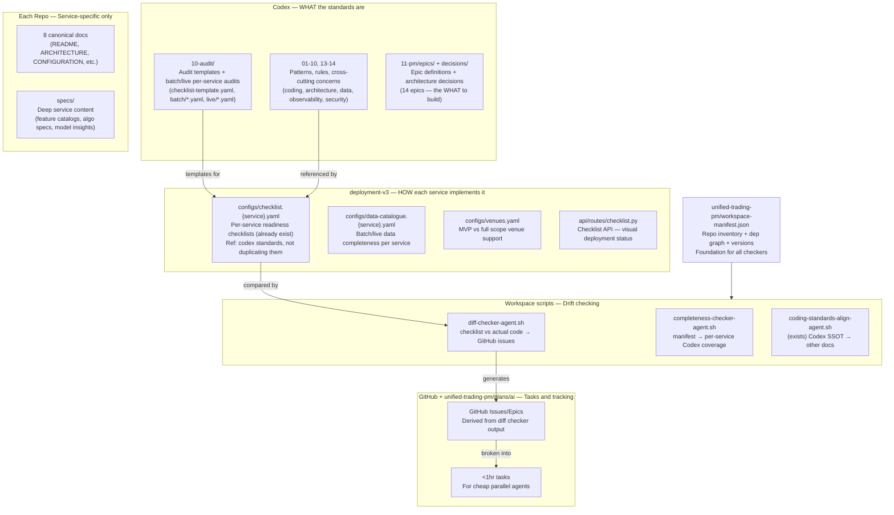
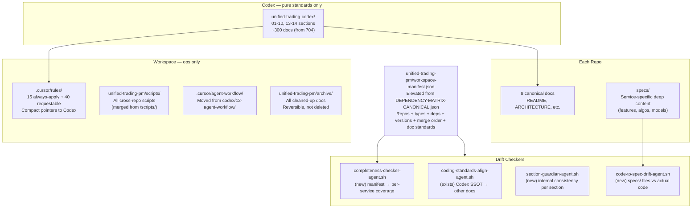
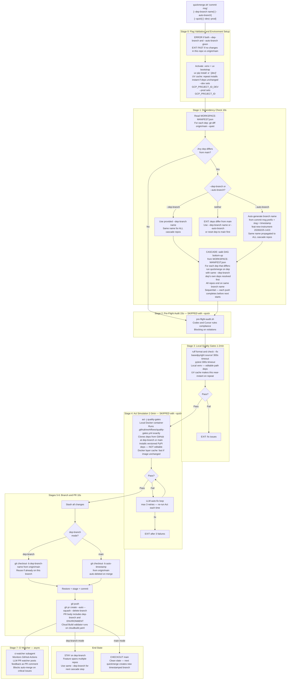
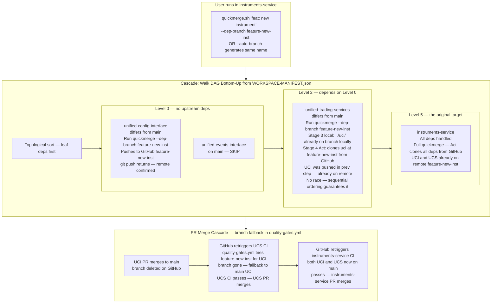
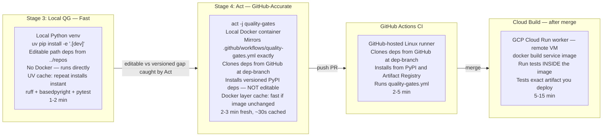
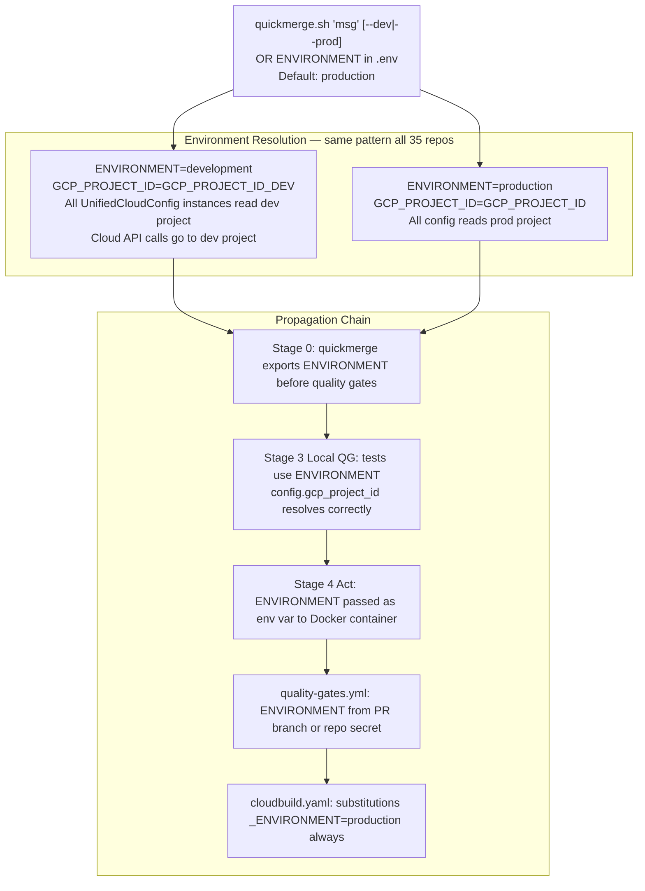
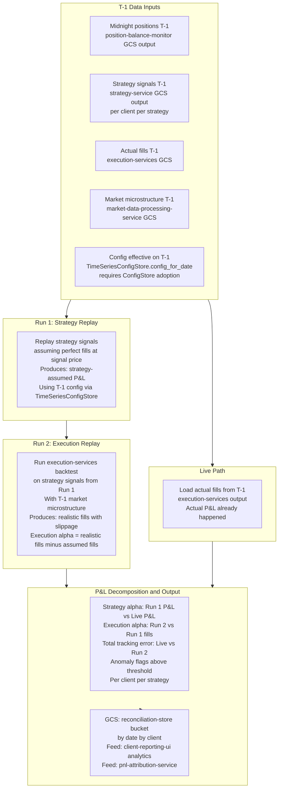

# Documentation Architecture Reform

## The Problem (By the Numbers)

- **10,320 total .md files** — 704 in Codex, 65 cursor rules (many 100-300 lines), 47+ stray docs at workspace root, 36-77 per service
- **The structure already exists but is buried.** deployment-v3 has per-service checklists. Codex/10-audit has templates and batch/live service audits. Codex/11-pm has real epics. It all just has 10x more AI-generated junk on top of it.
- **Root causes (five compounding forces):**
  1. AI generates summary/status/completion docs that accumulate and are never deleted
  2. No clear ownership: what belongs at each layer is undefined
  3. Codex contains PM task tracking (201 files), agent workflow ops, and one-time scripts — things that don't belong there
  4. Codex docs enumerate some services but not others — makes unlisted repos seem irrelevant or non-existent
  5. Cursor rules duplicate Codex verbatim (100-300 lines each) — drift between the two is inevitable

## Workspace Manifest (Foundation for Everything)

**Existing file:** `[unified-trading-pm/workspace-manifest.json](unified-trading-pm/workspace-manifest.json)` (elevated from DEPENDENCY-MATRIX-CANONICAL.json) — already has dependency lists, merge order (8 DAG levels), publishing order, and all repo versions.

**Problem:** Buried in a plan subdirectory. Missing `type`, `doc_standard`, and `codex_sections` per repo. Referenced by quickmerge from its current path — needs updating.

**Phase 0 action:** Promote to `unified-trading-pm/workspace-manifest.json` and extend with schema v2.

The extended schema adds three fields per repo entry:

```json
"instruments-service": {
  "type": "service",
  "doc_standard": "service-canonical",
  "codex_sections": ["01-domain", "02-data", "03-observability"],
  "version": "1.0.0",
  "dependencies": [...],
  "merge_level": 5
}
```

Plus a top-level `doc_standards` block:

```json
"doc_standards": {
  "service-canonical": {
    "required": ["README.md", "docs/ARCHITECTURE.md", "docs/CONFIGURATION.md",
                 "docs/GCS_PATHS.md", "docs/DEPLOYMENT_GUIDE.md",
                 "docs/TESTING.md", "docs/SCHEMA_VALIDATION.md",
                 "QUALITY_GATE_BYPASS_AUDIT.md"],
    "optional_dir": "specs/"
  },
  "library-canonical": {
    "required": ["README.md", "docs/ARCHITECTURE.md", "docs/CONFIGURATION.md",
                 "docs/TESTING.md", "QUALITY_GATE_BYPASS_AUDIT.md"],
    "optional_dir": "specs/"
  },
  "ui-canonical": {
    "required": ["README.md", "docs/ARCHITECTURE.md", "docs/DEPLOYMENT_GUIDE.md",
                 "docs/TESTING.md"],
    "optional_dir": "specs/"
  }
}
```

**What this single file drives:**

- **CI/CD** — quickmerge uses merge_level for checkout/cascade order (already does, just updates path)
- **Completeness checker** — scans Codex for repos missing from per-service docs
- **Service docs rollout** — knows which doc_standard each repo needs
- **Codex per-service coverage** — knows which codex_sections apply to each repo
- **Documentation standards** — drift checker knows which canonical docs must exist
- **Publishing** — publishingOrder already in the file, drives Artifact Registry uploads
- **Deployment** — unified-trading-deployment-v3 can reference for service dependencies

**Validation step in Phase 0:** Cross-check manifest repos against actual workspace `ls`. The existing matrix has repos not yet in workspace (`features-sports-service`, `corporate-actions`) and may be missing some (`unified-feature-calculator-library`, `settlement-ui`). Resolve discrepancies first — this becomes the canonical truth.

## Two New Repos to Create

**Confirmed not on GitHub yet** — created in Phase 0 before any content moves. Access pattern matches all existing unified-trading repos: CosmicTrader (Harsh Kantariya), datadodo (femi), vahiwe all get `write`; IggyIkenna is `admin`.

- `**unified-trading-pm`** (~400 files, 4.8MB) receives:
  - All 13 epics (incl. 9,201-line batch-live-symmetry epic)
  - All 314 github-integration files (functional scripts referencing real GitHub APIs — NOT one-time)
  - task-classifications/ (14 JSON files driving issue creation)
  - detailed-task-breakdown/ (15 JSON files with <1hr task specs per epic)
  - decisions/ (1 ADR), rd-tax-credits/ (3 files)
  - ~30 active root docs: `roadmap-batch-85pct.md`, `roadmap-live-90pct.md`, `mvp-universe.yaml`, `service-registry.yaml`, `venue-support-matrix.yaml`, workflow guides, templates
  - generated-issues/ (7 JSON files of PENDING issues not yet in GitHub)
  - codex `qa-sessions/` (6 files incl. 2687-line Q&A), codex `issues/` (3 bug reports)
  - **DELETE before moving** (~44 files): All SESSION_SUMMARY, EPIC_COMPLETION_SUMMARY, archived-workflows/ (14 files), archive placeholder READMEs, Python cache
- `**unified-trading-presentations`** receives:
  - `13-presentations/*.html` (3 pitch decks)
  - `13-presentations/AWS_CREDITS_STRATEGY.md`, `CLOUD_PLATFORM_COMPARISON.md`
  - **MOVE to codex instead**: `PROJECT_STRUCTURE_REFERENCE.md` → `06-coding-standards/`, `CLEAN_WORKFLOW_DIAGRAMS.md` → `12-agent-workflow/` (if kept)
  - **DELETE**: `COMPREHENSIVE_SUMMARY.md` (violates no-summary-docs)

`**unified-trading-deployment-v3` is superseded** — exists on GitHub but ignored entirely. v3 is current.

`**corporate-actions` is NOT a standalone repo** — it is an operational mode within `instruments-service` (reference data attributed to instruments). Remove from dependency matrix as a standalone entry; document as a mode within instruments-service.

`**features-sports-service`** — keep in matrix as "future integration" with explicit flag. Sports Wedding repo exists but is not integrated yet; integration is a future plan (~month+ out).

**Dependency matrix updates required:**

- ADD: `unified-feature-calculator-library`, `settlement-ui` (exist in workspace, missing from matrix)
- REMOVE: `corporate-actions` (not a standalone repo)
- MARK AS FUTURE: `features-sports-service`
- REMOVE: `unified-trading-deployment-v3` (superseded)

**Codex post-cleanup sections:** `01–10` (standards + audit), `11-testing-guides` (promoted from `14`, or merged into `06-coding-standards`). Root `validators/` (31 Python files — production readiness system) and `scripts/` (40 operational scripts) stay. `12-agent-workflow/` core ops docs → `.cursor/agent-workflow/`. `13-presentations/` gone.

## AUDIT_TO_A_GRADE_ROADMAP + code_optimizations_and_ci_cd_alignment — Consolidation Plan

**Both directories → `unified-trading-pm`** (merged into fewer files). Library 8-pack docs also move to PM (outstanding architectural work). `unified-trading-pm/plans/ai/` is the staging area; PM is the permanent home.

**Current state:**

- `AUDIT_TO_A_GRADE_ROADMAP/`: 28 files, 123-task execution plan (C- → A grade), ~95% doc-complete, execution pending
- `code_optimizations_and_ci_cd_alignment/`: 29 files, CI/CD infrastructure docs, quickmerge template exists but not deployed, 8 optimization plans all "Not Started"

**Conflicts found (resolution needed before merge — see questions below):**

1. **Quickmerge SSOT:** Template (7 stages) vs deployed repos (3-4 stages) — neither is complete. Template has pre-flight audit + Act simulation (not deployed); deployed repos have venv activation + dep installation (not in template). `unified-trading-services` is the most advanced deployed version.
2. **Stage numbering:** `00-MASTER-CICD-PLAN.md` has wrong stage numbers; `00-MASTER-CICD-PLAN-CORRECTIONS.md` has corrections but the plan itself wasn't updated.
3. **Event logging list wrong:** `STANDARDS_COMPLIANCE_GUIDE.md` lists 5 events; correct list is 12 (from `.cursor/rules/event-logging.mdc`).
4. **4 redundant dependency docs** marked for deletion in `00-CONSOLIDATION-SUMMARY.md` but still present.
5. **Implementation status conflict:** `IMPLEMENTATION-COMPLETE.md` says "Infrastructure Ready"; README.md marks all 8 plans as "Not Started".
6. `**pip install` examples** in `PHASE_2_QUALITY_GATES.md` and `STANDARDS_COMPLIANCE_GUIDE.md` (should be `uv pip install`).
7. `**datetime.utcnow()` examples** in phase docs (should be `datetime.now(timezone.utc)`).

**Target consolidated structure in `unified-trading-pm`:**

- `work/quality-improvement/README.md` — single guide merging AUDIT_TO_A_GRADE_ROADMAP (123 tasks, 4 phases)
- `work/cicd/README.md` — single guide merging CI/CD alignment plans + quickmerge SSOT
- `work/library-hardening/` — library 8-pack docs + architectural notes
- Archive the ~44 redundant/superseded files from both dirs

## Ownership Model (What Lives Where)

The four layers have distinct, non-overlapping jobs. No duplication.




**Key rules:**

- Codex defines patterns. deployment-v3 owns per-service checklists. No duplication between them.
- `unified-trading-deployment-v3` is referenced in old docs but does not exist in this workspace. The current deployment repo is `unified-trading-deployment-v3`.
- Service repos own implementation + 8 canonical docs + `specs/`. No service-level checklists (those live in deployment-v3).
- GitHub Issues are derived outputs of the diff checker — not manually maintained.

## Target Architecture




## What Goes Where (Definitive)

### Codex (`unified-trading-codex/`) — Standards only

**Keep:** Sections 01-10, 13-14 — architecture, data, observability, coding standards, infra, domain, security, workflows, testing

**Move out:**

- `11-project-management/` (201 files) → `unified-trading-pm/archive/project-management/` — task tracking is GitHub, not Codex
- `12-agent-workflow/` (12 files + tasks/) → `.cursor/agent-workflow/` (workspace ops) — workspace ops, not trading system standards
- Codex root: 30 loose status/summary `.md` files → `unified-trading-pm/archive/codex-root/` — keep only `README.md` and `GLOSSARY.md`

**Fix per-service coverage (new problem):** Codex docs that mention specific services by name must either:

- List ALL repos of that type (from manifest), or
- Explicitly say "Example: `instruments-service`. See `[section]/per-service/` for complete list."

Incomplete enumerations make unlisted repos seem irrelevant. The completeness checker enforces this.

**Target: ~300 docs (from 704)**

### Workspace root — Almost empty

**Keep:** `.cursorrules`, `.cursor/`, `unified-trading-codex/`, the 35 repo directories

**Move/archive:**

- 47+ stray `.md` files (AUDIT*.md, COVERAGE*.md, ALIGNMENT*.md, etc.) → `unified-trading-pm/archive/workspace-root/`
- `scripts/` (3 files: `kill-zombie-pyright.sh`, `rollout-quality-gates-*.py`) → `unified-trading-pm/scripts/`
- `AUDIT_TO_A_GRADE_ROADMAP/` (stray folder, not a repo) → `unified-trading-pm/archive/`

### `.cursor/` — All workspace operations

```
.cursor/
  rules/          - 65 → ~55 compact rules
  scripts/        - ALL workspace-level scripts (merged from /scripts/)
  plans/          - active work plans
  agent-workflow/ - moved from codex/12-agent-workflow/
  archive/        - everything cleaned up (reversible)
    workspace-root/
    codex-root/
    project-management/
  CANONICAL_REPOS.json  - 35 repos, typed
```

### Service/Repo Docs — 8 canonical + `specs/`

**8 canonical docs** (every service, library, UI):

- `README.md` — overview, quickstart
- `docs/ARCHITECTURE.md` — design decisions unique to this service
- `docs/CONFIGURATION.md` — config fields, env vars
- `docs/GCS_PATHS.md` — data input/output paths (services only)
- `docs/DEPLOYMENT_GUIDE.md` — how to deploy
- `docs/TESTING.md` — how to run tests
- `docs/SCHEMA_VALIDATION.md` — output schema (services/libraries)
- `QUALITY_GATE_BYPASS_AUDIT.md` — audited exceptions

`**specs/` directory** — deep service-specific content that changes independently of Codex:

- `instruments-service/specs/canonical-instrument-key.md`
- `execution-services/specs/algorithms.md`
- `ml-training-service/specs/model-insights.md`
- `features-*/specs/feature-catalog.md` (hundreds of features — lives here, not Codex)

**Delete** (AI artifacts, not specs): All `*_SUMMARY.md`, `*_STATUS.md`, `*_REPORT.md`, `*_VIOLATION*.md`, `COVERAGE_PLAN.md`, `TECHNICAL_DEBT.md`, `OPTIMIZATION_PLAN.md`

### Cursor Rules — Compact pointers

**Current:** 65 rules, avg 120 lines, ~8,000 lines total
**Target:** ~55 rules, avg 15 lines, ~825 lines total

**New rule format:**

```
# Rule: No pip install
USE: uv pip install (never pip install)
WHY: Three-stage version consistency (local/CI/Cloud Build)
CODEX: 06-coding-standards/dependency-management.md#uv
EXAMPLE:
  # ✅  uv pip install -e ".[dev]"
  # ❌  pip install -e .
```

**Structure:**

- **15 always-apply** (in `.cursorrules`, always loaded): git-workflow, config-pattern, event-logging, imports, type-hints, uv, basedpyright-safety, parallel-agents, runtime-verification, no-summary-docs, no-empty-fallbacks, datetime-utc, hardening, testing, quickmerge
- **~40 agent-requestable** (fetched on demand): topic-specific rules

## Drift Detection System (4 checkers)

**1. Doc-to-doc alignment** (`coding-standards-align-agent.sh` — exists)

- Trigger: SSOT files change

**2. Completeness checker** (`completeness-checker-agent.sh` — new)

- Uses `WORKSPACE-MANIFEST.json`
- Scans Codex docs for partial service enumerations
- Flags: "This doc mentions instruments-service but not these 14 others"
- Also checks: each repo has all required docs for its `doc_standard`

**3. Per-section guardian** (`section-guardian-agent.sh` — new)

- One invocation per Codex section
- Checks internal consistency within that section

**4. Code-to-spec drift** (`code-to-spec-drift-agent.sh` — new)

- Reads service `specs/` files, compares to actual code
- Example: `feature-catalog.md` lists 247 features → checks feature registry matches

## Execution Strategy

All phases use fast agents for execution, orchestrated by main agent. **Everything archived first — nothing deleted until confirmed.** Phases 1-2 are pure junk removal to clear the fog before any refinement work begins.

### Phase 0 — New Repos + Workspace Manifest (30 min, 1 fast agent)

**Part A — Create repos on GitHub:**

```bash
gh repo create IggyIkenna/unified-trading-pm --private --description "Project management: epics, tasks, GitHub automation scripts"
gh repo create IggyIkenna/unified-trading-presentations --private --description "Pitch decks and business presentations"
# Grant access (matches existing repo pattern)
for repo in unified-trading-pm unified-trading-presentations; do
  gh api repos/IggyIkenna/$repo/collaborators/CosmicTrader -X PUT -f permission=push
  gh api repos/IggyIkenna/$repo/collaborators/datadodo -X PUT -f permission=push
  gh api repos/IggyIkenna/$repo/collaborators/vahiwe -X PUT -f permission=push
done
```

**Part B — Workspace Manifest:**

- Read existing `[unified-trading-pm/workspace-manifest.json](unified-trading-pm/workspace-manifest.json)` (elevated from DEPENDENCY-MATRIX-CANONICAL.json) (998 lines — dep lists, 8 DAG merge levels, publishing order)
- Cross-check repos in matrix vs actual workspace `ls` — flag phantom repos (`features-sports-service`, `corporate-actions`) and missing repos (`unified-feature-calculator-library`, `settlement-ui`)
- Add `type`, `doc_standard`, `codex_sections` fields per repo
- Add top-level `doc_standards` block (required files per template type)
- Write to `unified-trading-pm/workspace-manifest.json`; update quickmerge and any other references to old path

### Phase 1 — Targeted Junk Removal (1 hr, 4 parallel fast agents)

**Goal: Archive known junk with surgical precision. Deep dive confirmed exact files.**

Junk criteria: `*_SUMMARY.md`, `*_COMPLETE*.md`, `*_REPORT.md`, `*_PLAN.md`, `*VIOLATIONS*.md`, `*REMEDIATION*.md`, `*ROADMAP*.md`, `*GENERATION*.md`, `*ALIGNMENT_COMPLETE*.md`, `*_STATUS*.md` — anything recapping past work rather than defining standards.

**What the deep dive confirmed: Codex sections 01-09 are 98.3% clean (only ~7 files to archive). The biggest concentrations are workspace root, codex root, and service repos (especially execution-services: 44 junk files).**

- **Agent A — Workspace root cleanup (full audit done, exact actions):**
  - **Delete `.github/`** (confuses Cursor background agents; inert quality-gates workflow)
  - **Delete 33 `.md` files**: All AUDIT*.md, ALIGNMENT*.md, SUMMARY*.md, REPORT*.md, REMEDIATION*.md, IMPLEMENTATION*.md, COVERAGE_PLAN.md, DEAD_CODE_REPORT.md, DUPLICATION_REPORT.md, D/C_GRADE_*.md, VERIFIED_BASELINE_STATUS.md, EXECUTION_SUMMARY.md, UCS_MONITORING_MIGRATION_COMPLETE.md, import-standards-deployment-report.md, AUDIT_INSTRUCTIONS.md (empty), .cursorignore.backup. Full list in plan.
  - **Delete 1 file**: `chat-gpt-code-optimizations-llm.md` (29KB — investigate first, but likely outdated AI notes)
  - **Move 8 scripts → `.cursor/scripts/`**: `add_function_check.sh`, `comprehensive_import_refactorer.py`, `deploy-import-standards-batch.sh`, `deploy-import-standards.sh`, `deploy_licenses.sh`, `final_import_fixes.py`, `fix_todo_imports.py`, `fix_todo_imports.py`, `refactor_imports.py`, `update-basedpyright-timeout.sh`
  - **Move `scripts/` dir** (3 files: `kill-zombie-pyright.sh`, `rollout-quality-gates-*.py`) → `unified-trading-pm/scripts/`
  - **Move 7 templates → `unified-trading-deployment-v3/templates/`**: `python-quality-gates-template.yml`, `typescript-quality-gates-template.yml`, `branch-protection-template.md`, `LICENSE_TEMPLATE`, `makefile-template-python.mk`, `makefile-template-typescript.mk`, `.gitignore_template` (NOT v2 — v2 is superseded)
  - **Archive → `.archive/`**: `AUDIT_TO_A_GRADE_ROADMAP/` (30 files), `AUDIT_REMEDIATION_ACTION_PLAN.md`, `CONSOLIDATED_EXECUTION_ROADMAP.md`, `MULTI_AGENT_EXECUTION_PLAN.md`, `SCRIPT_AUDIT_PLAN.md`, `UCS_MASTER_MIGRATION_PLAN.md`, `UNIFIED_CLOUD_SERVICES_MIGRATION_PLAN.md`, `ALIGNMENT_FIXES_IMPLEMENTATION_PLAN.md`, 3 `.json` audit reports (`code_quality_audit_report.json`, `error_handling_audit_report.json`, `import_audit_comprehensive_report.json`)
  - **Investigate separately**: `CONSISTENCY_VIOLATIONS.md`, `COVERAGE_BASELINES.md`, `DOWNSTREAM_ENFORCEMENT.md`, `PRODUCTION_READINESS_CHECKLIST.md`, `TECHNICAL_DEBT.md`, `.env_template`, `.gitignore-scripts` — flag for human review in Phase 2 snapshot
  - **Keep**: `pyrightconfig.json`, `unified-trading-system-repos.code-workspace`
  - Leave `.claude/` untouched (Claude Code local config)
- **Agent B — Codex cleanup:**
  - Archive codex root ~30 loose docs → `unified-trading-pm/archive/codex-root/` (keep only `README.md`, `GLOSSARY.md`)
  - Archive `05-infrastructure/` migration summaries (4 files: `UCS_MIGRATION_COMPLETE_*.md`, `UCS_MIGRATION_PROGRESS_*.md`, `SUMMARY_UCS_MIGRATION_*.md`, `MIGRATION_STATUS_UCS_BASE_IMAGE.md`)
  - Archive `05-infrastructure/unified-libraries/` 2 junk files (`MIGRATION_COMPLETE_SUMMARY.md`, `VALIDATION_REPORT.md`)
  - Archive `10-audit/` timestamped reports (~13 files: `GENERATION_SUMMARY_*.md`, `CONFLICT_RESOLUTION_SUMMARY.md`, `alignment-report-*.md`, `deep-conflict-scan-*.md`, `FINAL_COMPLETION_VERIFICATION.md`, etc.)
- **Agent C — Codex 11-pm, 12-agent-workflow, 13-presentations + codex root dirs:**
  - `11-pm/`: First delete ~44 junk files (SESSION_SUMMARY, EPIC_COMPLETION, archived-workflows/ 14 files, archive placeholder READMEs, Python cache). Then `git clone` the new `unified-trading-pm` repo locally, copy remaining ~400 files preserving structure, commit, push. Remove `11-pm/` from codex.
  - `13-presentations/`: Copy `*.html` + `AWS_CREDITS_STRATEGY.md` → `unified-trading-presentations`. Move `PROJECT_STRUCTURE_REFERENCE.md` → `06-coding-standards/`. Delete `COMPREHENSIVE_SUMMARY.md`. Move `CLEAN_WORKFLOW_DIAGRAMS.md` → `.cursor/agent-workflow/`. Remove `13-presentations/` from codex.
  - `12-agent-workflow/tasks/`: ALL 32 files are completed tasks confirmed by agent. Archive to `unified-trading-pm/plans/ai/archived-tasks/` (or just delete — they're in git history). Move core workflow docs (`WORKFLOW_OVERVIEW.md`, `TASK_TEMPLATE.md`, `WORKER_AGENT_INSTRUCTIONS.md`, `HUMAN_REVIEW_CHECKLIST.md`, `FAILURE_RECOVERY.md`, `TASK_CLASSIFICATION.md`, `FAILURE_RECOVERY.md`, `QUICK_REFERENCE.md`) → `.cursor/agent-workflow/`. Delete rest.
  - `14-testing-guides/`: Merge genuine guides (`E2E_TESTING_GUIDE.md`, `UI_SMOKE_TESTING_GUIDE.md`, `QUICK_TEST_COMMANDS.md`, `COMPLETE_PIPELINE_FLOW.md`, `MARKET_DATA_PROCESSING_COMMANDS.md`, `MANUAL_TEST_COMMANDS.md`) into `06-coding-standards/testing-guides/` subdirectory. Delete `PIPELINE_TEST_NOV2025.md` (historical log), `PIPELINE_ISSUES_LOG.md`. Remove `14-testing-guides/` from codex top level.
  - Codex root dirs:
    - `issues/` (3 files) → delete (convert to GitHub Issues if still relevant)
    - `one-time-scripts/` (2 scripts: `check-codsize-violations.sh`, `check-private-deps.sh`) → check if reusable → `unified-trading-pm/scripts/` or delete
    - `qa-sessions/` (6 files) → copy to `unified-trading-pm/qa-sessions/`, delete from codex
    - `scripts/` (40 files) → **KEEP** in codex (operational: validators, quickmerge, GitHub integration)
    - `tasks/` (3 YAML GitHub Projects files) → delete (GitHub manages these)
    - `validators/` (31 Python files) → **KEEP** in codex (production readiness validator system)
    - Root `.md` files → archive except `README.md`, `GLOSSARY.md`
- **Agent D — Service repos (all 35):**
  - execution-services: 44 known junk files → delete
  - ml-training-service: 6 known junk files → delete
  - instruments-service: 3 known junk files (`CODEX_VIOLATIONS_MANIFEST.md`, `SPLIT_SUMMARY.md`, `OPTIMIZATION_PLAN.md`) → delete
  - market-tick-data-handler: 3 known junk files → delete; `issues/` (48 files) → delete (PM repo handles issues)
  - **Library junk 8-pack** — do NOT delete, move to `docs/.temp-audit/` in each repo: `ADOPTION_AUDIT.md`, `PRODUCTION_READINESS_CHECKLIST.md`, `DOWNSTREAM_ENFORCEMENT.md`, `COVERAGE_PLAN.md`, `TECHNICAL_DEBT.md`, `DUPLICATION_REPORT.md`, `CONSISTENCY_VIOLATIONS.md`, `LIBRARY_HARDENING.md`. These have architectural value for the library cleanup work — park them in `.temp-audit/` so they're accessible but out of the way.
  - All other repos: scan for service junk pattern, delete; move library 8-pack to `.temp-audit/`
  - `12-agent-workflow/tasks/`: DELETE all 32 files (all completed, confirmed by agent — git history preserves them)

Note: `IggyIkenna/unified-trading-system-repos` on GitHub is the old monorepo predecessor — no action needed.

### Phase 2 — Discovery Snapshot (30 min, 1 fast agent)

Deep dive already confirmed most gaps. This phase fills what remains:

- Verify Phase 1 complete — quick list of what's left in each cleaned location
- Confirm which of 35 repos are missing from `10-audit/batch/` and `10-audit/live/` (deep dive found `features-sports-service` in audit but not confirmed in workspace — verify)
- Flag all `deployment-v2` references in docs/scripts (repo not in workspace; `10-audit/` has `unified-trading-deployment-v3.yaml` entries — decide: rename or keep as historical)
- Handle `cursor_instrunctions.md` in instruments-service root (UNCLEAR file found in deep dive)
- Output: short gap list in `unified-trading-pm/plans/ai/DISCOVERY-SNAPSHOT.md`

### Root Cause Prevention — Guardrail Rules (do these first in Phase 3)

The mess was caused by four missing or weak rules. These should be the FIRST rules written in Phase 3 — they need to be in place before agents execute the remaining phases so the cleanup doesn't generate more junk.

**Change 1: Extend `no-summary-docs.mdc` — add plan placement rules**

Currently blocks `*_SUMMARY.md` etc. but says nothing about WHERE plans are allowed. Add:

```markdown
## Plan Placement — Two Places Only

Plans and execution docs go in EXACTLY two places:
1. unified-trading-pm/ — epics, roadmaps, long-term plans, completed rollout tracking
2. unified-trading-pm/plans/ai/ — active AI execution plans for current work only

NEVER create plan or execution docs in:
- Workspace root (unified-trading-system-repos/*.md)
- Codex root (unified-trading-codex/*.md)
- Service repo root or docs/

When a unified-trading-pm/plans/ai/ execution completes:
- If it should be tracked for rollout status: move/reference in unified-trading-pm
- If ephemeral (one-session task): delete it
- NEVER create *_COMPLETE.md or *_SUMMARY.md alongside it
```

**Change 2: New rule `plan-placement.mdc` (always-apply, priority 95)**

Compact pointer format (15 lines). Enforces the two-places rule at rule load time, not just at create time.

```markdown
# Plan Placement
PLANS go only in:
  1. unified-trading-pm/ — permanent, tracked, visible to team
  2. unified-trading-pm/plans/ai/ — active AI execution plans, current session only

NEVER: workspace root, codex root, service repo root, scripts/, rules/

After unified-trading-pm/plans/ai/ task completes:
  → tracked rollout: create entry in unified-trading-pm
  → ephemeral: delete the plan file
  → NEVER: create a *_COMPLETE.md or *_SUMMARY.md

CODEX: 06-coding-standards/cursor-rules-system.md
```

**Change 3: Update `codex-maintenance.mdc` — make always-apply and add alignment rule**

Current gap: `alwaysApply: false` means it only triggers on codex file edits, not when making code changes. And it doesn't say Codex must be updated IN THE SAME PR as the code change.

Changes:

- Set `alwaysApply: true`
- Add: "Implementation without a Codex update in the same PR = incomplete task"
- Add: "The commit message must reference which Codex section was updated"

**Change 7: New rule `delete-deprecated.mdc` (always-apply, priority 95)**

The root cause of silent drift: deprecated code left "for safety" gets used by AI or humans who see it exists. Breaking tests is better than silent behavioral drift.

```markdown
# Delete Deprecated Code — Do Not Archive in Place

When refactoring or replacing something, DELETE the old implementation completely.
Do NOT: leave `# deprecated`, `# legacy`, `# kept for backward compat` comments.
Do NOT: create _old.py, _legacy.py, or _deprecated.py copies.
Do NOT: archive in the same directory where consumers can still import it.

RULE: A deleted function that causes a failing test is BETTER than a deprecated
function that causes silent wrong behavior.

When to delete:
  - Removing a duplicate config class → delete it, not comment it out
  - Moving ConfigStore from UCI to UCS → delete from UCI immediately
  - Replacing direct os.getenv() with config class → delete os.getenv() call
  - Replacing custom venue connector with UMI → delete the custom connector

Only exception: git history. Code is never truly gone. Use git blame.

CODEX: 06-coding-standards/error-handling.md
```

**Change 8: New rule `search-before-implementing.mdc` (always-apply, priority 90)**

The cause of duplicate venue connectors, duplicate config classes, duplicate DataSourceMapping:

```markdown
# Search Before Implementing

Before writing ANY new function, class, or connector, search for it:
  1. unified-market-interface — market data, venue adapters, canonical schemas
  2. unified-trade-execution-interface — order management, execution adapters
  3. unified-position-interface — position feeds (when built)
  4. unified-trading-services — storage, secrets, pubsub, ConfigStore
  5. unified-config-interface — config schema, BaseConfig
  6. unified-events-interface — event logging
  7. unified-domain-client — instruments, domain clients
  8. api-contracts — external API schemas, VCR mocks

If it exists in a library: USE the library. Do NOT reimplement.
If the library version is wrong: FIX the library. Do NOT add a workaround in the service.
If it's missing from a library: ADD it to the library first, then use it.

CODEX: 05-infrastructure/unified-libraries/dependency-matrix.md
```

**Change 6: New rule `agents-follow-cursor-rules.mdc` (always-apply, priority 95)**

A meta-rule that closes the gap where sub-agents launched from the main thread forget workspace rules because they start in a fresh context without the always-apply rules loaded.

```markdown
# Agents Must Follow Cursor Rules

When launching ANY sub-agent (Task tool, generalPurpose, explore, shell, fast):
1. ALWAYS include in the prompt: "Follow all workspace cursor rules in .cursorrules"
2. ALWAYS remind: "No summary docs, plans only in unified-trading-pm or unified-trading-pm/plans/ai/"
3. ALWAYS remind: "uv not pip, basedpyright not pyright, quickmerge not git push"
4. For multi-step agents: remind rules at the TOP of the prompt, not buried at the end

Sub-agents do NOT automatically inherit the parent's always-apply rules.
Explicitly stating rules in the prompt is the only reliable enforcement.

CODEX: 06-coding-standards/cursor-rules-system.md
```

**Change 5: Update `sub-agent-workflow-standard.mdc` — agent selection and billing optimization**

Add a compact model selection guide to the existing sub-agent rule. The main thread (Sonnet 4.5/4.6 in Cursor) should stay lean and delegate aggressively.

```markdown
## Agent Selection — Optimize for Cost and Context

Main thread (Sonnet 4.5/4.6 in Cursor):
  - Keep MINIMAL context — delegate heavy work to sub-agents
  - Resume existing agents (resume: agent-id) before launching new ones
  - Context preserved in resume = 40-60% token savings vs re-reading files

Sub-agent model selection:
  - auto (free in Cursor): well-defined, low-risk tasks
    e.g. simple file moves, clear single-file edits, known patterns
  - fast (cheap): harder tasks needing capability, not main thread
    e.g. multi-file investigations, complex edits, code generation
  - No model specified: inherits from parent (default = sonnet)

When in doubt: use auto. Only upgrade to fast if auto produces poor results.

Claude Code context (fixed monthly price, API rate-limited):
  - CANNOT launch Cursor auto/composer agents — different runtime
  - Uses its own Read/Write/Shell/Grep tools instead
  - Optimise by batching tool calls (parallel reads, parallel searches)
  - Does not benefit from Cursor's agent model pricing

CODEX: 06-coding-standards/sub-agent-workflow.md
```

**Change 4: New rule `rollout-tracking.mdc` (always-apply, priority 70)**

```markdown
# Rollout Tracking — Plan Complete != Workspace Complete
When a plan is piloted on one repo, it is NOT complete.

RULE: "Plan complete" = all in-scope repos updated, OR scope explicitly limited.

Track partial rollouts in unified-trading-pm:
  pilot-repos: [instruments-service]
  pending-repos: [list remaining]
  completion-criteria: deployed to all N repos

In unified-trading-pm/plans/ai/: add a checklist per repo at the bottom of the task doc.
The diff-checker and completeness-checker scripts catch drift too — but
PM tracking is the first line of defense before scripts even run.

CODEX: 11-project-management/ (unified-trading-pm after migration)
```

### Phase 3 — Cursor Rules Reform (1-2 hrs, 2 parallel fast agents)

**Deep dive confirmed:** 28/65 rules are 300+ lines (worst: `pyright-unknown-types.mdc` at 1,134 lines). Average 250 lines per rule. Target: avg 15 lines, total ~825 lines (10x reduction).

**Priority: write the 4 guardrail rules first (see section above), then reformat the rest.**

**15 always-apply already identified (add `plan-placement` and `rollout-tracking` to this list):** basedpyright-safety, no-summary-docs, plan-placement, rollout-tracking, no-type-any-use-specific, rule-amnesia-detection, never-revert-local-changes, runtime-verification-required, sub-agent-workflow-standard, git-workflow, event-logging, parallel-agent-execution, instruments-domain-and-api-keys, external-import-standards, always-use-quickmerge, path-dependency-ci, uv-lock-file

- Agent A: Write 4 new/updated guardrail rules first (no-summary-docs extension, plan-placement new, codex-maintenance update to always-apply, rollout-tracking new). Then rewrite the 15 always-apply rules to compact pointer format.
- Agent B: Rewrite 40+ requestable rules to compact pointer format
- Both agents: verify each rule has exact Codex citation (e.g. `06-coding-standards/dependency-management.md#uv`)
- Update `.cursorrules` to reference the compact always-apply set including the 2 new guardrail rules

#### Phase 3 — Post-Execution Audit (2026-02-25)

**Status: Completed with residuals.** Rules were reformatted and frontmatter added to most. The guardrail rules (plan-placement, rollout-tracking, agents-follow-cursor-rules, delete-deprecated, search-before-implementing) were created. However a post-execution audit of all 70 rules found 10 structural problems that leave agents in an ambiguous or contradictory state. See `phase3b-rules-residuals` todo for the fix plan.

**What the audit found (all 70 rules read and cross-checked):**

1. **README completely outdated** — says "29 rules, Last Verified 2026-02-22". There are now 70 rules. The always-apply table lists 7 rules; there are 15+. ~40 rules are invisible to any agent reading the index. The README is the first thing agents use for orientation — it actively misleads.
2. **Direct contradiction between two always-apply rules** — `always-use-quickmerge.mdc` (priority 85): `NEVER run scripts/quality-gates.sh standalone`. `uv-lock-file.mdc` (priority 30, alwaysApply: true): `"Dev runs quality gates — bash scripts/quality-gates.sh — lock is updated"`. No tie-breaking rule exists.
3. **Priority 100 dilution** — 3 rules at priority 100, one of which is `alwaysApply: false` (`strict-quality-gates`). A rule at 100 that doesn't always apply is incoherent.
4. **8 near-duplicate rule pairs** — agents receive the same rule from two files at different priority levels with no stated hierarchy:

  | Pair                                                                                      | Both say                          | Gap                                 |
  | ----------------------------------------------------------------------------------------- | --------------------------------- | ----------------------------------- |
  | `no-duplicate-tests` (55) + `test-quality-standards` (55)                                 | Never create `test_*_extended.py` | Identical at same priority          |
  | `code-quality-limits` (65) + `file-size-limit` (50)                                       | Files ≤900 lines                  | Same rule, 15pt priority gap        |
  | `strict-type-checking` (60, not always) + `no-type-any-use-specific` (90, always)         | Never use `Any`                   | 30pt gap, inconsistent always-apply |
  | `search-before-implementing` (90, always) + `shared-library-enforcement` (70, not always) | Search libraries first            | 20pt gap, inconsistent always-apply |
  | `hardening-standards` (50) + `no-empty-fallbacks` (50)                                    | Fail fast, no defensive code      | Redundant at same priority          |
  | `no-backward-compatibility` (60) + `delete-deprecated` (95, always)                       | Remove old code                   | 35pt gap for same concept           |
  | `git-workflow` (80, always) + `always-use-quickmerge` (85, always)                        | Use quickmerge                    | Near-identical, both always-apply   |
  | 5 quality gate rules (55/70/75/80/100)                                                    | Quality gate enforcement          | No stated hierarchy                 |

5. `**sub-agent-workflow-standard.mdc` is 250+ lines, always-apply at priority 95** — contains cost tables, ASCII token-tree diagrams, hardcoded rate cards (`$3/1M input`), emoji headers. Loads on every single interaction. Rates will go stale. This is the largest single context waste per invocation.
6. **3 rules missing YAML frontmatter entirely** — `api-contracts-usage.mdc`, `coding-standards-alignment.mdc`, `workspace-venv-sync.mdc`. Cursor cannot apply priority ordering or glob activation without frontmatter. Last two are setup guides (shell script invocations, hardcoded local paths), not agent behavior rules — they belong in `.cursor/workspace-configs/`.
7. `**alwaysApply: true` incorrectly set on low-priority rules** — `uv-lock-file` (30, always), `path-dependency-ci` (40, always) fire on every interaction regardless of context. Conversely, `strict-quality-gates` (100, NOT always) is the highest priority rule but only loads via agent-request. Inverted.
8. **4 stale codex references** pointing to files that don't exist:
  - `external-import-standards.mdc` → `06-coding-standards/external-import-standards.md` (missing)
  - Multiple rules → `05-infrastructure/quickmerge-architecture.md` (missing — created in Phase 8 AFTER Phase 3, refs never backfilled)
  - `dependency-aware-development.mdc` → `unified-trading-pm/workspace-manifest.json`
  - `rollout-tracking.mdc` → `CODEX: unified-trading-pm (after 11-pm migration)` (unresolved placeholder)
9. **Event count ambiguity** — `event-logging.mdc`: "All 12 lifecycle events required" (no mode qualification). Codex `03-observability/lifecycle-events.md`: batch = 11, live = 12. Agents writing batch services will add a spurious 12th event.
10. `**always-use-quickmerge.mdc` target list is wrong** — the original Phase 3 plan listed `path-dependency-ci` and `uv-lock-file` as always-apply. These were correctly identified as needed but should have been glob-activated (they're only relevant in specific file contexts), not always-apply. This created the contradiction in finding #2 and the over-firing in finding #7.

### Phase 3b — Rules Residuals (45 min, 1 fast agent)

Execute after Phase 9a pilot passes. One agent, sequential edits (no conflicts — all different files).

**Merges/deletions (net -5 files):**

- Delete `git-workflow.mdc` — merge unique content into `always-use-quickmerge.mdc` (keep priority 85)
- Delete `strict-type-checking.mdc` — fully covered by `no-type-any-use-specific.mdc` (keep priority 90, alwaysApply: true)
- Delete `file-size-limit.mdc` — merge into `code-quality-limits.mdc` (keep priority 65)
- Delete `shared-library-enforcement.mdc` — fully covered by `search-before-implementing.mdc` (keep priority 90)
- Delete `no-duplicate-tests.mdc` — merge into `test-quality-standards.mdc` (keep priority 55)
- Move `coding-standards-alignment.mdc` → `.cursor/workspace-configs/` (setup guide, not a rule)
- Move `workspace-venv-sync.mdc` → `.cursor/workspace-configs/` (setup guide, not a rule)

**Priority/alwaysApply corrections:**

- `strict-quality-gates.mdc`: `alwaysApply: false` → `alwaysApply: true`
- `uv-lock-file.mdc`: `alwaysApply: true` → `alwaysApply: false`, add `globs: ["**/pyproject.toml"]`
- `path-dependency-ci.mdc`: `alwaysApply: true` → `alwaysApply: false`, add `globs: ["**/.github/workflows/**", "**/cloudbuild.yaml"]`
- `codex-maintenance.mdc`: remove `alwaysApply: true` (already has glob `**/unified-trading-codex/**/*.md` — rely on that only)

**Content fixes:**

- `api-contracts-usage.mdc`: add YAML frontmatter (`priority: 55, alwaysApply: false, globs: ["**/*.py", "**/adapters/**"]`)
- `uv-lock-file.mdc`: replace instruction to run `bash scripts/quality-gates.sh` directly with "run quickmerge — it updates uv.lock automatically"
- `sub-agent-workflow-standard.mdc`: trim from 250 lines to ~30; strip cost tables, ASCII diagrams, rate cards, emoji; add pointer to `unified-trading-pm/plans/ai/tasks/` for full guide
- `event-logging.mdc`: change "All 12 lifecycle events required" → "All lifecycle events required: 11 in batch mode, 12 in live mode (live adds DATA_BROADCAST)"
- `rollout-tracking.mdc`: replace `CODEX: unified-trading-pm (after 11-pm migration)` with `CODEX: unified-trading-codex/11-project-management/`
- `dependency-aware-development.mdc`: replace with exact `unified-trading-pm/workspace-manifest.json`
- `external-import-standards.mdc`: update CODEX ref after Phase 3b creates `06-coding-standards/external-import-standards.md` (or point to `06-coding-standards/README.md#imports` as interim)

**README.md rewrite** (complete replacement):

- Correct count: 63 rules (after -5 deletions, -2 moves)
- Accurate always-apply list (15 rules with correct priorities)
- Correct priority tiers with all rules listed
- Add: "Contradiction resolution: higher priority wins. Same priority: more specific rule wins."
- Remove stale "Last Verified: 2026-02-22" footer

### Phase 4 — Per-Service Completeness + UI Architecture in Codex (1-2 hrs, 4 parallel fast agents)

**Deep dive confirmed:** 01-04 sections have ~30 batch services documented but only 1-16 live services. Using `WORKSPACE-MANIFEST.json`:

- Each agent covers sections 01-domain, 02-data, 03-observability, 04-architecture (one agent each)
- For live/per-service/: add stub entries for services that have batch docs but no live docs — or add explicit "Live mode not applicable: {reason}"
- Ensure `10-audit/batch/` and `10-audit/live/` have entries for all services in manifest
- Remove or update `unified-trading-deployment-v3.yaml` entries based on Phase 2 decision
- Create `01-domain/ui-architecture.md`: four UI categories (monitoring, analytics, control, hybrid), dependency patterns per category, which UIs belong where, what APIs/libraries each type should use
- Update `05-infrastructure/unified-libraries/dependency-matrix.md`: corrected levels (UCI = Level 0, UEI = Level 1 depending on UCS, NOT Level 0), circular dep issue documented, target architecture (ConfigStore moves to UCS), library adoption status (UMI 1/9, UTEI 2/9)
- Create `unified-trading-codex/00-SSOT-INDEX.md` — master index linking ALL canonical single sources of truth. This is the answer to "where do I start?" for any dimension:

```
SSOT INDEX — Where to find canonical definitions for every dimension:

Venues + data types:  deployment-v3/configs/venues.yaml
                      deployment-v3/configs/venue_data_types.yaml
MVP scope:            unified-trading-pm/mvp-universe.yaml (moved from 11-pm)
Service topology:     deployment-v3/configs/dependencies.yaml
Service registry:     unified-trading-pm/service-registry.yaml (moved from 11-pm)
Venue × service:      unified-trading-pm/venue-support-matrix.yaml (moved from 11-pm)
Features catalog:     features-delta-one-service/docs/FEATURE_SPECIFICATION.md
Execution algorithms: execution-services/docs/specs/ALGORITHM_PARAMS.md
Strategy modes:       strategy-service/docs/STRATEGY_MODES.md
ML models:            ml-training-service/docs/MODEL_CATALOG.md (CREATE - missing)
API schemas:          api-contracts/ (18 venue API directories)
Deployment topology:  04-architecture/deployment-topology-diagrams.md
Batch/live symmetry:  04-architecture/batch-live-symmetry.md
Per-client matrix:    04-architecture/deployment-topology-diagrams.md (ADD explicit table - missing)
Config management:    unified-config-interface/persistence.py + deployment-v3/configs/
GCS bucket naming:    deployment-v3/docs/GCS_AND_SCHEMA.md
Security/secrets:     07-security/secrets-management.md
Instrument format:    01-domain/ + instruments-service/docs/INSTRUMENT_SPECIFICATION.md
Account ID format:    01-domain/client-model.md (ADD canonical account_id format)
```

This file is the "start here" document. Every drift checker and agent prompt should reference it.

- Add to ml-training-service: `docs/MODEL_CATALOG.md` — list of supported model types (LightGBM at minimum), hyperparameter ranges, which features it consumes (from which feature services), which instruments/strategies it applies to
- Add to api-contracts/: `README.md` — list all 18 API contract directories, what each covers, when to use VCR vs live in tests
- Update `04-architecture/deployment-topology-diagrams.md`: add explicit per-client vs shared matrix table (execution-services is per-client; all others are shared with category isolation for CeFi/DeFi/TradFi)

### Phase 5 — Service Docs Pilot (1 hr, 2 parallel fast agents)

**Deep dive confirmed:** instruments-service and market-tick-data-handler already have CANONICAL docs. execution-services already has a `docs/specs/` dir. The pattern exists — just needs standardizing.

- Agent A: `instruments-service` — verify 8-canonical complete, create `specs/` from existing SPECS docs (move `docs/INSTRUMENT_SPECIFICATION.md`, `VENUE_ADAPTERS.md`, etc. into `specs/`)
- Agent B: `market-tick-data-handler` — same; consolidate `issues/` into `specs/issues/` if keeping
- Output: validated template + decision on whether `issues/` belongs in `specs/issues/` or stays flat

### Phase 6 — Diff Checker + Drift Agents (1 hr, 1 fast agent)

**Deep dive confirmed:** `deployment-v3/configs/checklist.{service}.yaml` (7-phase, 43 items) + `deployment-v3/api/routes/checklist.py` (API already exists!) Build scripts that bridge the checklist to the code:

- `diff-checker-agent.sh`: reads `deployment-v3/configs/checklist.{service}.yaml` → inspects actual service code for each checklist item → outputs GitHub issue JSON for gaps → uses `deployment-v3/api/routes/checklist.py` for status tracking
- `completeness-checker-agent.sh`: uses `WORKSPACE-MANIFEST.json` to find repos missing Codex per-service entries
- `section-guardian-agent.sh`: per Codex section, checks internal consistency
- Fix all `deployment-v2` references to `deployment-v3` across all scripts

### Phase 7 — Rollout (2-3 hrs, 4 parallel fast agents)

**Agent survey confirmed exact junk patterns per repo type:**

- **Library junk 8-pack** (appears in 8+ libraries): `ADOPTION_AUDIT.md`, `PRODUCTION_READINESS_CHECKLIST.md`, `DOWNSTREAM_ENFORCEMENT.md`, `COVERAGE_PLAN.md`, `TECHNICAL_DEBT.md`, `DUPLICATION_REPORT.md`, `CONSISTENCY_VIOLATIONS.md`, `LIBRARY_HARDENING.md`
- **Service junk pattern**: `CODEX_VIOLATIONS_MANIFEST.md`, `AUDIT_REPORT_*.md`, `IMPLEMENTATION_*.md`, `*_SUMMARY.md`, `*COMPLETE.md`, `QUALITY_GATES_REPORT.md`, `QUALITY_GATES_COMPLETE.md`
- **UIs**: Almost no junk, but ALL 9 missing `docs/ARCHITECTURE.md`, `docs/CONFIGURATION.md`, `QUALITY_GATE_BYPASS_AUDIT.md`
- **Thin repos needing full scaffolding**: `alerting-system` (1 .md), `pnl-attribution-service` (1 .md)
- **High-junk targets**: `unified-trading-services` (41 .md), `features-delta-one-service` (61 .md + archive/), `strategy-service` (56 .md), `unified-trade-execution-interface` (11 junk files)

4 parallel fast agents (~9 repos each): delete matched junk → create missing canonical doc stubs → run diff checker → generate GitHub issue backlog. Update `WORKSPACE-MANIFEST.json`: flag `features-sports-service` and `corporate-actions` as GitHub-only (not local).

---

## Phase 8 — Quickmerge CI/CD SSOT (2 hrs, 1 fast agent + human review)

### Source consolidation

Both of these directories contain valuable, mostly non-overlapping CI/CD content — consolidate everything into `unified-trading-pm` with conflicts resolved:

- `[AUDIT_TO_A_GRADE_ROADMAP/](AUDIT_TO_A_GRADE_ROADMAP/)` — 28 files, 123-task service quality plan (C- → A grade). Fix before merge: event logging list in `STANDARDS_COMPLIANCE_GUIDE.md` (wrong 5-event list → correct 12-event list from `.cursor/rules/event-logging.mdc`), replace `pip install` examples with `uv pip install`, replace `datetime.utcnow()` with `datetime.now(timezone.utc)`.
- `[unified-trading-pm/plans/ai/code_optimizations_and_ci_cd_alignment/](unified-trading-pm/plans/ai/code_optimizations_and_ci_cd_alignment/)` — 29 files, CI/CD infrastructure docs. Fix before merge: apply stage numbering corrections from `00-MASTER-CICD-PLAN-CORRECTIONS.md` into `00-MASTER-CICD-PLAN.md`; delete 4 redundant dependency docs flagged in `00-CONSOLIDATION-SUMMARY.md`.

Target in `unified-trading-pm`:

- `work/cicd/quickmerge-architecture.md` — the canonical CI/CD guide (mermaid diagrams + explanation below)
- `work/cicd/quickmerge-ssot.sh` — the merged final quickmerge.sh script
- `work/quality-improvement/README.md` — merged 4-phase service quality plan
- `work/library-hardening/` — library 8-pack docs (architectural reference while cleanup is in progress)
- Archive ~44 redundant/historical files from both source dirs

### Codex placement

Create `unified-trading-codex/05-infrastructure/quickmerge-architecture.md` containing the canonical CI/CD process documentation. This is the SSOT that `.cursor/rules/git-workflow.mdc` and `unified-trading-pm` both reference.

Contents:

1. **The four mermaid diagrams** (see below)
2. **Flags reference** (`--dep-branch`, `--auto-branch` — mutually exclusive, `--quick`, `--dev`/`--prod`)
3. **Quality environment comparison** (local venv vs Act vs GitHub Actions vs Cloud Build)
4. **Cascade merge order** (branch fallback pattern in `quality-gates.yml`)
5. **Cloud Build validation** tools reference

### Quickmerge design decisions (all confirmed)

**Flag validation (Stage 0 — first check before anything else):**

```bash
if [ -n "$DEP_BRANCH" ] && [ "$AUTO_BRANCH" = true ]; then
    echo "ERROR: --dep-branch and --auto-branch are mutually exclusive"
    exit 1
fi
if [ -z "$(git status --porcelain)" ] && git diff origin/main --quiet 2>/dev/null; then
    echo "Nothing to commit in this repo — exiting fast"
    exit 0
fi
```

**Three dep-conflict modes:**

- `--dep-branch my-feature` — explicit name, propagated to all cascade repos
- `--auto-branch` — auto-generate from commit prefix + slug + timestamp (e.g. `feat-new-instrument-20260225-1423`), propagated identically to all cascade repos
- neither — exit with instructions (safe default)

**Branch end state:**

- Main path (no dep conflicts): checkout back to main after push — clean slate for next iteration
- Dep-branch path (cascade): stay on named branch — feature spans multiple repos, continue there

**UV caching:** `~/.cache/uv` — repeat installs near-instant if `pyproject.toml`/`uv.lock` unchanged. Editable installs are symlink re-registration, essentially zero-cost on repeat.

**Act Docker caching:** Layer cache means base image + deps layer reused if `pyproject.toml` unchanged. First run pulls image (~30s); subsequent runs ~5s for cached layers.

**Sequential cascade = no polling needed:** Each dep's full quickmerge (including `git push`) completes before the next dep starts. `git push` returns only when GitHub confirms receipt. No race condition between Act cloning dep from GitHub and dep being pushed.

**PR merge cascade — branch fallback pattern (required in every `quality-gates.yml`):**

```yaml
- name: Checkout dependencies
  run: |
    DEP_BRANCH="${{ github.head_ref }}"
    git clone -b "$DEP_BRANCH" .../unified-config-interface.git ../unified-config-interface \
      || git clone .../unified-config-interface.git ../unified-config-interface
```

When an upstream dep PR merges and its branch is deleted, downstream CI re-triggers, fallback to main kicks in, and the downstream PR becomes mergeable. PRs cascade-merge in dependency order automatically.

### The four canonical mermaid diagrams

These go verbatim into `unified-trading-codex/05-infrastructure/quickmerge-architecture.md`:

**Diagram 1: Full Quickmerge Flow**




**Diagram 2: Cascade as Sequential Recursive Quickmerge**




**Diagram 3: Quality Environments — What Each Uses**




**Diagram 4: Dev/Prod Environment Switching — All 35 Repos**




### Cloud Build Validator

Add to `quality-gates.sh` and as a pre-push check:

```bash
# Validate cloudbuild.yaml syntax before pushing
# Option 1: gcloud CLI (no extra install, fast)
if [ -f "cloudbuild.yaml" ] && command -v gcloud &>/dev/null; then
    gcloud meta validate-yaml \
        $(gcloud meta list-files-for-upload | grep build_config) \
        cloudbuild.yaml 2>/dev/null \
        || echo "WARNING: cloudbuild.yaml schema validation failed"
fi

# Option 2: cloud-build-local dry run (requires community fork)
# go install github.com/chriseaton/cloud-build-local@latest
# cloud-build-local --dryrun=true --config=cloudbuild.yaml .
```

**Tools:**

- `gcloud meta validate-yaml <schema> cloudbuild.yaml` — built-in, validates YAML structure against Cloud Build schema, no Docker needed
- `cloud-build-local --dryrun=true` — community fork of archived Google tool (`chriseaton/cloud-build-local`), validates and simulates steps locally in Docker without executing them. More thorough than schema-only validation.

Recommendation: use `gcloud meta validate-yaml` in quality gates (fast, always available). Add `cloud-build-local --dryrun` as an optional pre-push check for when `cloudbuild.yaml` is modified.

---

## Phase 9 — CI/CD Rollout to All 35 Repos (2-3 hrs, 4 parallel fast agents)

With the SSOT quickmerge written and validated against instruments-service, deploy to all repos:

- **Each repo gets:** final `scripts/quickmerge.sh` (from SSOT), updated `quality-gates.sh` (Cloud Build validator, 300s timeouts everywhere, basedpyright not pyright), updated `.github/workflows/quality-gates.yml` (dep-branch fallback cloning, `--dev/--prod` ENVIRONMENT), `cloudbuild.yaml` timeout set to 300s
- **11 repos need basedpyright migration** (identified in corrections doc): market-data-processing-service, pnl-attribution-service, ml-training-service, ml-inference-service, features-calendar-service, features-onchain-service, features-delta-one-service, features-volatility-service, alerting-system, unified-trading-deployment-v3, + 3 libraries
- **Human verification gate** between Phase 8 and Phase 9: confirm SSOT quickmerge on instruments-service (canonical reference) before deploying to all repos
- **Source cleanup**: after deploy, delete `AUDIT_TO_A_GRADE_ROADMAP/` from workspace root and `unified-trading-pm/plans/ai/code_optimizations_and_ci_cd_alignment/` — both fully merged into `unified-trading-pm`

---

## Phase 8 Expanded — CI/CD SSOT Detailed Checklist

### 8a: Codex docs — real files with rendered mermaid diagrams

These are actual `.md` files created in Codex with mermaid blocks that render visually in Cursor and GitHub. Diagrams are the primary documentation; prose is secondary. The full mermaid source for each diagram is in this plan (sections above) and gets pasted verbatim into the target files.

#### File 1: `unified-trading-codex/05-infrastructure/quickmerge-architecture.md`

The canonical CI/CD process reference. Readable without prose — diagrams tell the full story.

- **Diagram 1 — Full Quickmerge Flow:** all 7 stages, --quick skip paths, rollback path entry at Stage 0, Cloud Build validator in Stage 3, Cloud Build image tagging after CI watcher, dev/prod env. Master flow diagram.
- **Diagram 2 — Cascade as Sequential Recursive Quickmerge:** DAG walk bottom-up, sequential push guarantees no polling, branch fallback in `quality-gates.yml`, PR merge cascade order upstream-first.
- **Diagram 3 — Quality Environments:** local venv (editable, fast) → Act (Docker, versioned deps) → GitHub Actions CI → Cloud Build (remote VM, production image). Caching notes per layer.
- **Diagram 4 — Dev/Prod Environment Switching:** ENVIRONMENT propagation chain from quickmerge flag through quality gates, Act, GitHub Actions, Cloud Build. All 35 repos.
- Flags reference table — all flags, mutual exclusion rules, which repo types each applies to
- Blocked flag combinations table — Stage 0 enforcement, exact error messages
- Per-repo-type template index table — links to each template file in `quickmerge-templates/`
- Cloud Build validator reference — `gcloud meta validate-yaml` + `cloud-build-local --dryrun`

#### File 2: `unified-trading-codex/08-workflows/rollback.md` — add CI/CD rollback section with diagrams

The existing `rollback.md` (400 lines) covers data/model/DB rollback with good prose. Add Section 6 for CI/CD rollback. This is recovery content, so it lives in `08-workflows` alongside disaster-recovery, not in `05-infrastructure`.

- **Diagram 5 — Rollback Modes Decision Tree:** three paths (deploy-only fastest/no rebuild, code revert service-only, cascade revert full-stack), when to use each, how --rollback flag integrates with quickmerge.
- **Diagram 6 — Image SHA Tagging and Version Map:** every Cloud Build produces `latest` + `shortsha` + optional semver; `deployment-v3/configs/` git history is the version map; rollback points to previous SHA without rebuild.
- **Diagram 7 — Config + Image + Model Version Alignment:** `deployment-v3/configs/` git commit → identifies config set → matches service image SHA → identifies ML model GCS path. Three-way version alignment for complete rollback.
- Written procedure: --rollback flag usage examples, cascade revert merge order, how to find the "last known good" deployment-v3 commit

#### File 3b: 06-coding-standards restructure — 49 items down to ~28

Structural consolidation, not junk removal. Done alongside other Phase 8a Codex doc work.

**Move out of 06 (better-fitting sections):**

- `AI_AGENT_GUIDE.md`, `cursor-rules-system.md`, `sub-agent-workflow.md`, `code-cleanup-deslop.md` → `.cursor/agent-workflow/` (agent workflow, not coding standards)
- `SECURITY_ARCHITECTURE.md` → `07-security/`
- `audit-compliance.md`, `audit-remediation-guide.md` → `10-audit/`
- `logging-architecture.md`, `logging-implementation-reference/` → `03-observability/`
- `check-import-patterns*.py`, `deploy-import-standards*.sh`, `formatting-standards.json` → `codex/scripts/`
- `team-member-setup-checklist.md` → `integration-guides/`

**Archive (completed migrations):** `PREK_MIGRATION_WALKTHROUGH.md`, `CONFLICT_REPORT.md`, `UCS_PYPROJECT_VERIFICATION.md`, `UCS_INSTALLATION_PATTERNS.md`, `cod-deadlock-solution.md`

**Merge (reduce redundancy):**

- `STANDARDS.md` + `STANDARDS_INDEX.md` → absorbed into `README.md`
- `QUALITY_GATES_COMPREHENSIVE.md` → merged into `quality-gates.md`
- `cicd-architecture.md` + `quickmerge-workflow.md` → new `ci-cd.md` (reference doc → `05-infrastructure/quickmerge-architecture.md` + bypass audit format + known violations per repo type)
- `circular-import-prevention.md` + `external-import-standards.md` → `imports.md`
- `thin-adapters-pattern.md` + `dependency-checker-standard.md` + `cli-standards.md` + `service-structure-standards.md` → `service-standards.md`
- `test-conftest-env-pattern.md` + `schema-validation.md` → into `testing.md`
- `type-hints-guide.md` + `formatting-standards.md` + `file-splitting-guide.md` → `code-quality.md`
- `configuration-management.md` + `config-types.md` → `configuration.md`
- `quality-gates-ui-typescript.md` → into `ui-standards.md`

**Target structure (~28 items):**

```
06-coding-standards/
  README.md                   entry point, principles, navigation
  Core (7): imports.md, type-hints.md, code-quality.md, error-handling.md,
            testing.md, validation-patterns.md, performance.md
  Service types (3): service-standards.md, library-standards.md, ui-standards.md
  Infrastructure (4): configuration.md, dependency-management.md,
                      api-contracts.md, ci-cd.md
  Quality gates (4): quality-gates.md + 3 template scripts
  Process (3): contribution-guide.md, integration-guides/, test-templates/
```

Total: ~28 docs + 3 scripts + 2 subdirs = 33 items. Down from 49.

#### File 3: `unified-trading-codex/08-workflows/ci-cd-recovery.md` (new file)

CI/CD infrastructure failures — when the pipeline itself breaks, not the service being deployed. Complements `disaster-recovery.md`.

- **Diagram 8 — CI/CD Failure Recovery Paths:** Act Docker fails vs GitHub Actions fails vs Cloud Build fails vs PR watcher blocks vs auto-merge stuck — different recovery path for each. Where to look, what to fix, when to escalate.
- Recovery runbook: Act Docker image pull fails (cache miss), GitHub Actions secrets expired, Cloud Build quota exceeded, PR auto-merge not triggering (missing status checks)
- Links to `disaster-recovery.md` network/infrastructure scenarios for the underlying infrastructure failures that manifest as CI/CD failures

**Blocked flag combinations (all blocked in Stage 0):**


| Combination                                     | Reason                                            |
| ----------------------------------------------- | ------------------------------------------------- |
| `--dep-branch` + `--auto-branch`                | Mutually exclusive — both name the cascade branch |
| `--rollback` + `--dep-branch`                   | Rollback creates its own branch                   |
| `--rollback` + `--auto-branch`                  | Same reason                                       |
| `--rollback` + `--quick`                        | Always run quality gates on reverted code         |
| `--rollback-cascade` + `--rollback-deploy-only` | Mutually exclusive rollback modes                 |


### 8b: Per-repo-type template files

**Location:** `unified-trading-codex/05-infrastructure/quickmerge-templates/`

#### Template 1: Service with Python deps (instruments-service is canonical reference)

Files:

- `service-with-deps/quickmerge.sh` — all 7 stages, cascade logic, env switching, rollback flag handling, Cloud Build validator in Stage 3, image tagging in PR body
- `service-with-deps/quality-gates.sh` — ruff + basedpyright + pytest, uv install with fallbacks for this service's specific dep install, Cloud Build yaml validator conditional on file modification
- `service-with-deps/quality-gates.yml` — checkout deps with branch fallback pattern, install Python 3.13, run quality-gates.sh, 300s timeout
- `service-with-deps/cloudbuild.yaml` — docker build, run tests inside image, tag: latest + shortsha + semver-if-tagged, 300s timeout, _ENVIRONMENT substitution

Nuances:

- Dep checkout in quality-gates.yml uses: `git clone -b "$DEP_BRANCH" .../dep.git ../dep || git clone .../dep.git ../dep`
- Dep install order follows DAG from WORKSPACE-MANIFEST.json
- Stage 1 reads `.dependency-matrix.json` (per-repo, lighter than full manifest) to check only THIS repo's direct deps
- Cloud Build builds image, tags `latest` only on main branch merge, feature branches tag `branch-shortsha`

#### Template 2: Service without Python deps (alerting-system, pnl-attribution-service)

Files:

- `service-no-deps/quickmerge.sh` — same as template 1 but Stage 1 is a no-op (no deps to check, always clean)
- `service-no-deps/quality-gates.sh` — same Python checks, no dep install complexity
- `service-no-deps/quality-gates.yml` — no checkout-dependencies step, just checkout self + install
- `service-no-deps/cloudbuild.yaml` — same as template 1

Nuances:

- No `.dependency-matrix.json` needed
- Cascade never triggered
- `--dep-branch` and `--auto-branch` flags still exist but Stage 1 immediately passes

#### Template 3: Library (unified-trading-services is canonical reference)

Files:

- `library/quickmerge.sh` — same stages but adds library version bump check in Stage 0: warn if pyproject.toml version not bumped since last publish
- `library/quality-gates.sh` — ruff + basedpyright + pytest, verify `__version`__ matches pyproject.toml
- `library/quality-gates.yml` — no Cloud Build (libraries publish to Artifact Registry, not Docker images), checkout self only if leaf lib (no path deps), otherwise checkout deps with fallback
- `library/cloudbuild.yaml` — build and publish to Artifact Registry (`uv build` + `twine upload` or `uv publish`), NOT a Docker image build, version collision detection

Nuances:

- Libraries publish packages, not Docker images — `cloudbuild.yaml` runs `uv build` + Artifact Registry upload
- Version bump must happen BEFORE quickmerge (per `library-versioning.mdc` rule)
- `latest` tag concept doesn't apply — semver is the tagging strategy
- No `--rollback-deploy-only` for libraries — rollback means publishing an older version or yanking

#### Template 4: UI (backtest-ui is canonical reference for React/TypeScript)

Files:

- `ui/quickmerge.sh` — same stages but Stage 3 runs TypeScript quality gates instead of Python; no basedpyright, no pytest
- `ui/quality-gates.sh` — `tsc --noEmit`, `eslint --max-warnings 0`, `npm run build` (verify bundle compiles)
- `ui/quality-gates.yml` — Node.js 20, npm ci, tsc + eslint, no Python steps, no dep checkout (UIs don't have Python path deps)
- `ui/cloudbuild.yaml` — `docker build` for UI container (nginx serving built bundle), tag latest + shortsha

Nuances:

- UIs have NO Python deps — Stage 1 dep check is a no-op
- Stage 3 runs `tsc --noEmit + eslint` instead of `ruff + basedpyright + pytest`
- Act simulation still runs `quality-gates.yml` which runs TS checks
- Smoke tests via Playwright (Cursor Team Kit `/run-smoke-tests`) run AFTER PR is created, before auto-merge
- Cloud Build builds nginx Docker image for UI deployment

### Per-repo-type nuance summary table


| Aspect                  | Service+Deps             | Service NoDeps          | Library                         | UI                         |
| ----------------------- | ------------------------ | ----------------------- | ------------------------------- | -------------------------- |
| Stage 1 dep check       | Always runs              | No-op                   | Runs if has path deps           | No-op                      |
| Stage 3 quality gates   | ruff+basedpyright+pytest | Same                    | Same + version check            | tsc+eslint+build           |
| Stage 4 Act             | Clones Python deps       | No dep clone            | Clones if has path deps         | Runs TS quality-gates.yml  |
| cloudbuild.yaml purpose | Build+test Docker image  | Same                    | Publish to Artifact Registry    | Build+test nginx container |
| Image tagging           | latest+sha+semver        | Same                    | semver only (Artifact Registry) | latest+sha                 |
| Rollback deploy-only    | Update deployment-v3 SHA | Same                    | Pin dep version in downstream   | Update deployment-v3 SHA   |
| Cascade                 | Yes — walks DAG          | No                      | Yes if has deps                 | No                         |
| --dep-branch            | Used when                | Flag exists, no cascade | Used when                       | Flag exists, no cascade    |


### 8c: Source consolidation checklist

- Fix `STANDARDS_COMPLIANCE_GUIDE.md` event logging: replace 5-event list with correct 12-event list from `.cursor/rules/event-logging.mdc`
- Fix `pip install` examples in phase docs → `uv pip install`
- Fix `datetime.utcnow()` examples → `datetime.now(timezone.utc)`
- Apply stage numbering corrections from `00-MASTER-CICD-PLAN-CORRECTIONS.md` into `00-MASTER-CICD-PLAN.md`
- Delete 4 redundant dependency docs flagged in `00-CONSOLIDATION-SUMMARY.md`
- Delete wrong library names (unified-model-interface → unified-ml-interface)
- Archive ~44 historical session summary files from 11-pm root
- Copy remaining content to `unified-trading-pm/work/cicd/` and `unified-trading-pm/work/quality-improvement/`
- Delete `AUDIT_TO_A_GRADE_ROADMAP/` from workspace root
- Delete `unified-trading-pm/plans/ai/code_optimizations_and_ci_cd_alignment/` after migration confirmed (or keep as archive)

---

## Phase 9 Expanded — CI/CD Rollout Detailed Checklist

### 9a: Human verification gate on instruments-service

Before rolling out to all repos, validate the full flow works on the canonical reference:

- Deploy SSOT `quickmerge.sh` to `instruments-service/scripts/quickmerge.sh`
- Update `instruments-service/scripts/quality-gates.sh` with Cloud Build validator step
- Update `instruments-service/.github/workflows/quality-gates.yml` with dep-branch fallback pattern
- Update `instruments-service/cloudbuild.yaml` to 300s timeout, image tagging with branch detection
- Test main path (no deps changed): `quickmerge.sh "test: verify ssot"`
- Test dep-branch path: modify UCI locally, run `quickmerge.sh "test: cascade" --dep-branch test-rollout-abc`
- Test Cloud Build validator: modify `cloudbuild.yaml` with a syntax error, verify Stage 3 catches it
- Test --quick flag: verify stages 2 and 4 are skipped
- Test --dev flag: verify ENVIRONMENT=development is set and GCP_PROJECT_ID_DEV is used
- Test early exit: run with no changes, verify immediate exit
- Test flag blocking: verify `--dep-branch x --auto-branch` exits immediately with clear error
- Human sign-off: confirm all tests pass before proceeding to 9b

### 9b: Full rollout — 4 parallel fast agents by repo type

**Agent A: Services with deps (7 repos)**
instruments-service ✓ (already done in 9a), market-tick-data-handler, market-data-processing-service, execution-services, strategy-service, ml-training-service, ml-inference-service

Checklist per repo:

- Copy service-with-deps/quickmerge.sh, fill in repo-specific dep install section
- Copy service-with-deps/quality-gates.sh
- Copy service-with-deps/quality-gates.yml, fill in deps checkout list from WORKSPACE-MANIFEST.json
- Update cloudbuild.yaml timeout to 300s, add image tagging logic
- Create/verify .dependency-matrix.json with direct deps only
- Verify ENVIRONMENT variable is exported before quality gates

**Agent B: Services no deps + libraries (11 repos)**
alerting-system, pnl-attribution-service, position-balance-monitor-service, risk-and-exposure-service, features-calendar-service, features-delta-one-service, features-onchain-service, features-volatility-service, unified-feature-calculator-library, execution-algo-library, matching-engine-library

Checklist per service:

- Copy service-no-deps/quickmerge.sh
- Copy service-no-deps/quality-gates.sh, quality-gates.yml, cloudbuild.yaml

Checklist per library (additional):

- Copy library/quickmerge.sh, quality-gates.sh
- Copy library/cloudbuild.yaml (publishes to Artifact Registry, not Docker image)
- Verify version bump workflow is documented in QUALITY_GATE_BYPASS_AUDIT.md

**Agent C: Libraries with Python path deps (8 repos)**
unified-trading-services, unified-config-interface, unified-events-interface, unified-domain-client, unified-market-interface, unified-ml-interface, unified-trade-execution-interface, unified-defi-execution-interface

Same as library checklist above, plus:

- Create/verify .dependency-matrix.json for each
- quality-gates.yml: add dep checkout with branch fallback for each path dep

**Agent D: UIs (9 repos)**
backtest-ui, batch-audit-ui, client-reporting-ui, live-health-monitor-ui, logs-dashboard-ui, ml-deployment-ui, onboarding-ui, settlement-ui, trading-analytics-ui

Checklist per UI:

- Copy ui/quickmerge.sh, quality-gates.sh, quality-gates.yml, cloudbuild.yaml
- Verify tsc and eslint are configured (tsconfig.json, .eslintrc)
- Add Playwright smoke test config if not present (for /run-smoke-tests after PR)
- No .dependency-matrix.json needed

**ConfigStore adoption (all services — add during Phase 9b rollout):**

The ConfigStore system is built but not adopted. Each service needs:

- `config.py`: add `__config_schema_version__ = "1.0"` to config class
- `config.py`: use `ConfigStore` singleton pattern (see `config-store-usage.mdc`)
- Batch handler: use `TimeSeriesConfigStore.config_for_date(date)` not raw config
- Live handler: use `ConfigReloader` for hot reload via PubSub
- Startup: call `store.ensure_ready()` (fail-fast if config bucket missing)
- Call `ConfigStore.save_config()` on first startup to write initial config to GCS

This is the prerequisite for both config rollback (`active.yaml` pointer update) AND T+1 backtest reconciliation (`config_for_date()` replay fidelity).

**basedpyright migration (11 repos — Agent A or B handles during rollout):**

- market-data-processing-service: pyproject.toml dev deps pyright → basedpyright, update quality-gates.sh
- pnl-attribution-service: same
- ml-training-service: same
- ml-inference-service: same
- features-calendar-service: same
- features-onchain-service: same
- features-delta-one-service: same
- features-volatility-service: same
- alerting-system: same
- unified-trading-deployment-v3: same
- 3 libraries (TBD from corrections doc): same

---

## Phase 10 — Workspace Sharing

### The problem

`.cursor/rules/`, `.cursor/scripts/`, `.cursorrules`, `pyrightconfig.json`, and workspace configs currently live at `/Users/ikennaigboaka/Documents/repos/unified-trading-system-repos/` which is NOT a git repo. Changes to these files are not versioned, not shareable, and not synced between machines or users.

CosmicTrader (Harsh) and datadodo (femi) need access to the same tooling.

### Three options

#### Option A: Git-init the workspace root (RECOMMENDED — least disruption)

`git init` in the workspace root. The 35 service repos are already git repos — git ignores their `.git` directories automatically. Track only workspace-level files.

```
unified-trading-system-repos/   ← becomes: IggyIkenna/unified-trading-workspace (new repo)
├── .cursor/                    ← tracked
├── .cursorrules                ← tracked
├── pyrightconfig.json          ← tracked
├── unified-trading-system-repos.code-workspace  ← tracked
├── bootstrap.sh                ← tracked (new)
├── README-WORKSPACE.md         ← tracked (new)
├── instruments-service/        ← gitignored (own git repo)
├── unified-trading-services/     ← gitignored (own git repo)
└── ...all 35 repos...          ← gitignored
```

`.gitignore` at workspace root:

```
# All service repos (they have their own .git)
instruments-service/
unified-trading-services/
# ... all 35 repos ...
unified-trading-codex/
unified-trading-deployment-v3/

# Local state
.venv-workspace/
.claude/
*.pyc
__pycache__/
.env
```

`bootstrap.sh` (new file): clones all 35 repos alongside, installs workspace venv, sets up `act` and `cloud-build-local`.

Pros: no directory restructure, works immediately, minimal change
Cons: workspace root path must be consistent across machines (solvable with `~/repos/uts/`)

#### Option B: Separate workspace-config repo (cleanest, ChatGPT approach)

Create `IggyIkenna/unified-trading-workspace` as a repo that lives ALONGSIDE the service repos (not as their parent).

```
~/repos/
├── unified-trading-workspace/   ← the shared workspace config repo
│   ├── .cursor/
│   ├── .cursorrules
│   ├── pyrightconfig.json
│   ├── unified-trading.code-workspace  ← references ../instruments-service etc.
│   └── bootstrap.sh
├── instruments-service/         ← cloned beside workspace
├── unified-trading-services/
└── ...all 35 repos...
```

The `.code-workspace` file references siblings with `../repo-name` paths.

Pros: perfectly clean separation, portable path structure
Cons: requires restructuring from current layout (all repos currently INSIDE workspace root)

#### Option C: Hybrid — workspace repo on GitHub, sync with bootstrap

Same as Option A but instead of git-init in place, create a fresh repo and pull only the workspace-level files into it. The 35 repos stay as they are. Sync is manual (`git pull` when someone updates `.cursor/rules/`).

Add a GitHub Action on `unified-trading-workspace` that validates `.cursor/rules/*.mdc` syntax on every push.

### Workspace sharing — how hidden folders work

`git pull` is run in `unified-trading-system-repos/` (the parent directory), not inside `.cursor/`. Git tracks the `.cursor/` hidden folder exactly like any other directory — the hidden prefix is just a filesystem convention, irrelevant to git. When someone clones `IggyIkenna/unified-trading-workspace` and runs `git pull`, they get all updates to `.cursor/rules/`, `.cursor/scripts/`, `.cursorrules` etc. No special handling needed for hidden folders.

### Recommended approach: Option A now, Option B eventually

Option A gets you sharing immediately with zero restructure. When you eventually want a cleaner setup (Option B), `bootstrap.sh` handles the migration.

**Immediate steps for Option A:**

1. Create `bootstrap.sh` at workspace root
2. Create `README-WORKSPACE.md` explaining the setup
3. `git init` at workspace root, create `.gitignore`, initial commit
4. Push to `IggyIkenna/unified-trading-workspace` (new private repo)
5. Grant CosmicTrader + datadodo + vahiwe write access
6. On other machine: `git clone` workspace repo to same path, run `./bootstrap.sh`
7. Open the `.code-workspace` file in Cursor

**bootstrap.sh concept:**

```bash
#!/bin/bash
# Clone all repos, install workspace venv, configure tooling
WORKSPACE_DIR="$(cd "$(dirname "$0")" && pwd)"

# Clone repos (skip if already present)
REPOS=(instruments-service unified-trading-services unified-config-interface ...)
for repo in "${REPOS[@]}"; do
    if [ ! -d "$WORKSPACE_DIR/$repo" ]; then
        git clone git@github.com:IggyIkenna/$repo.git "$WORKSPACE_DIR/$repo"
    fi
done

# Install workspace venv
python3.13 -m venv "$WORKSPACE_DIR/.venv-workspace"
source "$WORKSPACE_DIR/.venv-workspace/bin/activate"
pip install uv
uv pip install ruff==0.15.0 basedpyright

# Install act (for Act simulation in quickmerge)
command -v act || brew install act

# Install cloud-build-local (for Cloud Build validator)
command -v cloud-build-local || go install github.com/chriseaton/cloud-build-local@latest

echo "Workspace ready. Open unified-trading-system-repos.code-workspace in Cursor."
```

### What syncs across machines

After Option A setup, `git pull` on the workspace root syncs:

- `.cursor/rules/` — all Cursor rules
- `unified-trading-pm/scripts/` — all workspace scripts
- `unified-trading-pm/plans/ai/` — active work plans
- `.cursorrules` — always-apply workspace rules
- `pyrightconfig.json` — type checker config
- `*.code-workspace` — workspace configs

Does NOT sync (expected):

- Per-repo `.git` history (each repo manages its own)
- `.venv-workspace/` (local, `.gitignore`d)
- `.claude/` (local Claude Code settings)
- Terminal state, agent chat history (Cursor internal state — intentionally not synced)

### Cursor settings sync (complementary, not a replacement)

Enable Cursor's built-in settings sync (Settings → Sync) for editor preferences (font, theme, keybindings, extensions). This is separate from the git-based workspace sync. Together they give you: file-based project config via git + editor preferences via Cursor sync = fully portable workspace.

---

## Disaster Recovery — Codex Integration

### What already exists in 08-workflows/

The structure is already in place:

- `disaster-recovery.md` (549 lines) — 8 disaster scenarios (exchange outage, service crash, data corruption, cloud outage, security breach, personnel, reconciliation failure, network partition). All marked [PLANNED].
- `rollback.md` (400 lines) — 5 rollback types: deployment image, data GCS versioning, strategy parameters, ML model, BigQuery. Deployment rollback is [IMPLEMENTED].
- `position-reconciliation.md` (360 lines)
- `incident-response.md` (430 lines)
- `DR_CONTENT_RESTORATION_NOTE.md` (39 lines) — archive target, no content
- `previous.md` (0 lines) — delete

### What Phase 8a adds to 08-workflows/rollback.md

Add Section 6: **CI/CD Deployment Rollback via Quickmerge** — the three modes we designed:

- Mode 1: Deployment-only (fastest) — update `deployment-v3/configs/` to pin previous image SHA, quickmerge the config change. No code changes, no rebuild.
- Mode 2: Code revert — `git revert {sha-or-tag}` + quickmerge. Cloud Build rebuilds from reverted code.
- Mode 3: Cascade revert — walk dep DAG bottom-up, revert each dep to version pinned at target sha, same sequential cascade as forward quickmerge, merge in dep order.

**Config versioning for rollback — two separate systems:**

1. **Deployment configs** (`deployment-v3/configs/` in git): sharding configs, data catalogue, venue configs. Already versioned via git. Rollback = find "last known good" deployment-v3 commit and check out that config set alongside the image SHA.
2. **Runtime service configs** (ConfigStore in GCS): THIS is the built-but-not-yet-adopted system. `ConfigStore` is implemented in `unified-config-interface/persistence.py`. Layout: `config-store-{project_id}/{service}/schema-v{semver}/config-v{timestamp}.yaml` + `active.yaml` pointer. Rollback runtime config = update `active.yaml` to point to a previous `config-v{timestamp}.yaml`. For batch replay: `TimeSeriesConfigStore.config_for_date(date)` returns config effective on any historical date — critical for T+1 reconciliation (see Backtest vs Live T+1 section below).
  **Blocker for this rollback to work:** Most services still just inherit `UnifiedCloudConfig` without actually writing to `ConfigStore`. Codex marks this `[PLANNED]`. Add ConfigStore adoption to Phase 9 rollout: every service must use `ConfigStore.save_config()` on startup and `TimeSeriesConfigStore` in batch handlers.
   **NOT ConfigStore:** Grid configs (strategy optimization params, ML hyperparams, execution algo params) live in domain buckets and are versioned differently.

**ML model rollback:** Models stored in GCS by training date/version. Rollback = point model registry entry to previous training run's artifact path. Add to `rollback.md` Section 4 (model rollback).

### PM items for pending [PLANNED] DR work

These go to `unified-trading-pm/work/disaster-recovery/` as epics with starter content:

**1. Live deployment failure recovery**

- Scenario: service crashes mid-run, network partition, GCP capacity exhaustion
- Recovery: automated health check + restart, manual fallback to previous image, backup data source routing
- Historical data replay: if live trading missed data during outage, replay GCS archive through the pipeline at historical timestamps so analytics and positions remain correct
- Backup sources: Tardis/Databento/The Graph API failover if primary fails
- Starter content: Codex `disaster-recovery.md` Scenario 4 (infrastructure) and Scenario 8 (network) provide the framework

**2. Position reconciliation**

- Scenario: order status unknown, position mismatch between system and exchange
- Recovery: exchange reconciliation API call, manual audit, position reset procedure
- Codex `position-reconciliation.md` already has 360 lines — this PM item is about implementing the procedures it defines

**3. Machine/cloud migration runbooks**

- Scenario: add a new Cloud Run worker, upgrade a VM, migrate a service to a new GCP project, switch cloud provider for a component
- Recovery: blue/green deployment, traffic switching, DNS update, rollback to old machine if new one fails
- Runbook template: pre-migration checklist, migration steps, post-migration validation, rollback trigger condition
- These are not in Codex yet — need to be written as runbook templates in `08-workflows/`

**5. Library Architecture Remediation (new epic in unified-trading-pm)**

Confirmed problems from research:

**Circular dependency (hard):** UCI → UCS (explicit pyproject.toml dep, imports get_storage_client/get_secret_client/get_pubsub_*). UEI → UCS (same). UCS → UCI/UEI via try/except soft-imports (code comment: "creates circular dependencies"). Dependency matrix wrong: shows UCI/UEI as Level 0 no-deps.

**Three competing config classes with identical fields:** MarketDataProviderConfig (UMI), UnifiedCloudConfig (UCI), UnifiedCloudServicesConfig (UCS). All have tardis_api_key, databento_api_key, gcp_project_id etc. Services confused about which to use. UnifiedCloudServicesConfig is deprecated (Feb 2026 migration) but still in UCS codebase.

**DataSourceMapping duplicated** in both UMI and UCS.

**setup_cloud_logging (UCS) vs setup_events (UEI):** UCS has its own logging setup. Legacy. Workspace rules say use UEI. Remove setup_cloud_logging from UCS.

**UMI adoption: 5.9% (1/17 services).** Dead code: ALL CeFi adapters (Binance, Coinbase, OKX, Bybit, Deribit) — zero usage. get_market_adapter(), fetch_instruments(), fetch_trades(), CanonicalTrade/CanonicalOrderBook/CanonicalTicker — unused. Services bypassing UMI: 5 services use os.getenv for API keys and direct API calls instead. market-tick-data-handler: direct adapter instantiation (bypasses factory). execution-services: UMI used in tests only.

**UTEI adoption: 22% (2/9 services).** 40%+ of exported functions unused. Execution-services uses UTEI for Deribit (via CCXT), but has a CUSTOM connector for Hyperliquid instead of using UMI/UTEI.

**api-contracts: underused.** Defines venue schemas + VCR mocks for external APIs. Only used by UCS, UTEI, strategy-service, own tests. Should be the single source of truth for external API schemas used in unit tests and typing across all services. Currently mostly only used in tests.

**ConfigStore.save_config() is NEVER CALLED.** Config is loaded but never written via ConfigStore. Services use ad-hoc local/GCS helpers. The config versioning story (active.yaml pointer + timestamped versions) is built but has no trigger. Config writes must happen on: (1) first startup — service calls save_config() to record initial config, (2) config change via onboarding-ui or CLI tool — updates active.yaml to point to new version. Without save_config() calls, TimeSeriesConfigStore.config_for_date() always returns nothing — T+1 service cannot replay historical configs.

Target architecture and PM epic tasks:

- UCI: true leaf (pure Pydantic, no cloud imports). ConfigStore/TimeSeriesConfigStore/ConfigReloader MOVE to UCS.
- UCS: removes soft-circular try/except imports of UCI/UEI. Removes setup_cloud_logging (legacy). Removes UnifiedCloudServicesConfig (deprecated). Keeps DataSourceMapping removed (move to UMI only).
- UMI: remove MarketDataProviderConfig (use UCI). Keep DataSourceMapping. Dead CeFi adapters: either drive adoption or remove. Mandate factory pattern (get_adapter) across all 17 services.
- UTEI: replace execution-services custom Hyperliquid connector with UMI/UTEI. Drive to 9/9 services.
- api-contracts: add to all service pyproject.toml as dep. Import and use in all external API calls and unit tests.
- All services: add ConfigStore.save_config() call on startup. All batch handlers use TimeSeriesConfigStore.config_for_date().
- Update dependency matrix to corrected levels: Level 0 = api-contracts + UCI. Level 1 = UCS + UEI. Level 2 = UDS/UMI/UTEI/UML. Level 3+ = services.

**5b. Standard Service Structure Template (new Codex doc + PM restructure plans)**

Reference: instruments-service (97 files, clean) is the canonical example. execution-services (298 files, custom connectors) is what NOT to do.

Standard structure for all Python services:

```
{service-name}/
├── README.md                       canonical doc
├── QUALITY_GATE_BYPASS_AUDIT.md    audited exceptions only
├── pyproject.toml                  + uv.lock
├── .dependency-matrix.json         direct deps, used by quickmerge cascade
├── Dockerfile + cloudbuild.yaml    validated by gcloud meta validate-yaml
├── scripts/quickmerge.sh + quality-gates.sh
├── .github/workflows/quality-gates.yml  dep-branch fallback pattern
├── {service_name}/
│   ├── config.py                   extends UnifiedCloudConfig from UCI
│   │                               ConfigStore singleton from UCS
│   │                               MUST call save_config() on startup
│   ├── cli/
│   │   ├── main.py                 setup_events() + log_event()
│   │   └── handlers/
│   │       ├── batch_handler.py    TimeSeriesConfigStore.config_for_date()
│   │       └── live_handler.py     ConfigReloader from UCS
│   ├── engine/                     mode-agnostic processing logic
│   ├── adapters/                   thin (<100 lines each)
│   │   ├── data_reader.py          get_storage_client() from UCS
│   │   └── data_writer.py          get_storage_client() from UCS
│   └── validation/
│       └── dependency_checker.py   BaseDependencyChecker
├── tests/unit/
│   ├── conftest.py
│   └── test_event_logging.py       required, 12 lifecycle events
├── docs/                           8 canonical docs
└── specs/                          service-specific deep content
```

Standard library import pattern:

- `from unified_config_interface import UnifiedCloudConfig` — schema only
- `from unified_trading_services import ConfigStore, get_storage_client, get_secret_client` — persistence + cloud
- `from unified_events_interface import setup_events, log_event` — events
- `from unified_domain_client import InstrumentsDomainClient` — domain data
- `from unified_market_interface import get_adapter, DataSourceMapping` — market data (if needed)
- `from unified_trade_execution_interface import get_order_adapter` — execution (if needed)
- `from api_contracts import ...` — external API schemas in unit tests and typing

NEVER: `google.cloud.*` directly, `boto3.*` directly, `os.getenv()` for API keys, custom venue connectors.

Add to PM: per-service restructure analysis doc for each service that doesn't match this template. execution-services is the highest priority (298 files, custom connectors, 16 cli subdirs). Not for immediate refactor but as a spec for what it should look like.

The service checklist in deployment-v3/configs/checklist.*.yaml gets a new Phase 8: "Service Structure Compliance" checking cli/engine/adapters layout, ConfigStore.save_config() on startup, TimeSeriesConfigStore in batch handler, no direct cloud imports.

**Standard pre-flight validation pattern (all services):**

Nothing starts if any of these fail — fail fast, no processing begins:

1. `get_secret_client().ping()` — Secret Manager accessible. If Secret Manager is unreachable, API keys cannot be loaded → service cannot authenticate to any exchange or cloud service → stop immediately. No point proceeding.
2. `ConfigStore.ensure_ready()` — config bucket (GCS/S3) accessible. Config cannot be loaded or saved without storage access.
3. `ConfigStore.load_or_init()` — loads config if exists, calls `save_config()` on FIRST startup to write initial config to GCS. ConfigStore write trigger: first startup writes, every update writes.
4. `BaseDependencyChecker.check_all()` — upstream data exists and is accessible (batch services only).
5. Test write to output bucket — downstream write possible (batch services: verify output GCS bucket writable).
6. Connector ping (live services with UMI/UTEI/UPI): `library_client.ping_all()` — validate connectivity for subscribed venues/accounts only. Library owns the connector; service declares subscriptions. Per-client for order/position connectors; per-venue for market data.

Config persistence design (confirmed): per-service entries in shared `config-store-{project_id}` bucket. Not one big config. Each service manages `{service_name}/active.yaml` + `{service_name}/schema-v{semver}/config-v{timestamp}.yaml`. When 10 services need the same change, each updates its own entry. UCI's TimeSeriesConfigStore handles versioned lookup for batch replay.

**Standard CLI args (currently missing from all services, must add to template):**

```
--max-results N     process only first N shards/files. Default: None (unlimited).
                    Used for smoke tests (--max-results 1) and quick local validation.
                    Corresponds to --max-results 1 in deployment-v3 smoke test configs.

--sample-size N     sample N rows from each input file. Default: None (full dataset).
                    Used in dev mode to avoid pulling 100GB of parquet for a quick test.

--dev               shorthand for: --max-results 1 --sample-size 100 --local-dump
                    Enables fast local iteration without touching cloud at scale.

--local-dump PATH   write output to local CSV instead of GCS parquet.
                    Default: None (write to GCS). In --dev mode, defaults to ./output/.
                    CSV format for human inspection; parquet for production.

--dry-run           already exists in instruments-service. Validate all paths but
                    don't write any output. Shows what would be produced.
```

**Data sampling and dev mode pattern:**

- Dev mode (`--dev`): sample rows locally, CSV dumps to `./output/`, no GCS writes, verbose
- Smoke test mode (`--max-results 1`): process first shard only, full pipeline, GCS write enabled
- Production mode: full dataset, GCS parquet, no local dumps

This standardization goes in `service-standards.md` (Phase 8) and into every service's `parser.py` (Phase 9 rollout).

**Validation in `validation-patterns.md` is already comprehensive** (802 lines, covers pre-flight vs in-flight, BaseDependencyChecker). The doc stays. The gap is implementation — services don't fully follow it. Phase 9 rollout adds the missing implementations. The 06-coding-standards restructure will keep `validation-patterns.md` as-is (too important and complex to merge elsewhere).

**Cross-deployment persistence model:**

- Services own all GCS writes — libraries provide the storage interface, never write directly
- Batch: service engine produces data → adapter writes to GCS parquet
- Live: service engine produces events → adapter publishes to Pub/Sub → downstream service consumes and writes its own GCS
- Libraries (UMI, UTEI, UDS) never write to GCS — they read/fetch. Writing is always the service's responsibility.

---

## Architecture Decisions — Client/Account Model and Unified Position Interface

These go into `unified-trading-pm` as epics and into `unified-trading-codex/01-domain/` as canonical definitions.

### Canonical Account ID Format

Every trading account gets a canonical ID: `{client_id}_{venue}_{margin_type}_{index}`

Examples:

- `client1_binance_futures_usdm_1` — Binance USDM futures, first account
- `client1_binance_futures_coinm_1` — Binance CoinM futures (different API key)
- `client1_deribit_1` — Deribit unified (single account type)
- `client1_okx_unified_1` — OKX unified margin
- `client1_hyperliquid_1` — Hyperliquid perpetuals

Exchange-specific nuances: Binance has separate API keys for USDM futures, CoinM futures, margin, and spot — these are distinct accounts with separate `account_id` entries. OKX and Deribit use unified accounts — one `account_id` per client per venue.

The interfaces (UTEI, new UPI) handle normalization from exchange-native format to this canonical account_id.

### Client Deployment Model

- **Features, ML training, data processing**: no client concept — venue-level data only
- **Strategy service**: one instance per client (separately managed accounts; client has different positions → different strategy decisions). Deploy one strategy service per client.
- **Execution services**: per-client — holds client credentials for order sessions. Different clients have different API keys even on the same venue.
- **Position balance monitor**: one instance, serves many clients — light load, just needs to know client_id
- **P&L attribution**: aggregates per client_id across all their accounts (sum of all balances at mark-to-market)
- **Market data feed** (UMI): venue-level, not client-level — same feed for all clients

### Pre-Flight Connector Validation Pattern (extends service pre-flight checklist)

Libraries (UMI, UTEI, new UPI) own the connectors. Pre-flight validation is library-driven, not service-driven. The service declares which subscriptions it needs; the library validates connectivity for only those subscriptions.

```python
# Service declares subscriptions
market_client = get_market_client(venues=["BINANCE-FUTURES", "DERIBIT"])
order_client = get_order_client(accounts=["client1_binance_futures_usdm_1"])
position_client = get_position_client(accounts=["client1_binance_futures_usdm_1"])

# Pre-flight: library tests only subscribed connectors
market_client.ping_all()    # Tests market data feed for each venue
order_client.ping_all()     # Tests order session for each account (per-client auth)
position_client.ping_all()  # Tests position feed for each account
```

For execution services: `order_client.ping_all()` checks ALL client accounts it manages. For market data: `market_client.ping_all()` checks venues, not clients (same feed for everyone). Service doesn't test connectors it didn't subscribe to.

### New Library: Unified Position Interface (UPI)

Positions are a distinct feed from orders (UTEI) and market data (UMI):

- Different API endpoints (REST snapshot + WebSocket stream vs order WebSocket)
- Different auth (account-level credentials, per-client)
- Different update frequency (on-change vs continuous stream)
- Multiple consumers with different use cases

**New repo:** `unified-position-interface` (UPI) — add to WORKSPACE-MANIFEST.json at Level 2 (depends on api-contracts, UCI, UCS).

Interface:

```python
from unified_position_interface import get_position_client

# Per-client usage
client = get_position_client(accounts=["client1_binance_futures_usdm_1"])
positions = client.get_positions()  # → list[CanonicalPosition]

# CanonicalPosition: position_id, account_id, venue, instrument_id,
#                    qty, avg_cost, mark_price, unrealized_pnl, margin_type
```

Consumers:

- **execution-services**: quick per-client reconciliation during live trading
- **position-balance-monitor-service**: global multi-client reconciliation, one instance serving all clients

UPI replaces any direct exchange position API calls in these services.

### Updated Dependency Matrix — new UPI library

Add to `WORKSPACE-MANIFEST.json` and `DEPENDENCY-MATRIX-CANONICAL.json`:

- `unified-position-interface`: Level 2 (same as UMI, UTEI), depends on api-contracts + UCI + UCS
- Update consumer entries: execution-services + position-balance-monitor-service now depend on UPI

The canonical client/account model documentation goes into `unified-trading-codex/01-domain/client-model.md` (file already exists — update it) and the account_id format goes into `unified-trading-codex/02-data/instruments-and-api-keys-standard.md` (update to include account canonical format).

**6. UI Categorization — add to Codex and WORKSPACE-MANIFEST.json**

Research confirmed four distinct UI types with different dependency patterns:

- Monitoring (logs-dashboard-ui, batch-audit-ui): read-only, data from GCS/BigQuery via domain libraries, no service control
- Analytics (trading-analytics-ui, client-reporting-ui, backtest-ui): read analysis data, backtest-ui wraps execution-services backtest mode tightly
- Control/Deployment (ml-deployment-ui, onboarding-ui): manage config, deploy models, onboard clients — calls service APIs
- Hybrid monitoring+control (live-health-monitor-ui): monitoring dashboard that also sends manual trading instructions to execution-services at /manual/instruction
- Not implemented (settlement-ui): empty directory

UI dependency rules by type:

- Monitoring: reads from GCS/BQ via REST API layer — no service imports, just domain library data
- Analytics: reads from service outputs stored in GCS — one hop through data, not direct service calls
- Control: calls service APIs directly (REST) — tight coupling is intentional for this category
- Hybrid: read-only for most things, but one specific control endpoint for manual trading

In WORKSPACE-MANIFEST.json, UI entries get `doc_standard: "ui-canonical"` plus a new `ui_type` field: monitoring, analytics, control, or hybrid. In Codex: add `01-domain/ui-architecture.md` documenting the four categories and their dependency patterns.

**7. Backtest vs Live T+1 Reconciliation Service (new service — does not exist)**

Proposed name: `strategy-validation-service`. The final integration validation layer. Scheduled daily, catches model degradation, execution drift, data quality issues before they compound.

The backtest path requires TWO batch runs (user clarification):

- Run 1: Strategy replay — replay T-1 signals assuming perfect fills at signal price. Produces strategy-assumed P&L.
- Run 2: Execution replay — run execution-services backtest mode on those signals with actual T-1 market microstructure. Produces realistic fills with slippage and market impact.
- P&L decomposition: Total live P&L = Strategy alpha (signal quality) + Execution alpha (fill quality vs assumed). Tracking error analysis per dimension.

Architecture:




Scope: per client, per strategy. Alpha P&L dimension + strategy dimension. ML training excluded (same model for batch and live → expected same output).

Dependencies: execution-services, strategy-service, market-data-processing-service, unified-config-interface (TimeSeriesConfigStore — requires ConfigStore adoption), unified-events-interface, pnl-attribution-service (optional, inline P&L calculation is simpler).

Config replay fidelity: requires ConfigStore adoption across all services. Without it, `config_for_date()` returns nothing and backtest uses current config — not T-1 config — breaking the comparison. This is the strongest forcing function for ConfigStore adoption.

Not in scope for v1: ML online vs offline model comparison (same model → expected same output, comparison is trivial).

In WORKSPACE-MANIFEST.json: new service entry at Level 6 (depends on execution-services, strategy-service, market-data-processing-service). In unified-trading-pm: new epic with data flow design, config replay gate, anomaly threshold configuration.

The final validation layer for the entire system. Daily scheduled service that replays what the system *predicted* would happen (backtest) vs what actually *did* happen (live). This is how you catch model degradation, execution issues, data quality problems, and strategy drift before they compound.

**Concept:**

- Scheduled: daily, once per day
- Scope: per client, per strategy (investment management company context)
- Starting point: midnight positions from previous day T-1 (taken from execution-services/position-balance-monitor)
- Backtest path: replay strategy signals from day T through execution-services backtest mode using historical market data
- Live path: actual fills from execution-services on day T
- Comparison dimensions: Alpha P&L (signal-based P&L) + strategy dimension
- ML training: NOT included (same model used for both batch and live → expected same output → comparison not meaningful)

**What it produces:**

- Tracking error: live vs backtest P&L difference
- Anomaly flags: divergences that indicate data issues, execution issues, or model degradation
- Per-client, per-strategy daily report

**Data sources it needs:**

- Midnight positions: execution-services or position-balance-monitor-service
- Strategy signals from T: strategy-service output (GCS)
- Live fills from T: execution-services (GCS)
- Historical market data: market-tick-data-handler / market-data-processing-service
- Config effective on T: `TimeSeriesConfigStore.config_for_date(date)` — this is exactly why ConfigStore adoption matters

**Config replay connection:** For the backtest path to match live conditions, it MUST use the same config that was active on day T. This is `TimeSeriesConfigStore.config_for_date(date)` — it returns the config version that was in effect at midnight on T. Without ConfigStore adoption across all services, this replay fidelity is impossible.

**Where it lives:** New service (no existing service can absorb this cleanly). Suggested name: `live-validation-service` or `daily-reconciliation-service`. Depends on: execution-services, strategy-service, pnl-attribution-service, market-data-processing-service, unified-config-interface (TimeSeriesConfigStore).

**Priority:** High — this is the final integration test for the entire pipeline. Add to `unified-trading-pm/work/` as an epic with: service design, data flow, config replay, scheduling, anomaly thresholds.

**4. Downtime minimization procedures**

- Zero-downtime deploy pattern (already in `05-infrastructure/deployment-guide.md`)
- Maintenance window coordination across dependent services
- DR drills schedule (test recovery procedures quarterly)

---

## Phase 1 Cleanup Caution — Check Before Archiving

When Phase 1 removes root docs and Phase 2 reviews what remains, **every doc proposed for deletion or archiving must pass this check:**

> Does this file contain technical specs, schema definitions, architectural decisions, or operational procedures that are NOT already captured in a Codex numbered section?

**If yes:** Extract the technical content into the appropriate Codex section BEFORE deleting the source file. Do not lose specs.

**If no (it's a status/summary/completion doc with no unique technical content):** Delete or archive freely.

**How to apply this in Phase 1:**

- Fast agents in Phase 1 have a dual mandate: (1) identify and delete/archive junk, (2) flag any file with technical substance for a human review pass before deletion
- Files that are unambiguously junk (AI completion summaries, status updates, "done!" notes) → delete without review
- Files that MIGHT have specs embedded (audit reports, implementation plans, roadmaps) → move to `unified-trading-pm/archive/` first, then Phase 2 discovery agent scans for technical content not yet in Codex
- This is conservative but safe: archive first (reversible), delete after verification

**Known files that likely have extractable content:**

- `AUDIT_TO_A_GRADE_ROADMAP/` — 123-task service quality plan with specific violation counts and fixes → technical detail goes to `unified-trading-pm/work/quality-improvement/`
- `unified-trading-pm/plans/ai/code_optimizations_and_ci_cd_alignment/` — CI/CD architecture → going to Codex `05-infrastructure/quickmerge-architecture.md`
- Workspace root `DOWNSTREAM_ENFORCEMENT.md`, `CONSISTENCY_VIOLATIONS.md`, `COVERAGE_BASELINES.md` — these flagged for human review in Phase 2, may contain baseline data worth keeping in a Codex section

---

## Versioning Architecture Decisions (2026-02-25)

### Decisions Made

1. **Universal semver**: ALL repos (libraries, services, UIs) use semver. Every main merge bumps version.
2. **Version = Docker image tag**: Never deploy by SHA or `latest`. Image tag = semver version = immutable.
3. **Version baseline reset**: All repos reset to 1.0.0 (except UCS stays at 2.0.0, UTDv3 stays at 3.0.0). Previous versions were inconsistently tracked.
4. **Branch environments auto-use dev project**: When on any branch that isn't main, quickmerge automatically uses GCP_PROJECT_ID_DEV.
5. **manifest_warnings.yaml**: Additive-only file to flag bad releases without mutating history.
6. **Rollback types**: Mode A (deployment rollback, version tag swap) for immediate response. Mode B (code revert = new patch version) for proper fix.
7. **Dependency rollback safety**: minor/patch dep bumps = safe deployment rollback; major bumps = need full snapshot rollback.
8. **Branch = ephemeral environment**: branch name is environment name, auto-cleaned up on branch delete.
9. **Bucket names keep project ID suffix**: for GCS global uniqueness guarantee.
10. **UTDv3 deployment commits to git**: every deployment is a git commit (audit trail).

### Files Created/Updated

- `05-infrastructure/versioning-rollback.md` - full versioning model documentation
- `deployment-v3/configs/stable_versions.yaml` - deployment state tracking
- `unified-trading-pm/manifest_warnings.yaml` - bad release annotations
- `unified-trading-pm/scripts/rollback.sh` - rollback helper with safety checks
- `deployment-v3/scripts/setup-dev-project.sh` - new GCP dev project creation
- `deployment-v3/scripts/cleanup-branch-env.sh` - ephemeral branch env cleanup
- `deployment-v3/.github/workflows/cleanup-branch-env.yml` - auto-cleanup on branch delete
- `unified-trading-pm/workspace-manifest.json` - all versions reset to 1.0.0 baseline
- Quickmerge templates updated for auto-dev-mode on branches

### Completed (2026-02-25)

- ✅ Created feature branch `feat/ci-cd-foundation` in all 25 git-initialized repos (from current HEAD, non-destructive — repos with existing work branches preserved their state)

### Pending (Next Steps)

- Fill `GCP_PROJECT_ID_DEV` in `.env` by running `deployment-v3/scripts/setup-dev-project.sh <dev-project-id>`
- Complete Cloud Build integration for auto-updating `stable_versions.yaml` on every main merge
- UTDv3 deployment UI improvements: version picker dropdown, mode indicators (🟢/🟡/🟠/🔴), manual deploy confirmation
- Wire `manifest_warnings.yaml` into UTDv3 UI (show ⚠️ on flagged versions in dropdown)

---

## Workspace Tooling Reorganization (2026-02-25)

### Decision

`.cursor/` folder is for Cursor IDE config (rules, skills) ONLY.
All workspace tooling moves to `unified-trading-pm/` which is a proper git repo.

### Rationale

- `.cursor/` is gitignored — no history, no review, not shareable
- `unified-trading-pm/` gives full git history, diffs, and team review
- Cursor CLI can invoke scripts from any directory
- Rules sync is explicit (push/pull) not automatic — users control their local environment
- Enables cross-machine and cross-user sharing via standard git workflow

### Architecture

```
.cursor/
├── rules/          ← working copy (IDE reads here)
├── skills-cursor/  ← working copy
└── workspace-configs/  ← IDE config

unified-trading-pm/
├── cursor-rules/       ← git-tracked source of truth for rules
├── cursor-configs/     ← git-tracked workspace configs (.cursorrules, *.code-workspace)
├── workspace-manifest.json  ← canonical repo registry
├── manifest_warnings.yaml   ← bad-release annotations
├── scripts/            ← all workspace automation scripts
│   ├── sync-rules-push.sh
│   ├── sync-rules-pull.sh
│   ├── sync-workspace.sh
│   ├── rollback.sh
│   ├── setup-dev-project.sh  (symlink from deployment-v3)
│   └── ... drift checkers, completeness agents
└── plans/
    ├── ai/             ← AI execution plans (current + historical)
    └── ...             ← human project plans, epics, tasks
```

### Files Created

- `.cursor/rules/cursor-folder-boundary.mdc` — enforces the boundary
- `unified-trading-pm/scripts/sync-rules-push.sh` — push rules to repo
- `unified-trading-pm/scripts/sync-rules-pull.sh` — pull rules from repo
- `unified-trading-pm/scripts/sync-workspace.sh` — check status / full sync
- `unified-trading-pm/cursor-rules/` — initial snapshot of all current rules
- `unified-trading-pm/cursor-configs/` — workspace configs snapshot
- `unified-trading-pm/README.md` — onboarding guide

### Pending

- Delete `.cursor/scripts/` content (after all references updated to unified-trading-pm/scripts/)
- Delete `.cursor/plans/` content (after unified-trading-pm/plans/ai/ confirmed good)
- Delete `.cursor/WORKSPACE-MANIFEST.json` (after unified-trading-pm/workspace-manifest.json confirmed)
- Wire sync-rules-push.sh into quickmerge for unified-trading-pm so rules are always committed with other changes
