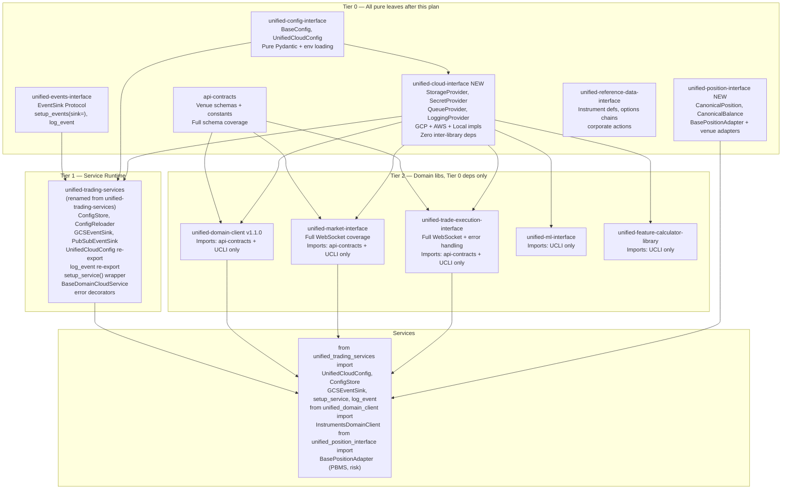

# Plan 2 — Library Ecosystem: New Libraries + Stage 2 Split

> **Execute SECOND.** Starts only after Plan 1 (Library Foundation) fully merges to main.
> **Absorbs**: `ucs_quickmerge_unblock_8bf08dc3` Stage 2 (PRs E–G), `io_interface_architecture_4c0c9336` ALL phases, `architecture_finalization_47c7e2e7` SSOT items.

---

## ⚠️ REFACTOR-ONLY RULE (Applies to All PRs in This Plan)

Same rule as Plan 1: **DO NOT run full test suites during any PR in this plan.** Tests will break because Tier 2 libs and services are changing their import sources simultaneously. Fixing tests mid-refactor is wasted effort.

**Full testing runs ONLY after this plan's structural work is complete.** See Plan 3 "Testing Phase."

---

## 🌐 AWS CLOUD-AGNOSTIC RULE

**All AWS implementations moved from UCS to UCLI must be moved intact and complete.** Do not downgrade, stub, or remove any AWS implementation during the migration. UCLI must support `CLOUD_PROVIDER=aws` fully on day 1. We have no AWS SA currently, so: unit tests mock boto3 (required), integration tests skip without AWS creds (expected). The code must be production-ready.

---

## UCLI Module Map: Exact Target Layout (9 source files)

> This is the authoritative structure for `unified-cloud-interface`. Do not add modules without justification. Do not merge files that exceed ~600 lines.

```
unified-cloud-interface/
├── unified_cloud_interface/
│   ├── __init__.py             # all public exports (ABCs + factory fns + data models)
│   ├── abstractions.py         # StorageClient, SecretClient, QueueClient, LoggingProvider,
│   │                           #   CacheProvider, AuthProvider ABCs (Protocol-based)
│   │                           #   + data models: BlobMetadata, SecretMetadata, StorageBlob
│   ├── factory.py              # get_storage_client(), get_secret_client(), get_queue_client(),
│   │                           #   get_logging_client(), get_cache_client()
│   │                           #   Routes via CLOUD_PROVIDER env var: gcp | aws | local
│   ├── constants.py            # CloudProvider StrEnum (GCP, AWS, LOCAL), get_cloud_provider()
│   │                           #   Merged from UCS core/provider.py + core/cloud_constants.py
│   ├── auth.py                 # AuthProvider ABC + GoogleOIDCAuth
│   │                           #   Moved from UCS auth/oidc_auth.py (Plan 1 PR B transitional home)
│   ├── cache.py                # CacheProvider ABC + RedisProvider
│   │                           #   Re-implemented from deleted UCS redis_cache.py
│   └── providers/
│       ├── __init__.py         # re-exports all provider classes
│       ├── gcp.py              # GCSStorageClient, GCPSecretClient, PubSubQueueClient,
│       │                       #   GCPLoggingProvider + async GCS variants
│       │                       #   Merged from UCS: gcp_clients.py + async_gcp_clients.py + secret_manager.py
│       ├── aws.py              # S3StorageClient, AWSSecretClient, SQSQueueClient,
│       │                       #   AWSCloudWatchProvider
│       │                       #   Moved intact from UCS aws_clients.py — DO NOT MODIFY AWS IMPLS
│       └── local.py            # LocalStorageProvider (pathlib), LocalSecretProvider (env vars),
│                               #   LocalQueueProvider (asyncio.Queue) — for tests + local dev
├── tests/unit/
│   ├── test_gcp_providers.py   # Mock google-cloud-* SDKs; test all GCP implementations
│   ├── test_aws_providers.py   # Mock boto3 fully; test ALL AWS implementations; NEVER skip
│   └── test_local_providers.py # No mocking needed; test LocalStorage/Secret/Queue
├── pyproject.toml              # zero inter-library deps; cloud SDKs as optional extras:
│                               #   google-cloud-storage, google-cloud-secret-manager,
│                               #   google-cloud-pubsub as optional [gcp] extra
│                               #   boto3 as optional [aws] extra
│                               #   redis as optional [cache] extra
├── cloudbuild.yaml
├── scripts/quickmerge.sh
└── pyrightconfig.json
```

**Total: 9 source files + 2 `__init__.py` files = 11 total Python files at v1.0.0.**
**UCS after UCLI split (UTS core/): 14 source files + `__init__.py` = 15 modules max.**

---

## Final Target Architecture (this plan delivers)



> **Diamond dep note**: Both UTS (Tier 1) and Tier 2 libs import UCLI (Tier 0). This is safe — Python loads modules once and caches in `sys.modules`. A shared leaf dependency creates zero coupling between its dependents. The only problem would be a cycle (UCLI → UTS or UCLI → UDS), which is impossible since UCLI is a pure leaf with no inter-library imports.

---

## Batch 1 — Fully Parallel (all 4 agents start simultaneously after Plan 1 merges)

### Agent 1 — Create `unified-cloud-interface` (new repo)

**Repo layout**:

```
unified-cloud-interface/
├── unified_cloud_interface/
│   ├── __init__.py          # exports all ABCs + factory functions
│   ├── base.py              # Protocol ABCs (no ABC inheritance, just Protocol)
│   ├── factory.py           # get_storage_client(), get_secret_client(), etc.
│   └── providers/
│       ├── gcp.py           # GCPStorageProvider, GCPSecretProvider, GCPQueueProvider, GCPLoggingProvider
│       ├── aws.py           # AWSStorageProvider, AWSSecretProvider, AWSQueueProvider, AWSLoggingProvider
│       └── local.py         # LocalStorageProvider (pathlib), LocalSecretProvider (env), LocalQueueProvider (asyncio.Queue)
├── tests/unit/
├── pyproject.toml           # zero inter-library deps; cloud SDKs as optional extras
├── cloudbuild.yaml
├── scripts/quickmerge.sh    # library template
└── pyrightconfig.json
```

**Provider ABCs** (all take primitive params — never Pydantic config objects):

```python
# unified_cloud_interface/base.py
from typing import Callable, Protocol

class StorageProvider(Protocol):
    async def upload_bytes(self, bucket: str, path: str, data: bytes) -> None: ...
    async def download_bytes(self, bucket: str, path: str) -> bytes: ...
    async def list_blobs(self, bucket: str, prefix: str) -> list[str]: ...
    async def delete_blob(self, bucket: str, path: str) -> None: ...

class SecretProvider(Protocol):
    async def get_secret(self, name: str, project_id: str, version: str = "latest") -> str: ...

class QueueProvider(Protocol):
    async def publish(self, topic: str, data: bytes, attributes: dict[str, str] | None = None) -> str: ...
    async def subscribe(self, subscription: str, callback: Callable[[bytes, dict[str, str]], None]) -> None: ...

class LoggingProvider(Protocol):
    """Routes Python stdlib log records to cloud structured logging.
    Distinct from EventSink (unified-events-interface) — that is for lifecycle events."""
    def emit(self, severity: str, message: str, labels: dict[str, str] | None = None) -> None: ...
```

**Factory**:

```python
# unified_cloud_interface/factory.py
import os

def get_storage_client(provider: str | None = None) -> StorageProvider:
    p = provider or os.environ.get("CLOUD_PROVIDER", "gcp")
    match p:
        case "gcp":   return _gcp_storage()
        case "aws":   return _aws_storage()
        case "local": return _local_storage()
        case _: raise ValueError(f"Unknown CLOUD_PROVIDER: {p!r}. Valid: gcp, aws, local")
```

Same pattern for `get_secret_client()`, `get_queue_client()`, `get_logging_client()`.

**UCS delegation** (after UCLI is published, UCS delegates raw ops to it):

```python
# unified_trading_services/factory.py — updated to delegate
from unified_cloud_interface import get_storage_client as _ucli_storage

def get_storage_client(provider: str | None = None):
    """Backward-compat: delegates to unified-cloud-interface."""
    return _ucli_storage(provider)
```

### Agent 2 — api-contracts schema expansion + UPI creation

**api-contracts Phase 1** — add to `api_contracts/`:
- `schemas/derivatives.py`: FundingRate, Liquidation, SettlementPrice, OptionsChain, OptionGreeks
- `schemas/defi.py`: Swap, LiquidityPool, OraclePrice, StakingRate, LendingRate
- `schemas/errors.py`: DatabentoError, ErrorClassification (retry_safe/reconnect per venue)
- `schemas/websocket.py`: SubscribeRequest, UnsubscribeRequest, HeartbeatMessage per venue
- `vcr/coinbase/`, `vcr/deribit/`, `vcr/okx/`: Add VCR cassettes

**UPI creation (Phase 3)**:

```
unified-position-interface/
├── unified_position_interface/
│   ├── schemas.py           # CanonicalBalance, CanonicalPosition, CanonicalAccountSnapshot, CanonicalSettlement
│   ├── base.py              # BasePositionAdapter ABC
│   ├── adapters/
│   │   ├── binance.py, bybit.py, okx.py, deribit.py
│   │   ├── hyperliquid.py, upbit.py, ibkr.py, ccxt.py
│   └── factory.py
├── pyproject.toml           # deps: api-contracts + unified-cloud-interface
└── ...
```

ADR: `position-balance-monitor-service` depends on BOTH UPI (CeFi) AND `unified-defi-execution-interface` (DeFi) — two separate adapters, not one merged interface.

### Agent 3 — UMI + UTEI completion

**UMI Phase 2** — add to `unified_market_interface/`:
- `schemas.py`: `CanonicalFundingRate`, `CanonicalLiquidation`, `CanonicalSwap`, `CanonicalLiquidityPool`, `CanonicalOraclePrice`, `CanonicalStakingRate`
- `adapters/bybit_ws.py`, `adapters/coinbase_ws.py`, `adapters/deribit_ws.py`, `adapters/okx_ws.py`: WebSocket handlers with subscribe/reconnect/backfill/dispatch
- Complete Aster onchain_perps adapter

**UTEI Phase 4** — add to `unified_trade_execution_interface/`:
- `ws_feeds/`: WebSocket order update feeds for Binance, Bybit, OKX, Deribit, Hyperliquid with reconnect + state recovery
- `schemas.py`: `CanonicalPartialFill`, `CanonicalOrderRejection` (with `retry_safe: bool`), `CanonicalOrderAmendment`
- `error_map.py`: venue → error_code → `(retry_safe, reconnect)` action mapping using api-contracts error schemas

**Note**: MDPS UMI dependency is schema-only in live mode (ADR-2026-02-26-B). MDPS imports `CanonicalTrade`, `CanonicalCandle` for type annotations only; it does NOT instantiate WS handlers. Live data arrives via co-deployed MTDH. Do NOT add WS handler instantiation in MDPS.

### Agent 4 — SSOT + Codex alignment

**workspace-manifest.json additions**:

```json
"tier_rules": {
  "0": { "allowed_from": [], "description": "Pure leaf — no inter-library imports" },
  "1": { "allowed_from": [0], "description": "Service runtime — imports Tier 0 only" },
  "2": { "allowed_from": [0], "description": "Domain libs — imports Tier 0 only, no Tier 1" },
  "service": { "allowed_from": [0, 1, 2], "description": "Services import from all tiers" },
  "ui": { "allowed_from": [], "description": "TypeScript — separate QG rules" }
}
```

Add `"arch_tier"` to each repo:
- `api-contracts`, `unified-config-interface`, `unified-events-interface`, `unified-cloud-interface`, `execution-algo-library`, `matching-engine-library`, `unified-defi-execution-interface` → `"arch_tier": 0`
- `unified-trading-services` (and future `unified-trading-services`) → `"arch_tier": 1`
- `unified-domain-client`, `unified-market-interface`, `unified-trade-execution-interface`, `unified-ml-interface`, `unified-feature-calculator-library`, `unified-position-interface`, `unified-reference-data-interface` → `"arch_tier": 2`
- All 14 services → `"arch_tier": "service"`
- All UI repos → `"arch_tier": "ui"`

**Create `TIER-ARCHITECTURE.md`** at `unified-trading-codex/05-infrastructure/unified-libraries/TIER-ARCHITECTURE.md`:
- Canonical tier diagram (same as final architecture above)
- Tier rules table (what each tier can import from)
- Allowed import patterns per tier with code examples
- Forbidden patterns (Tier 2 importing from Tier 1, intra-tier imports)
- Diamond dependency explanation (UCLI shared between Tier 1 and Tier 2 is safe)
- Reference to QG enforcement (STEP 5.6 in quality-gates-service-template.sh)

**Rewrite dependency-matrix.md** sections:
- Rename "Migration Priority Tiers" section → "Service Adoption Priority" (to avoid confusion with arch tiers)
- Add new top section "Library Architecture Tiers" with the tier diagram and tier rules
- Update library descriptions: UDS (api-contracts + UCLI only), UCS v2.2.0 (no domain exports, UTS service runtime API), new UCLI entry, new UPI entry, new URDI entry

---

## Batch 2 — Sequential (after Batch 1 merges)

### PR F — Tier 2 lib migration

4 parallel agents, each handles a set of libraries:

```
Agent A: UDS — switch pyproject.toml dep from unified-trading-services → unified-cloud-interface
Agent B: UMI — same pyproject switch
Agent C: UTEI + UML — same pyproject switch
Agent D: UFC + any remaining libs — same pyproject switch
```

Per-library changes:
```toml
# pyproject.toml
# REMOVE:
"unified-trading-services>=2.2.0,<3.0.0",
# ADD:
"unified-cloud-interface>=1.0.0,<2.0.0",
```

Source code: replace `from unified_trading_services import get_storage_client` with `from unified_cloud_interface import get_storage_client` in all Tier 2 lib source (not tests).

**Service enforcement** (parallel with PR F, io_interface Phase 6):
- MTDH: remove `app/venues/` and `engine/venues/`; wire all venue adapters through `unified_market_interface`
- execution-services: delete `legacy/adapters/venues/` ExternalVenueAdapter; verify all orders route through UTEI
- PBMS: add `unified-position-interface` + keep `unified-defi-execution-interface`; replace direct venue calls with BasePositionAdapter

**feature-calculator-library fix** (parallel):
- Migrate from Poetry → uv (`pyproject.toml` rewrite, `uv lock`, delete `poetry.lock`)
- Fix `requires-python = ">=3.11"` → `">=3.13,<3.14"`
- Declare `unified-cloud-interface` dep (not UCS)
- Add `scripts/quickmerge.sh` (library template)
- Add `pyrightconfig.json`

### PR G — UCS rename → unified-trading-services

**Step 1** (this PR): Add alias package:
```python
# unified_trading_services/__init__.py
"""unified-trading-services — service runtime orchestration layer.

This package is unified-trading-services renamed.
During migration window, both package names are available.
"""
from unified_trading_services import *  # backward compat alias
from unified_trading_services import __all__ as __all__  # re-export __all__
```

Add `unified-trading-services` to `pyproject.toml` as an installable package name.

Update workspace-manifest.json: add `unified-trading-services` entry, mark `unified-trading-services` as deprecated alias.

**Step 2** (separate PR, ~2 weeks later): Migrate all 14 services to use `unified_trading_services` imports; remove the alias; rename GitHub repo.

### URDI Creation (parallel with PR G)

```
unified-reference-data-interface/
├── unified_reference_data_interface/
│   ├── schemas.py           # InstrumentDefinition, OptionsChain, ExpiryCalendar, CorporateAction
│   ├── base.py              # BaseReferenceDataAdapter ABC
│   ├── adapters/            # venue-specific REST adapters
│   └── factory.py
├── pyproject.toml           # deps: api-contracts + unified-cloud-interface
└── ...
```

Wire instruments-service to URDI: replace direct exchange REST calls with URDI adapters.

---

## Execution Order Summary

> **REFACTOR-ONLY. NO TEST SUITES.** Ordering is strictly bottom-up in the dependency chain.
> UCLI (Tier 0) must exist and be published BEFORE Tier 2 libs or services can reference it.
> Tier 2 migration (PR F) cannot start until UCLI (PR E) is published to Artifact Registry.
> Service pyproject.toml alignment (pr-f-service-pytoml) runs parallel with Tier 2 migration.
> Full testing deferred to Plan 3 Testing Phase.

```
AUDIT STATUS (2026-02-26 — UPDATED):

--- PHASE 1: CODE CHANGES (no commits, no quickmerge, no tests) ---

BATCH 1 — ALL DONE (ran in parallel after Plan 1 Phase 1):
  Agent 1: UCLI repo creation          ✅ DONE — unified-cloud-interface v1.0.0 EXISTS
             Files: __init__.py, abstractions.py, auth.py, cache.py, constants.py,
                    factory.py, providers/__init__.py, providers/gcp.py, providers/aws.py,
                    providers/local.py
             Tests: test_abstractions.py, test_aws_providers.py, test_factory.py,
                    test_gcp_providers.py, test_local_providers.py
             quickmerge.sh present. Zero inter-library deps.
  Agent 2: UPI creation                ✅ DONE — unified-position-interface v1.0.0 EXISTS
             Files: __init__.py, adapters/, base.py, factory.py, schemas.py
             No forbidden Tier 1 deps.
  Agent 3: UMI + UTEI WebSocket        ✅ DONE
             UMI: latest commit adds CanonicalFundingRate/Liquidation/Swap schemas + WS handlers
             UTEI: latest commit adds CanonicalPartialFill/OrderRejection/OrderAmendment + ws_feeds.py
             Both use unified-cloud-interface dep only.
  Agent 4: SSOT + codex alignment      ⏳ NOT DONE — batch1-ssot still pending

STEP 2 — Tier 2 lib pyproject.toml deps:
  PR F tier2 migration:                ✅ DONE
    - UDS v1.1.2: api-contracts only (no Tier 1 deps) ✅
    - UMI: unified-cloud-interface>=1.0.0 ✅
    - UTEI: unified-cloud-interface>=1.0.0 ✅
    - UML (unified-ml-interface): unified-cloud-interface>=1.0.0 ✅
    - UFC (feature-calculator-library): unified-cloud-interface>=1.0.0, Python 3.13 ✅

  PR F Service pyproject.toml:         ⏳ PARTIALLY DONE
    CLEAN (no direct cloud deps):
      ml-inference-service, risk-and-exposure-service, features-calendar-service (3 clean)
    STILL HAS DIRECT CLOUD DEPS IN PYPROJECT.TOML:
      instruments-service (boto3), market-tick-data-handler (google-cloud-* + boto3),
      market-data-processing-service (google-cloud-storage + boto3),
      strategy-service (boto3), ml-training-service (boto3),
      execution-services (google-cloud-*),
      position-balance-monitor-service (google-cloud-pubsub),
      features-delta-one-service (google-cloud-storage),
      features-onchain-service (google-cloud-storage),
      features-volatility-service (google-cloud-storage)
    GOOD NEWS: None of these services import from google.cloud or boto3 in their
    source code — only pyproject.toml needs cleanup. Mechanical change only.

  PR F Feature Calc Fix:               ✅ DONE (Python 3.13, setuptools, UCLI dep)

  PR F Service enforcement (MTDH, exec, PBMS): ⏳ CHECK PENDING
    market-tick-data-handler has direct google-cloud-* in pyproject.toml (see above);
    pending verification that all source imports are routed through UCLI/UTS.

UCS INTERNAL MIGRATION (NEW — not in original todos):
  The 10 UCLI-destined files are STILL IN UCS core/:
    gcp_clients.py, async_gcp_clients.py, aws_clients.py, secret_manager.py,
    queue_abstraction.py, storage_abstraction.py, cloud_constants.py,
    cloud_auth_factory.py, client_factory.py, cloud_config.py
  AND UCS still has domain/ package (8 files) + domain exports in __init__.py.
  UCS currently has 26 core modules (target ≤15 after this migration).
  This migration must happen BEFORE pr-g-rename:
    → Delete UCLI-destined files from UCS core/
    → Update UCS __init__.py to import from UCLI instead
    → Delete UCS domain/ package (or keep for backward compat until pr-g)
    → Remove UCS domain exports: StandardizedDomainCloudService, DomainValidationConfig,
      DomainValidationService (also tracked in Plan 1 Step 5a)
  Add new todo: pr-f-ucs-internal-migration

STEP 3 — PR G rename:
  pr-g-rename: unified_trading_services alias package    ⏳ NOT STARTED
  pr-g-urdi: URDI creation                               ⏳ NOT STARTED

--- PHASE 2: COMMIT (quickmerge bottom-up, max 6 parallel) ---
GATE: ALL Phase 1 code changes complete (Plans 1 AND 2) before any quickmerge.
Order: UCLI → UPI → api-contracts → UCI → UEI → UCS (after internal migration) →
       UDS → UMI/UTEI/UML/UFC (parallel) → 14 services → UTS rename alias

--- PHASE 3: TESTING (see Plan 3) ---
After all quickmerges green. T0 → T1 → T2 → instruments-service ONLY.
```
