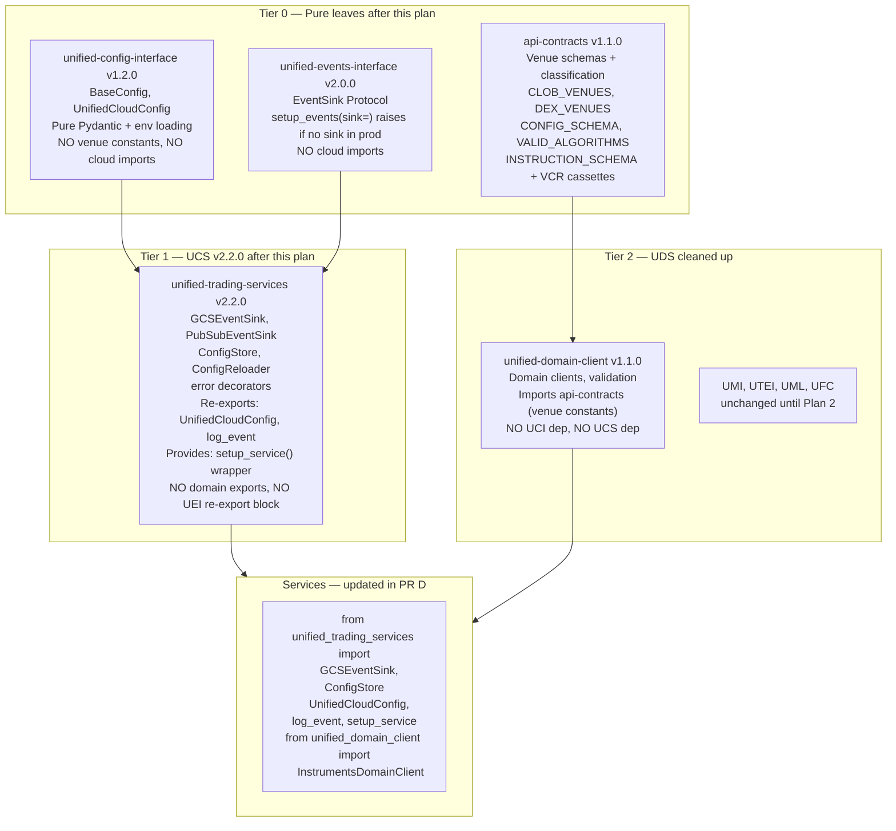

# Plan 1 — Library Foundation: Fix All Library Architecture

> **Execute FIRST.** Plans 2 and 3 start only after all PRs in this plan merge to main.
> **Absorbs**: `ucs_quickmerge_unblock_8bf08dc3` Stage 1, `break_circular_deps_fix_api-contracts_1cf7f491` remaining, `ucs_domain_boundary_refactor_f8bfccd7` remaining phases, `architecture_finalization_47c7e2e7` core items 1–6.

---

## Final Target Architecture (this plan delivers)



---

## Cycles Being Eliminated

### Cycle A: UCS ↔ UCI (eliminated by PR A + B)

```
UCS/persistence.py  ──TYPE_CHECKING──▶ UCI.BaseConfig         [removed in PR B]
UCS/reloader.py     ──TYPE_CHECKING──▶ UCI.BaseConfig         [removed in PR B]
UCS/reloader.py:209 ──lazy import───▶  UCI.load_config        [removed in PR B]
UCI/base_config.py  ──lazy import───▶  UCS.get_secret         [removed in PR A]
UCI/base_config.py  ──lazy import───▶  UCS.get_storage_client [removed in PR A]
UCI/loaders.py:157  ──lazy import───▶  UCS.get_storage_client [removed in PR A]
```

### Cycle B: UCS ↔ UEI (eliminated by PR B + C)

```
UCS/__init__.py lines 267-284  ──try/except re-export──▶ UEI.setup_events     [removed in PR B]
UEI/batch_writer.py            ──direct import──────────▶ UCS.get_storage_client [deleted in PR C]
UEI/live_writer.py             ──direct import──────────▶ UCS.get_pubsub_*      [deleted in PR C]
```

---

## ⚠️ REFACTOR-ONLY RULE (Applies to All PRs in This Plan)

**DO NOT run or fix full test suites during any PR in Plans 1 or 2.** Tests will break during intermediate refactoring states because:
- Tier 2 libs still import UCS during Plan 1 while UCS internals are being restructured
- Services still use old import paths while libraries are being reorganised
- UCLI doesn't exist yet, so anything that eventually depends on it will fail

**Run only**: `bash scripts/quickmerge.sh "message"` with `--skip-tests` if supported, OR commit the structural change and accept that CI test failures are expected during this period. Document each known-broken test in the PR description.

**Full testing runs ONLY** after Plan 2 is structurally complete. See Plan 3 "Testing Phase" for the comprehensive bottom-up test execution order: Tier 0 → Tier 1 → Tier 2 → instruments-service only.

---

## 🌐 AWS CLOUD-AGNOSTIC RULE (Non-Negotiable)

**ALL AWS code paths MUST be kept, completed, and unit-tested throughout this plan.** The goal is transparent cloud-agnostic operation — the only deployment difference is setting `CLOUD_PROVIDER=gcp` vs `CLOUD_PROVIDER=aws`. The system must be ready for AWS production deployment at any time, even if we are currently running on GCP.

**We do NOT have an AWS service account currently.** Therefore:
- ✅ **DO**: Unit-test ALL AWS code paths by mocking boto3 with `MagicMock(spec=...)` — these tests must pass
- ✅ **DO**: Build all AWS implementations fully (AWSSecretClient, SQSQueueClient, S3StorageClient, AWSCloudWatchProvider)
- ✅ **DO**: Mark any real-endpoint AWS tests as `@pytest.mark.integration` and skip when no AWS creds
- ❌ **NEVER**: Delete, stub out, or `raise NotImplementedError` in any AWS implementation
- ❌ **NEVER**: Skip AWS unit tests due to "missing credentials" — they mock, they don't need creds
- ❌ **NEVER**: Create `aws_storage_writer.py` / `aws_storage_loader.py` style stubs that inherit GCS base classes — use `BaseCloudWriter`/`BaseCloudLoader` which route transparently via `get_storage_client()`

---

## UCS Module Map: Before → After This Plan → After Plan 2

> The agent executing this plan MUST keep `core/` at or below 15 modules after all plans complete.
> Track this count after every PR.

### Current State — UCS core/ (30 files, ~8,500 lines)

| File | Lines | Fate |
|---|---|---|
| `__init__.py` | 83 | Keep |
| `async_gcp_clients.py` | 372 | **MOVE** → UCLI `providers/gcp.py` (Plan 2 PR E) |
| `aws_clients.py` | 383 | **MOVE** → UCLI `providers/aws.py` (Plan 2 PR E) |
| `client_factory.py` | 344 | **MOVE** → UCLI `factory.py` (Plan 2 PR E) |
| `cloud_auth_factory.py` | 492 | **MOVE** → UCLI `auth.py` (Plan 2 PR E) |
| `cloud_config.py` | 111 | Keep in UTS |
| `cloud_constants.py` | 317 | **MOVE** → UCLI `constants.py` (Plan 2 PR E) |
| `cloud_data_provider.py` | 501 | **DELETE NOW** — domain layer superseded by UDS |
| `config.py` | 709 | **DELETE in PR B** — deprecated, superseded by UCI |
| `date_utils.py` | 177 | Keep in UTS |
| `dependency_checker.py` | 449 | Keep in UTS |
| `error_classification.py` | 171 | Keep in UTS |
| `error_decorators.py` | 143 | Keep in UTS |
| `error_handling.py` | 44 | **DELETE NOW** — pure re-export hub |
| `error_models.py` | 138 | Keep in UTS |
| `error_service.py` | 377 | Keep in UTS |
| `gcp_clients.py` | 482 | **MOVE** → UCLI `providers/gcp.py` (Plan 2 PR E) |
| `gcsfuse_helper.py` | 350 | Keep in UTS |
| `logging.py` | 440 | Keep in UTS |
| `parquet_schema_enforcer.py` | 287 | Keep in UTS |
| `provider.py` | 28 | **MOVE** → UCLI `constants.py` (Plan 2 PR E) |
| `queue_abstraction.py` | 57 | **MOVE** → UCLI `abstractions.py` (Plan 2 PR E) |
| `run_async.py` | 68 | Keep in UTS |
| `sampling_service.py` | 250 | **DELETE NOW** — zero consumers |
| `secret_abstraction.py` | 339 | **MOVE** → UCLI `abstractions.py` (Plan 2 PR E) |
| `secret_manager.py` | 493 | **MOVE** → UCLI `providers/gcp.py` integrated (Plan 2 PR E) |
| `signal_handler.py` | 310 | Keep in UTS |
| `storage_abstraction.py` | 596 | **MOVE** → UCLI `abstractions.py` (Plan 2 PR E) |
| `typed_decorators.py` | 174 | **DELETE NOW** — zero consumers |
| `unified_monitor.py` | 765 | Keep in UTS |
| `utils/csv_sampler.py` | 160 | **DELETE NOW** — zero consumers |

### After This Plan (Plan 1) — UCS core/ (~25 files — 5 deleted, UCLI not yet split)

Files `cloud_data_provider.py`, `error_handling.py`, `sampling_service.py`, `typed_decorators.py`, `utils/csv_sampler.py` are deleted. `config.py` deprecated/removed in PR B. UCLI-destined files still present but fully implemented (AWS plumbing complete in PR B3).

### After Plan 2 — UTS core/ (15 modules, target ceiling)

| Module | Lines | Role |
|---|---|---|
| `__init__.py` | — | Re-exports |
| `cloud_config.py` | ~111 | `CloudConfig`, `CloudTarget` |
| `date_utils.py` | ~177 | `parse_date`, `validate_date_range` |
| `dependency_checker.py` | ~449 | `BaseDependencyChecker` |
| `error_classification.py` | ~171 | Error taxonomy |
| `error_decorators.py` | ~143 | `@handle_api_errors`, `@handle_storage_errors` |
| `error_models.py` | ~138 | `TradingError`, `RetryableError` |
| `error_service.py` | ~377 | `ErrorService` |
| `event_sink.py` | ~150 | `GCSEventSink`, `PubSubEventSink`, `CompositeEventSink` ← NEW PR B |
| `gcsfuse_helper.py` | ~350 | `GCSFuseHelper` |
| `logging.py` | ~440 | `UnbufferedStreamHandler`, `logging_performance_monitor` |
| `parquet_schema_enforcer.py` | ~287 | `ParquetSchemaEnforcer` |
| `run_async.py` | ~68 | `run_async_from_sync` |
| `signal_handler.py` | ~310 | Graceful shutdown |
| `unified_monitor.py` | ~765 | `UnifiedMonitor` |

**14 source files + `__init__.py` = 15 modules. Do not exceed this without explicit architectural justification.**

---

## Pre-PR-A: UCS Legacy File Cleanup

> **Context**: A previous agent (before this plan was written) left uncommitted untracked files in
> `unified-trading-services` that contradict the target architecture (UCS must stay light — no Redis,
> no auth, no async service layer). These files were never committed and should be deleted before
> any PR work begins, so they can't accidentally get swept into a commit.

**Delete these untracked files in `unified-trading-services/`:**

```bash
# Run from within unified-trading-services/
rm -f unified_trading_services/core/redis_cache.py
rm -f unified_trading_services/core/redis_secret_manager.py
rm -rf unified_trading_services/auth/
rm -f unified_trading_services/async_reloader.py
rm -f unified_trading_services/core/async_cloud_service.py
rm -f unified_trading_services/core/async_error_service.py
rm -f unified_trading_services/core/async_signal_handler.py
rm -f unified_trading_services/core/async_unified_monitor.py
rm -f unified_trading_services/core/cache_migration.py
rm -f unified_trading_services/core/project_config.py
rm -rf unified_trading_services/docs/
rm -rf unified_trading_services/examples/
rm -f tests/test_redis_cache_integration.py
```

**Why delete (not commit):** Redis caching, OIDC auth, and async service utilities belong in separate
libraries or services — not in UCS. Adding them to UCS turns it back into the aggregator anti-pattern
we are fixing. If these are genuinely needed, the correct home is `unified-cloud-interface` (Plan 2)
for cloud primitives, or a dedicated service.

**Also fix in `unified-config-interface/`:**

1. **Remove orphaned `[tool.uv.sources]` entry** — `unified-trading-services = { path = "../unified-trading-services" }` in UCI's `pyproject.toml` is stale (UCS was removed from `[project.dependencies]` in v1.1.0). Delete the entire `[tool.uv.sources]` section if UCS was the only entry.

2. **Revert `.pre-commit-config.yaml` coverage hook** — the `coverage-check` pre-commit hook blocks work-in-progress commits. Coverage enforcement belongs in `quality-gates.sh` only. Keep the `quality-gates.sh` `MIN_COVERAGE=70` and `[tool.coverage]` pyproject.toml changes — those are correct.

---

## PR A — UCI v1.2.0

**Goal**: Make UCI a true Tier 0 leaf — zero imports from unified_trading_services.

**Files to change:**

| File | Change |
|------|--------|
| `unified_config_interface/base_config.py` | Delete `get_secret()`, `validate_cloud_resources()`, `validate_config_for_startup()`. Replace lazy UCS imports with `raise ValueError("Use unified_trading_services.get_secret_client() instead")` |
| `unified_config_interface/loaders.py` | Remove `_load_from_cloud_storage()`. Replace `gs://` / `s3://` branch with `raise ValueError("Cloud URIs require unified_trading_services.ConfigReloader — use load_config() for local/env only")` |
| `unified_config_interface/venue_config.py` | Delete `CLOB_VENUES`, `DEX_VENUES`, `VENUE_CATEGORY_MAP`, `ZERO_ALPHA_VENUES`, `CONFIG_SCHEMA`, `VALID_ALGORITHMS`, `VALID_INSTRUCTION_TYPES`, `REQUIRED_CONFIG_FIELDS`, `OPTIONAL_CONFIG_FIELDS`, `INSTRUMENT_TYPE_FOLDER_MAP` constants — all move to api-contracts |
| `unified_config_interface/__init__.py` | Remove exports of deleted constants and cloud-loading functions |
| `pyproject.toml` | Version `1.1.0` → `1.2.0`. Zero `unified-trading-services` dependency. |

**Also in PR A**: `ucs_domain_boundary Phase 0` leftovers — verify instruments-service, market-tick-data-handler, strategy-service, ml-training-service all have `unified-domain-client` in pyproject.toml (already done per plan status, just verify).

---

## PR B2 — api-contracts v1.1.0 (run in parallel with PR B)

**Goal**: Give api-contracts the venue constants and trading schema constants that are leaving UCI.

**Files to add/change:**

```python
# api_contracts/venue_constants.py  (NEW)
CLOB_VENUES: list[str] = ["binance", "bybit", "okx", "deribit", "coinbase", ...]
DEX_VENUES: list[str] = ["hyperliquid", "aevo", "aster", ...]
VENUE_CATEGORY_MAP: dict[str, str] = {...}
ZERO_ALPHA_VENUES: list[str] = [...]

# api_contracts/trading_schemas.py  (NEW)
CONFIG_SCHEMA: dict[str, type] = {...}
VALID_ALGORITHMS: list[str] = ["twap", "vwap", "iceberg", "sor", ...]
VALID_INSTRUCTION_TYPES: list[str] = [...]
REQUIRED_CONFIG_FIELDS: list[str] = [...]
OPTIONAL_CONFIG_FIELDS: list[str] = [...]
INSTRUCTION_SCHEMA: dict[str, type] = {...}
INSTRUMENT_TYPE_FOLDER_MAP: dict[str, str] = {...}
```

**Add cloudbuild.yaml** (api-contracts has no CI currently):

```yaml
# api-contracts/cloudbuild.yaml
steps:
  - name: 'python:3.13'
    entrypoint: 'bash'
    args: ['-c', 'pip install uv && uv pip install --system -e ".[dev]" && uv pip install --system twine && python -m twine upload --repository-url https://...artifactregistry.googleapis.com/... dist/*']
```

**Fix uv.lock**: Replace any git-tracked symlinks with `[tool.uv.sources]` path references.

---

## PR B — UCS v2.2.0

**Goal**: Clean UCS completely — add GCSEventSink, remove all backward-compat re-exports, remove domain exports, add UTS service runtime API. Four parallel agents work on non-overlapping files.

### Agent 1 — Add event_sink.py

```python
# unified_trading_services/event_sink.py  (NEW)
"""UEI EventSink Protocol implementations for UCS cloud backends."""
from __future__ import annotations
import json
import logging
from datetime import datetime, timezone

logger = logging.getLogger(__name__)

class GCSEventSink:
    """Writes lifecycle events to GCS as newline-delimited JSON."""
    def __init__(self, project_id: str, bucket: str, service_name: str) -> None:
        self._project_id = project_id
        self._bucket = bucket
        self._service_name = service_name

    def write_event(self, name: str, metadata: dict[str, object]) -> None:
        from unified_trading_services import get_storage_client
        client = get_storage_client()
        ts = datetime.now(timezone.utc).isoformat()
        record = json.dumps({"event": name, "service": self._service_name,
                             "timestamp": ts, "metadata": metadata})
        path = f"events/{self._service_name}/{ts[:10]}/events.jsonl"
        try:
            existing = client.download_bytes(self._bucket, path).decode()
        except Exception:
            existing = ""
        client.upload_bytes(self._bucket, path, (existing + record + "\n").encode())


class PubSubEventSink:
    """Publishes lifecycle events to a Pub/Sub topic (live mode)."""
    def __init__(self, project_id: str, topic: str, service_name: str) -> None:
        self._project_id = project_id
        self._topic = topic
        self._service_name = service_name

    def write_event(self, name: str, metadata: dict[str, object]) -> None:
        from unified_trading_services import get_pubsub_publisher_client
        publisher = get_pubsub_publisher_client()
        topic_path = f"projects/{self._project_id}/topics/{self._topic}"
        data = json.dumps({"event": name, "service": self._service_name,
                           "metadata": metadata}).encode()
        publisher.publish(topic_path, data)


class CompositeEventSink:
    """Writes to multiple sinks (e.g. GCS + PubSub in live mode)."""
    def __init__(self, sinks: list[GCSEventSink | PubSubEventSink]) -> None:
        self._sinks = sinks

    def write_event(self, name: str, metadata: dict[str, object]) -> None:
        for sink in self._sinks:
            try:
                sink.write_event(name, metadata)
            except Exception as e:
                logger.warning("EventSink write failed: %s", e)
```

Add to `__init__.py` exports: `GCSEventSink`, `PubSubEventSink`, `CompositeEventSink`.

### Agent 2 — Remove UEI re-export block

In `unified_trading_services/__init__.py`:
- Delete lines 267-284 (the `try: from unified_events_interface import ...` block)
- Remove `setup_events`, `publish_coordination_event`, `subscribe_coordination_events` from `__all__`

Also restore top-level imports in `persistence.py` and `reloader.py`:
```python
# Before (TYPE_CHECKING guard — no longer needed)
from typing import TYPE_CHECKING
if TYPE_CHECKING:
    from unified_config_interface import BaseConfig

# After (direct import — no cycle now that UCI has zero UCS deps)
from unified_config_interface import BaseConfig
```

Remove `_load_config_data_from_uri()` lazy import of `unified_config_interface.load_config` from `reloader.py` — replace with direct cloud storage read (UCS already has `get_storage_client()`).

### Agent 3 — Remove domain exports (ucs_domain_boundary Phase 3)

In `unified_trading_services/__init__.py`:
- Remove `BaseServiceConfig`, `get_config`, `get_unified_config`, `unified_config` from exports (Phase 3, currently `in_progress`)
- Add `DeprecationWarning` to `unified_trading_services/core/config.py` header: `raise DeprecationWarning("Use unified_config_interface.UnifiedCloudConfig directly")`

### Agent 4 — Add UTS service runtime API

In `unified_trading_services/__init__.py` add at the end of the imports section:

```python
# UTS Service Runtime API — re-exports and thin wrappers for service use
from unified_config_interface import UnifiedCloudConfig as UnifiedCloudConfig
from unified_events_interface import log_event as log_event

def setup_service(
    service_name: str,
    mode: str,
    sink: object | None = None,
) -> None:
    """Thin wrapper around setup_events() with sink= injection.

    Services call this instead of importing setup_events from unified_events_interface.
    Raises RuntimeError at startup if mode is not 'local'/'test' and no sink provided.
    """
    from unified_events_interface import setup_events
    setup_events(service_name=service_name, mode=mode, sink=sink)
```

Add `UnifiedCloudConfig`, `log_event`, `setup_service` to `__all__`.

---

## PR B3 — UCS AWS Plumbing Completion (parallel with PR B)

**Goal**: Close the 3 remaining gaps so `get_storage_client()`, `get_secret_client()`, and `get_queue_client()` all work transparently on both GCP and AWS by switching the `CLOUD_PROVIDER` env var. Integration tests continue testing only real GCS endpoints (no AWS SA). Unit tests mock boto3 and cover all AWS paths.

### Gap 1 — `AWSSecretClient` methods (core/aws_clients.py)

The class exists but has only `__init__`. Implement all `SecretClient` ABC methods:

```python
class AWSSecretClient(SecretClient):
    def get_secret(self, secret_name: str, version: str = "latest") -> str | None:
        try:
            kwargs = {"SecretId": secret_name}
            if version != "latest":
                kwargs["VersionId"] = version
            resp = self._client.get_secret_value(**kwargs)
            return resp.get("SecretString")
        except self._client.exceptions.ResourceNotFoundException:
            return None

    def blob_exists(self, bucket: str, blob_path: str) -> bool:
        try:
            self._client.head_object(Bucket=bucket, Key=blob_path)
            return True
        except ClientError as e:
            if e.response["Error"]["Code"] in ("404", "NoSuchKey"):
                return False
            raise
```

### Gap 2 — `GCPSecretClient` methods (core/gcp_clients.py)

Delegate all `SecretClient` methods to the existing `SecretManagerClient` from `secret_manager.py`:

```python
class GCPSecretClient(SecretClient):
    def __init__(self, project_id=None, credentials_path=None):
        from .secret_manager import SecretManagerClient
        self._sm = SecretManagerClient(project_id or get_project_id(), credentials_path)

    def get_secret(self, secret_name: str, version: str = "latest") -> str | None:
        return self._sm.get_secret(secret_name, version=version)

    @property
    def provider_name(self) -> str: return "gcp"
    # ... delegate all other methods
```

### Gap 3 — `QueueClient` abstraction (new core/queue_abstraction.py)

```python
class QueueClient(ABC):
    @abstractmethod
    def publish(self, topic: str, data: bytes, attributes: dict[str, str] | None = None) -> str: ...
    @abstractmethod
    def subscribe_once(self, subscription: str, timeout: float = 30.0) -> list[tuple[bytes, dict[str, str]]]: ...
    @abstractmethod
    def topic_exists(self, topic: str) -> bool: ...
    @abstractmethod
    def create_topic(self, topic: str) -> None: ...
    @abstractmethod
    def delete_topic(self, topic: str) -> None: ...
```

`PubSubQueueClient` in `gcp_clients.py`: wraps `get_pubsub_publisher_client()` / `get_pubsub_subscriber_client()`.
`SQSQueueClient` in `aws_clients.py`: maps PubSub topic → SQS queue URL; `publish` → `send_message`; `subscribe_once` → `receive_message` + `delete_message`.

Add `get_queue_client(provider=None) -> QueueClient` to `client_factory.py`.

### Gap 4 — `BaseCloudWriter` / `BaseCloudLoader` refactor (io/)

Rename `BaseGCSWriter` → `BaseCloudWriter` (keep alias). Replace GCS-specific blob path:
```python
# BEFORE (GCS-only)
blob = self.gcs_client.bucket(self.bucket).blob(path)
blob.upload_from_file(buffer, content_type="application/octet-stream")

# AFTER (cloud-agnostic — routes to GCS or S3 via get_storage_client())
buffer.seek(0)
get_storage_client().upload_bytes(self.bucket, path, buffer.read(),
                                   content_type="application/octet-stream")
```

`BaseCloudLoader`: replace `gcs_client.download_as_bytes()` with `get_storage_client().download_bytes(bucket, path)`.

DELETE `io/aws_storage_writer.py` and `io/aws_storage_loader.py`.

---

## PR C — UEI v2.0.0

**Goal**: Add EventSink Protocol. Remove cloud I/O from UEI entirely. Services inject sinks.

```python
# unified_events_interface/sink.py  (NEW)
from typing import Protocol, runtime_checkable

@runtime_checkable
class EventSink(Protocol):
    """Receives lifecycle events for cloud persistence.

    UCS provides GCSEventSink and PubSubEventSink implementations.
    Tests use MockEventSink. Services inject the appropriate sink at startup.
    UCS satisfies this Protocol structurally (duck typing) — no import of UEI needed by UCS.
    """
    def write_event(self, name: str, metadata: dict[str, object]) -> None: ...


class MockEventSink:
    """In-memory sink for tests. Captures all events for assertion."""
    def __init__(self) -> None:
        self.events: list[tuple[str, dict[str, object]]] = []

    def write_event(self, name: str, metadata: dict[str, object]) -> None:
        self.events.append((name, metadata))
```

Update `setup_events()` signature:
```python
def setup_events(
    service_name: str,
    mode: str,
    sink: EventSink | None = None,
) -> None:
    if mode not in ("local", "test") and sink is None:
        raise RuntimeError(
            f"setup_events() requires sink= in mode={mode!r}. "
            "Pass GCSEventSink from unified_trading_services for batch "
            "or PubSubEventSink for live mode."
        )
    ...
```

Delete `batch_writer.py` and `live_writer.py` entirely.

Add `EventSink`, `MockEventSink` to `__init__.py` exports.

---

## PR D — Services + UDS

### Batch A — 14 Services (4 parallel agents)

Per service pattern:
```python
# cli/main.py — BEFORE
from unified_config_interface import UnifiedCloudConfig
from unified_events_interface import setup_events, log_event

class ServiceConfig(UnifiedCloudConfig):
    ...

setup_events(service_name="svc", mode="batch")

# cli/main.py — AFTER
from unified_trading_services import (
    UnifiedCloudConfig,  # re-export from UCI via UCS
    GCSEventSink,
    setup_service,       # wrapper around setup_events
    log_event,           # re-export from UEI via UCS
)

class ServiceConfig(UnifiedCloudConfig):
    ...

setup_service(
    service_name="svc",
    mode="batch",
    sink=GCSEventSink(
        project_id=config.gcp_project_id,
        bucket=config.events_bucket,
        service_name="svc",
    ),
)
```

Tests pattern:
```python
# tests/unit/test_event_logging.py
from unified_trading_services import MockEventSink, setup_service

def test_setup_service_uses_sink():
    sink = MockEventSink()
    setup_service(service_name="test", mode="test", sink=sink)
    from unified_trading_services import log_event
    log_event("STARTED")
    assert ("STARTED", {}) in sink.events

def test_gcs_event_sink_importable():
    from unified_trading_services import GCSEventSink
    assert GCSEventSink is not None
```

### Batch B — UDS v1.1.0

`pyproject.toml` changes:
```toml
# Remove from [project.dependencies]:
# "unified-config-interface>=1.0.0,<2.0.0",   ← REMOVE
# "unified-trading-services>=2.0.0,<3.0.0",      ← REMOVE
# "unified-events-interface>=1.0.0,<2.0.0",    ← REMOVE (declared but unused)

# Add to [project.dependencies]:
"api-contracts>=1.1.0,<2.0.0",
```

`unified_domain_client/__init__.py` changes:
```python
# BEFORE — imports venue constants from UCI:
from unified_config_interface import (
    CLOB_VENUES, CONFIG_SCHEMA, DEX_VENUES, ...
    ConfigValidationError, ConfigValidator, validate_config, validate_config_file,
)

# AFTER — imports from api-contracts:
from api_contracts import (
    CLOB_VENUES, CONFIG_SCHEMA, DEX_VENUES, ...
    ConfigValidationError, ConfigValidator, validate_config, validate_config_file,
)
# Remove StandardizedDomainCloudService lazy re-export entirely
# (services import it from unified_trading_services directly)
```

---

## Post-PR-D Tasks

### ucs_domain_boundary Phase 6 — QG checks rollout

Add to `unified-trading-codex/06-coding-standards/quality-gates-service-template.sh`:

```bash
# STEP 5.3 — No domain imports from UCS
DOMAIN_FROM_UCS=$(rg 'from unified_trading_services import.*(market_category|DomainValidation|UnifiedCloudServicesConfig)' \
    --type py "$SOURCE_DIR/" 2>/dev/null || true)
[[ -n "$DOMAIN_FROM_UCS" ]] && {
    log_fail "Service imports domain symbols from UCS — use unified_domain_client instead"
    ((CODEX_VIOLATIONS++))
} || log_success "No domain imports from UCS"

# STEP 5.4 — setup_events/setup_service uses sink= in production
SETUP_NO_SINK=$(rg 'setup_(events|service)\s*\(' --type py \
    --glob "!tests/**" "$SOURCE_DIR/" 2>/dev/null | grep -v 'sink=' || true)
[[ -n "$SETUP_NO_SINK" ]] && {
    log_fail "setup_events()/setup_service() called without sink= in production code"
    ((CODEX_VIOLATIONS++))
} || log_success "setup_service() uses sink= in all production call sites"
```

### ucs_domain_boundary Phase 7 — Docs update

- `unified-trading-codex/05-infrastructure/unified-libraries/dependency-matrix.md`: add note that UEI is Tier 0 (no longer a UCS consumer), UDS now depends on api-contracts not UCI
- `unified-trading-services/README.md`: update architecture section to reflect clean exports
- `event-logging.mdc`: update with `setup_service(sink=GCSEventSink(...))` pattern, remove old `setup_events(service_name=..., mode=...)` without sink example

---

## Execution Order Summary

> **REFACTOR-ONLY. NO TEST SUITES.** All PRs below make structural code changes.
> Quality gates run ruff + basedpyright only (no pytest or minimal smoke imports).
> Full testing is deferred to Plan 3 Testing Phase after ALL structural work (Plans 1 + 2) completes.
> Ordering is strictly bottom-up in the dependency chain — never touch a higher-tier library
> while its lower-tier dependency is being restructured.

```
AUDIT STATUS (2026-02-26 — UPDATED):

--- PHASE 1: CODE CHANGES (no commits, no quickmerge, no tests) ---
Step 0:  cleanup-ucs-legacy        ✅ DONE (5 dead files deleted; NOTE: UCS __init__.py
                                    still exports 3 domain symbols: StandardizedDomainCloudService,
                                    DomainValidationConfig, DomainValidationService — remove these
                                    from __all__ and the import lines in __init__.py)
Step 1:  PR A (UCI v1.2.0)         ✅ DONE (pyrightconfig clean — no exclusions)
         PR B2 (api-contracts)      ✅ DONE v1.2.0 (schemas: defi, derivatives, errors, websocket
                                    + 17 venue schemas)
Step 2:  PR B3 (UCS AWS plumbing)  ✅ DONE (AWSSecretClient, SQSQueueClient in v2.2.0)
         PR B (UCS v2.2.0)         ✅ DONE (GCSEventSink/PubSubEventSink/CompositeEventSink/
                                    MockEventSink all exported; UEI dep in pyproject.toml)
         pr-b-ucs-fixup            ✅ ALL 5 GAPS RESOLVED (was incorrectly marked pending;
                                    conftest clean, UnifiedCloudServicesConfig not in __all__,
                                    pyrightconfig clean)
Step 3:  PR C (UEI v2.0.0)         ✅ DONE (setup_events, log_event, EventSink, MockEventSink
                                    all exported)
Step 4:  PR D Services (13/14)      ✅ DONE — all 13 services have GCSEventSink in prod code
                                    and latest commit is "PR D — add GCSEventSink"
                                    pnl-attribution-service: has GCSEventSink in main.py
                                    but branch 'main' has NO COMMITS YET — Phase 1 OK,
                                    needs git init + initial commit before Phase 2 quickmerge
         PR D UDS (v1.1.2)          ✅ DONE (clean: only api-contracts dep, no Tier 1 deps)
Step 5:  post-d tasks               ⏳ TWO REMAINING:
           (a) UCS domain exports: remove StandardizedDomainCloudService, DomainValidationConfig,
               DomainValidationService from UCS __init__.py + __all__ (domain/ package can remain
               for now as UDS still imports from it via path dep — delete in Plan 2 pr-g)
           (b) post-d-docs: Update dependency-matrix.md, README.md in UCS, cursor rules

--- PHASE 2: COMMIT (quickmerge bottom-up by tier, max 6 parallel) ---
Order: api-contracts → UCI → UEI → UCS → UDS → pnl-attribution → 13 services
GATE: pnl-attribution must have initial commit before quickmerge.
GATE: UCS domain export cleanup (Step 5a) must be done before UCS quickmerge.
Only start after ALL Phase 1 code changes are complete across all repos.
Gate: each tier fully merged before next tier starts.

--- PHASE 3: TESTING (see Plan 3) ---
After all Phase 2 quickmerges green: T0 → T1 → T2 → instruments-service only.

ADDITIONAL NOTE: instruments-service tests/unit/test_event_logging.py uses old event
patterns (UPLOAD_STARTED/UPLOAD_COMPLETED). Update to MockEventSink pattern before
Phase 3 testing starts. This is a pre-testing code fix, not a Plan 1 item.
```

**DO NOT run quickmerge on any individual repo mid-refactor. All code changes land in one batch per repo, committed only after all repos are ready.**

**CURRENT STATE: Plan 1 is ~90% done. Remaining before Plan 2 can start:**
1. `pr-b-ucs-fixup` — fix 5 UCS gaps (GCSEventSink export, UEI dep, conftest, UnifiedCloudServicesConfig, UCI pyrightconfig)
2. `pr-d-pnl-service-investigate` — resolve pnl-attribution-service missing .git
3. `post-d-ucs-domain-qg` — QG rollout to 28 repos
4. `post-d-docs` — docs/cursor rules update
