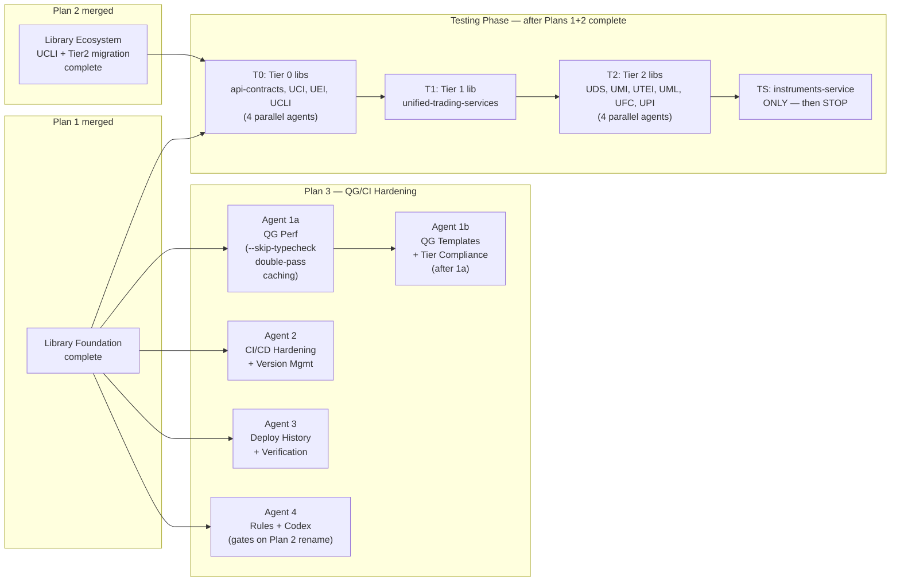

# Plan 3 — Standards Enforcement: Quality Gates, CI/CD, and Codex Hardening

> **Execute THIRD (or QG/CI work in parallel with Plan 2; Testing Phase after both Plans 1+2 complete).**
> QG hardening + CI/CD work starts after Plan 1 merges — independent of Plan 2.
> Agent 4 (rules/codex) gates on Plan 2 Stage 2 (rename) for import name updates.
>
> **Testing Phase** (bottom-up: T0 → T1 → T2 → TS) gates on **both** Plan 1 **and** Plan 2 being
> structurally complete. Do NOT start testing while libraries are still being restructured.
>
> **AUDIT STATUS (2026-02-26)**: Plan 3 has NOT started — all todos pending.
> Plan 1 still has fixup work (pr-b-ucs-fixup, pnl-attribution-service, post-D tasks).
> Plan 2 has not started. QG/CI agents (1, 2, 3) can start after Plan 1 fixups complete.
>
> **Already completed** (do NOT re-run): quality_gates Phase 1 (QG rollout ✅), Phase 2 (quickmerge rollout ✅), rules_cleanup Phase A1 ✅, B1 ✅, B2 ✅, C ✅, D ✅, E ✅.
>
> **Absorbs**: `quality_gates_&_ci_cd_overhaul_8d48cc67` remaining phases (0, 3–7), `rules_and_codex_cleanup_6310069f` remaining phases (A2, B3, F), `architecture_finalization_47c7e2e7` QG items.

---

## Execution Overview (4 parallel agents)



---

## Agent 1a — QG Performance (run first)

> **Run before Agent 1b.** Template-level changes that every repo inherits. Rollout is mechanical (same diff in 2 repos + template). ~15 min.

### 1. Add `--skip-typecheck` flag to codex QG template

File: `unified-trading-codex/06-coding-standards/quality-gates-service-template.sh`

In the MODE parsing section add `--skip-typecheck) SKIP_TYPECHECK=true ;;` and in usage comment add the flag.

Wrap step `[4] TYPE CHECK` in the template:
```bash
if [ "$RUN_LINT" = true ] && [ "$SKIP_TYPECHECK" != "true" ]; then
    log_section "[4/6] TYPE CHECK"
    ... (existing basedpyright block) ...
fi
[ "$SKIP_TYPECHECK" = "true" ] && log_warn "Type check SKIPPED (--skip-typecheck flag)"
```

Apply the same change to:
- `unified-trading-codex/06-coding-standards/quality-gates-library-template.sh`
- `unified-trading-codex/05-infrastructure/quickmerge-templates/service-with-deps/scripts/quality-gates.sh`
- `unified-trading-codex/05-infrastructure/quickmerge-templates/service-no-deps/scripts/quality-gates.sh`
- `unified-trading-codex/05-infrastructure/quickmerge-templates/library/scripts/quality-gates.sh`

### 2. Update quickmerge template — double-pass

File: `unified-trading-codex/05-infrastructure/quickmerge-templates/service-with-deps/scripts/quickmerge.sh` (and service-no-deps + library variants).

Replace the single quality gates call with two passes:
```bash
# Pass 1: auto-fix only (ruff format + check --fix), skip basedpyright
log_section "Pass 1/2: auto-fix (ruff, no type check)"
bash scripts/quality-gates.sh --skip-typecheck
# Pass 2: full verify (ruff check --no-fix + basedpyright + tests)
log_section "Pass 2/2: full verify (includes basedpyright)"
bash scripts/quality-gates.sh --no-fix
```

This ensures basedpyright runs exactly once per quickmerge (not twice as it would if `--no-fix` were used for both passes).

### 3. Add `BASEDPYRIGHT_CACHE_DIR` to QG template

In the TYPE CHECK section, before the `run_timeout 120 basedpyright` invocation, add:
```bash
# basedpyright analysis cache — persists between runs to avoid cold-start re-analysis
export BASEDPYRIGHT_CACHE_DIR="${TMPDIR:-/tmp}/basedpyright-cache/${SERVICE_NAME:-$(basename "$PROJECT_ROOT")}"
mkdir -p "$BASEDPYRIGHT_CACHE_DIR"
```

### 4. Roll out `run_timeout` to repos missing it

Two repos have basedpyright without the portable `run_timeout` helper:
- `unified-trading-services/scripts/quality-gates.sh`
- `unified-config-interface/scripts/quality-gates.sh`

Copy the exact helper from the codex template (including perl fallback — critical for macOS without coreutils):
```bash
run_timeout() {
    local secs=$1; shift
    if command -v gtimeout &>/dev/null; then gtimeout "$secs" "$@"
    elif command -v timeout &>/dev/null; then timeout "$secs" "$@"
    elif command -v perl &>/dev/null; then perl -e 'alarm shift; exec @ARGV' -- "$secs" "$@"
    else "$@"; fi
}
```

Then wrap their existing `basedpyright` call: `run_timeout 120 basedpyright "$SOURCE_DIR/" ...`

### 5. Cursor rules update (thin pointers only)

`unified-trading-codex/` → `.cursor/rules/basedpyright-safety.mdc`: append one line under DO:
```
run_timeout 120 basedpyright <source_dir>/   # use run_timeout helper — see codex QG template SSOT
```

`.cursor/rules/safe-linting-execution.mdc`: same one-line addition. Do NOT copy full helper into rules — rules point to template SSOT.

### 6. Codex quality-gates.md — add QG Performance section

Add to `unified-trading-codex/06-coding-standards/quality-gates.md` a new section `## Quality Gate Performance`:
- `--skip-typecheck` flag: ruff-only auto-fix pass, skips basedpyright
- Double-pass pattern in quickmerge: pass 1 `--skip-typecheck`, pass 2 `--no-fix`
- `BASEDPYRIGHT_CACHE_DIR`: explicit temp dir for basedpyright analysis cache
- `run_timeout` helper: cross-platform timeout (gtimeout → timeout → perl) — Mac requires perl fallback since macOS `timeout` is not available without `brew install coreutils`
- Rule: basedpyright must always run with `run_timeout 120` through the helper (never raw `timeout`)

---

## Agent 1c — Cloud-Agnostic Test Standards

### Rule: Integration tests gate on GCP; unit tests are cloud-agnostic

```python
# ✅ CORRECT — unit test using mock StorageClient
from unittest.mock import MagicMock
from unified_trading_services import StorageClient

def test_write_parquet(tmp_path):
    mock_storage = MagicMock(spec=StorageClient)
    mock_storage.upload_bytes.return_value = "gs://bucket/path.parquet"
    writer = MyServiceWriter(bucket_name="test-bucket")
    writer._storage_client = mock_storage  # inject mock
    writer.write_parquet(df, "path.parquet")
    mock_storage.upload_bytes.assert_called_once()

# ✅ CORRECT — integration test gated on GCP creds
@pytest.mark.integration
def test_write_parquet_real_gcs(gcp_auth_info):
    credentials, project_id, _ = gcp_auth_info
    if credentials is None:
        pytest.skip("No GCP credentials")
    ...

# ❌ WRONG — unit test calling real GCS (breaks CI without creds)
def test_write_parquet():
    writer = MyServiceWriter(bucket_name="my-real-bucket")
    writer.write_parquet(df, "path.parquet")  # calls get_storage_client() → real GCS call
```

### QG STEP 5.7 — Real cloud calls in unit tests

```bash
# Check unit tests don't call real cloud APIs
UNIT_CLOUD_CALLS=$(rg 'get_storage_client\(\)|get_secret_client\(\)|get_queue_client\(\)' \
    --type py tests/unit/ 2>/dev/null | grep -v '\.mock\.' | grep -v 'MagicMock' || true)
[[ -n "$UNIT_CLOUD_CALLS" ]] && {
    log_fail "Unit tests call real cloud APIs — use MagicMock(spec=StorageClient) instead"
    echo "$UNIT_CLOUD_CALLS" | head -5
    ((CODEX_VIOLATIONS++))
} || log_success "Unit tests are cloud-agnostic"
```

---

## Agent 1b — QG Templates + Tier Compliance

### Fix deployment-v3 templates (quality_gates Phase 0)

- `unified-trading-deployment-v3/templates/service/scripts/quickmerge.sh`: Replace any `poetry` references with `uv pip install`
- `unified-trading-deployment-v3/templates/service/Dockerfile`: Replace `poetry install` with `uv pip install --system -e ".[dev]"`
- Create `unified-trading-codex/06-coding-standards/quickmerge-templates/` directory with 4 type-specific templates: `service/`, `library/`, `ui/`, `infrastructure/`
- Create `unified-trading-codex/06-coding-standards/quickmerge-architecture.md` (fixes stale ref in always-use-quickmerge.mdc)

### Add STEP 5.5 — Library Adoption Enforcement

Add to `unified-trading-codex/06-coding-standards/quality-gates-service-template.sh`:

```bash
# ============================================================
# STEP 5.5 — REQUIRED LIBRARY ADOPTION CHECK
# ============================================================
# Declarative list — set per-repo in the QG config section at top of this file.
# Empty array = skip check (for libraries and UIs).
REQUIRED_LIBRARY_IMPORTS=(
    "from unified_trading_services import"   # orchestration + runtime API (all services)
    "from unified_events_interface import"   # lifecycle events (if not using UTS re-export)
    "from unified_config_interface import"   # config base classes (all services)
    "from unified_domain_client import"    # domain clients (data services — comment out for UIs/pure-compute)
)

log_section "[5.5/6] REQUIRED LIBRARY ADOPTION"
ADOPTION_FAILURES=0
for required_import in "${REQUIRED_LIBRARY_IMPORTS[@]}"; do
    FOUND=$(rg "$required_import" --type py --glob "!tests/**" "$SOURCE_DIR/" 2>/dev/null || true)
    if [[ -z "$FOUND" ]]; then
        log_fail "Required library not used in production: $required_import"
        ((ADOPTION_FAILURES++))
        ((CODEX_VIOLATIONS++))
    else
        log_success "Library adopted: ${required_import%%import*}..."
    fi
done
[[ $ADOPTION_FAILURES -gt 0 ]] && log_fail "Library adoption FAILED: $ADOPTION_FAILURES required libraries missing"

# setup_events / setup_service must have sink= in production
SETUP_NO_SINK=$(rg 'setup_(events|service)\s*\(' --type py \
    --glob "!tests/**" --glob "!scripts/**" \
    "$SOURCE_DIR/" 2>/dev/null | grep -v 'sink=' || true)
[[ -n "$SETUP_NO_SINK" ]] && {
    log_fail "setup_events()/setup_service() called without sink= in production code"
    echo "$SETUP_NO_SINK" | head -5
    ((CODEX_VIOLATIONS++))
} || log_success "setup_service() uses sink= in all production call sites"
```

### Add STEP 5.6 — Tier Compliance Check

Add below STEP 5.5:

```bash
# ============================================================
# STEP 5.6 — ARCHITECTURE TIER COMPLIANCE CHECK
# ============================================================
# Set REPO_ARCH_TIER in the repo-specific config section at top of this file.
# Valid values: "0" "1" "2" "service" "ui"
REPO_ARCH_TIER="${REPO_ARCH_TIER:-service}"  # default to service if not set

log_section "[5.6/6] TIER COMPLIANCE (tier=$REPO_ARCH_TIER)"

if [[ "$REPO_ARCH_TIER" == "0" ]]; then
    # Tier 0: zero inter-library imports
    INTER_LIB=$(rg 'from unified_(cloud_services|trading_services|domain_services|market_interface|trade_execution|config_interface|events_interface|cloud_interface|ml_interface|feature_calculator|position_interface|reference_data) import' \
        --type py "$SOURCE_DIR/" 2>/dev/null || true)
    [[ -n "$INTER_LIB" ]] && {
        log_fail "Tier 0 library imports from another unified library — pure leaf required"
        echo "$INTER_LIB" | head -5
        ((CODEX_VIOLATIONS++))
    } || log_success "Tier 0 compliance: no inter-library imports"

elif [[ "$REPO_ARCH_TIER" == "2" ]]; then
    # Tier 2: must NOT import from Tier 1 (UCS/UTS)
    TIER1_IMPORTS=$(rg 'from unified_(cloud_services|trading_services) import' \
        --type py "$SOURCE_DIR/" 2>/dev/null || true)
    [[ -n "$TIER1_IMPORTS" ]] && {
        log_fail "Tier 2 library imports from Tier 1 (unified-trading-services/unified-trading-services) — forbidden"
        echo "$TIER1_IMPORTS" | head -5
        ((CODEX_VIOLATIONS++))
    } || log_success "Tier 2 compliance: no Tier 1 imports"

    # Tier 2: must NOT import from other Tier 2 libs (intra-tier isolation)
    # (add intra-tier check per library — configured in repo QG config section)
fi
```

### Rollout REPO_ARCH_TIER to all repos

Add `REPO_ARCH_TIER="<value>"` to the config section at the top of `scripts/quality-gates.sh` in every repo:

| REPO_ARCH_TIER value | Repos |
|---------------------|-------|
| `"0"` | api-contracts, unified-config-interface, unified-events-interface, unified-cloud-interface, execution-algo-library, matching-engine-library, unified-defi-execution-interface |
| `"1"` | unified-trading-services (and unified-trading-services after rename) |
| `"2"` | unified-domain-client, unified-market-interface, unified-trade-execution-interface, unified-ml-interface, unified-feature-calculator-library, unified-position-interface |
| `"service"` | All 14 services |
| `"ui"` | All UI repos (skip Python tier checks) |

Run with 4 parallel sub-agents (one per tier group).

### Update test_event_logging.py template

```python
# unified-trading-codex/06-coding-standards/test_event_logging_template.py
from unified_trading_services import GCSEventSink, MockEventSink, setup_service, log_event

def test_setup_service_requires_sink_in_production():
    """setup_service() must raise without sink= in production modes."""
    import pytest
    from unified_events_interface import setup_events
    with pytest.raises(RuntimeError, match="sink="):
        setup_events(service_name="test", mode="batch")  # no sink

def test_setup_service_uses_mock_sink_in_tests():
    sink = MockEventSink()
    setup_service(service_name="test-svc", mode="test", sink=sink)
    log_event("STARTED")
    assert any(name == "STARTED" for name, _ in sink.events)

def test_gcs_event_sink_importable():
    from unified_trading_services import GCSEventSink
    assert callable(GCSEventSink)
```

Update `instruments-service/tests/unit/test_event_logging.py` to match this template as the canonical reference.

### Codex updates

- `unified-trading-codex/03-observability/lifecycle-events.md`: add `setup_service(sink=GCSEventSink(...))` signature, GCSEventSink/PubSubEventSink/MockEventSink examples, "sink=None raises RuntimeError in production" rule
- `unified-trading-codex/06-coding-standards/quality-gates.md`: add "Library Adoption Enforcement" section documenting STEP 5.5 and STEP 5.6

---

## Agent 2 — CI/CD Hardening + Version Management

### Phase 3 — Version Management

**Auto-bump GitHub Action** (`.github/workflows/auto-bump.yml`):
```yaml
# Bumps patch version on every merge to main that doesn't already bump version
on:
  push:
    branches: [main]
jobs:
  auto-bump:
    runs-on: ubuntu-latest
    steps:
      - uses: actions/checkout@v4
      - name: Check if version was bumped
        run: |
          OLD_VERSION=$(git show HEAD^:pyproject.toml | grep 'version = ' | head -1)
          NEW_VERSION=$(grep 'version = ' pyproject.toml | head -1)
          if [[ "$OLD_VERSION" == "$NEW_VERSION" ]]; then
            # Bump patch version
            python scripts/bump-patch.py
            git commit -am "chore: auto-bump patch version"
            git push
          fi
```

**Unstable combination detection** in `scripts/pre-flight-audit.sh`:
```bash
# Warn if service pins a library version with known breaking changes
check_unstable_combinations() {
    # Read known-breaking versions from workspace-manifest.json
    # Fail if service declares a dep version that's in the breaking list
    python3 "$WORKSPACE_ROOT/scripts/check-unstable-combos.py" \
        --manifest "$WORKSPACE_ROOT/unified-trading-pm/workspace-manifest.json" \
        --pyproject pyproject.toml
}
```

**SemVer gate in quickmerge**: Before PR creation, verify that if any production file changed, version was bumped. If not, auto-bump patch and include in commit.

**Library version validation**: Extend to all 13 libraries (add `unified-cloud-interface`, `unified-trading-services`, `unified-position-interface`, `unified-reference-data-interface` to the version validation script).

### Phase 4 — CI/CD Hardening

**Cloud build polling** in `scripts/quickmerge.sh`:
```bash
# After triggering cloud build, poll for result
poll_cloud_build() {
    local BUILD_ID="$1"
    local TIMEOUT=300
    local ELAPSED=0
    while [[ $ELAPSED -lt $TIMEOUT ]]; do
        STATUS=$(gcloud builds describe "$BUILD_ID" --format='value(status)')
        case "$STATUS" in
            SUCCESS) log_success "Cloud build passed"; return 0 ;;
            FAILURE|TIMEOUT|CANCELLED) log_fail "Cloud build failed: $STATUS"; return 1 ;;
            *) sleep 30; ((ELAPSED+=30)) ;;
        esac
    done
    log_fail "Cloud build polling timed out after ${TIMEOUT}s"
    return 1
}
```

**Branch-based gate config** (`.quickmerge-config.yaml` per repo):
```yaml
# .quickmerge-config.yaml
skip_steps:
  - act_simulation    # skip for UI repos (no Python)
  - cloud_build       # skip for non-deployed libraries
required_approvals: 1
auto_merge: true
```

**Cascade race condition fixes**: Serialize library builds — check `workspace-manifest.json` `arch_tier` to determine build order; never trigger Tier 2 builds before Tier 0 + Tier 1 complete.

**GCP_PROJECT_ID_DEV enforcement**: In quickmerge, verify that branch builds use `GCP_PROJECT_ID_DEV` (never `GCP_PROJECT_ID`). Add check to pre-flight-audit.sh.

### Quickmerge cascade order update

```python
# scripts/get-build-order.py
import json
import sys
from pathlib import Path

manifest = json.loads(Path("unified-trading-pm/workspace-manifest.json").read_text())
tier_order = {"0": 0, "1": 1, "2": 2, "service": 3, "ui": 3}

repos = [
    (repo, tier_order.get(str(meta.get("arch_tier", "service")), 3))
    for repo, meta in manifest["repositories"].items()
]
repos.sort(key=lambda x: x[1])

for repo, tier in repos:
    print(repo)
```

---

## Agent 3 — Deployment History + Verification

### Phase 5 — Deployment History

**GCS build snapshots**: After each successful cloud build, save a snapshot to GCS:
```bash
# scripts/save-build-snapshot.sh
SNAPSHOT_PATH="gs://${GCP_PROJECT_ID}/build-history/${REPO_NAME}/${SHORT_SHA}/"
gsutil cp pyproject.toml "${SNAPSHOT_PATH}pyproject.toml"
gsutil cp uv.lock "${SNAPSHOT_PATH}uv.lock"
gsutil cp cloudbuild.yaml "${SNAPSHOT_PATH}cloudbuild.yaml"
echo "{\"sha\": \"${SHORT_SHA}\", \"timestamp\": \"$(date -u +%Y-%m-%dT%H:%M:%SZ)\", \"status\": \"success\"}" \
    | gsutil cp - "${SNAPSHOT_PATH}metadata.json"
```

**UTDv3 git commit per deploy**: Each deploy to staging/production creates a commit in `unified-trading-deployment-v3` with:
```yaml
# unified-trading-deployment-v3/deploys/{env}/{timestamp}.yaml
service: instruments-service
sha: abc123
image: gcr.io/project/instruments-service:abc123
deployed_by: cloudbuild
timestamp: 2026-02-26T00:00:00Z
```

**Rollback support**: `scripts/quickmerge.sh --rollback {sha}` redeploys from a past GCS snapshot.

### Phase 6 — Verification + Drift Prevention

**Section-guardian GitHub Action** (`.github/workflows/section-guardian.yml`):
```yaml
# Weekly check: verify codex sections haven't drifted from cursor rules
on:
  schedule:
    - cron: '0 9 * * 1'  # Monday 9am
jobs:
  section-guardian:
    runs-on: ubuntu-latest
    steps:
      - uses: actions/checkout@v4
        with: { repository: 'IggyIkenna/unified-trading-codex' }
      - name: Check drift
        run: python3 scripts/check-section-drift.py --report drift-report.md
      - name: Create issue if drift found
        if: failure()
        uses: actions/github-script@v7
        with:
          script: |
            github.rest.issues.create({
              title: 'Codex/rules drift detected',
              body: fs.readFileSync('drift-report.md', 'utf8')
            })
```

**Workspace-wide rg drift checks** (`scripts/check-import-drift.sh`):
```bash
# Check all repos use the correct import patterns
# Run after any library rename or pattern change
for REPO in $(ls -d */); do
    if [[ -f "$REPO/pyproject.toml" ]]; then
        # Check for old import patterns
        OLD_PATTERNS=$(rg 'from unified_trading_services import' "$REPO" 2>/dev/null | \
            grep -v 'test_' | grep -v '#' || true)
        [[ -n "$OLD_PATTERNS" ]] && echo "DRIFT in $REPO: $OLD_PATTERNS"
    fi
done
```

---

## Agent 4 — Rules + Codex Finalization

> **Starts after Plan 2 PR G (UCS rename) merges** for import name updates. The codex junk cleanup and stale ref fixes can start immediately after Plan 1.

### rules_cleanup Phase A2 — Delete remaining junk docs from codex subdirs

Delete ~40 files matching these patterns from `unified-trading-codex/` subdirectories:
- `*_SUMMARY.md`, `*_STATUS.md`, `*_COMPLETE.md`, `*_FIX_SUMMARY.md`
- `READY_TO_*.md`, `COMPLETION_*.md`, `FINAL_*.md`
- Any file whose content is purely a recap of work already done (not a spec or reference)

Use `rg --files -g '*_SUMMARY.md' unified-trading-codex/` to find candidates first.

### rules_cleanup Phase B3 — Fix stale rule refs

**Create `unified-trading-codex/06-coding-standards/external-import-standards.md`**:
- Document top-level-only import rule for external unified libraries
- Show correct vs incorrect import patterns
- Reference: `external-import-standards.mdc` rule currently links to this file (stale ref fixed)

**Create `unified-trading-codex/06-coding-standards/quickmerge-architecture.md`**:
- Document quickmerge CLI arguments (all options, conflicting combos, --dep-branch usage)
- Document cascade order (uses arch_tier from workspace-manifest.json)
- Document `.quickmerge-config.yaml` per-repo overrides
- Reference: `always-use-quickmerge.mdc` rule links to this file (stale ref fixed)

### rules_cleanup Phase F — Trim .cursorrules

Reduce `.cursorrules` from ~35KB to ~120 lines. Target structure:

```markdown
# Unified Trading System: Workspace Rules

## Context
Multi-repo workspace (30+ independent repos). Each repo has its own git history, CI/CD, and .cursorrules.

## Source of Truth
- Architecture: unified-trading-codex/05-infrastructure/unified-libraries/TIER-ARCHITECTURE.md
- Dependency matrix: unified-trading-codex/05-infrastructure/unified-libraries/dependency-matrix.md
- SSOT index: unified-trading-codex/00-SSOT-INDEX.md
- Rules: .cursor/rules/ (20+ .mdc files, each focused on one concern)

## Anti-Patterns Quick Reference
→ See .cursor/rules/anti-patterns-quick-reference.mdc

## External Dependencies (Context7)
Append "use context7" for: pandas, GCP, LightGBM, NautilusTrader, aiohttp, Databento

## Quickmerge
ALWAYS: bash scripts/quickmerge.sh "message"
NEVER: git push directly, bash scripts/quality-gates.sh standalone
```

Verbose anti-patterns table (currently ~200 lines) moves to `anti-patterns-quick-reference.mdc` which is already always-applied.

### Update cursor rules with new library names

After Plan 2 PR G (rename) merges:

**`event-logging.mdc`** — replace `from unified_trading_services import GCSEventSink` with `from unified_trading_services import GCSEventSink`

**`instruments-domain-and-api-keys.mdc`** — update all `unified_trading_services` import examples to `unified_trading_services`

**`search-before-implementing.mdc`** — add `unified-cloud-interface` and `unified-position-interface` to the library search list

**`.cursorrules`** anti-patterns table row update:
```
| `from google.cloud import storage` | `get_storage_client() from unified_cloud_interface` |
| `from unified_trading_services import` (after rename) | `from unified_trading_services import` |
```

---

## Execution Timeline

```
AUDIT STATUS (2026-02-26): Plan 3 not started. Plan 1 fixups must complete first.

--- PHASE 1: CODE CHANGES (no commits, no tests) ---
Agents 1a, 1b, 1c, 2, 3 write code changes to:
  - codex QG template files (--skip-typecheck flag, run_timeout, double-pass)
  - REPO_ARCH_TIER additions to all repo quality-gates.sh files
  - CI/CD hardening scripts
  - Deploy history scripts
All changes written to disk. NO quickmerge. NO tests.

Agents 1a/1b/1c/2/3 can run in parallel once Plan 1 Phase 1 is code-complete.
Agent 4 (rules/codex) starts writing after Plan 2 Phase 1 complete (needs final import names).

--- PHASE 2: COMMIT (after ALL Plans 1+2+3 Phase 1 code changes done) ---
Quickmerge bottom-up by tier, max 6 parallel:
  Batch A (parallel, max 6): api-contracts, unified-config-interface, unified-events-interface,
                              unified-cloud-interface, execution-algo-library, api-contracts
  Batch B (after A green):   unified-trading-services (UTS)
  Batch C (after B green):   unified-domain-client, unified-market-interface,
                              unified-trade-execution-interface, unified-ml-interface,
                              unified-feature-calculator-library, unified-position-interface
  Batch D (after C green):   All 14 services (split into 3 groups of ~5, sequential)
  Batch E (after D green):   unified-trading-codex, unified-trading-pm (docs/rules/codex)

--- PHASE 3: TESTING (bottom-up, hard gate each tier) ---
GATE: ALL Phase 2 quickmerges must be green before any testing starts.

T0 — Tier 0 (4 parallel): api-contracts, UCI, UEI, UCLI
     All green → proceed to T1

T1 — Tier 1 (1 repo): unified-trading-services
     Green → proceed to T2

T2 — Tier 2 (4 parallel): UDS, UMI, UTEI, UML, UFC, UPI
     All green → proceed to TS

TS — instruments-service ONLY
     Green → STOP. Document patterns for other 13 services as GitHub issue.
     DO NOT test other services.
```

---

## Testing Phase — Bottom-Up, After ALL Structural Work Complete

> ⛔ **DO NOT start this section until both Plan 1 AND Plan 2 are structurally complete.**
> Starting testing during intermediate refactor states wastes time — imports are changing,
> dependencies are being re-routed, and test failures during that period are expected noise.
>
> **Ordering is strictly bottom-up in the dependency chain.** A tier must be fully green
> before moving to the next tier. This catches genuine bugs layer by layer.
>
> **PRE-TESTING CHECKLIST** (must complete before starting T0):
> - [ ] Plan 1 pnl-attribution-service: git init + initial commit + quickmerge done
> - [ ] Plan 2 pr-f-ucs-internal-migration: UCS core/ reduced to ≤15 modules + UCLI dep added
> - [ ] Plan 2 pr-f-service-pytoml: all 14 services have no direct google-cloud-* or boto3 deps
> - [ ] Plan 2 pr-g-rename: unified_trading_services alias published
> - [ ] Plan 3 agent1-qg-templates: REPO_ARCH_TIER + STEP 5.5/5.6 added to QG templates
> - [ ] instruments-service test_event_logging.py updated to MockEventSink pattern
> - [ ] Plan 2 ucs-service-framework: ServiceCLI, BaseModeHandler, BatchOrchestrator, @with_retry in unified_trading_services
> - [ ] Plan 2 umi-connectivity-framework: VenueRateLimiter, BaseWebSocketClient in unified_market_interface

---

### T0 — Tier 0 Libraries (start here, no dependencies above)

**Libraries**: `api-contracts`, `unified-config-interface`, `unified-events-interface`, `unified-cloud-interface`

**Run per library** (4 parallel agents):
```bash
cd <library-repo>
uv pip install -e ".[dev]"
bash scripts/quality-gates.sh  # full: ruff + basedpyright + pytest
```

**AWS rule for UCLI tests** (non-negotiable):
```python
# ✅ REQUIRED — AWS unit tests use mocked boto3 (no SA needed)
from unittest.mock import MagicMock
import botocore.exceptions

def test_aws_secret_client_get_secret():
    mock_sm = MagicMock()
    mock_sm.get_secret_value.return_value = {"SecretString": "my-secret"}
    client = AWSSecretClient.__new__(AWSSecretClient)
    client._client = mock_sm
    assert client.get_secret("my-secret-name") == "my-secret"

# ✅ REQUIRED — AWS tests must pass (zero skips due to credentials)
# ❌ FORBIDDEN
@pytest.mark.skipif(not os.getenv("AWS_ACCESS_KEY_ID"), reason="No AWS creds")
def test_aws_something():  # This is WRONG — mock it instead
    ...
```

**GCP integration tests** (acceptable to skip without creds):
```python
@pytest.mark.integration
def test_gcs_upload_real(gcp_auth_info):
    credentials, project_id, _ = gcp_auth_info
    if credentials is None:
        pytest.skip("No GCP credentials — integration test skipped")
    ...
```

**Pass criterion**: All 4 Tier 0 libraries have green quality gates (ruff + basedpyright + pytest).
**Gate**: T0 must be 100% green before starting T1.

---

### T1 — Tier 1 Library

**Library**: `unified-trading-services` (renamed from `unified-trading-services`)

```bash
cd unified-trading-services   # or unified-trading-services after rename
uv pip install -e ".[dev]"
bash scripts/quality-gates.sh
```

**Key checks**:
- All `GCSEventSink`, `ConfigStore`, `ConfigReloader` tests pass
- `AWSSecretClient` + `SQSQueueClient` unit tests pass with mocked boto3 (already added in Plan 1 PR B3)
- `BaseCloudWriter` / `BaseCloudLoader` unit tests pass (cloud-agnostic write/read with mocked StorageClient)
- No test calls `get_storage_client()` without a mock
- `@pytest.mark.integration` on all real GCS endpoint tests

**Pass criterion**: UTS quality gates fully green.
**Gate**: T1 must be green before starting T2.

---

### T2 — Tier 2 Libraries

**Libraries**: `unified-domain-client`, `unified-market-interface`, `unified-trade-execution-interface`, `unified-ml-interface`, `unified-feature-calculator-library`, `unified-position-interface`

Run 4 parallel agents (each handles 1-2 libraries):

```bash
cd <library-repo>
uv pip install -e ".[dev]"
bash scripts/quality-gates.sh
```

**Key checks per library**:
- Imports only from `api-contracts` and `unified-cloud-interface` (not from `unified-trading-services`)
- Tier compliance check passes (STEP 5.6 must report green)
- Unit tests mock all cloud API calls via `MagicMock(spec=StorageClient)` — no real GCS
- Zero `from unified_trading_services import` or `from unified_trading_services import` in source (only allowed in tests if needed for type stubs)

**AWS in Tier 2**: Tier 2 libs depend on UCLI, not directly on boto3. Tests mock `StorageClient` ABC:
```python
from unittest.mock import MagicMock
from unified_cloud_interface import StorageClient

def test_market_data_writer():
    mock_storage = MagicMock(spec=StorageClient)
    writer = MarketDataWriter(storage=mock_storage)
    writer.write(df)
    mock_storage.upload_bytes.assert_called_once()
```

**Pass criterion**: All 6 Tier 2 libraries have green quality gates.
**Gate**: T2 must be fully green before starting TS.

---

### TS — instruments-service (single service gateway)

**Why instruments-service?** Simplest dependency set among the 14 services, most architecturally complete, broadest coverage of the pattern (UTS + UDS + api-contracts).

```bash
cd instruments-service
uv pip install -e ".[dev]"
bash scripts/quality-gates.sh  # full suite including integration
```

**Verification checklist**:
- [ ] `from unified_trading_services import` (not `unified_trading_services`) in all source files
- [ ] `setup_service(sink=GCSEventSink(...))` called at startup
- [ ] `InstrumentsDomainClient` imported from `unified_domain_client`
- [ ] `pyproject.toml` has no direct `google-cloud-*` or `boto3` deps
- [ ] Unit tests: zero real cloud calls (all via mocked `StorageClient`)
- [ ] Integration tests: all gated with `@pytest.mark.integration`
- [ ] `CLOUD_PROVIDER=gcp` in `.env.example`
- [ ] Quality gates pass: ruff + basedpyright + pytest (unit + integration)

**STOP HERE.** Do not run the other 13 services' full test suites.

Instead, document any patterns found during instruments-service testing into a GitHub issue or checklist. Other services follow the same pattern and should be fixed in a separate rollout once instruments-service is confirmed green. This keeps the scope of the Testing Phase manageable and avoids 14-service failures drowning out signal.

---

### After TS passes — Service Rollout (todo: testing-phase-service-rollout)

Once instruments-service is fully green, capture all fixes needed in `testing-phase-ts` completed_notes, then execute `testing-phase-service-rollout` (tracked in this plan's YAML todos). 4 parallel agents cover the remaining 13 services using instruments-service as the reference implementation. See `testing-phase-service-rollout` todo for agent groupings, per-service checklist, and gate conditions.
