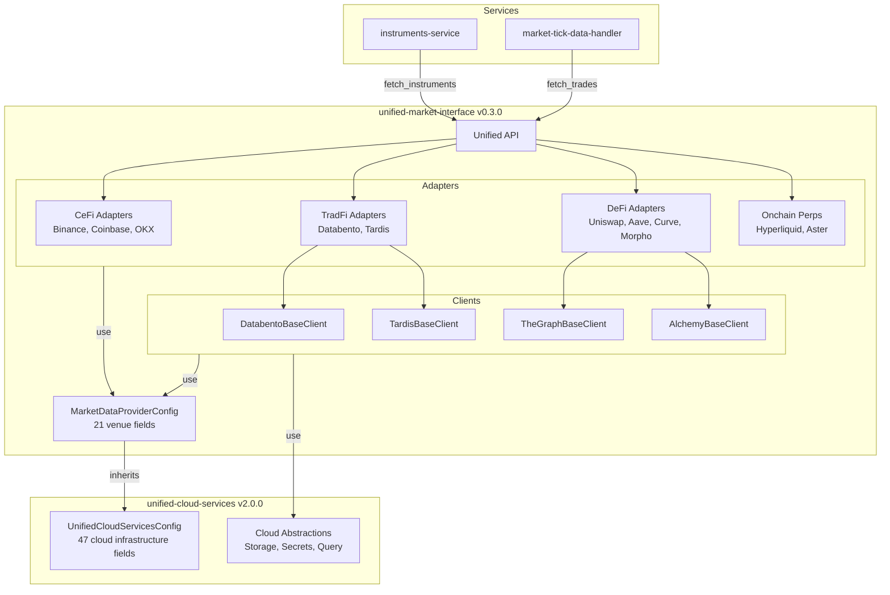

# Venue API Consolidation: unified-market-interface as Single Source of Truth

## Context

**Current problem:**

- Venue logic scattered: 13 adapters in instruments-service, 15 in market-tick-data-handler (~14,000-18,000 lines)
- Many duplicates: AAVE, Morpho, Uniswap, Euler, LST, Fluid, Curve, etc. exist in BOTH services
- UnifiedCloudServicesConfig has 21 venue-specific fields (API keys, timeouts, URLs) mixed with 47 cloud infrastructure fields
- No unified API - each service implements its own venue interaction layer

**Target architecture:**

- unified-market-interface becomes THE venue abstraction layer
- Services call: `market_interface.fetch_instruments(venue="aave_v3")` instead of implementing adapters
- Venue config (21 fields) moves to unified-market-interface
- UnifiedCloudServicesConfig stays lean (47 cloud infrastructure fields only)

---

## Phase 0: Add Auto-Version-Bump to All Repos (PREREQUISITE)

**Problem:** Only unified-cloud-services has auto-version-bump pre-commit hook. Without it, code changes without version bumps cause Artifact Registry publish failures ("entity already exists").

**Solution:** Add auto-bump hook to 7 repos before main refactor.

### Repos Needing Auto-Bump Hook

**Services (2):**

1. instruments-service
2. market-tick-data-handler

**Libraries (5):**
3. unified-events-interface
4. unified-config-interface
5. unified-market-interface
6. unified-trade-execution-interface
7. execution-algo-library

(unified-cloud-services already has it)

### Implementation per Repo

**1. Copy bump script:**

Copy [unified-cloud-services/scripts/bump-library-version.sh](unified-cloud-services/scripts/bump-library-version.sh) → `scripts/bump-library-version.sh` in each repo.

**Script logic:**

- Detects code changes (excludes docs/tests)
- Auto-increments patch version (1.5.5 → 1.5.6)
- Updates pyproject.toml
- Stages the version bump
- Runs BEFORE all other hooks

**2. Add to .pre-commit-config.yaml (FIRST hook):**

```yaml
repos:
  # Auto-bump version (MUST BE FIRST)
  - repo: local
    hooks:
      - id: bump-library-version
        name: Auto-bump library version
        entry: bash scripts/bump-library-version.sh
        language: system
        pass_filenames: false
        stages: [commit]
  
  # Ruff and other hooks follow...
```

**3. Reinstall hooks:**

```bash
prek install
```

**Benefits:**

- Idempotent publishes: Same code = same version = Cloud Build skips (no error)
- Different code = auto-bumped version = Cloud Build publishes new version
- No manual version management
- Prevents "entity already exists" Artifact Registry errors

---

## Phase 1: Move Venue Config to Market Interface

### 1.1: Create MarketDataProviderConfig

**File:** [unified-market-interface/unified_market_interface/config.py](unified-market-interface/unified_market_interface/config.py) (new)

```python
from unified_cloud_services import UnifiedCloudServicesConfig
from pydantic import Field, AliasChoices

class MarketDataProviderConfig(UnifiedCloudServicesConfig):
    """Configuration for market data providers.
    
    Extends UnifiedCloudServicesConfig for cloud infrastructure access.
    Adds venue-specific API keys, timeouts, and URLs.
    """
    
    # API Keys (Direct)
    tardis_api_key: Optional[str] = Field(...)
    databento_api_key: Optional[str] = Field(...)
    the_graph_api_key: Optional[str] = Field(...)
    alchemy_api_key: Optional[str] = Field(...)
    aavescan_api_key: Optional[str] = Field(...)
    
    # Secret Manager Names
    tardis_secret_name: str = Field(...)
    databento_secret_name: str = Field(...)
    thegraph_secret_name: str = Field(...)
    alchemy_secret_name: str = Field(...)
    
    # Tardis Configuration
    tardis_base_url: str = Field(...)
    tardis_timeout: int = Field(...)
    tardis_max_retries: int = Field(...)
    
    # Databento, The Graph, Alchemy configs...
```

Copy the 21 venue-specific fields from [unified-cloud-services/unified_cloud_services/core/config.py](unified-cloud-services/unified_cloud_services/core/config.py) lines ~320-466.

### 1.2: Remove Venue Fields from UnifiedCloudServicesConfig

**File:** [unified-cloud-services/unified_cloud_services/core/config.py](unified-cloud-services/unified_cloud_services/core/config.py)

Delete lines ~320-466 (API KEYS + SECRET MANAGER + API CLIENT CONFIGURATION sections).

Keep only 47 cloud infrastructure fields (environment, GCP/AWS config, buckets, BigQuery, Athena, logging, resource limits).

**Version:** Bump UCS to 2.0.0 (breaking change - removed 21 fields)

---

## Phase 2: Move ALL Venue Adapters to Market Interface

### 2.1: Consolidate DeFi Adapters (~9 protocols)

**Copy from instruments-service → unified-market-interface:**

- `app/venues/defi/aave_adapter.py` (2,016 lines)
- `app/venues/defi/morpho_adapter.py` (553 lines)
- `app/venues/defi/uniswapv3_adapter.py`
- `app/venues/defi/euler_adapter.py`
- `app/venues/defi/lst_adapters.py`
- `app/venues/defi/fluid_adapter.py`
- `app/venues/defi/curve_rpc_adapter.py`
- `app/venues/defi/balancer_adapter.py`
- `app/venues/defi/ethena_adapter.py`

**Copy from market-tick-data-handler → unified-market-interface:**

- `app/venues/defi/euler_adapter.py` (357 lines)
- `app/venues/defi/lst_adapters.py` (942 lines)
- `app/venues/defi/fluid_adapter.py` (332 lines)
- `app/venues/defi/curve_rpc_adapter.py` (477 lines)
- ... (other DeFi adapters)

**Deduplicate:** When same protocol exists in both services, merge implementations or choose the more complete one.

**Target location:** `unified-market-interface/unified_market_interface/adapters/defi/`

### 2.2: Move TradFi Adapters

**Already have clients in unified-market-interface:**

- DatabentoBaseClient ✓
- TardisBaseClient ✓

**Need to add domain adapters:**

- Copy `instruments-service/.../databento/databento_adapter.py` → `unified-market-interface/adapters/tradfi/databento.py`
- Copy `instruments-service/.../tardis/tardis_adapter.py` → `unified-market-interface/adapters/tradfi/tardis.py`
- Copy market-tick-data-handler equivalents, merge if duplicated

### 2.3: Move Onchain Perps Adapters

- Copy Hyperliquid adapters from both services
- Copy Aster adapters from both services  
- Move `AsterBaseClient` from UCS → unified-market-interface (already partially done)

**Target location:** `unified-market-interface/unified_market_interface/adapters/onchain_perps/`

---

## Phase 3: Create Unified API

### 3.1: Define Public API

**File:** [unified-market-interface/unified_market_interface/api.py](unified-market-interface/unified_market_interface/api.py) (new)

```python
from typing import List, Dict, Any, Optional
from datetime import date
from unified_market_interface.schemas import CanonicalInstrument, CanonicalTrade
from unified_market_interface.factory import get_adapter

def fetch_instruments(
    venue: str,
    category: str = "cefi",  # cefi, tradfi, defi
    chain: Optional[str] = None,  # For DeFi: "ethereum", "arbitrum", etc.
    **kwargs
) -> List[CanonicalInstrument]:
    """Fetch instrument definitions from any venue.
    
    Args:
        venue: Venue name (binance, uniswap_v3, aave_v3, nasdaq, etc.)
        category: Asset category
        chain: Blockchain for DeFi protocols
        **kwargs: Venue-specific parameters
        
    Returns:
        List of canonical instruments
    """
    adapter = get_adapter(venue, category, chain)
    return adapter.fetch_instruments(**kwargs)

def fetch_trades(
    venue: str,
    symbol: str,
    start_date: date,
    end_date: date,
    category: str = "cefi",
    **kwargs
) -> List[CanonicalTrade]:
    """Fetch historical trades from any venue.
    
    Args:
        venue: Venue name
        symbol: Trading pair symbol
        start_date, end_date: Date range
        category: Asset category
        **kwargs: Venue-specific parameters
        
    Returns:
        List of canonical trades
    """
    adapter = get_adapter(venue, category)
    return adapter.fetch_trades(symbol, start_date, end_date, **kwargs)
```

### 3.2: Extend Factory Pattern

**File:** [unified-market-interface/unified_market_interface/factory.py](unified-market-interface/unified_market_interface/factory.py)

Add registry for ALL venues:

```python
VENUE_REGISTRY = {
    # CeFi
    "binance": ("cefi", BinanceAdapter),
    "coinbase": ("cefi", CoinbaseAdapter),
    "okx": ("cefi", OKXAdapter),
    # ... 6 CeFi venues
    
    # TradFi
    "nasdaq": ("tradfi", DatabentoAdapter),
    "nyse": ("tradfi", DatabentoAdapter),
    "cme": ("tradfi", DatabentoAdapter),
    "cboe": ("tradfi", DatabentoAdapter),
    
    # DeFi
    "uniswap_v3": ("defi", UniswapV3Adapter),
    "aave_v3": ("defi", AaveV3Adapter),
    "curve": ("defi", CurveAdapter),
    "morpho": ("defi", MorphoAdapter),
    # ... 15+ DeFi protocols
    
    # Onchain Perps
    "hyperliquid": ("onchain_perps", HyperliquidAdapter),
    "aster": ("onchain_perps", AsterAdapter),
}
```

---

## Phase 4: Update Services to Use Unified API

### 4.1: instruments-service Refactor

**Remove:** `instruments_service/app/venues/` directory (entire tree - ~8,000-10,000 lines)

**Replace with:**

```python
from unified_market_interface import fetch_instruments

# Old: instruments_service imports 20+ adapters, implements venue logic
adapters = {
    "binance": BinanceAdapter(),
    "uniswap_v3": UniswapV3Adapter(),
    # ...
}

# New: Single API call
instruments = fetch_instruments(venue="binance", category="cefi")
instruments = fetch_instruments(venue="uniswap_v3", category="defi", chain="ethereum")
```

**Files to update:**

- `cli/handlers/instrument_handler.py` - Replace adapter instantiation with API calls
- `app/core/adapter_loader.py` - Remove or simplify (no longer loads local adapters)
- Remove imports of venue adapters

### 4.2: market-tick-data-handler Refactor

**Remove:** `market_data_tick_handler/app/venues/` directory (entire tree - ~6,000-8,000 lines)

**Replace with:**

```python
from unified_market_interface import fetch_trades, fetch_instruments

# Old: market_tick_data_handler implements Databento/Tardis download logic
client = DatabentoClient(api_key=...)
data = client.download_trades(...)

# New: Unified API
trades = fetch_trades(
    venue="binance",
    symbol="BTC-USDT",
    start_date=date(2024, 1, 1),
    end_date=date(2024, 1, 2),
    category="cefi"
)
```

**Files to update:**

- `cli/handlers/download_handler.py` - Replace client instantiation with API calls
- Remove venue-specific download logic

---

## Phase 5: Remove Orphaned Code from UCS

**Delete:**

1. `observability/` directory (14 lines) - services import from unified-events-interface
2. `adapters/defi/` directory (560 lines) - moved to unified-market-interface
3. `core/subgraph_service.py` (256 lines) - move to unified-market-interface or delete if unused
4. `core/web3_client_pool.py` (77 lines) - move to unified-market-interface
5. Remove 21 venue fields from UnifiedCloudServicesConfig (lines ~320-466)

**Total removal:** ~1,200 lines from UCS

**Version:** UCS 2.0.0 (breaking - removed venue config fields)

---

## Phase 6: Version Bumps & Publishing

**Libraries to bump:**

1. **unified-market-interface:** 0.2.0 → **0.3.0** (added all DeFi/TradFi adapters + unified API)
2. **unified-cloud-services:** 1.9.0 → **2.0.0** (removed 21 venue config fields - BREAKING)
3. **instruments-service:** 0.1.1 → **0.2.0** (removed venues/, uses unified API)
4. **market-tick-data-handler:** 2.0.0 → **2.1.0** (removed venues/, uses unified API)

**Publish order:**

1. unified-market-interface 0.3.0 (has all adapters + API)
2. unified-cloud-services 2.0.0 (lean config)
3. instruments-service 0.2.0 (uses new API)
4. market-tick-data-handler 2.1.0 (uses new API)

---

## Success Criteria & Testing

### Test Commands (--max-results 1)

**instruments-service:**

```bash
# CeFi
instruments-service --mode instruments --venues BINANCE --CEFI --max-results 1

# TradFi
instruments-service --mode instruments --venues NASDAQ --TRADFI --max-results 1

# DeFi
instruments-service --mode instruments --venues UNISWAP-V3 --DEFI --chain ethereum --max-results 1
instruments-service --mode instruments --venues AAVE-V3 --DEFI --chain ethereum --max-results 1
```

**market-tick-data-handler:**

```bash
# CeFi
market-tick-data-handler --mode download --venues BINANCE-FUTURES --data-types trades --start-date 2024-01-01 --end-date 2024-01-01 --max-results 1

# TradFi
market-tick-data-handler --mode download --venues NASDAQ --data-types trades --start-date 2024-01-01 --end-date 2024-01-01 --max-results 1

# DeFi
market-tick-data-handler --mode download --venues UNISWAP-V3 --data-types swaps --start-date 2024-01-01 --end-date 2024-01-01 --max-results 1
```

**Success metrics:**

- All 6 test commands complete successfully
- Data written to GCS
- No import errors
- Quality gates pass for all affected repos

---

## Architecture Diagram




---

## Migration Steps Summary


| Phase   | Task                              | Files Changed | Lines   | Version    |
| ------- | --------------------------------- | ------------- | ------- | ---------- |
| 1.1     | Create MarketDataProviderConfig   | +1 file       | +150    | -          |
| 1.2     | Remove venue fields from UCS      | UCS config.py | -150    | UCS 2.0.0  |
| 2.1-2.3 | Move adapters to market interface | +25 files     | +14,000 | -          |
| 3.1-3.2 | Create unified API + factory      | +2 files      | +300    | UMI 0.3.0  |
| 4.1     | Refactor instruments-service      | -25 files     | -8,000  | IS 0.2.0   |
| 4.2     | Refactor market-tick-data-handler | -25 files     | -6,000  | MTDH 2.1.0 |
| 5       | Remove orphaned UCS code          | -5 files      | -900    | UCS 2.0.0  |


**Total:** ~14,000 lines moved to unified-market-interface, ~15,000 lines removed from services, ~1,000 lines removed from UCS

---

## Rollback Strategy

**If Phase 4-5 break services:**

1. Revert services to previous versions (keep old venues/ directories)
2. unified-market-interface 0.3.0 remains (new API exists but unused)
3. Fix issues, retry migration

**Phased rollout:**

- Phase 1-3: Additive (new API exists alongside old code)
- Phase 4: Breaking (services remove old adapters)
- Can pause between Phase 3 and Phase 4 for validation

---

## Effort Estimate


| Phase              | Effort          | Risk                    |
| ------------------ | --------------- | ----------------------- |
| Phase 1 (config)   | 2 hours         | Low                     |
| Phase 2 (adapters) | 6-8 hours       | Medium (deduplication)  |
| Phase 3 (API)      | 2-3 hours       | Low                     |
| Phase 4 (services) | 4-6 hours       | High (breaking changes) |
| Phase 5 (cleanup)  | 1 hour          | Low                     |
| Testing            | 2-3 hours       | -                       |
| **Total**          | **17-23 hours** | -                       |


With parallelization: ~12-15 hours wall time

---

## Questions Before Proceeding

1. **Config inheritance:** Should MarketDataProviderConfig extend UnifiedCloudServicesConfig, or should they be siblings extending BaseConfig?
2. **Adapter deduplication:** When same protocol exists in both services (e.g., AAVE), which implementation should be canonical? Or merge both?
3. **API design:** Should the unified API be synchronous or async? Current adapters mix both patterns.
4. **Testing scope:** Should we test ALL venues (25+) or just a representative sample (6-8 venues)?

