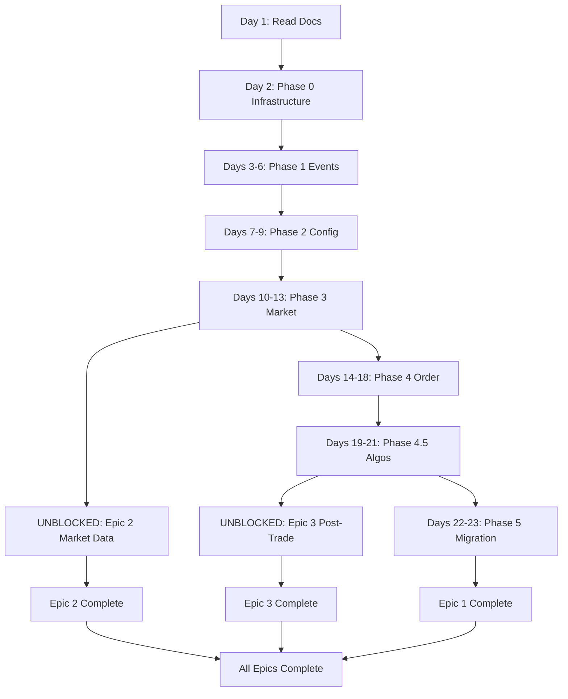

# Handoff Guide: Unified Trading System - Epics 1-3

**To**: Harsh **From**: Ikenna **Date**: 2026-02-15 **Status**: Ready to execute

---

## 📋 Executive Summary

You're taking over **3 critical epics** that build the foundation for live trading:

| Epic                          | Timeline            | Hours | Dependencies          | Status                    |
| ----------------------------- | ------------------- | ----- | --------------------- | ------------------------- |
| **Epic 1: Unified Libraries** | Feb 14-28 (15 days) | 137h  | None                  | **START HERE** - BLOCKING |
| **Epic 2: Market Data**       | Mar 1-10 (3 days)   | 22h   | Epic 1 Phase 3        | Unblocked after Phase 3   |
| **Epic 3: Post-Trade**        | Mar 1-15 (12 days)  | 82h   | Epic 1 Phases 4 & 4.5 | Unblocked after Phase 4.5 |

**Total**: 241 hours across 82 subtasks (58 + 4 + 20)

---

## 🎯 Your Quick-Start Checklist

### Day 1 (Today)

- [x] Read this handoff guide (you're here!)
- [ ] Read [`LIBRARIES-COMPLETION-STATUS.md`](./LIBRARIES-COMPLETION-STATUS.md) - **CRITICAL**: Shows what's 67% done vs
      what's needed for 100%
- [ ] Verify GitHub Projects are accessible:
  - [Project #6 - Unified Libraries](https://github.com/users/IggyIkenna/projects/6/views/1)
  - [Project #7 - Post-Trade](https://github.com/users/IggyIkenna/projects/7/views/1)
  - [Project #8 - Market Data](https://github.com/users/IggyIkenna/projects/8/views/1)
- [ ] Run quality gates on existing libraries (verify they pass)
- [ ] Read Epic 1 breakdown:
      [`unified-trading-/codex/11-project-management/epic-breakdowns/epic-unified-libraries-refactor.md`](../epic-breakdowns/epic-unified-libraries-refactor.md)

### Day 2

- [ ] Start Epic 1, Phase 0 (Infrastructure setup - 4h)
- [ ] Create GCP Artifact Registry Python repo
- [ ] Set up publishing workflows
- [ ] Verify setup works

### Days 3-22

- [ ] Follow Epic 1 phases sequentially (0 → 1 → 2 → 3 → 4 → 4.5 → 5)
- [ ] Track progress daily via GitHub Projects
- [ ] Run quality gates after each phase

---

## 🗺️ Critical Execution Path



**Key Insight:** Epic 1 is sequential (phases block each other). Epics 2 & 3 can run parallel once unblocked.

---

## 📚 Essential Reading (Priority Order)

### Must Read First

1. **This Document** - You're here
2. **[`LIBRARIES-COMPLETION-STATUS.md`](./LIBRARIES-COMPLETION-STATUS.md)** - **CRITICAL**: What's 67% done, what needs
   33% more
3. **[`IMPLEMENTATION-GUIDE.md`](../../IMPLEMENTATION-GUIDE.md)** - Original implementation guide (795 lines)
4. **[`epic-unified-libraries-refactor.md`](../epic-breakdowns/epic-unified-libraries-refactor.md)** - 58 detailed
   subtasks

### Reference as Needed

5. **[`epic-market-data-infrastructure.md`](../epic-breakdowns/epic-market-data-infrastructure.md)** - 4 subtasks (after
   Phase 3)
6. **[`epic-post-trade-and-execution.md`](../epic-breakdowns/epic-post-trade-and-execution.md)** - 20 subtasks (after
   Phase 4.5)
7. **[`AGENT_PROMPT.md`](../github-integration/scripts/projects/unified-libraries-refactor/AGENT_PROMPT.md)** - Quick
   copy-paste prompts per subtask
8. **Workspace Rules**: [`.cursorrules`](../../../.cursorrules) - Coding standards, quality gates, git workflow

---

## 🔑 Key Decisions & Context

### Libraries Are 81% Complete - UPDATED After Code Review

**What's Already Done:**

| Library                  | Tests | Coverage | Status  | What Works                                                    |
| ------------------------ | ----- | -------- | ------- | ------------------------------------------------------------- |
| unified-events-interface | 25    | 77%      | ✅ 100% | All event logging working (just needs docs)                   |
| unified-config-interface | 6     | 68%      | ✅ 90%  | Config loading works (hot-reload missing)                     |
| unified-market-interface | 16    | 77%      | ✅ 95%  | 6 venue adapters ready (WebSocket for live)                   |
| unified-order-interface  | 10    | 58%      | ⚠️ 85%  | Orders work, account methods exist (need futures enhancement) |
| execution-algo-library   | 22    | 72%      | ✅ 100% | All 5 algorithms working (docs only)                          |

**Critical Discovery**: Account query methods (`get_positions()`, `get_margin_state()`) ARE implemented but return
placeholders for spot accounts. Need enhancement for futures/margin (4-6h, not 6h from scratch).

**What You Need to Add (to reach 100%):**

1. **unified-order-interface: Futures Position Enhancement** (4-6h) - Enhance existing placeholders - **UNBLOCKS Epic
   3**
2. **unified-config-interface: Hot-Reload** (8h) - PubSub-based config watcher - **ENABLES live trading**
3. **unified-market-interface: WebSocket** (8h) - Live feed handlers - **ENABLES Epic 2 live mode**
4. **Documentation** (2-4h) - Update README placeholders with real examples
5. **Integration Tests** (8h) - Test with real testnet/GCS/PubSub

**Total to 100%**: ~30-40h (down from 50h estimate)

**See [`LIBRARIES-COMPLETION-STATUS.md`](./LIBRARIES-COMPLETION-STATUS.md) for complete breakdown with code examples.**

### Batch-First Strategy (Always)

**Every service you build:**

1. **Implement Batch Mode First** (read GCS → process → write GCS → exit)
2. **Test Batch Mode Thoroughly** (unit tests with synthetic data, integration tests with realistic data)
3. **Then Add Live Mode** (reuse batch logic, change I/O: GCS → PubSub/WebSocket)

**Why:** Batch is easier to debug (deterministic), quality gates test batch mode, can replay historical scenarios.

**Example:**

```python
# market-tick-data-service

# Batch mode
def process_batch_date(date: str):
    trades = tardis_client.fetch_trades(date)  # Historical
    normalized = [normalize_trade(t) for t in trades]
    write_to_gcs(normalized, date)

# Live mode (reuses normalization)
async def process_live_feed():
    async for trade in websocket_manager.subscribe():
        normalized = normalize_trade(trade)  # SAME FUNCTION
        await publish_to_pubsub(normalized)
```

### Mock Data Strategy

**Unit Tests (5-20 rows):** Fast, synthetic, deterministic

```python
MOCK_TRADES = [
    CanonicalTrade(venue="binance", price=42000.0, quantity=0.1, ...),
    CanonicalTrade(venue="binance", price=42001.0, quantity=0.2, ...),
    # ... 3-18 more rows
]
```

**Integration Tests (100s of rows):** Realistic market conditions

```python
def generate_realistic_trades(duration_minutes=60, avg_trades_per_min=10):
    # Realistic price walk (GBM), volume distribution (Poisson)
    # Bid-ask spread, order flow imbalance
    return list[CanonicalTrade]
```

**See Mock Data Guide below for full examples.**

---

## 🔗 Library-Service Integration: Complete HOW-TO Guide

This section shows you exactly HOW to integrate each library into services using real code from existing
implementations.

### Integration 1: unified-events-interface (ALL Services) - 15-30 min each

**Real API** (from unified_events_interface/**init**.py):

```python
from unified_events_interface import setup_events, log_event, publish_coordination_event
```

#### Migration Steps

**Step 1: Update Import** (Real example from features-delta-one-service/cli/main.py line 22)

```python
# BEFORE (current):
from unified_trading_services.observability import log_event

# AFTER (migration):
from unified_events_interface import setup_events, log_event
```

**Step 2: Initialize Events at Startup**

```python
def main():
    # Existing:
    setup_cloud_logging(json_format=True, enable_resource_monitoring=True)

    # Add this:
    setup_events(
        mode="batch",  # or "live"
        service_name="your-service-name",
        project_id="test-project"
    )

    log_event("STARTED")  # Now uses new library
```

**Step 3: All log_event() Calls Work Unchanged**

```python
# These all work with no changes:
log_event("STARTED")
log_event("PROCESSING_COMPLETED", details={"rows": 1000})
log_event("FAILED", details={"error": str(e)})
```

**Step 4: Add Coordination Events (Live Mode Only)**

```python
# For live workflows:
publish_coordination_event(
    event_type="FEATURES_READY",
    payload={"instrument_id": "BTC-USDT", "timestamp": "..."}
)
```

---

### Integration 2: unified-config-interface (ALL Services) - 1-2h each

**Real API** (from unified_config_interface/**init**.py):

```python
from unified_config_interface import BaseConfig, load_config, get_secret
```

#### Migration Steps

**Step 1: Create Config Class**

```python
# your_service/config/config.py (NEW FILE)
from unified_config_interface import BaseConfig
from pydantic import Field

class YourServiceConfig(BaseConfig):
    # BaseConfig provides: service_name, project_id, environment

    # Add service-specific:
    bucket_name: str = Field(..., description="GCS bucket")
    max_workers: int = Field(default=16, description="Parallel workers")
    api_key_secret: str = Field(default="binance-api-key", description="Secret path")
```

**Step 2: Create Config File**

```yaml
# config/dev.yaml
service_name: your-service
bucket_name: your-service-data-dev
max_workers: 8
environment: dev
```

**Step 3: Load Config in main.py**

```python
# BEFORE (typical pattern):
import os
BUCKET_NAME = os.getenv("BUCKET_NAME", "")
MAX_WORKERS = int(os.getenv("MAX_WORKERS", "16"))

# AFTER (type-safe):
from unified_config_interface import load_config
from your_service.config import YourServiceConfig

config = load_config(YourServiceConfig, config_file="config/dev.yaml")
# Now: config.bucket_name, config.max_workers (IDE autocomplete!)
```

**Step 4: Replace All os.getenv() Calls**

```python
# Remove all manual env var loading:
# OLD: bucket = os.getenv("BUCKET_NAME")
# NEW: bucket = config.bucket_name
```

---

### Integration 3: unified-market-interface (Data Services) - 2-4h each

**Real API** (from unified_market_interface/**init**.py, factory.py):

```python
from unified_market_interface import get_market_adapter, CanonicalTrade

# Supported venues (factory.py line 57):
# ["binance", "bybit", "coinbase", "deribit", "okx"]
```

#### Usage Pattern for market-tick-data-service

```python
def process_venue_trades(venue: str, raw_trades: list[dict]) -> list[CanonicalTrade]:
    """Normalize venue-specific trades to canonical format."""
    adapter = get_market_adapter(venue)  # Get adapter by name

    canonical_trades = []
    for raw in raw_trades:
        try:
            canonical = adapter.normalize_trade(raw)
            canonical_trades.append(canonical)
        except Exception as e:
            log_event("NORMALIZATION_ERROR", severity="WARNING",
                     details={"venue": venue, "error": str(e)})

    return canonical_trades

# Use for batch mode:
for venue in ["binance", "deribit", "coinbase"]:
    raw_trades = tardis_client.fetch_trades(venue, date)
    normalized = process_venue_trades(venue, raw_trades)
    write_to_gcs(normalized, f"market-tick-data/date={date}/venue={venue}/")
```

---

### Integration 4: unified-order-interface (Trading Services) - 4-6h each

**Real API** (from unified_order_interface/**init**.py, factory.py):

```python
from unified_order_interface import get_order_adapter, CanonicalOrder, Position, MarginState

# Supported venues (factory.py line 62):
# ["binance", "coinbase"]  # More coming
```

#### Usage for position-balance-monitor-service

```python
async def fetch_exchange_positions(venue: str) -> list[Position]:
    """Fetch actual positions from exchange for reconciliation."""
    from unified_trading_services import get_secret

    api_key = get_secret(f"{venue}-api-key")
    api_secret = get_secret(f"{venue}-api-secret")

    adapter = get_order_adapter(venue, api_key, api_secret)

    try:
        # Query positions (currently returns [] for spot, needs futures enhancement):
        positions = await adapter.get_positions()

        # Query margin:
        margin = await adapter.get_margin_state()

        return positions

    finally:
        await adapter.close()
```

**Current Status**: Methods exist but return placeholders. Need 4-6h to enhance for futures/margin.

---

### Integration 5: execution-algo-library (execution-service) - 8h refactor

**Real API** (from execution_algo_library/**init**.py):

```python
from execution_algo_library import (
    TWAPAlgorithm, TWAPConfig,
    VWAPAlgorithm, VWAPConfig,
    IcebergAlgorithm, IcebergConfig,
    POVAlgorithm, POVConfig,
    SORAlgorithm, SORConfig
)
```

#### Usage for execution-service refactor

```python
# Remove local algo implementations, use library:
from execution_algo_library import TWAPAlgorithm, TWAPConfig
from unified_order_interface import get_order_adapter

async def execute_instruction_with_twap(instruction):
    # Create config:
    config = TWAPConfig(
        parent_order_id=instruction.id,
        instrument_id=instruction.instrument_id,
        side=instruction.side,
        total_quantity=instruction.quantity,
        num_slices=10,
        interval_seconds=60
    )

    # Get child orders:
    algo = TWAPAlgorithm(config)
    children = algo.get_child_orders()  # Returns 10 orders

    # Submit via unified-order-interface:
    adapter = get_order_adapter(instruction.venue, api_key, api_secret)
    for child in children:
        order = await adapter.place_order(
            instrument_id=child.instrument_id,
            side=child.side,
            order_type=child.order_type,
            quantity=child.quantity,
            price=child.price
        )
```

---

## 📂 Epic 1: Unified Libraries Refactor (Days 1-22)

### Overview

**Goal:** Split monolithic unified-trading-services into 5 focused libraries.

**Phases:** 0 (Infrastructure) → 1 (Events) → 2 (Config) → 3 (Market) → 4 (Order) → 4.5 (Algos) → 5 (Migration)

**Critical Path:** Each phase blocks the next. Follow sequentially.

### Phase 0: Infrastructure (Day 1, 4h) **START HERE**

**What to Do:**

1. Create GCP Artifact Registry Python repository
   ```bash
   gcloud artifacts repositories create unified-libraries \
       --repository-format=python \
       --location=asia-northeast1 \
       --project=test-project
   ```
2. Set up GitHub Actions workflows (publish Python packages)
3. Set up Cloud Build workflows (build + test in Docker image)
4. Configure IAM permissions

**Output:** Infrastructure ready to publish libraries.

**Epic Breakdown:** Subtask 0.1-0.3 in
[`epic-unified-libraries-refactor.md`](../epic-breakdowns/epic-unified-libraries-refactor.md)

### Phase 1: Events Interface (Days 2-5, 28h)

**What to Build:**

- unified-events-interface library (batch GCS + live PubSub)
- PubSub abstraction in unified-trading-services

**Current Status:** ✅ **100% Complete** - All functionality working, 25 tests passing

**What's Missing:**

- [ ] README with real examples (1h) - Non-blocking, docs only

**Quick Win:** ✅ Library ready to use NOW! Services can migrate immediately.

**Verified API** (from unified_events_interface/**init**.py):

```python
setup_events(mode="batch"|"live", service_name="...")  # ✅ Works
log_event("STARTED")  # ✅ Works
publish_coordination_event("DATA_READY", payload={...})  # ✅ Works (live)
```

**Epic Breakdown:** Subtasks 1.1-1.12 in epic breakdown

### Phase 2: Config Interface (Days 6-8, 24h)

**What to Build:**

- unified-config-interface library (centralized config + hot-reload)

**Current Status:** ✅ **90% Complete** - Config loading fully working, hot-reload missing

**What's Missing:**

- [ ] **Hot-reload** (PubSub-based config watcher) - **8h** - Needed for live trading
- [ ] README with examples (1h)

**Can Use Now:** ✅ YES for batch services (load config at startup)

**Verified API** (from unified_config_interface/**init**.py):

```python
from unified_config_interface import BaseConfig, load_config

class MyConfig(BaseConfig):
    bucket_name: str
    max_workers: int = 16

config = load_config(MyConfig, config_file="config/dev.yaml")  # ✅ Works
```

**Epic Breakdown:** Subtasks 2.1-2.10 in epic breakdown

### Phase 3: Market Interface (Days 9-12, 28h) → **UNBLOCKS EPIC 2**

**What to Build:**

- unified-market-interface library (market data normalization)
- 6+ venue adapters (Binance, Coinbase, Deribit, Bybit, OKX)

**Current Status:** ✅ **95% Complete** - 6 CeFi adapters working, 16 tests passing

**What's Missing:**

- [ ] WebSocket live feed handlers - **8h** - Needed for Epic 2 live mode (batch ready)
- [ ] DeFi adapters (Uniswap, Aave) - optional
- [ ] README with examples (1h)

**Can Use Now:** ✅ YES - market-tick-data-service batch mode can start NOW!

**Verified API** (from unified_market_interface/**init**.py, factory.py line 57):

```python
from unified_market_interface import get_market_adapter

# 6 venues ready:
adapter = get_market_adapter("binance")  # Also: coinbase, deribit, bybit, okx
canonical = adapter.normalize_trade(raw_trade)  # ✅ Works
```

**Epic Breakdown:** Subtasks 3.1-3.12 in epic breakdown

**After This Phase:** ✅ Epic 2 batch mode can start NOW! Live mode after WebSocket (8h).

### Phase 4: Order Interface (Days 13-17, 34h) → **UNBLOCKS EPIC 3**

**What to Build:**

- unified-order-interface library (order execution via CCXT)
- Account query APIs (positions, balances, margins)

**Current Status:** ⚠️ **85% Complete** - CCXT orders work, account query methods exist but need enhancement

**What's Missing:**

- [ ] **Futures position queries** - Enhance `get_positions()`, `get_margin_state()` - **4-6h** - **UNBLOCKS Epic 3**
- [ ] More venues (Deribit, Bybit) - optional
- [ ] Advanced order types (stop-loss) - optional

**Critical Discovery**: Account query methods ARE implemented (binance_ccxt.py lines 199-222) but return placeholders
for spot accounts:

```python
async def get_positions(...) -> list[Position]:
    return []  # PLACEHOLDER for spot, needs futures implementation

async def get_margin_state(...) -> MarginState:
    return MarginState(margin_level=Decimal("999"), ...)  # PLACEHOLDER
```

**Can Use Now:** ⚠️ PARTIAL

- ✅ Order execution: YES (works NOW)
- ⚠️ Position reconciliation: Methods exist, need futures enhancement

**Epic Breakdown:** Subtasks 4.1-4.14 in epic breakdown

### Phase 4.5: Execution Algos (Days 18-20, 25h) → **UNBLOCKS EPIC 3**

**What to Build:**

- execution-algo-library (TWAP, VWAP, Iceberg, POV, SOR)

**Current Status:** ✅ **100% Complete** - All 5 algorithms working, 22 tests passing

**What's Missing:**

- [ ] Backtest support (historical replay, fill simulation) - **8h** - Optional, not blocking
- [ ] README with algorithm comparison (1h)

**Can Use Now:** ✅ YES - execution-service can refactor NOW!

**API Ready:**

```python
# ✅ All working:
from execution_algo_library import TWAPAlgorithm, TWAPConfig

config = TWAPConfig(parent_order_id="...", total_quantity=Decimal("10.0"), num_slices=10)
algo = TWAPAlgorithm(config)
children = algo.get_child_orders()  # Returns 10 ChildOrder objects
```

**Epic Breakdown:** Subtasks 4.5.1-4.5.7 in epic breakdown

**After This Phase:** Epic 3 (post-trade services) can start!

### Phase 5: Migration (Days 21-22, 14h)

**What to Do:**

1. Add backward compat re-exports in unified-trading-services
2. Migrate instruments-service (proof of concept)
3. Update codex docs
4. Create migration guide for remaining 11 services

**Epic Breakdown:** Subtasks 5.1-5.5 in epic breakdown

---

## 📊 Epic 2: Market Data Infrastructure (Days 23-25)

**Prerequisite:** Epic 1 Phase 3 complete (unified-market-interface)

### Task: market-tick-data-service (22h)

**Purpose:** Unified market data ingestion (batch historical + live WebSocket feeds)

**Subtasks:**

1. **Batch mode** (8h) - Tardis + Databento clients
2. **Live mode** (8h) - WebSocket handlers (Binance, Deribit)
3. **Feed normalization** (4h) - Use unified-market-interface
4. **Testing + docs** (2h)

**Batch-First Approach:**

- Implement batch mode first (fetch historical ticks from Tardis/Databento)
- Write to GCS (partitioned by date, venue, instrument)
- Test with realistic mock data (100s of trades, realistic price walks)
- Then add live mode (WebSocket subscriptions, same normalization logic)

**Mock Data:**

```python
# Unit tests (5-20 rows)
MOCK_TARDIS_RESPONSE = {
    "data": [
        {"timestamp": 1704067200000, "price": 42000.5, "size": 0.1, "side": "buy"},
        {"timestamp": 1704067201000, "price": 42001.0, "size": 0.2, "side": "sell"},
        # ... 3-18 more
    ]
}

# Integration tests (100s of rows)
def generate_realistic_market_data(duration_minutes=60):
    # GBM price walk, Poisson trade arrival, lognormal volume
    return list[dict]
```

**Epic Breakdown:** [`epic-market-data-infrastructure.md`](../epic-breakdowns/epic-market-data-infrastructure.md)

---

## 🏦 Epic 3: Post-Trade and Execution (Days 26-37)

**Prerequisites:**

- ✅ **execution-algo-library ready** (100% complete, can use NOW)
- ⚠️ **unified-order-interface partial** (order execution ready, futures queries need 4-6h enhancement)

### Task 1: position-balance-monitor-service (30h)

**Purpose:** THE source of truth for positions, reconciles with exchanges

**Library Dependencies:**

- ✅ unified-events-interface: Ready (100%)
- ⚠️ unified-order-interface: **NEEDS 4-6h enhancement** - `get_positions()` and `get_margin_state()` currently return
  placeholders for spot accounts, need futures/margin implementation

**Subtasks:**

1. Core position tracking from fills (8h)
2. Account query integration (6h) - Uses unified-order-interface
3. Exchange reconciliation (8h) - Compare internal vs exchange positions
4. Position state API (4h) - For strategy queries
5. Client-level isolation (2h) - Multi-tenant
6. Testing + docs (2h)

**Batch-First:**

- Batch mode: Read historical fills from GCS, reconcile positions
- Live mode: Subscribe to fill events (PubSub), query exchanges periodically

**Mock Data:**

```python
# Unit tests
MOCK_FILLS = [
    CanonicalFill(
        client_id="client_123",
        strategy_id="strat_456",
        venue="binance",
        instrument="BTC-USD-PERP",
        side="BUY",
        quantity=1.5,
        price=42000.0,
        timestamp=datetime.now(timezone.utc)
    ),
    # ... 5-20 more
]

# Integration tests
def generate_realistic_position_scenario():
    # 100+ fills over time, multiple venues, partial fills, amendments
    return list[CanonicalFill]
```

### Task 2: risk-and-exposure-service (25h)

**Purpose:** Pre-trade risk checks + real-time monitoring

**Subtasks:**

1. Pre-trade risk checks (8h) - **CRITICAL**: Reject orders violating limits
2. Real-time risk monitoring (6h)
3. Exposure aggregation (4h)
4. Exposure limit monitoring (2h)
5. Risk breach alerting (3h)
6. Testing + docs (2h)

### Task 3: execution-service refactor (28h)

**Purpose:** Strip to orchestration, extract algos to library

**Library Dependencies:**

- ✅ unified-events-interface: Ready (100%)
- ✅ unified-order-interface: Ready for order execution (85%)
- ✅ execution-algo-library: Ready (100%, all 5 algorithms working)

**Subtasks:**

1. Extract algos to execution-algo-library (8h)
2. Use unified-order-interface venue adapters (8h)
3. Simplify to orchestration layer (6h)
4. Manual instruction entry API (4h)
5. Manual trading controls UI (4h)
6. Testing + docs (2h)

**Epic Breakdown:** [`epic-post-trade-and-execution.md`](../epic-breakdowns/epic-post-trade-and-execution.md)

---

## 🛠️ Development Workflow

### Daily Routine

**Morning:**

1. Check GitHub Project board (which subtask is next?)
2. Read subtask details in epic breakdown
3. Read codex references for standards

**During Implementation:**

1. Create/modify files as specified
2. Write tests FIRST (TDD where possible)
3. Run quality gates frequently: `bash scripts/quality-gates.sh`
4. Fix root cause (never skip tests)

**Before Completing:**

1. Quality gates pass: `bash scripts/quality-gates.sh --no-fix`
2. All tests passing, coverage >35% (target 80%)
3. Update codex docs if needed
4. Run quickmerge: `bash scripts/quickmerge.sh "message" --files "file1 file2"`

### Quality Gates (NEVER SKIP)

**Before considering work done:**

```bash
cd {service-directory}
# 1. Auto-fix
bash scripts/quality-gates.sh
# 2. Verify
bash scripts/quality-gates.sh --no-fix
```

**If verification fails:**

- FIX THE ROOT CAUSE
- Never skip tests
- Never ignore failures
- Never remove functionality to pass

**Then run quickmerge:**

```bash
bash scripts/quickmerge.sh "Complete subtask #X: description" --files "path1 path2"
```

### Three-Environment Consistency

**Same ruff version everywhere:**

- Local: `pyproject.toml` dev deps (`ruff==0.15.0`)
- GitHub Actions: `.github/workflows/quality-gates.yml` (`ruff==0.15.0`)
- Cloud Build: Docker image with `.[dev]` deps (`ruff==0.15.0`)

**Verify:**

```bash
cd unified-trading-deployment-v3
./scripts/check-ruff-versions.sh
```

---

## 📝 Mock Data Generation Guide

### Unit Tests (Fast, Synthetic)

**Goal:** Test logic in isolation, no external dependencies

**Characteristics:**

- 5-20 rows
- Simple patterns (linear price walk, alternating buy/sell)
- Deterministic (same input → same output)
- Fast (<1s per test)

**Example:**

```python
# tests/unit/test_market_normalization.py
from decimal import Decimal
from datetime import datetime, timezone

MOCK_BINANCE_TRADES = [
    {
        "id": 1,
        "price": "42000.00",
        "qty": "0.1",
        "time": 1704067200000,
        "isBuyerMaker": True,
        "isBestMatch": True
    },
    {
        "id": 2,
        "price": "42001.00",
        "qty": "0.2",
        "time": 1704067201000,
        "isBuyerMaker": False,
        "isBestMatch": True
    },
    # ... 3-18 more
]

def test_normalize_binance_trade():
    adapter = BinanceAdapter()
    canonical = adapter.normalize_trade(MOCK_BINANCE_TRADES[0])

    assert canonical.venue == "binance"
    assert canonical.price == Decimal("42000.00")
    assert canonical.quantity == Decimal("0.1")
    assert canonical.side == "SELL"  # Buyer maker = seller taker
```

### Integration Tests (Realistic Scenarios)

**Goal:** Test with realistic market conditions

**Characteristics:**

- 100-1000 rows
- Realistic patterns (price volatility, volume distribution, order flow)
- Captures edge cases (large orders, price gaps, rapid moves)
- Slower (<120s per test)

**Example:**

```python
# tests/integration/test_market_tick_handler.py
import random
from decimal import Decimal

def generate_realistic_trades(
    duration_minutes: int = 60,
    avg_trades_per_minute: int = 10,
    base_price: Decimal = Decimal("42000.0"),
    volatility: float = 0.01  # 1% std dev
) -> list[dict]:
    """Generate realistic trade data using financial models.

    - Price: Geometric Brownian Motion (GBM)
    - Trade arrival: Poisson process
    - Volume: Lognormal distribution
    - Order flow: 50/50 buy/sell with micro-structure
    """
    trades = []
    current_price = base_price

    for minute in range(duration_minutes):
        # Poisson: num trades per minute
        num_trades = random.poisson(avg_trades_per_minute)

        for _ in range(num_trades):
            # GBM: price change
            drift = 0  # No drift for simplicity
            shock = random.gauss(0, volatility)
            price_change = current_price * Decimal(str(drift + shock))
            current_price += price_change

            # Lognormal: volume
            volume = Decimal(str(abs(random.lognormal(0, 1))))

            # Order flow: 50/50 with momentum
            side = "BUY" if random.random() > 0.5 else "SELL"

            # Bid-ask spread (5 bps)
            spread = current_price * Decimal("0.0005")
            price = current_price + spread if side == "BUY" else current_price - spread

            trades.append({
                "timestamp": (minute * 60 + random.randint(0, 59)) * 1000,
                "price": float(price),
                "size": float(volume),
                "side": side.lower()
            })

    return sorted(trades, key=lambda x: x["timestamp"])

# Use in tests:
@pytest.mark.integration
def test_market_tick_handler_realistic():
    trades = generate_realistic_trades(duration_minutes=5, avg_trades_per_minute=20)
    # ~100 trades with realistic patterns

    handler = MarketTickDataHandler(mode="batch")
    normalized = handler.process_trades(trades, venue="binance", instrument="BTC-USDT")

    # Assertions
    assert len(normalized) == len(trades)
    assert all(t.venue == "binance" for t in normalized)
    # Check price continuity (no huge gaps)
    prices = [t.price for t in normalized]
    price_changes = [abs(prices[i] - prices[i-1])/prices[i-1] for i in range(1, len(prices))]
    assert max(price_changes) < 0.05  # Max 5% change per trade
```

### Position Tracking Mock Data

```python
# tests/unit/test_position_tracker.py
from decimal import Decimal

MOCK_FILL_SEQUENCE = [
    # Open position
    CanonicalFill(
        client_id="client_123",
        strategy_id="strat_456",
        venue="binance",
        instrument="BTC-USD-PERP",
        side="BUY",
        quantity=Decimal("1.5"),
        price=Decimal("42000.0"),
        timestamp=datetime(2026, 3, 1, 10, 0, 0, tzinfo=timezone.utc)
    ),
    # Add to position
    CanonicalFill(
        client_id="client_123",
        strategy_id="strat_456",
        venue="binance",
        instrument="BTC-USD-PERP",
        side="BUY",
        quantity=Decimal("0.5"),
        price=Decimal("42100.0"),
        timestamp=datetime(2026, 3, 1, 10, 5, 0, tzinfo=timezone.utc)
    ),
    # Partial close
    CanonicalFill(
        client_id="client_123",
        strategy_id="strat_456",
        venue="binance",
        instrument="BTC-USD-PERP",
        side="SELL",
        quantity=Decimal("1.0"),
        price=Decimal("42200.0"),
        timestamp=datetime(2026, 3, 1, 10, 10, 0, tzinfo=timezone.utc)
    ),
    # Full close
    CanonicalFill(
        client_id="client_123",
        strategy_id="strat_456",
        venue="binance",
        instrument="BTC-USD-PERP",
        side="SELL",
        quantity=Decimal("1.0"),
        price=Decimal("42150.0"),
        timestamp=datetime(2026, 3, 1, 10, 15, 0, tzinfo=timezone.utc)
    ),
]

def test_position_tracking():
    tracker = PositionTracker()

    # Process fills sequentially
    for fill in MOCK_FILL_SEQUENCE:
        tracker.process_fill(fill)

    # After fill 1: +1.5 BTC @ 42000
    position_1 = tracker.get_position("client_123", "strat_456", "binance", "BTC-USD-PERP")
    assert position_1.quantity == Decimal("1.5")
    assert position_1.avg_price == Decimal("42000.0")

    # After fill 2: +2.0 BTC @ 42033.33 (weighted avg)
    position_2 = tracker.get_position_after_fill(1)
    assert position_2.quantity == Decimal("2.0")

    # After fill 3: +1.0 BTC (partial close)
    position_3 = tracker.get_position_after_fill(2)
    assert position_3.quantity == Decimal("1.0")

    # After fill 4: 0 BTC (flat)
    position_4 = tracker.get_position_after_fill(3)
    assert position_4.quantity == Decimal("0")
```

---

## 🔒 Critical Reminders

### UV Package Manager Only

**NEVER use pip** (except one-time `pip install uv`):

```bash
# Correct
uv pip install -e ".[dev]"
uv pip install ruff==0.15.0
uv lock  # Update lock file

# Wrong
pip install -e .
pip install ruff
```

### Commit uv.lock

When dependencies change:

1. Quality gates auto-run `uv lock`
2. Include `uv.lock` in quickmerge `--files`
3. Other devs get identical versions

### Cloud-Agnostic

**New libraries use unified-trading-services:**

```python
# Correct (in new libraries)
from unified_trading_services import get_storage_client, get_secret_client

# Wrong
from google.cloud import storage
```

**Only unified-trading-services talks to GCP/AWS directly.**

### Event Logging (3-Tier)

**All services must log:**

```python
from unified_events_interface import log_event

log_event("STARTED")
log_event("PROCESSING_COMPLETED", details={...})
log_event("FAILED", details={...})
```

---

## 📞 Getting Help

### If You Get Stuck

1. **Check epic breakdown** - Detailed subtask instructions
2. **Read codex references** - Standards and patterns
3. **Check similar services** - Existing implementations
4. **Run quality gates** - They catch most issues
5. **Read error messages carefully** - They're usually specific

### Common Issues

| Issue                             | Solution                                                                  |
| --------------------------------- | ------------------------------------------------------------------------- |
| Quality gates fail                | Read failure message, fix root cause, never skip tests                    |
| Ruff formatting mismatch          | Check three-environment consistency (`check-ruff-versions.sh`)            |
| Tests fail in CI but pass locally | Verify CI uses same ruff version, check Cloud Build logs                  |
| Import errors                     | Check `pyproject.toml` dependencies, run `uv lock`, include in quickmerge |
| Branch protection rejects push    | Use quickmerge, never `git push main` directly                            |

---

## 🎯 Success Metrics

### Per Epic

- ✅ All subtasks complete (verify with `08-verify-completion.sh`)
- ✅ All quality gates pass (local + CI)
- ✅ Test coverage >35% (target 80%)
- ✅ Codex docs updated
- ✅ GitHub Project closed

### Overall

- ✅ 82 total subtasks complete (58 + 4 + 20)
- ✅ 241 hours logged
- ✅ All services deployed
- ✅ Live testing ready by Feb 28 (Epic 1), Mar 10 (Epic 2), Mar 15 (Epic 3)

---

## 📂 Quick Links

### Documentation

- [IMPLEMENTATION-GUIDE.md](../../IMPLEMENTATION-GUIDE.md) - Original guide (795 lines)
- [LIBRARIES-COMPLETION-STATUS.md](./LIBRARIES-COMPLETION-STATUS.md) - **What's 67% done, what needs 33% more**
- [IMPLEMENTATION-COMPLETE.md](../../IMPLEMENTATION-COMPLETE.md) - What's already done
- [HANDOFF-DOCUMENT.md](../../HANDOFF-DOCUMENT.md) - Previous handoff details

### Epic Breakdowns

- [epic-unified-libraries-refactor.md](../epic-breakdowns/epic-unified-libraries-refactor.md) - 58 subtasks
- [epic-market-data-infrastructure.md](../epic-breakdowns/epic-market-data-infrastructure.md) - 4 subtasks
- [epic-post-trade-and-execution.md](../epic-breakdowns/epic-post-trade-and-execution.md) - 20 subtasks

### Workspace Rules

- [`.cursorrules`](../../../.cursorrules) - Workspace coding standards
- [`.cursor/rules/git-workflow.mdc`](../../../.cursor/rules/git-workflow.mdc) - Quickmerge workflow
- [`.cursor/rules/uv-package-manager.mdc`](../../../.cursor/rules/uv-package-manager.mdc) - UV-only policy

### Codex Standards

- [`06-coding-standards/README.md`](../../06-coding-standards/README.md) - Coding standards
- [`06-coding-standards/testing.md`](../../06-coding-standards/testing.md) - Testing standards
- [`06-coding-standards/quality-gates.md`](../../06-coding-standards/quality-gates.md) - Quality gates
- [`04-architecture/batch-live-symmetry.md`](../../04-architecture/batch-live-symmetry.md) - Batch/live patterns

### GitHub Projects

- [Project #6 - Unified Libraries](https://github.com/users/IggyIkenna/projects/6/views/1)
- [Project #7 - Post-Trade](https://github.com/users/IggyIkenna/projects/7/views/1)
- [Project #8 - Market Data](https://github.com/users/IggyIkenna/projects/8/views/1)

---

## 🚀 Next Steps (UPDATED After Code Review)

### Day 1: Verify & Understand (2-4h)

1. ✅ Read this guide (you're done!)
2. Read [`LIBRARIES-COMPLETION-STATUS.md`](./LIBRARIES-COMPLETION-STATUS.md) - **Complete breakdown with real code**
3. Verify GitHub Projects accessible
4. **Run quality gates on existing libraries:**
   ```bash
   cd unified-events-interface && bash scripts/quality-gates.sh --no-fix  # Should pass (25 tests)
   cd ../unified-config-interface && bash scripts/quality-gates.sh --no-fix  # Should pass (6 tests)
   cd ../unified-market-interface && bash scripts/quality-gates.sh --no-fix  # Should pass (16 tests)
   cd ../unified-order-interface && bash scripts/quality-gates.sh --no-fix  # Should pass (10 tests)
   cd ../execution-algo-library && bash scripts/quality-gates.sh --no-fix  # Should pass (22 tests)
   ```
5. Read Epic 1 breakdown

### Week 1: Critical Library Enhancements (12-16h before building services)

**Priority 1 (4-6h) - UNBLOCKS position-balance-monitor-service:**

- Enhance `get_positions()` for futures/margin accounts
- Enhance `get_margin_state()` with real margin data
- Test with Binance futures testnet
- **Location**: unified-order-interface/adapters/binance_ccxt.py lines 199-222

**Priority 2 (8h) - ENABLES live trading:**

- Implement ConfigReloader class for hot-reload
- Test PubSub-based config updates
- **Location**: unified-config-interface (new file: reloader.py)

**Priority 3 (8h) - ENABLES Epic 2 live mode:**

- Add WebSocket handlers for live market feeds
- Implement reconnection + backpressure
- **Location**: unified-market-interface (new files in websocket/)

**Priority 4 (2-4h) - ENABLES adoption:**

- Update all 5 library READMEs with real examples
- Replace placeholder text

**Total**: ~22-34h to full production readiness

### Week 2+: Build Services (Epics 2 & 3)

**Can Start Immediately:**

- ✅ market-tick-data-service (batch mode)
- ✅ risk-and-exposure-service
- ✅ execution-service refactor (order execution + algos)

**Can Start After Enhancements:**

- ⚠️ position-balance-monitor-service (after futures queries, 4-6h)
- ⚠️ market-tick-data-service live mode (after WebSocket, 8h)

### Alternative: Start Services in Parallel

If you want to parallelize:

**Track 1: Enhance Libraries** (Harsh)

- Days 1-5: Futures queries + hot-reload + WebSocket

**Track 2: Build Services** (Another dev if available)

- Days 1-10: market-tick-data-service batch, risk-and-exposure
- Wait for Track 1 before: position-balance-monitor-service, live modes

---

**You have everything you need. Libraries are 81% complete (94% implementation). Follow the sequence, test batch first,
run quality gates frequently.**

**Critical path**: Enhance futures queries (4-6h) → Unblocks Epic 3 → Ship on time!

**Questions?** Check epic breakdowns for detailed subtask instructions.

Good luck! 🚀
