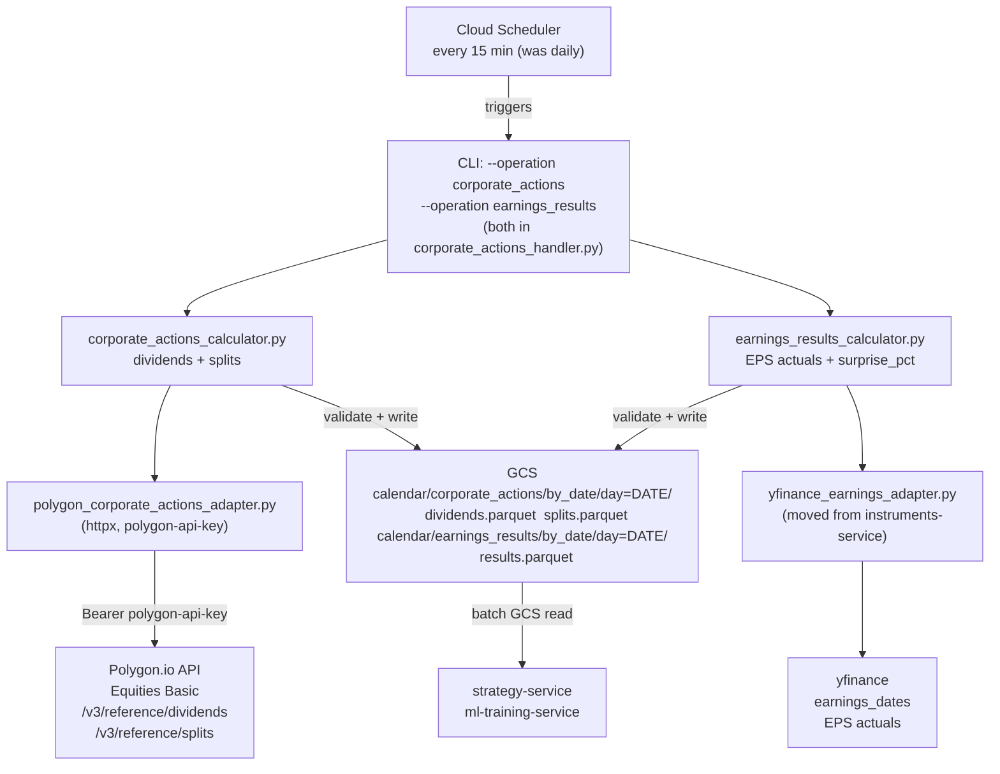
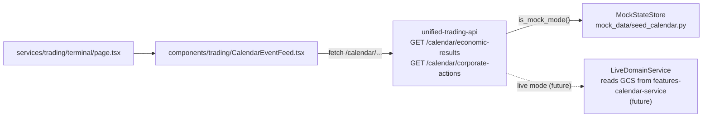

## Deferred work — migrated to:

**None** — successor: not applicable. Plan archived as 100% completed (no open `- [ ]` items at archive time). Any
incidental DEFERRED / post-cutover / out-of-scope tokens in the body are historical context, not unfinished work.

# Corporate Actions + Earnings Results Migration to features-calendar-service

## Subscription Scope

Your Polygon.io subscriptions:

- **Equities Basic** — covers `/v3/reference/dividends` and `/v3/reference/splits` (confirmed corporate actions).
  `polygon-api-key` is now in Secret Manager.
- **Currency Index Options** — covers options chain data; not used in this plan.

`/vX/reference/financials` (actual EPS/income statements) is **deprecated** on Polygon and requires a separate
"Financials & Ratios" add-on not in your current plan. **Earnings actuals use yfinance** (already in the codebase — same
source instruments-service uses today). If you later add the Polygon Financials add-on, swapping the adapter is a
one-file change.

## Architecture Summary



## Credentials

`polygon-api-key` is already in Secret Manager (confirmed). The adapter fetches it via
`get_secret_client().get_secret("polygon-api-key")` at startup — same pattern as the existing
`PolygonReferenceDataAdapter` in
[unified-reference-data-interface/adapters/polygon.py](unified-reference-data-interface/unified_reference_data_interface/adapters/polygon.py).

## Polygon.io Endpoints Used (Equities Basic)

- `GET /v3/reference/dividends?ticker=X&ex_dividend_date.gte=DATE&limit=1000` — confirmed dividends with amounts,
  ex-date, pay date, frequency, type
- `GET /v3/reference/splits?ticker=X&execution_date.gte=DATE&limit=1000` — confirmed splits with ratio

---

## Phase 1: UAC — add Polygon dividend + split schemas

**File:**
`[unified-api-contracts/unified_api_contracts/external/polygon/schemas.py](unified-api-contracts/unified_api_contracts/external/polygon/schemas.py)`

Add after `PolygonOptionContractsResponse` (no financials — not in plan):

```python
class PolygonDividend(BaseModel):
    """Single entry from GET /v3/reference/dividends. Equities Basic tier."""
    ticker: str | None = None
    ex_dividend_date: str | None = Field(None, alias="ex_dividend_date")  # YYYY-MM-DD
    pay_date: str | None = Field(None, alias="pay_date")
    record_date: str | None = Field(None, alias="record_date")
    declaration_date: str | None = Field(None, alias="declaration_date")
    cash_amount: float | None = Field(None, alias="cash_amount")
    currency: str | None = None
    dividend_type: str | None = Field(None, alias="dividend_type")  # CD=cash, SC=special, LT, ST
    frequency: int | None = None  # 1=annual, 2=bi-annual, 4=quarterly, 12=monthly

class PolygonDividendsResponse(BaseModel):
    results: list[PolygonDividend] | None = None
    status: str | None = None
    next_url: str | None = Field(None, alias="next_url")

class PolygonSplit(BaseModel):
    """Single entry from GET /v3/reference/splits. Equities Basic tier."""
    ticker: str | None = None
    execution_date: str | None = Field(None, alias="execution_date")  # YYYY-MM-DD
    split_from: float | None = Field(None, alias="split_from")
    split_to: float | None = Field(None, alias="split_to")

class PolygonSplitsResponse(BaseModel):
    results: list[PolygonSplit] | None = None
    status: str | None = None
    next_url: str | None = Field(None, alias="next_url")
```

Export the four new classes from `unified_api_contracts/__init__.py`.

Add to
`[unified_api_contracts/config/provider_api_versions.yaml](unified-api-contracts/unified_api_contracts/config/provider_api_versions.yaml)`:

```yaml
polygon:
  api_version: "v3"
  secret_name: "polygon-api-key"
  base_url: "https://api.polygon.io"
```

Note: `PolygonFinancials` is intentionally omitted — `/vX/reference/financials` is deprecated and requires a Polygon
"Financials & Ratios" add-on not in the current subscription. Earnings actuals use yfinance (Phase 3b).

---

## Phase 2: UIC — add corporate actions domain models

**New file:** `unified-api-contracts (internal)/unified_internal_contracts/domain/corporate_actions/models.py`

Move `DividendRecord`, `StockSplitRecord`, `EarningsRecord`, `CorporateActionsBundle`, `CorporateActionType` from
`[instruments-service/instruments_service/corporate_actions/models.py](instruments-service/instruments_service/corporate_actions/models.py)`
(unchanged fields).

Add new model alongside:

```python
class EarningsResultRecord(BaseModel):
    ticker: str
    period_of_report_date: date
    fiscal_period: str          # Q1..Q4, FY
    fiscal_year: str
    actual_eps: Decimal | None
    estimated_eps: Decimal | None
    earnings_surprise_pct: float | None  # (actual - estimated) / |estimated|
    actual_revenue: Decimal | None
    estimated_revenue: Decimal | None
    source: str
    fetched_at: datetime
```

Export all from `unified_internal_contracts/__init__.py`.

Check `[features-calendar-service/pyproject.toml](features-calendar-service/pyproject.toml)` — if
`unified-api-contracts (internal)` is not in `[project.dependencies]`, add it, then run `uv lock` and update
`workspace-manifest.json`.

---

## Phase 3: features-calendar-service — adapters + calculators + handler

### 3a. Polygon adapter (dividends + splits)

**New file:** `features_calendar_service/adapters/polygon_corporate_actions_adapter.py`

Synchronous httpx calls following the pattern of
`[fred_adapter.py](features-calendar-service/features_calendar_service/adapters/fred_adapter.py)` —
`get_secret_client().get_secret("polygon-api-key")` at init, `Authorization: Bearer {key}`, paginate via `next_url`.
Returns `list[PolygonDividend]` and `list[PolygonSplit]` (UAC types).

### 3b. yfinance adapter (earnings actuals — moved from instruments-service)

**New file:** `features_calendar_service/adapters/yfinance_earnings_adapter.py`

Moves the earnings fetch from
`[instruments_service/corporate_actions/adapter.py](instruments-service/instruments_service/corporate_actions/adapter.py)`
— specifically the `yf.Ticker(ticker).earnings_dates` path that returns estimated and actual EPS. Computes
`earnings_surprise_pct = (actual - estimated) / abs(estimated)`. Carries over the 100 ms rate-limit delay. Returns
`list[EarningsResultRecord]` (UIC type).

yfinance is already a transitive dep of features-calendar-service (via TemporalFeatures), so no new pyproject.toml entry
needed.

### 3c. Corporate actions calculator

**New file:** `features_calendar_service/app/calculators/corporate_actions_calculator.py`

- Accepts tickers + date window
- Calls Polygon adapter for dividends and splits
- Maps to `DividendRecord` / `StockSplitRecord` (UIC)
- Returns `dividends_df`, `splits_df`
- Calls `validate_timestamp_date_alignment` before returning

### 3d. Earnings results calculator

**New file:** `features_calendar_service/app/calculators/earnings_results_calculator.py`

- Accepts tickers + rolling lookback window (default 90 days)
- Calls yfinance earnings adapter
- Returns `EarningsResultRecord` list → DataFrame with `earnings_surprise_pct`
- Calls `validate_timestamp_date_alignment`

### 3e. CLI handler

**New file:** `features_calendar_service/cli/handlers/corporate_actions_handler.py`

- `--operation corporate_actions --mode batch` — runs both calculators (Polygon dividends/splits + yfinance earnings) in
  one batch
- Ticker universe: reads from GCS `instrument_availability/by_date`, falls back to a configurable default list
- Backfill mode: full history from `corporate_actions_start_date` (config field)
- Incremental mode: last N days (default 30), driven by `ticker_registry.yaml`
- `--dry-run`: writes to `data/sample/corporate_actions/`
- `--run-tag t1-recon`: recon namespace

### 3e. GCS output paths

```
calendar/corporate_actions/by_date/day={YYYY-MM-DD}/dividends.parquet
calendar/corporate_actions/by_date/day={YYYY-MM-DD}/splits.parquet
calendar/earnings_results/by_date/day={YYYY-MM-DD}/results.parquet
calendar/corporate_actions/metadata/ticker_registry.yaml
```

Update `[features-calendar-service/docs/GCS_PATHS.md](features-calendar-service/docs/GCS_PATHS.md)`.

---

## Phase 4: Runtime topology — change schedule to 15 min

**File:** `[unified-trading-pm/configs/runtime-topology.yaml](unified-trading-pm/configs/runtime-topology.yaml)`

Two changes:

1. Move `features-calendar-service` from `event_triggers.scheduled_daily` to `event_triggers.time_throttled_medium` (the
   `~15 min` bucket that instruments-service already sits in):

```yaml
event_triggers:
  time_throttled_medium:
    description: "~15 min"
    services: [instruments-service, features-calendar-service] # add here
    trigger: timer (poll)
  scheduled_daily:
    services: [...] # remove features-calendar-service from here
```

1. Update `sharding_dimensions.features-calendar-service.schedule` from `"daily at 00:05 UTC (Cloud Scheduler)"` to
   `"every 15 minutes (Cloud Scheduler)"`.

---

## Phase 5: instruments-service — delete corporate actions

Delete entirely (no shims):

- `instruments_service/corporate_actions/` (models.py, adapter.py, `__init__.py`)
- `instruments_service/cli/handlers/corporate_actions_handler.py`
- `instruments_service/cli/handlers/corporate_actions_backfill_handler.py`
- `instruments_service/cli/handlers/corporate_actions_update_handler.py`
- `instruments_service/cli/handlers/corporate_actions_production_handler.py`
- `instruments_service/cli/handlers/generate_date_views_handler.py`
- Remove these operations from
  `[instruments_service/cli/parser.py](instruments-service/instruments_service/cli/parser.py)` and
  `[instruments_service/cli/main.py](instruments-service/instruments_service/cli/main.py)`
- Delete `tests/unit/test_corporate_actions_handler.py`, `tests/unit/test_generate_date_views_handler.py`

Update instruments-service imports of UIC models (`from unified_internal_contracts import DividendRecord, ...`) anywhere
instruments-service still needs to reference these types (e.g. if any remaining handlers reference the old module).

---

## Phase 5b: Live API validation tests

These tests make **real HTTP calls** to Polygon.io, FRED, and yfinance to confirm data is actually there before the rest
of the implementation is built on top of it. Marked `@pytest.mark.integration`, skipped automatically when
`RUN_INTEGRATION=false` (the default in `scripts/quality-gates.sh`). Run explicitly during development:

```bash
cd features-calendar-service
POLYGON_API_KEY=... FRED_API_KEY=... .venv/bin/pytest tests/integration/ -m integration -v
```

API key resolution order: Secret Manager (`polygon-api-key`, `fred-api-key`) → env var fallback → `pytest.skip` if
neither available.

`**tests/integration/test_polygon_live_api.py**`

| Test                         | Assertion                                                                                     |
| ---------------------------- | --------------------------------------------------------------------------------------------- |
| `test_aapl_dividends_recent` | At least 1 dividend in last 365 days; `cash_amount > 0`; `ex_dividend_date` is valid ISO date |
| `test_msft_dividends_schema` | Response parses cleanly into `PolygonDividendsResponse`; no `None` on required fields         |
| `test_aapl_split_2020`       | Entry for `execution_date=2020-08-31`; `split_from=4.0`, `split_to=1.0`                       |
| `test_pagination_traversal`  | SPY dividend history: `next_url` followed to completion; total results > 20                   |
| `test_empty_ticker_no_error` | Ticker `ZZZZZZ` returns empty `results` list, HTTP 200                                        |

`**tests/integration/test_fred_live_api.py**`

| Test                        | Assertion                                                                   |
| --------------------------- | --------------------------------------------------------------------------- |
| `test_payems_nfp`           | `PAYEMS` latest observation non-null; value > 100000 (thousands of persons) |
| `test_cpiaucsl`             | `CPIAUCSL` latest observation > 200 (index has been above 200 since ~2003)  |
| `test_fedfunds`             | `FEDFUNDS` latest non-null; value between 0 and 20                          |
| `test_icsa_weekly_claims`   | `ICSA` has an observation dated within last 14 days; value > 100000         |
| `test_observation_ordering` | Observations returned in ascending date order; latest date >= 30 days ago   |

`**tests/integration/test_yfinance_live.py**`

| Test                            | Assertion                                                                                          |
| ------------------------------- | -------------------------------------------------------------------------------------------------- |
| `test_aapl_earnings_actuals`    | `earnings_dates` returns >= 4 rows; last 4 quarters have non-null `Reported EPS`                   |
| `test_msft_surprise_computable` | `actual_eps` and `estimated_eps` both present for >= 2 quarters; `earnings_surprise_pct` is finite |
| `test_jpm_earnings_date_order`  | Dates descending (most recent first)                                                               |
| `test_rate_limit_not_hit`       | 5 tickers fetched sequentially with 100 ms delay; no HTTP 429                                      |

All integration tests exercise the adapter → UIC model mapping only. Nothing is written to GCS.

---

## Phase 6: PM configs — register new data types

`**[unified-trading-pm/configs/venue_data_types.yaml](unified-trading-pm/configs/venue_data_types.yaml)`:\*\* Add under
TRADFI:

```yaml
POLYGON:
  domain: tradfi
  data_types:
    - corporate_action_confirmed
    - earnings_result
```

`**[unified-trading-pm/configs/venues.yaml](unified-trading-pm/configs/venues.yaml)`:\*\* Add Polygon.io as a TRADFI
data venue entry.

---

## Quickmerge Order

1. `unified-api-contracts` — new Polygon schemas (`feat:`)
2. `unified-api-contracts (internal)` — new domain models incl. `MacroResultRecord` (`feat:`)
3. `features-calendar-service` — adapters + calculators + handlers (`feat:`)
4. `instruments-service` — delete corporate actions module (`feat!:`, MINOR bump pre-1.0.0)
5. `unified-trading-pm` — runtime topology + venue configs (`chore:`)
6. `unified-trading-system-ui` — mock routes + terminal component (`feat:`)

---

## Phase 7: Economic actuals via FRED (NFP, CPI, FOMC, GDP)

### How it works

`FREDAdapter` already calls `series/observations` today (used for treasury yields). `EconomicCalendarLoader` only
fetches `release/dates` — no printed values. This phase adds an `EconomicResultsCalculator` that reuses
`FREDAdapter.fetch_series()` with the correct series IDs to pull the latest observation after each release date.

**15-minute poll pattern:** On each 15-min run the handler checks the economic events calendar for releases in the last
24 hours. For each, it calls FRED for the matching series. FRED typically publishes the value within minutes of the
official release time, so within one or two cycles the actual is live. No scraping needed — FRED is the authoritative
feed.

**FRED series map:**

| Event          | FRED Release ID (dates) | FRED Series ID (actuals) | Units                         |
| -------------- | ----------------------- | ------------------------ | ----------------------------- |
| NFP            | 50                      | `PAYEMS`                 | Thousands of persons, monthly |
| CPI            | 10                      | `CPIAUCSL`               | Index 1982-84=100, monthly    |
| GDP            | 53                      | `GDP`                    | Billions USD, quarterly       |
| Jobless Claims | 180                     | `ICSA`                   | Persons, weekly               |
| Fed Funds Rate | FOMC (hardcoded dates)  | `FEDFUNDS`               | Percent, monthly effective    |
| PCE            | —                       | `PCEPI`                  | Index, monthly                |

### New UIC model

Add `MacroResultRecord` to `unified_internal_contracts/domain/corporate_actions/models.py`:

```python
class MacroResultRecord(BaseModel):
    event_type: str          # NFP, CPI, GDP, FOMC, CLAIMS, PCE
    series_id: str           # FRED series ID
    release_date: date
    actual_value: Decimal | None
    previous_value: Decimal | None
    revision: Decimal | None  # actual - previous vintage (None on first release)
    unit: str
    source: str              # "FRED"
    fetched_at: datetime
```

### New calculator

**New file:** `features_calendar_service/app/calculators/economic_results_calculator.py`

- Accepts release dates from `EconomicCalendarLoader` output within the lookback window
- For each, calls
  `FREDAdapter.fetch_series(series_id, observation_start=release_date - 5d, observation_end=release_date + 1d)`
- Picks the most recent non-null observation; records previous observation as `previous_value`
- Returns `list[MacroResultRecord]` → DataFrame

### New CLI handler

**New file:** `features_calendar_service/cli/handlers/economic_results_handler.py`

- `--operation economic_results --mode batch`
- Default lookback: last 7 days (catches any releases since last successful run)
- `--dry-run` and `--run-tag t1-recon` flags

### GCS output

```
calendar/economic_results/by_date/day={YYYY-MM-DD}/macro_results.parquet
```

---

## Phase 8: UI — trading terminal calendar feed

### Architecture



Mock/live switching is already handled by `get_service()` / `UnifiedCloudConfig().is_mock_mode()` — no UI-level mock
routes needed.

### 8a. unified-trading-api — calendar router

**New file:** `unified_trading_api/routes/calendar.py`

Follows existing router pattern (same as `routes/instruments.py` or `routes/market_data.py`). Mounted in `main.py`
`create_app()` at prefix `/calendar`.

**Endpoints:**

`GET /calendar/economic-results` — query params: `?days_back=30&event_types=NFP,CPI,FOMC`

```python
class EconomicResultItem(BaseModel):
    event_type: str          # NFP | CPI | FOMC | GDP | CLAIMS | PCE
    release_date: date
    release_time_utc: str    # "13:30", "19:00"
    actual_value: float | None
    previous_value: float | None
    unit: str
    status: Literal["released", "upcoming"]
```

`GET /calendar/corporate-actions` — query params: `?tickers=AAPL,MSFT&days_forward=30`

```python
class CorporateActionItem(BaseModel):
    ticker: str
    event_type: Literal["dividend", "earnings", "split"]
    event_date: date
    amount: float | None
    actual_eps: float | None
    estimated_eps: float | None
    status: Literal["confirmed", "upcoming"]
```

Wire into `main.py` `create_app()` alongside the existing routers.

### 8b. unified-trading-api — mock seed data

**New file:** `unified_trading_api/mock_data/seed_calendar.py`

Follows the pattern of existing `seed_*.py` files. Seeded with 5 past macro events (with realistic Q1/Q2 2026 actuals) +
4 upcoming, and 8 corporate action records across AAPL, MSFT, JPM, NVDA, SPY. Called from `seed_all_domains(store)`.

### 8c. unified-trading-system-ui — terminal component

**New file:** `components/trading/CalendarEventFeed.tsx`

- Fetches from `{UNIFIED_API_BASE}/calendar/economic-results` and `/calendar/corporate-actions`
- Two tabs: "Macro Events" and "Corporate Actions"
- Macro tab: chronological — past events show actual value + delta vs previous; upcoming show scheduled time + countdown
- Corporate actions tab: dividends / earnings / splits grouped by type (this week / next week)
- Browser polls every 60 seconds
- Appended as a collapsible side panel in
  `[app/(platform)/services/trading/terminal/page.tsx](unified-trading-system-ui/app/(platform)`/services/trading/terminal/page.tsx)
  without reorganising existing layout

---

## What is NOT in this plan

- Earnings actuals via Polygon (requires "Financials & Ratios" add-on at $29/mo; yfinance used for now)
- Spin-offs / rights issues (complex events, deferred)
- Market consensus/forecast data for macro surprises (Bloomberg/FactSet consensus vs actual; delta from previous value
  used as proxy)
- Live mode wiring in `unified-trading-api` `LiveDomainService` for calendar (reads from GCS parquet once
  features-calendar-service is deployed — deferred)
- Strategy-service consuming earnings_surprise_pct as a signal (data lands in GCS; deferred to follow-on plan)
