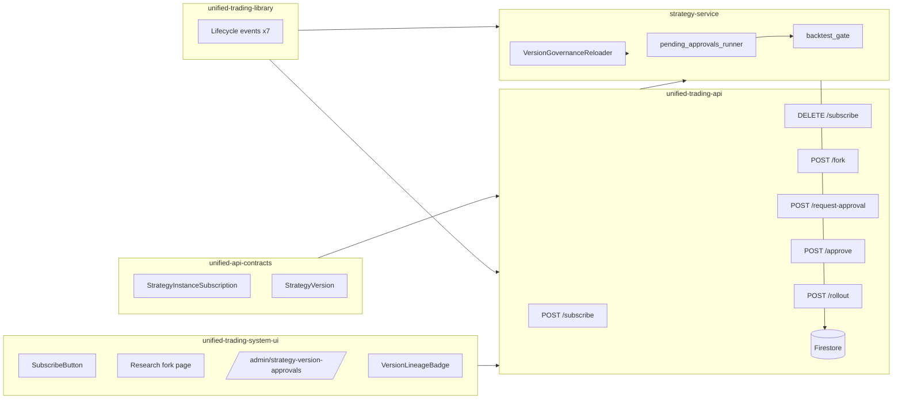

## Deferred work — migrated to:

**None** — successor: not applicable. Plan archived as 100% completed (no open `- [ ]` items at archive time). Any
incidental DEFERRED / post-cutover / out-of-scope tokens in the body are historical context, not unfinished work.

## Architecture diagram (Mermaid)

## Related plans

- [Plan A — strategy-lifecycle-maturity-model](./strategy_lifecycle_maturity_model_2026_04_21.md)
- [Plan B — strategy-catalogue-3tier-surface](./strategy_catalogue_3tier_surface_2026_04_21.md)
- [Plan C — performance-overlay-continuous-timeline](./performance_overlay_continuous_timeline_2026_04_21.md)
- [Plan E — orphan-audit-policy](./orphan_audit_policy_2026_04_21.md)
