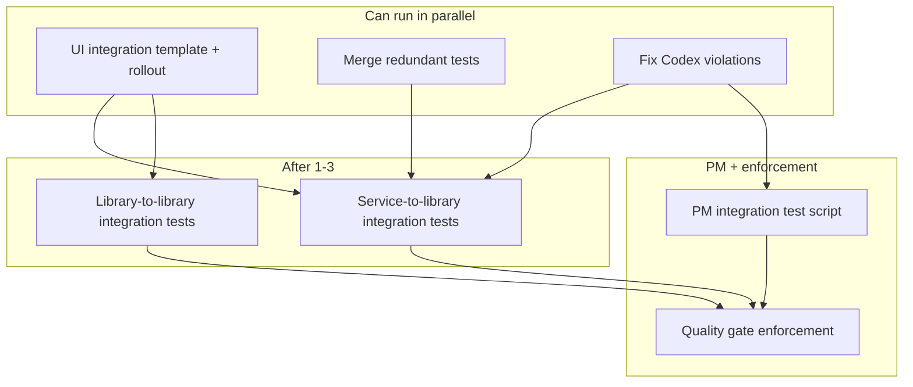

# Integration Tests, Codex Compliance, and PM Integration Plan

## Scope

Seven workstreams to be executed (can be parallelized across agents):

1. UI integration test template and rollout
2. Merge/remove redundant tests without affecting coverage
3. Fix Codex violations
4. Service-to-library integration tests (direct deps only)
5. Library-to-library integration tests (direct deps only)
6. PM integration test script
7. Quality gate enforcement for integration test requirements

### Completion Summary (2026-03-13)

- **Workstream 1 (UI integration):** Done — template + rollout to 12 UIs
- **Workstream 2 (Merge coverage-boost):** Done for market-data-processing-service, features-multi-timeframe-service,
  unified-trading-library, features-onchain-service, features-calendar-service. instruments-service: verify if any
  coverage-boost files remain.
- **Workstreams 4–7:** Done — integration dep coverage check, PM script, QG enforcement
- **Library-dep integration tests:** Added for features-calendar-service (3 files: UDC, UIC, UFCL),
  features-onchain-service (test_library_deps_integration.py). Both pass check-integration-dep-coverage.py.
- **SSOT:** `unified-trading-pm/docs/testing/testing-requirements.md`; audit prompt §10; Codex SSOT index; cursor rule
  `testing-requirements-integration.mdc`

---

## 1. UI Integration Test Template and Rollout

**Goal:** Centralize the integration test pattern in PM and propagate to all 12 UI repos.

**Current state:** Each UI has its own `tests/integration/api.integration.test.ts` with the same pattern (real fetch,
skip when API unreachable). No shared template.

**Implementation:**

- Create
  [unified-trading-pm/scripts/quality-gates-base/ui-integration-test.template.ts](unified-trading-pm/scripts/quality-gates-base/ui-integration-test.template.ts)
  with placeholders:
  - `{{UI_NAME}}` (e.g. deployment-ui)
  - `{{API_NAME}}` (e.g. deployment-api)
  - `{{ENV_VAR}}` (e.g. INTEGRATION_TEST_API_URL)
  - `{{DEFAULT_URL}}` (e.g. [http://localhost:8004](http://localhost:8004))
  - `{{ENDPOINTS}}` — list of GET paths to test (e.g. /health, /services)
- Add UI-to-API mapping config (JSON or YAML in PM) keyed by repo name
- Extend [rollout-quality-gates-unified.py](unified-trading-pm/scripts/propagation/rollout-quality-gates-unified.py) to:
  - For each UI repo, render the template with repo-specific values
  - Write to `tests/integration/api.integration.test.ts`
  - Ensure vitest `include` has `tests/integration/**/*.integration.test.{ts,tsx}`
  - Ensure `package.json` has `test:integration` script
- Update [base-ui.sh](unified-trading-pm/scripts/quality-gates-base/base-ui.sh) so `npm test` runs integration tests
  (they already run via vitest include; integration tests skip when API unreachable)

**Files to create/modify:**

- `unified-trading-pm/scripts/quality-gates-base/ui-integration-test.template.ts` (new)
- `unified-trading-pm/scripts/propagation/ui-api-mapping.json` (new) — maps each UI to API base URL and endpoints
- `unified-trading-pm/scripts/propagation/rollout-quality-gates-unified.py` — add integration test copy step for UI
  repos

---

## 2. Merge/Remove Redundant Tests Without Affecting Coverage

**Goal:** Consolidate coverage-boost files into main unit tests per
[test-quality-standards.mdc](.cursor/rules/testing/test-quality-standards.mdc). No `test_*_extended.py`; expand existing
test files.

**Strategy:** Before merging, run coverage baseline. Merge tests. Re-run coverage. Ensure coverage does not drop.

**Repos and files to consolidate:**

| Repo                             | Coverage-boost files                                      | Target (merge into)                                                                  | Status  |
| -------------------------------- | --------------------------------------------------------- | ------------------------------------------------------------------------------------ | ------- |
| instruments-service              | (if any remain: test*coverage_boost*.py, testcoverage.py) | test_instrument_processing_service.py, test_batch_processor.py, test_config.py, etc. | Pending |
| market-data-processing-service   | (merged)                                                  | —                                                                                    | Done    |
| features-multi-timeframe-service | (merged)                                                  | —                                                                                    | Done    |
| unified-trading-library          | (merged)                                                  | —                                                                                    | Done    |
| features-onchain-service         | (merged)                                                  | —                                                                                    | Done    |
| features-calendar-service        | (merged)                                                  | —                                                                                    | Done    |

**Process per repo:**

1. Run `bash scripts/quality-gates.sh` to capture baseline coverage
2. For each coverage-boost file: identify which module it exercises; move test cases into the primary test file for that
   module
3. Delete the coverage-boost file
4. Re-run quality gates; assert coverage unchanged or improved

---

## 3. Fix Codex Violations

**Repos with known violations:**

| Repo                                 | Violation                                                                                                                                                                                                                                                                                                          | Fix                                                                                                                                                                                                              |
| ------------------------------------ | ------------------------------------------------------------------------------------------------------------------------------------------------------------------------------------------------------------------------------------------------------------------------------------------------------------------ | ---------------------------------------------------------------------------------------------------------------------------------------------------------------------------------------------------------------- |
| **features-sports-service**          | `asyncio.run()` in file with `for` (list comprehensions in [cli/main.py](features-sports-service/features_sports_service/cli/main.py))                                                                                                                                                                             | Extract `asyncio.run(async_main(...))` into a separate thin `_entry.py` with no loops, or add `ASYNCIO_RUN_EXCLUDE_GLOBS` in quality-gates.sh if false positive                                                  |
| **instruments-service**              | (1) `asyncio.run()` in loop in [defi_processor.py](instruments-service/instruments_service/engine/processors/defi_processor.py); (2) imports inside functions in [venue_adapter_loader.py](instruments-service/instruments_service/adapters/venue_adapter_loader.py); (3) files >900 L; (4) function size exceeded | Fix asyncio; move imports to top; split `InstrumentProcessingBase`, `CloudInstrumentStorage.store_instruments` per [file-splitting-guide.md](unified-trading-/codex/06-coding-standards/file-splitting-guide.md) |
| **market-data-processing-service**   | (1) `asyncio.run()` in loop in [live_mode_handler.py](market-data-processing-service/market_data_processing_service/); (2) imports inside functions in `types.py`, `orchestration_state.py`; (3) files >900 L; (4) function size exceeded                                                                          | Same pattern                                                                                                                                                                                                     |
| **features-calendar-service**        | QG failed before Codex — re-run to capture                                                                                                                                                                                                                                                                         | TBD after re-run                                                                                                                                                                                                 |
| **features-multi-timeframe-service** | Same                                                                                                                                                                                                                                                                                                               | TBD                                                                                                                                                                                                              |
| **features-onchain-service**         | Same                                                                                                                                                                                                                                                                                                               | TBD                                                                                                                                                                                                              |
| **unified-trading-library**          | QG timeout                                                                                                                                                                                                                                                                                                         | Run with `--quick` or increase `MAX_DURATION`                                                                                                                                                                    |

**Repos already passing:** market-tick-data-service, strategy-service, trading-agent-service.

---

## 4. Service-to-Library Integration Tests

**Requirement:** Every service must have integration tests that exercise every **direct** library dependency from
[workspace-manifest.json](unified-trading-pm/workspace-manifest.json).

**Example:** instruments-service depends on `unified-trading-library`, `unified-domain-client`,
`unified-config-interface`, etc. It must have `tests/integration/test_*_library.py` (or equivalent) that imports and
uses symbols from each dep and asserts expected behavior.

**Implementation:**

- Add Codex/compliance check in [base-service.sh](unified-trading-pm/scripts/quality-gates-base/base-service.sh): for
  each entry in manifest `dependencies[]` that is a library (type=library), verify at least one test file in
  `tests/integration/` imports from that library and exercises it
- Pattern: `tests/integration/test_<dep_name>_integration.py` or tests that `rg "from unified_<dep>" tests/integration/`
  finds
- Document in Codex: integration tests must use real (or contract-faked) library behavior, not mocks

**Manifest:** Dependencies already exist. No manifest change needed for libraries. Services that call other **services**
(APIs) need those as deps for integration tests — separate consideration.

---

## 5. Library-to-Library Integration Tests

**Requirement:** Every library must have integration tests that exercise every **direct** library dependency.

**Example:** unified-trading-library depends on `unified-cloud-interface`, `unified-config-interface`,
`unified-events-interface`, `unified-internal-contracts`. It must have integration tests that import and use those.

**Implementation:**

- Add check in [base-library.sh](unified-trading-pm/scripts/quality-gates-base/base-library.sh): for each manifest
  library dep, verify integration test coverage
- Libraries currently run `tests/unit/` only (`RUN_INTEGRATION` not used). Add `RUN_INTEGRATION` support for libraries,
  or add `tests/integration/` that run when present
- Pattern: `tests/integration/test_<dep>_integration.py`

---

## 6. PM Integration Test Script

**Goal:** Verify that PM setup scripts, symlinks, and quality-gates base work correctly for all 67 repos.

**Implementation:**

- Create [unified-trading-pm/scripts/pm-integration-test.sh](unified-trading-pm/scripts/pm-integration-test.sh) (or in
  system-integration-tests):
  1. For each repo in manifest: `cd $repo && bash scripts/setup.sh` (or `setup-workspace-from-manifest.sh` for
     workspace-level)
  2. Verify expected files exist: `scripts/quality-gates.sh`, `scripts/setup.sh`, cursor rules if applicable
  3. Run `bash scripts/quality-gates.sh --lint` (fast path) — must pass
  4. On failure: report which repo and which step failed
- Optional: snapshot expected script checksums or structure; fail if PM changes break a repo
- Run in CI (e.g. on PM PRs) or as part of system-integration-tests

**Alternative:** Add to [system-integration-tests](system-integration-tests) as a "PM contract" test that iterates repos
and asserts setup/quality-gates work.

---

## 7. Quality Gate Enforcement for Integration Tests

**Implementation:**

- In base-service.sh: after existing checks, add step that reads manifest `dependencies[]`, filters to type=library, and
  for each: `rg -l "from unified_<lib>|import unified_<lib>" tests/integration/` — fail if any dep has no integration
  test coverage
- In base-library.sh: same for library deps
- Document bypass in QUALITY_GATE_BYPASS_AUDIT.md for repos with legitimate exclusions (e.g. deprecated deps)

---

## Execution Order (Parallelizable)

**Suggested agent split:**

- Agent 1: UI template + rollout
- Agent 2: Merge redundant tests (instruments, market-data-processing, features-)
- Agent 3: Fix Codex violations (features-sports, instruments, market-data-processing)
- Agent 4: Service-to-library + library-to-library integration test requirements + quality gate enforcement
- Agent 5: PM integration test script

---

## Key Files

| Purpose                          | Path                                                                               |
| -------------------------------- | ---------------------------------------------------------------------------------- |
| UI integration template          | `unified-trading-pm/scripts/quality-gates-base/ui-integration-test.template.ts`    |
| UI–API mapping                   | `unified-trading-pm/scripts/propagation/ui-api-mapping.json`                       |
| Rollout script                   | `unified-trading-pm/scripts/propagation/rollout-quality-gates-unified.py`          |
| Base service (integration check) | `unified-trading-pm/scripts/quality-gates-base/base-service.sh`                    |
| Base library (integration check) | `unified-trading-pm/scripts/quality-gates-base/base-library.sh`                    |
| PM integration test              | `unified-trading-pm/scripts/pm-integration-test.sh` or `system-integration-tests/` |
| Manifest                         | `unified-trading-pm/workspace-manifest.json`                                       |

## Coordination: ui-api-alerting-observability plan

The ui-api-alerting-observability-2026-03-14 plan extends UI integration tests to cover all mapped API endpoints (not
just /health). The ui-integration-test.template.ts and rollout script from this plan are reused. No conflicts — the
observability plan builds on top of this plan's work.
