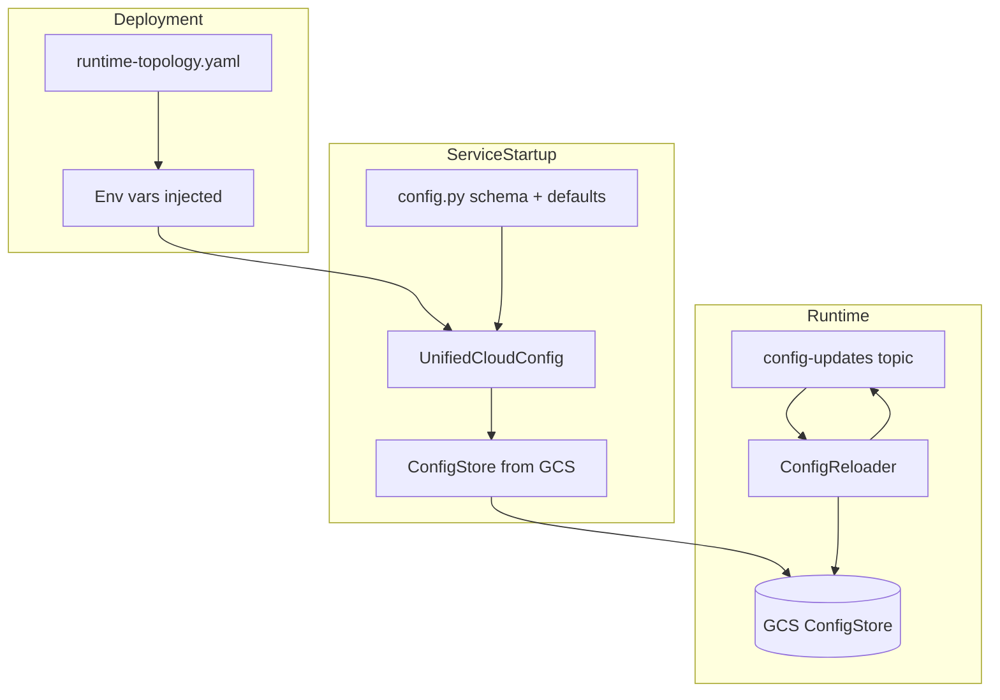
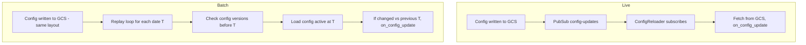
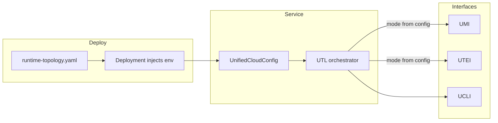

# Mode, Config, and Env Var Architecture Plan

## 1. Implementation Order (Execute in This Sequence)

**Phase 1: Library Refactor (All Libraries First)** Do all library changes before touching any service. UIC env canon,
UCI/UCLI adoption, UTL merge with UDC, UFC split. Declare dependency changes. Quality gates must pass on each library.

**Phase 2: Manifest and Dependency Declaration** Update workspace-manifest.json with all dependency changes from UTL
merge, UFC split, UDC removal. Regenerate WORKSPACE_MANIFEST_DAG.svg via generate_workspace_dag.py. Validate tier
structure and no circular imports.

**Phase 3: Service Refactor (All Services, One by One)** Refactor every service—no exceptions. Update imports to use
UTL, UIC, calculators. Align config.py structure. Run quality gates per service. Test failures when missing imports that
are declared in manifest.

**Phase 4: Import and Manifest Validation** Test each service. Validate manifest-declared dependencies match actual
imports. Fail when service declares dep but does not import, or imports but does not declare.

---

## 2. Core Principles

### 2.1 Mode is Deployment-Time (Never Dynamic)

| Mode Type        | Examples                                              | Change Requires |
| ---------------- | ----------------------------------------------------- | --------------- |
| Live vs batch    | `RUNTIME_MODE=live`                                   | Redeploy        |
| Mock vs real     | `DATA_MODE=mock`                                      | Redeploy        |
| Operational mode | `PHASE_MODE=phase2`, instruments vs corporate actions | Redeploy        |
| Cloud provider   | `CLOUD_PROVIDER=gcp`                                  | Redeploy        |

**Implication:** No runtime switching. Deployment injects env vars from `runtime-topology.yaml`. Service reads once at
startup via config. UTL routes based on mode from config.

### 2.2 Service config.py: Schema + Defaults (Local)

Each service has a `config.py` that defines:

- **Pydantic schema** extending `UnifiedCloudConfig`
- **Defaults** for all fields
- **validation_alias** for env var overrides (using UIC canonical names)

Example (from
[features-cross-instrument-service/config.py](features-cross-instrument-service/features_cross_instrument_service/config.py)):

```python
class FeaturesCrossInstrumentConfig(UnifiedCloudConfig):
    mode: str = Field(default="batch", validation_alias=AliasChoices("MODE", "FEATURES_MODE"))
    base_timeframe: str = Field(default="15s", validation_alias=AliasChoices("BASE_TIMEFRAME"))
```

**Purpose:** Schema + defaults for local dev, tests, and bootstrap. Not the source of persisted runtime config.

### 2.3 Runtime Config: GCS (Persisted, Versioned, Hot-Reloadable)

| Concern                   | Location                            | Flow                                                                                                        |
| ------------------------- | ----------------------------------- | ----------------------------------------------------------------------------------------------------------- |
| **Persisted config**      | GCS ConfigStore                     | `{bucket}/{service}/schema-v{semver}/config-v{timestamp}.yaml` + `active.yaml`                              |
| **Load at startup**       | UCI `get_config_store()`            | Service calls UTL → UTL → UCI → UCLI (GCS)                                                                  |
| **Hot reload (live)**     | PubSub `config-updates` topic       | ConfigReloader subscribes; on message, reload from GCS                                                      |
| **Config replay (batch)** | Time-ordered GCS read during replay | Same layout as live; at each replay timestamp T, load config active at T; if changed, call on_config_update |
| **Update trigger**        | ConfigReloader.publish_update()     | Writes to GCS, publishes to PubSub (live) or GCS-only (batch)                                               |

**Flow diagram:**



### 2.4 Batch-Live Symmetry for Config

**Goal:** Minimal hops between live and batch. If you run live trading for 5 days, then want a batch replay of those 5
days, the persisted config from live should be directly usable. Same config layout, same versioning, same update
semantics—only the transport differs.

**Live mode:** Config updates written to GCS; `config-updates` event published to PubSub. ConfigReloader subscribes; on
message, fetches from GCS, updates in-memory, triggers service refresh.

**Batch mode (symmetry):** No PubSub. Config loaded from GCS per time window. Same persistence layout as live. As batch
replays through historical time (day 1 → day 2 → day 3), check: "Did config change between day 1 and day 2?" If yes,
load the config version active at that timestamp and trigger the same internal refresh logic as live.

**Unified consumer logic:** Service has a single `on_config_update(new_config)` handler. Live: triggered by PubSub
message. Batch: triggered by time-ordered config check during replay. The handler is identical.

**Batch ConfigReplay implementation:** A thread or loop runs alongside batch replay. At each replay timestamp T (or at
config-check intervals aligned to replay speed): (1) Query GCS for config versions with timestamp ≤ T; (2) Load config
active at T; (3) Compare to current in-memory config; (4) If different: call `on_config_update(new_config)`, same as
live.

**Result:** Live and batch share the same config persistence, the same `on_config_update` handler, and the same refresh
logic. Only the trigger mechanism differs (PubSub vs time-ordered GCS read).



### 2.5 Mode Flow: Deployment → Config → UTL



Service never calls `os.getenv`. Config (Pydantic) reads env at construction. UTL receives config and routes.

---

## 3. Canonical Env Vars in UIC

### 3.1 Problem

Env vars are scattered: UCI `cloud_config.py`, UCLI `constants.py`, services with ad-hoc `validation_alias`. No single
source of truth. Risk of typos, duplicates, divergent names.

### 3.2 Solution: UIC as Canonical Registry

**Add to UIC:** `unified_internal_contracts/env_canon.py` (or extend `modes.py`):

```python
# Canonical env var names - SINGLE SOURCE OF TRUTH
# All repos MUST use these constants. No os.getenv with literal strings.
class EnvVars:
    # Mode (deployment-time)
    RUNTIME_MODE = "RUNTIME_MODE"      # live | batch
    DATA_MODE = "DATA_MODE"            # mock | real
    CLOUD_PROVIDER = "CLOUD_PROVIDER"  # gcp | aws | local
    PHASE_MODE = "PHASE_MODE"          # phase1 | phase2 | phase3

    # Project / bootstrap
    GCP_PROJECT_ID = "GCP_PROJECT_ID"
    RUNTIME_TOPOLOGY_PATH = "RUNTIME_TOPOLOGY_PATH"
    WORKSPACE_ROOT = "WORKSPACE_ROOT"

    # Protocol (from topology)
    PROTOCOL_DATA_SINK_BUCKET = "PROTOCOL_DATA_SINK_BUCKET_{ROUTING_KEY}"
    PROTOCOL_EVENT_BUS_TOPIC = "PROTOCOL_EVENT_BUS_TOPIC_{ROUTING_KEY}"

    # ... full list from UCI cloud_config.py audit
```

**UCI:** Import `EnvVars` from UIC; use `validation_alias=EnvVars.GCP_PROJECT_ID` instead of literal `"GCP_PROJECT_ID"`.

**Bootstrap exception:** UCLI `factory.py`, UCI `_env_bootstrap.py` may read env before config exists. They MUST use
`EnvVars.`\* constants from UIC. Document in QUALITY_GATE_BYPASS_AUDIT.md.

### 3.3 Quality Gate: Env Var Canon Compliance

**New check (PM or per-repo quality-gates):**

1. Grep for `os.getenv(`, `os.environ[`, `os.environ.get(` (exclude tests, conftest, CI scripts).
2. Extract the env var key (string literal or variable).
3. If literal: must match a key in `EnvVars` from UIC.
4. If variable: must be assigned from `EnvVars.`\*.
5. Fail if any env read uses a non-canonical key.

**Bootstrap allowlist:** `_env_bootstrap.py`, `factory.py`, `constants.py` — must still use UIC constants.

---

## 4. Config Flow: config.py vs GCS

### 4.1 Clarification

| Layer              | Purpose               | Source                                                      |
| ------------------ | --------------------- | ----------------------------------------------------------- |
| **config.py**      | Schema + defaults     | Local to service; Pydantic; used for validation, dev, tests |
| **Runtime config** | Actual values in prod | GCS ConfigStore; versioned; hot-reloadable                  |
| **Bootstrap**      | Before GCS available  | Env vars → UnifiedCloudConfig (Pydantic reads env)          |

**config.py does NOT hold runtime state.** It defines the shape. At runtime:

1. Service starts; deployment has set env vars.
2. `UnifiedCloudConfig()` (or service-specific subclass) is constructed — Pydantic reads env.
3. For domain config (instruments, strategies, etc.): `ConfigStore.load_config()` from GCS.
4. ConfigReloader subscribes to `config-updates`; on event, reload from GCS.

### 4.2 When to Use What

| Scenario                     | Use                                                                    |
| ---------------------------- | ---------------------------------------------------------------------- |
| Local dev, tests             | `load_config(MyConfig, config_file="config/dev.yaml")` — file + env    |
| Production, versioned        | `ConfigStore` (GCS) — `get_config_store(domain).load_config(MyConfig)` |
| Bootstrap (project_id, mode) | `UnifiedCloudConfig()` — Pydantic from env                             |

---

## 5. UTL Orchestration and Mode

### 5.1 Service Agnostic of Infrastructure

Service declares intent: "I need execution adapter for binance." UTL:

1. Reads config (already loaded; mode is in config).
2. Routes to UTEI with `mode=config.data_mode`, `runtime_mode=config.runtime_mode`.
3. Returns adapter.

Service never says "I need PubSub" or "I need GCS." Topology + mode determine that.

### 5.2 Libraries Need Mode for Testing

Libraries (UMI, UTEI, UTL) must test different code paths (live vs batch, mock vs real). They receive mode via:

- **Injected config** in tests (mock config with `runtime_mode="batch"`).
- **No os.getenv** — config object passed in.

---

## 6. Implementation Tasks

**Rollout is exhaustive—every service must be updated.** No exceptions. All libraries refactored first; manifest
updated; then each service refactored one-by-one. Quality gates and manifest DAG regeneration required after manifest
changes.

### 6.1 UIC: Canonical Env Vars

- Add `unified_internal_contracts/env_canon.py` with `EnvVars` class (all keys from UCI audit).
- Add `EnvVars.ROUTING_KEYS` or similar for dynamic keys (`PROTOCOL_DATA_SINK_BUCKET_INSTRUMENTS`).
- Export from `unified_internal_contracts/__init__.py`.
- Document: "All env var names MUST come from here. No literals."

### 6.2 UCI: Use UIC EnvVars

- Replace all `validation_alias=AliasChoices("GCP_PROJECT_ID", ...)` with `EnvVars.GCP_PROJECT_ID`.
- Import `EnvVars` from UIC. (UCI already depends on UEI, UCLI; add UIC if not present.)

### 6.3 UCLI: Use UIC EnvVars

- Replace literal env keys in `factory.py`, `constants.py` with `EnvVars.`\*.
- Document bootstrap exception in QUALITY_GATE_BYPASS_AUDIT.md.

### 6.4 Quality Gate: Env Canon Check

- Add script: `scripts/validation/check_env_canon.py` (or in base-codex.sh).
- Grep `os.getenv`, `os.environ`; validate keys against UIC `EnvVars`.
- Add to quality-gates (PM base script) or per-repo.

### 6.5 Config Documentation

- Update CODEX or UCI docs: config.py = schema + defaults; runtime = GCS; hot reload = PubSub event.
- Add diagram (mermaid) to `04-architecture/` or `08-workflows/config-injection.md`.

### 6.6 Service config.py Audit

- Ensure every service config extends `UnifiedCloudConfig`.
- Ensure `validation_alias` uses UIC `EnvVars` (after 5.1).
- Document pattern: "config.py defines schema; GCS holds runtime; ConfigStore for domain config."

### 6.7 Topology and Tier Structure

- Ensure `runtime-topology.yaml` (PM) remains SSOT for deployment.
- Ensure tier structure (from prior plan) is reflected in manifest: UTL above interfaces, no orphans.
- Validate `generate_workspace_dag.py` and topology-dependent scripts still work after any manifest/tier changes.

### 6.8 Manifest Integration Tests and Import Alignment

- `capabilities_needed` drives which integration tests run.
- Add check: service's `capabilities_needed` matches what it actually imports/uses (e.g. if it uses ConfigStore, must
  have `config_store`).
- **Manifest vs import alignment:** For each service, validate that `dependencies` in manifest match actual imports.
  Fail when: (a) service declares dep X in manifest but does not import it; (b) service imports Y but does not declare
  it in manifest. Add `check_manifest_import_alignment.py` or extend existing validation.
- **Test failures on missing declared deps:** Integration tests must fail when a service declares a dependency in
  manifest but does not use it (or uses it incorrectly).

---

## 7. Dependency Order (No Circular Imports)

**UIC env_canon.py:** No imports from UCI or UCLI. Pure constants. UIC can depend on UAC only.

**UCI:** Imports `EnvVars` from UIC. UCI depends on UIC (add if missing). No cycle: UIC → UAC; UCI → UIC, UEI, UCLI.

**UCLI:** Imports `EnvVars` from UIC. UCLI is T0; adding UIC would make it T0+UIC. But UCLI is the cloud boundary and
often needs env before config. Option: UCLI keeps minimal bootstrap; only `factory.py` and `constants.py` use env, and
they use UIC constants. UIC does not depend on UCLI, so no cycle.

---

## 8. Scripts and Topology

| Script                           | Action                                                              |
| -------------------------------- | ------------------------------------------------------------------- |
| `generate_workspace_dag.py`      | No change if tier structure is updated in manifest; regenerates DAG |
| `validate_workspace_manifest.py` | Add check: `capabilities_needed` present for services               |
| `runtime_topology_validator.py`  | Ensure it validates against manifest                                |
| `sync-configs.py`                | No change; syncs topology to GCS                                    |

---

## Coordination: ui-api-alerting-observability plan

LOG_LEVEL canonical enum (`LogLevel` StrEnum: DEBUG, INFO, WARNING, ERROR, CRITICAL) lives in `unified-api-contracts`
(per ui-api-alerting-observability-2026-03-14 plan). UIC `EnvVars` should add `LOG_LEVEL = "LOG_LEVEL"` as a canonical
env var name, and services should validate the env var value against `LogLevel` from UAC. The enum (valid values) is in
UAC; the env var name constant is in UIC `EnvVars`.

---

## 9. Summary: config.py Meaning

**Every service config.py:**

1. **Is** a Pydantic schema extending `UnifiedCloudConfig`.
2. **Has** defaults for all fields.
3. **Uses** `validation_alias=EnvVars.X` (from UIC) for env overrides.
4. **Is not** the runtime config store. Runtime config is in GCS.
5. **Is used for** local dev, tests, and bootstrap (env → config at startup).
6. **Domain config** (instruments, strategies, etc.) lives in ConfigStore (GCS); hot reload via PubSub `config-updates`
   event; UCI/ConfigReloader orchestrate.
