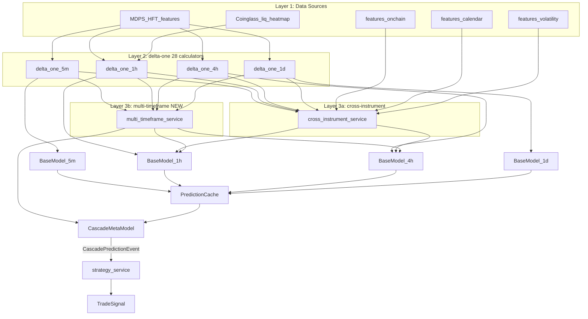

# Master Plan: Citadel-Grade ML + Multi-TF Cascade Architecture

## Blockers

| Blocker                                                      | Type          | Specific Dependency                                                                                                                                         | Resolution                                                                                                                    |
| ------------------------------------------------------------ | ------------- | ----------------------------------------------------------------------------------------------------------------------------------------------------------- | ----------------------------------------------------------------------------------------------------------------------------- |
| citadel_grade_feature_architecture.md not complete           | `[PLAN_TODO]` | [citadel_grade_feature_architecture.md](citadel_grade_feature_architecture.md) § todos `feed-all-22-groups`, `standardise-windows`, `window-ratio-features` | The cascade plan builds on top of the citadel plan's feature bank and window standardisation; those must be done first        |
| features-multi-timeframe-service (FMTS) not created/hardened | `[PLAN_TODO]` | [phase3_service_hardening_integration.md](phase3_service_hardening_integration.md) § todo `t4c-features-layer` (FMTS entry)                                 | Multi-TF cascade requires FMTS to be a live service consuming higher-TF feature groups via PubSub/GCS                         |
| features-delta-one-service T4-hardened                       | `[PLAN_TODO]` | [phase3_service_hardening_integration.md](phase3_service_hardening_integration.md) § todo `t4c-features-layer` (FDS entry)                                  | FDS must be green before the `add-explicit-binary-thresholds` and `replace-time-since-with-binary-horizons` changes can merge |

---

## Section 0: GBT Feature Design Principles

These principles govern every calculator added or modified in this plan. Violating them wastes feature budget and
pollutes the SHAP signal.

### Rule 1: Monotonic Transforms Are Worthless for Trees

A gradient boosted tree splits on thresholds. If feature B is a monotonic function of feature A, the tree can always
find the equivalent threshold on A without B. B adds zero information and wastes one of the ~300-500 selected feature
slots.

**Delete:**

- `vol_percentile_{window}` — percentile rank of vol vs rolling window (monotonic of raw vol)
- Any `_zscore_` suffixed features — GBT finds the threshold on raw data
- Any `_normalized_` features where normalization is just `(x - mean) / std`
- `return_percentile_5bar` as a percentile _rank_ — monotonic of raw return (keep if using as a learning-to-rank target,
  not as a feature)

**Keep — these look similar but are NOT monotonic transforms:**

- `vol_ratio_1h_4h = atr_1h / atr_4h` — ratio of two different features. Not derivable without the cross-split.
- `momentum_acceleration = roc_5 / roc_20` — same, ratio
- `channel_convergence = upper_slope - lower_slope` — difference of two different features
- `fib_confluence_score` — count aggregation, not monotonic of any single input
- `vol_regime` (categorical 0/1/2) — discrete bucketing, not monotonic

**The test:** Ask "if I remove this feature, can the tree eventually learn the same splits using only the features that
remain?" If YES → delete it.

### Rule 2: Multi-Horizon Binary Encoding Replaces Raw "Time Since"

**Important implementation note:** Both `features_delta_one_service/app/calculators/base.py` (pandas) and
`features_cross_instrument_service/app/calculators/base_calculator.py` (Polars) already auto-generate raw
`time_since_{event}` integers from any binary column via `_add_time_since_events()`. Multi-horizon binary encoding is a
_replacement_ for this output, not filling a missing capability. Implementation requires adding a
`_add_event_horizon_binaries()` method to both base class variants, either replacing `_add_time_since_events()` or
running both in parallel if raw time_since is still needed for other purposes.

Raw `time_since_swing_high = 15` tells the tree an integer. It has to waste multiple splits to learn "fresh vs stale."
Instead, create binary indicators at a range of lookback windows. The tree can then split on
`swing_high_in_last_5_bars = 1 AND swing_high_in_last_20_bars = 0` in a single node.

**Pattern: for every discrete event, create this feature family:**

```python
{event}_in_last_1_bar   # was this event very recent (this bar)?
{event}_in_last_3_bars  # within 3 bars
{event}_in_last_5_bars  # within 5 bars (1 trading session at 1h TF)
{event}_in_last_10_bars
{event}_in_last_20_bars
{event}_in_last_50_bars # distant — context window
```

**Events to encode with this pattern:**

- `swing_high_touched`, `swing_low_touched`
- `bos_detected`, `choch_detected`
- `entered_demand_zone`, `entered_supply_zone`
- `touched_round_number`, `touched_fib_0618`, `touched_fib_0750`
- `touched_weekly_open`, `touched_monday_high`, `touched_monday_low`
- `large_liquidation_event` (already in liquidations.py as binary — extend with horizons)
- `regime_changed`, `vol_regime_changed` (already binary — add horizons)
- `cme_gap_filled`

This pattern automatically encodes time since, recency decay, and event staleness — all without monotonic transforms.

### Rule 3: Explicit Binary Thresholds at Known Meaningful Levels

For continuous features with well-understood critical thresholds, add explicit binary indicators. The tree would find
these eventually but wastes depth doing so.

```python
# RSI thresholds (overbought/oversold)
rsi_overbought   = (rsi_14 > 70).astype(int)
rsi_oversold     = (rsi_14 < 30).astype(int)
rsi_extreme_ob   = (rsi_14 > 80).astype(int)
rsi_extreme_os   = (rsi_14 < 20).astype(int)

# Funding rate critical levels
funding_extreme_pos  = (funding_rate > 0.001).astype(int)   # already exists ✅
funding_extreme_neg  = (funding_rate < -0.001).astype(int)  # already exists ✅

# Volatility regime relative to history
vol_high_vs_30d   = (atr_14 > rolling_75pct_30d).astype(int)   # replaces vol_percentile
vol_low_vs_30d    = (atr_14 < rolling_25pct_30d).astype(int)
vol_extreme_high  = (atr_14 > rolling_90pct_30d).astype(int)

# BTC dominance direction
btc_dominance_rising   = (btc_dominance_roc_1d > 0).astype(int)
btc_dominance_falling  = (btc_dominance_roc_1d < 0).astype(int)

# Level proximity (already done for round_numbers — apply same to new calculators)
at_demand_zone    = (distance_to_demand_bottom < 0.003).astype(int)
at_supply_zone    = (distance_to_supply_top < 0.003).astype(int)
at_fib_0618       = (distance_to_fib_0618_pct < 0.003).astype(int)
at_fib_0750       = (distance_to_fib_0750_pct < 0.003).astype(int)
at_weekly_open    = (abs(price_vs_weekly_open_pct) < 0.003).astype(int)
```

### Rule 4: Ratio Features for Non-Obvious Interactions

GBTs need many splits to approximate `A/B`. Providing the ratio directly costs one feature slot and conveys a
non-redundant signal.

```python
# Multi-resolution compression (core of wedge/squeeze detection)
vol_compression_5_50   = atr_5 / atr_50    # short vol vs medium vol
vol_compression_8_100  = atr_8 / atr_100   # breakout proximity
momentum_accel_5_20    = roc_5 / (roc_20 + eps)
momentum_accel_8_50    = roc_8 / (roc_50 + eps)

# Cross-asset ratio (relative performance)
symbol_vs_btc_return_4h = return_4h_symbol - return_4h_btc
symbol_beta_vs_btc      = rolling_cov(symbol, btc) / rolling_var(btc)

# OI velocity
oi_acceleration   = oi_change_ma_8 / (oi_change_ma_48 + eps)
```

### Rule 5: Avoid Sparse Binaries Unless Aggregated

A binary feature that fires in 0.1% of rows is useless — the tree never has enough samples to split confidently. For
rare events (iceberg_order_count, specific pattern triggers), aggregate over larger windows or combine with other
signals into a composite binary.

```python
# BAD: fires rarely
iceberg_detected_this_bar   # might be 0.01% of bars

# GOOD: aggregated
iceberg_count_last_20_bars  # count over window — has variance
iceberg_active              # 1 if count_last_20 > 0
```

### Rule 6: Scale Invariance via ATR Normalization

All price-level distances and sizes must be ATR-normalized so features are comparable across instruments, timeframes,
and market regimes.

```python
# BAD: raw distance in USD
distance_to_demand_zone = close - demand_zone_top  # means nothing across BTC vs SOL

# GOOD: ATR-normalized
distance_to_demand_zone_pct   = (close - demand_zone_top) / close
demand_zone_proximity_atr     = (close - demand_zone_top) / atr_14
```

---

## Section 1: HFT Plan Status

### What is Done (scaffolded/implemented)

| Workstream               | Status         | Features                                                                                                                                                                                                                                                                                                      |
| ------------------------ | -------------- | ------------------------------------------------------------------------------------------------------------------------------------------------------------------------------------------------------------------------------------------------------------------------------------------------------------- |
| Tier 1 MDPS              | ✅ Implemented | trade*size_p10/50/90/99, spread_volatility_15s, book_pressure_gradient, whale_trade_count, effective_to_quoted_ratio, liq_inter_time*_, volume*clock*_                                                                                                                                                        |
| Tier 1 delta-one         | ✅ Implemented | amihud*illiquidity*\_, vpin\_\_, kyles*lambda*\*, spread*breach, imbalance_extreme, extreme_bid_imbalance, extreme_ask_imbalance (all binary — auto-generate time_since via delta-one base class; candidates for multi-horizon binary expansion), time_to_volume*{1000,5000,10000} (volume clock, continuous) |
| Tier 2 cross-instrument  | ✅ Implemented | regime_hmm_state, regime_changepoint, cross_venue_spreads, rv_iv_ratio, cross_asset_correlation                                                                                                                                                                                                               |
| Tier 3 TradFi vol        | ✅ Implemented | atm_iv_30d, skew_25d, term_structure_slope, vol_surface_convexity                                                                                                                                                                                                                                             |
| Tier 4 external adapters | ✅ Implemented | CryptoPanic, LunarCrush, CryptoQuant, DefiLlama, FRED, Yahoo Finance                                                                                                                                                                                                                                          |
| Tier 5 incremental book  | ✅ Implemented | order*cancellation_rate, iceberg_order_count, arrival_rate_level*\*                                                                                                                                                                                                                                           |
| Schemas/contracts        | ✅ Done        | CanonicalOptionQuote, CanonicalBookUpdate, CrossInstrumentFeatures                                                                                                                                                                                                                                            |
| Manifest/topology/DAGs   | ✅ Done        | Workspace manifest, runtime topology, SVGs, topology-dag                                                                                                                                                                                                                                                      |

### What is NOT Done — Split by Plan

**Covered in this plan (setup + unit tests):**

| Task                                                     | Todo ID                        |
| -------------------------------------------------------- | ------------------------------ |
| Unit tests for HFT calculators (mock-based, no live I/O) | `hft-unit-tests`               |
| Document required API keys in credentials-registry.yaml  | `hft-provision-api-keys-setup` |

**Moved to `consolidated_remaining_work.md` (deployment + hardening):**

| Task                                                                                              | Blocker               |
| ------------------------------------------------------------------------------------------------- | --------------------- |
| Provision API keys in Secret Manager (Databento, CryptoPanic, LunarCrush, CryptoQuant, Coinglass) | Subscription decision |
| Deploy features-cross-instrument-service to Cloud Run                                             | API keys              |
| Redeploy MDPS + market-tick-data-handler with new data types                                      | Deploy                |
| Historical data backfill 2024                                                                     | Deploy first          |
| Event logging verification (STARTED/STOPPED lifecycle events)                                     | Deploy first          |
| Data completeness checks (DataCompletionChecker)                                                  | Backfill first        |
| Live mode PubSub/GCS smoke test                                                                   | Deploy first          |
| features-cross-instrument-service hardening (quality gates, integration tests, live verification) | Deploy first          |

### GBT Anti-Pattern Fix for Existing HFT Features

The following HFT features violate the monotonic transform rule and must be fixed:

```python
# IN features-cross-instrument-service/calculators/realized_implied_vol.py
# REMOVE (monotonic transforms):
vol_percentile_10    # percentile rank of 10-bar vol
vol_percentile_20    # percentile rank of 20-bar vol
vol_percentile_50    # percentile rank of 50-bar vol

# ADD instead (binary thresholds + raw vol kept):
vol_high_vs_30d      = (realized_vol_20 > rolling_q75_30d).astype(int)
vol_low_vs_30d       = (realized_vol_20 < rolling_q25_30d).astype(int)
vol_extreme_high_30d = (realized_vol_20 > rolling_q90_30d).astype(int)
rv_iv_ratio_extreme  = (rv_iv_ratio_20 > 1.5).astype(int)  # RV >> IV = unusual
rv_iv_inverted       = (rv_iv_ratio_20 < 0.7).astype(int)  # IV >> RV = fear premium
```

The `trade_size_p10/p50/p90/p99` features are FINE — they are distribution summary statistics (the absolute dollar
threshold at the Nth percentile), not rank transforms of the current trade size. They tell the model "what does the
market distribution look like right now."

**Schema migration note:** Removing `vol_percentile_{window}` from `realized_implied_vol.py` is a breaking change. The
`output_features` property (line 68) must be updated to remove those columns and add the new binary threshold columns.
The `output_schemas.py` file defines the `realized_implied_vol` feature group — verify no downstream ML consumer selects
by explicit column name before deploying. Requires a version bump in `features-cross-instrument-service`.

---

## Section 2: The Five-Layer Architecture

### Correction: What Already Exists

`features-cross-instrument-service` is implemented with:

- Regime detection (HMM, changepoint, vol regimes)
- Cross-venue spreads + lead-lag correlation
- Realized vs implied vol ratio
- Cross-asset correlation [20,50,100 windows]

What it still needs: BTC dominance context, symbol beta vs BTC, CME gap, and the monotonic transform fix above.

Geopolitical event risk is already captured by the existing `sentiment` feature group (CryptoPanic news feed,
implemented in HFT Tier 4). The ML model learns which sentiment signals are informative in which regime via SHAP
selection. A hand-crafted keyword extractor would add fragility without clear alpha improvement over the general
sentiment signal — the noisy signal is preserved, just via the correct existing channel.

### Full Architecture

```
LAYER 1 — Data Sources
├── MDPS: OHLCV + HFT features (Tier 1) at 5m/15m/1h/4h/1d, multi-venue
├── features-onchain-service: stablecoin dominance, fear/greed, DeFi TVL
├── features-calendar-service: DXY, yield curve, economic events, temporal
├── features-volatility-service: options IV surface (Databento), GARCH
└── [NEW] Coinglass API: liquidation heatmap by price level
    [NEW] CME futures OHLCV: via Databento (for gap detection)

LAYER 2 — Per-Instrument × Per-Timeframe (28 calculators)
└── features-delta-one-service
    ├── [EXISTING, FIX windows] technical, moving_averages, oscillators, momentum,
    │   volatility, volume, vwap, candlestick, market_structure, returns,
    │   round_numbers, streaks, microstructure, funding_oi, liquidations,
    │   futures_basis, volume_flow (+ Tier 1 HFT: amihud, vpin, kyles_lambda)
    ├── [EXTEND] parameters.py canonical windows, cross-window ratio features,
    │             multi-horizon binary encodings, explicit binary thresholds
    └── [NEW] trendline, market_structure_sequence, fibonacci,
               supply_demand_zones, weekly_anchors, liquidation_levels

LAYER 3a — Cross-Instrument × Single-TF (EXISTING, extend)
└── features-cross-instrument-service
    ├── [EXISTING, FIX monotonic] regime, cross_venue_spreads, rv_iv, cross_asset_corr
    └── [EXTEND] btc_dominance_context, symbol_beta/relative_return, cme_gap

LAYER 3b — Single-Instrument × Cross-TF (NEW — mirrors 3a pattern)
└── features-multi-timeframe-service
    ├── Inputs: delta-one features at 5m/15m/1h/4h/1d per instrument
    ├── Cache: dict[instrument × timeframe → latest FeatureRow]
    └── Calculators: tf_momentum_alignment, tf_structure_context,
                     tf_vol_compression, tf_session_context

LAYER 4 — ML Pipeline
├── ml-training-service
│   ├── [FIX] Subscribe to ALL feature groups from Layers 2+3a+3b
│   ├── [NEW] Regime-conditional specialists: LOW_VOL / NORMAL / HIGH_VOL LightGBM
│   ├── [NEW] Sharpe-adjusted + magnitude targets alongside direction
│   └── [NEW Phase 2] Stage 10: CascadeMetaModel training
│
└── ml-inference-service
    ├── [EXISTING] Per-TF base models → PredictionEvent (unchanged)
    ├── [NEW Phase 1] CascadeInferenceMode: PredictionCache → CascadePredictionEvent
    └── [NEW Phase 2] CascadeMetaModel replaces heuristic cascade scoring

LAYER 5 — Strategy
└── strategy-service (SSOT for TradeSignal — codex boundary unchanged)
    ├── [EXISTING] Consumes PredictionEvent per TF
    └── [NEW] Consumes CascadePredictionEvent (1 composite signal per instrument)
```

---

## Section 3: The New Service — features-multi-timeframe-service

Symmetric counterpart to `features-cross-instrument-service`:

|              | cross-instrument-service            | multi-timeframe-service            |
| ------------ | ----------------------------------- | ---------------------------------- |
| Aggregation  | Many instruments × 1 TF             | 1 instrument × many TFs            |
| Cache key    | `instrument × venue`                | `instrument × timeframe`           |
| Output key   | per-instrument                      | per-instrument (all TFs merged)    |
| Pattern      | BaseFeatureCalculator + registry    | Same                               |
| GCS path     | `features/cross_instrument/...`     | `features/multi_timeframe/...`     |
| PubSub topic | `features-cross-instrument-{group}` | `features-multi-timeframe-{group}` |

### Calculators

`**tf_momentum_alignment**` — GBT gets explicit "are the TFs aligned?" without needing cross-joins:

```python
tf_alignment_1h_4h      = (sign(roc_5_1h) == sign(roc_5_4h)).astype(int)
tf_alignment_4h_1d      = (sign(roc_5_4h) == sign(roc_5_1d)).astype(int)
tf_alignment_all_bullish = (roc_5_5m>0) & (roc_5_1h>0) & (roc_5_4h>0) & (roc_5_1d>0)
tf_trend_agreement_score = count_positive_roc / total_tfs   # [0.0, 1.0]
momentum_acceleration    = roc_5_1h / (roc_5_4h + eps)     # ratio, not monotonic
tf_momentum_divergence   = (sign(roc_5_1h) != sign(roc_5_4h)).astype(int)
# Multi-horizon binary for divergence:
tf_divergence_in_last_{1,3,5,10}_bars
```

`**tf_structure_context**` — Higher-TF structure as context:

```python
structure_bias_4h          # market_structure_bias_50 at 4h (directional context for 1h model)
structure_bias_1d          # macro structural context
tf_structure_aligned_1h_4h = (sign(structure_bias_1h) == sign(structure_bias_4h)).astype(int)
tf_level_multi_confluence  = detect_level_on_multiple_tfs()  # bool
channel_convergence_4h     # trendline convergence at 4h (context for 1h wedge)
bos_1h_and_4h_aligned      # BOS fired on both TFs within 10 bars
```

`**tf_volatility_compression**` — Cross-TF squeeze detection:

```python
vol_ratio_1h_4h           = atr_14_1h / atr_14_4h   # ratio, not monotonic
vol_ratio_4h_1d           = atr_14_4h / atr_14_1d
vol_compression_trend     = (vol_ratio_1h_4h decreasing over 10 bars).astype(int)
tf_all_vol_low            = (vol_regime_1h==LOW) & (vol_regime_4h==LOW)  # squeeze
```

`**tf_session_context**` — Temporal context the model can't derive from timestamps:

```python
hours_to_next_4h_close    # entry timing signal
hours_to_weekly_close     # position management
is_4h_boundary            # 1h bar that is also a 4h close
is_daily_boundary         # 4h bar that is also a daily close
london_ny_overlap         # highest liquidity session
session_vol_multiplier    = current_session_vol / baseline_session_vol  # ratio
```

---

## Section 4: delta-one Calculator Details

### Window Standardisation

```python
@dataclass
class IndicatorParams:
    MICRO_WINDOWS:     list[int] = field(default_factory=lambda: [2, 3, 5])
    SHORT_WINDOWS:     list[int] = field(default_factory=lambda: [8, 12, 20])
    MEDIUM_WINDOWS:    list[int] = field(default_factory=lambda: [30, 50, 100])
    LONG_WINDOWS:      list[int] = field(default_factory=lambda: [200])
    STRUCTURE_WINDOWS: list[int] = field(default_factory=lambda: [10, 20, 30, 50, 100])
    MOMENTUM_WINDOWS:  list[int] = field(default_factory=lambda: [3, 5, 8, 10, 14, 20, 28])
    VOLATILITY_WINDOWS: list[int] = field(default_factory=lambda: [5, 7, 14, 20, 28, 50])
    # Multi-horizon binary lookbacks for event encoding
    EVENT_HORIZONS:    list[int] = field(default_factory=lambda: [1, 3, 5, 10, 20, 50])
```

### Six New Calculators

`**trendline.py**` — Channel/wedge geometry as scalars. GBT discovers falling wedge via:
`channel_convergence_20 < -0.4 AND price_position_20 > 0.85 AND vol_compression_5_50 < 0.7`

```python
# Per window in STRUCTURE_WINDOWS [10,20,30,50,100]:
upper_slope_{w}             # OLS on swing highs / ATR (negative = falling resistance)
lower_slope_{w}             # OLS on swing lows / ATR
channel_convergence_{w}     # upper_slope - lower_slope (<0=wedge, ~0=parallel, >0=expanding)
channel_width_pct_{w}       # (upper - lower trendline) / close
price_position_channel_{w}  # 0=lower, 1=upper trendline
vol_compression_{w}         # atr_5 / atr_{w} — breakout proximity
channel_breakout_{w}        # bool: last close outside channel
# Cross-window ratio (non-monotonic):
convergence_acceleration    # channel_convergence_10 / channel_convergence_50
```

`**market_structure_sequence.py**`

```python
# Sequence features per STRUCTURE_WINDOWS:
consecutive_lower_highs_{w}  # int count
consecutive_higher_lows_{w}  # int count
swing_high_compression_{w}   # avg (HH_n - HH_n-1) / ATR (negative = LH pattern)
market_structure_bias_{w}    # -1 to +1 weighted score
# Events with multi-horizon binary encoding:
bos_detected                 # bool (current bar)
bos_in_last_{1,3,5,10,20}_bars  # multi-horizon
choch_detected               # bool (current bar)
choch_in_last_{1,3,5,10}_bars
# REPLACE raw time_since with decay scores:
swing_high_decay_fast        # strength × exp(-0.1 × bars_since) — recency-weighted strength
swing_high_decay_slow        # strength × exp(-0.02 × bars_since)
# (delete raw time_since_swing_high integer)
```

`**fibonacci.py**` — derived from existing swing_high/swing_low, zero new data:

```python
fib_{0236,0382,0500,0618,0650,0750,0786}_level  # absolute price levels
distance_to_fib_{0382,0618,0750}_pct            # ATR-normalized distances
nearest_fib_distance_atr                        # distance to nearest Fib / ATR
# Binary threshold indicators (GBT-friendly):
at_fib_0382  = (distance_to_fib_0382_atr < 0.3).astype(int)
at_fib_0618  = (distance_to_fib_0618_atr < 0.3).astype(int)
at_fib_0750  = (distance_to_fib_0750_atr < 0.3).astype(int)
# Touched with multi-horizon binary:
fib_0618_touched_in_last_{1,3,5,10}_bars
# Confluence score (non-monotonic count):
fib_confluence_score  # count of round_number + POC + EMA systems at nearest Fib
```

`**supply_demand_zones.py**` — order block detection (last opposing candle before impulse > 1.5×ATR):

```python
demand_zone_proximity_atr    # ATR-normalized distance to nearest demand zone
demand_zone_strength         # impulse_size / ATR at zone formation
demand_zone_decay_score      # strength × exp(-λ × bars_since) — decaying strength
at_demand_zone               # binary: price inside demand zone
at_demand_zone_fresh         # binary: formed within last 20 bars
# Multi-horizon entry binary:
entered_demand_zone_in_last_{1,3,5,10}_bars
unmitigated_demand_zones_below  # count: untested zones in next 5% down
# (symmetric for supply zones)
```

`**weekly_anchors.py**`

```python
price_vs_weekly_open_pct     # (close - weekly_open) / close
price_vs_monday_high_pct     # (close - monday_high) / close
price_vs_monday_low_pct
monday_range_width_pct       # (high - low) / open on Monday
weekly_range_position        # [0,1]: 0=week_low, 1=week_high
# Binary threshold indicators:
above_weekly_open            = (close > weekly_open).astype(int)
at_monday_high               = (abs(price_vs_monday_high_pct) < 0.003).astype(int)
at_monday_low                = (abs(price_vs_monday_low_pct) < 0.003).astype(int)
# Multi-horizon touch binary:
monday_high_touched_in_last_{1,3,5,10}_bars
prev_week_high/low/close distance pcts, monthly_range_position
```

`**liquidation_levels.py**` (Coinglass heatmap — check Tardis first):

```python
long_liq_density_{1,3,5}pct   # $ longs liquidating within N% below
short_liq_density_{1,3,5}pct  # $ shorts liquidating within N% above
liq_gravity_ratio              # long_liq_5pct / short_liq_5pct (ratio, directional)
liq_gravity_direction          # sign of ratio (binary: magnet above or below)
next_liq_cluster_distance_atr  # ATR-normalized distance to nearest cluster
oi_leverage_estimate           # OI / market_cap proxy
```

### Level Confluence Meta-Feature

```python
level_confluence_score = (
    near_round_number      × w_round   +  # already computed ✅
    at_fib_0618 | at_fib_0750  × w_fib  +  # new
    poc_proximity_inv      × w_poc    +  # already computed ✅
    at_demand_zone         × w_zone   +  # new
    at_weekly_open         × w_anchor +  # new
    liq_gravity_direction_aligned × w_liq  # new
)
# Single scalar: "how many systems agree this price level matters?"
```

---

## Section 5: ML Pipeline Changes

### Immediate Fix — Feed All Feature Groups

```python
# BEFORE (only 4 of 22+):
["technical_indicators", "market_structure", "returns", "targets"]

# AFTER (all groups from all layers):
ALL_FEATURE_GROUPS = [
    # Layer 2 delta-one (28 after new calculators)
    "technical_indicators", "market_structure", "market_structure_sequence",
    "moving_averages", "oscillators", "volatility_realized", "momentum",
    "volume_analysis", "vwap", "candlestick_patterns", "streaks", "returns",
    "round_numbers", "microstructure", "funding_oi", "liquidations",
    "futures_basis", "volume_flow", "trendline", "fibonacci",
    "supply_demand_zones", "weekly_anchors", "liquidation_levels",
    # Layer 3a cross-instrument
    "regime_detection", "cross_venue_spreads", "realized_implied_vol",
    "cross_asset_correlation", "btc_dominance_context", "cme_gap",
    # Layer 3b multi-timeframe (new service)
    "tf_momentum_alignment", "tf_structure_context",
    "tf_vol_compression", "tf_session_context",
    # Calendar service (actual registered names from CALCULATOR_REGISTRY decorators)
    "temporal", "economic_events", "yield_curve", "dxy_momentum", "sentiment",
    # Onchain service
    "stablecoin_dominance", "fear_greed",
]
# Pipeline: ~15K-20K raw → SHAP/importance → 300-500 per regime model
```

### Regime-Conditional Specialists

Use existing `vol_regime_low / vol_regime_normal / vol_regime_high` binary features (already computed in
`volatility.py`) to segment:

```
LOW_VOL specialist:   mean-reversion dominates — S/R, fib confluence, RSI extremes
NORMAL specialist:    trend-following — momentum ratios, trendline slopes, MA alignment
HIGH_VOL specialist:  liquidation cascade — liq_intensity, funding_extreme, oi_accel, round numbers
```

Standard at quant funds. Regime segmentation typically doubles Sharpe on classification models.

### Sharpe-Adjusted Targets

```python
# In targets.py — alongside existing direction targets:
sharpe_adjusted_return_1  = return_1bar / realized_vol_5
sharpe_adjusted_return_3  = return_3bar / realized_vol_5
sharpe_adjusted_return_5  = return_5bar / realized_vol_10
magnitude_conditional     = return_next_n × is_swing_breakout  # punishes small noise moves
```

---

## Section 6: Multi-TF Cascade Signal

### Codex Boundary (Do Not Violate)

```
ml-inference-service → Feature → Prediction
strategy-service     → Prediction + Features + Market Data + Position → Trade Signal
```

Cross-TF combination of ML outputs = ML inference territory, not strategy territory.

### Phase 1 — CascadeInferenceMode (no new training needed)

```
PredictionCache: dict[instrument × timeframe → latest PredictionEvent]
CascadeConfig (ConfigStore):
  momentum_cascade: trigger=1h, context=[1d,4h], entry=[15m,5m]
  scalp_cascade:    trigger=15m, context=[4h,1h], entry=[5m]
  swing_cascade:    trigger=1d,  context=[],      entry=[4h,1h]

On each PredictionEvent:
  1. Update PredictionCache
  2. If trigger_timeframe fired: collect context TF predictions
  3. cascade_confidence = weighted_combine(context + trigger predictions)
  4. If cascade_confidence > threshold: publish CascadePredictionEvent
```

`CascadePredictionEvent` in `unified-ml-interface` (Tier 2):

```python
instrument_id, trigger_timeframe, trigger_direction, trigger_confidence
context: dict[str, PredictionSnapshot]
cascade_confidence_score   # the meta-signal
cascade_aligned            # bool: all context TFs agree
recommended_entry_timeframes
```

**Phase 1 generates labelled training data → feeds Phase 2 meta-model.**

### Phase 2 — CascadeMetaModel

Stage 10 in ml-training-service:

- Inputs: base predictions [1d,4h,1h,15m,5m] + multi-TF features + regime features
- Target: Sharpe-adjusted swing outcome (not just direction)
- Model: LightGBM, `ModelType.META_CASCADE`
- SHAP: reveals which TF is most predictive per regime

---

## Section 7: Signal Flow Diagrams

### Complete Final Architecture (Post Phase 2)



---

## Section 9: Testing Policy

**Scope of this plan:** Code, config, Terraform setup, API contracts, internal contracts, documentation, manifest,
topology YAMLs, DAG diagrams, unit tests. Nothing that requires live infrastructure.

**Quality gates:** Set up (scripts created) but never run. CI runs them on merge.

**Deployment, live PubSub/GCS verification, integration tests, backfill, smoke tests:** All in
`consolidated_remaining_work.md` under the "Citadel ML Feature Pipeline — Hardening, Deployment & Live Verification"
section.

**What is run here:** Unit tests only via `pytest`.

> **Layer 1.5 — Per-component integration tests (D2):** Per-component integration tests for FMTS and MTF calculators
> belong in `tests/integration/` with all external deps mocked (no live GCS/PubSub). These block quickmerge
> `--unit-only` progression and must pass before service tier promotion. They are distinct from Layer 2 post-deploy
> tests (which go to `consolidated_remaining_work.md`). See `cursor-rules/testing/integration-testing-layers.mdc` for
> full 5-layer strategy (Layers 0, 1, 1.5, 2, 3a/3b).

**Mocking strategy:** All external API responses and internal data contracts mocked using `MagicMock(spec=...)` against
canonical schemas:

- `unified-api-contracts/external/{source}/schemas.py` — external API responses (Coinglass, CoinGecko, Databento,
  CryptoPanic, LunarCrush)
- `unified-internal-contracts/unified_internal_contracts/` — CanonicalOptionQuote, CanonicalBookUpdate,
  CrossInstrumentFeatures, CrossTimeframeFeatures
- Service `schemas/output_schemas.py` — output DataFrame shape/column validation

No live GCS, PubSub, or external HTTP calls in any test in this plan.

---

## Section 10: Architectural Setup (Missing from Original Plan)

Everything above covers feature engineering and ML changes. This section covers the full system integration layer that
must accompany any new service or external data source.

### New External Data Sources → API Contracts

All external APIs follow the same pattern: schemas in
`unified-api-contracts/unified_api_contracts/external/{source}/schemas.py`, API key in Secret Manager.

| Source        | Purpose                                         | Schema file                                                       | Key needed                            |
| ------------- | ----------------------------------------------- | ----------------------------------------------------------------- | ------------------------------------- |
| Coinglass     | Liquidation heatmap for `liquidation_levels.py` | `external/coinglass/schemas.py`                                   | `coinglass-api-key` in Secret Manager |
| CoinGecko     | BTC dominance (`btc_dominance_pct`)             | `external/coingecko/schemas.py`                                   | None (free global endpoint)           |
| Databento CME | CME gap detection (`cme_gap` calculator)        | Verify `DatabentoOhlcvBar` covers CME futures dataset `GLBX.MDP3` | Existing `databento-api-key`          |

### New Internal Contracts

| Schema                                                          | Location                                                                            | Pattern                                                            |
| --------------------------------------------------------------- | ----------------------------------------------------------------------------------- | ------------------------------------------------------------------ |
| `CrossTimeframeFeatures`                                        | `unified-internal-contracts/unified_internal_contracts/features/cross_timeframe.py` | Mirror `CrossInstrumentFeatures`                                   |
| `CascadePredictionEvent`, `PredictionSnapshot`, `CascadeConfig` | `unified-ml-interface` (Tier 2)                                                     | Tier 2 library, consumed by both ml-inference and strategy-service |

### New Repo: features-multi-timeframe-service

Full setup checklist (mirror `features-cross-instrument-service` for every item):

```
unified-trading-pm/workspace-manifest.json          ← add repo entry (merge_level=6)
unified-trading-/codex/04-architecture/TOPOLOGY-DAG.md ← add L3b node + edges
unified-trading-codex/04-architecture/*.svg           ← update both DAG SVGs
deployment-service/configs/runtime-topology.yaml  ← service_flows + persistence_flows
deployment-service/configs/sharding_config.yaml   ← sharding dimensions
deployment-service/configs/checklist.features-multi-timeframe-service.yaml
deployment-service/terraform/services/features-multi-timeframe-service/gcp/
features-multi-timeframe-service/scripts/quality-gates.sh    ← setup only, never run
features-multi-timeframe-service/scripts/quickmerge.sh       ← setup only, never run
features-multi-timeframe-service/tests/unit/                  ← mock-based, run with pytest only
features-multi-timeframe-service/tests/integration/           ← mock-based (no live I/O), run with pytest only
GitHub repo + datadodo + CosmicTrader collaborators (admin)
Cloud Build trigger in deployment-v3
```

### Runtime Topology Additions (exact YAML to add)

`**runtime-topology.yaml` — service_flows:\*\*

```yaml
- producer: features-delta-one-service
  consumer: features-multi-timeframe-service
  data: delta_one_features_multi_tf
  modes:
    batch: { transport: gcs }
    live: { transport: pubsub }
- producer: features-multi-timeframe-service
  consumer: ml-training-service
  data: multi_timeframe_features
  modes:
    batch: { transport: gcs }
- producer: features-multi-timeframe-service
  consumer: ml-inference-service
  data: live_multi_timeframe_features
  modes:
    batch: { transport: gcs }
    live: { transport: pubsub }
```

`**sharding_config.yaml`:\*\*

```yaml
features-multi-timeframe-service:
  batch:
    dimensions: [category, feature_category, date]
    category_values: [cefi, defi, tradfi]
    feature_category_values: [tf_momentum_alignment, tf_structure_context, tf_vol_compression, tf_session_context]
  live:
    dimensions: [feature_category]
    topic_template: "features-multi-timeframe-{feature_category}"
    notes: Cross-timeframe feature aggregation. Triggered by FDS completion per instrument.
```

---

## Section 11: Phasing

| Phase | What                                                                                                                                     | Effort | Dependency                |
| ----- | ---------------------------------------------------------------------------------------------------------------------------------------- | ------ | ------------------------- |
| 0     | Feed all 22 feature groups to ML — no new code                                                                                           | Hours  | None                      |
| 0b    | Fix monotonic transforms (vol_percentile → binary thresholds + schema migration)                                                         | Hours  | None                      |
| 1a    | Window standardisation + ratio features + binary event horizons                                                                          | Days   | None                      |
| 1b    | API contracts: Coinglass + CoinGecko schemas; verify Databento CME                                                                       | Hours  | None                      |
| 1c    | Internal contracts: CrossTimeframeFeatures + CascadePredictionEvent                                                                      | Hours  | None                      |
| 1d    | HFT: unit tests + document required API keys in credentials-registry.yaml                                                                | Days   | None                      |
| 2a    | 6 new delta-one calculators                                                                                                              | Weeks  | 1a, 1b                    |
| 2b    | Extend cross-instrument: BTC.D, beta, CME gap                                                                                            | Days   | 1d                        |
| 3a    | Scaffold MTF service repo: pyproject, quality-gates (setup only), quickmerge (setup only), GitHub (datadodo + CosmicTrader), Cloud Build | Days   | None                      |
| 3b    | Manifest + topology DAGs + deployment-v3 configs for MTF service                                                                         | Hours  | 3a                        |
| 3c    | Implement MTF calculators                                                                                                                | Days   | 3a, 2a                    |
| 4     | Regime-conditional models + Sharpe-adjusted targets                                                                                      | Days   | 0, 3c                     |
| 5     | Phase 1 cascade: PredictionCache + CascadeInferenceMode                                                                                  | Week   | 4, 1c                     |
| 6     | Phase 2 cascade: CascadeMetaModel training Stage 10                                                                                      | Weeks  | 5 (needs labelled events) |
