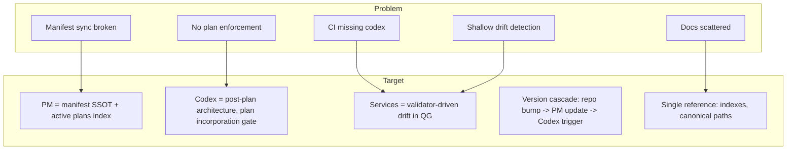
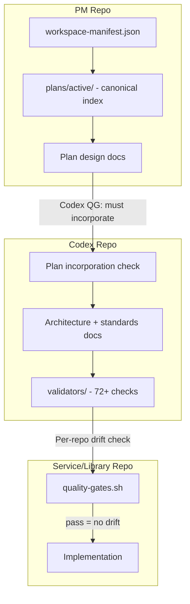

# PM-to-Codex-to-Service: Zero-Drift Architecture

---

## Part 1: The Problem

We have a multi-repo workspace where PM sets plans and owns the manifest, Codex holds architecture and standards, and
services implement against both. But the chain is broken in several places, and there is no single source of truth for
where things live or what to do next.

**Manifest and versioning.** PM owns `workspace-manifest.json`, but other repos (api-contracts, codex, settlement-ui,
etc.) run version-bump workflows that try to update it. The manifest exists only in PM, so those steps fail. PM is never
triggered when other repos bump. The manifest is not the real SSOT for versions.

**Docs and scripts are scattered.** Codex and PM both have outdated docs that reference wrong paths
(`unified-trading-library`, `unified-trading-deployment-v3`, `12-presentations`), deprecated scripts, and duplicate
content. There are two archive directories in Codex, duplicate workflow diagrams in PM, and no single index that says
"this is canonical."

**Plans are not enforced.** Active plans live in `plans/active/` but there is no index. Codex does not require that
plans are incorporated before merge. Implementers can drift from the intended architecture because nothing checks it.

**CI does not have Codex or PM.** PM CI creates an empty `unified-trading-codex` directory. Service CI clones path deps
but not Codex. Validators are skipped. Drift checks never run in CI.

**Drift detection is shallow.** The diff checker uses grep and ad-hoc patterns. The 72+ validators in
`VALIDATOR_COVERAGE_MATRIX` and checklist items with `validator_id` and `ssot_ref` exist but are not wired into a
per-repo drift check. We cannot reliably catch small architectural drifts.

**No cascade.** When PM merges, Codex is not triggered. When a library bumps, dependents are not notified. The
dependency graph exists in the manifest but is not used for automation.

The result: docs drift from code, code drifts from plans, and there is no single place to look for "what is true" or
"what to do next."

---

## Part 2: The Target

We want a single, coherent flow:

1. **PM** is the root. It owns the manifest (versions, topology, doc standards) and active plans. The manifest is
   validated and is the SSOT. Active plans are indexed and visible. When PM merges, Codex is triggered.
2. **Codex** reflects the architecture _after_ plans are implemented. It cannot merge to main without incorporating the
   latest PM and active plans. It has no contradicting statements. Services implement against Codex, not raw plans.
3. **Services** run quality gates with Codex and PM as siblings. A per-repo drift check runs the validators that apply
   to that repo's type. No merge without passing drift.
4. **Version flow** is bottom-up. When any repo bumps, PM updates the manifest. Deployment reads the manifest for
   versions. L0 bumps can trigger L1; L1 can trigger L2.
5. **One reference side.** A single index (or small set) answers: where is the canonical quality-gates script? Where are
   active plans? Where is the diff checker? Codex and PM both have clear SSOT indexes.

---

## Part 3: The Solution — Staged Rollout

The solution is implemented in phases. Each phase can be rolled out independently and assigned to agents. Later phases
assume earlier ones are done.

### Phase 0: Manifest Sync (Critical)

**Goal:** PM is the real SSOT for versions. Every repo bump updates the manifest.

**Tasks:** Add PM workflow `sync-manifest-versions.yml` (repository_dispatch); update each repo's version-bump to
trigger it; remove broken manifest-update steps from repos that don't have the manifest.

**Agent scope:** One agent for PM workflow; another for version-bump updates.

---

### Phase 0b: Codex and PM Cleanup + SSOT Indexes

**Goal:** Fix broken paths, merge duplicates, create canonical indexes.

**Codex:** Fix E2E paths; fix 00-SSOT-INDEX; create SSOT-BOUNDARY; replace wrong script refs; deployment-v3 →
deployment-service; merge archive dirs; consolidate onboarding.

**PM:** Fix index-migration; WORKFLOW_DIAGRAM SSOT; complete plans/README; mark superseded template;
quality-gates-index; fix invalid paths.

**SSOT indexes:** Codex 00-SSOT-INDEX (Scripts, Plans); PM plans/active/INDEX, plans/README, docs/INDEX, scripts/README;
cross-repo reference table.

**Agent scope:** One agent Codex; one PM; one indexes.

---

### Phase 1: Manifest Validation

**Goal:** Manifest is structurally valid and topologically consistent.

**Tasks:** JSON schema; topological pre-flight check; document.

**Agent scope:** Single agent.

---

### Phase 2: Active Plans Index

**Goal:** Canonical list of active plans.

**Tasks:** Create plans/active/INDEX.md; quality gate for index completeness.

**Agent scope:** Single agent.

---

### Phase 3: Codex Merge Gate (Plan Incorporation)

**Goal:** Codex cannot merge without incorporating latest PM and plans.

**Tasks:** Plan-incorporation validator; contradiction check; Codex CI clones PM; doc-only quality gates.

**Agent scope:** One validator; one Codex QG.

---

### Phase 4: PM Triggers Codex

**Goal:** When PM merges, Codex runs and checks alignment.

**Tasks:** Codex sync-with-pm.yml (workflow_run on PM); checkout Codex + PM; run plan-incorporation validator.

**Agent scope:** Single agent.

---

### Phase 5: CI Clone Codex and PM

**Goal:** PM and services have Codex (and PM) as siblings in CI.

**Tasks:** PM workflow clones Codex; service workflows add Checkout codex step.

**Agent scope:** One PM; one service rollout.

---

### Phase 6: Per-Repo Drift in Quality Gates

**Goal:** Validator-driven drift check per repo before merge.

**Tasks:** run_validators.py --scope, --repo-type; add drift step to quality-gates.sh; fail on P0/P1.

**Agent scope:** One validators; one quality-gates.

---

### Phase 7: Diff Checker Refactor

**Goal:** Daily diff checker uses validators.

**Tasks:** Add --scope to 02-run-diff-checker.py; refactor to call validators; keep GitHub issue creation.

**Agent scope:** Single agent.

---

## Summary: Order of Operations

| Phase | What                   | Enables                          |
| ----- | ---------------------- | -------------------------------- |
| 0     | Manifest sync          | PM is version SSOT               |
| 0b    | Cleanup + SSOT indexes | Correct paths, single reference  |
| 1     | Manifest validation    | Trustworthy manifest             |
| 2     | Active plans index     | Codex knows what to incorporate  |
| 3     | Codex merge gate       | Codex reflects plans             |
| 4     | PM triggers Codex      | Catch drift when PM changes      |
| 5     | CI clone               | Drift checks run in CI           |
| 6     | Per-repo drift in QG   | Services cannot merge with drift |
| 7     | Diff checker refactor  | Consistent drift detection       |

---

## Target Architecture (Reference)

## Open Decisions

1. **Codex version pinning:** Start with `main` or introduce tags from day one?
2. **Plan incorporation strictness:** Block codex merge if a plan is not fully incorporated, or warn only?
3. **Autonomous agent bootstrap:** Add `bootstrap.sh` step to clone codex when missing, or rely on workspace layout?
4. **Manifest sync:** Option A (repository_dispatch) vs B (periodic) vs C (each repo pushes to PM)?
5. **Major bump cascade:** Notify or trigger dependents when a lib has breaking change?
