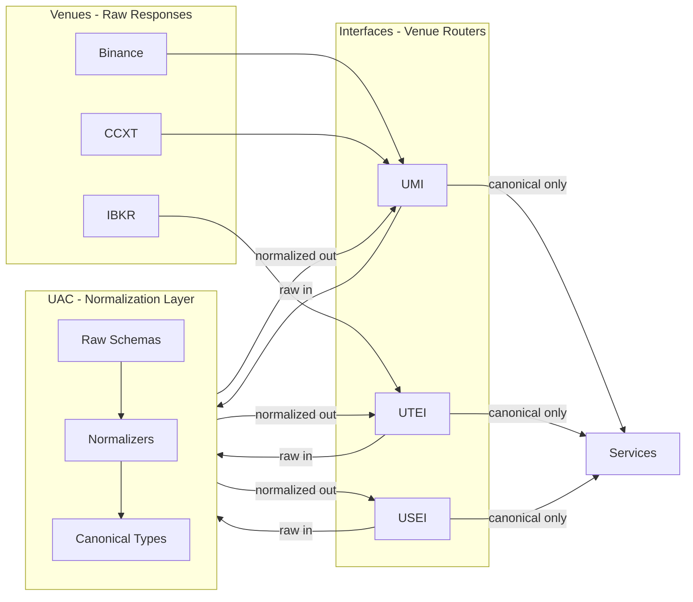
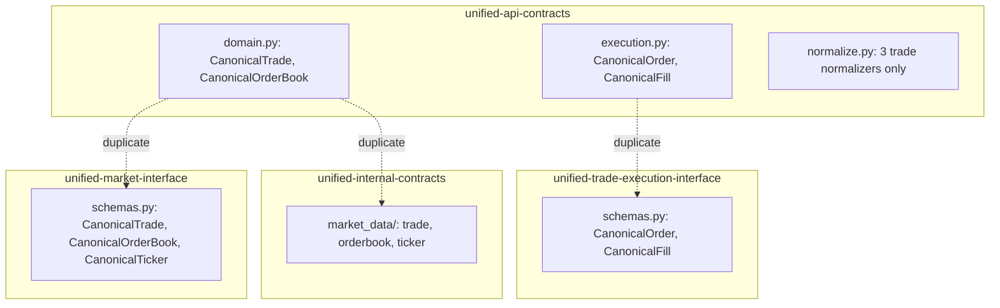

# Schema Normalization Completion and Interface Alignment Plan

## Ideology and Principles

**UAC = Normalization Layer.** unified-api-contracts is the mapping layer that converts raw venue responses into
normalized forms. The interfaces should never pass raw data through; they return normalized data from UAC.

**Interfaces = Venue Routers.** Interfaces (UMI, UTEI, USEI, UDEFI) say "I want data from Binance" or "I want data from
IBKR" — but the response shape is always normalized. The interface is venue-agnostic from the consumer's perspective.

**Internal CCXT/TARDIS.** We are building an internal version of what CCXT, TARDIS, and IBKR do: normalize across many
venues. We do the same across the full universe (CeFi, DeFi, TradFi, Sports, Alt).

**Scope: All Response Types.** Every raw venue response must map to a canonical type — not just trades and fills.
Includes: trades, orderbooks, tickers, positions, balances, liquidations, funding rates, OHLCV, market info, errors,
WebSocket messages, sports odds/fixtures, alt data, etc.

**Domain split strategy:**

- Prefer **canonical with optional fields** for venue-specific detail.
- Use **sub-types** only when structures are truly incompatible.
- Break by **instruction type** (TRADE, SWAP, LEND, BORROW, STAKE, etc.) — swaps differ from trades; alignment where
  possible (e.g. instrument_id).
- Interface layout: UTEI (CeFi), USEI (sports), UDEFI (DeFi) — domain-specific canonical schemas are tolerated, but
  shared alignment where possible.

**Codex/PM alignment:** Confirmed against `02-data/contracts-scope-and-layout.md`,
`05-infrastructure/contracts-integration.md`, `.cursor/rules/imports/unified-api-contracts-usage.mdc`,
`.cursor/rules/imports/contracts-integration.mdc`. Related PM plans: `orphan-contracts-utilization.md`,
`execution_services_hygiene_refactor.md`.

---

## Current State (from 10-agent audit)

### Schema Duplication (Three Sources of Truth)

- **UMI** defines its own `CanonicalTrade`, `CanonicalOrderBook`, `CanonicalTicker`; adapters use UAC for raw validation
  but UMI for canonical output.
- **UTEI** defines its own `CanonicalOrder`, `CanonicalFill`; uses `ccxt_order_to_canonical()` on raw dicts, not UAC
  schemas.
- **UAC** has `normalize.py` with only 3 trade normalizers (binance, databento, tardis); no order/orderbook/fill
  normalizers.
- **USEI** correctly imports `CanonicalOdds`, `BetExecution`, `BetOrder` from UAC sports.

### Normalization Gaps

**Trading domain:**

| Domain           | External Schemas                                               | Normalized To                         | Status              |
| ---------------- | -------------------------------------------------------------- | ------------------------------------- | ------------------- |
| **Trades**       | BinanceTrade, DatabentoTrade, TardisTrade                      | CanonicalTrade                        | Mapped              |
| **Trades**       | CoinbaseTrade, CcxtTrade, OKX*, Bybit*, Deribit*, Upbit*, etc. | —                                     | Orphaned            |
| **Order books**  | 15+ providers                                                  | CanonicalOrderBook                    | No normalizer       |
| **Orders**       | CcxtOrder, venue-specific                                      | CanonicalOrder                        | No normalizer       |
| **Fills**        | CcxtTrade, venue-specific                                      | CanonicalFill                         | No normalizer       |
| **Tickers**      | 15+ providers                                                  | CanonicalTicker                       | None in UAC         |
| **Positions**    | CcxtPosition, venue-specific                                   | CanonicalPosition                     | No normalizer       |
| **Balances**     | CcxtBalance, venue-specific                                    | CanonicalBalance                      | No normalizer       |
| **Liquidations** | venue-specific                                                 | CanonicalLiquidation                  | None in UAC         |
| **Funding**      | venue-specific                                                 | CanonicalFundingRate                  | None in UAC         |
| **OHLCV**        | DatabentoOhlcvBar, CcxtOhlcv, etc.                             | CanonicalOhlcvBar                     | Partial (databento) |
| **Market info**  | venue-specific                                                 | CanonicalMarketInfo                   | None in UAC         |
| **Errors**       | venue-specific                                                 | CanonicalError                        | Partial (errors.py) |
| **WebSocket**    | venue-specific                                                 | CanonicalWsMessage                    | None in UAC         |
| **Sports**       | 10 sources                                                     | CanonicalOdds, CanonicalFixture, etc. | Mapped in adapters  |

---

## Phase 1: Establish UAC as SSOT for Canonical Schemas

### 1.1 Consolidate Canonical Definitions

- **Target:** UAC `unified_normalised_contracts` is the only definition of canonical trading schemas.
- **Actions:**
  1. Add `CanonicalTicker`, `CanonicalLiquidation`, `CanonicalDerivativeTicker` to
     `unified_normalised_contracts/domain.py` (UMI currently has these; UAC does not).
  2. Add `CanonicalPosition`, `CanonicalBalance`, `CanonicalFundingRate`, `CanonicalOhlcvBar`, `CanonicalMarketInfo`,
     `CanonicalWsMessage` where missing.
  3. Diff UMI `schemas.py` vs UAC `domain.py` for `CanonicalTrade`, `CanonicalOrderBook` — ensure field parity; merge
     any UMI-only fields into UAC.
  4. Diff UTEI `schemas.py` vs UAC `execution.py` for `CanonicalOrder`, `CanonicalFill` — merge any UTEI-only fields
     into UAC.
  5. Update `unified_normalised_contracts/__init__.py` to export all canonical types.

### 1.2 Interface Migration

- **UMI:** `from unified_api_contracts import CanonicalTrade, CanonicalOrderBook, CanonicalTicker, ...`; remove local
  definitions.
- **UTEI:** `from unified_api_contracts import CanonicalOrder, CanonicalFill, ...`; remove local definitions.
- **UIC:** `from unified_api_contracts import CanonicalTrade, CanonicalOrderBook, CanonicalTicker`; remove
  `market_data/` duplicates or re-export from UAC.

---

## Phase 2: Add Normalizers to UAC

### 2.1 Trade Normalizers (extend `normalize.py`)

| External Schema            | Provider    | Canonical Output                  |
| -------------------------- | ----------- | --------------------------------- |
| CoinbaseTrade              | coinbase    | CanonicalTrade                    |
| CcxtTrade                  | ccxt        | CanonicalTrade                    |
| OKX\* (via CCXT or direct) | okx         | CanonicalTrade                    |
| Bybit\*                    | bybit       | CanonicalTrade                    |
| UpbitTrade                 | upbit       | CanonicalTrade                    |
| Deribit\* (via CCXT)       | deribit     | CanonicalTrade                    |
| AsterTrade                 | aster       | CanonicalTrade                    |
| HyperliquidFill            | hyperliquid | CanonicalTrade (or CanonicalFill) |
| Nautilus Fill              | nautilus    | CanonicalTrade                    |

### 2.2 Order Book Normalizers

| External Schema                            | Provider    | Canonical Output   |
| ------------------------------------------ | ----------- | ------------------ |
| BinanceOrderBook                           | binance     | CanonicalOrderBook |
| CoinbaseOrderBook                          | coinbase    | CanonicalOrderBook |
| BybitOrderBook                             | bybit       | CanonicalOrderBook |
| OKXOrderBook                               | okx         | CanonicalOrderBook |
| DeribitOrderBook                           | deribit     | CanonicalOrderBook |
| UpbitOrderBook                             | upbit       | CanonicalOrderBook |
| CcxtOrderBook                              | ccxt        | CanonicalOrderBook |
| TardisOrderBook, TardisBookSnapshot5       | tardis      | CanonicalOrderBook |
| DatabentoMbp1, DatabentoMbo, DatabentoTbbo | databento   | CanonicalOrderBook |
| HyperliquidL2Book                          | hyperliquid | CanonicalOrderBook |
| Aster\*                                    | aster       | CanonicalOrderBook |

### 2.3 Order and Fill Normalizers

| External Schema                       | Provider    | Canonical Output              |
| ------------------------------------- | ----------- | ----------------------------- |
| CcxtOrder                             | ccxt        | CanonicalOrder                |
| CcxtTrade                             | ccxt        | CanonicalFill                 |
| BinanceOrder                          | binance     | CanonicalOrder                |
| OKXOrder                              | okx         | CanonicalOrder                |
| BybitOrder                            | bybit       | CanonicalOrder                |
| DeribitOrder                          | deribit     | CanonicalOrder                |
| UpbitOrder                            | upbit       | CanonicalOrder                |
| Nautilus Order, Fill                  | nautilus    | CanonicalOrder, CanonicalFill |
| HyperliquidOpenOrder, HyperliquidFill | hyperliquid | CanonicalOrder, CanonicalFill |
| IBKROrder                             | ibkr        | CanonicalOrder                |
| MatchbookOrder, BetfairOrder, etc.    | sports      | BetOrder (sports canonical)   |

### 2.4 Ticker Normalizers

| External Schema                  | Provider | Canonical Output |
| -------------------------------- | -------- | ---------------- |
| BinanceTicker                    | binance  | CanonicalTicker  |
| CoinbaseTicker                   | coinbase | CanonicalTicker  |
| BybitTicker                      | bybit    | CanonicalTicker  |
| OKXTicker                        | okx      | CanonicalTicker  |
| DeribitTicker, DeribitTickerFull | deribit  | CanonicalTicker  |
| UpbitTicker                      | upbit    | CanonicalTicker  |
| CcxtTicker                       | ccxt     | CanonicalTicker  |
| AsterTicker24hr                  | aster    | CanonicalTicker  |

### 2.5 Positions, Balances, Liquidations, Funding, OHLCV, Market Info, Errors, WebSocket

| Type               | Canonical Type       | External Schemas (examples)                      |
| ------------------ | -------------------- | ------------------------------------------------ |
| Positions          | CanonicalPosition    | CcxtPosition, BinancePosition, BybitPosition     |
| Balances           | CanonicalBalance     | CcxtBalance, BinanceBalance                      |
| Liquidations       | CanonicalLiquidation | venue-specific liquidation events                |
| Funding rates      | CanonicalFundingRate | BybitFunding, DeribitFunding, HyperliquidFunding |
| OHLCV              | CanonicalOhlcvBar    | DatabentoOhlcvBar, CcxtOhlcv, TardisOhlcv        |
| Market info        | CanonicalMarketInfo  | venue-specific instrument/market metadata        |
| Errors             | CanonicalError       | UAC errors.py; extend for venue error schemas    |
| WebSocket messages | CanonicalWsMessage   | venue-specific WS payloads                       |

### 2.6 Instruction-Type Grouping (TRADE, SWAP, LEND, BORROW, etc.)

- **TRADE:** CanonicalTrade, CanonicalOrder, CanonicalFill — shared across CeFi/TradFi.
- **SWAP:** DeFi-specific; use `CanonicalSwap` or extend CanonicalTrade with `instruction_type=SWAP` and optional DeFi
  fields.
- **LEND/BORROW/STAKE/UNSTAKE/TRANSFER/WITHDRAW/REPAY:** Domain-specific canonical types where structure differs; align
  on `instrument_id`, `venue`, `timestamp`.
- **Sports:** BetOrder, CanonicalOdds, CanonicalFixture — separate canonical set; align identifiers where possible.

### 2.7 Sports Domain (already structured)

- **sports/sources/** → **sports/canonical/** — mapping via `TeamMapping`, `FixtureMapping`, `PlayerMapping`.
- **Odds sources** (odds_api, betfair, pinnacle, matchbook, smarkets, betdaq, etc.) → `CanonicalOdds`,
  `CanonicalBookmakerMarket`.
- **Match/team/player** (api_football, footystats, understat, soccer_football_info) → canonical fixtures, stats,
  lineups.
- Document explicit normalization paths in UAC (e.g. `normalize_odds_api_to_canonical.py` or add to sports module).

### 2.8 Alt Data / Non-Trading (dict or minimal canonical)

- Providers: barchart, fred, ecb, open_meteo, fear_greed, glassnode, arkham, transfermarkt, etc.
- **Option A:** Define minimal canonical types (e.g. `CanonicalOhlcv`, `CanonicalObservation`) and add normalizers.
- **Option B:** Keep as raw-only; document in audit as "no canonical type — adapter outputs dict".
- **Recommendation:** Option B for Phase 2; add canonical types in Phase 3 if needed.

---

## Phase 3: Full Audit Table

### 3.1 Audit Artifact

Create a single audit file: `unified-api-contracts/docs/SCHEMA_NORMALIZATION_AUDIT_FULL.md` with:

1. **Table 1: External Schema → Canonical Output**

- Provider | External Schema | Canonical Type | Normalizer Function | Status (Mapped/Orphaned/Planned)
- Covers: trades, orderbooks, orders, fills, tickers, positions, balances, liquidations, funding, OHLCV, market info,
  errors, WebSocket, sports, alt data.

2. **Table 2: Interface Alignment**

- Interface | Canonical Types Used | Import Source | Status (UAC/ Local)

3. **Table 3: Sports Schema Mapping**

- Source | Raw Schema | Canonical Type | Normalizer Location

4. **Table 4: Instruction-Type Mapping**

- Instruction Type | Canonical Types | Domain (CeFi/DeFi/Sports)

### 3.2 Schema Inventory (from agent audit)

**Trading domain (60+ providers):** alchemy, api_football, arkham, aster, barchart, betdaq, betfair, binance, bloxroute,
bybit, ccxt, coinbase, coingecko, coinglass, databento, defi, defillama, deribit, ecb, fear_greed, fix, footystats,
fred, github, glassnode, hyperliquid, ibkr, instadapp, kalshi, manifold, matchbook, metabet, mev, nautilus, odds_api,
odds_engine, ofr, okx, open_meteo, openbb, pinnacle, polymarket, predictit, prime_broker, pyth, regulatory, sharpapi,
smarkets, soccer_football_info, sports, tardis, thegraph, transfermarkt, understat, upbit, venue_manifest,
yahoo_finance.

**Sports sources:** api_football, betfair, footystats, odds_api, oddsjam, open_meteo, opticodds, pinnacle,
soccer_football_info, understat.

---

## Phase 4: Implementation Order

**Tier 1 (high-priority, used by UMI/UTEI):**

- Binance, Coinbase, Bybit, OKX, Deribit, Upbit, CCXT (trade, orderbook, order, fill, ticker)
- Tardis, Databento (extend to orderbook, order if applicable)

**Tier 2 (sports):**

- Matchbook, Betfair, Betdaq, Smarkets, Pinnacle, OddsApi, OddsEngine, OddsJam, OpticOdds, Metabet, Sharpapi

**Tier 3 (remaining CeFi/DeFi/alt):**

- Aster, Hyperliquid, IBKR, Nautilus, Kalshi, Polymarket, Manifold, Predictit
- TheGraph, Alchemy, Bloxroute, Defillama, Glassnode, Arkham, etc.

---

## Phase 5: Validation and Tests

1. **Unit tests:** Each `normalize_*` function has a test that validates output against `Canonical*` schema.
2. **Integration:** UMI/UTEI adapters use UAC normalizers; existing adapter tests pass.
3. **Schema alignment test:** Assert UAC canonical schemas match UMI/UTEI field-for-field (before migration).

---

## Success Criteria

1. **Quality gates pass for all updated repos** — Run `bash scripts/quickmerge.sh` (or `quality-gates.sh --no-fix`) on
   every repo that was modified:
   - unified-api-contracts
   - unified-market-interface
   - unified-trade-execution-interface
   - unified-internal-contracts (if UIC market_data/ updated)
   - Any service or interface that imports canonical types from UMI/UTEI (must pass after import migration)
2. **Zero orphaned external API contracts** — Every external schema in `unified_api_contracts_external/` has a
   normalization path to a canonical type. Document in `SCHEMA_NORMALIZATION_AUDIT_FULL.md`; status must be Mapped or
   Planned (not Orphaned). Alt data providers may be documented as "Raw-only — no canonical type" per Phase 2.8 option
   B.
3. **Import migration complete** — All consumers of UMI/UTEI canonical types import from UAC (or via re-export); no
   broken imports; tests pass.

---

## Key Files

| File                                                                                                                                                             | Role                                            |
| ---------------------------------------------------------------------------------------------------------------------------------------------------------------- | ----------------------------------------------- |
| [unified_api_contracts/unified_normalised_contracts/normalize.py](unified-api-contracts/unified_api_contracts/unified_normalised_contracts/normalize.py)         | Add all normalizers                             |
| [unified_api_contracts/unified_normalised_contracts/domain.py](unified-api-contracts/unified_api_contracts/unified_normalised_contracts/domain.py)               | Add CanonicalTicker, CanonicalLiquidation, etc. |
| [unified_api_contracts/unified_normalised_contracts/execution.py](unified-api-contracts/unified_api_contracts/unified_normalised_contracts/execution.py)         | Ensure parity with UTEI                         |
| [unified-market-interface/unified_market_interface/schemas.py](unified-market-interface/unified_market_interface/schemas.py)                                     | Replace with UAC imports                        |
| [unified-trade-execution-interface/unified_trade_execution_interface/schemas.py](unified-trade-execution-interface/unified_trade_execution_interface/schemas.py) | Replace with UAC imports                        |
| [unified-api-contracts/docs/SCHEMA_NORMALIZATION_AUDIT_FULL.md](unified-api-contracts/docs/SCHEMA_NORMALIZATION_AUDIT_FULL.md)                                   | Full audit table (create)                       |

---

## Breaking Changes

- UMI and UTEI will import canonical types from UAC instead of defining locally. This is a breaking change for any
  consumers that import from UMI/UTEI schemas directly.
- **Mitigation:** UMI/UTEI re-export from UAC for backward compatibility:
  `from unified_api_contracts import CanonicalTrade; CanonicalTrade = CanonicalTrade` (or deprecate local and add
  deprecation warning).

## Estimated Effort

- Phase 1: 1–2 days (schema consolidation, interface migration)
- Phase 2: 3–5 days (normalizers for Tier 1 + Tier 2 + Tier 3)
- Phase 3: 0.5 day (audit table generation)
- Phase 4–5: 1–2 days (tests, validation)
