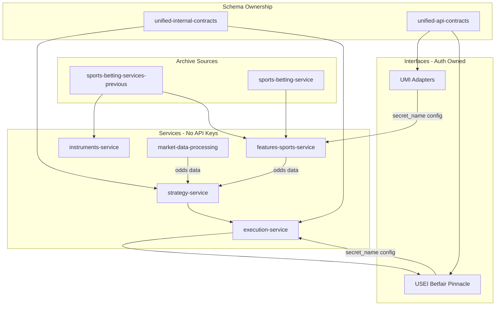

# Sports Migration Master Plan

## To-Dos

- **Phase 0:** Architecture alignment (UIC/AC, interfaces-only auth); clone sports-betting-service; feature inventory;
  doc scan
- **Phase 1:** League classification (94); team/stadium mapping; canonical schemas
- **Phase 2:** Package structure; 14 data exporters; 1000+ feature tracking; batch fetch CLI; HT features; ML
  predictions
- **Phase 3:** Half-time arbitrage; SCE/HUF operational modes
- **Phase 4:** USEI adapters; odds processing; execution sports module
- **Phase 5:** GCS Hive schema migration; validate_timestamp_date_alignment
- **Phase 6:** All data sources integrated
- **Phase 7:** Parallel agents (A-J) execution
- **Phase 8:** Self-audit checklist
- **Data layer:** Reference vs features vs market; odds = tick
- **Batch-live:** --mode batch|live, shared engine
- **Unified CLI:** get_handler_for_mode pattern
- **Tests:** 70%+ coverage, all pass

## Scope and SSOT

- **No new repos.** All work fits into existing workspace manifest entries: `features-sports-service`,
  `unified-sports-execution-interface`, `instruments-service`, `market-data-processing-service`, `strategy-service`,
  `execution-service`.
- **Workspace manifest:** No deviation; single source of truth.

---

## Architecture Alignment (Separation of Concerns)

### Schema Ownership

| Schema type                                | Library                          | Rule                                                                                        |
| ------------------------------------------ | -------------------------------- | ------------------------------------------------------------------------------------------- |
| **Component-to-component** (internal)      | unified-internal-contracts (UIC) | Service-to-service, Pub/Sub, events, ML inference/training, features request/response, risk |
| **External** (bookmakers, exchanges, APIs) | unified-api-contracts (AC)       | Raw per-venue schemas + `unified_normalised_contracts` + `normalize.py`                     |

- **Internal:** `InferenceRequest`, `FeatureRequest`, `FillEventMessage`, `EventEnvelope`, sports strategy signals
  (service→service)
- **External:** Betfair, Pinnacle, API-Football, FootyStats, Understat, etc. — raw schemas in AC, normalized to
  canonical
- **AC cannot import UIC** (T0 leaf). UIC may depend on AC.

### API Keys and Authentication — Interfaces Only

**Rule:** Interfaces own authentication and connectivity. Services NEVER call `get_secret_client` for API keys.

| Layer                                         | Responsibility                                                                                         | API keys?                       |
| --------------------------------------------- | ------------------------------------------------------------------------------------------------------ | ------------------------------- |
| **unified-sports-execution-interface** (USEI) | Betfair, Pinnacle adapters; fetch secrets via `secret_name` in config; perform HTTP to bookmakers      | YES — interfaces fetch and hold |
| **unified-market-interface** (UMI)            | API-Football, FootyStats, Understat, Odds API, etc.; fetch secrets internally when given `secret_name` | YES — interfaces fetch and hold |
| **features-sports-service**                   | Orchestration, feature calculators; calls UMI adapters                                                 | NO — never has API keys         |
| **execution-service**                         | Orchestration; passes `secret_name` to USEI factory                                                    | NO — never fetches keys         |
| **strategy-service**                          | Signal generation; no external API calls                                                               | NO                              |
| **market-data-processing-service**            | Odds processing; consumes data from UMI or GCS                                                         | NO                              |
| **market-tick-data-service**                  | Orchestration; passes config to UMI; UMI fetches keys                                                  | NO                              |

**Batch fetch flow:** features-sports-service config has `api_football_secret_name`, etc. Service passes config to UMI
adapter factory. UMI adapter calls `get_secret_client(secret_name=...)` internally. Service never sees the key.

**Execution flow:** execution-service passes `secret_name` to USEI factory. USEI BetfairAdapter/PinnacleAdapter fetch
credentials internally. Service never sees the key.

### Interface Adapters for Sports

- **USEI:** BetfairAdapter, PinnacleAdapter — execution (place_bet, cancel_bet, get_odds)
- **UMI:** APIFootballAdapter, FootyStatsAdapter, UnderstatAdapter, OddsApiAdapter, etc. — market data only
- **Schemas:** All external bookmaker/API schemas in unified-api-contracts; normalized to canonical

---

- **Two archive sources** (both required):
  - `archive/sports-betting-services-previous` — legacy monolith (footballbets), multi-provider, 855+ features in
    catalog
  - `archive/sports-betting-service` — clone from
    [https://github.com/IggyIkenna/sports-betting-service](https://github.com/IggyIkenna/sports-betting-service)
    (Betfair-centric, Parquet, different feature set)
- **Target:** 1000+ features, all data sources (Understat, FootyStats, Transfermarkt, API-Football, Betfair, Pinnacle,
  Open Meteo, etc.), arbitrage in strategy architecture, GCS hive schema, ready to delete sports repo (kept in archive).

---

## Phase 0: Archive Setup and Reconciliation

### 0.1 Clone sports-betting-service

- Clone `https://github.com/IggyIkenna/sports-betting-service` into `archive/sports-betting-service`.
- **Not** the same as `archive/sports-betting-services-previous` — different package (`sports_betting_service` vs
  `footballbets`), Betfair/Parquet vs multi-provider/PostgreSQL.
- If repo is private, ensure auth (SSH/HTTPS token) before clone.

### 0.2 Feature inventory (both archives)

| Source                           | Feature count            | Key areas                                                                                   |
| -------------------------------- | ------------------------ | ------------------------------------------------------------------------------------------- |
| sports-betting-services-previous | 855 (FEATURES_CATALOG)   | MARKET 108, TEAM 262, LEAGUE 27, H2H 20, LINEUP 40, REFEREE 20, WEATHER 10, HT 8, OTHER 356 |
| sports-betting-service           | TBD (from FEATURES/docs) | Betfair historical, 1-min candles, CLV, CatBoost                                            |
| **Planned additions**            | ~150+                    | Half-time arbitrage, ML on schedules, GCS migration features                                |

**Target:** 1000+ features across both archives + planned.

### 0.3 Doc scan (archive/sports-betting-services-previous)

Scan and extract from:

- `footballbets/features/docs/core/`: FEATURES_CATALOG.md, FEATURE_ENGINEERING.md, FEATURES_IMPLEMENTATION_GUIDE.md,
  PLAYER_PROFILES.md
- `footballbets/features/docs/utils/`: DATA_LOADER_README.md, FEATURE_ENGINEERING_SETUP.md
- `REPO_MIGRATION_INSTRUCTIONS.md` (GCS migration mention)
- `notebooks/data_migration.ipynb` (DB→CSV, not GCS)

---

## Phase 1: Reference Data and Instruments

### 1.1 League classification (instruments-service)

- Expand to 94 leagues (gap fix: 20→94).
- Ensure `league_classification.py`, `league_definition.py`, `team_mapping_data.py`, `team_aliases.py` cover all leagues
  from both archives.
- Data sources per league: api_football, footystats, transfermarkt, understat.

### 1.2 Team and stadium mapping

- 74+ teams, 68+ stadiums with cross-provider aliases.
- Geocode-venues CLI for venue lat/lon (Google Maps API).
- Round names: 208 tournament round names for season context.

### 1.3 Canonical schemas (unified-api-contracts)

- Align `CanonicalFixture`, `CanonicalTeam`, `CanonicalVenue`, `CanonicalLeague`, `CanonicalPlayer`, `CanonicalReferee`
  with UMI adapters.
- Ensure normalizers in `unified_normalised_contracts/normalize.py` use these schemas
  (API-CONTRACTS-ORPHANED-SCHEMAS-AUDIT).

---

## Phase 2: Features-Sports-Service (1000+ features)

### 2.1 Package structure

```
features-sports-service/
├── calculators/          # feature calculators (18→28+)
├── adapters/             # thin wrappers that call UMI adapters (NO API keys; UMI fetches)
├── engine.py             # pipeline
├── data/loader.py        # data loader (GCS, UMI via adapters)
├── etl/state.py          # ETL state
├── arb/                  # arbitrage/vig (uses odds from UMI/market-data-processing)
├── features_sports_service/tracking/  # feature registry
├── config.py             # UnifiedCloudConfig (secret_name only, never keys)
└── schemas/output_schemas.py  # service-owned
```

### 2.2 Data exporters (14 tables)

- **Fixture-level:** fixture_stats, fixture_events, fixture_lineups, fixture_player_stats (fixture_coaches merged into
  lineups)
- **Standalone:** injuries, players, venues
- **Existing:** 7 tables
- `get_available_tables()` returns 14; `_TABLE_CONFIGS` in validation.py has 14 entries.

### 2.3 Feature tracking (1000+)

- 14→24 modules covering all categories from FEATURES_CATALOG + sports-betting-service.
- Status tracking: TESTED, COMPLETE, DATA_NEEDED, NOT_STARTED, BLOCKED.
- Categories: MARKET, LEAGUE, TEAM, H2H, PLAYER, LINEUP, REFEREE, WEATHER, HT, OTHER.

### 2.4 Batch fetch CLI (4+ providers)

- Providers: api_football, footystats, understat, odds_api, soccer_football_info.
- **Pattern:** Service passes `secret_name` in config to UMI adapter factory; UMI fetches keys internally. Service never
  has API keys.
- Rate-limited bulk data collection.
- Migrate shell scripts from archive (~1,439L).

### 2.5 Half-time features

- HT score state, HT performance (shots, possession, xG), HT delta, HT momentum.
- Historical HT: home_ht_goals_avg, home_ht_win_rate, home_ht_comeback_rate.
- 2nd-half predictions: pred_2h_home_goals, pred_2h_away_goals, pred_comeback_probability.
- OddsHTSnapshot integration for half-time odds.

### 2.6 ML prediction features (schedules)

- Add "ML predictions on schedules" as planned feature set.
- Integrate with ml-training-service, ml-inference-service.
- Walk-forward validation, Poisson/Bayesian lambdas, ensemble arbitration.

---

## Phase 3: Arbitrage and Strategy Architecture

### 3.1 Arbitrage in strategy-service

- **Existing:** `ArbitrageStrategy` (sports_arb), cross-bookmaker when `1/odds_A + 1/odds_B < 1.0`.
- **Data source:** strategy-service receives odds from market-data-processing-service (which consumes UMI) or
  features-sports-service. No direct bookmaker calls; no API keys.
- **Extend:** Half-time arbitrage — use OddsHTSnapshot, HT state, arb bucket classification at HT.
- Arb buckets: Soft→Sharp (0.2–0.6%), Soft→Soft (0.4–1.2%), Soft→Exchange (0.5–1.5%).

### 3.2 Operational modes

| Mode                       | Exit behavior                              | Use case                        |
| -------------------------- | ------------------------------------------ | ------------------------------- |
| **SCE (same_candle_exit)** | TP, SL, or candle close within same candle | CeFi, Sports (signal-based, ML) |
| **HUF (hold_until_flip)**  | Exit only when direction flips             | DeFi (hold until flip)          |

- Sports/CeFi: SCE (default in `strategy_service/config_loader.py`).
- DeFi: HUF.
- Arbitrage: SCE (same-candle execution when arb found).

### 3.3 Strategy types

- `sports_arb` → ArbitrageStrategy (pre-game + half-time)
- `sports_value` → ValueBettingStrategy (model-based)
- `sports_kelly` → KellyCriterionStrategy (position sizing)

---

## Phase 4: Execution and Market Data

### 4.1 unified-sports-execution-interface

- BaseSportsAdapter protocol.
- Adapters: Betfair, Pinnacle — **own auth** (fetch secrets via `secret_name` in config).
- execution-service passes config; USEI fetches credentials. No API keys in execution-service.
- Integration with execution-service sports module.

### 4.2 market-data-processing-service

- Sports odds processing module (merged from sports-odds-processing-service).
- Odds snapshots, HT snapshots, microstructure, sharp/soft classification.

### 4.3 execution-service

- Sports execution module (merged from sports-execution-service).
- SCE mode for sports strategies.
- Instruction types: TRADE (primary for sports).

---

## Phase 5: GCS Schema Migration (Hive)

### 5.1 Target schema

- Path format: `by_date/day={date}/key=value` (Hive-style).
- Partition keys: `day` first.

### 5.2 Sports-specific paths

- `sports_features/by_date/day={date}/feature_group={feature_group}/`
- `sports_odds/by_date/day={date}/venue={venue}/`
- `sports_fixtures/by_date/day={date}/league={league_id}/`

### 5.3 Migration steps

- Migrate from legacy paths (e.g. `day-YYYY-MM-DD`) to Hive format.
- Use `validate_timestamp_date_alignment()` before every GCS write.
- Reference: `market-tick-data-service/scripts/migrate_gcs_path_to_hive.py`,
  `deployment-service/docs/archive/schema-change/`.

---

## Phase 6: Data Sources (All)

| Source               | UMI adapter           | UAC schemas                  | Use                              |
| -------------------- | --------------------- | ---------------------------- | -------------------------------- |
| Understat            | UnderstatAdapter      | understat/schemas            | xG (5 leagues)                   |
| FootyStats           | FootyStatsAdapter     | footystats/schemas           | Match stats, referee             |
| Transfermarkt        | TransfermarktAdapter  | transfermarkt/schemas        | Players, injuries, transfers     |
| API-Football         | APIFootballAdapter    | api_football/schemas         | Fixtures, stats, events, lineups |
| Soccer Football Info | SoccerFootballAdapter | soccer_football_info/schemas | HT stats, progressive            |
| Betfair              | BetfairAdapter        | betfair/schemas              | Exchange odds                    |
| Pinnacle             | PinnacleAdapter       | pinnacle/schemas             | Sharp odds                       |
| Open Meteo           | OpenMeteoAdapter      | open_meteo/schemas           | Weather                          |
| Odds API             | OddsApiAdapter        | odds_api/schemas             | Odds aggregation                 |

---

## Data Providers and Bookmakers (Complete Registry)

### Data providers (API-based)

| Provider             | UAC | UMI | Notes                            |
| -------------------- | --- | --- | -------------------------------- |
| API-Football         | Yes | Yes | Fixtures, stats, events, lineups |
| FootyStats           | Yes | Yes | Match stats, referee             |
| Understat            | Yes | Yes | xG (5 leagues)                   |
| Transfermarkt        | Yes | Yes | Players, injuries, transfers     |
| Soccer Football Info | Yes | Yes | HT stats, progressive            |
| Open Meteo           | Yes | Yes | Weather                          |

### Odds API aggregators (API-based)

| Provider         | Latency   | UAC     | UMI     | Notes                                          |
| ---------------- | --------- | ------- | ------- | ---------------------------------------------- |
| **The Odds API** | ~150ms    | Yes     | Yes     | 250+ bookmakers                                |
| **SharpAPI**     | sub-100ms | **ADD** | **ADD** | SSE streaming, +EV/arb detection, 15+ US books |
| **Odds Engine**  | sub-10ms  | **ADD** | **ADD** | OpenAPI 3.0, WebSocket/SSE, 30+ US books       |
| **MetaBet**      | fast      | **ADD** | **ADD** | Pre-game, in-play, props, futures              |
| **OpticOdds**    | —         | Yes     | Yes     | In sports/sources                              |
| **OddsJam**      | —         | Yes     | Yes     | In sports/sources                              |

### Exchange bookmakers (API-based execution)

| Provider  | USEI | Notes      |
| --------- | ---- | ---------- |
| Betfair   | Yes  | betfair_uk |
| Matchbook | Yes  |            |
| Smarkets  | Yes  |            |
| Betdaq    | Yes  |            |

### Non-exchange bookmakers (API where available)

| Provider                                                                                                       | API? | Execution | Notes           |
| -------------------------------------------------------------------------------------------------------------- | ---- | --------- | --------------- |
| Pinnacle                                                                                                       | Yes  | USEI      | Sharp reference |
| OneXBet                                                                                                        | Yes  | USEI      |                 |
| Bovada                                                                                                         | No   | Scraping  | Soft            |
| BetOnline                                                                                                      | No   | Scraping  | Soft            |
| MyBookie                                                                                                       | No   | Scraping  | Soft            |
| BetUS                                                                                                          | No   | Scraping  | Soft            |
| GTBets                                                                                                         | No   | Scraping  | Soft            |
| Bet365                                                                                                         | No   | Scraping  | USEI scraper    |
| SkyBet                                                                                                         | No   | Scraping  | USEI scraper    |
| SBO                                                                                                            | No   | Scraping  | Asian bookmaker |
| Bet888sport, Betfred, BetVictor, Betway, Boylesports, Bwin, Coral, Ladbrokes, PaddyPower, Unibet, William Hill | No   | Scraping  | USEI scrapers   |

**Scraping:** Non-exchange bookmakers require scraping for orders and market data. USEI has scraper adapters for Bet365,
SkyBet, etc. Odds API and faster aggregators (SharpAPI, Odds Engine) provide odds without scraping.

### API contracts todo (add schemas)

- Add `sharpapi/` schemas (GET /odds, /odds/best, /schedule, /events, /positive-ev, /arbitrage)
- Add `odds_engine/` schemas (OpenAPI 3.0 spec from api.oddsengine.dev)
- Add `metabet/` schemas (pre-game, in-play, props, futures)
- Add to SPORTS_VENUES: SHARPAPI, ODDS_ENGINE, METABET
- Add SBOBet (sbo) if missing; add Bet365 to UMI if needed for odds data

---

## Phase 7: Parallel Agent Execution

Use up to 10 parallel agents for:

| Agent | Stream | Target                  | Scope                                            |
| ----- | ------ | ----------------------- | ------------------------------------------------ |
| A     | P0     | features-sports-service | 4 fixture-level exporters                        |
| B     | P0     | features-sports-service | 3 standalone exporters + registry                |
| C     | P0     | instruments-service     | League classification 20→94                      |
| D     | P1     | instruments-service     | Team/stadium mapping                             |
| E     | P2     | features-sports-service | Feature tracking (14→24 modules, 1000+ features) |
| F     | P1     | features-sports-service | Batch fetch CLI (4+ providers)                   |
| G     | P2     | strategy-service        | Half-time arbitrage extension                    |
| H     | P2     | features-sports-service | HT features, ML schedule predictions             |
| I     | P1     | GCS migration           | Schema migration scripts                         |
| J     | P2     | Integration             | Geocoding, round names, final verification       |

---

## Phase 8: Self-Audit Checklist

Before declaring done:

- **Schema ownership:** Internal (UIC) vs external (AC) correctly split; AC normalized
- **API keys:** No get_secret_client in features-sports-service, execution-service, strategy-service,
  market-tick-data-service; interfaces own auth
- Both archives cloned/inventoried; feature count ≥1000
- All 14 data exporters in features-sports-service
- 94 leagues in instruments-service
- Team/stadium mapping complete (74+ teams, 68+ stadiums)
- Half-time arbitrage in strategy-service
- GCS paths use Hive format; validate_timestamp_date_alignment before writes
- All data sources (Understat, FootyStats, Transfermarkt, etc.) integrated
- SCE/HUF modes correct for sports vs DeFi
- No new repos; workspace manifest unchanged
- Ready to delete sports repo (stays in archive)

---

## Architecture Diagram



---

## Execution Summary (Parallel Agents)

| Agent | Stream                                 | Status  | Notes                                              |
| ----- | -------------------------------------- | ------- | -------------------------------------------------- |
| A     | Clone + inventory                      | Partial | Clone failed (auth); 855 features counted          |
| B     | League classification                  | Done    | 94 leagues already                                 |
| C     | Team/stadium mapping                   | Done    | 74 teams, 74 stadiums already                      |
| D     | SharpAPI, Odds Engine, MetaBet schemas | Done    | unified-api-contracts                              |
| E     | SBOBet, Bet365                         | Done    | SBOBet added; Bet365 exists                        |
| F     | features-sports-service scaffold       | Done    | Package structure, pyproject.toml                  |
| G     | UMI adapters (SharpAPI, etc.)          | Done    | SharpApiAdapter, OddsEngineAdapter, MetaBetAdapter |
| H     | Half-time arbitrage                    | Done    | generate_sports_signal_ht in strategy-service      |
| I     | GCS schema docs                        | Done    | sports-schema-paths.md in codex                    |
| J     | Provider registry                      | Done    | SPORTS_PROVIDERS_REGISTRY.md                       |

**Clone:** Use SSH or PAT for
[https://github.com/IggyIkenna/sports-betting-service](https://github.com/IggyIkenna/sports-betting-service)

---

## Superseded vs Aligned Plans

| Plan                                   | Status               | Notes                                                                                        |
| -------------------------------------- | -------------------- | -------------------------------------------------------------------------------------------- |
| SPORTS_BETTING_PREVIOUS_FULL_MIGRATION | Partially superseded | Done criteria met; gaps 1–8 addressed. Data layer separation and batch-live not in original. |
| SPORTS_MIGRATION_GAP_FIX               | Complete             | 14 tables, 94 leagues, 420+ features, batch fetch — verified.                                |
| SPORTS_MIGRATION_PHASE2_FULL           | Partially superseded | TODOs 5–10 (calculators) still apply. Add batch-live, CLI, 70% coverage.                     |
| T1_T2_MIGRATION_PATTERNS               | Aligned              | Import patterns, pyproject deps — sports follows same.                                       |
| sports_migration_gap_fix.md            | Complete             | All streams done.                                                                            |

**This master plan** consolidates and adds: data layer separation, sports-as-adapter, batch-live symmetry, unified CLI,
70% coverage, arbitrage+ML pipeline.

---

## References

- [workspace-manifest.json](unified-trading-pm/workspace-manifest.json) — completion_paths.sports, futureRepos
- [contracts-scope-and-layout.md](unified-trading-/codex/02-data/contracts-scope-and-layout.md) — UIC vs AC, schema
  ownership
- [instruments-domain-and-api-keys.mdc](.cursor/rules/core/instruments-domain-and-api-keys.mdc) — API keys from Secret
  Manager only
- [sports_migration_gap_fix.md](unified-trading-pm/plans/cursor-plans/sports_migration_gap_fix.md)
- [SPORTS_PROVIDERS_REGISTRY.md](unified-trading-pm/docs/SPORTS_PROVIDERS_REGISTRY.md)
- [sports-schema-paths.md](unified-trading-/codex/02-data/sports-schema-paths.md) — gap fix (COMPLETE per plan)
- [T1_T2_MIGRATION_PATTERNS.md](unified-trading-pm/plans/archive/T1_T2_MIGRATION_PATTERNS.md) — migration patterns
- archive/sports-betting-services-previous/footballbets/features/docs/core/ — FEATURES_CATALOG, FEATURE_ENGINEERING
- execution-service: ExecutionMode SCE/HUF in signal_driven_shared.py, strategies.py
