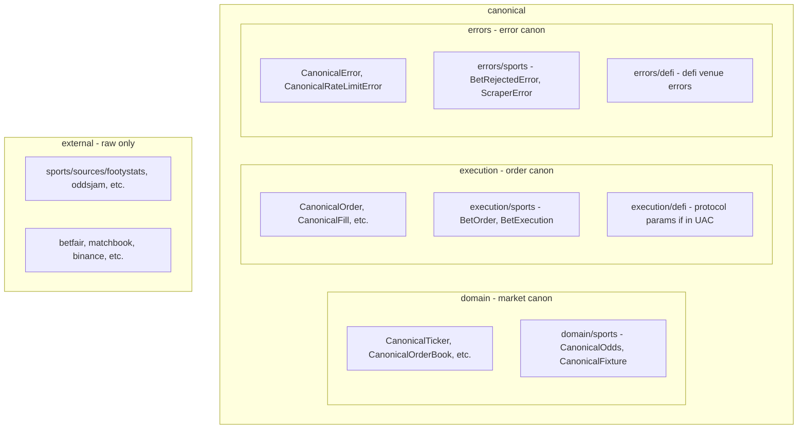

# UAC Nested Domain Deviations — Plan Update

## Problem

Sports and DeFi are currently at `external/sports/` and `external/defi/` as top-level siblings. That mixes:

- Canonical deviations (sports market types, sports execution, defi execution params)
- Raw venue schemas
- Error deviations

It's unclear which domain (market, execution, errors) each type deviates from.

## Solution: Nest Deviations Under the Domain They Deviate From

## New Structure

### canonical/domain/

- **Core:** CanonicalTicker, CanonicalOrderBook, CanonicalTrade, CanonicalFundingRate, etc. (unchanged)
- **sports/:** Move from `external/sports/canonical/` — CanonicalOdds, CanonicalFixture, CanonicalLeague,
  CanonicalPlayer, CanonicalTeam, CanonicalVenue, CanonicalBookmakerMarket, etc.

### canonical/execution/

- **Core:** CanonicalOrder, CanonicalFill, CanonicalOrderAmendment, etc. (unchanged)
- **sports/:** Move from `external/sports/canonical/betting.py` — BetOrder, BetExecution, BetStatus, BettingSignal,
  SignalSource

### canonical/errors/

- **Core:** CanonicalError, CanonicalRateLimitError, etc. (unchanged)
- **sports/:** Move from `external/sports/errors.py` — BetRejectedError, BookmakerUnavailableError,
  FixtureNotFoundError, MarketClosedError, OddsChangedError, ScraperError, SportsError
- **defi/:** Move from `schemas/_venue_errors_defi.py` — VENUE_ERRORS_DEFI (or keep as schemas; errors are venue
  classification maps, not classes)

### external/sports/ (raw only after move)

- **sources/:** footystats, oddsjam, understat, api_football, opticodds, open_meteo — raw API schemas
- **betfair/, matchbook/, smarkets/:** raw betting exchange schemas (if they exist as venue subdirs)

### DeFi protocol params (UIC, not UAC)

- AaveDepositParams, MorphoBorrowParams, etc. live in **UIC** `domain/defi/protocol_sdks.py`
- UAC `__all`\_\_ should not list them unless UAC re-exports from UIC (tier: UIC may import UAC, not vice versa)
- Consumers (UDEI, strategy-service) import from UIC for DeFi protocol params
- UAC `external/defi/` keeps: raw column schemas (AAVE_RATES_SCHEMA, etc.), defillama raw schemas

## Import Paths After Refactor

| Type              | Import path                                                                                 |
| ----------------- | ------------------------------------------------------------------------------------------- |
| Core market       | `from unified_api_contracts.canonical.domain import CanonicalTicker`                        |
| Sports market     | `from unified_api_contracts.canonical.domain.sports import CanonicalOdds, CanonicalFixture` |
| Core execution    | `from unified_api_contracts.canonical.execution import CanonicalOrder`                      |
| Sports execution  | `from unified_api_contracts.canonical.execution.sports import BetOrder, BetExecution`       |
| Core errors       | `from unified_api_contracts.canonical.errors import CanonicalError`                         |
| Sports errors     | `from unified_api_contracts.canonical.errors.sports import BetRejectedError, ScraperError`  |
| Raw sports source | `from unified_api_contracts.external.sports.sources.footystats.schemas import ...`          |
| Raw venue         | `from unified_api_contracts.external.binance.schemas import BinanceInstrumentInfo`          |

## File Moves (Summary)

| From                                                                            | To                                                                                                     |
| ------------------------------------------------------------------------------- | ------------------------------------------------------------------------------------------------------ |
| `external/sports/canonical/*.py` (domain types: odds, fixture, bookmaker, etc.) | `canonical/domain/sports/`                                                                             |
| `external/sports/canonical/betting.py` (BetOrder, BetExecution)                 | `canonical/execution/sports/`                                                                          |
| `external/sports/errors.py`                                                     | `canonical/errors/sports/`                                                                             |
| `external/sports/sources/`                                                      | Stay in `external/sports/sources/` (raw)                                                               |
| `schemas/_venue_errors_defi.py`                                                 | `canonical/errors/defi/` or keep in schemas (venue error maps)                                         |
| `schemas/_venue_errors_sports.py`                                               | `canonical/errors/sports/` (if it has sports error classes) or keep (if it's venue classification map) |

## Clarification: Venue Error Maps vs Error Classes

- **Error classes** (BetRejectedError, ScraperError): Python classes, can live in `canonical/errors/sports/`
- **Venue error maps** (VENUE_ERRORS_DEFI, VENUE_ERRORS_SPORTS): dicts mapping venue → ErrorAction, stay in `schemas/`
  or move to `canonical/errors/sports/` and `canonical/errors/defi/` as `venue_errors.py`

## Benefits

1. **Navigability:** "Where does sports diverge?" → `canonical/domain/sports`, `canonical/execution/sports`,
   `canonical/errors/sports`
2. **Shared canon:** Core domain/execution/errors are the shared baseline; sports/defi are explicit deviations
3. **Raw isolation:** `external/` holds only raw venue/source schemas
4. **Consistent pattern:** Any future vertical (e.g. options, commodities) nests under the domain it deviates from

## Integration with Main Refactor Plan

Merge this into the UAC Domain/Venue-Scoped Refactor plan:

- Replace "domain convenience modules" (market.py, sports.py, defi.py as top-level) with the nested structure above
- Add file moves as Phase 1 before shrinking **init**
- Update downstream imports to use `canonical.domain.sports`, `canonical.execution.sports`, `canonical.errors.sports`
