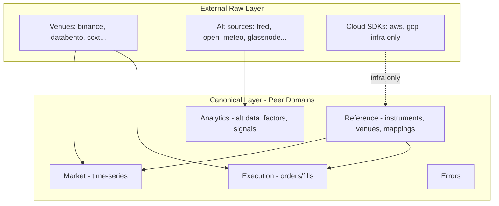

# UAC Package Reorganization (Comprehensive)

## 1. Scope Summary

This plan consolidates:

- **Package layout**: Rename `unified_api_contracts_external` to `external`; move root files into `config/`,
  `registry/`, etc.
- **Domain taxonomy**: Define peer domains (market, execution, reference, analytics, errors) and clarify where SDKs,
  alternative data, and reference data fit.
- **Reference data**: Consolidate scattered reference schemas into a coherent structure.
- **Sports and DeFi**: Nest under the domains they deviate from (market, execution, errors).
- **Provider modes**: Add live/historical availability to `provider_api_versions.yaml`.
- **Adoption and orphans**: Fix `__all__` completeness, tighten exemptions, add SIT discipline.

---

## 2. Domain Taxonomy (Peer Domains)

"Main" market and execution are the **primary trading flows** (what's happening + what we're doing). Reference,
analytics, and errors are **peer domains** that support them.



| Domain        | What it is                                                  | Current location                                               | Target                                                    |
| ------------- | ----------------------------------------------------------- | -------------------------------------------------------------- | --------------------------------------------------------- |
| **Market**    | Time-series market data (trades, orderbook, tickers, OHLCV) | `canonical/domain.py`                                          | `canonical/market/` (or keep `domain.py` as alias)        |
| **Execution** | Orders, fills, positions                                    | `canonical/execution.py`                                       | `canonical/execution/` (already modular)                  |
| **Reference** | Static lookup: instruments, venues, mappings, configs       | `mappings.py`, `registry/`, `domain.py` (InstrumentType, etc.) | `canonical/reference/` + `registry/`                      |
| **Analytics** | Alternative data, factors, signals                          | `schemas/analytics.py`, `external/<source>/`                   | `schemas/analytics.py` + `external/<source>/` (unchanged) |
| **Errors**    | Error handling                                              | `canonical/errors.py`, `schemas/_venue_errors_*.py`            | `canonical/errors/` (with sports/defi subdirs)            |

**SDKs**: `external/cloud_sdks/` (AWS, GCP) = infra API contracts. Not market or execution. No `modes` (N/A). Protocol
SDKs (DeFi) remain in UIC.

**Alternative data**: `schemas/analytics.py` for canonical types; `external/fred/`, `external/open_meteo/`, etc. for
raw. Peer domain to market/execution.

---

## 3. Reference Data Consolidation

Reference data is static or nearly static. Consolidate into:

| Current                                                                 | Target                                                                                         |
| ----------------------------------------------------------------------- | ---------------------------------------------------------------------------------------------- |
| `canonical/mappings.py`                                                 | `canonical/reference/mappings.py` (or keep at `canonical/mappings.py` if minimal change)       |
| `registry/venue_constants.py`                                           | `registry/venue_constants.py` (stays; reference constants)                                     |
| `canonical/domain.py` (InstrumentType, InstrumentWarehouseRow, FeeType) | Move reference types to `canonical/reference/instruments.py`; keep market types in `domain.py` |
| `config/domain_config.py`                                               | `config/domain_config.py` (mode/env; reference-adjacent)                                       |

**Option A (minimal)**: Keep `mappings.py`, `registry/` as-is; add `canonical/reference/` only for new reference types.
Document that reference = mappings + registry + InstrumentType etc.

**Option B (full)**: Create `canonical/reference/` with `mappings.py`, `instruments.py` (InstrumentType,
InstrumentWarehouseRow, ContractSpec), and re-export from `registry/` for venue constants.

Recommend **Option A** for this plan; Option B can be a follow-up.

---

## 4. Sports and DeFi Nesting

Nest sports and DeFi under the domains they extend:

| Domain             | Current                                         | Target                                           |
| ------------------ | ----------------------------------------------- | ------------------------------------------------ |
| Market (sports)    | `external/sports/canonical/`                    | `canonical/market/sports/`                       |
| Execution (sports) | `canonical/domain.py` (CanonicalBetOrder, etc.) | `canonical/execution/sports/`                    |
| Execution (DeFi)   | UIC `domain/defi/protocol_sdks.py`              | Stay in UIC (internal); UAC re-exports if needed |
| Errors (sports)    | `schemas/_venue_errors_sports.py`               | `canonical/errors/sports/`                       |
| Errors (DeFi)      | `schemas/_venue_errors_defi.py`                 | `canonical/errors/defi/`                         |

---

## 5. Provider Modes (Live / Historical)

Add optional `modes` to
[provider_api_versions.yaml](unified-api-contracts/unified_api_contracts/config/provider_api_versions.yaml):

```yaml
providers:
  binance:
    api_version: "v3"
    modes: [live, historical]
  databento:
    api_version: "v0"
    modes: [historical]
  fred:
    api_version: "v1"
    modes: [historical]
  api_football:
    api_version: "v3"
    modes: [live, historical]
  # aws, gcp, etc.: omit modes (N/A for infra)
```

- **Values**: `[live]`, `[historical]`, or `[live, historical]`
- **Omit** for cloud SDKs, FIX, regulatory, and other non-data providers
- **Script**: `scripts/generate_data_source_modes.py` to produce a matrix (optional)
- **Optional**: `config/provider_modes.py` with `get_provider_modes(provider) -> frozenset[str]` for programmatic access

---

## 6. Package Layout (Original + Additions)

### 6.1 Directory Structure

```
unified_api_contracts/
  __init__.py
  py.typed
  config/
    domain_config.py
    provider_api_versions.yaml   # + modes field
    provider_modes.py            # optional
  registry/
    endpoints.py
    endpoint_registry.py
    _endpoint_registry_data.py
    _endpoint_registry_types.py
    venue_constants.py
  canonical/
    domain.py                    # market types (or market/)
    execution.py                 # execution types
    mappings.py                  # reference: DATA_SOURCE_TO_VENUES, etc.
    reference/                  # optional: instruments, ContractSpec
    market/
      sports/                    # nested sports market types
    execution/
      sports/                   # BetOrder, BetExecution
    errors/
      sports/
      defi/
    normalize/
    odds.py
    options.py
    spread.py
  external/                      # RENAMED from unified_api_contracts_external
    binance/
    databento/
    fred/
    open_meteo/
    cloud_sdks/                  # aws, gcp - infra; no modes
    sports/
    defi/
    ...
  schemas/
    analytics.py                 # alternative data canonical types
    commodity.py
    ...
  shared/
  testing/
    vcr_endpoints.py
```

### 6.2 Migration Map (Extended)

| Current                           | Target                                                    |
| --------------------------------- | --------------------------------------------------------- |
| `unified_api_contracts_external/` | `external/`                                               |
| `domain_config.py`                | `config/domain_config.py`                                 |
| `provider_api_versions.yaml`      | `config/provider_api_versions.yaml` (+ modes)             |
| `endpoints.py`, etc.              | `registry/`                                               |
| `venue_constants.py`              | `registry/venue_constants.py`                             |
| `canonical_mappings.py`           | `canonical/mappings.py`                                   |
| `vcr_endpoints.py`                | `testing/vcr_endpoints.py`                                |
| Sports canonical                  | `canonical/market/sports/`, `canonical/execution/sports/` |
| Sports/DeFi errors                | `canonical/errors/sports/`, `canonical/errors/defi/`      |

---

## 7. Adoption and Orphan Discipline

### 7.1 `__all__` Completeness

- **37 symbols in `__all__` are not importable** (e.g. AaveDepositParams, MorphoBorrowParams — these live in UIC).
  Remove from `__all__` or add re-exports from UIC if UAC should expose them.
- **Fix**: Audit `__all__` vs actual imports; remove or fix each mismatch.
- **Lean `__all__`**: Shrink to common cross-cutting types; domain/venue-scoped imports via
  `from unified_api_contracts.external.binance import ...`.

### 7.2 Orphan and Exemption Discipline

- **105 orphaned schemas** (0 terminal consumer imports).
- **EXEMPT_CLASSES** (adoption): 52.
- **EXEMPT_MISSING** (completeness): 18.
- **SIT test**: Add `test_uac_zero_orphans.py` (or similar) that fails if orphan count exceeds a cap, and/or exemption
  count exceeds a cap. Document exemptions in `QUALITY_GATE_BYPASS_AUDIT.md` or equivalent.

---

## 8. Execution Order

1. **Phase 1: UAC internal**

- Rename `unified_api_contracts_external` → `external`
- Create `config/`, `registry/`, move files per migration map
- Add `modes` to `provider_api_versions.yaml` (all data providers)
- Optionally add `config/provider_modes.py`
- Update `__init__.py` imports
- Fix `__all_`\_ (remove/fix 37 non-importable symbols)
- Run UAC quality gates

2. **Phase 2: Domain taxonomy**

- Create `canonical/market/sports/`, `canonical/execution/sports/`, `canonical/errors/sports/`, `canonical/errors/defi/`
- Move sports/DeFi types into nested structure
- Update imports

3. **Phase 3: Downstream cascade**

- Update `external` and `domain_config` imports in all repos
- Run quality gates per repo (`--dep-branch`)

4. **Phase 4: Adoption and SIT**

- Add SIT test for orphan/exemption caps
- Run full workspace quality gates and SIT

---

## 9. Coordination

- **mode_config_env_architecture**: Coordinate on `domain_config` import path.
- **sit_build_source_ci_rollout**: UAC refactor before or in sync with SIT.
- **integration_tests_codex_compliance**: Align with UAC adoption/orphan checks.

---

## 10. Risk Mitigation

- Use `feat!:` / `BREAKING CHANGE:`; quickmerge `--to-staging` for cascade.
- `py.typed` stays at package root.
- Phased execution allows incremental validation.
