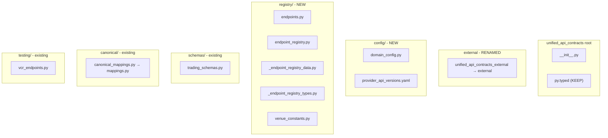

# UAC Package Reorganization Plan

## Completed Work (2026-03-14)

Phase 1 executed via parallel agents. Remaining work (sports/DeFi nesting, reference data consolidation, provider
manifest expansion) moved to
[uac_residual_refactors_provider_manifest_2026_03_14.md](uac_residual_refactors_provider_manifest_2026_03_14.md).

**Superseded plans archived:** uac_nested_domain_deviations_9a5e89ee, uac_package_reorganization_c1c0734e.

## Scope

1. **Rename** `unified_api_contracts_external` to `external` (redundant prefix; already under `unified_api_contracts/`).
2. **Move** root-level files into subdirectories while preserving public API via `__init__.py` re-exports.
3. **Keep** `py.typed` at package root (PEP 561 requirement).

## Proposed Target Structure

## Migration Map

| Current Location                  | Target Location                        | Notes                                        |
| --------------------------------- | -------------------------------------- | -------------------------------------------- |
| `unified_api_contracts_external/` | `external/`                            | Rename directory; update all imports         |
| `domain_config.py`                | `config/domain_config.py`              | High consumer count: UCI, UTL, UDC, services |
| `provider_api_versions.yaml`      | `config/provider_api_versions.yaml`    | Update 3 scripts + 1 test                    |
| `endpoints.py`                    | `registry/endpoints.py`                |                                              |
| `endpoint_registry.py`            | `registry/endpoint_registry.py`        |                                              |
| `_endpoint_registry_data.py`      | `registry/_endpoint_registry_data.py`  |                                              |
| `_endpoint_registry_types.py`     | `registry/_endpoint_registry_types.py` |                                              |
| `venue_constants.py`              | `registry/venue_constants.py`          |                                              |
| `trading_schemas.py`              | `schemas/trading_schemas.py`           |                                              |
| `canonical_mappings.py`           | `canonical/mappings.py`                | Used by canonical/normalize/\*               |
| `vcr_endpoints.py`                | `testing/vcr_endpoints.py`             |                                              |
| `py.typed`                        | **root** (unchanged)                   | PEP 561; must stay at package root           |

## Import Strategy

**Public API preservation:** All imports from `unified_api_contracts` (e.g.
`from unified_api_contracts import domain_config`) must continue to work. Two approaches:

1. **Option A (recommended):** Update `__init__.py` to re-export from new locations; keep backward-compat aliases for
   one release, then remove. Downstream can migrate gradually.
2. **Option B (atomic):** Update all downstream imports in one PR cascade. No backward compat.

Given workspace rules (delete-deprecated, no parallel paths), **Option B** is preferred: single atomic change, no legacy
aliases.

## Downstream Impact (by change type)

### 1. `unified_api_contracts_external` → `external`

**Import pattern:** `from unified_api_contracts.unified_api_contracts_external.<venue>.schemas import ...` **New
pattern:** `from unified_api_contracts.external.<venue>.schemas import ...`

**Affected repos (from explore):**

- `unified-market-interface` (many adapters)
- `unified-defi-execution-interface`
- `unified-sports-execution-interface`
- `unified-internal-contracts`
- `unified-reference-data-interface`
- `instruments-service`, `execution-service`, `strategy-service`, `deployment-service`, `features-onchain-service`, etc.
  (via domain_config)

**UAC internal:** `__init__.py` (lines 184–283, 639), `endpoints.py`, `canonical/normalize/`\*,
`scripts/add_api_version_constants.py` (EXTERNAL_DIR path).

### 2. `domain_config` → `config.domain_config`

**Import pattern:** `from unified_api_contracts import domain_config` or
`from unified_api_contracts.domain_config import ...` **New pattern:**
`from unified_api_contracts.config import domain_config` or `from unified_api_contracts.config.domain_config import ...`

**Affected repos (from grep):**

- `unified-config-interface` (**init**, test_loaders)
- `unified-trading-library` (**init**, domain_client/validation, tests)
- `unified-domain-client` (validation, tests)
- `instruments-service`, `execution-service`, `strategy-service`, `deployment-service`,
  `position-balance-monitor-service`
- `batch-audit-api`, `deployment-api`, `ml-inference-api`, `ml-training-api`, `trading-analytics-api` (conftest/tests)

### 3. Other moves (endpoints, vcr_endpoints, canonical_mappings, etc.)

**Mostly UAC-internal:** tests and scripts. `canonical_mappings` is used by `canonical/normalize/`\* — update relative
imports.

**External direct imports:** None found for `endpoints`, `vcr_endpoints`, `venue_constants`, `trading_schemas` (they are
consumed via `__init__.py` re-exports). So `__init__.py` must be updated to import from new paths; no downstream changes
for these.

## Execution Order

1. **Phase 1: UAC internal refactor**

- Rename `unified_api_contracts_external` → `external`
- Create `config/`, `registry/` dirs
- Move files per table
- Update `__init__.py` imports (all from new paths)
- Update internal cross-refs (canonical/normalize → canonical.mappings, endpoints → registry, etc.)
- Update scripts: `add_api_version_constants.py`, `generate_schema_version_matrix.py` (YAML paths, EXTERNAL_DIR)
- Update test: `tests/vcr/test_schema_health.py` (YAML path)
- Run UAC quality gates

2. **Phase 2: Downstream cascade**

- Update `unified_api_contracts_external` → `external` imports in all repos
- Update `domain_config` imports in all repos
- Run quality gates per repo (quickmerge with `--dep-branch` for feature isolation)

3. **Phase 3: Validation**

- Full workspace quality gates
- SIT pass (if SIT plan includes UAC consumers)
- Version alignment check

## Coordination with Other Plans

- **mode_config_env_architecture:** Touches `domain_config` usage in UTL, UDC, UCI. If mode_config plan is refactoring
  UTL/UDC config loading, coordinate so we don't conflict. Our change is purely import-path; no change to
  `domain_config` API.
- **sit_build_source_ci_rollout:** SIT may run against services that depend on UAC. Ensure UAC refactor is merged before
  SIT runs, or run SIT after Phase 2.

## Files to Update (Summary)

| Repo                                                          | Files (approx)                        |
| ------------------------------------------------------------- | ------------------------------------- |
| unified-api-contracts                                         | ~15 (moves, **init**, scripts, tests) |
| unified-market-interface                                      | ~20+ (adapters)                       |
| unified-defi-execution-interface                              | 1                                     |
| unified-sports-execution-interface                            | ~5                                    |
| unified-internal-contracts                                    | 1                                     |
| unified-reference-data-interface                              | 1                                     |
| unified-config-interface                                      | 2                                     |
| unified-trading-library                                       | 4                                     |
| unified-domain-client                                         | 2                                     |
| instruments-service                                           | 4                                     |
| execution-service                                             | 3                                     |
| strategy-service                                              | 2                                     |
| deployment-service                                            | 2                                     |
| position-balance-monitor-service                              | 1                                     |
| batch-audit-api, deployment-api, ml-\*, trading-analytics-api | conftest/tests                        |

## Risk Mitigation

- **Breaking change:** Use `feat!:` or `BREAKING CHANGE:`; quickmerge with `--to-staging` for staging cascade.
- **Large PR:** Consider splitting into (1) rename external + (2) move root files, if desired. User said "don't mind
  scale" so single plan is acceptable.
- **py.typed:** Explicitly keep at root; do not move.
