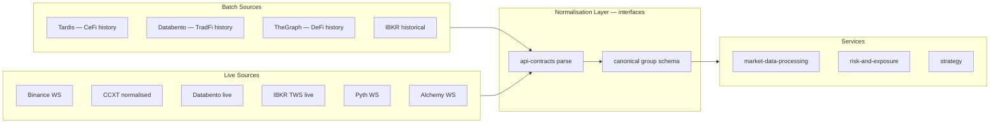
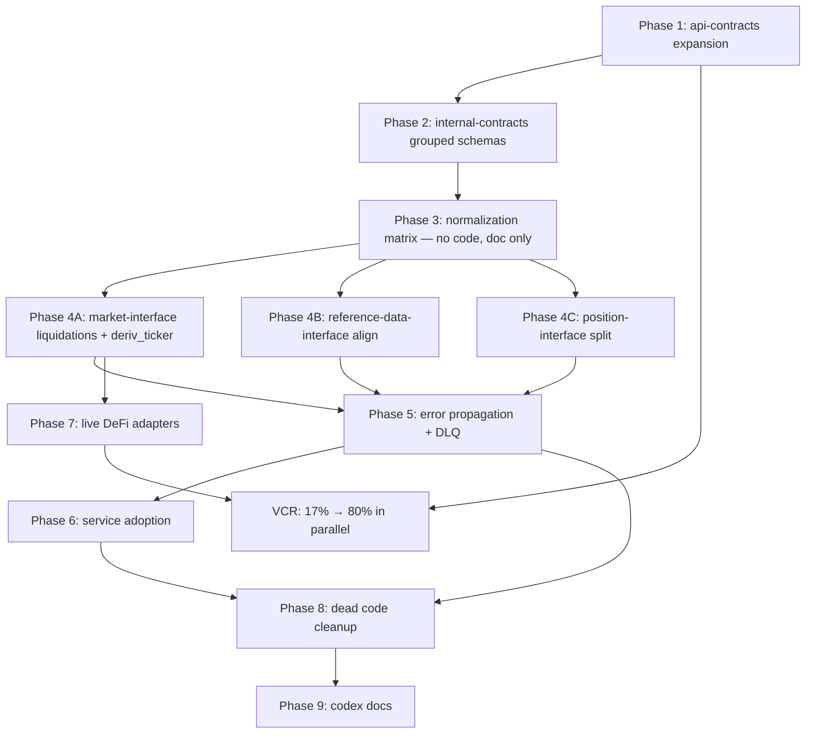

# Data Feed Universe & Contract Adoption Plan

## Context: Source-Agnostic Normalization Principle

The pipeline has two independent dimensions:




A service never knows whether data came from Tardis or direct Binance WS. Source choice is a config concern. Normalisation target is identical.

---

## Phase 1 — api-contracts: Complete the External Schema Universe

### 1.1 Validate and fix liquidation schemas

`api_contracts/schemas/derivatives.py` has a liquidation schema. Verify it covers all CeFi venues confirmed via Tardis docs:

Tardis confirms liquidations for: `binance-futures`, `bybit`, `okx`, `deribit`, `hyperliquid` (via userEvents WS), `bitmex`.
Fields required per venue schema: `exchange`, `symbol`, `timestamp`, `local_timestamp`, `id`, `side`, `price`, `amount`.

- Expand `derivatives.py` per-venue liquidation Pydantic models
- Add Hyperliquid liquidation schema with its unique fields: `lid`, `liquidated_user`, `liquidated_ntl_pos`, `liquidated_account_value`, `leverageType`, `liquidatedPositions`

### 1.2 Validate and expand derivative_ticker schema

Tardis `derivative_ticker` confirmed fields: `exchange`, `symbol`, `timestamp`, `local_timestamp`, `funding_timestamp`, `funding_rate`, `predicted_funding_rate`, `open_interest`, `last_price`, `index_price`, `mark_price`.

Hyperliquid adds: `dayNtlVlm`, `prevDayPx`, `oraclePx`, `midPx`, `open_interest`.

Missing across current schema: `predicted_funding_rate`, `borrow_long_rate`, `borrow_short_rate` (Deribit and Binance have borrow rates for spot margin — verify per venue). Add all as `Optional`.

Target file: `api_contracts/schemas/derivatives.py` — add `DerivativeTickerMessage` with all fields. Per-venue subclasses are NOT needed; use the canonical with `Optional` gaps.

### 1.3 Validate OHLCV source truth

OHLCV is NOT native in Tardis — it is `computeTradeBars` from tick trades. All direct exchange REST APIs (Binance `GET /api/v3/klines`, OKX `/api/v5/market/candles`, Bybit `/v5/market/kline`, Deribit `/public/get_tradingview_chart_data`, Hyperliquid `info:candleSnapshot`, etc.) DO have native candle endpoints. Hyperliquid WebSocket also has `candle` subscription with fields `t, T, s, i, o, c, h, l, v, n`. This must be documented in VCR cassettes to confirm.

### 1.4 Validate Hyperliquid orderbook and liquidations

Confirmed by API docs:

- L2 Orderbook: REST `info:l2Book`, WS subscription `l2Book` with `coin, levels, time, px, sz, n`
- Liquidations: WS `userEvents` with `liquidation` event type. REST historical not confirmed — mark as `Optional` in batch schema.
- Current `hyperliquid_adapter.py` in `unified-market-interface` must be updated to subscribe to both.

### 1.5 Add missing venue schemas to api-contracts

New directories to create under `api_contracts/api_contracts_external/`:

- `betdaq/schemas.py` — SOAP/REST odds, markets, events, order_placement, pnl
- `smarkets/schemas.py` — REST + WebSocket streaming odds/orderbook, bet_placement
- `matchbook/schemas.py` — REST JSON odds, offers, order_placement, markets
- `manifold/schemas.py` — REST markets, prices, comments, trades
- `predictit/schemas.py` — REST markets, prices, bids/asks (non-commercial, 60s refresh)
- `barchart/schemas.py` — OHLCV REST (currently used in service without contract)
- `bloxroute/schemas.py` — expand existing (WS: arbOnlyMEV, newTxs, pendingTxs, mempool)

### 1.6 Add DeFi live streaming schemas

New directories under `api_contracts/api_contracts_external/`:

- `pyth/schemas.py` — WS price feeds: `id`, `price`, `conf`, `expo`, `publish_time`, `ema_price`; 100+ assets across DeFi/TradFi/CeFi
- `chainlink/schemas.py` — SSE Data Streams: `feedId`, `observationsTimestamp`, `price`, `bid`, `ask`, `validFromTimestamp`
- `alchemy/schemas.py` — expand existing for WS: `newHeads`, `alchemy_minedTransactions`, `address_activity`, `logs` with full fields
- `thegraph/schemas.py` — expand existing for WS GraphQL subscription messages: subscription envelope + per-protocol entity schemas

### 1.7 Verify and expand existing venue schemas

Venues confirmed present but needing expansion:

- `hyperliquid/schemas.py` — add `clearinghouseState` (marginSummary, withdrawable), `userFees`, `metaAndAssetCtxs` (funding, OI, mark)
- `tardis/schemas.py` — add full normalized_messages types: `liquidation`, `derivative_ticker`, `options_chain`, `quotes`
- `deribit/schemas.py` — confirm borrow rate fields (`interest_rate`, `underlying_price`), add options chain
- `ibkr/schemas.py` — add historical data endpoint schemas (`reqHistoricalData`)
- `databento/schemas.py` — confirm live `SType.LIVE` endpoint schemas match existing batch schemas

Understat (`understat/schemas.py`) and Transfermarkt (`transfermarkt/schemas.py`) already exist — verify they include full field sets: xG, xA, shot_data for Understat; transfer_fee, market_value, player_profile for Transfermarkt.

### 1.8 Morpho borrowing/debt — confirmed fields

Morpho confirmed via API docs to have full borrowing: `collateral`, `collateralUsd`, `borrowAssets`, `borrowAssetsUsd`, `borrowShares`, `supplyShares`, `supplyAssets`, `health_factor`, `lltv`, `utilization`. GraphQL API at `https://api.morpho.org/graphql` and The Graph subgraphs (Ethereum, Base, Arbitrum). Update `DeFiLendingPosition` to include `borrow_shares`, `supply_shares`, `lltv`. Add Morpho to DeFi × Data Type Matrix as `LendRate: ✓ (borrow+supply)`.

### 1.9 Instadapp — DeFi position aggregator

Instadapp is a Smart Layer middleware providing unified position management across Aave, Compound, MakerDAO, Uniswap, Balancer via non-custodial smart accounts. REST API provides positions, debt, collateral, configuration, reserves aggregated. Add `api_contracts/api_contracts_external/instadapp/schemas.py`. Adapter reads cross-protocol positions and maps them to the relevant canonical group schema (DeFiLendingPosition, DeFiLPPosition) — it is an alternative source for the same schemas, not a new schema.

### 1.10 Index composition — confirmed endpoints

Confirmed API endpoints for perp index basket composition:

- Binance: `GET /fapi/v1/constituents` — fields: `symbol`, `time`, `constituents[].exchange`, `.symbol`, `.price`, `.weight`
- OKX: `GET /api/v5/public/index-components` — fields: `symbol`, `symPx`, `wgt`, `cnvPx`, `exch`, `last`, `index`, `ts`
- Bybit: `GET /v5/market/index-price-components` — fields: `indexName`, `lastPrice`, `updateTime`, `components[].exchange`, `.spotPair`, `.price`, `.weight`, `.multiplier`
- Deribit, Hyperliquid, Databento, Tardis: **no endpoint** — mark as absent

No venue provides a time-series of composition changes. Must poll REST and store snapshots. Add `IndexComposition` schema to `api_contracts/schemas/derivatives.py` and `unified_internal_contracts/reference/index_composition.py`. Add normalizer to Binance, OKX, Bybit adapters in `unified-market-interface`.

Hyperliquid oracle weights (Binance 3x, OKX 2x, Bybit 2x, Kraken 1x etc.) are documented only in their docs — not via API. Add as a static config in `api_contracts/api_contracts_external/hyperliquid/schemas.py`.

### 1.11 FIX protocol (IBKR)

`api_contracts/fix/schemas.py` already exists. Expand it to cover IBKR TWS FIX 4.4/5.0 message types: `ExecutionReport (35=8)`, `NewOrderSingle (35=D)`, `OrderCancelRequest (35=F)`, `MarketDataSnapshotFullRefresh (35=W)`, `MarketDataIncrementalRefresh (35=X)`. Cross-reference with `ibkr/schemas.py` to ensure FIX and TWS REST schemas cover the same data types. FIX is an alternative transport for IBKR — same canonical output, different input schema.

### 1.12 VCR mock coverage: 17% → 80%

`tests/test_vcr_replay.py` and `scripts/record_vcr_cassettes.py` exist. Priority order for new cassettes:

- OKX trades, orderbook, derivative_ticker, liquidations (REST + WS)
- Bybit trades, orderbook, derivative_ticker, liquidations (REST + WS)
- Hyperliquid l2Book, trades, derivative_ticker, liquidations, candle (REST + WS)
- Binance WS (currently no WS cassettes)
- Databento live endpoint
- Tardis liquidations, derivative_ticker replay
- Smarkets, Betdaq, Matchbook (new venues)
- Pyth, Alchemy WS (new live DeFi)

---

## Phase 2 — unified-internal-contracts: Grouped Schema Architecture

All schemas get `schema_version: Literal["v1"]` field. A `SchemaRegistry` class tracks compatibility.

### 2.1 Market Data Groups

**File**: `unified_internal_contracts/market_data/` (new module)

- `trade.py` — `CanonicalTrade`: instrument_key, venue, timestamp, price, size, side, trade_id, is_liquidation (`Optional[bool]`)
- `orderbook.py` — `CanonicalOrderBook`: instrument_key, venue, timestamp, bids/asks `list[tuple[Decimal, Decimal, int | None]]`, levels
- `ohlcv.py` — `CanonicalOHLCV`: instrument_key, venue, timestamp, interval, open/high/low/close, volume, vwap (`Optional`), trade_count (`Optional`), source (enum: `NATIVE_CANDLE | COMPUTED_FROM_TICKS`)
- `derivative_ticker.py` — `CanonicalDerivativeTicker`: all fields from §1.2 above, all `Optional` except instrument_key/venue/timestamp/mark_price/index_price
- `liquidation.py` — `CanonicalLiquidation`: instrument_key, venue, timestamp, side, price, size, order_id (`Optional`), liquidated_account_value (`Optional`)
- `options_chain.py` — `CanonicalOptionsChainEntry`: underlying, expiry, strike, put_call, bid, ask, last, iv (`Optional`), delta/gamma/theta/vega/rho (all `Optional`), open_interest, volume

**File**: `unified_internal_contracts/market_data/defi.py` — DeFi-specific:

- `CanonicalLiquidityPool`: pool_address, protocol, chain, token0/token1, fee_tier, reserve0/reserve1, tvl, price0/price1, volume_24h, fees_24h, apy (`Optional`), tick_current (`Optional`), sqrt_price_x96 (`Optional`)
- `CanonicalLendingRate`: protocol, chain, asset, supply_apy, borrow_apy_variable, borrow_apy_stable (`Optional`), utilization_rate, total_supply, total_borrowed, supply_index, borrow_index
- `CanonicalStakingRate`: protocol, chain, asset, apy, total_staked, rewards_per_second (`Optional`)
- `CanonicalOraclePrice`: feed_id, protocol (Pyth/Chainlink/etc.), asset, price, confidence (`Optional`), publish_time

### 2.2 Reference Data Groups

**File**: `unified_internal_contracts/reference/` — replaces drift between `unified-reference-data-interface/schemas.py` and `instruments-service` custom schemas:

- `instrument.py` — `InstrumentRecord` (single SSOT): instrument_key, venue, asset_class (enum), instrument_type (enum: SPOT/PERP/FUTURES/OPTION/LP/LENDING/STAKING), base, quote, contract_size, tick_size, lot_size, expiry (`Optional`), strike (`Optional`), underlying (`Optional`), pool_address (`Optional`), fee_tier (`Optional`), ltv (`Optional`), liquidation_threshold (`Optional`), status (enum: ACTIVE/EXPIRED/SUSPENDED)
- `expiry_calendar.py` — `ExpiryCalendar`: venue, underlying, expiry_dates, roll_dates
- `universe_snapshot.py` — `UniverseSnapshot`: as_of, instruments `list[InstrumentRecord]`, venue_availability `dict[str, bool]`

### 2.3 Position Groups

**File**: `unified_internal_contracts/positions/` — split from monolithic `InternalPosition`:

- `cefi.py` — `CeFiPosition`: instrument_key, venue, side, size, entry_price, mark_price, unrealized_pnl, leverage, margin_used, liquidation_price (`Optional`), funding_accrued
- `defi_lp.py` — `DeFiLPPosition`: pool_address, protocol, token0/token1_amount, liquidity, fee_income_uncollected, in_range (`Optional[bool]`), lower_tick/upper_tick (`Optional`)
- `defi_lending.py` — `DeFiLendingPosition`: protocol, chain, health_factor, ltv, supplied `list[{asset, amount, apy}]`, borrowed `list[{asset, amount, apy}]`, liquidation_threshold
- `defi_staking.py` — `DeFiStakingPosition`: protocol, chain, asset, staked_amount, rewards_accrued, apy

### 2.4 Risk, Margin & Fees Groups

**File**: `unified_internal_contracts/risk/` — extend existing `risk.py`:

- `MarginState`: venue, total_collateral, total_debt, available_margin, margin_level, maintenance_margin_rate — make all fields non-optional and required from every adapter
- `FeeSchedule`: venue, instrument_type, maker_fee, taker_fee, funding_fee (`Optional`), gas_estimate (`Optional`), slippage_bps (`Optional`)
- `GasCostEstimate` (replace unused `GasCostModel`): protocol, chain, action (enum: SWAP/SUPPLY/BORROW/STAKE), gas_estimate_gwei, gas_estimate_usd (`Optional`)

### 2.5 Order Types (expanded)

**File**: `unified_internal_contracts/orders.py` and `unified_trade_execution_interface/order_types.py`

Remove `TRAILING_STOP` (too vague). Replace with:

- `POST_ONLY` — modifier flag on `LIMIT` orders (ensures maker fill; enrichment, not a standalone type). Represented as `TimeInForce.POST_ONLY` or order flag, not a separate `OrderType`.
- `TRAILING_STOP_LIMIT` — stop price trails market; triggers a limit order at activation
- `TRAILING_TAKE_PROFIT` — stop price trails at profit side (inverse of stop-loss)

Venue support (in `VenueCapabilities` schema):

- Binance, OKX, Bybit: POST_ONLY ✓, TRAILING_STOP_LIMIT ✓
- Deribit: POST_ONLY ✓, no trailing
- Hyperliquid: TRAILING_STOP_LIMIT ✓
- IBKR: trailing stop ✓ (via TWS)
- CCXT: POST_ONLY ✓ (mapped to `postOnly=True`)

### 2.6 Index Composition

**File**: `unified_internal_contracts/reference/index_composition.py`

- `IndexCompositionEntry`: exchange, symbol, price, weight, multiplier (`Optional`)
- `IndexCompositionSnapshot`: index_symbol, venue, timestamp, constituents `list[IndexCompositionEntry]`, schema_version
- Storage: snapshot-based (poll + store; no venue provides change events)

### 2.7 Missing internal contract domains (from audit P1)

**File**: `unified_internal_contracts/orders.py` — order lifecycle state machine:

- `OrderState` enum: PENDING_NEW / NEW / PARTIALLY_FILLED / FILLED / CANCELLED / REJECTED / EXPIRED
- `OrderTransition`: order_id, from_state, to_state, timestamp, reason (`Optional`)
- `VenueCapabilities`: venue, supported_order_types `list[OrderType]`, supported_tif `list[TimeInForce]`, has_post_only `bool`, has_trailing_stop_limit `bool`, has_trailing_take_profit `bool`, has_fix_protocol `bool`

**File**: `unified_internal_contracts/portfolio.py`:

- `PortfolioPnL`: as_of, total_unrealized_pnl, total_realized_pnl, positions `list[CeFiPosition | DeFiLPPosition | ...]`
- `SettlementRecord`: instrument_key, venue, settlement_price, settlement_time, pnl

### 2.8 Schema versioning

Add to `unified_internal_contracts/registry.py`:

```python
class SchemaRegistry:
    SCHEMA_VERSION = "v1"
    COMPATIBILITY: dict[str, list[str]] = {}  # schema_name -> compatible_versions
```

All model base class includes `schema_version: Literal["v1"] = "v1"`.

---

## Phase 3 — Normalization Methodology

### Rule

Every interface adapter follows a two-step contract:

```
RAW API RESPONSE
  → parse through api-contracts Pydantic model (validation gate)
  → map to canonical group schema (None for absent fields)
  → emit to service
```

Failed parse at step 1 → `EnhancedError(category=VALIDATION_ERROR)` + dead-letter routing. Never silent pass-through.

### Venue × Data Type Matrix (normalisation targets)

Below: `✓` = available and must be normalised, `–` = confirmed absent, `?` = unconfirmed (mark `Optional`, add TODO VCR test)


| Venue                | Trade          | OrderBook | OHLCV      | DerivTicker  | Liquidation | OptionsChain |
| -------------------- | -------------- | --------- | ---------- | ------------ | ----------- | ------------ |
| Binance (spot+perps) | ✓              | ✓         | ✓ native   | ✓ perps only | ✓ futures   | –            |
| OKX                  | ✓              | ✓         | ✓ native   | ✓            | ✓           | ✓            |
| Bybit                | ✓              | ✓         | ✓ native   | ✓            | ✓           | ✓            |
| Deribit              | ✓              | ✓         | ✓ native   | ✓            | ✓           | ✓            |
| Coinbase             | ✓              | ✓         | ✓ native   | –            | –           | –            |
| Hyperliquid          | ✓              | ✓ WS      | ✓ native   | ✓            | ✓ WS        | –            |
| Aster                | ✓              | ?         | ?          | ?            | ?           | ?            |
| Upbit                | ✓              | ✓         | ✓          | –            | –           | –            |
| Tardis (batch)       | ✓              | ✓         | ✓ computed | ✓            | ✓           | ✓            |
| CCXT (live)          | ✓              | ✓         | ✓          | ✓ partial    | –           | –            |
| Databento            | ✓              | ✓         | ✓          | ✓ futures    | –           | ✓            |
| IBKR                 | ✓              | ✓         | ✓          | ✓ futures    | –           | ✓            |
| Yahoo Finance        | –              | –         | ✓          | –            | –           | –            |
| Barchart             | –              | –         | ✓          | –            | –           | ✓ ?          |
| Pyth WS              | –              | –         | –          | oracle_price | –           | –            |
| Chainlink WS         | –              | –         | –          | oracle_price | –           | –            |
| TheGraph             | pool_state     | –         | –          | lending_rate | –           | –            |
| Alchemy WS           | events         | –         | –          | –            | –           | –            |
| Betfair              | odds/orderbook | ✓         | –          | –            | –           | –            |
| Smarkets             | odds/orderbook | ✓         | –          | –            | –           | –            |
| Betdaq               | odds           | ✓         | –          | –            | –           | –            |
| Matchbook            | odds           | ✓         | –          | –            | –           | –            |


For `?` fields: schema field is present as `Optional`, VCR test is added as a TODO stub.

### DeFi × Data Type Matrix

`LendRate` includes both supply APY and borrow/debt data where confirmed.


| Protocol            | LiqPool | LendRate+Debt          | StakingRate | OraclePrice   | LiveStream   |
| ------------------- | ------- | ---------------------- | ----------- | ------------- | ------------ |
| Uniswap V2/V3/V4    | ✓       | –                      | –           | via Pyth      | TheGraph WS  |
| AAVE V3             | –       | ✓                      | –           | via Chainlink | TheGraph WS  |
| Curve               | ✓       | ✓                      | –           | –             | TheGraph WS  |
| Balancer            | ✓       | –                      | –           | –             | TheGraph WS  |
| Morpho              | –       | ✓ (borrow+supply+debt) | –           | –             | TheGraph WS  |
| Lido                | –       | –                      | ✓           | –             | Alchemy WS   |
| EtherFi             | –       | –                      | ✓           | –             | Alchemy WS   |
| Ethena              | –       | ✓                      | ✓           | –             | TheGraph WS  |
| Hyperliquid (perps) | –       | –                      | –           | oracle_price  | native WS    |
| Instadapp           | –       | ✓ (aggregated)         | –           | –             | REST polling |


Morpho extra fields confirmed: `borrowAssets`, `borrowAssetsUsd`, `borrowShares`, `supplyShares`, `health_factor`, `lltv`, `utilization` — all `Optional` in `CanonicalLendingRate` / `DeFiLendingPosition` with Morpho-specific fields added.

Instadapp is an aggregator: maps Aave/Compound/MakerDAO positions into a unified smart account view. Its adapter produces `DeFiLendingPosition` output (same canonical schema), sourced from a different API.

---

## Phase 3b — Complete Reference Data Coverage

Reference data is anything that describes instruments, rates, or static market structure — not price observations. All of the below must be in canonical schemas and normalised from every venue that provides them. "Batch only" or "live only" is determined by what the venue actually offers, not assumed.

### Reference Data Groups (complete)


| Data Type             | Schema                     | Venues (Batch)                                                    | Venues (Live)                       | Protocol |
| --------------------- | -------------------------- | ----------------------------------------------------------------- | ----------------------------------- | -------- |
| Instrument static     | `InstrumentRecord`         | Binance, OKX, Bybit, Deribit, Coinbase, HL, CCXT, Databento, IBKR | HL WS `meta`                        | REST     |
| Expiry calendar       | `ExpiryCalendar`           | Deribit, OKX, Bybit, CME via Databento                            | –                                   | REST     |
| Options chain ref     | `OptionsChainRef`          | Deribit, OKX, Bybit, CBOE via Databento, IBKR                     | Deribit WS                          | REST/WS  |
| Index composition     | `IndexCompositionSnapshot` | Binance, OKX, Bybit                                               | – (poll)                            | REST     |
| Funding rate schedule | `FundingRateSchedule`      | Binance, OKX, Bybit, Deribit, HL                                  | Binance WS `markPriceUpdate`, HL WS | REST/WS  |
| Open interest         | `OpenInterestRecord`       | All perp venues via Tardis, direct REST                           | OKX/Bybit WS                        | REST/WS  |
| Borrow/lending rates  | `BorrowRateRecord`         | Binance margin, Deribit `interest_rate`, Aave, Morpho             | –                                   | REST     |
| Margin tiers          | `MarginTierSchedule`       | Binance, OKX, Bybit (leverage brackets)                           | –                                   | REST     |
| Fee schedule          | `FeeSchedule`              | All CeFi venues, DeFi (gas model)                                 | –                                   | REST     |
| Settlement prices     | `SettlementRecord`         | Deribit, OKX, Bybit, CME via Databento                            | –                                   | REST     |
| Universe snapshot     | `UniverseSnapshot`         | Instruments service on startup                                    | –                                   | Internal |
| Venue capabilities    | `VenueCapabilities`        | Static config per venue                                           | –                                   | Config   |


### IBKR Reference Data via FIX + TWS

IBKR provides both historical and live reference data — not through REST but via TWS API (`reqContractDetails`, `reqMarketRule`, `reqHistoricalData`). The `ibkr_adapter.py` must handle both modes. For batch: `reqHistoricalData` via TWS or Flex Query. For live: TWS subscriptions. `api_contracts/fix/schemas.py` covers the FIX transport path.

### Per-Venue Batch/Live Availability (Reference Data)

Availability is declared in `VenueCapabilities.batch_reference_data_types` and `live_reference_data_types` — a list of string data type keys. This allows downstream matching-engine and simulation to know what is query-able from which venue, and therefore which simulation assumptions are valid.

---

## Phase 4 — Interface-Level Changes

### 4.1 unified-market-interface

**Adapter contract enforcement** — `base_adapter.py`:

- Add abstract `_parse_raw(raw: dict[str, object]) -> BaseModel` that runs `api-contracts` model validation before normalization
- Validation failure raises `EnhancedError(category=VALIDATION_ERROR, recovery_strategy=DEAD_LETTER)`

**Missing normalizers to add** per adapter file:

- `adapters/binance.py` — add `normalize_liquidation()`, `normalize_derivative_ticker()` with predicted_funding_rate
- `adapters/okx.py` — same + normalize_options_chain
- `adapters/bybit.py` — same
- `adapters/deribit.py` — same + borrow rates, options chain
- `adapters/onchain_perps/hyperliquid_adapter.py` — add `subscribe_l2book()`, `subscribe_liquidations()`, `normalize_derivative_ticker()` with oraclePx/midPx
- `adapters/onchain_perps/aster_adapter.py` — full audit via Aster API docs, add all confirmed data types
- `adapters/tradfi/databento_adapter.py` — add live endpoint support (`client.live.subscribe()`), derivative_ticker for futures
- `adapters/tradfi/ibkr_adapter.py` (new) — batch historical endpoint (`reqHistoricalData`)

**New adapter files to create:**

- `adapters/tradfi/barchart_adapter.py` — OHLCV REST, normalize to CanonicalOHLCV
- `adapters/sports/betfair_adapter.py` — REST + WS stream, normalize to odds/orderbook schemas
- `adapters/sports/smarkets_adapter.py` — REST + WS, normalize
- `adapters/sports/betdaq_adapter.py` — SOAP/REST, normalize
- `adapters/sports/matchbook_adapter.py` — REST, normalize
- `adapters/prediction/manifold_adapter.py` — REST, normalize
- `adapters/prediction/predictit_adapter.py` — REST, normalize
- `adapters/alt_data/understat_adapter.py` — HTTP scraping, normalize to Understat canonical schemas
- `adapters/alt_data/transfermarkt_adapter.py` — HTTP scraping, normalize
- `adapters/alt_data/open_meteo_adapter.py` — REST, normalize (already has schemas)
- `adapters/defi_live/pyth_adapter.py` — WS, normalize to CanonicalOraclePrice
- `adapters/defi_live/chainlink_adapter.py` — SSE, normalize to CanonicalOraclePrice
- `adapters/defi_live/alchemy_adapter.py` — WS, normalize to DeFi event schemas
- `adapters/defi_live/thegraph_ws_adapter.py` — GraphQL WS subscriptions, normalize to CanonicalLiquidityPool / CanonicalLendingRate
- `adapters/defi_live/bloxroute_adapter.py` — expand existing WS adapter

**Instadapp adapter**: `adapters/defi/instadapp_adapter.py` — reads cross-protocol positions via REST, normalizes to `DeFiLendingPosition` (same output schema as Aave/Morpho adapters).

Delete deprecated: remove any `CanonicalTrade`, `CanonicalOrderBook`, `CanonicalFundingRate` redefinitions inside the interface that duplicate internal-contracts (single SSOT).

### 4.2 unified-reference-data-interface

- Delete `unified_reference_data_interface/schemas.py` custom `CanonicalInstrument` — replace with `from unified_internal_contracts.reference.instrument import InstrumentRecord`
- Update all adapters (`binance.py`, `coinbase.py`, `bybit.py`, `okx.py`, `deribit.py`, `hyperliquid.py`, `tardis.py`, `databento.py`, `ibkr.py`, `ccxt_adapter.py`) to return `InstrumentRecord`
- Add DeFi adapters: `adapters/defi/uniswap.py`, `adapters/defi/aave.py`, `adapters/defi/lido.py`
- Add `UniverseSnapshot` emitter: on startup, emit a typed `UniverseSnapshot` that all downstream services validate

### 4.3 unified-position-interface

- Replace monolithic `InternalPosition` with grouped types from §2.3
- Add `mark_price` to `CeFiPosition` (currently uses `current_price` — rename; delete old field)
- Add `side` to all DeFi position types as `Optional` (remove deviation)
- All adapters parse through api-contracts position response schema before normalizing

### 4.4 unified-defi-execution-interface

- Replace dict returns in `protocols/morpho.py`, `protocols/aave.py`, `protocols/uniswap.py` with TypedDicts / Pydantic (from internal-contracts)
- Implement `GasCostEstimate` (replace unused `GasCostModel` in `gas.py` — delete old, implement new)
- Error handling: replace bare `ValueError`/`KeyError` with `EnhancedError`
- Add live stream connector hooks to `connectors/registry.py` for Pyth/Alchemy/TheGraph WS

---

## Phase 5 — Error Propagation & Dead-Letter Architecture

All services adopt `EnhancedError` from `unified-internal-contracts`:

```python
from unified_internal_contracts.schemas.errors import EnhancedError, ErrorCategory, ErrorRecoveryStrategy
```

**Dead-letter routing** (new in `unified-internal-contracts/dead_letter.py`):

- `DeadLetterRecord`: service, venue, timestamp, raw_payload, error: EnhancedError, schema_attempted
- All validation failures route here via Pub/Sub topic `DEAD_LETTER_VALIDATION`

Services to update (replace custom exceptions):

- `unified-market-interface` — 418 try/except blocks; replace bare `except` with typed `EnhancedError`
- `unified-reference-data-interface` — replace `NotImplementedError` with `EnhancedError(category=NOT_IMPLEMENTED)`
- `pnl-attribution-service` — add validation layer in `adapters/domain_adapter.py`
- `strategy-service` — 282 `dict[str, Any]` → typed; 212 `# type: ignore` → fix root cause
- `execution-results-api` — zero contract usage → full adoption

---

## Phase 6 — Service-Level Contract Adoption

For each service, the single change is: **add `unified-internal-contracts` as production dependency** (currently test-only in all 14+ services) and replace local Pydantic models at boundary with shared contracts.

Priority services:

1. `market-data-processing-service` — adopt CanonicalTrade, CanonicalOrderBook, CanonicalOHLCV, CanonicalDerivativeTicker, CanonicalLiquidation
2. `market-tick-data-handler` — adopt CanonicalTrade, CanonicalOrderBook at ingestion boundary
3. `position-balance-monitor-service` — adopt CeFiPosition, DeFiLendingPosition, MarginState
4. `pnl-attribution-service` — implement TODO stubs in `cli/handlers/compute_handler.py`; adopt CanonicalFill, PortfolioPnL
5. `risk-and-exposure-service` — implement batch risk calculation in `engine/risk_metrics.py`; adopt ExposureSummary, MarginState (make all fields non-optional)
6. `execution-results-api` — replace all local Pydantic with CanonicalFill, ExecutionResult, CanonicalOrder
7. `features-`* (all 4) — adopt CanonicalDerivativeTicker, CanonicalLiquidityPool, CanonicalLendingRate
8. `ml-training-service`, `ml-inference-service` — adopt InferenceRequest/Result, ModelMetadata
9. `strategy-service` — replace dict[str, Any] at strategy signal boundary with StrategySignalMessage

### 6b — UIC Adoption: Remaining 12 Services

These services are not covered in §6 above. Each requires the same two-step pattern:

1. Add `unified-internal-contracts` to `pyproject.toml` production deps (remove from test-only)
2. Replace bare string `log_event("STARTED")` calls with `log_event(LifecycleEventType.STARTED)` enum

Services: `alerting-service`, `features-calendar-service`, `features-delta-one-service`, `features-onchain-service`, `features-volatility-service`, `instruments-service`, `matching-engine-library`, `settlement-ui` (N/A — TypeScript), `strategy-service` (already in §6 above), `unified-domain-client`.

### 6c — execution-service Cleanup

- Remove all `except Exception: pass` blocks — replace with `EnhancedError` or propagate
- Remove duplicate internal schema definitions in `execution_service/adapters/` that shadow types from `unified-internal-contracts`
- Entry points: `execution_service/adapters/defi_adapter.py`, `execution_service/adapters/algorithm_factory.py`
- Apply `delete-deprecated.mdc`: single code path after cleanup; no parallel old+new schema

---

## Phase 7 — Live DeFi Infrastructure (New)

No live DeFi solution currently exists. Add:

- `unified_market_interface/adapters/defi_live/thegraph_ws_adapter.py` — GraphQL WS (`subscription { swaps(first: 5) { ... } }`) → CanonicalLiquidityPool
- `unified_market_interface/adapters/defi_live/pyth_adapter.py` — Pyth WS → CanonicalOraclePrice (100+ feeds, real-time)
- `unified_market_interface/adapters/defi_live/alchemy_adapter.py` — Alchemy WS `alchemy_minedTransactions` + `logs` → filtered DeFi event stream
- `unified_market_interface/adapters/defi_live/bloxroute_adapter.py` — expand WS for MEV/mempool

Auth blacklisting in `api_contracts/endpoint_registry.py`: venues without confirmed auth credentials get `status: BLACKLISTED_NO_AUTH` — schema is complete but endpoint is blocked in the interface until auth is confirmed via VCR test.

---

## Phase 7b — Fixed Income / Bond Data

For trading a bond you need: tradable bid/ask price, modified duration, YTM (yield to maturity) / YTW (yield to worst), and the risk-free rate curve for that currency (to compute the spread). Research verdict on sources:


| Source                      | Tradable Bid/Ask                 | Duration                        | YTM/YTW               | Risk-free Curve              | Cost                | Protocol      |
| --------------------------- | -------------------------------- | ------------------------------- | --------------------- | ---------------------------- | ------------------- | ------------- |
| **IBKR TWS**                | ✓                                | ✓ (duration %, convexity, DV01) | ✓ yield-to-worst      | –                            | Market data sub     | FIX / TWS     |
| **FRED**                    | –                                | –                               | –                     | ✓ US Treasury (1m–30y)       | Free (API key)      | REST          |
| **ECB Data Portal**         | –                                | –                               | –                     | ✓ EU OIS/ESTR curves         | Free (no auth)      | SDMX 2.1 REST |
| **OpenBB**                  | ✓ bid/offer (US Treasuries only) | ✗                               | ✓ YTM (US Treasuries) | via FRED                     | Freemium            | Python SDK    |
| **OFR**                     | –                                | –                               | –                     | ✗ (limited CDS spreads only) | Free                | REST          |
| **Quandl/Nasdaq Data Link** | ✗ indices only                   | ✗                               | ✗                     | ✓ yield curve indices        | Free limited + paid | REST          |


**Quandl**: yield indices and curves only (e.g. `USTREASURY/YIELD`) — no per-bond CUSIP prices, no duration, no per-bond YTM. Not useful for trading individual bonds.

**IBKR TWS is the complete source**: bid, ask, bid yield, ask yield, YTW, duration (%), convexity, DV01, CUSIP, coupon rate, maturity. Requires TWS market data subscription — same auth path already in the system.

**Source stack:**


| Need                                         | Source                             | Batch                                | Live         | Cost                                            |
| -------------------------------------------- | ---------------------------------- | ------------------------------------ | ------------ | ----------------------------------------------- |
| Cash bond prices + duration + YTM            | IBKR TWS                           | ✓ `reqHistoricalData` (no extra fee) | ✓ TWS stream | Pass-through sub (~$1–10/mo check Account Mgmt) |
| Treasury futures ZT/ZF/ZN/ZB/UB + options    | Databento GLBX.MDP3                | ✓ (from 2010)                        | ✓            | ~$0.50/GB                                       |
| SOFR SR1/SR3, Fed Funds, Eurodollar, €STR    | Databento GLBX.MDP3                | ✓                                    | ✓            | ~$0.50/GB                                       |
| Gilts, Bund, Bobl, Schatz, BTP, OAT, Spanish | Databento IFLL.IMPACT (ICE Europe) | ✓ (from 2018)                        | ✓            | ~$0.50/GB                                       |
| US risk-free curve                           | FRED (in plan)                     | ✓                                    | – daily      | Free                                            |
| EU risk-free curve                           | ECB (in plan)                      | ✓                                    | – daily      | Free                                            |
| Corp cash bonds                              | IBKR TWS only                      | ✓ hist                               | ✓ live       | Same sub                                        |
| FINRA TRACE (corp bonds)                     | Databento — **roadmap, not live**  | future                               | future       | TBD                                             |


IBKR historical bond data is included in the TWS API connection (no separate fee). Databento has only Treasury/interest rate **futures** — not cash bonds. FINRA TRACE (cash Treasuries and corporate bonds) is on Databento's roadmap; when it ships, wire it as an additional source in the IBKR/batch adapter with same canonical output.

### Databento Fixed Income Coverage (complete)

Three datasets cover the full government bond futures universe:

**GLBX.MDP3 (CME Globex — from 2010)**: ZT (2yr), ZF (5yr), ZN (10yr), ZB (30yr), UB (Ultra Bond), Micro Ultra Treasury; SOFR SR1/SR3; Fed Funds; Eurodollar; €STR; Treasury options. Full schema depth: trades, MBO, MBP-1, MBP-10, OHLCV (1s/1m/1h/1d), definition, statistics. 650k+ symbols, nanosecond timestamps.

**IFLL.IMPACT (ICE Futures Europe — from Dec 2018)**: Long/Medium/Short Gilts; Bund, Bobl, Schatz; BTP Italy; OAT France; Spanish and Swiss bond futures. Schema: trades, MBO, MBP-10, OHLCV. Use this for all EU bond futures — 7 years history vs EUREX (XEUR.EOBI) which only has data from Mar 2025. EUREX is excluded from the plan; ICE covers the same instruments.

**Overnight/repo rates via futures**: SOFR SR1 (1-month) and SR3 (3-month) on CME replace Eurodollar; Fed Funds on CME; €STR on CME. These proxy the risk-free rate term structure alongside FRED/ECB yield curves.

**Not in Databento**: MBS futures, CDX credit index futures, iTraxx credit index futures, bond ETF data. For these, IBKR is the only current source.

### Instrument additions needed

`InstrumentRecord.instrument_type` additions beyond the already-planned `BOND/TREASURY/CORPORATE_BOND/CDS`:

- `RATE_FUTURES` (SOFR, Fed Funds, Eurodollar, €STR)
- `BOND_FUTURES` (ZT/ZF/ZN/ZB/UB, Gilt futures, Bund futures)
- `BOND_OPTION` (Treasury options via CME)

`CanonicalDerivativeTicker` already covers futures — no new schema needed for rate/bond futures; they normalise into the same derivative ticker path as CME equity index futures.

### Canonical Bond Schemas

New `CanonicalBondData` in `unified_internal_contracts/market_data/fixed_income.py`:

- `instrument_key`, `venue`, `timestamp`
- `bid_price`, `ask_price`, `last_price` (all `Optional` — may be yield-quoted only)
- `bid_yield`, `ask_yield`, `ytm` (`Optional`), `ytw` (`Optional`)
- `duration` — modified duration % (`Optional`)
- `convexity` (`Optional`), `dv01` (`Optional`)
- `coupon_rate`, `coupon_frequency`, `maturity_date`
- `cusip` (`Optional`), `isin` (`Optional`)

`CanonicalYieldCurve` in `unified_internal_contracts/reference/yield_curve.py`:

- `source` (FRED/ECB/IBKR), `currency`, `curve_type` (TREASURY/OIS/ESTR/SOFR), `as_of`
- `tenors`: `list[{maturity_label: str, maturity_years: float, yield_bps: int}]`

### What to add to api-contracts

- `api_contracts/api_contracts_external/fred/schemas.py` — Treasury yield series, TIPS, yield curve observations
- `api_contracts/api_contracts_external/ecb/schemas.py` — EU sovereign yield curves (SDMX 2.1 envelope)
- `api_contracts/api_contracts_external/openbb/schemas.py` — `TreasuryPrices` (bid, offer, ytm) for US Treasuries via TMX/government_us providers
- `api_contracts/api_contracts_external/ofr/schemas.py` — CDS spread indices (mark fields as `Optional`; limited coverage)
- Expand `ibkr/schemas.py` — add bond market data columns (bid_yield, ask_yield, duration, convexity, DV01)
- `InstrumentRecord.instrument_type` enum: add `BOND`, `TREASURY`, `SOVEREIGN_BOND`, `CORPORATE_BOND`, `CDS`

**CDS**: schema included; mark `CDS` endpoints as `BLACKLISTED_NO_FREE_SOURCE` in `endpoint_registry.py`. OFR provides limited spread indices only. Markit/ICE require licensing. Schema stays; data pull blocked until licensed source is procured.

---

## Phase 8 — Dead Code Cleanup

Per `delete-deprecated.mdc`: single code path, delete old on replacement.

- Delete `RATE_INDEX_SCHEMA` standalone usage if confirmed unused after §4.1 audit; else wire consumer
- Delete `CanonicalSwap`, `CanonicalLiquidationPool`, `CanonicalOraclePrice`, `CanonicalStakingRate` in UMI if replaced by internal-contracts equivalents (single SSOT)
- Delete `InternalPosition` monolith after grouped position schemas are wired
- Delete `unified_reference_data_interface/schemas.py` custom `CanonicalInstrument` after §4.2 is complete
- Delete `GasCostModel` in `gas.py` after `GasCostEstimate` is implemented
- Remove `# type: ignore` and `dict[str, Any]` at all external API boundaries once Pydantic contracts are in place
- Remove `try/except ImportError` fallbacks (none should exist per cursor rules)

---

## Phase 9 — Observability, Governance & Codex

### 9a — Consumer-Driven Contract Tests (CDC)

Each service that consumes a canonical schema must declare its expected fields in a `contracts/` directory:

```python
# e.g. market-data-processing-service/contracts/consumed_schemas.py
CONSUMED: dict[str, list[str]] = {
    "CanonicalTrade": ["instrument_key", "venue", "timestamp", "price", "size", "side"],
    "CanonicalDerivativeTicker": ["funding_rate", "mark_price", "open_interest"],
}
```

`api-contracts/scripts/check_sdk_version_alignment.py` pattern to follow. Add `scripts/check_cdc_compatibility.py` to `api-contracts` that imports each consumer's `consumed_schemas.py` and asserts all declared fields exist in the current canonical schema. This runs in `quality-gates.sh` for every consumer repo and in the `api-contracts` CI as a reverse-dependency check.

### 9b — Schema Registry CI Gate

`SchemaRegistry` is added but nothing blocks a merge on breaking changes. Add `scripts/check_schema_breaking_changes.py` to `unified-internal-contracts`:

- On each PR, compare current schema field sets against the previous tagged release
- Breaking changes: field removal, type narrowing, `Optional` → required — **block merge** unless `schema_version` is bumped
- Non-breaking: new `Optional` fields, relaxed types, new models — **allow**
- Integrates into `quality-gates.sh` in `unified-internal-contracts` and any consumer repo that declares CDC

### 9c — Cross-Service Correlation IDs

`EnhancedError` currently has no trace ID. Add to `unified_internal_contracts/schemas/errors.py`:

- `correlation_id: str` — UUID generated at the originating request boundary, propagated through all downstream service calls
- `trace_id: Optional[str]` — OpenTelemetry trace ID when available

Also add `correlation_id` to `DeadLetterRecord`, `LifecycleEventEnvelope`, and `PubSubMessageEnvelope` for cross-service incident reconstruction.

### 9d — PII / Regulatory Field Tagging

Schema fields that contain personally identifiable or regulated data must be tagged in metadata. Confirmed PII fields in this system:

- `account_id` — `pii=True`
- `client_order_id` (may embed usernames) — `pii=True`
- `username`, `user_id` — `pii=True, gdpr_erasable=True`
- Wallet addresses (`from_address`, `to_address`, `wallet_address` in DeFi positions and events) — `pii=True, regulatory=True`
- `transaction_id`, `tx_hash` (DeFi) — `pii=True, regulatory=True` (public on-chain but linked to identity in our system)
- `counterparty_name`, `counterparty_id` — `pii=True`
- `ip_address` (in connection/auth events) — `pii=True, gdpr_erasable=True`
- Tax ID / LEI fields (when added) — `pii=True, regulatory=True, gdpr_erasable=True, regulatory_retention_days=2555`

Implementation: Pydantic `Field(json_schema_extra={"pii": True, "gdpr_erasable": True, "regulatory_retention_days": 2555})`. Add `unified_internal_contracts/pii_registry.py` providing `list_pii_fields(model)` for use by data masking middleware, audit log scrubbers, and GDPR deletion request handlers.

### 9e — Real-Time Contract Health Dashboard

`live-health-monitor-ui` (React + TypeScript + Vite) currently monitors positions and risk metrics. Extend it — do not create a new repo.

Add new component `src/components/ContractHealth.tsx`:

- Per-venue schema validation pass/fail rate (sourced from `DEAD_LETTER_VALIDATION` Pub/Sub topic, aggregated via `execution-results-api` or a new `/contract-health` endpoint)
- Dead-letter queue depth per venue (alert threshold configurable)
- CDC compatibility status per consumer service (green/red per schema)
- Schema version drift alerts (consumer declares v1, producer emits v2)

The backend endpoint (`/api/contract-health`) reads from the dead-letter GCS bucket + Pub/Sub metrics. This is a new endpoint in `execution-results-api` or a lightweight sidecar. Latency metric goal: `<100µs per validation` at 100k msg/s (measured in integration tests; target not hardcoded until API benchmarks run).

### 9f — Regulatory Reporting Schemas (MiFID II / EMIR)

PII tagging covers field-level metadata. Regulatory reporting requires complete structured schemas that can be submitted to trade repositories. Both are needed.

**File**: `unified_internal_contracts/regulatory/mifid2.py` — CREATE

```python
from __future__ import annotations
from decimal import Decimal
from datetime import datetime
from typing import Optional, Literal
from unified_internal_contracts.base import BaseContractModel
from pydantic import Field

class MiFID2TransactionReport(BaseContractModel):
    """MiFID II RTS 22 transaction report fields."""
    transaction_reference_number: str   # TRN — unique per firm per transaction
    trading_venue_mic: str              # ISO 10383 MIC code
    # Counterparties — all PII/regulatory
    buyer_lei: str = Field(json_schema_extra={"pii": True, "regulatory": True, "regulatory_retention_days": 2555})
    seller_lei: str = Field(json_schema_extra={"pii": True, "regulatory": True, "regulatory_retention_days": 2555})
    investment_firm_lei: str = Field(json_schema_extra={"pii": True, "regulatory": True, "regulatory_retention_days": 2555})
    # Instrument
    instrument_isin: str
    instrument_classification: str      # CFI code
    underlying_isin: Optional[str] = None
    # Trade economics
    price: Decimal
    price_currency: str
    quantity: Decimal
    notional: Optional[Decimal] = None
    notional_currency: Optional[str] = None
    # Timestamps
    trade_datetime: datetime
    trading_date: datetime
    # Flags
    short_selling_indicator: Optional[Literal["SESH", "SSEX", "UNDI", "EXMT"]] = None
    waiver_indicator: Optional[str] = None
    otc_post_trade_indicator: Optional[str] = None
    transmission_of_order_indicator: bool = False
    report_status: Literal["NEWT", "AMND", "CANC"] = "NEWT"
```

**File**: `unified_internal_contracts/regulatory/emir.py` — CREATE

```python
from __future__ import annotations
from decimal import Decimal
from datetime import datetime, date
from typing import Optional, Literal
from unified_internal_contracts.base import BaseContractModel
from pydantic import Field

class EMIRTradeReport(BaseContractModel):
    """EMIR REFIT trade report fields (ESMA RTS)."""
    uti: str                            # Unique Trade Identifier
    reporting_counterparty_lei: str = Field(json_schema_extra={"pii": True, "regulatory": True, "regulatory_retention_days": 2555})
    other_counterparty_lei: Optional[str] = Field(default=None, json_schema_extra={"pii": True, "regulatory": True, "regulatory_retention_days": 2555})
    # Product
    product_id_isin: Optional[str] = None
    product_id_uti: Optional[str] = None
    asset_class: Literal["CO", "CR", "CU", "EQ", "FX", "IR", "OT"]
    contract_type: str                  # "SWAP", "FORW", "OPTN", etc.
    # Economics
    notional: Optional[Decimal] = None
    notional_currency: Optional[str] = None
    price: Optional[Decimal] = None
    price_currency: Optional[str] = None
    quantity: Optional[Decimal] = None
    # Dates
    trade_date: date
    effective_date: Optional[date] = None
    maturity_date: Optional[date] = None
    report_date: date
    # CCP / venue
    ccp_cleared: bool
    ccp_lei: Optional[str] = None
    execution_venue_mic: Optional[str] = None
    # Status
    action_type: Literal["NEWT", "MODI", "EROR", "VALU", "MARU", "POSC", "TERM", "REVI"] = "NEWT"
```

**Add to `unified_internal_contracts/pubsub.py`** — new topic constant:

```python
REGULATORY_REPORTING = "regulatory-reporting"   # MiFID II + EMIR outbound
```

Add both files to **Appendix B.1 CREATE list**:

```
unified_internal_contracts/regulatory/__init__.py
unified_internal_contracts/regulatory/mifid2.py
unified_internal_contracts/regulatory/emir.py
```

### 9g — Hypothesis Property Testing

VCR tests verify known-good responses. Hypothesis tests verify schema robustness against adversarial inputs that venues occasionally emit.

**File**: `api-contracts/tests/test_schema_properties.py` — CREATE

```python
from hypothesis import given, settings
from hypothesis import strategies as st
from decimal import Decimal
import pytest

# Test 1: Extreme Decimal values parsed without silent truncation
@given(st.decimals(allow_nan=False, allow_infinity=False, min_value=-1e20, max_value=1e20))
def test_canonical_trade_price_no_truncation(price):
    trade = CanonicalTrade(
        instrument_key="TEST:BTC-USDT", venue="test",
        timestamp=datetime.now(timezone.utc),
        price=price, size=Decimal("1"), side="buy",
    )
    assert trade.price == price   # no silent rounding

# Test 2: Zero-size order rejected
def test_zero_size_order_rejected():
    with pytest.raises(ValidationError):
        CanonicalTrade(..., size=Decimal("0"), ...)

# Test 3: NaN float from venue rejected at _parse_raw()
def test_nan_float_rejected():
    raw = {"price": float("nan"), "size": 1.0, ...}
    with pytest.raises((ValidationError, EnhancedError)):
        adapter._safe_parse(raw, BinanceTradeMessage)

# Test 4: Timezone-naive timestamp rejected
def test_naive_timestamp_rejected():
    from datetime import datetime
    with pytest.raises(ValidationError):
        CanonicalTrade(..., timestamp=datetime(2024, 1, 1), ...)  # no tzinfo

# Test 5: Empty instrument_key rejected
def test_empty_instrument_key_rejected():
    with pytest.raises(ValidationError):
        CanonicalTrade(..., instrument_key="", ...)
```

Add `hypothesis` to `pyproject.toml` dev deps in `api-contracts`. Add to `quality-gates.sh`:

```bash
pytest tests/test_schema_properties.py --hypothesis-seed=0 --hypothesis-settings=max_examples=200
```

### 9h — Venue Adapter Rationale (new doc)

`unified-trading-codex/04-architecture/venue-adapter-rationale.md`:

> All venues are present in contracts and adapters — even when our actual data comes from an aggregator (Tardis for CeFi batch, Databento for TradFi batch, CCXT for live) — because the venue adapter architecture enables venue-specific simulation assumptions in `matching-engine-library`. CCXT systematically underperforms direct exchange connections due to normalisation latency and rate limits. Direct Binance WS outperforms CCXT live. IBKR historically outperforms Databento for TradFi live execution. When an execution result deviates from simulation, having the direct venue adapter in the contract allows calibrating simulation parameters (fee tiers, fill probability, latency model) per broker. This cannot be done with a single "generic" adapter. The matching engine's `l1_matching_engine.py` and `l2_matching_engine.py` both accept a `VenueCapabilities` object that adjusts assumptions accordingly.

Per `codex-maintenance.mdc`:

- `unified-trading-codex/02-data/canonical-schema-groups.md` — document the 9 canonical groups and their field contracts
- `unified-trading-codex/02-data/venue-normalization-matrix.md` — the venue × data type table above
- `unified-trading-codex/02-data/contract-failure-handling.md` — dead-letter queue strategy
- `unified-trading-codex/05-infrastructure/contract-migration.md` — migration playbook, breaking change procedures
- `unified-trading-codex/05-infrastructure/live-defi-streaming.md` — Pyth/Alchemy/TheGraph WS patterns

---

## Appendix A — Exact Schema Definitions (for implementation agents)

Every schema below is the exact Pydantic v2 class to create. Use `from __future__ import annotations`. All models inherit from a `BaseContractModel` that adds `schema_version`.

### A.1 BaseContractModel (unified_internal_contracts/base.py — CREATE)

```python
from __future__ import annotations
from typing import Literal
from pydantic import BaseModel

class BaseContractModel(BaseModel):
    schema_version: Literal["v1"] = "v1"

    model_config = {"frozen": True}
```

### A.2 CanonicalTrade (unified_internal_contracts/market_data/trade.py — CREATE)

```python
from __future__ import annotations
from decimal import Decimal
from datetime import datetime
from typing import Optional, Literal
from unified_internal_contracts.base import BaseContractModel

class CanonicalTrade(BaseContractModel):
    instrument_key: str
    venue: str
    timestamp: datetime
    price: Decimal
    size: Decimal
    side: Literal["buy", "sell"]
    trade_id: Optional[str] = None
    is_liquidation: Optional[bool] = None
```

### A.3 CanonicalOrderBook (unified_internal_contracts/market_data/orderbook.py — CREATE)

```python
from __future__ import annotations
from decimal import Decimal
from datetime import datetime
from typing import Optional
from unified_internal_contracts.base import BaseContractModel

class OrderBookLevel(BaseContractModel):
    price: Decimal
    size: Decimal
    count: Optional[int] = None

class CanonicalOrderBook(BaseContractModel):
    instrument_key: str
    venue: str
    timestamp: datetime
    bids: list[OrderBookLevel]
    asks: list[OrderBookLevel]
    levels: int
```

### A.4 CanonicalOHLCV (unified_internal_contracts/market_data/ohlcv.py — CREATE)

```python
from __future__ import annotations
from decimal import Decimal
from datetime import datetime
from typing import Optional, Literal
from enum import Enum
from unified_internal_contracts.base import BaseContractModel

class OHLCVSource(str, Enum):
    NATIVE_CANDLE = "NATIVE_CANDLE"
    COMPUTED_FROM_TICKS = "COMPUTED_FROM_TICKS"

class CanonicalOHLCV(BaseContractModel):
    instrument_key: str
    venue: str
    timestamp: datetime
    interval: str  # "1m", "5m", "1h", "1d"
    open: Decimal
    high: Decimal
    low: Decimal
    close: Decimal
    volume: Decimal
    vwap: Optional[Decimal] = None
    trade_count: Optional[int] = None
    source: OHLCVSource
```

### A.5 CanonicalDerivativeTicker (unified_internal_contracts/market_data/derivative_ticker.py — CREATE)

```python
from __future__ import annotations
from decimal import Decimal
from datetime import datetime
from typing import Optional
from unified_internal_contracts.base import BaseContractModel

class CanonicalDerivativeTicker(BaseContractModel):
    instrument_key: str
    venue: str
    timestamp: datetime
    # Required — at least one must be non-None
    mark_price: Optional[Decimal] = None
    index_price: Optional[Decimal] = None
    last_price: Optional[Decimal] = None
    # Funding
    funding_rate: Optional[Decimal] = None
    predicted_funding_rate: Optional[Decimal] = None
    funding_timestamp: Optional[datetime] = None
    next_funding_time: Optional[datetime] = None
    # Open interest
    open_interest: Optional[Decimal] = None       # in contracts
    open_interest_value: Optional[Decimal] = None  # in USD
    # Borrow rates (spot margin — Binance/Deribit)
    borrow_long_rate: Optional[Decimal] = None
    borrow_short_rate: Optional[Decimal] = None
    # Hyperliquid-specific
    oracle_price: Optional[Decimal] = None
    mid_price: Optional[Decimal] = None
    day_ntl_volume: Optional[Decimal] = None
    prev_day_price: Optional[Decimal] = None
    # Basis
    basis: Optional[Decimal] = None
    basis_rate: Optional[Decimal] = None
```

### A.6 CanonicalLiquidation (unified_internal_contracts/market_data/liquidation.py — CREATE)

```python
from __future__ import annotations
from decimal import Decimal
from datetime import datetime
from typing import Optional, Literal
from unified_internal_contracts.base import BaseContractModel

class CanonicalLiquidation(BaseContractModel):
    instrument_key: str
    venue: str
    timestamp: datetime
    side: Literal["buy", "sell"]
    price: Decimal
    size: Decimal
    order_id: Optional[str] = None
    liquidated_account_value: Optional[Decimal] = None  # Hyperliquid
    liquidated_ntl_pos: Optional[Decimal] = None        # Hyperliquid
    liquidated_user: Optional[str] = None               # Hyperliquid — pii=True
```

### A.7 CanonicalLiquidityPool (unified_internal_contracts/market_data/defi.py — CREATE)

```python
from __future__ import annotations
from decimal import Decimal
from datetime import datetime
from typing import Optional
from unified_internal_contracts.base import BaseContractModel

class CanonicalLiquidityPool(BaseContractModel):
    pool_address: str
    protocol: str       # "uniswap_v3", "curve", "balancer"
    chain: str          # "ethereum", "arbitrum", "base"
    token0: str
    token1: str
    fee_tier: Optional[int] = None      # bps — e.g. 3000 = 0.3%
    reserve0: Optional[Decimal] = None
    reserve1: Optional[Decimal] = None
    tvl: Optional[Decimal] = None       # USD
    price0: Optional[Decimal] = None
    price1: Optional[Decimal] = None
    volume_24h: Optional[Decimal] = None
    fees_24h: Optional[Decimal] = None
    apy: Optional[Decimal] = None
    # Uniswap V3 only
    tick_current: Optional[int] = None
    sqrt_price_x96: Optional[int] = None
    timestamp: datetime
```

### A.8 CanonicalLendingRate (unified_internal_contracts/market_data/defi.py — APPEND to same file)

```python
class CanonicalLendingRate(BaseContractModel):
    protocol: str       # "aave_v3", "morpho", "compound"
    chain: str
    asset: str
    timestamp: datetime
    supply_apy: Decimal
    borrow_apy_variable: Decimal
    borrow_apy_stable: Optional[Decimal] = None
    utilization_rate: Optional[Decimal] = None
    total_supply: Optional[Decimal] = None
    total_borrowed: Optional[Decimal] = None
    supply_index: Optional[Decimal] = None
    borrow_index: Optional[Decimal] = None
    # Morpho-specific
    borrow_shares: Optional[Decimal] = None
    supply_shares: Optional[Decimal] = None
    lltv: Optional[Decimal] = None
    health_factor: Optional[Decimal] = None
```

### A.9 InstrumentRecord (unified_internal_contracts/reference/instrument.py — CREATE)

```python
from __future__ import annotations
from decimal import Decimal
from datetime import datetime
from typing import Optional
from enum import Enum
from unified_internal_contracts.base import BaseContractModel

class AssetClass(str, Enum):
    CRYPTO = "CRYPTO"; EQUITY = "EQUITY"; FX = "FX"
    COMMODITY = "COMMODITY"; FIXED_INCOME = "FIXED_INCOME"; DEFI = "DEFI"
    PREDICTION = "PREDICTION"; ALT_DATA = "ALT_DATA"

class InstrumentType(str, Enum):
    SPOT = "SPOT"; PERP = "PERP"; FUTURES = "FUTURES"; OPTION = "OPTION"
    LP = "LP"; LENDING = "LENDING"; STAKING = "STAKING"
    BOND = "BOND"; TREASURY = "TREASURY"; SOVEREIGN_BOND = "SOVEREIGN_BOND"
    CORPORATE_BOND = "CORPORATE_BOND"; CDS = "CDS"
    BOND_FUTURES = "BOND_FUTURES"; BOND_OPTION = "BOND_OPTION"
    RATE_FUTURES = "RATE_FUTURES"

class InstrumentStatus(str, Enum):
    ACTIVE = "ACTIVE"; EXPIRED = "EXPIRED"; SUSPENDED = "SUSPENDED"

class InstrumentRecord(BaseContractModel):
    instrument_key: str     # e.g. "BINANCE:BTC-USDT-PERP"
    venue: str
    asset_class: AssetClass
    instrument_type: InstrumentType
    base: str
    quote: str
    contract_size: Optional[Decimal] = None
    tick_size: Optional[Decimal] = None
    lot_size: Optional[Decimal] = None
    expiry: Optional[datetime] = None
    strike: Optional[Decimal] = None
    underlying: Optional[str] = None
    # DeFi LP
    pool_address: Optional[str] = None
    fee_tier: Optional[int] = None
    # DeFi Lending
    ltv: Optional[Decimal] = None
    liquidation_threshold: Optional[Decimal] = None
    # Fixed income
    cusip: Optional[str] = None
    isin: Optional[str] = None
    coupon_rate: Optional[Decimal] = None
    maturity_date: Optional[datetime] = None
    status: InstrumentStatus = InstrumentStatus.ACTIVE
```

### A.10 CeFiPosition (unified_internal_contracts/positions/cefi.py — CREATE)

```python
from __future__ import annotations
from decimal import Decimal
from datetime import datetime
from typing import Optional, Literal
from unified_internal_contracts.base import BaseContractModel

class CeFiPosition(BaseContractModel):
    instrument_key: str
    venue: str
    side: Literal["long", "short"]
    size: Decimal
    entry_price: Decimal
    mark_price: Decimal          # renamed from current_price
    unrealized_pnl: Decimal
    leverage: Optional[Decimal] = None
    margin_used: Optional[Decimal] = None
    liquidation_price: Optional[Decimal] = None
    funding_accrued: Optional[Decimal] = None
    timestamp: datetime
```

### A.11 DeFiLendingPosition (unified_internal_contracts/positions/defi_lending.py — CREATE)

```python
from __future__ import annotations
from decimal import Decimal
from typing import Optional
from datetime import datetime
from unified_internal_contracts.base import BaseContractModel

class LendingEntry(BaseContractModel):
    asset: str
    amount: Decimal
    apy: Optional[Decimal] = None

class DeFiLendingPosition(BaseContractModel):
    protocol: str
    chain: str
    account_address: str        # pii=True
    health_factor: Decimal
    ltv: Decimal
    liquidation_threshold: Decimal
    supplied: list[LendingEntry]
    borrowed: list[LendingEntry]
    # Morpho extras
    borrow_shares: Optional[Decimal] = None
    supply_shares: Optional[Decimal] = None
    lltv: Optional[Decimal] = None
    timestamp: datetime
```

### A.12 MarginState (unified_internal_contracts/risk/margin.py — CREATE)

```python
from __future__ import annotations
from decimal import Decimal
from datetime import datetime
from unified_internal_contracts.base import BaseContractModel

class MarginState(BaseContractModel):
    venue: str
    account_id: str             # pii=True
    timestamp: datetime
    total_collateral: Decimal
    total_debt: Decimal
    available_margin: Decimal
    margin_level: Decimal
    maintenance_margin_rate: Decimal
    liquidation_price: Decimal  # portfolio-level
```

### A.13 FeeSchedule (unified_internal_contracts/risk/fees.py — CREATE)

```python
from __future__ import annotations
from decimal import Decimal
from typing import Optional
from unified_internal_contracts.base import BaseContractModel

class FeeSchedule(BaseContractModel):
    venue: str
    instrument_type: str
    maker_fee: Decimal          # bps or fraction
    taker_fee: Decimal
    funding_fee: Optional[Decimal] = None
    gas_estimate_gwei: Optional[Decimal] = None
    gas_estimate_usd: Optional[Decimal] = None
    slippage_bps: Optional[Decimal] = None
```

### A.14 VenueCapabilities (unified_internal_contracts/orders.py — APPEND)

```python
from __future__ import annotations
from unified_internal_contracts.base import BaseContractModel

class VenueCapabilities(BaseContractModel):
    venue: str
    supported_order_types: list[str]   # OrderType enum values
    supported_tif: list[str]           # TimeInForce enum values
    has_post_only: bool
    has_trailing_stop_limit: bool
    has_trailing_take_profit: bool
    has_fix_protocol: bool
    batch_reference_data_types: list[str]
    live_reference_data_types: list[str]
    has_liquidation_feed: bool
    has_derivative_ticker: bool
    has_index_composition: bool
```

### A.15 EnhancedError update (unified_internal_contracts/schemas/errors.py — MODIFY)

Add these fields to the existing `EnhancedError` class:

```python
correlation_id: str                  # UUID; generated at request origin, propagated downstream
trace_id: Optional[str] = None       # OpenTelemetry trace ID when available
```

### A.16 DeadLetterRecord (unified_internal_contracts/dead_letter.py — CREATE)

```python
from __future__ import annotations
from datetime import datetime
from typing import Optional
from unified_internal_contracts.base import BaseContractModel
from unified_internal_contracts.schemas.errors import EnhancedError

class DeadLetterRecord(BaseContractModel):
    service: str
    venue: str
    timestamp: datetime
    raw_payload: str            # JSON string of failed raw response
    schema_attempted: str       # e.g. "BinanceLiquidationMessage"
    error: EnhancedError
    correlation_id: str
    retry_count: int = 0
    dlq_topic: str = "DEAD_LETTER_VALIDATION"
```

### A.17 CanonicalBondData (unified_internal_contracts/market_data/fixed_income.py — CREATE)

```python
from __future__ import annotations
from decimal import Decimal
from datetime import datetime
from typing import Optional
from unified_internal_contracts.base import BaseContractModel

class CanonicalBondData(BaseContractModel):
    instrument_key: str
    venue: str
    timestamp: datetime
    bid_price: Optional[Decimal] = None
    ask_price: Optional[Decimal] = None
    last_price: Optional[Decimal] = None
    bid_yield: Optional[Decimal] = None
    ask_yield: Optional[Decimal] = None
    ytm: Optional[Decimal] = None           # yield to maturity
    ytw: Optional[Decimal] = None           # yield to worst
    duration: Optional[Decimal] = None      # modified duration %
    convexity: Optional[Decimal] = None
    dv01: Optional[Decimal] = None          # dollar value of 1bp
    coupon_rate: Optional[Decimal] = None
    coupon_frequency: Optional[int] = None  # payments per year
    maturity_date: Optional[datetime] = None
    cusip: Optional[str] = None
    isin: Optional[str] = None

class YieldCurveTenor(BaseContractModel):
    maturity_label: str          # "2Y", "10Y"
    maturity_years: float
    yield_bps: int

class CanonicalYieldCurve(BaseContractModel):
    source: str                  # "FRED", "ECB", "IBKR"
    currency: str                # "USD", "EUR", "GBP"
    curve_type: str              # "TREASURY", "OIS", "ESTR", "SOFR"
    as_of: datetime
    tenors: list[YieldCurveTenor]
```

---

## Appendix B — Exact File Operations Checklist

### B.1 Files to CREATE (new — do not exist yet)

```
unified_internal_contracts/base.py
unified_internal_contracts/registry.py
unified_internal_contracts/dead_letter.py
unified_internal_contracts/pii_registry.py
unified_internal_contracts/portfolio.py
unified_internal_contracts/market_data/__init__.py
unified_internal_contracts/market_data/trade.py
unified_internal_contracts/market_data/orderbook.py
unified_internal_contracts/market_data/ohlcv.py
unified_internal_contracts/market_data/derivative_ticker.py
unified_internal_contracts/market_data/liquidation.py
unified_internal_contracts/market_data/options_chain.py
unified_internal_contracts/market_data/defi.py
unified_internal_contracts/market_data/fixed_income.py
unified_internal_contracts/positions/__init__.py
unified_internal_contracts/positions/cefi.py
unified_internal_contracts/positions/defi_lp.py
unified_internal_contracts/positions/defi_lending.py
unified_internal_contracts/positions/defi_staking.py
unified_internal_contracts/reference/__init__.py
unified_internal_contracts/reference/instrument.py
unified_internal_contracts/reference/expiry_calendar.py
unified_internal_contracts/reference/universe_snapshot.py
unified_internal_contracts/reference/index_composition.py
unified_internal_contracts/reference/yield_curve.py
unified_internal_contracts/risk/__init__.py
unified_internal_contracts/risk/margin.py
unified_internal_contracts/risk/fees.py
api_contracts/api_contracts_external/betdaq/schemas.py
api_contracts/api_contracts_external/betdaq/__init__.py
api_contracts/api_contracts_external/smarkets/schemas.py
api_contracts/api_contracts_external/smarkets/__init__.py
api_contracts/api_contracts_external/matchbook/schemas.py
api_contracts/api_contracts_external/matchbook/__init__.py
api_contracts/api_contracts_external/manifold/schemas.py
api_contracts/api_contracts_external/manifold/__init__.py
api_contracts/api_contracts_external/predictit/schemas.py
api_contracts/api_contracts_external/predictit/__init__.py
api_contracts/api_contracts_external/barchart/schemas.py
api_contracts/api_contracts_external/barchart/__init__.py
api_contracts/api_contracts_external/pyth/schemas.py
api_contracts/api_contracts_external/pyth/__init__.py
api_contracts/api_contracts_external/chainlink/schemas.py
api_contracts/api_contracts_external/chainlink/__init__.py
api_contracts/api_contracts_external/instadapp/schemas.py
api_contracts/api_contracts_external/instadapp/__init__.py
api_contracts/api_contracts_external/fred/schemas.py
api_contracts/api_contracts_external/fred/__init__.py
api_contracts/api_contracts_external/ecb/schemas.py
api_contracts/api_contracts_external/ecb/__init__.py
api_contracts/api_contracts_external/openbb/schemas.py
api_contracts/api_contracts_external/openbb/__init__.py
api_contracts/api_contracts_external/ofr/schemas.py
api_contracts/api_contracts_external/ofr/__init__.py
api_contracts/scripts/check_cdc_compatibility.py
api_contracts/scripts/check_schema_breaking_changes.py
unified_market_interface/adapters/tradfi/ibkr_adapter.py
unified_market_interface/adapters/tradfi/barchart_adapter.py
unified_market_interface/adapters/sports/__init__.py
unified_market_interface/adapters/sports/betfair_adapter.py
unified_market_interface/adapters/sports/smarkets_adapter.py
unified_market_interface/adapters/sports/betdaq_adapter.py
unified_market_interface/adapters/sports/matchbook_adapter.py
unified_market_interface/adapters/prediction/__init__.py
unified_market_interface/adapters/prediction/manifold_adapter.py
unified_market_interface/adapters/prediction/predictit_adapter.py
unified_market_interface/adapters/alt_data/__init__.py
unified_market_interface/adapters/alt_data/understat_adapter.py
unified_market_interface/adapters/alt_data/transfermarkt_adapter.py
unified_market_interface/adapters/alt_data/open_meteo_adapter.py
unified_market_interface/adapters/defi_live/__init__.py
unified_market_interface/adapters/defi_live/pyth_adapter.py
unified_market_interface/adapters/defi_live/chainlink_adapter.py
unified_market_interface/adapters/defi_live/alchemy_adapter.py
unified_market_interface/adapters/defi_live/thegraph_ws_adapter.py
unified_market_interface/adapters/defi_live/bloxroute_adapter.py
unified_market_interface/adapters/defi/instadapp_adapter.py
live-health-monitor-ui/src/components/ContractHealth.tsx
```

### B.2 Files to MODIFY (exist — add to, not replace)

```
unified_internal_contracts/schemas/errors.py       — add correlation_id, trace_id to EnhancedError
unified_internal_contracts/orders.py               — add VenueCapabilities, OrderState, OrderTransition; remove TRAILING_STOP; add TRAILING_STOP_LIMIT, TRAILING_TAKE_PROFIT; add POST_ONLY to TimeInForce
unified_internal_contracts/risk.py                 — deprecate old MarginState; import from risk/margin.py
unified_internal_contracts/__init__.py             — re-export all new modules
unified_internal_contracts/messaging.py            — add correlation_id to PubSubMessageEnvelope
unified_internal_contracts/events.py               — add correlation_id to LifecycleEventEnvelope
api_contracts/schemas/derivatives.py               — add DerivativeTickerMessage, LiquidationMessage, IndexCompositionSnapshot
api_contracts/api_contracts_external/hyperliquid/schemas.py — add clearinghouseState, userFees, metaAndAssetCtxs, liquidation WS event
api_contracts/api_contracts_external/tardis/schemas.py      — add liquidation, derivative_ticker, options_chain, quotes message types
api_contracts/api_contracts_external/deribit/schemas.py     — add borrow rate fields, options chain
api_contracts/api_contracts_external/ibkr/schemas.py        — add reqHistoricalData, bond columns (bid_yield, ask_yield, duration, convexity, DV01), FIX message types
api_contracts/api_contracts_external/databento/schemas.py   — add SType.LIVE endpoint schemas
api_contracts/api_contracts_external/alchemy/schemas.py     — add WS: newHeads, alchemy_minedTransactions, address_activity, logs
api_contracts/api_contracts_external/thegraph/schemas.py    — add WS GraphQL subscription envelope
api_contracts/endpoint_registry.py                — add BLACKLISTED_NO_AUTH, BLACKLISTED_NO_FREE_SOURCE statuses; mark CDS, Aster unconfirmed endpoints
unified_market_interface/base_adapter.py           — add abstract _parse_raw(); add EnhancedError on validation failure
unified_market_interface/adapters/binance.py       — add normalize_liquidation(), normalize_derivative_ticker() with predicted_funding_rate
unified_market_interface/adapters/okx.py           — add normalize_liquidation(), normalize_derivative_ticker(), normalize_options_chain()
unified_market_interface/adapters/bybit.py         — same as OKX + index_composition normalizer
unified_market_interface/adapters/deribit.py       — add normalize_liquidation(), normalize_derivative_ticker() with borrow rates, normalize_options_chain()
unified_market_interface/adapters/onchain_perps/hyperliquid_adapter.py — add subscribe_l2book(), subscribe_liquidations(), normalize_derivative_ticker() with oracle_price/mid_price
unified_market_interface/adapters/tradfi/databento_adapter.py          — add client.live.subscribe(), normalize_derivative_ticker() for futures
unified_reference_data_interface/schemas.py        — DELETE CanonicalInstrument class; replace with import from internal-contracts
unified_reference_data_interface/adapters/binance.py  — return InstrumentRecord instead of local CanonicalInstrument (all 10 adapters)
unified_defi_execution_interface/gas.py            — delete GasCostModel class; add GasCostEstimate
unified_defi_execution_interface/protocols/morpho.py  — replace dict returns with DeFiLendingPosition
unified_defi_execution_interface/protocols/aave.py    — same
unified_defi_execution_interface/protocols/uniswap.py — replace dict returns with DeFiLPPosition
execution_service/adapters/defi_adapter.py        — remove except Exception: pass; remove duplicate schema definitions
execution_service/adapters/algorithm_factory.py   — same
pnl_attribution_service/cli/handlers/compute_handler.py — implement TODO stubs
risk_and_exposure_service/engine/risk_metrics.py   — implement batch risk calculation
```

### B.3 Files to DELETE (after replacement is wired)

```
# Delete only AFTER all consumers import from the new location
unified_reference_data_interface/schemas.py   — AFTER all 10 adapters return InstrumentRecord
# Delete old monolith AFTER positions/ module is complete and all services updated
# (unified-position-interface — check current file name of InternalPosition)
```

### B.4 pyproject.toml change pattern (apply to every service in §6 and §6b)

```toml
# BEFORE (in [project.optional-dependencies] or [tool.poetry.dependencies])
# unified-internal-contracts appears only under dev/test deps

# AFTER — move to production deps:
[project.dependencies]
unified-internal-contracts = ">=0.1.0"

# Remove from:
[project.optional-dependencies]
dev = [
    # remove unified-internal-contracts from here
]
```

### B.5 EnhancedError usage pattern (apply everywhere bare except is replaced)

```python
# BEFORE
try:
    result = venue_client.get_trades()
except Exception:
    pass

# AFTER
import uuid
from unified_internal_contracts.schemas.errors import EnhancedError, ErrorCategory, ErrorRecoveryStrategy

try:
    result = venue_client.get_trades()
except Exception as exc:
    raise EnhancedError(
        category=ErrorCategory.VENUE_ERROR,
        recovery_strategy=ErrorRecoveryStrategy.DEAD_LETTER,
        message=str(exc),
        correlation_id=str(uuid.uuid4()),
        venue="binance",
    ) from exc
```

### B.6 _parse_raw() contract enforcement pattern (apply to all adapters in UMI)

```python
# In unified_market_interface/base_adapter.py — abstract method:
from abc import abstractmethod
from pydantic import BaseModel, ValidationError
from unified_internal_contracts.schemas.errors import EnhancedError, ErrorCategory, ErrorRecoveryStrategy

class BaseMarketAdapter:
    @abstractmethod
    def _parse_raw(self, raw: dict[str, object]) -> BaseModel:
        """Parse raw API response through api-contracts Pydantic model."""
        ...

    def _safe_parse(self, raw: dict[str, object], model: type[BaseModel]) -> BaseModel:
        try:
            return model.model_validate(raw)
        except ValidationError as exc:
            raise EnhancedError(
                category=ErrorCategory.VALIDATION_ERROR,
                recovery_strategy=ErrorRecoveryStrategy.DEAD_LETTER,
                message=f"Schema validation failed for {model.__name__}: {exc}",
                correlation_id=str(uuid.uuid4()),
                venue=self.venue_name,
            ) from exc
```

### B.7 LifecycleEventType pattern (apply in §6b services)

```python
# BEFORE
from unified_events_interface import log_event
log_event("STARTED")

# AFTER
from unified_events_interface import log_event
from unified_internal_contracts.events import LifecycleEventType
log_event(LifecycleEventType.STARTED)
```

### B.8 CDC consumed_schemas.py pattern (add to each consuming service)

```python
# <service>/contracts/consumed_schemas.py — CREATE in each service
CONSUMED: dict[str, list[str]] = {
    "CanonicalTrade": ["instrument_key", "venue", "timestamp", "price", "size", "side"],
    "CanonicalDerivativeTicker": ["instrument_key", "venue", "timestamp", "funding_rate", "mark_price", "open_interest"],
    # Add only the fields the service actually accesses
}
```

---

## Execution Order


