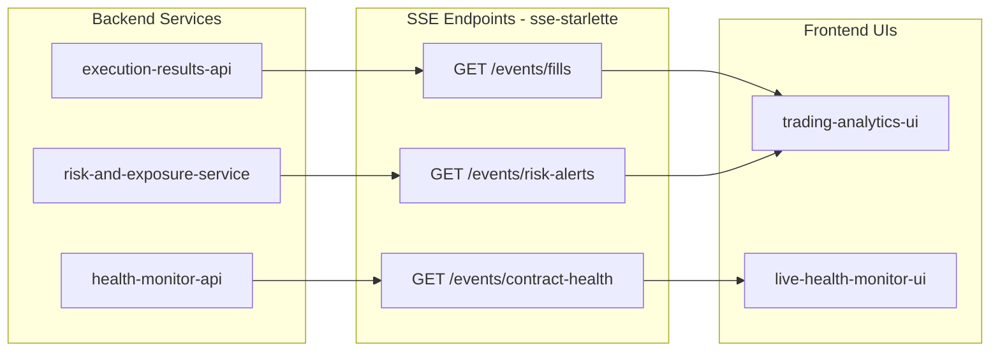

# End-to-End Completion Master Plan (v2)

## Carry-over (from previous plan — still pending)

- `canonical-swap-fix` — bump UIC patch version, reinstall in UMI
- `secret-manager-naming` — enforce canonical naming (see Part 1 below)
- `client-account-domain-model` — UIC Client/VenueAccount/Strategy schemas
- `mock-testing-framework` — unified-testing-library: ModelFactory + mock clients
- `e2e-smoke-tests` — offline smoke tests across all repos
- `pnl-attribution-complete` — factor decomposition (updated scope below)
- `risk-service-complete` — VaR, Greeks exposure, DeFi LTV, margin health
- `onboarding-ui-complete` — client wizard, API key CRUD, SM backend
- `ui-skeleton-assess` — scope remaining UI shells
- `sports-migration-batch1` / `sports-migration-batch2` — sports schemas + UMI adapters

---

## Part 1 — Secret Manager: Credentials Registry

### Machine-readable registry

File: `unified-trading-pm/credentials-registry.yaml`

Structure (no actual key values — just canonical names + status):

```yaml
market_data:
  - id: tardis-api-key
    status: confirmed         # confirmed | pending | not_available
    setup_guide: "Obtain from app.tardis.dev/account → API Keys. Run: gcloud secrets create tardis-api-key --data-file=- (pipe JSON)."
  - id: databento-api-key
    status: confirmed
    setup_guide: "From databento.com/dashboard → API Keys. Single API key covers all datasets."
  - id: alchemy-api-key
    status: confirmed
    setup_guide: "From alchemy.com → Apps → View Key. Use as single string (no secret)."
  - id: thegraph-api-key
    status: confirmed
    setup_guide: "From thegraph.com/studio → API Keys."
  - id: binance-market-data
    status: confirmed
    setup_guide: "Create read-only API key on binance.com → API Management. Store JSON {api_key, api_secret}."
  - id: okx-market-data
    status: confirmed
    setup_guide: "Create read-only key on okx.com → API → Create. Store JSON {api_key, api_secret, passphrase}."
  - id: deribit-market-data
    status: confirmed
    setup_guide: "Create read-only key at deribit.com → API Management."
  - id: bybit-market-data
    status: pending
    setup_guide: "Create read-only key on bybit.com → API → Create New Key."
  - id: hyperliquid-api-key
    status: pending
    setup_guide: "Hyperliquid uses wallet private key authentication. Generate via app.hyperliquid.xyz."
  - id: coinbase-market-data
    status: pending
    setup_guide: "Create viewer-only API key on coinbase.com → Settings → API."
  - id: betfair-api-key
    status: pending
    setup_guide: "Register at developer.betfair.com, create App Key (delayed data free; live data requires account funding)."
  - id: odds-api-key
    status: pending
    setup_guide: "Register at the-odds-api.com → API Keys."
  - id: api-football-key
    status: pending
    setup_guide: "Register at api-football.com → Dashboard → API Key."
  - id: footystats-api-key
    status: pending
    setup_guide: "Register at footystats.org/api → Get API Key."
  - id: soccer-football-info-api-key
    status: pending
    setup_guide: "Register at soccer-football-info.com → API → Key."
  - id: barchart-api-key
    status: not_available
    setup_guide: "Enterprise subscription at barchart.com. Contact sales."
  - id: fred-api-key
    status: pending
    setup_guide: "Free registration at fred.stlouisfed.org/docs/api/api_key.html."
  - id: open-meteo-api-key
    status: not_available
    setup_guide: "Open-Meteo public endpoints require no auth. Enterprise tier only for commercial SLA."

execution:
  - id: exec-odum-binance-futures
    client: odum
    venue: binance
    account_type: futures
    status: pending
    setup_guide: "Create trading API key on binance.com → API Management. Store JSON {api_key, api_secret, account_id, testnet: false}."
  - id: exec-odum-okx-futures
    client: odum
    venue: okx
    account_type: futures
    status: pending
    setup_guide: "Create trading key on okx.com → API. Requires passphrase. Store JSON {api_key, api_secret, passphrase}."
  - id: exec-odum-okx-spot
    client: odum
    venue: okx
    account_type: spot
    status: pending
    setup_guide: "Same as okx-futures but select spot permissions."
  - id: exec-odum-bybit-unified
    client: odum
    venue: bybit
    account_type: unified
    status: pending
    setup_guide: "Create API key on bybit.com → Account → API Management → Create. Select unified account."
  - id: exec-odum-deribit-options
    client: odum
    venue: deribit
    account_type: options
    status: pending
    setup_guide: "Create key on deribit.com → Settings → API Management."
  - id: exec-odum-deribit-futures
    client: odum
    venue: deribit
    account_type: futures
    status: pending
    setup_guide: "Same Deribit account key with futures permissions enabled."
  - id: exec-odum-hyperliquid-perp
    client: odum
    venue: hyperliquid
    account_type: perp
    status: pending
    setup_guide: "Hyperliquid uses wallet-based auth. Export wallet private key from app.hyperliquid.xyz."
  - id: exec-odum-coinbase-spot
    client: odum
    venue: coinbase
    account_type: spot
    status: pending
    setup_guide: "Create Advanced Trade API key on coinbase.com → Settings → API → New API Key."
  - id: exec-odum-ibkr-live
    client: odum
    venue: ibkr
    account_type: live
    status: pending
    setup_guide: "IBKR Gateway SSH login (one-time interactive). See infra/ibkr-gateway/FIRST_TIME_LOGIN.md. Config stored as {host, port: 4002, client_id}."
```

### Secret Manager upload script

Template in `market-tick-data-handler/scripts/setup-secret-manager.sh` — generalize to:
`unified-trading-pm/scripts/setup_secret.sh --project-id GCP_PROJECT_ID --name exec-odum-binance-futures --from-json credentials.json`

The script wraps: `gcloud secrets create {name} --data-file=-` with version rotation support.

Codex reference: `unified-trading-codex/02-data/secret-manager-naming.md` (pointer to credentials-registry.yaml, not the values themselves).

---

## Part 2 — Option Greeks as PnL + Risk Dimensions

### What exists

- `unified_internal_contracts/market_data/options_chain.py` — Greeks exist as market data (mid-chain Greeks per strike)
- **Missing**: `GreeksExposure` as a *position-level* aggregate (delta-equivalent notional, total gamma, etc.)
- **Missing**: Greeks dimension in `pnl-attribution-service`

### New schema: `unified_internal_contracts/positions/greeks.py`

```python
class GreeksExposure(BaseContractModel):
    schema_version: Literal["v1"] = "v1"
    instrument_key: str
    underlying: str                       # e.g. "BTC", "ETH"
    underlying_price: Decimal
    delta: Decimal                        # position-weighted delta (delta * quantity)
    gamma: Decimal
    theta: Decimal
    vega: Decimal
    rho: Optional[Decimal] = None
    delta_notional_usd: Decimal           # delta * underlying_price * quantity
    computed_at: datetime
```

### PnL dimensions (updated)

`pnl-attribution-service` breakdown must include:

```python
class PnLBreakdown(BaseContractModel):
    instrument_id: str
    instrument_type: str          # "PERP" | "SPOT" | "OPTION" | "FUTURE" | "LP" | "LENDING"
    underlying: str               # "BTC" | "ETH" | "BTC-ETH" for LP
    asset_class: str              # "CRYPTO_CEFI" | "CRYPTO_DEFI" | "TRADFI_EQUITY" | "TRADFI_BOND"
    client_id: str
    strategy_id: str
    account_id: str
    realized_pnl: Decimal
    unrealized_pnl: Decimal       # mark-to-market
    delta_pnl: Optional[Decimal]  # only for derivatives
    basis_pnl: Optional[Decimal]  # spot-perp basis
    funding_rate_pnl: Optional[Decimal]
    interest_rate_pnl: Optional[Decimal]
    greeks_delta_pnl: Optional[Decimal]   # option positions only
    greeks_gamma_pnl: Optional[Decimal]
    greeks_theta_pnl: Optional[Decimal]
    greeks_vega_pnl: Optional[Decimal]
    currency: str = "USD"
```

The `underlying`, `instrument_type`, `asset_class` are read from `InstrumentRecord` (already in reference data) — not duplicated.

---

## Part 3 — P0 Audit Items (Production Blockers)

### P0-1: execution-results-api — untyped returns

- File: `execution-results-api/` — replace `dict[str, Any]` at all API boundary returns with TypedDict or Pydantic models
- Pattern: Already have `EnhancedError` — use same model-first approach for success responses
- Specific locations: audit confirmed ~3 (not 50) — but all must be typed

### P0-2: ml-training-service bare except

- File: `ml-training-service/cli/main.py:212,218,299`
- Fix: Replace `except Exception: pass` with `except Exception as e: logger.error(..., exc_info=True); raise`

### P0-3: strategy-service live mode

- **Gap confirmed**: no `StreamDataSource`, no `BroadcastSink`
- Required seams (per batch-live-symmetry.mdc):
  - Live data source: subscribe to Pub/Sub market data topics
  - Live sink: publish strategy signals to Pub/Sub broadcast
- File to create: `strategy-service/strategy_service/adapters/live_data_source.py` (Pub/Sub subscriber)
- File to create: `strategy-service/strategy_service/adapters/broadcast_sink.py` (Pub/Sub publisher)
- Engine must remain mode-agnostic — only CLI handler switches seams

### P0-4: Consumer-Driven Contract (CDC) tests

- Directory: `unified-internal-contracts/tests/consumer_tests/`
- Pattern: for each producer→consumer pair, define a test that asserts the producer schema satisfies the consumer's minimum required fields
- Key pairs to cover: market-data-service → features-*, execution-service → pnl-attribution, strategy-service → execution-service
- Use `pytest-pact` or plain pytest with schema field assertions (not full Pact broker)

### P0-5: Skipped test in UMI

- File: `unified-market-interface/tests/` — locate `@pytest.mark.skip`, unskip by fixing the `api_contracts` package import (linked to `canonical-swap-fix`)

### P0-6: UI real-time push — SSE

- **Gap**: all 9 UIs are pure REST polling; live-health-monitor-ui and trading-analytics-ui are shells with empty `src/`
- **Solution**: Add SSE (Server-Sent Events) endpoints — simpler than WebSocket for server→client push
- Pattern for each service: `GET /events/stream` → `EventSourceResponse` (FastAPI + `sse-starlette`)
- Priority UIs for SSE:
  - `live-health-monitor-ui` → subscribe to contract health + lifecycle events
  - `trading-analytics-ui` → subscribe to execution fills + PnL updates
- Shell UIs to populate: `trading-analytics-ui/src/`, `logs-dashboard-ui/src/` — add placeholder pages with SSE client

---

## Part 4 — P1 Audit Items (Institutional Completeness)

### P1-7: VaR calculation contracts

- VaR schema EXISTS (needs validation for completeness) — verify it has: `confidence_level`, `time_horizon_days`, `method` (historical/parametric/monte_carlo), `portfolio_var_usd`
- Add to `risk-and-exposure-service` computation if missing

### P1-8: Greeks exposure for options positions

- Schema above (`GreeksExposure`) — add to `unified_internal_contracts/positions/`
- `risk-and-exposure-service` must compute aggregate portfolio Greeks (net delta, net gamma)

### P1-10/11/12: Feature contracts (drift, parity, staleness)

Three new schemas in `unified_internal_contracts/features/`:

```python
class FeatureStalenessConfig(BaseContractModel):
    feature_name: str
    max_age_seconds: int        # SLA: staleness threshold
    critical_age_seconds: int   # alert threshold

class FeatureDriftAlert(BaseContractModel):
    feature_name: str
    batch_value: float
    live_value: float
    drift_pct: float
    threshold_pct: float        # from FeatureStalenessConfig
    triggered_at: datetime

class FeatureParityReport(BaseContractModel):
    feature_name: str
    batch_schema_hash: str      # hash of feature output schema
    live_schema_hash: str
    schemas_match: bool
    checked_at: datetime
```

### P1-13: UIC py.typed marker

- Trivial: create empty file `unified-internal-contracts/unified_internal_contracts/py.typed`
- Add to `[tool.setuptools.package-data]` in `pyproject.toml`: `"unified_internal_contracts" = ["py.typed"]`

### P1-14: RebalanceInstruction contract

```python
# unified_internal_contracts/strategy/rebalance.py
class RebalanceInstruction(BaseContractModel):
    schema_version: Literal["v1"] = "v1"
    instruction_id: str
    strategy_id: str
    client_id: str
    rebalance_type: str           # "full" | "incremental" | "threshold_based"
    target_weights: dict[str, float]   # instrument_key -> weight
    deviation_threshold_pct: float
    execution_algo: Optional[str] = None  # "TWAP" | "VWAP" | None
    triggered_at: datetime
```

### P1-15: Domain events schema validation in strategy-service

- File: `strategy-service/strategy_service/domain_events.py`
- Fix: wrap all domain event constructors in Pydantic model validation (use `model_validate`)

### P1-16: UIC test coverage floor

- `unified-internal-contracts/pyproject.toml` — raise `fail_under` from 35 to 80
- Add missing tests for: `client/`, `features/`, `regulatory/`, `positions/greeks.py`

### P1-17: IBKR corporate actions stub

- `unified-reference-data-interface/adapters/ibkr.py` — implement `fetch_corporate_actions()` using `ib_insync.CorporateAction`
- Mark as `PENDING_CASSETTE_AWAITING_AUTH` in endpoint registry

### P1-18: EOD settlement contract

```python
# unified_internal_contracts/settlement/eod.py
class EODSettlementTrigger(BaseContractModel):
    trigger_type: str         # "scheduled" | "manual"
    settlement_date: date
    venues: list[str]
    triggered_at: datetime
    triggered_by: str
```

Pub/Sub topic: `EOD_SETTLEMENT` (add to `unified_internal_contracts/pubsub.py`)

### P1-19: Circuit breaker state change event

- Topic constant exists in `pubsub.py` but no schema
- Add to `unified_internal_contracts/events/circuit_breaker.py`:

```python
class CircuitBreakerEvent(BaseContractModel):
    trigger: str              # "drawdown_limit" | "pnl_limit" | "position_limit" | "api_error_rate"
    state: str                # "OPEN" | "CLOSED" | "HALF_OPEN"
    strategy_id: Optional[str]
    venue: Optional[str]
    threshold_value: float
    observed_value: float
    triggered_at: datetime
```

### P1-20: ML training contracts

```python
# unified_internal_contracts/ml/training.py
class CrossValidationResult(BaseContractModel):
    model_id: str
    n_folds: int
    metric: str               # "sharpe" | "accuracy" | "log_loss"
    mean_score: float
    std_score: float
    fold_scores: list[float]
    trained_at: datetime

class ModelDegradationAlert(BaseContractModel):
    model_id: str
    metric: str
    baseline_score: float
    current_score: float
    degradation_pct: float
    alert_threshold_pct: float
    detected_at: datetime
```

---

## Part 5 — P2 Audit Items (Quality / Cleanup)

### P2-21: api-contracts dual structure

- `api-contracts/api_contracts/` has: `api_contracts_external/` + top-level dirs (`fix/`, `internal/`, `regulatory/`, etc.)
- Plan: consolidate — all external venue schemas live under `api_contracts_external/`, internal schemas migrate to UIC. Document migration plan in codex.
- Immediate: ensure `__init__.py` re-exports don't create two import paths for same schema

### P2-22: MiFID II / EMIR stubs → production-ready

- Already in previous plan — ensure regulatory schemas include all mandatory fields per regulation text

### P2-23: TradFi DATABENTO_ONLY tagging

- `instruments-service`: add `data_source_constraint: Optional[str]` to `InstrumentRecord` — set `"DATABENTO_ONLY"` for all Trad-Fi instruments
- Ensures dependency is visible in data and not just assumed

### P2-24: Prime broker contracts (partially done — `prime_broker/` dir exists)

- Verify `api-contracts/api_contracts/prime_broker/` has schemas for HiddenRoad and Talos
- If stubs only: add `PrimeBrokerFill`, `PrimeBrokerMarginReport` schemas

### P2-25: features-onchain per-protocol validation

- `features-onchain-service/features_onchain_service/schemas/` — add protocol-discriminated schemas
- One `FeatureOutput` subclass per protocol: `AaveFeatureOutput`, `UniswapV3FeatureOutput`, `CurveFeatureOutput`

### P2-26: api-contracts coverage 70% → 90%

- `api-contracts/pyproject.toml` — raise `fail_under` to 90

### P2-27: Deprecated WITHDRAW + signal_id in unified-domain-client

- `unified-domain-client/` — remove `WITHDRAW` instruction type; remove `signal_id` field
- Delete deprecated code per delete-deprecated.mdc (no parallel code paths)

### P2-28: Portfolio-level contracts

```python
# unified_internal_contracts/risk/portfolio.py
class PortfolioVaR(BaseContractModel):
    client_id: str
    confidence_level: float   # 0.95 | 0.99
    time_horizon_days: int
    portfolio_var_usd: Decimal
    component_vars: dict[str, Decimal]   # instrument_key -> VaR contribution
    correlation_matrix_hash: str
    computed_at: datetime

class PortfolioAllocation(BaseContractModel):
    client_id: str
    strategy_id: str
    target_weights: dict[str, float]
    actual_weights: dict[str, float]
    rebalance_required: bool
    max_deviation_pct: float
```

### P2-29: Model prediction drift contracts

```python
# unified_internal_contracts/ml/drift.py
class PredictionDriftAlert(BaseContractModel):
    model_id: str
    feature_name: str
    distribution_shift_score: float    # e.g. KL divergence
    confidence_calibration_score: float
    alert_threshold: float
    detected_at: datetime
```

### P2-30: features-onchain per-chain data freshness

```python
# unified_internal_contracts/features/onchain_freshness.py
class OnchainDataFreshnessConfig(BaseContractModel):
    chain: str                          # "ethereum" | "arbitrum" | "base"
    max_block_lag: int                  # acceptable lag in blocks
    max_age_seconds: int
    alert_on_lag: bool = True
```

---

## Part 6 — PnL Attribution (Updated Scope)

The existing `pnl-attribution-service` models execution alpha only. Full scope:

- Delta PnL = underlying price change × delta exposure
- Basis PnL = spot-perp basis movement × position size
- Funding Rate PnL = funding rate × position size × time
- Interest Rate PnL = borrow/lend rate × notional × time
- Greeks PnL (options) = delta PnL + gamma PnL (½ × gamma × ΔS²) + theta PnL (theta × Δt) + vega PnL
- Mark-to-Market change vs Realized PnL (cash)
- Dimensions: client_id → strategy_id → account_id → instrument_id → underlying → asset_class

All dimensions available from `InstrumentRecord` — no duplication needed.

---

## Part 7 — UI Real-Time Push Architecture




- Add `sse-starlette` dependency to relevant service `pyproject.toml` files
- React SSE client: `const source = new EventSource('/events/fills')` — no library needed
- Shell UIs to populate: `trading-analytics-ui/src/App.tsx`, `logs-dashboard-ui/src/App.tsx` — at minimum an SSE-connected live feed table

---

## Key Files by Area

- Credentials registry: `unified-trading-pm/credentials-registry.yaml`
- Secret setup script: `unified-trading-pm/scripts/setup_secret.sh`
- Greeks position schema: `unified-internal-contracts/unified_internal_contracts/positions/greeks.py`
- PnL breakdown schema: `unified-internal-contracts/unified_internal_contracts/pnl/breakdown.py`
- Strategy live seams: `strategy-service/strategy_service/adapters/live_data_source.py` + `broadcast_sink.py`
- Feature contracts: `unified-internal-contracts/unified_internal_contracts/features/`
- ML contracts: `unified-internal-contracts/unified_internal_contracts/ml/`
- Portfolio risk: `unified-internal-contracts/unified_internal_contracts/risk/portfolio.py`
- Circuit breaker: `unified-internal-contracts/unified_internal_contracts/events/circuit_breaker.py`
- EOD settlement: `unified-internal-contracts/unified_internal_contracts/settlement/eod.py`
- Rebalance: `unified-internal-contracts/unified_internal_contracts/strategy/rebalance.py`
- Onchain freshness: `unified-internal-contracts/unified_internal_contracts/features/onchain_freshness.py`
- UIC py.typed: `unified-internal-contracts/unified_internal_contracts/py.typed`
- Codex: `unified-trading-codex/02-data/secret-manager-naming.md`, `unified-trading-codex/04-architecture/exit-algo-architecture.md`
