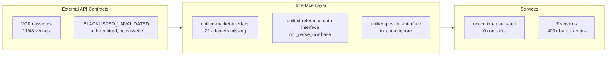

# Schema Contract Validation Coverage

## Current State (from audit)

- VCR coverage: 23% (11/48 venues) — 37 venues have schemas, zero cassettes
- 23 venue schemas have no UMI adapter consuming them
- `execution-results-api`: zero UIC imports, zero log_events, zero EnhancedError
- `execution-service`: 201 bare excepts, 108 `dict[str,Any]`, 0 EnhancedError
- `market-tick-data-handler`: 48 bare excepts, 0 EnhancedError
- 12 `NotImplementedError` stubs in UMI adapters
- URDI has no abstract `_parse_raw()` — all 10 adapters bypass contract validation at ingest
- `unified-position-interface` is in `.cursorignore` — invisible to quality gates

## Architecture

## Batch 1 — Independent, highest value (4 parallel agents)

**A: VCR cassettes for 8 public/no-auth venues**

- Venues: `kalshi`, `polymarket`, `thegraph`, `defillama`, `barchart`, `open_meteo`, `upbit`, `fear_greed`
- Each: mock YAML cassette + `tests/vcr/test_{venue}_vcr.py` replay test
- File: `api-contracts/api_contracts/api_contracts_external/{venue}/mocks/*.yaml`
- File: `api-contracts/tests/vcr/test_{venue}_vcr.py`
- Raises coverage from 23% → ~39%

**B: `endpoint_registry.py` — add `BLACKLISTED_UNVALIDATED` status**

- File: `api-contracts/api_contracts/api_contracts_external/endpoint_registry.py`
- Add `BLACKLISTED_UNVALIDATED = "BLACKLISTED_UNVALIDATED"` to `EndpointStatus` enum
- Mark all 22 auth-required venues with `status=BLACKLISTED_UNVALIDATED, reason="auth_required_no_cassette"`
- Venues: binance WS private, okx private, bybit private, hyperliquid private, tardis (all), databento (all), deribit private, coinbase private, ibkr (all), ccxt (venue-dependent), api_football, arkham, aster, glassnode, footystats, soccer_football_info, odds_api, pinnacle, mev, ofr, openbb + github (BLACKLISTED_NOT_MARKET_DATA)

**C: URDI `_parse_raw` + 12 UMI `NotImplementedError` stubs**

- File: `unified-reference-data-interface/unified_reference_data_interface/base_adapter.py` — add abstract `_parse_raw(raw, schema_class) -> BaseModel`; failure raises `EnhancedError` + `log_event("INSTRUMENT_SCHEMA_VIOLATION")`
- UMI stubs to implement: `coinbase` (normalize_ohlcv, normalize_liquidation), `databento_adapter` (normalize_derivative_ticker, normalize_liquidation), `tardis_adapter` (normalize_ohlcv), `aster_adapter` (full suite from 27 schema models)

**D: `execution-results-api` — full contract adoption**

- Add `unified-internal-contracts>=1.0.0` to `execution-results-api/pyproject.toml`
- All exception handlers → `EnhancedError(category=..., correlation_id=str(uuid4()))`
- Add `log_event("STARTED")` / `log_event("STOPPED")` / `log_event("FAILED")` lifecycle events
- Replace any `dict[str, object]` response shapes with typed Pydantic models from UIC

## Batch 2 — New adapters in 3 groups (4 parallel agents)

**E: New UMI adapters group 1** (public/no-auth → VCR testable immediately)

- `adapters/prediction/kalshi_adapter.py` — REST, normalize to `CanonicalOdds`
- `adapters/prediction/polymarket_adapter.py` — REST, normalize to `CanonicalOdds`
- `adapters/defi/defillama_adapter.py` — REST, normalize to `CanonicalLiquidityPool`
- `adapters/alt_data/fear_greed_adapter.py` — REST, normalize to alt data schema

**F: New UMI adapters group 2** (auth-required, mark BLACKLISTED_UNVALIDATED)

- `adapters/cefi/aster_adapter.py` — 27 models in schema, needs full normalizer suite
- `adapters/cefi/upbit_adapter.py` — normalize_trade, normalize_orderbook
- `adapters/sports/odds_api_adapter.py` — normalize to `CanonicalOdds`
- `adapters/sports/pinnacle_adapter.py` — normalize to `CanonicalOdds`
- `adapters/onchain/glassnode_adapter.py` — normalize to onchain metrics schema
- `adapters/onchain/arkham_adapter.py` — normalize to onchain flow schema

**G: New UMI adapters group 3** (TradFi + Alt Data)

- `adapters/tradfi/ibkr_adapter.py` — reuse URDI ibkr adapter pattern, normalize_trade + normalize_ohlcv
- `adapters/tradfi/fred_adapter.py` — normalize to `CanonicalYieldCurve`
- `adapters/tradfi/ecb_adapter.py` — normalize to `CanonicalYieldCurve`
- `adapters/tradfi/ofr_adapter.py` — normalize to risk-free rate schema
- `adapters/tradfi/openbb_adapter.py` — normalize to `CanonicalBondData`
- `adapters/tradfi/yahoo_finance_adapter.py` — normalize_trade + normalize_ohlcv
- `adapters/alt_data/api_football_adapter.py` — normalize to football match schema
- `adapters/alt_data/footystats_adapter.py` — normalize to football stats schema
- `adapters/alt_data/soccer_football_adapter.py` — normalize to football match schema
- `adapters/onchain/mev_adapter.py` — normalize to MEV event schema
- Delete empty `api-contracts/api_contracts/api_contracts_external/defi/schemas.py`
- BLACKLIST `github` as `BLACKLISTED_NOT_MARKET_DATA`

**H: EnhancedError rollout — highest bare-except services**

- `execution-service` (201 bare excepts): wrap with `EnhancedError(category=SERVER_ERROR, correlation_id=uuid4())`
- `instruments-service` (62): same pattern
- `market-tick-data-handler` (48): same + add `log_event` on failures

## Batch 3 — Cleanup (2 parallel agents)

**I: Remaining EnhancedError rollout + position interface**

- `features-delta-one-service` (20), `features-onchain-service` (13), `features-volatility-service` (12)
- Remove `unified-position-interface` from `.cursorignore`
- Verify quality gates pass for UPI after making it visible

**J: Quality gates + VCR test runner verification**

- Run `cd api-contracts && bash scripts/quality-gates.sh --no-fix` to confirm all new VCR tests pass
- Run `cd unified-market-interface && bash scripts/quality-gates.sh --no-fix` to confirm new adapters pass
- Run `cd unified-reference-data-interface && bash scripts/quality-gates.sh --no-fix`

## Files Summary

- CREATE: ~30 new adapter files in `unified-market-interface/unified_market_interface/adapters/`
- CREATE: ~16 VCR cassette YAMLs + 8 test files in `api-contracts/tests/vcr/`
- MODIFY: `api-contracts/.../endpoint_registry.py` — new status enum + 22 endpoint entries
- MODIFY: `unified-reference-data-interface/.../base_adapter.py` — abstract `_parse_raw`
- MODIFY: `execution-results-api/` — UIC adoption
- MODIFY: 7 service repos — replace bare excepts with `EnhancedError`
- MODIFY: `.cursorignore` — remove unified-position-interface
- DELETE: `api-contracts/api_contracts/api_contracts_external/defi/schemas.py` (empty)
