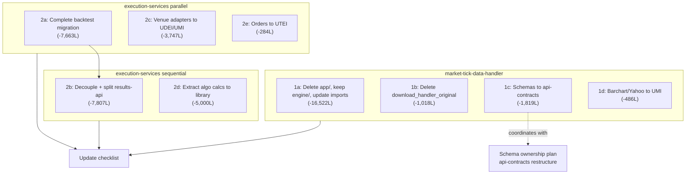

# Service Bloat Extraction Plan (Revised)

## Root Causes

Both services are large for three reasons: **identical directory duplication**, **library code living in service code**, and **an embedded separate service** (execution-results-api inside execution-services).

| Service                  | Total reported | Tests | Scripts | Embedded service | Real source | Recoverable |
| ------------------------ | -------------- | ----- | ------- | ---------------- | ----------- | ----------- |
| execution-services       | ~122k          | ~41k  | ~12k    | ~7.8k            | ~61k        | ~25-28k     |
| market-tick-data-handler | ~30k source    | —     | ~6.6k   | —                | ~24k        | ~19.8k      |

Note: The earlier "72k" for market-tick was inflated by tests. Real non-test source is ~30k, of which ~19.8k is recoverable.

---

## Part 1: market-tick-data-handler

### 1a. Delete `app/` directory, keep `engine/`, update all imports — saves ~16,522 lines

Verified via diff: `app/` and `engine/` are **identical copies**. `engine/` is the better name — a data handler service has an engine, not an "app". Delete `app/` entirely and update all imports from `app.*` to `engine.*`.

Key duplicate pairs:

- `engine/orchestrators/parallel_download_orchestrator.py` == `app/core/orchestrators/parallel_download_orchestrator.py` (721 lines each)
- `engine/validation/validation_service.py` == `app/core/validation_service.py` (1,210 lines each)
- `engine/venues/tardis/tardis_client.py` == `app/venues/tardis/tardis_client.py` (531 lines each)

### 1b. Delete `cli/handlers/download_handler_original.py` — saves 1,018 lines

Explicitly deprecated. Active handler is `download_handler.py`. Delete.

### 1c. Move raw provider schemas to `api-contracts` — saves ~1,819 lines

These are raw third-party API response schemas. Per the schema ownership plan ([schema_ownership_three_tiers_267ab636.plan.md](.cursor/plans/schema_ownership_three_tiers_267ab636.plan.md)), they belong in `api_contracts_external/` (raw provider schemas):

- `[market_data_tick_handler/schemas/data_providers/databento_schema.py](market-tick-data-handler/market_data_tick_handler/schemas/data_providers/databento_schema.py)` — 419 lines → `api-contracts/api_contracts_external/databento/`
- `[market_data_tick_handler/schemas/data_providers/defi_schema.py](market-tick-data-handler/market_data_tick_handler/schemas/data_providers/defi_schema.py)` — 599 lines → `api-contracts/api_contracts_external/defi/`
- `[market_data_tick_handler/models/nautilus_schema.py](market-tick-data-handler/market_data_tick_handler/models/nautilus_schema.py)` — 821 lines → `api-contracts/api_contracts_external/nautilus/` (NautilusTrader canonical format, cross-service concern)

Precedent: `tardis_schema.py` already re-exports from `api-contracts`. Apply same pattern for the remaining three.

### 1d. Migrate Barchart + Yahoo Finance venue clients to `unified-market-interface` — saves ~486 lines

- `[app/venues/barchart/barchart_csv_client.py](market-tick-data-handler/market_data_tick_handler/app/venues/barchart/barchart_csv_client.py)` — 341 lines
- `[app/venues/yahoo_finance/yahoo_finance_client.py](market-tick-data-handler/market_data_tick_handler/app/venues/yahoo_finance/yahoo_finance_client.py)` — 145 lines

Venue connectivity belongs in `unified-market-interface/unified_market_interface/venues/`. Service imports from there instead.

**market-tick total: ~19,845 lines removed from ~30,121 source = 66% reduction → ~10,276 lines remaining**

---

## Part 2: execution-services

### 2a. Complete the `backtest/` → `engine/backtest/` migration — saves ~7,663 lines

These are NOT identical. `engine/backtest/` is a genuine architectural improvement:

- Old `backtest/`: signal-driven, monolithic `engine.py` (2,826 lines), defensive `return 0.0` on errors
- New `engine/backtest/`: instruction-driven, split into `engine/core.py + setup.py + execution.py + results.py`, fail-fast validation, 14 new files

The migration is half-done. `domain_runners.py` already uses the new path. Legacy code still imports from `backtest/`.

**28 files need import updates** (full list from audit):

Critical files:

- `[execution_services/__init__.py](execution-services/execution_services/__init__.py)` — exports `BacktestEngine`, `StrategyEvaluator`, `SignalDrivenStrategyV3`
- `[execution_services/cli/backtest.py](execution-services/execution_services/cli/backtest.py)` — 3 import sites
- `[execution_services/cli/benchmark_compare.py](execution-services/execution_services/cli/benchmark_compare.py)`
- `[execution_services/results/extractor.py](execution-services/execution_services/results/extractor.py)`
- `[scripts/runners/run_tradfi_l1_l2_backtests.py](execution-services/scripts/runners/run_tradfi_l1_l2_backtests.py)`
- `[scripts/runners/run_defi_backtests.py](execution-services/scripts/runners/run_defi_backtests.py)`
- All test files referencing `execution_services.backtest.*`

Class renames required: `SignalDrivenStrategyV3` → `InstructionDrivenStrategyV3`, `SignalDrivenV3Config` → `InstructionDrivenV3Config`.

After all imports updated and verified: delete `execution_services/backtest/` entirely.

### 2b. Split `visualizer-api/` into new repo `execution-results-api` — saves ~7,807 lines from execution-services

`visualizer-api/` already has its own `pyproject.toml` (package: `backtest-visualizer-api`) and `Dockerfile`. It is a standalone FastAPI service accidentally living inside this repo.

**Rename to `execution-results-api`** — it serves computed results and analysis, not UI-specific visualization. Package: `execution_results_api`.

**Clean boundary confirmed by audit:**

What moves to new repo:

- All of `visualizer-api/app/` — routes, services, models for results, analysis, data browsing
- Read-only GCS access (already uses `unified_trading_services.get_storage_client()`)
- Analysis aggregations on computed results

What stays in execution-services:

- Backtest engine and CLI (`execution_services.cli.backtest`) — computation stays here
- `config/grid_generator.py` — config generation stays here
- `utils/dependency_checker.py` — pre-flight stays here
- All GCS write paths and result serialization

**Decoupling required before split** (the API currently imports 5 things from execution_services):

| Current coupling                                       | Decouple to                                              |
| ------------------------------------------------------ | -------------------------------------------------------- |
| `get_execution_config()`                               | env vars / `unified_config_interface`                    |
| `GCSConfig`                                            | `unified_trading_services.get_storage_client()` directly |
| `config.grid_generator` imports                        | HTTP endpoint on execution-services                      |
| `DependencyChecker`                                    | HTTP endpoint on execution-services                      |
| Subprocess `python -m execution_services.cli.backtest` | HTTP API call to execution-services                      |

New repo follows the full setup checklist from the schema ownership plan: `pyproject.toml`, `quality-gates.sh`, `quickmerge.sh`, `Dockerfile`, `workspace-manifest.json` entry.

Do **after 2a** — `cli/backtest.py` is imported by the API, so the backtest migration must complete first.

### 2c. Migrate `venues/` to `unified-defi-execution-interface` / `unified-market-interface` — saves ~3,747 lines

`[execution_services/venues/](execution-services/execution_services/venues/)` contains full venue adapter implementations:

CeFi (→ `unified-market-interface`):

- `deribit.py` — 1,282 lines

DeFi protocols (→ `unified-defi-execution-interface`):

- `uniswap.py` — 271 lines, `aave.py` — 373 lines, `morpho.py` — 328 lines
- `hyperliquid.py` — 261 lines, `etherfi.py` — 230 lines, `lido.py` — 227 lines

Shared infrastructure (→ whichever library owns the base):

- `base.py` — 218 lines, `base_connector.py` — 142 lines, `registry.py` — 159 lines, `initializer.py` — 255 lines

After migration: service calls `get_venue_adapter("deribit")` from the interface library.

### 2d. Extract pure calculation logic from `algorithms/impl/` into `execution-algo-library` — saves ~5,000 lines

**These are NOT the same thing.** The service has NautilusTrader `ExecAlgorithm` subclasses. The library has pure calculation logic. Both are needed — but better separated.

**AlmgrenChriss already shows the correct target pattern:**

- Library: `AlmgrenChrissCalculator` — pure maths (133 lines)
- Service: `AlmgrenChrissExecAlgorithm` — NautilusTrader adapter calling the calculator

**Apply same pattern to TWAP, VWAP, PassiveAggressive:**

- Extract scheduling/calculation methods (e.g. `_calculate_slices()`, `_calculate_timing()`, `_calculate_volume_weights()`) → `TWAPCalculator`, `VWAPCalculator` in library
- Service algorithms keep only: NautilusTrader lifecycle hooks (`on_order`, `on_order_accepted`, `on_order_filled`, `on_stop`), order placement (`spawn_market`, `spawn_limit`), market data access (`self.cache`)

This makes the library more complete and testable (no NautilusTrader dependency needed to test calculation logic), while the service becomes a thin integration layer.

**Net effect:**

- `algorithms/impl/`: ~7,009 lines → ~2,000 lines (NautilusTrader wrappers only)
- `execution-algo-library`: gains ~2,500 lines of richer, tested calculation logic
- Service saves: ~5,000 lines

### 2f. Delete duplicate `BaseConnector` from venues/ — saves ~142 lines

`execution_services/venues/base_connector.py` duplicates the `BaseConnector` ABC that already lives in `unified-defi-execution-interface`. The DeFi connectors in the service should import `BaseConnector` from `unified_defi_execution_interface`. Delete the service copy.

### 2e. Migrate `orders/` to `unified-trade-execution-interface` — saves ~284 lines

`[execution_services/orders/](execution-services/execution_services/orders/)` — 284 lines. Library already has `UnifiedOrderManager` protocol and `OrderTracker`. Direct migration.

---

---

## NautilusTrader Architecture Decision (Scan Complete)

**Question**: Can we use NautilusTrader algos across DeFi, sports betting, and swaps? Is it worth depending on if we have to rebuild our own anyway?

**Scan findings:**

NautilusTrader v1.221.0 includes built-in adapters for: Binance, Bybit, OKX, Coinbase, BitMEX, dYdX, Hyperliquid, Interactive Brokers, **Betfair (sports)**, Polymarket, Databento, Tardis.

| Domain                                 | NautilusTrader support                                   | Current usage                               | Verdict                                     |
| -------------------------------------- | -------------------------------------------------------- | ------------------------------------------- | ------------------------------------------- |
| CeFi order books (Binance, OKX, Bybit) | Native adapters                                          | `BacktestNode` + `TradingNode`              | Keep — full support                         |
| Sports betting (Betfair)               | **Native Betfair adapter exists**                        | None yet                                    | Use it — saves building our own             |
| DeFi/DEX (Uniswap, Aave, Morpho)       | **None**                                                 | `BaseConnector` pattern (bypasses Nautilus) | Don't force it — fundamentally incompatible |
| DeFi CLOB (Hyperliquid, Aster)         | Compatible (CLOB protocol, maps to NautilusTrader model) | `BacktestNode`                              | Use it                                      |

**Why DeFi DEX/AMM cannot use NautilusTrader:**

- NautilusTrader's `ExecAlgorithm` is CLOB-only: `spawn_market()`, `spawn_limit()`, orderbook depth, bid/ask spreads
- AMMs have no orderbook — execution is a pool state function (reserve ratios, slippage curves)
- Gas estimation, price impact, flash loans, atomic bundles have no Nautilus equivalent
- Your `SwapTWAPAlgorithm` and `SmartOrderRouter` in `execution-algo-library` already model this correctly

**Why NautilusTrader IS worth keeping:**

- Rust core = genuinely fast (nanosecond timestamps, zero-copy data)
- Backtest engine (`BacktestNode`) works for ALL domains — you already use it for DeFi backtests too (via `DEXFillModel`)
- 13 production venue adapters you don't have to maintain
- `ExecAlgorithm` lifecycle hooks (fills, partial fills, cancels) are complete infrastructure for CLOB algos
- Betfair adapter means sports betting comes for free

**Decision: Hybrid architecture (already partially correct):**

- NautilusTrader for: CeFi + sports betting live execution, backtesting ALL domains
- Custom `BaseConnector` (from `unified-defi-execution-interface`) for: DeFi DEX/AMM live execution
- Algorithm split: CeFi TWAP/VWAP = `ExecAlgorithm` subclasses; DeFi SWAP-TWAP = standalone (gas-aware, pool-aware)

**Impact on this extraction plan:**

- Task 2d algorithm extraction follows this split — CeFi algorithms thin-wrap Nautilus, DeFi algorithms are standalone library classes
- Task 2c venue migration is per domain: Deribit → `unified-market-interface` (wraps Nautilus), DeFi → `unified-defi-execution-interface`
- Sports betting (`execution-services` future): use Nautilus Betfair adapter, no custom connector needed

---

## Sequencing

**Order**:

1. All market-tick items are independent — run in parallel
2. `2a` (backtest migration) must complete before `2b` (results-api split) — API imports `cli/backtest.py`
3. `2c`, `2e` are independent — run in parallel with `2a`
4. `2d` (algorithms) last — needs library-side additions before service simplification
5. Schema moves (1c) should coordinate with the schema ownership plan on destination paths (`api_contracts_external/`)

---

## Revised Line Count Estimates

| Item                                      | Lines removed from service | Lines added to library | Risk        |
| ----------------------------------------- | -------------------------- | ---------------------- | ----------- |
| market-tick: Delete engine/ duplicate     | 16,522                     | —                      | Low         |
| market-tick: Delete deprecated handler    | 1,018                      | —                      | Low         |
| market-tick: Schemas to api-contracts     | 1,819                      | +1,819 api-contracts   | Low         |
| market-tick: Barchart/Yahoo to UMI        | 486                        | +486 UMI               | Low         |
| execution: Complete backtest migration    | 7,663                      | —                      | Medium      |
| execution: Split results-api to new repo  | 7,807                      | → new repo             | Medium      |
| execution: Venue adapters to UDEI/UMI     | 3,747                      | +3,747 to libs         | Medium      |
| execution: Extract algo calcs to library  | ~5,000                     | +2,500 exec-algo-lib   | Medium-High |
| execution: Orders to UTEI                 | 284                        | +284 UTEI              | Low         |
| execution: Delete duplicate BaseConnector | 142                        | —                      | Low         |
| **Total removed from 2 services**         | **~44,488 lines**          |                        |             |

**After this work:**

- market-tick-data-handler: ~30k source → ~10k (67% reduction)
- execution-services: ~61k source → ~37k (39% reduction; results API + its tests move to new repo)
- **~44,000 lines removed** from these two services alone
