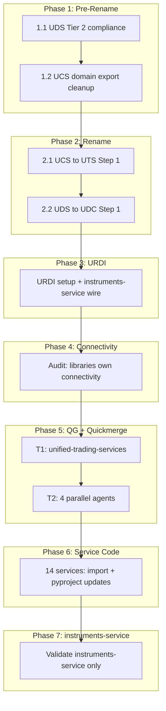

# Tier 1 and Tier 2 Library Hardening — Aggregated Plan

## Context

This plan aggregates [library_foundation.plan.md](unified-trading-pm/plans/ai/library_foundation.plan.md), [library_ecosystem.plan.md](unified-trading-pm/plans/ai/library_ecosystem.plan.md), and [standards_enforcement.plan.md](unified-trading-pm/plans/ai/standards_enforcement.plan.md) to focus on Tier 1 and Tier 2 libraries. Per the dependency diagram:

- **Tier 1**: unified-trading-services (renamed from unified-trading-services) — service runtime, ConfigStore, GCSEventSink, setup_service
- **Tier 2**: unified-domain-client, unified-market-interface, unified-trade-execution-interface, unified-ml-interface, unified-feature-calculator-library, unified-position-interface, unified-reference-data-interface

**Architecture principle**: Services route to domain clients; they do NOT hold connectivity, API keys, secrets, or endpoint URLs. Libraries (UDC, UMI, UTEI, URDI) own all connectivity.

---

## UDC Responsibility Model (unified-domain-client)

**UDC is the single abstraction for domain data read and write.** Services get domain data from UDC; they never touch storage, cloud provider, or paths directly.

| UDC does                                                                                                                         | UDC does NOT                                                                       |
| -------------------------------------------------------------------------------------------------------------------------------- | ---------------------------------------------------------------------------------- |
| **Read** domain data (instruments, market data, features, execution records, etc.) from GCS/BigQuery or another service's output | Hold **connectivity details**: API keys, secrets, endpoint URLs to external venues |
| **Write** domain data to its own storage (e.g. instruments-service dumps to GCS via UDC)                                         | Expose cloud provider, bucket names, or paths to services                          |
| Hold **routing config** (CloudTarget: project_id, bucket, dataset) — "where does this domain live"                               | Let services care about "which cloud or R" — services are oblivious                |
| Delegate actual I/O to UCLI (StorageClient, BigQuery) — credentials come from ADC/env                                            |                                                                                    |

**Service view**: "Give me instruments for venue X" or "Write this to domain Y." The service does not know or care about GCP vs AWS, bucket names, or paths. UDC encapsulates all of that.

**Data flow**:

- **Read**: Service → UDC (InstrumentsDomainClient.get_instruments) → UDC uses CloudTarget + UCLI → reads from GCS/BigQuery (data written by another service or pre-populated)
- **Write**: Service → UDC (StandardizedDomainCloudService.upload_to_gcs) → UDC uses CloudTarget + UCLI → writes to domain storage

**Connectivity to external venues** (Tardis, Databento, exchange APIs) lives in UMI, UTEI, URDI — not in UDC. UDC is for **domain data storage** (read/write to our own GCS/BigQuery), not for calling external APIs.

---

## Current State (from exploration)

| Component                             | Status                                                                                                                                  |
| ------------------------------------- | --------------------------------------------------------------------------------------------------------------------------------------- |
| **unified-trading-services**          | Delegates to UCLI; domain/ package empty; `create_instruments_client` in **all** but not defined                                        |
| **unified-domain-client**             | Has `StandardizedDomainCloudService` in own package; imports from UCS (CloudTarget, get_config, market_category) — violates Tier 2 rule |
| **unified-market-interface**          | Holds API keys + URLs in config (correct — connectivity in library)                                                                     |
| **unified-trade-execution-interface** | Keys passed in; config has no secrets (correct)                                                                                         |
| **unified-reference-data-interface**  | Exists; REST-only reference data                                                                                                        |
| **instruments-service**               | Uses UMI adapters; no direct REST                                                                                                       |

**Critical gap**: UDS still imports from UCS (CloudTarget, get_config, market_category). Per Plan 2, UDS must depend only on api-contracts + UCLI.

---

## Phase 1: Pre-Rename Fixes (Blocking)

### 1.1 Fix UDS Tier 2 Compliance

**Goal**: UDS must import only from api-contracts + unified-cloud-interface.

**Changes**:

- [unified-domain-client/unified_domain_client/cloud_data_provider.py](unified-domain-client/unified_domain_client/cloud_data_provider.py): Replace `CloudTarget`, `get_config`, `unified_config`, `market_category` imports from UCS with UCLI equivalents or local types
- [unified-domain-client/unified_domain_client/clients.py](unified-domain-client/unified_domain_client/clients.py): Replace `CloudTarget` import from `unified_trading_services.core.cloud_config` with `unified_cloud_interface`
- [unified-domain-client/unified_domain_client/standardized_service.py](unified-domain-client/unified_domain_client/standardized_service.py): Replace any UCS imports with UCLI
- Update [unified-domain-client/pyproject.toml](unified-domain-client/pyproject.toml): Remove `unified-trading-services`; add `unified-cloud-interface>=1.0.0,<2.0.0` if not present

**Reference**: Plan 2 pr-f-tier2-migration; Plan 1 PR D UDS cleanup

### 1.2 Fix UCS Domain Exports (Plan 1 post-d)

**Goal**: Remove domain exports from UCS **init**.py so services use UDS directly.

**Changes**:

- [unified-trading-services/unified_trading_services/**init**.py](unified-trading-services/unified_trading_services/__init__.py): Remove `create_instruments_client`, `create_market_candle_data_client`, etc. from **all** if not defined; remove any `StandardizedDomainCloudService` re-export
- Ensure services import `InstrumentsDomainClient`, `create_instruments_client` from `unified_domain_client` only

---

## Phase 2: Rename (Package, Repo, Image, All Consumers)

### 2.1 unified-trading-services → unified-trading-services (Tier 1)

**Step 1** (single PR):

- Add `unified_trading_services/` package that re-exports from `unified_trading_services` (backward compat)
- Update [unified-trading-services/pyproject.toml](unified-trading-services/pyproject.toml): Add `[tool.hatch.build.targets.wheel]` or equivalent to publish both package names
- Update [unified-trading-pm/workspace-manifest.json](unified-trading-pm/workspace-manifest.json): Add `unified-trading-services` entry; mark `unified-trading-services` as deprecated alias
- Update Cloud Build image names: `unified-trading-services` (or keep `unified-trading-services` for now; image rename in Step 2)
- Update error messages in UCI (base_config.py, loaders.py, secrets.py): "Use unified_trading_services.get_secret_client()" instead of unified_trading_services
- Update [.cursor/rules/event-logging.mdc](.cursor/rules/event-logging.mdc), [.cursor/rules/instruments-domain-and-api-keys.mdc](.cursor/rules/instruments-domain-and-api-keys.mdc), codex docs

**Step 2** (separate PR, ~2 weeks later):

- Update all 14 services + Tier 2 libs: `from unified_trading_services import ...`
- Remove alias
- Rename GitHub repo `unified-trading-services` → `unified-trading-services`
- Rename Artifact Registry package, Cloud Build triggers, image names

**Reference**: Plan 2 pr-g-rename

### 2.2 unified-domain-client → unified-domain-client (Tier 2)

**Rationale**: "unified-domain-client" is a misnomer — it is a domain data read/write client library (not a running service). Services use it to get domain data; they do not care about cloud, bucket, or path.

**Step 1** (same PR window as 2.1 Step 1):

- Add `unified_domain_client/` package that re-exports from `unified_domain_client`
- Update pyproject.toml to publish both names
- Update workspace-manifest.json

**Step 2** (with 2.1 Step 2):

- Update all 14 services + Tier 2 libs: `from unified_domain_client import ...`
- Remove alias
- Rename GitHub repo

**Reference**: Plan 2 pr-g-rename

---

## Phase 3: URDI (Unified Reference Data Interface) Setup

**Goal**: URDI holds reference/static data connectivity (instrument definitions, options chains, expiry calendars, corporate actions). Instruments-service should call URDI, not hold venue REST logic.

**Current state**: [unified-reference-data-interface](unified-reference-data-interface/) exists with `BaseReferenceDataAdapter`, `create_reference_data_adapter`, schemas.

**Tasks** (from Plan 2 urdi-create-full):

- Ensure URDI has REST adapters for major venues (CcxtReferenceAdapter, BinanceReferenceAdapter, etc.)
- API keys: each adapter calls `get_secret_client()` inside the adapter — secret never surfaces to service
- Rate limiting via UMI VenueRateLimiter (URDI depends on UMI)
- Retry via UCS/UTS `@with_retry`
- Wire instruments-service to URDI: replace direct exchange REST calls with `get_reference_adapter(venue).get_instruments()`
- Add quickmerge.sh, pyrightconfig.json, quality-gates.sh per library template

**Reference**: Plan 2 pr-g-urdi, urdi-create-full

---

## Phase 4: Connectivity Verification (Libraries Own It)

**Rule**: Services are routing layers; libraries hold connectivity.

| Library                               | Responsibility                                                            | Verification                                                                       |
| ------------------------------------- | ------------------------------------------------------------------------- | ---------------------------------------------------------------------------------- |
| **unified-domain-client**             | Domain data read/write; routing (CloudTarget) only; delegates I/O to UCLI | No API keys; no connectivity details; services oblivious to cloud/bucket/path      |
| **unified-market-interface**          | External venue connectivity (market data APIs)                            | API keys + URLs in config; adapters use get_secret_client                   |
| **unified-trade-execution-interface** | Order execution connectivity                                              | Keys passed to factory; service gets from Secret Manager; adapter receives at init |
| **unified-reference-data-interface**  | Reference data connectivity (instruments, options chains)                 | Adapters own get_secret_client; same pattern as UMI                         |

**Audit**: For each service, verify zero: `os.getenv("API_KEY")`, hardcoded URLs, direct `requests`/`aiohttp` to venues. All must go through UDC, UMI, UTEI, URDI.

---

## Phase 5: Tier 1 and Tier 2 Quality Gates + Quickmerge

**Execution**: 4 parallel sub-agents (2 for T1, 2 for T2 groups).

### Tier 1 (1 library)

- **unified-trading-services** (→ unified-trading-services): `bash scripts/quality-gates.sh --no-fix`; fix all failures; quickmerge (or commit locally if Act skipped)

### Tier 2 (6–7 libraries, 2 parallel agents)

- **Agent A**: unified-domain-client, unified-market-interface
- **Agent B**: unified-trade-execution-interface, unified-ml-interface
- **Agent C**: unified-feature-calculator-library, unified-position-interface
- **Agent D**: unified-reference-data-interface

**Per-library checklist**:

1. `uv pip install -e ".[dev]"`; `bash scripts/quality-gates.sh`
2. Fix ruff, basedpyright, pytest, codex compliance
3. MIN_COVERAGE=70; pip-audit, bandit in dev deps
4. REPO_ARCH_TIER set correctly (1 or 2)
5. No Tier 2 importing from Tier 1 (STEP 5.6)
6. `bash scripts/quality-gates.sh --no-fix` — must pass
7. Quickmerge (or commit locally if Act skipped per user preference)

**Reference**: Plan 3 testing-phase-t1, testing-phase-t2; Tier 0 hardening completed (api-contracts, UCLI, UEI, UCI)

---

## Phase 6: Service Code Adjustment (No Testing Yet)

**Goal**: Update all 14 services to use new import names and patterns. Do NOT run full test suites.

**Changes per service**:

1. Replace `from unified_trading_services import` with `from unified_trading_services import` (after rename Step 2)
2. Replace `from unified_domain_client import` with `from unified_domain_client import` (after rename Step 2)
3. Remove direct `google-cloud-`* and `boto3` from pyproject.toml (route through UCLI/UTS)
4. Verify `setup_service(sink=GCSEventSink(...))` at startup
5. Verify no connectivity in service code (all via UDC, UMI, UTEI, URDI)

**Execution**: 4 parallel agents (3–4 services each). Mechanical changes only.

**Reference**: Plan 2 pr-f-service-pytoml, pr-f-service-enforcement

---

## Phase 7: instruments-service Validation (Gate)

**Goal**: Get instruments-service to run and pass quality gates. STOP there — do not test other services.

**Pre-requisites**: T1 and T2 all green; service code adjusted.

**Steps**:

1. `cd instruments-service`; `uv pip install -e ".[dev]"`
2. `bash scripts/quality-gates.sh`
3. Fix failures using T1/T2 patterns
4. Verify: imports from unified_trading_services, unified_domain_client; setup_service(sink=GCSEventSink(...)); InstrumentsDomainClient from UDC; no direct cloud deps in pyproject.toml
5. Document patterns for remaining 13 services

**Reference**: Plan 3 testing-phase-ts

---

## Execution Order

---

## Sub-Agent Strategy

| Phase | Agents | Scope                              |
| ----- | ------ | ---------------------------------- |
| 1.1   | 1      | UDS Tier 2 compliance              |
| 1.2   | 1      | UCS domain export cleanup          |
| 2     | 1–2    | Rename (package + manifest + docs) |
| 3     | 1      | URDI + instruments-service wire    |
| 4     | 1      | Connectivity audit                 |
| 5     | 4      | T1 (1) + T2 (3 groups of 2)        |
| 6     | 4      | 14 services (3–4 each)             |
| 7     | 1      | instruments-service validation     |

**Agent instructions**: Follow workspace cursor rules; uv not pip; basedpyright not pyright; no test skips; fix root causes; no quickmerge if Act has issues (commit locally).

---

## Key Files

| Purpose             | Path                                                                                                                                     |
| ------------------- | ---------------------------------------------------------------------------------------------------------------------------------------- |
| Workspace manifest  | [unified-trading-pm/workspace-manifest.json](unified-trading-pm/workspace-manifest.json)                                                 |
| UDS clients         | [unified-domain-client/unified_domain_client/clients.py](unified-domain-client/unified_domain_client/clients.py)                         |
| UDS cloud provider  | [unified-domain-client/unified_domain_client/cloud_data_provider.py](unified-domain-client/unified_domain_client/cloud_data_provider.py) |
| UCS **init**        | [unified-trading-services/unified_trading_services/**init**.py](unified-trading-services/unified_trading_services/__init__.py)           |
| URDI                | [unified-reference-data-interface/](unified-reference-data-interface/)                                                                   |
| instruments-service | [instruments-service/](instruments-service/)                                                                                             |

---

## Out of Scope (Deferred)

- Full testing of remaining 13 services (after instruments-service patterns documented)
- UDC PathRegistry, readers/writers, external tables (Plan 2 udc-path-registry, udc-readers-writers)
- UMI connectivity framework (BaseWebSocketClient, VenueRateLimiter)
- UTEI order management migration from execution-services
- UFC feature service base unification
