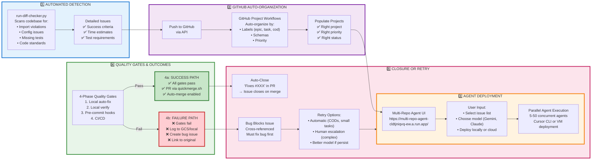
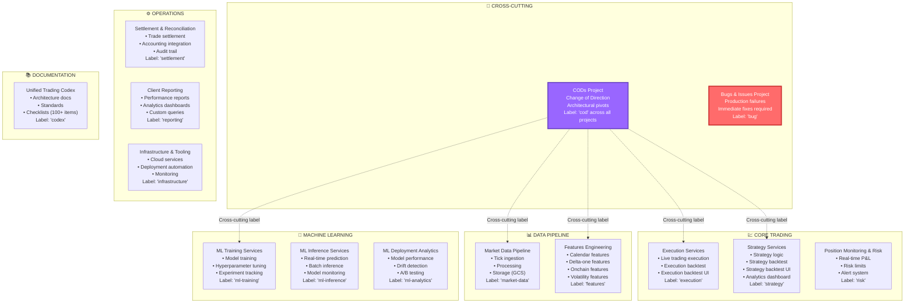
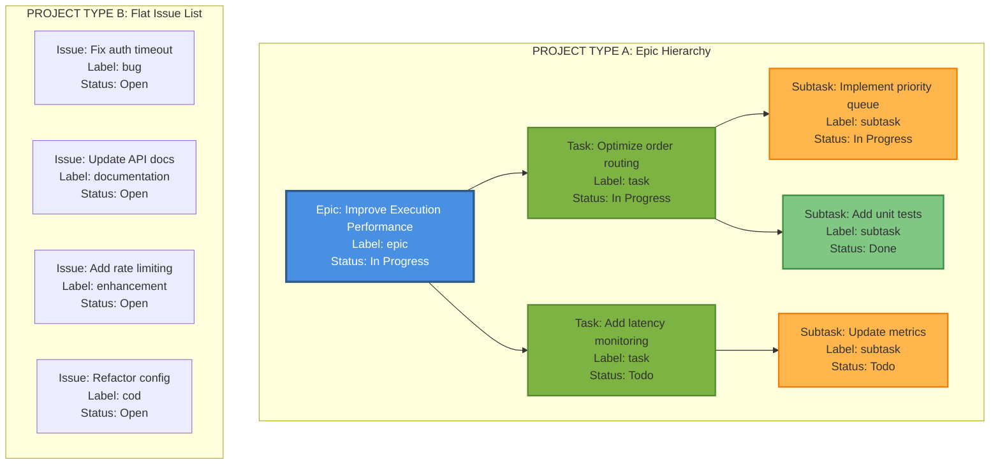
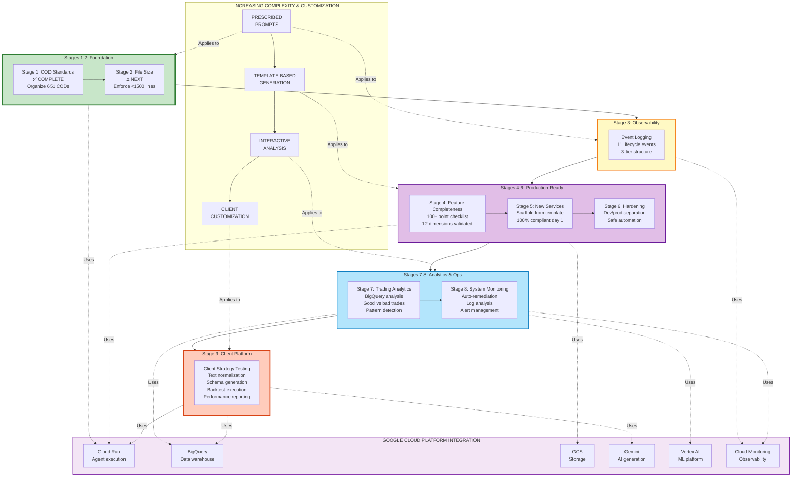
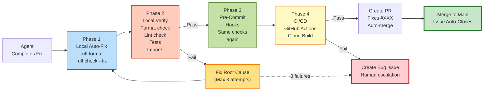
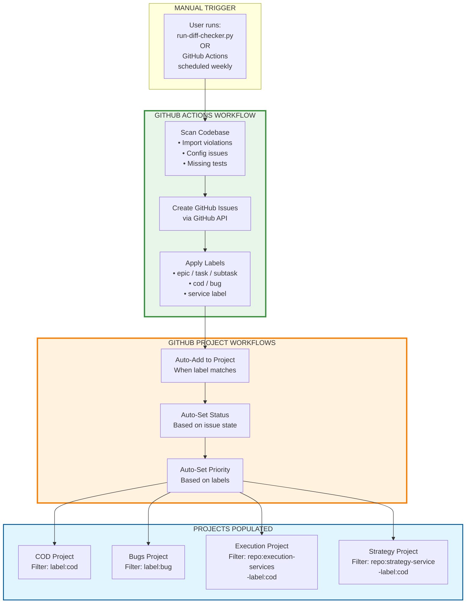

# Clean Workflow Diagrams - GitHub Integration

## 1. The 5-Step Autonomous Workflow

---

## 2. Complete Project Structure (15+ Projects)

---

## 3. Project Type Structures

---

## 4. The 9-Stage Maturity Progression

---

## 5. Quality Gates Detail (Simple)

---

## 6. GitHub Actions Integration

---

## Summary

### Key Principles:

1. **Distinct Workflows:** Each project has specific labels and automation rules
2. **Two Project Types:** Epic→Task→Subtask hierarchies AND flat issue lists
3. **Cross-Cutting CODs:** 'cod' label appears across all projects for architectural work
4. **5-Step Automation:** Detection → GitHub → Agents → Quality Gates → Close/Retry
5. **Progressive Autonomy:** 9 stages from simple (code standards) to complex (client platform)

### Google Cloud Integration:

- **Cloud Run:** Agent execution at scale
- **BigQuery:** Trading data warehouse & analytics
- **GCS:** Market data storage & logs
- **Gemini:** AI code generation & text normalization
- **Vertex AI:** ML training & deployment
- **Cloud Monitoring:** System observability

### Next Steps:

1. Automate Steps 1-2 via GitHub Actions (diff checker → issue creation)
2. Connect multi-repo UI to Cursor CLI / VM deployment
3. Implement bug→issue cross-referencing (4b failure path)
4. Scale to 5-50 parallel agents on Google Cloud Run
5. Iterate through stages 1-9 progressively
